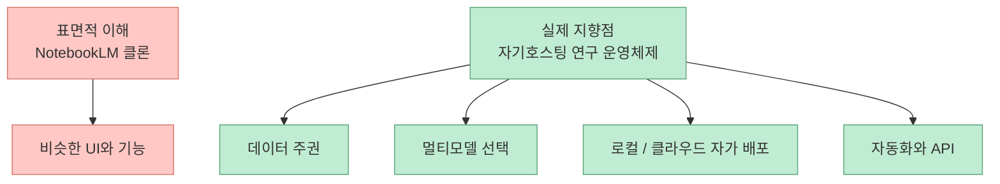
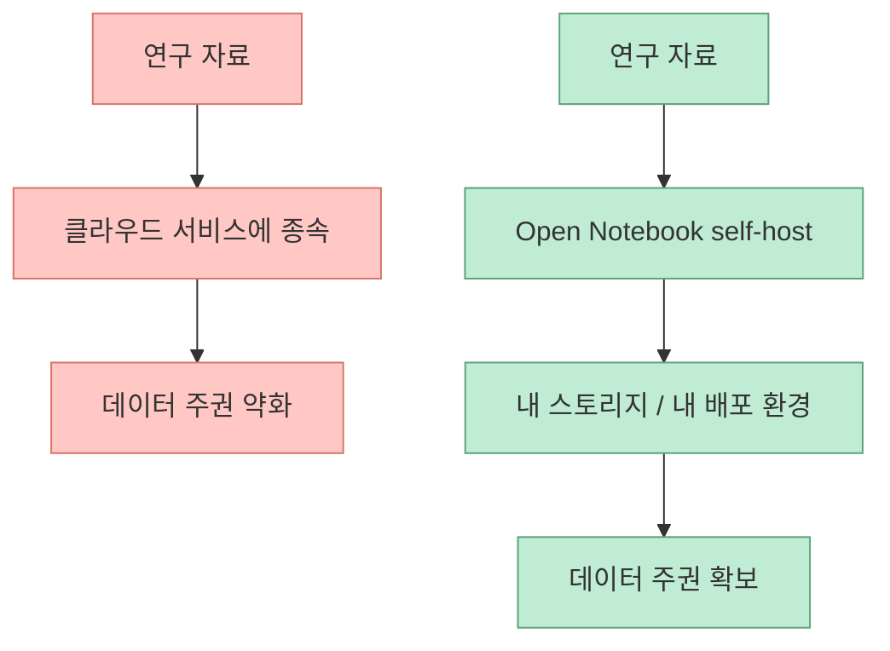
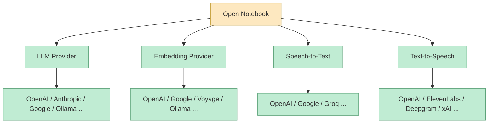
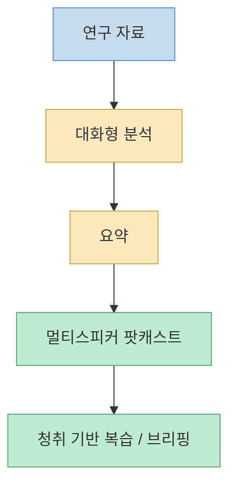
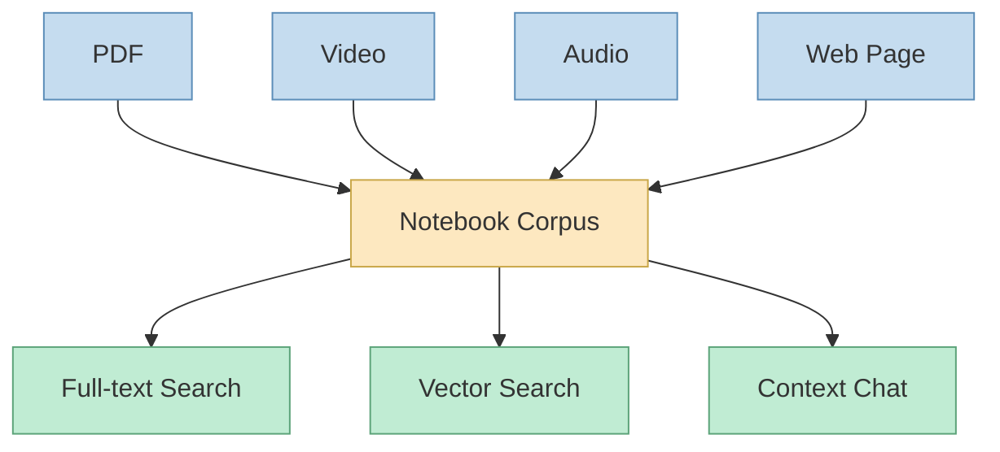
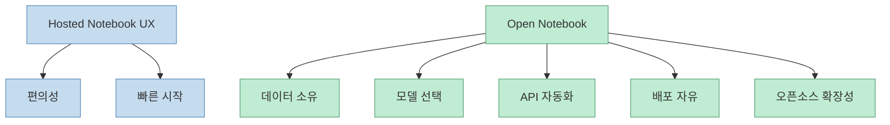

`open-notebook`을 처음 보면 가장 먼저 눈에 띄는 문구는 “NotebookLM의 오픈소스 구현”입니다. 그래서 많은 사람이 이 프로젝트를 그냥 “구글 서비스의 로컬 클론” 정도로 이해하기 쉽습니다. 하지만 최신 README를 자세히 읽어 보면 방향이 그보다 더 넓습니다. 이 저장소가 강조하는 것은 단순 모방이 아니라, **프라이버시를 유지한 채 다중 AI 공급자와 다중 콘텐츠 형식을 묶어 자기호스팅형 연구 환경을 만드는 것** 입니다. [GitHub](https://github.com/lfnovo/open-notebook) [README](https://github.com/lfnovo/open-notebook/blob/main/README.md)

특히 이 프로젝트는 NotebookLM의 “자료를 넣고 대화한다”는 경험을 복제하는 데서 멈추지 않습니다. 데이터 주권, 제공자 선택권, 다중 화자 팟캐스트, 전체 REST API, 로컬 Ollama, 벡터 검색, 전문 검색, 다국어 UI까지 같이 가져가려 합니다. 그래서 더 정확히는 **NotebookLM 대체 UI** 라기보다, **개인/팀이 자기 연구 자산을 직접 소유하는 AI 노트북 운영체제** 에 가깝습니다. [README](https://github.com/lfnovo/open-notebook/blob/main/README.md) [GitHub API](https://api.github.com/repos/lfnovo/open-notebook)
<!--more-->

## Sources

- https://github.com/lfnovo/open-notebook
- https://github.com/lfnovo/open-notebook/blob/main/README.md
- https://www.open-notebook.ai

## 1. 이 프로젝트를 NotebookLM “클론”으로만 보면 절반만 본다

README의 대표 문구는 “A private, multi-model, 100% local, full-featured alternative to Notebook LM”입니다. 여기서 중요한 단어는 `alternative`보다도 `private`, `multi-model`, `100% local`입니다. [README](https://github.com/lfnovo/open-notebook/blob/main/README.md)

즉 목표는 단순한 UI 복제가 아닙니다.

- 자료를 넣고 질문하는 인터페이스를 흉내 내는 것
- 가 아니라
- 그 경험을 **자기 데이터·자기 모델·자기 배포 환경** 위로 가져오는 것

입니다.

이 차이를 이해해야 왜 이 저장소가 빠르게 커지는지도 이해할 수 있습니다.

## 2. 핵심 경쟁 축은 “더 좋은 답변”보다 “누가 내 연구 데이터를 소유하는가”다

README는 Open Notebook의 첫 번째 가치로 data control을 둡니다. 민감한 연구 데이터가 완전히 private하게 남는다는 점, cloud-only 종속이 아니라는 점, self-hosted로 anywhere deployment가 가능하다는 점을 반복해서 강조합니다. [README](https://github.com/lfnovo/open-notebook/blob/main/README.md)

이건 단순 보안 수사가 아닙니다. 연구 노트북 도구의 진짜 자산은 질문창이 아니라:

- 업로드한 PDF
- 수집한 웹페이지
- 회의 녹취
- 개인 메모
- 내가 정제한 요약과 대화 맥락

이기 때문입니다. 즉 무엇이 LLM으로 들어가느냐보다, **그 지식 자산이 누구 인프라에 보관되고 누구 통제 아래 있느냐** 가 더 중요할 수 있습니다.

즉 Open Notebook은 “질문 잘하는 앱”보다 **지식 자산을 내 쪽으로 다시 가져오는 장치** 로 읽는 편이 더 정확합니다.

## 3. 다중 모델 지원은 단순 옵션 추가가 아니라 vendor lock-in 해제 장치다

README는 18개 이상의 provider를 지원한다고 밝히고, support matrix를 꽤 자세히 제공합니다. OpenAI, Anthropic, Google, Vertex AI, Ollama, Azure OpenAI, OpenRouter, DashScope, MiniMax, DeepSeek, xAI 등 다양한 공급자가 LLM / embedding / STT / TTS 차원에서 나뉘어 지원됩니다. [README](https://github.com/lfnovo/open-notebook/blob/main/README.md)

이 구조의 의미는 분명합니다.

- 어떤 모델은 대화에 강하고
- 어떤 모델은 임베딩 비용이 싸고
- 어떤 모델은 음성 합성에 유리하며
- 어떤 모델은 아예 로컬에서 굴릴 수 있습니다

즉 Open Notebook은 “하나의 모델을 위한 앱”이 아니라, **연구 파이프라인 각 층을 다른 공급자로 조합할 수 있는 인터페이스** 를 지향합니다.

이건 결국 cost optimization과 provider switching 자유를 동시에 줍니다. NotebookLM 스타일 경험을 하되, **모델 선택권은 사용자가 쥐는 구조** 인 셈입니다.

## 4. Open Notebook이 팟캐스트를 전면에 두는 점도 흥미롭다

README는 professional podcast generation을 굵직한 기능으로 내세웁니다. 특히 NotebookLM과의 비교표에서, Open Notebook은 1~4명의 화자와 custom profiles를 지원하고, NotebookLM은 2-speaker only로 설명합니다. [README](https://github.com/lfnovo/open-notebook/blob/main/README.md)

이 차이는 단순 미디어 기능 차이로 끝나지 않습니다. 왜냐하면 연구 도구가 점점:

- 읽는 인터페이스
- 질문하는 인터페이스
- 듣는 인터페이스

를 동시에 가져가고 있기 때문입니다. 즉 Open Notebook은 단순 노트 앱이 아니라, **문서 → 대화 → 오디오 브리핑** 으로 이어지는 멀티모달 연구 환경을 지향합니다.

이 점에서 Open Notebook은 “읽고 묻는 도구”를 넘어, **지식을 오디오 산출물로 재포장하는 제작 도구** 로도 볼 수 있습니다.

## 5. 콘텐츠 형식 지원이 넓다는 건 곧 개인 지식 파이프라인을 한곳에 모으겠다는 뜻이다

README는 multi-modal content organization을 강조합니다. PDFs, videos, audio, web pages 등이 들어오고, 그 위에서 full-text search와 vector search, context-aware chat이 돌아갑니다. [README](https://github.com/lfnovo/open-notebook/blob/main/README.md)

이 말은 결국 연구 입력 형식을 하나로 표준화하려 한다는 뜻입니다.

- 문서는 PDF로
- 강의는 비디오/오디오로
- 최신 정보는 웹페이지로
- 메모와 정리는 노트 형태로

들어오지만, 사용자는 그것들을 한 노트북 안에서 검색하고 대화하게 됩니다.

즉 이 프로젝트의 진짜 목표는 기능 나열이 아니라, **흩어진 연구 입력을 하나의 질의 가능한 코퍼스로 만드는 것** 입니다.

## 6. self-hosting 경험을 최대한 낮은 마찰로 만들려는 점도 눈여겨볼 만하다

README의 Quick Start는 아주 공격적으로 단순화되어 있습니다.

- Docker Desktop 설치
- `docker-compose.yml` 받기
- 암호화 키 바꾸기
- `docker compose up -d`
- 브라우저 열기
- Settings에서 API key 넣기

라는 흐름입니다. 심지어 prerequisites에 “Docker Desktop만 있으면 된다”고 써 놓습니다. [README](https://github.com/lfnovo/open-notebook/blob/main/README.md)

이건 기술적으로 새로운 내용은 아닙니다. 하지만 제품 관점에서는 중요합니다. self-hosted 도구가 아무리 좋아도, 첫 실행 진입 장벽이 높으면 대부분은 거기서 멈춥니다. Open Notebook은 그걸 의식해서:

- 2분 Quick Start
- Ollama용 예제 compose
- source 설치 문서
- troubleshooting
- Discord
- installation assistant

까지 마련해 둡니다.

즉 스스로를 “개발자만 쓰는 저장소”가 아니라 **설치 가능한 제품** 으로 취급하고 있습니다.

## 7. NotebookLM과의 비교표가 말해 주는 핵심은 기능 승부보다 통제권 승부다

README의 비교표는 기능만 비교하지 않습니다. Privacy & Control, AI Provider Choice, API Access, Deployment, Customization, Cost 같은 항목을 전면에 둡니다. [README](https://github.com/lfnovo/open-notebook/blob/main/README.md)

여기서 드러나는 메시지는 명확합니다.

- NotebookLM이 더 polished할 수는 있다
- 하지만 Open Notebook은 더 많은 통제권을 준다

즉 이 프로젝트는 “NotebookLM보다 더 똑똑하다”를 주장하기보다, **더 많이 소유하고 더 많이 바꿀 수 있다** 는 가치를 앞세웁니다.

그래서 이 프로젝트의 경쟁 축은 AI 답변 품질 단독이 아니라, **지식 환경 전체의 소유권과 구성 가능성** 입니다.

## 8. 현재 규모도 이미 하나의 신호다

GitHub API 기준으로 2026년 6월 6일 현재 `lfnovo/open-notebook`은:

- 스타 `26,091`
- 포크 `3,000`
- 오픈 이슈 `148`
- 기본 브랜치 `main`

상태입니다. [GitHub API](https://api.github.com/repos/lfnovo/open-notebook)

이 정도 규모가 되면 프로젝트는 자연스럽게:

- 더 많은 provider 지원
- 더 많은 설치 시나리오
- 더 많은 사용자 워크플로
- 더 빠른 troubleshooting

을 요구받게 됩니다. README가 install assistant, multilingual docs, quick fixes, Discord support를 함께 제공하는 것도 이런 맥락에서 읽어야 합니다. 즉 이미 단순 프로토타입을 지나, **광범위한 사용자를 받는 제품형 오픈소스** 로 움직이고 있습니다.

## 핵심 요약

- Open Notebook은 NotebookLM 스타일 경험을 제공하지만, 목표는 단순 클론이 아니다
- 이 프로젝트의 진짜 핵심은 데이터 주권, 멀티모델, 자기호스팅, 자동화 가능한 API 표면이다
- 18개 이상 provider 지원은 vendor lock-in을 풀고 파이프라인 층별 최적화를 가능하게 한다
- 팟캐스트 생성은 이 도구가 문서 질의 도구를 넘어 멀티모달 연구 환경으로 가고 있음을 보여 준다
- PDF, 비디오, 오디오, 웹페이지를 하나의 searchable corpus로 묶는 점이 중요하다
- Docker 중심 2분 Quick Start는 self-hosting 마찰을 낮춰 실제 제품으로 쓰이게 하려는 전략이다
- 경쟁 포인트는 “더 좋은 답변”보다 “누가 연구 자산을 더 많이 소유하고 통제하는가”에 있다

## 결론

Open Notebook이 흥미로운 이유는 NotebookLM을 닮았기 때문이 아닙니다. 더 본질적인 이유는, NotebookLM이 보여 준 연구 노트북 경험을 **자기 데이터, 자기 모델, 자기 배포 환경 위로 다시 가져오려는 시도** 이기 때문입니다. 그래서 이 프로젝트는 단순한 오픈소스 복제품보다, 앞으로 개인과 팀이 AI 연구 환경을 어떻게 소유할 것인가를 보여 주는 하나의 방향성에 가깝습니다.
