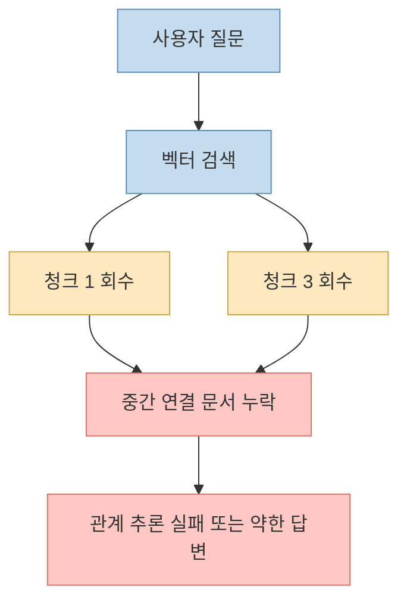
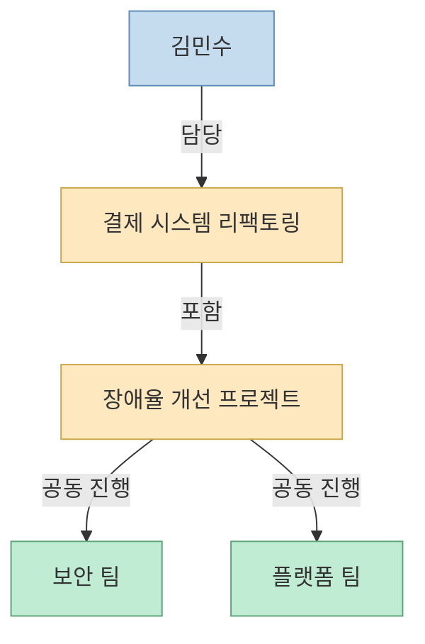
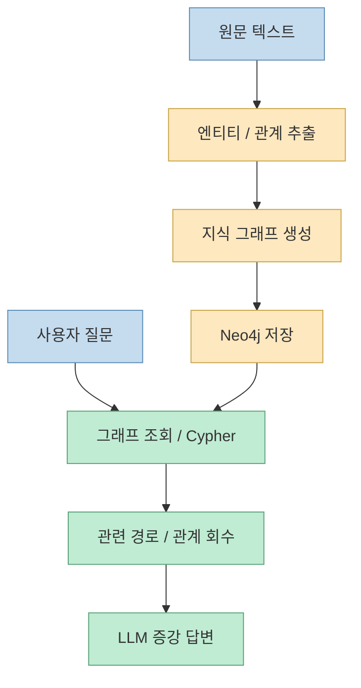
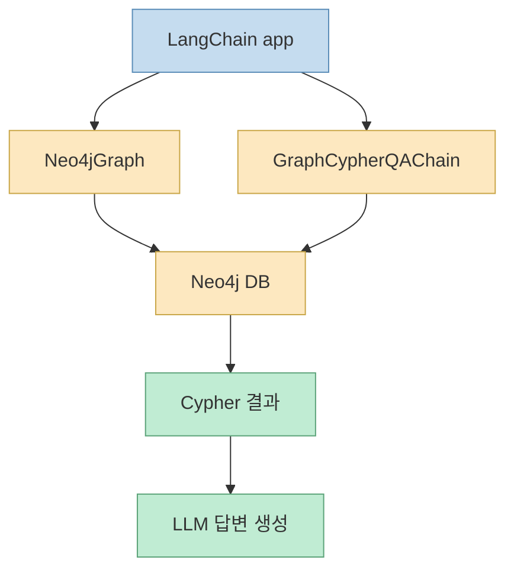
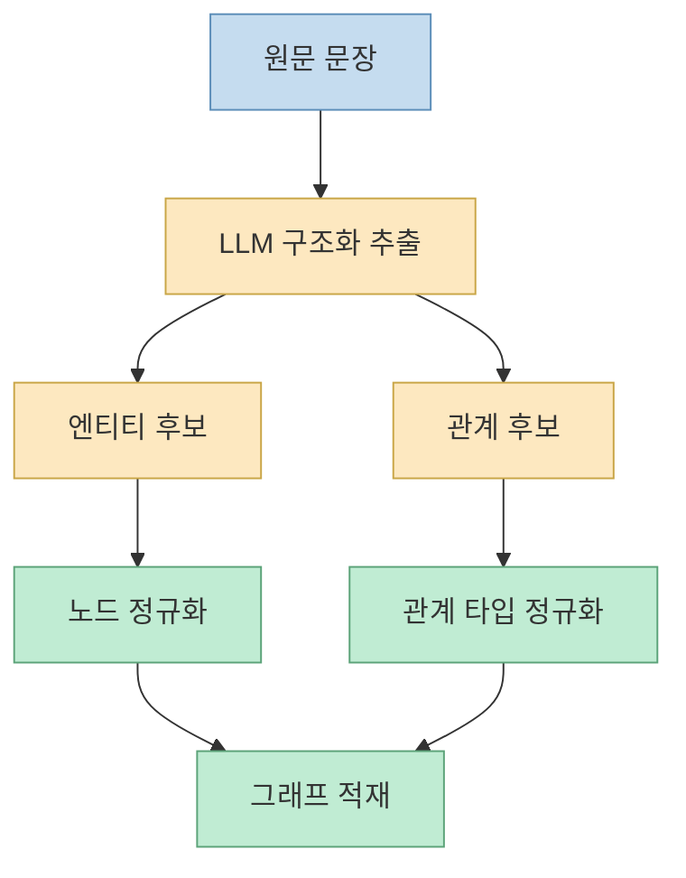
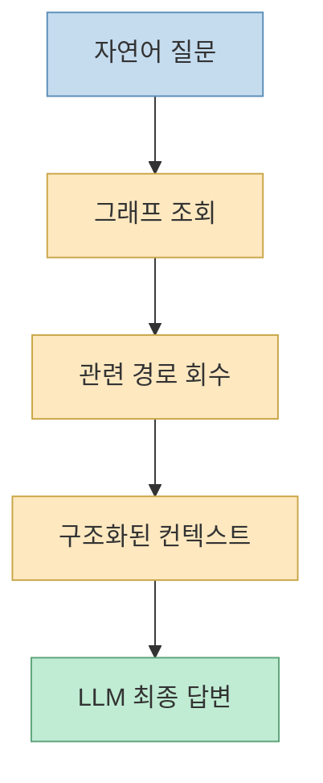

이 영상은 Microsoft의 특정 `GraphRAG` 패키지를 깊게 파는 튜토리얼이라기보다, **왜 벡터 기반 RAG만으로는 관계형 질문이 자주 막히는지** 를 설명한 뒤, 이를 **지식 그래프 + 그래프 DB + LangChain** 조합으로 어떻게 풀 수 있는지 보여 주는 입문 영상에 가깝습니다. 발표자는 먼저 청크 기반 RAG가 놓치는 문맥 단절과 다중 홉 관계 문제를 짚고, 그 다음에는 이를 노드와 엣지로 연결된 `knowledge graph`로 바꿔 두면 질의 시 탐색 경로가 생긴다고 설명합니다. 영상 후반부에서는 `Neo4j Desktop`을 띄우고, `LangChain`의 `Neo4jGraph` 계열 도구를 이용해 텍스트를 그래프로 적재한 뒤, 자연어 질문을 그래프 조회와 결합하는 흐름까지 시연합니다. [영상 0:36](https://youtu.be/yWyJKCZG990?t=36) [영상 10:20](https://youtu.be/yWyJKCZG990?t=620) [영상 21:48](https://youtu.be/yWyJKCZG990?t=1308)

이 글에서는 영상을 그대로 따라 요약하는 대신, 발표 내용의 구조를 조금 더 명확하게 다시 세웁니다. 핵심은 세 가지입니다. 첫째, GraphRAG는 “벡터 검색을 버리는 기술”이 아니라 **관계 탐색 레이어를 앞단에 추가하는 구조** 로 이해하는 편이 정확합니다. 둘째, `knowledge graph`와 `graph database`는 같은 말이 아니라, **의미 구조** 와 **저장/질의 엔진** 을 나눠서 봐야 혼동이 줄어듭니다. 셋째, `Neo4j`와 `LangChain` 실습은 단순 데모가 아니라 “텍스트 → 그래프 추출 → Cypher/그래프 조회 → LLM 답변 생성”이라는 GraphRAG의 최소 파이프라인을 압축해서 보여 줍니다. [영상 19:09](https://youtu.be/yWyJKCZG990?t=1149) [Neo4j Docs](https://neo4j.com/docs/getting-started/graph-database/) [LangChain Docs](https://docs.langchain.com/oss/python/integrations/providers/neo4j/)
<!--more-->

## Sources

- https://youtu.be/yWyJKCZG990?si=bqHM0FvjT0F92BsQ
- https://neo4j.com/docs/getting-started/graph-database/
- https://neo4j.com/docs/getting-started/appendix/graphdb-concepts/
- https://docs.langchain.com/oss/python/integrations/providers/neo4j/
- https://docs.langchain.com/oss/python/integrations/graphs/neo4j_cypher

## 1. 영상이 먼저 짚는 것은 GraphRAG가 아니라 naive RAG의 두 가지 한계다

발표자는 시작부터 “GraphRAG가 대단하다”보다 “기존 RAG가 어디서 막히는가”를 먼저 설명합니다. 첫 번째 한계는 **청크 경계에서 문맥이 끊긴다** 는 점입니다. 영상에서는 `VIP 고객은 수수료 면제 대상이다`, `단 해외송금 수수료는 면제 대상이 아니다`, `2025년 3월 이후 ...` 같은 정보가 서로 다른 청크에 나뉘면, 검색 결과가 일부만 회수되어 잘못된 답변으로 이어질 수 있다고 예를 듭니다. 즉 RAG가 문서를 잘게 쪼개는 순간, 문장 사이에 있던 원래의 논리 연결이 약해질 수 있다는 이야기입니다. [영상 2:32](https://youtu.be/yWyJKCZG990?t=152) [영상 3:03](https://youtu.be/yWyJKCZG990?t=183)

두 번째 한계는 **관계형 질문에 필요한 중간 문서가 빠지면 multi-hop reasoning이 끊긴다** 는 점입니다. 영상 속 예시에서는 `김민수 -> 결제 시스템 리팩토링`, `그 리팩토링 -> 장애율 개선 프로젝트`, `그 프로젝트 -> 보안 팀과 플랫폼 팀 공동 진행`이라는 세 문장이 따로 있을 때, “김민수와 보안 팀은 어떤 관계야?”라는 질문에 답하려면 세 문장을 모두 이어야 합니다. 그런데 top-k 검색에서 중간 연결 고리가 빠지면 모델은 각 문장을 이해하고도 둘 사이 관계를 완성하지 못합니다. 발표자가 GraphRAG를 소개하는 이유가 바로 여기에 있습니다. [영상 5:10](https://youtu.be/yWyJKCZG990?t=310) [영상 5:47](https://youtu.be/yWyJKCZG990?t=347)

그래서 이 영상은 GraphRAG를 “검색 성능이 더 좋은 최신 유행”으로 설명하지 않습니다. 더 정확히는, **청크 유사도만으로는 복원하기 어려운 관계 정보를 별도 구조로 보존하려는 시도** 로 설명합니다. 이 출발점은 꽤 중요합니다. 왜냐하면 GraphRAG를 이해할 때도 결국 질문은 “그래프가 멋져서 쓰는가?”가 아니라 “어떤 종류의 질문이 벡터 검색만으로는 자꾸 빠지는가?”가 되어야 하기 때문입니다. [영상 6:02](https://youtu.be/yWyJKCZG990?t=362)

## 2. 발표자가 말하는 knowledge graph는 '답'이 아니라 '데이터 지도'다

영상 중반부에서 발표자는 지식 그래프를 아주 직관적으로 설명합니다. 텍스트 안의 사람, 팀, 프로젝트, 목표 같은 객체를 **노드** 로 만들고, `담당한다`, `포함된다`, `공동으로 진행한다` 같은 연결을 **엣지** 로 만든다는 것입니다. 이 설명은 Neo4j 공식 문서의 property graph 개념과도 정확히 맞닿아 있습니다. Neo4j는 데이터를 table 대신 nodes, relationships, properties로 저장한다고 설명하고, 관계는 시작 노드, 끝 노드, 타입, 방향을 가진다고 정리합니다. [영상 10:56](https://youtu.be/yWyJKCZG990?t=656) [영상 11:40](https://youtu.be/yWyJKCZG990?t=700) [Neo4j Graph DB](https://neo4j.com/docs/getting-started/graph-database/) [Neo4j Concepts](https://neo4j.com/docs/getting-started/appendix/graphdb-concepts/)

영상에서 특히 좋은 비유는 **지도를 보고 여정을 떠난다** 는 표현입니다. `김민수`와 `보안 팀`을 직접 잇는 문장이 없어도, 그래프 안에 `김민수 -> 결제 시스템 리팩토링 -> 장애율 개선 프로젝트 -> 보안 팀` 경로가 있으면 질의 엔진은 그 경로를 따라가며 문맥을 조립할 수 있습니다. 이게 벡터 RAG에서 어려웠던 관계 복원의 핵심 차이입니다. 벡터 RAG가 주로 “비슷한 문장”을 가져오는 구조라면, 여기서는 “어떤 경로로 연결되는가”가 먼저 보입니다. [영상 11:53](https://youtu.be/yWyJKCZG990?t=713) [영상 12:27](https://youtu.be/yWyJKCZG990?t=747)

여기서 헷갈리기 쉬운 점도 영상이 짚어 줍니다. **knowledge graph** 는 의미 관계를 표현한 구조이고, **graph database** 는 그것을 저장하고 질의하는 엔진입니다. 발표자는 벡터가 저장된 공간이 벡터 DB인 것처럼, 지식 그래프가 저장된 공간이 그래프 DB라고 설명합니다. 이 구분을 해 두면 GraphRAG를 볼 때 “그래프 DB를 쓰면 자동으로 GraphRAG가 되는가?” 같은 오해를 줄일 수 있습니다. GraphRAG는 단순 저장소가 아니라, 그래프를 검색 증강 답변에 실제로 연결하는 응용 파이프라인이기 때문입니다. [영상 21:00](https://youtu.be/yWyJKCZG990?t=1260) [영상 21:24](https://youtu.be/yWyJKCZG990?t=1284)

## 3. 이 영상에서의 GraphRAG는 '그래프 검색 후 증강'이라는 가장 기본적인 구조다

영상 21분대에서 발표자는 GraphRAG를 꽤 명시적으로 정의합니다. 먼저 지식 그래프를 기반으로 검색하고, 그 검색한 내용을 바탕으로 LLM 답변을 증강 생성하는 시스템이 바로 GraphRAG라는 식입니다. 이 설명은 아주 기본적이지만 오히려 입문자에게는 중요합니다. 세상에는 community summary, global/local search, graph embedding, path ranking처럼 더 복잡한 GraphRAG 변형이 많지만, 이 영상은 그중 가장 먼저 이해해야 할 **최소 구조** 를 보여 줍니다. [영상 21:06](https://youtu.be/yWyJKCZG990?t=1266) [영상 21:19](https://youtu.be/yWyJKCZG990?t=1279)

즉 이 영상에서의 GraphRAG 파이프라인은 대략 이렇게 읽으면 됩니다.

1. 텍스트 문서에서 엔티티와 관계를 추출한다. 
2. 그것을 노드와 엣지로 그래프 DB에 넣는다. 
3. 질문이 들어오면 그래프를 순회하거나 Cypher로 조회한다. 
4. 조회 결과를 구조화된 컨텍스트로 LLM에 넘긴다. 
5. LLM이 최종 자연어 답변을 생성한다.

이 구조가 중요한 이유는, 발표자의 데모가 그냥 “Neo4j 예제”로 보이지 않게 해 주기 때문입니다. 사실 영상 후반 실습은 GraphRAG 전체를 아주 작은 toy example로 축약한 것입니다. 문장 세 개만 가지고도 관계 그래프를 만들고, 그 관계를 다시 질의에 연결할 수 있다면, 큰 문서 집합에서도 기본 원리는 같다는 뜻이니까요. [영상 28:11](https://youtu.be/yWyJKCZG990?t=1691) [영상 33:03](https://youtu.be/yWyJKCZG990?t=1983)

## 4. 왜 Neo4j와 LangChain 조합이 입문 데모에 자주 쓰이는가

영상은 그래프 DB 후보로 `Neo4j`, `Amazon Neptune`, `Ontotext GraphDB`, `TigerGraph` 등을 언급하지만, 실습에서는 `Neo4j`를 택합니다. 이유는 입문 관점에서 분명합니다. Neo4j는 property graph 모델을 기준으로 노드, 관계, 속성을 다루는 방식이 명확하고, 공식 문서와 시각화 도구가 잘 갖춰져 있습니다. Neo4j 문서도 graph database의 핵심을 nodes, relationships, properties로 설명하고, Cypher를 통해 패턴 매칭 기반 질의를 수행하도록 안내합니다. [영상 22:01](https://youtu.be/yWyJKCZG990?t=1321) [영상 22:27](https://youtu.be/yWyJKCZG990?t=1347) [Neo4j Graph DB](https://neo4j.com/docs/getting-started/graph-database/) [Neo4j Cypher Intro](https://neo4j.com/docs/getting-started/cypher/)

LangChain 쪽도 영상 설명과 잘 맞습니다. 공식 문서에는 `langchain_neo4j` 패키지를 통해 `Neo4jGraph`, `GraphCypherQAChain`, `Neo4jVector` 등을 쓸 수 있다고 나옵니다. 특히 `GraphCypherQAChain`은 자연어 입력으로부터 Cypher를 생성해 그래프에서 관련 정보를 조회하는 래퍼로 설명되고, `Neo4jGraph`는 접속 정보와 스키마 갱신을 포함한 그래프 핸들러 역할을 합니다. 발표자가 데모에서 보여 준 “질문 → 그래프 조회 → 컨텍스트 → 답변” 구조와 거의 정확히 대응됩니다. [LangChain Provider Docs](https://docs.langchain.com/oss/python/integrations/providers/neo4j/) [LangChain Neo4j Integration](https://docs.langchain.com/oss/python/integrations/graphs/neo4j_cypher)

즉 영상의 실습 조합은 우연이 아닙니다. **Neo4j는 관계를 저장하고 시각화하기 쉽고, LangChain은 그 관계를 LLM 파이프라인 안에 끼워 넣기 쉽기 때문** 입니다. 입문자 입장에서는 바로 이 점 때문에 두 도구를 함께 배우는 것이 효율적입니다. 하나는 그래프의 저장/조회 층이고, 다른 하나는 그 조회를 LLM 호출 흐름과 묶는 오케스트레이션 층이기 때문입니다. [영상 27:18](https://youtu.be/yWyJKCZG990?t=1638) [영상 32:14](https://youtu.be/yWyJKCZG990?t=1934)

## 5. 영상 후반 실습의 진짜 포인트는 '텍스트를 그래프로 바꾸는 단계'다

실습 구간에서 발표자는 아주 짧은 문서를 직접 노드와 엣지로 손코딩하지 않습니다. 대신 LLM을 사용해 텍스트에서 노드와 관계를 추출해 그래프로 만든다고 설명합니다. 이것이 중요합니다. GraphRAG의 병목은 보통 조회 단계보다도 **원문을 어떤 스키마와 어떤 추출 품질로 그래프로 바꿀 것인가** 에 더 많이 걸리기 때문입니다. 영상에서도 “문서를 언어 모델로 호출해서 문서에서 노드와 엣지를 뽑는다”는 점이 핵심으로 등장합니다. [영상 28:05](https://youtu.be/yWyJKCZG990?t=1685) [영상 28:13](https://youtu.be/yWyJKCZG990?t=1693)

이 단계가 흔히 과소평가되지만, 실제로는 GraphRAG 품질의 절반 이상이 여기서 갈립니다.

- 어떤 엔티티를 노드로 볼 것인가 
- 어떤 동사를 관계 타입으로 승격할 것인가 
- 프로젝트와 목표를 별도 노드로 나눌 것인가 
- 문서 출처와 시점 정보를 속성으로 저장할 것인가 
- 동일 개체 중복을 어떻게 해소할 것인가

이런 결정이 모두 그래프의 질을 바꿉니다. 영상은 30분 입문이라 깊게 들어가진 않지만, 후반부 데모를 보면 이 단계가 단순 ETL이 아니라 **지식 구조화 설계** 라는 점을 분명히 읽을 수 있습니다. [영상 29:22](https://youtu.be/yWyJKCZG990?t=1762) [영상 34:05](https://youtu.be/yWyJKCZG990?t=2045)

그래서 이 영상을 보고 바로 실무에 옮긴다면, 제일 먼저 해야 할 질문은 “어떤 그래프 DB를 쓸까?”보다 “우리 문서에서 반복적으로 등장하는 엔티티와 관계 타입은 무엇인가?”가 되어야 합니다. 그래프가 잘못 설계되면 이후 질의도 좋을 수가 없기 때문입니다.

## 6. 데모의 마지막 질문이 보여 주는 것: GraphRAG의 핵심은 더 똑똑한 생성이 아니라 더 구조적인 검색이다

영상 마지막 데모에서 발표자는 “김민수와 보안 팀은 어떤 관계야?”라는 질문을 던집니다. 그러면 체인이 그래프를 조회하고, `김민수 -> 결제 시스템 리팩토링 -> 보안 팀과 연결된 작업` 같은 경로를 컨텍스트로 회수한 뒤, 그 문맥을 바탕으로 “김민수는 결제 시스템 리팩토링을 담당했고 그 작업에서 보안 팀과 협업한 관계”라는 답을 만듭니다. 이 흐름은 기술적으로 중요한 메시지를 줍니다. GraphRAG의 장점은 LLM이 갑자기 더 똑똑해진 게 아니라, **모델이 볼 수 있는 검색 컨텍스트가 더 구조적이 되었다** 는 데 있습니다. [영상 32:30](https://youtu.be/yWyJKCZG990?t=1950) [영상 33:08](https://youtu.be/yWyJKCZG990?t=1988) [영상 33:43](https://youtu.be/yWyJKCZG990?t=2023)

즉 생성 단계는 여전히 마지막 단계일 뿐입니다. 차이를 만든 것은:

- 문서가 청크로만 남아 있지 않고 
- 관계 그래프로 정리되어 있으며 
- 질문 시 그래프 순회나 Cypher 조회가 먼저 일어나고 
- 그 결과가 LLM에 전달된다는 점입니다

이 관점은 실무에서도 유효합니다. 질문이 사실 확인형이 아니라 **관계 파악형**, **영향도 탐색형**, **누가 누구와 어떻게 연결되는가** 같은 형태일수록 GraphRAG가 강점을 가질 가능성이 큽니다. 반대로 단순 유사 문서 회수만으로 충분한 업무라면, 굳이 그래프 구축 비용을 들일 이유가 약할 수도 있습니다. 영상도 GraphRAG가 무조건 정답이라고 말하지는 않고, 방대한 데이터에서 관계가 이미 구성되어 있을 때 검색 지연과 관계 탐색 면에서 장점이 있을 수 있다고 소개합니다. [영상 19:24](https://youtu.be/yWyJKCZG990?t=1164) [영상 20:04](https://youtu.be/yWyJKCZG990?t=1204)

## 핵심 요약

- 이 영상의 핵심은 `GraphRAG 소개` 자체보다 **naive RAG의 청크 단절과 multi-hop 관계 손실** 을 먼저 보여 준다는 데 있습니다. 
- 발표자가 말하는 `knowledge graph`는 사람, 팀, 프로젝트, 목표 같은 객체를 노드로, `담당한다`, `포함된다`, `공동 진행한다` 같은 연결을 엣지로 바꾼 **데이터 지도** 입니다. 
- 영상에서의 GraphRAG는 복잡한 최신 변형보다, **그래프 검색 → 컨텍스트 회수 → LLM 답변 생성** 이라는 최소 구조를 설명하는 입문형 모델입니다. 
- `Neo4j`는 그래프 저장/질의 층, `LangChain`은 그 질의를 LLM 파이프라인과 묶는 오케스트레이션 층으로 이해하면 흐름이 깔끔해집니다. 
- 실습의 진짜 포인트는 `텍스트를 그래프로 바꾸는 단계` 이며, 여기서 엔티티/관계 스키마를 어떻게 정의하느냐가 GraphRAG 품질을 크게 좌우합니다. 
- GraphRAG의 장점은 “더 좋은 생성 모델”이 아니라 **더 구조적인 검색 컨텍스트** 에서 나옵니다.

## 결론

이 영상은 GraphRAG를 과장하지 않고, **언제 왜 필요한가** 를 초보자 관점에서 비교적 정직하게 설명하는 입문 자료입니다. 가장 중요한 메시지는 단순합니다. 벡터 RAG는 “비슷한 것을 찾는” 데 강하지만, 질문이 점점 관계형이 되고 경로형이 되면 **데이터를 연결해 둔 구조 자체** 가 필요해집니다. 그때 등장하는 것이 GraphRAG입니다.

따라서 이 영상을 보고 바로 실습으로 넘어간다면 순서는 이렇게 잡는 것이 좋습니다. 먼저 우리 데이터에 반복되는 엔티티와 관계를 정의하고, 그다음 그 구조를 Neo4j 같은 그래프 DB에 담고, 마지막에 LangChain으로 질의-응답 루프를 묶는 것입니다. 결국 GraphRAG의 본질은 그래프를 쓰는 멋이 아니라, **LLM이 찾아와야 할 맥락을 더 잘 정리해 두는 방법** 에 있습니다.
