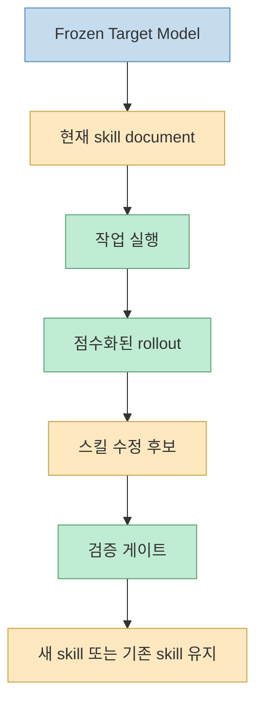
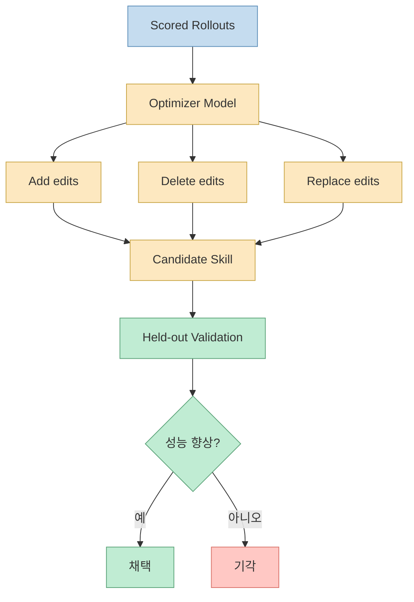
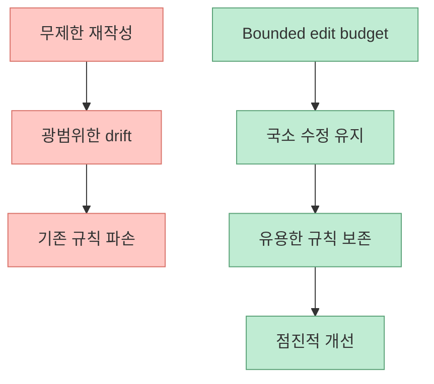
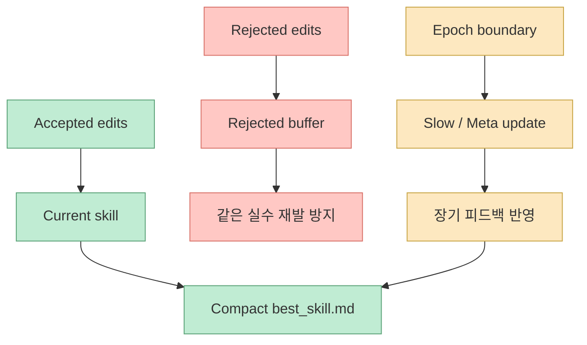
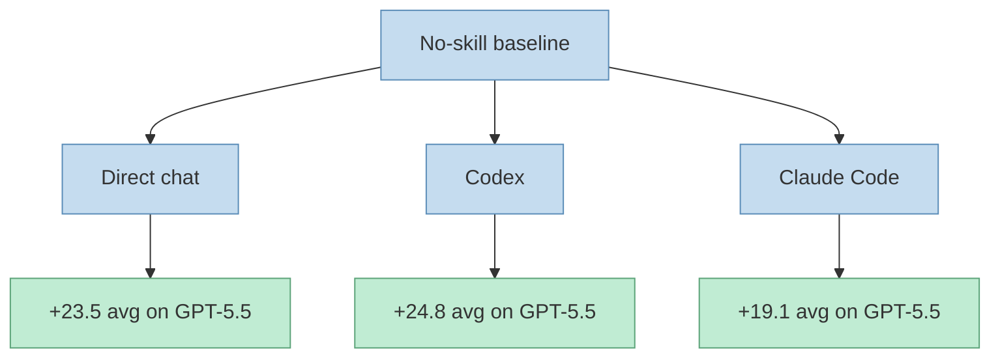
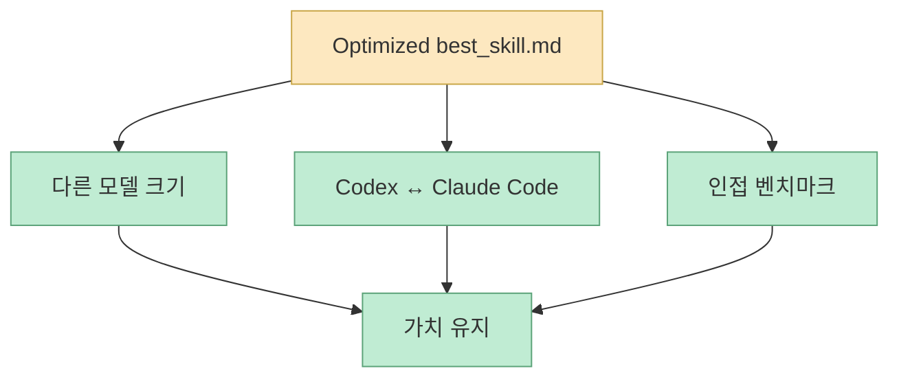

에이전트 스킬을 다룰 때 보통은 세 가지 정도의 접근이 많습니다. 사람이 직접 좋은 규칙을 써 주거나, 강한 모델로 one-shot 스킬을 생성하거나, 실패할 때마다 느슨하게 자기 수정하게 만드는 방식입니다. `SkillOpt` 논문은 이 세 가지를 모두 비판적으로 봅니다. 이유는 분명합니다. 이런 방식들은 스킬 자체를 **학습 가능한 대상** 으로 다루지 않고, 피드백이 들어와도 시작점보다 꾸준히 좋아진다는 보장이 약하기 때문입니다. 이 논문이 제안하는 핵심은 단순합니다. **모델 가중치는 고정한 채, 에이전트가 바깥에서 읽는 스킬 문서만 텍스트 공간에서 최적화하자** 는 것입니다. [arXiv](https://arxiv.org/abs/2605.23904) [SkillOpt Project](https://microsoft.github.io/SkillOpt/) [GitHub](https://github.com/microsoft/SkillOpt)

이 관점은 최근의 하네스 엔지니어링 흐름과도 아주 잘 맞습니다. 많은 팀이 모델을 fine-tune하기보다, `CLAUDE.md`, `SKILL.md`, 운영 규칙, 검증 루프 같은 외부 문서를 쌓고 있죠. SkillOpt는 바로 그 문서층을 “그냥 잘 써보자” 수준에서 멈추지 않고, **학습률, 미니배치, 검증 게이트, 리젝트 버퍼 같은 최적화 개념을 얹어 반복 학습시키는 방식** 으로 바꿉니다. [arXiv](https://arxiv.org/abs/2605.23904) [GitHub README](https://github.com/microsoft/SkillOpt)
<!--more-->

## Sources

- https://arxiv.org/abs/2605.23904
- https://microsoft.github.io/SkillOpt/
- https://github.com/microsoft/SkillOpt

## 1. SkillOpt의 출발점: 스킬을 “프롬프트”가 아니라 외부 상태로 본다

프로젝트 페이지와 논문 초록은 같은 주장을 반복합니다. SkillOpt는 compact natural-language skill document를 frozen agent의 trainable external state로 본다고 말합니다. 즉 모델 내부 가중치를 바꾸지 않고, 에이전트가 작업할 때 참조하는 스킬 문서만 바깥에서 계속 갱신합니다. [arXiv](https://arxiv.org/abs/2605.23904) [SkillOpt Project](https://microsoft.github.io/SkillOpt/)

이 framing이 중요한 이유는, 스킬을 프롬프트 문구로만 보면 “잘 썼다/못 썼다”의 감각적 문제로 남기 쉽기 때문입니다. 반면 외부 상태라고 보면:

- 현재 스킬 버전이 있고
- 그것으로 rollout을 돌리고
- 성과를 점수화하고
- 수정안을 만들고
- 검증 점수가 좋아질 때만 채택하는

식의 반복 개선 루프를 만들 수 있습니다.

즉 SkillOpt는 “모델을 훈련한다”가 아니라, **모델이 바깥에서 읽는 절차 문서를 훈련한다** 는 생각을 정면으로 밀고 갑니다.

## 2. 논문이 진짜로 제안하는 것은 text-space optimizer다

초록은 SkillOpt를 “the first systematic controllable text-space optimizer for agent skills”라고 부릅니다. 별도 optimizer model이 rollout 결과를 읽고, 단일 skill document에 대해 bounded add/delete/replace edits를 제안하며, 그 후보는 held-out validation score가 strict하게 좋아질 때만 받아들여진다는 설명입니다. [arXiv](https://arxiv.org/abs/2605.23904)

이 구조에서 핵심은 세 가지입니다.

- 수정은 자유서술이 아니라 add/delete/replace 같은 bounded edit다
- 업데이트는 항상 validation gate를 통과해야 한다
- 배포 시에는 optimizer가 사라지고 최종 `best_skill.md`만 남는다

즉 SkillOpt는 self-revision을 “아무렇게나 다시 써보는 것”이 아니라, **후보 생성 → 검증 → 채택** 이라는 optimizer 형태로 구조화합니다.

## 3. 왜 bounded edits가 중요한가: learning rate를 텍스트에서도 흉내 낸다

프로젝트 페이지는 이 점을 아주 잘 설명합니다. edit budget이 textual learning rate 역할을 하며, 너무 큰 rewrite가 유용한 규칙을 망가뜨리지 않도록 막아 준다고 말합니다. 프로젝트 페이지의 ablation 설명도 bounded textual learning rates가 destructive rewrites를 막으면서도 새 절차를 배울 만큼의 plasticity는 남겨 둔다고 정리합니다. [SkillOpt Project](https://microsoft.github.io/SkillOpt/)

이건 에이전트 프롬프트/스킬 수정에서 흔히 겪는 문제를 정확히 겨냥합니다. 강한 모델이 반성을 하며 스킬을 통째로 다시 쓰기 시작하면:

- 원래 잘 되던 규칙이 사라지고
- 문제와 상관없는 문장이 늘어나고
- 국소 개선 대신 전체 drift가 생기기 쉽습니다

SkillOpt는 이를 learning-rate budget으로 제어합니다.

즉 이 논문은 “텍스트도 너무 세게 업데이트하면 망가진다”는 점을 명시적으로 다룹니다.

## 4. rejected-edit buffer와 slow/meta update는 왜 들어가나

초록과 프로젝트 페이지는 rejected-edit buffer, epoch-wise slow/meta update를 안정화 장치로 제시합니다. rejected edit는 단순히 버려지는 게 아니라 negative feedback처럼 작동해, optimizer가 같은 나쁜 방향을 반복하지 않도록 돕습니다. slow/meta update는 더 긴 호라이즌의 피드백을 제공하면서, 배포 시점의 skill 자체를 불필요하게 부풀리지 않도록 합니다. [arXiv](https://arxiv.org/abs/2605.23904) [SkillOpt Project](https://microsoft.github.io/SkillOpt/)

즉 SkillOpt는 단순히 “좋은 edit를 남긴다” 수준이 아닙니다.

- 실패한 수정도 기억하고
- epoch 단위로 더 느린 갱신을 넣고
- optimizer 쪽 메모리를 따로 유지하면서
- deployment artifact는 여전히 작게 유지합니다

결국 SkillOpt는 텍스트 최적화를 “그때그때 수정”이 아니라, **실패 기억과 장기 업데이트를 포함한 학습 시스템** 으로 봅니다.

## 5. 결과가 왜 주목받는가: direct chat, Codex, Claude Code 전부에서 일관되게 먹힌다

논문 초록이 가장 강하게 내세우는 결과는 이것입니다. SkillOpt가 6개 벤치마크, 7개 target model, 3개 execution harness에서 총 52개 `(model, benchmark, harness)` 셀 전부에서 best or tied-best였고, human, one-shot LLM, Trace2Skill, TextGrad, GEPA, EvoSkill보다 셀 단위 경쟁에서도 앞섰다고 주장합니다. [arXiv](https://arxiv.org/abs/2605.23904)

특히 GPT-5.5 기준으로는:

- direct chat 평균 +23.5
- Codex agentic loop 평균 +24.8
- Claude Code 평균 +19.1

의 no-skill 대비 상승을 보고합니다. [arXiv](https://arxiv.org/abs/2605.23904) [SkillOpt Project](https://microsoft.github.io/SkillOpt/)

이 결과가 중요한 이유는, SkillOpt가 특정 UI나 특정 런타임에만 통하는 편법이 아니라 **스킬 아티팩트 자체를 더 잘 만든다** 는 주장으로 읽히기 때문입니다.

## 6. transfer 결과가 특히 중요하다: 스킬이 재사용 가능한 artifact처럼 행동한다

초록 마지막과 프로젝트 페이지의 Transfer 섹션은 optimized skill artifacts가 모델 스케일을 바꿔도, Codex와 Claude Code 같은 harness를 바꿔도, 심지어 인접 수학 벤치마크로 옮겨도 가치를 유지한다고 설명합니다. 프로젝트 페이지는 이를 “The exported skill behaves like a reusable artifact”라고 표현합니다. [arXiv](https://arxiv.org/abs/2605.23904) [SkillOpt Project](https://microsoft.github.io/SkillOpt/)

이 점은 실무적으로 매우 중요합니다. 우리가 스킬이나 운영 규칙을 만들 때 가장 바라는 것도 사실 이것이기 때문입니다.

- 특정 세션에서만 통하는 요령이 아니라
- 다른 모델에도 옮길 수 있고
- 다른 에이전트 하네스에도 옮길 수 있으며
- 새 문제군에도 어느 정도 일반화되는 문서

즉 SkillOpt가 잘 된다면, 최종 산출물은 prompt snippet이 아니라 **조직 자산처럼 재사용 가능한 `best_skill.md`** 가 됩니다.

이건 곧 “스킬은 휘발성 프롬프트가 아니라 학습 가능한 배포 자산이 될 수 있다”는 뜻입니다.

## 7. SkillOpt는 하네스 엔지니어링을 더 과학적으로 만들려는 시도다

실무에서 많은 팀이 이미 `SKILL.md`, `CLAUDE.md`, 규칙 파일, 훅 문서를 만들고 있습니다. 하지만 대부분은:

- 감으로 수정하고
- 잘되면 남기고
- 안 되면 다시 고칩니다

이런 식입니다. SkillOpt는 이걸 더 과학적인 루프로 바꾸려 합니다.

- benchmark config
- split directory
- num epochs
- batch size
- workers
- output history
- resume checkpoint
- best_skill artifact

같은 훈련 구조가 명시적으로 들어갑니다. 저장소 README도 training/eval/output structure를 매우 구체적으로 제공합니다. [GitHub README](https://github.com/microsoft/SkillOpt)

즉 이 프로젝트는 prompt engineering을 부정하는 게 아니라, **prompt/skill engineering을 optimizer discipline 아래 두려는 시도** 로 읽는 것이 맞습니다.

## 8. 이 논문의 한계와 현실적 해석도 분명히 해야 한다

그렇다고 해서 곧바로 “이제 사람은 스킬 안 써도 된다”거나 “모든 팀이 SkillOpt로 바로 스킬을 학습시키면 된다”는 뜻은 아닙니다. 저장소 README를 보면 여전히 데이터 split 준비, benchmark별 포맷 이해, backend credential 설정, target/optimizer model 선택 같은 실험 설정 비용이 큽니다. [GitHub README](https://github.com/microsoft/SkillOpt)

즉 현실적으로는:

- 반복적으로 중요한 업무가 있고
- 성공/실패를 점수화할 수 있으며
- held-out validation을 만들 수 있고
- 스킬 문서가 분명한 역할을 갖는 환경

에서 특히 강할 가능성이 큽니다.

다르게 말하면 SkillOpt는 일반 잡담 프롬프트보다, **검증 가능한 작업 절차를 가진 에이전트 스킬** 에 더 잘 맞는 접근입니다.

## 핵심 요약

- SkillOpt는 스킬 문서를 frozen agent의 trainable external state로 본다
- optimizer model이 rollout 결과를 읽고 add/delete/replace edit를 제안한다
- 후보는 held-out validation score가 strict하게 좋아질 때만 채택된다
- textual learning rate, rejected buffer, slow/meta update가 안정화 장치로 들어간다
- direct chat, Codex, Claude Code 모두에서 일관된 성능 향상을 주장한다
- 최종 산출물은 세션 안의 요령이 아니라 재사용 가능한 `best_skill.md` artifact다
- 이 연구의 진짜 의미는 하네스/스킬 엔지니어링을 감이 아닌 optimizer discipline으로 끌어오려는 데 있다

## 결론

SkillOpt가 흥미로운 이유는 “프롬프트를 자동으로 써 준다”는 데 있지 않습니다. 더 핵심적인 가치는, 우리가 이미 쓰고 있는 스킬·규칙·하네스 문서를 **학습률, 검증 게이트, 리젝트 버퍼를 가진 최적화 대상** 으로 다시 정의했다는 데 있습니다. 만약 이 방향이 더 일반화된다면, 앞으로의 에이전트 엔지니어링은 좋은 규칙을 한 번 잘 쓰는 일보다, **그 규칙 문서를 어떻게 반복적으로 훈련하고 배포 자산으로 관리하느냐** 로 이동할 가능성이 큽니다.
