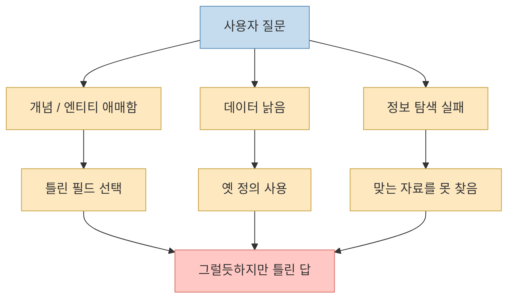
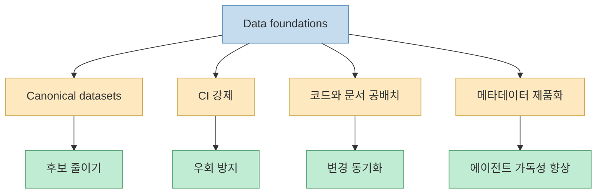
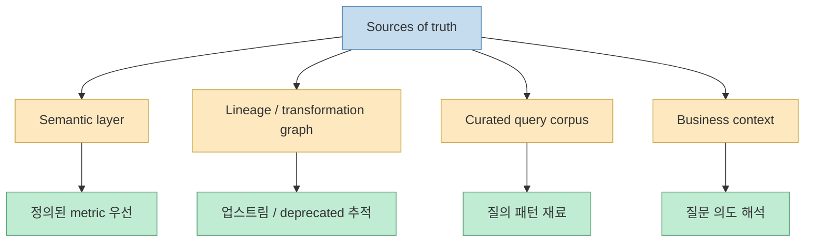
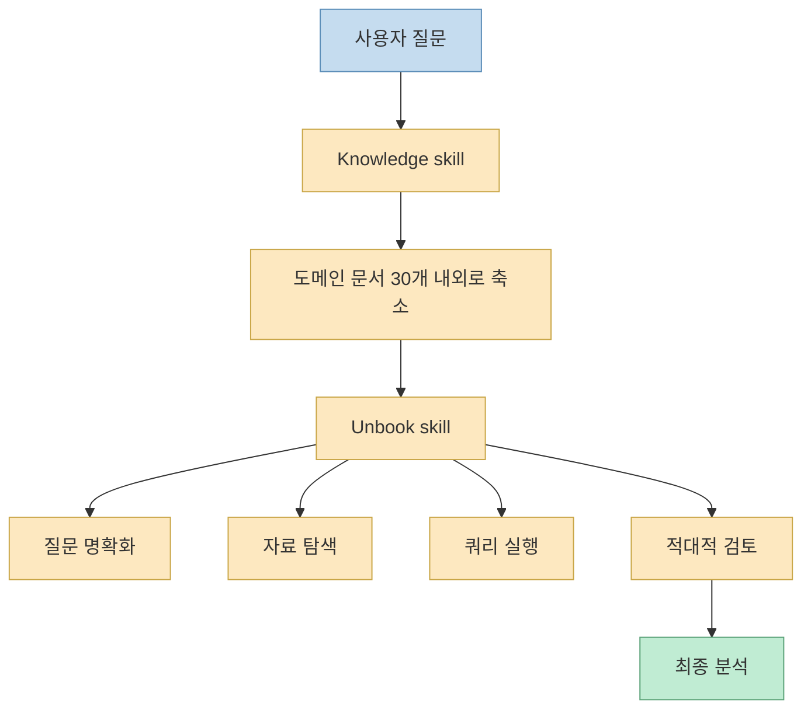
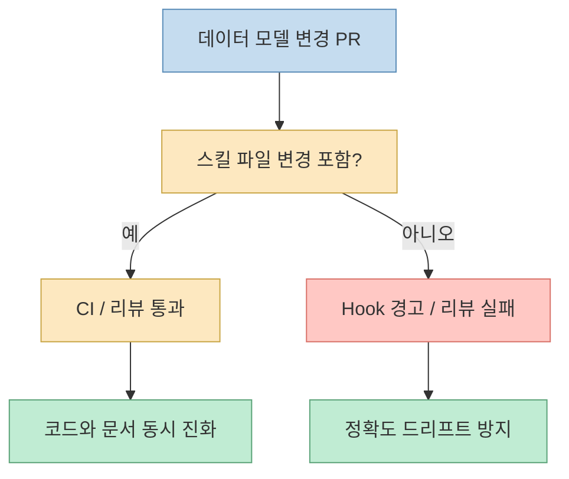
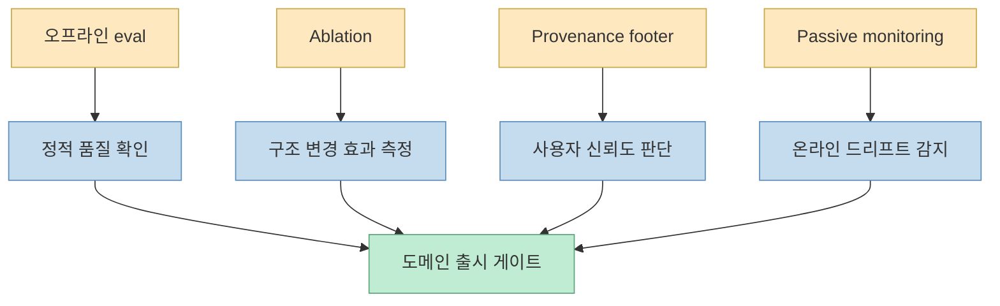

이 영상의 출발점은 꽤 강렬합니다. Anthropic이 회사 안의 비즈니스 분석 질문의 **95%를 Claude로 자동화했고**, 집계 정확도도 대략 **95%**, 특정 도메인에서는 **99% 근처** 까지 올렸다는 이야기입니다. 하지만 발표자가 정말 강조하는 건 숫자 자체가 아닙니다. 오히려 “이걸 단순히 SQL을 잘 짜는 모델의 승리로 보면 완전히 잘못 본다”는 점에 더 가깝습니다. 실제로 Anthropic 공식 글도 같은 메시지를 아주 분명하게 말합니다. self-service agentic analytics의 핵심 문제는 코드 생성이 아니라, **질문을 특정하고 최신이며 올바른 데이터 엔티티에 연결하는 능력** 에 있다는 것입니다. [영상 0:40](https://youtu.be/2oOXHWGn_Cw?t=0) [Anthropic](https://claude.com/blog/how-anthropic-enables-self-service-data-analytics-with-claude)

그래서 이 글은 영상을 단순 요약하지 않고, 공식 원문과 함께 핵심 구조를 다시 정리합니다. 결론부터 말하면 Anthropic이 만든 것은 “SQL 잘 쓰는 챗봇”이 아닙니다. **표준 데이터셋과 메타데이터로 ambiguity를 줄이고, 시맨틱 레이어와 계보 정보로 source of truth를 정하고, 스킬로 절차적 지식을 주입하고, 오프라인/온라인 검증으로 드리프트를 잡는 4층짜리 분석 운영 시스템** 입니다. 즉 95%의 비결은 더 강한 모델 하나가 아니라, 모델이 **잘못된 자유를 덜 갖게 만드는 데이터·문서·검증 구조** 에 있었습니다. [영상 2:40](https://youtu.be/2oOXHWGn_Cw?t=160) [Anthropic](https://claude.com/blog/how-anthropic-enables-self-service-data-analytics-with-claude)
<!--more-->

## Sources

- https://youtu.be/2oOXHWGn_Cw?si=U9DTzOsa1tORbLdk
- https://claude.com/blog/how-anthropic-enables-self-service-data-analytics-with-claude

## 1. Anthropic이 본 문제는 '모델이 SQL을 못 짠다'가 아니라 '데이터는 소프트웨어가 아니다'였다

Anthropic 공식 글은 아주 초반에 `Data is not software`라는 섹션을 둡니다. 코딩 에이전트는 문서, 타입, 테스트 같은 자연스러운 가드레일이 있지만, 데이터 분석은 대개 **단 하나의 올바른 답** 이 있고, 그 정답을 자동으로 증명하기도 어렵다고 설명합니다. 영상도 같은 문제를 더 쉽게 비유로 풀어냅니다. 넓고 평평한 테이블을 깔아 두거나, 대시보드 울타리를 치거나, AI 에이전트에게 그냥 맡기는 세 가지 방식이 모두 실패했다고 말합니다. 이유는 결국 같은 곳으로 수렴합니다. **질문과 데이터 구조 사이의 애매함** 입니다. [영상 0:45](https://youtu.be/2oOXHWGn_Cw?t=45) [Anthropic](https://claude.com/blog/how-anthropic-enables-self-service-data-analytics-with-claude)

Anthropic이 공식 글에서 정리한 세 가지 실패 원인도 영상과 거의 정확히 대응됩니다.

- `Concept <> entity ambiguity` 
- `Data staleness` 
- `Retrieval failure`

예를 들어 “active users”라는 말만 해도 어떤 행동을 active로 볼지, 사기 계정을 포함할지, lookback window를 며칠로 잡을지 같은 정의 충돌이 바로 생깁니다. 이건 SQL을 잘 쓰는 능력으로 해결되지 않습니다. 질문을 어떤 **governed metric** 에 연결할지 먼저 알아야 하기 때문입니다. [영상 1:49](https://youtu.be/2oOXHWGn_Cw?t=109) [Anthropic](https://claude.com/blog/how-anthropic-enables-self-service-data-analytics-with-claude)

즉 Anthropic이 본 핵심은 “모델이 멍청해서 틀린다”가 아니라, **분석 문제는 애초에 ambiguity와 freshness와 retrieval의 문제** 라는 것입니다.

## 2. 1층 데이터 기초 공사는 '단 하나의 진실'을 만드는 일이다

영상에서 첫 번째 층은 `표준 데이터셋`입니다. 매출이나 활성 사용자처럼 반복적으로 등장하는 핵심 개념마다 “이걸 볼 때는 무조건 이 데이터셋을 본다”는 식의 단일 소스를 정하고, 그걸 CI와 강제로 연결했다는 설명이 나옵니다. Anthropic 공식 글에서도 `Create canonical datasets`, `Enforce your standards`, `Colocate artifacts`, `Treat metadata as a first-class product`가 data foundations의 핵심 practice로 정리됩니다. [영상 2:47](https://youtu.be/2oOXHWGn_Cw?t=167) [영상 3:21](https://youtu.be/2oOXHWGn_Cw?t=201) [Anthropic](https://claude.com/blog/how-anthropic-enables-self-service-data-analytics-with-claude)

이 층의 핵심은 단순히 “좋은 데이터 모델을 만든다”가 아닙니다. 더 중요하게는:

- 후보 데이터셋을 줄이고 
- canonical model을 정하고 
- metric definition을 강제하고 
- metadata를 코드와 같은 수준으로 유지한다는 점입니다

Anthropic은 특히 메타데이터를 부록이 아니라 **first-class product** 로 취급하라고 말합니다. 컬럼 설명, grain, lineage, ownership, valid ranges 같은 것이 잘 관리되어야만 에이전트가 올바른 테이블과 필드를 고를 수 있기 때문입니다. [Anthropic](https://claude.com/blog/how-anthropic-enables-self-service-data-analytics-with-claude)

이렇게 보면 1층은 사실 모델 튜닝보다 훨씬 전통적인 데이터 엔지니어링 작업입니다. Anthropic이 보여 준 중요한 메시지 중 하나도 바로 이것입니다. **에이전트 분석을 잘하려면 먼저 데이터 엔지니어링이 튼튼해야 한다** 는 점입니다.

## 3. 2층 sources of truth는 시맨틱 레이어를 맨 앞에 세운다

영상은 두 번째 층에서 “믿을 수 있는 정보들을 신뢰도 순서로 쌓아 둔다”고 설명합니다. 맨 위에는 `semantic layer`, 그 아래 lineage와 transformation graph, 그 아래 curated query corpus, 그리고 business context가 옵니다. Anthropic 공식 글도 같은 구조를 `roughly in descending order of trust`라고 직접 적고 있습니다. [영상 3:49](https://youtu.be/2oOXHWGn_Cw?t=229) [Anthropic](https://claude.com/blog/how-anthropic-enables-self-service-data-analytics-with-claude)

여기서 가장 중요한 포인트는 `semantic layer first` 입니다. 공식 글은 에이전트가 스킬 지시에 의해 **구조적으로 시맨틱 레이어를 먼저 사용하도록 강제** 된다고 말합니다. 이유는 단순합니다. 질문이 정의된 metric에 매핑되면, 시스템은 회사 안의 다른 모든 표면과 같은 숫자를 내야 하기 때문입니다. 이게 “single source of truth”의 실질적인 구현입니다. [Anthropic](https://claude.com/blog/how-anthropic-enables-self-service-data-analytics-with-claude)

또 하나 흥미로운 점은, Anthropic이 LLM으로 시맨틱 레이어 정의를 자동 생성해 보려 했지만 오히려 ambiguity를 그대로 코드화하는 바람에 성능이 나빠졌다고 밝힌 부분입니다. 문서 생성은 Claude가 도울 수 있어도, **정의의 소유권은 결국 사람이 져야 한다** 는 것이 공식 결론입니다. 영상에서도 “활성 사용자가 뭔지는 사람이 정해야 한다”는 식으로 같은 메시지를 강조합니다. [영상 10:39](https://youtu.be/2oOXHWGn_Cw?t=639) [Anthropic](https://claude.com/blog/how-anthropic-enables-self-service-data-analytics-with-claude)

즉 2층은 “데이터가 어디 있나?”보다 **어떤 순서로 무엇을 먼저 믿을 것인가** 를 정하는 층입니다.

## 4. 정확도를 21%에서 95%로 뒤집은 건 결국 '스킬'이었다

영상에서 가장 강하게 강조되는 구간은 3층 `스킬`입니다. Anthropic 공식 글도 아주 분명하게 씁니다. **스킬이 없을 때는 오프라인 eval에서 정확도가 21%를 넘지 못했고, 스킬을 추가하면 aggregate 95% 이상, 특정 도메인에서는 99% 근처** 까지 올라갔다고요. [영상 4:57](https://youtu.be/2oOXHWGn_Cw?t=297) [영상 5:29](https://youtu.be/2oOXHWGn_Cw?t=329) [Anthropic](https://claude.com/blog/how-anthropic-enables-self-service-data-analytics-with-claude)

Anthropic은 스킬을 `declarative knowledge`가 아니라 `procedural knowledge`라고 정의합니다. 즉 “이 metric이 무엇인가”보다 “어떤 질문을 받았을 때 어떤 자료를 어떤 순서로 보고, 무엇을 fallback으로 삼고, 완성된 분석은 어떤 모양이어야 하는가”를 담는 작업 매뉴얼입니다.

영상과 공식 글을 합치면 스킬은 크게 두 가지로 나뉩니다.

- `Knowledge skill` 
  질문이 어느 도메인인지 판단하고, 그 도메인에 맞는 curated reference docs 약 30개 정도로 탐색 범위를 줄여 주는 라우터

- `Unbook skill` 
  선임 분석가의 절차를 담은 실행 매뉴얼. 질문 명확화 → 자료 탐색 → 쿼리 실행 → 적대적 검토 → 재사용 패턴 적용까지 포함

즉 95%의 비결은 “모델이 원래 똑똑했다”가 아니라, **모델이 잘 헤매지 않도록 탐색 경로와 절차를 스킬 문서로 외부화한 것** 에 있습니다.

## 5. 가장 중요한 교훈 중 하나는 '스킬도 코드처럼 관리해야 한다'는 점이다

영상에서 아주 인상적인 장면은, 스킬을 만들고 95%를 찍은 뒤 **한 달 만에 정확도가 65%까지 떨어졌다** 는 이야기입니다. 이유는 단순했습니다. 회사의 테이블과 정의는 계속 바뀌는데, 스킬 문서는 그대로였기 때문입니다. Anthropic 공식 글도 같은 수치를 그대로 적습니다. skill docs는 데이터 모델이 매일 바뀌는 세계를 설명하므로, active maintenance 없이는 몇 주 안에 틀려진다고 말합니다. [영상 6:52](https://youtu.be/2oOXHWGn_Cw?t=412) [영상 7:07](https://youtu.be/2oOXHWGn_Cw?t=427) [Anthropic](https://claude.com/blog/how-anthropic-enables-self-service-data-analytics-with-claude)

그래서 Anthropic이 택한 해결책은 스킬 Markdown을 **데이터 모델과 같은 repo에 colocate** 하고, reporting model이 바뀌는데 스킬 파일이 안 바뀌면 code review hook이 경고하게 만드는 방식이었습니다. 공식 글은 현재 대략 **데이터 모델 PR의 90%가 스킬 변경을 함께 포함한다** 고 설명합니다. 영상도 “데이터 코드와 같은 창고에 넣고 훅을 걸었다”고 같은 메시지를 전합니다. [영상 7:18](https://youtu.be/2oOXHWGn_Cw?t=438) [영상 7:30](https://youtu.be/2oOXHWGn_Cw?t=450) [Anthropic](https://claude.com/blog/how-anthropic-enables-self-service-data-analytics-with-claude)

이건 단순한 문서 관리 팁이 아닙니다. **낡은 문서는 모델 한 개보다 더 빨리 성능을 죽인다** 는 운영 교훈입니다. Claude Code나 다른 에이전트 스택을 쓰는 팀에게도 그대로 적용됩니다.

## 6. 검증 층은 오프라인 시험, 실시간 검토, 교정 수집까지 포함한다

영상의 4층은 `validation`입니다. Anthropic 공식 글 역시 offline evaluations, ablation techniques, provenance footer, passive monitoring 같은 검증 레이어를 자세히 설명합니다. 먼저 오프라인 평가는 question/answer pairs로 구성되고, dashboard-based eval과 long-tail eval을 함께 운용합니다. 그리고 각 도메인은 일정 기준을 넘기기 전까지 이해관계자에게 공개하지 못하게 합니다. [영상 7:42](https://youtu.be/2oOXHWGn_Cw?t=462) [영상 8:00](https://youtu.be/2oOXHWGn_Cw?t=480) [Anthropic](https://claude.com/blog/how-anthropic-enables-self-service-data-analytics-with-claude)

여기서 특히 인상적인 공식 결과 하나가 있습니다. Anthropic은 대시보드, transformation, analyst notebook SQL 수천 개를 agent에 grep 가능하게 줬지만, **정확도는 1포인트도 안 올랐다** 고 말합니다. 심지어 틀린 답의 약 80%는 이미 그 코퍼스 안에 답이 있었는데도 그랬습니다. 영상도 같은 내용을 강하게 강조합니다. 결론은 분명합니다. 문제는 정보 부족이 아니라, **새 질문을 올바른 precedent와 구조에 연결하는 다리의 부재** 였습니다. [영상 8:05](https://youtu.be/2oOXHWGn_Cw?t=485) [Anthropic](https://claude.com/blog/how-anthropic-enables-self-service-data-analytics-with-claude)

또 온라인 쪽에서는 `provenance footer`와 passive monitoring이 들어갑니다. 모든 답변에 source tier, freshness, owner를 달아 신뢰도를 드러내고, semantic layer를 얼마나 자주 탔는지, correction language가 얼마나 자주 나오는지 같은 생산 신호를 계속 추적합니다. 영상은 여기에 더해 다른 AI 검토관이 결과를 의심하는 적대적 검토와 자동 교정 수집까지 소개합니다. [영상 8:42](https://youtu.be/2oOXHWGn_Cw?t=522) [Anthropic](https://claude.com/blog/how-anthropic-enables-self-service-data-analytics-with-claude)

즉 검증층은 “정답 맞췄나?”만 보는 게 아니라, **구조가 여전히 살아 있는가, 어떤 source tier를 탔는가, drift가 시작됐는가** 를 함께 보는 운영 계층입니다.

## 7. Anthropic이 말하는 최소 시작점은 생각보다 작다

영상 마지막에서 발표자는 “거창하게 시작할 필요 없다”고 정리합니다. Anthropic 공식 글의 정신과도 잘 맞습니다. 최소 시작점은:

- 몇 개의 핵심 canonical dataset 
- 수십 개 수준의 offline eval 
- 얇은 knowledge skill 하나

정도면 된다는 것입니다. [영상 10:55](https://youtu.be/2oOXHWGn_Cw?t=655)

이 조언이 실무적으로 좋은 이유는, 많은 팀이 analytics agent를 도입할 때 처음부터 모든 정의와 모든 문서를 완벽히 만들려 하기 때문입니다. 그런데 Anthropic 사례가 보여 주는 건, 먼저 **핵심 지표 몇 개를 source of truth로 고정하고**, 질문-정답 쌍으로 오프라인 평가를 만들고, semantic layer first를 강제하는 얇은 라우팅 스킬부터 시작하라는 것입니다. 즉 “큰 시스템”보다 “올바른 우선순위”가 먼저입니다.

## 핵심 요약

- Anthropic의 self-service analytics 성공은 text-to-SQL보다 **ambiguity, staleness, retrieval failure** 를 푸는 구조에서 나왔습니다. 
- 1층은 canonical dataset, CI 강제, 메타데이터 제품화 같은 **data foundations** 입니다. 
- 2층은 semantic layer를 최우선으로 두는 **sources of truth** 층입니다. 
- 3층 스킬이 정확도를 **21% 이하 → 95% 이상** 으로 끌어올린 핵심 레버였습니다. 
- 스킬은 문서가 아니라 **절차적 지식** 이며, 낡으면 한 달 만에 정확도가 **95% → 65%** 로 떨어질 수 있습니다. 
- 4층 검증은 offline eval, ablation, provenance footer, passive monitoring까지 포함하는 **운영 계층** 입니다.

## 결론

Anthropic 사례가 주는 가장 큰 교훈은 간단합니다. 데이터 분석 에이전트의 품질은 모델 하나로 해결되지 않습니다. **무엇을 먼저 믿게 만들지, 어떤 절차로 탐색하게 만들지, 언제 문서를 갱신하게 강제할지, 무엇으로 검증할지** 가 성능의 대부분을 결정합니다.

그래서 이 글은 단순히 “Claude가 분석도 잘한다”는 홍보가 아닙니다. 오히려 AI 분석을 조직에 넣으려는 팀에게, **시맨틱 레이어와 스킬과 검증 루프가 없으면 95%는커녕 21%에도 머물 수 있다** 는 꽤 냉정한 설계 문서에 가깝습니다.
