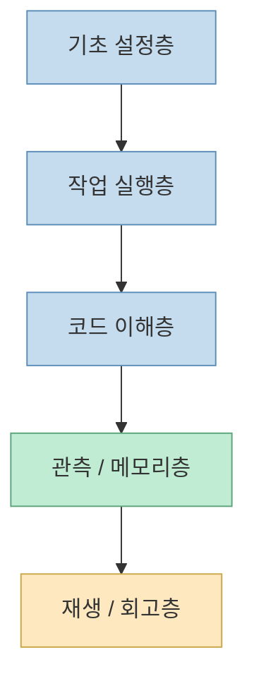
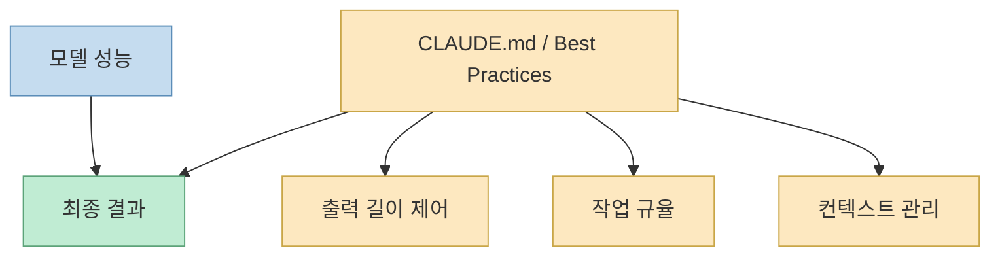
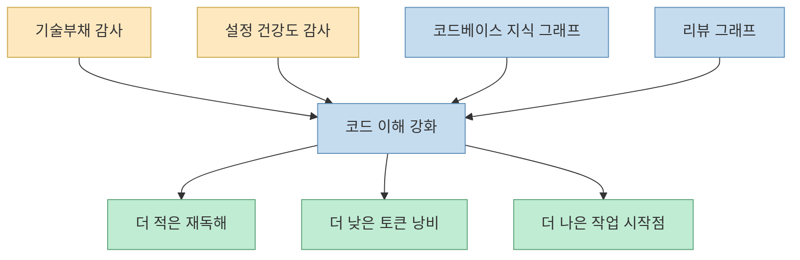
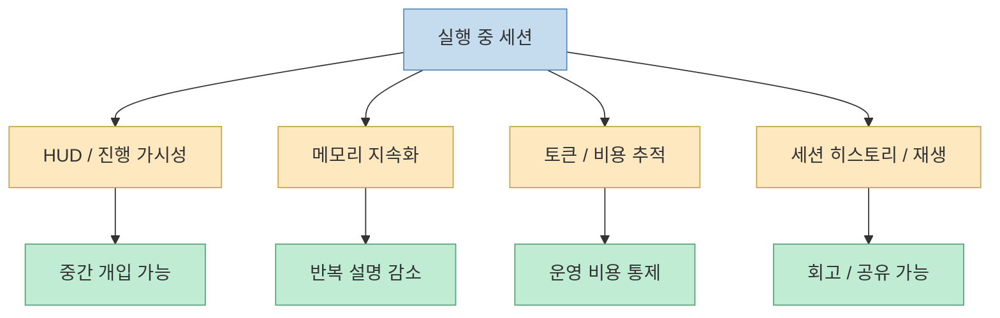
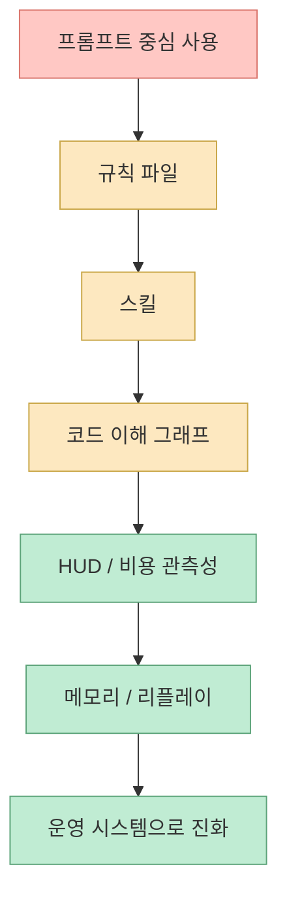

Camille Roux의 글은 표면적으로는 “2026년 Claude Code용 상위 13개 스킬과 플러그인” 목록입니다. 하지만 실제로 읽어 보면 단순 추천 리스트라기보다, **Claude Code 생태계가 지금 어디까지 확장됐는지 보여 주는 지도** 에 가깝습니다. 글 서두에서 저자는 이 목록이 최근 몇 달 동안 자신의 소셜 채널에서 가장 높은 참여를 받은 도구들을 모은 것이라고 밝히고, 구성도 “기초 설정 → 일상 작업을 바꾸는 스킬 → 모니터링/시각화 도구” 순서로 나뉜다고 설명합니다. 즉 이 글의 관심사는 한두 개의 멋진 리포지토리를 뽑는 데 있지 않고, **Claude Code를 중심으로 어떤 보조 레이어들이 생겨났는지** 를 보여 주는 데 있습니다. [Camille Roux](https://www.camilleroux.com/top-skills-plugins-claude-code-2026-v3/)

이 점이 중요한 이유는, 요즘의 Claude Code 실전 활용이 더 이상 “프롬프트 잘 쓰기” 한 가지로 설명되지 않기 때문입니다. 이 목록에는 토큰 절약용 `CLAUDE.md`, 운영 베스트 프랙티스 문서, 기술부채 감사 스킬, 코드베이스 지식 그래프, 실시간 HUD, 세션 간 메모리, 토큰 비용 대시보드, 세션 재생 도구까지 함께 들어 있습니다. 즉 생태계의 관심사가 **답변 품질 개선 → 코드베이스 이해 → 실행 중 관측성 → 세션 간 기억 → 사후 재생/분석** 으로 넓어지고 있다는 뜻입니다. [Camille Roux](https://www.camilleroux.com/top-skills-plugins-claude-code-2026-v3/)
<!--more-->

## Sources

- https://www.camilleroux.com/top-skills-plugins-claude-code-2026-v3/
- https://news.humancoders.com/t/ia/items/55004-top-13-skills-et-plugins-claude-code-2026

## 1. 이 글은 '베스트 툴 순위'보다 'Claude Code 운영 스택'의 단면에 가깝다

Camille Roux는 이 글이 최근 자신의 네트워크에서 높은 참여를 받은 13개 도구를 모은 것이라고 설명합니다. 즉 여기서의 “top”은 절대적 성능 순위라기보다, **실전 사용자의 주목을 가장 많이 받은 도구 묶음** 에 가깝습니다. 이 점을 먼저 이해해야 합니다. 왜냐하면 이 글은 벤치마크 보고서가 아니라, 실제 사용자가 어떤 문제를 풀기 위해 무엇을 깔기 시작했는지 보여 주는 현장 지표이기 때문입니다. [Camille Roux](https://www.camilleroux.com/top-skills-plugins-claude-code-2026-v3/)

그리고 더 흥미로운 건 선정 방식보다 구성 방식입니다. 글 59행에서 저자는 “기초 설정과 best practices로 시작하고, 일상을 바꾸는 스킬을 지나, 토큰이 어디로 가는지와 세션 재생까지 보는 모니터링·시각화 도구로 끝낸다”고 구조를 예고합니다. 이 한 문장만 봐도, Claude Code 생태계의 확장 방향이 보입니다. 단순한 플러그인 몇 개가 아니라 **설정층, 실행층, 관측층, 회고층** 이 차례로 채워지고 있는 것입니다. [Camille Roux](https://www.camilleroux.com/top-skills-plugins-claude-code-2026-v3/)

즉 이 목록은 “무엇을 먼저 깔까?”를 넘어서, **Claude Code가 하나의 운영 시스템이 되려면 어떤 층이 필요한가** 를 보여 줍니다.

## 2. 1~2위가 설정 파일과 베스트 프랙티스라는 점이 의미심장하다

목록의 1위는 `Universal CLAUDE.md`, 2위는 `claude-code-best-practice`입니다. 둘 다 화려한 실행기나 멀티 에이전트 시스템이 아닙니다. 하나는 전역 규칙 파일이고, 다른 하나는 운영 문서입니다. 저자는 특히 `Universal CLAUDE.md`를 “하나만 설치해야 한다면 이것”이라고까지 말하면서, 출력 토큰을 약 63% 줄인다고 소개합니다. [Camille Roux](https://www.camilleroux.com/top-skills-plugins-claude-code-2026-v3/)

이게 의미하는 바는 꽤 분명합니다. 2026년의 Claude Code 사용자는 더 이상 “모델이 똑똑하면 알아서 해 주겠지”라고 생각하지 않습니다. 오히려 **전역 규칙과 작업 규율을 잘 심는 것이 제일 큰 레버리지** 라는 쪽으로 이동했습니다. `CLAUDE.md`가 1위라는 건, 생태계가 모델 자체보다 **기본 출력 습관, 설명 길이, 응답 형식, 작업 태도** 를 제어하는 데 더 큰 가치를 두기 시작했다는 신호입니다.

즉 Claude Code 생태계의 출발점은 툴 추가가 아니라 **규칙 추가** 라는 뜻입니다. 이건 최근의 하네스 엔지니어링 흐름과도 정확히 맞닿아 있습니다.

## 3. 중간 구간의 스킬들은 '더 잘 답하기'보다 '더 잘 읽기'에 집중한다

3위부터 8위까지를 보면 공통점이 분명합니다. `tech-debt-skill`, `claude-skills`, `claude-seo`, `claude-health`, `Understand-Anything`, `code-review-graph` 모두 어떤 의미에서는 “생성”보다 “해석과 감사”에 더 가깝습니다. 저자도 `tech-debt-skill`을 기술부채 감사 도구로, `claude-health`를 Claude Code 설정 건강도 감사 도구로, `Understand-Anything`과 `code-review-graph`를 코드베이스를 그래프로 이해하는 도구로 소개합니다. [Camille Roux](https://www.camilleroux.com/top-skills-plugins-claude-code-2026-v3/)

특히 `Understand-Anything`과 `code-review-graph`가 함께 들어 있는 점은 생태계의 초점 이동을 잘 보여 줍니다. 문제는 이제 “코드를 써 주는가?”보다 “기존 코드베이스를 얼마나 싸게, 정확하게 읽는가?”에 있습니다. 저자도 `code-review-graph`에 대해 Claude가 전체 코드베이스를 매번 다시 읽지 않게 해 주는 persistent local knowledge graph라고 설명하고, 토큰 절감 수치까지 인용합니다. [Camille Roux](https://www.camilleroux.com/top-skills-plugins-claude-code-2026-v3/)

즉 이 목록은 Claude Code가 “글 잘 쓰는 챗봇”에서 “코드베이스를 읽고 감사하는 시스템”으로 이동하고 있음을 보여 줍니다.

## 4. 후반부 도구들은 관측성과 기억이 왜 핵심 운영 문제가 됐는지 보여 준다

9위 이후의 도구는 성격이 확 바뀝니다. `claude-hud`는 실시간 세션 가시성, `claude-subconscious`는 세션 간 지속 메모리, `CodeBurn`은 토큰/비용 추적, `Claudoscope`는 프로젝트 간 대시보드, `Claude-replay`는 세션 재생에 초점이 있습니다. 즉 여기서부터는 “무엇을 시킬까”가 아니라, **지금 무슨 일이 벌어지고 있는가**, **지난번 세션과 무엇이 이어지는가**, **돈은 어디로 샜는가**, **다시 재생해 볼 수 있는가** 같은 운영 질문으로 넘어갑니다. [Camille Roux](https://www.camilleroux.com/top-skills-plugins-claude-code-2026-v3/)

이건 매우 중요한 신호입니다. 어떤 도구 생태계가 커질수록 결국 생기는 공통 문제가 세 가지인데:

- 내부에서 무슨 일이 벌어지는지 안 보인다 
- 세션이 끝나면 기억이 날아간다 
- 비용과 결과를 나중에 회고하기 어렵다

Claude Code도 이제 정확히 그 단계에 들어섰다는 뜻입니다. 즉 성숙한 사용자는 더 이상 “Claude가 뭘 할 수 있지?”만 묻지 않고, **Claude가 지금 무엇을 하고 있고, 얼마를 쓰고 있으며, 어제의 결정을 기억하는가** 를 묻기 시작했습니다.

즉 생태계의 후반부는 기능 추가가 아니라 **운영 계측 장치** 의 등장입니다.

## 5. 저자가 추천한 시작 순서는 사실상 'Claude Code 도입 로드맵'이다

글 후반부에서 Camille Roux는 “아직 아무것도 설치하지 않았다면 어디서 시작할까?”에 대한 순서를 제안합니다. 첫째는 `Universal CLAUDE.md`, 둘째는 `claude-hud`, 셋째는 기존 코드베이스에 들어갈 때 `Understand-Anything` 또는 `code-review-graph`, 넷째는 필요에 따라 `tech-debt-skill`, `claude-seo`, `claude-health`라고 정리합니다. [Camille Roux](https://www.camilleroux.com/top-skills-plugins-claude-code-2026-v3/)

이 순서는 단순 취향이 아니라, 상당히 실무적인 도입 경로입니다.

1. 먼저 기본 규칙으로 낭비를 줄이고 
2. 세션 안에서 무슨 일이 벌어지는지 보이게 만들고 
3. 기존 코드베이스를 읽는 능력을 붙이고 
4. 그다음에 감사/진단용 특수 스킬을 얹는다

이 순서가 중요한 이유는, 많은 사용자가 거꾸로 접근하기 때문입니다. 화려한 스킬 모음부터 깔고 나중에야 규칙과 관측성을 고민합니다. 그런데 저자의 순서는 반대입니다. **기반 규칙 → 관측성 → 이해력 → 특수 스킬** 입니다. 이건 곧 “먼저 달리게 하는 것”보다 “먼저 통제 가능하게 만드는 것”이 더 중요하다는 뜻입니다.

## 6. 이 글이 보여 주는 생태계의 진짜 방향은 '프롬프트 문화'에서 '운영 시스템'으로의 이동이다

글 맨 마지막 부분에서 저자는 이 생태계가 너무 빨리 움직이므로 절반은 6개월 전에는 없었고, 절반은 6개월 뒤에 없어질지도 모른다고 말합니다. 하지만 바로 이어서 “가장 좋은 전략은 작게 시작하는 것”이며, 잘 쓴 `CLAUDE.md` 하나만으로도 이미 큰 차이를 만든다고 조언합니다. [Camille Roux](https://www.camilleroux.com/top-skills-plugins-claude-code-2026-v3/)

이 문장은 리스트 전체를 해석하는 좋은 열쇠입니다. 생태계가 빠르게 흔들려도 변하지 않는 축은 따로 있다는 뜻입니다.

- 기본 규칙 파일 
- 컨텍스트 운영 관행 
- 코드베이스 이해 장치 
- 세션 가시성 
- 비용 관측성 
- 기억과 회고

결국 2026년의 Claude Code 생태계는 “좋은 프롬프트 몇 개”를 넘어, **개발 에이전트를 운영하기 위한 전체 제어면** 을 만들고 있습니다.

이게 바로 이 글이 단순 추천 목록을 넘어서는 이유입니다. 각각의 항목보다, **항목들이 어떤 층을 채우고 있는가** 가 훨씬 더 많은 것을 말해 줍니다.

## 핵심 요약

- Camille Roux의 글은 단순 툴 순위보다 **Claude Code 운영 스택의 단면** 에 가깝습니다. 
- 1위와 2위가 `CLAUDE.md`와 베스트 프랙티스 문서라는 점은, 생태계가 모델보다 **규칙과 운영 습관** 에 더 큰 가치를 두기 시작했음을 보여 줍니다. 
- 중간 구간의 스킬들은 생성보다 **감사, 진단, 코드베이스 이해** 에 집중합니다. 
- 후반부 도구들은 실시간 HUD, 지속 메모리, 비용 대시보드, 세션 재생처럼 **운영 관측성** 문제를 해결합니다. 
- 저자의 추천 시작 순서는 사실상 **Claude Code 도입 로드맵** 입니다. 
- 전체적으로 보면 생태계의 방향은 프롬프트 문화에서 **운영 시스템 문화** 로 이동하고 있습니다.

## 결론

이 글을 “깃허브 링크 13개 모음”으로만 보면 절반만 읽은 셈입니다. 더 중요한 건, 2026년의 Claude Code 사용자가 어디에서 실제 고통을 느끼고 있는지가 이 목록에 그대로 드러난다는 점입니다. 토큰 낭비, 컨텍스트 관리, 코드베이스 이해, 세션 가시성, 비용 관측성, 메모리 지속화, 회고 가능성. 모두 운영 문제입니다.

그래서 이 글이 주는 가장 큰 교훈은 간단합니다. 이제 Claude Code를 잘 쓴다는 건 단지 프롬프트를 잘 쓰는 게 아닙니다. **규칙을 깔고, 읽기 비용을 줄이고, 실행 중 상태를 보고, 기억과 비용을 관리하는 운영 체계** 를 만드는 일에 더 가까워졌습니다.
