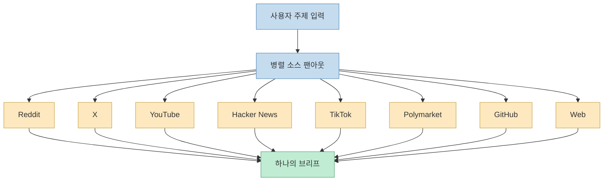
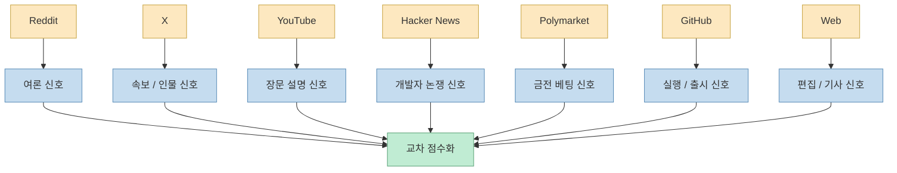
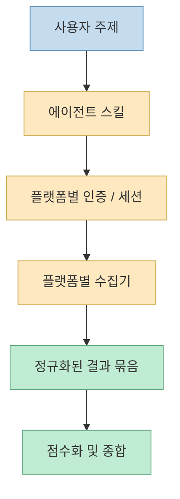
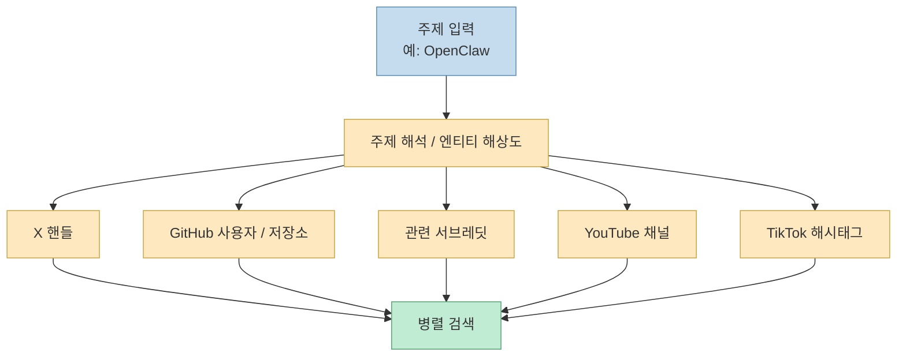

이 X 포스트가 흥미로운 이유는 “오픈소스 프로젝트 하나를 소개한다”는 수준을 넘어, 요즘 에이전트 툴이 어디서 경쟁하는지를 아주 짧게 보여 주기 때문입니다. 포스트 본문은 하나의 AI 에이전트가 `Reddit`, `X`, `YouTube`, `Hacker News`, `TikTok`, `Polymarket`, `GitHub`, 일반 웹사이트까지 **순차가 아니라 병렬로 동시에** 뒤진다고 강조합니다. 이 설명은 과장이 아니라, 실제로 연결된 원본 저장소 `mvanhorn/last30days-skill` README가 내세우는 핵심 메시지와 거의 같습니다. README 역시 `/last30days`를 “upvotes, likes, real money로 점수화되는 AI agent-led search engine”으로 정의하고, 여러 플랫폼의 서로 다른 신호를 한 번에 모아 하나의 brief로 합친다고 설명합니다. [X oEmbed](https://publish.x.com/oembed?url=https://x.com/i/status/2063606909681205342) [GitHub](https://github.com/mvanhorn/last30days-skill)

이걸 단순히 “검색 범위가 넓은 툴”이라고 보면 본질을 놓치기 쉽습니다. `/last30days`의 진짜 포인트는 웹 검색을 더 잘하는 게 아니라, **각자 닫혀 있는 플랫폼의 인간 반응 신호를 에이전트가 대신 모아 교차 비교하는 레이어** 라는 점에 있습니다. 구글은 편집된 웹을 잘 모으고, ChatGPT나 Gemini는 일부 파트너 데이터에는 강하지만, Reddit 댓글·X 반응·YouTube 자막·Polymarket 확률·GitHub 활동을 한 장의 실행형 브리프로 동시에 묶기는 어렵습니다. `/last30days`가 주목받는 이유는 바로 그 빈틈을 메우기 때문입니다. [GitHub](https://github.com/mvanhorn/last30days-skill)
<!--more-->

## Sources

- https://x.com/i/status/2063606909681205342
- https://github.com/mvanhorn/last30days-skill
- https://github.com/mvanhorn/last30days-skill/blob/main/skills/last30days/SKILL.md

## 1. X 원문이 강조한 것은 '검색 품질'보다 '병렬성'이다

이 X 포스트는 기술 세부 구현보다도 사용자가 체감하는 차이를 먼저 보여 줍니다. 한 AI 에이전트가 `Reddit`, `X`, `YouTube`, `Hacker News`, `TikTok`, `Polymarket`, `GitHub`, 일반 웹을 **전부 동시에** 뒤진다고 설명하고, “하나씩이 아니라 같은 시간에 병렬로”라는 점을 강조합니다. 이 framing이 중요한 이유는, 기존 검색 습관이 보통 플랫폼을 옮겨 다니는 수작업이기 때문입니다. 한 주제를 조사하려면 Reddit에서 여론을 보고, X에서 뜨는 사람 반응을 보고, YouTube에서 긴 설명을 보고, GitHub에서 코드 활동을 보고, Polymarket에서 돈이 어디에 걸렸는지 따로 확인해야 했습니다. [X oEmbed](https://publish.x.com/oembed?url=https://x.com/i/status/2063606909681205342)

README도 똑같은 문제의식을 더 길게 설명합니다. “Google aggregates editors. /last30days searches people.”라는 문장은, 이 스킬이 웹페이지보다 **사람의 반응과 참여 데이터** 를 먼저 본다는 뜻입니다. 즉 `/last30days`는 웹 문서를 더 잘 찾아 주는 일반 검색 엔진이 아니라, 각 플랫폼에 흩어진 **현장 반응 레이어** 를 에이전트가 대신 모으는 도구에 가깝습니다. 그래서 X 포스트가 “아이디어가 꽤 미쳤다”고 반응한 것도 자연스럽습니다. 단일 모델의 성능보다, 여러 담장 안에 있는 데이터를 어떻게 한 번에 엮는지가 더 중요해졌기 때문입니다. [GitHub](https://github.com/mvanhorn/last30days-skill)

즉 이 스킬을 이해할 때 첫 질문은 “무슨 모델을 쓰나?”가 아니라 “몇 개의 담장형 플랫폼을 동시에 연결하나?”가 되어야 합니다.

## 2. /last30days는 '더 좋은 검색 엔진'이 아니라 '인간 신호 집계기'에 가깝다

README에서 가장 눈에 띄는 대목 중 하나는 각 소스가 어떤 종류의 신호를 뜻하는지 아주 분명하게 나눠 설명하는 부분입니다. `Reddit`는 필터링되지 않은 의견, `X`는 빠른 반응과 전문가 스레드, `YouTube`는 긴 설명과 자막, `Hacker News`는 개발자 논쟁, `Polymarket`은 실제 돈이 걸린 확률, `GitHub`는 PR 속도와 릴리스, `Web`은 편집된 기사로 정리됩니다. 즉 모든 플랫폼을 같은 “검색 결과”로 취급하지 않고, **서로 다른 사회적 신호 유형** 으로 해석합니다. [GitHub](https://github.com/mvanhorn/last30days-skill)

이게 왜 중요하냐면, 같은 주제라도 플랫폼마다 가치가 다르기 때문입니다. 예를 들어 어떤 AI 툴이 실제로 뜨고 있는지 볼 때:

- Reddit는 진짜 사용자 불만과 찬반을 보여 주고 
- X는 누가 먼저 떠들고 누가 영향력을 가지는지 보여 주고 
- YouTube는 긴 튜토리얼과 워크플로를 보여 주고 
- GitHub는 실제 코드 활동과 릴리스 속도를 보여 주고 
- Polymarket은 “사람들이 돈까지 걸고 믿는가”를 보여 줍니다

즉 `/last30days`는 여러 검색 결과를 합치는 게 아니라, **여러 종류의 현실 반응 지표를 한데 묶는 장치** 입니다.

그래서 README가 “social relevancy, not SEO relevancy”라고 말하는 것도 단순한 카피가 아닙니다. `/last30days`는 문서 품질보다 **사람들이 실제로 반응한 흔적** 을 더 상위 신호로 취급하는 구조입니다. [GitHub](https://github.com/mvanhorn/last30days-skill)

## 3. 이 프로젝트의 진짜 난점은 모델이 아니라 '연결성'이다

README는 왜 이게 어려운지 아주 노골적으로 설명합니다. Google은 Reddit 댓글이나 X 포스트를 제대로 다루지 못하고, 일부 AI는 YouTube엔 강하지만 Reddit은 약하며, 또 어떤 AI는 Reddit 계약은 있어도 X나 TikTok은 접근이 안 된다고 말합니다. 핵심은 각 플랫폼이 API, 인증, 토큰, 세션 방식이 모두 다른 **walled garden** 이라는 점입니다. `/last30days`는 모델 자체로 이 문제를 푼 게 아니라, 사용자가 가진 키와 브라우저 세션을 가져와 **각 담장을 에이전트가 실무적으로 연결** 하게 만듭니다. [GitHub](https://github.com/mvanhorn/last30days-skill)

`SKILL.md`를 보면 이 관점이 더 명확합니다. 설명란에는 Reddit, X, YouTube, TikTok, Hacker News, Polymarket, GitHub, Web 등 다양한 출처를 다루는 research skill이라고 적혀 있고, 메타데이터에는 `OPENAI_API_KEY`, `XAI_API_KEY`, `BRAVE_API_KEY`, `AUTH_TOKEN`, `CT0`, `BSKY_HANDLE` 같은 여러 optional env가 적혀 있습니다. 즉 이 스킬의 어려움은 “더 똑똑한 reasoning prompt”보다 **각 플랫폼과 통신하는 인증·수집층** 에 더 가깝습니다. [SKILL.md](https://github.com/mvanhorn/last30days-skill/blob/main/skills/last30days/SKILL.md)

그래서 `/last30days`를 “검색 스킬 하나” 정도로 보면 축소해서 보는 셈입니다. 실제로는 **플랫폼 브리지 + 신호 집계 + 브리프 합성** 이 한 덩어리로 묶여 있습니다.

## 4. v3에서 커진 것은 검색 깊이보다 '주제 해석 후 검색'이라는 점이다

README의 `What v3 Changed` 섹션을 보면 흥미로운 변화가 나옵니다. v3 엔진은 단순히 키워드를 검색하지 않고, 검색 전에 **어디를 찾아야 하는지부터 추론** 한다고 설명합니다. 예를 들어 `OpenClaw`를 넣으면 관련 X 핸들, 서브레딧, YouTube 채널, TikTok 해시태그까지 먼저 풀어낸 다음 검색에 들어간다고 적혀 있습니다. 즉 단순 키워드 매칭보다 한 단계 위에 있는 **pre-research resolution layer** 가 붙은 것입니다. [GitHub](https://github.com/mvanhorn/last30days-skill)

이 변화는 꽤 중요합니다. 왜냐하면 멀티소스 검색에서 제일 큰 실패 원인 중 하나가, 같은 대상을 플랫폼마다 다른 이름으로 부른다는 점이기 때문입니다. 사람 이름, 회사 이름, 제품 이름, GitHub 아이디, X 핸들, 서브레딧 이름이 전부 다를 수 있습니다. v3는 이 문제를 검색 전 단계에서 풀려고 합니다. 검색 자체보다 먼저 **무엇이 같은 엔티티인지 식별** 하는 셈입니다.

결국 v3의 업그레이드는 “더 많은 사이트 지원”만이 아닙니다. **검색 전에 대상을 더 잘 이해하게 만드는 것** 이고, 이게 결과 품질에 훨씬 큰 영향을 줍니다.

## 5. 왜 사람들이 이걸 '딥 리서치'보다 실전적이라고 느끼는가

README의 사용 예시는 굉장히 생활 밀착형입니다. 회의 전에 사람의 최근 30일 활동을 파악하거나, 새 제품이 나왔을 때 커뮤니티 반응을 묶어 보거나, CEO와 미팅 전에 최근 트윗과 팟캐스트 발언까지 빠르게 읽는 식입니다. 이건 전통적인 검색이나 일반 챗봇이 약한 영역입니다. 검색은 결과가 분산되고, 챗봇은 플랫폼별 최신 현장 반응에 접근이 약하며, 둘 다 **한 장짜리 실무 브리프** 로 바로 정리해 주지는 못하기 때문입니다. [GitHub](https://github.com/mvanhorn/last30days-skill)

또 하나는 점수화 기준입니다. README는 upvotes, likes, views, odds 같은 **실제 반응량** 을 강조합니다. 즉 “누가 썼는가”보다 “사람들이 실제로 얼마나 반응했는가”를 랭킹 신호로 쓰려는 겁니다. 이 때문에 `/last30days`는 전통적인 deep research와 결이 다릅니다. 논문이나 공식 문서 중심의 정제된 리서치라기보다, **최근 30일의 사회적 온도와 실행 신호를 읽는 운영형 리서치** 에 더 가깝습니다.

그래서 이 툴이 특히 잘 맞는 업무도 분명합니다.

- 미팅 전 인물 브리핑 
- 제품/서비스 최근 반응 추적 
- 툴 비교와 경쟁사 모니터링 
- 커뮤니티 언어 수집 
- 콘텐츠 아이디어 발굴 
- 최신 AI 생태계 변화 요약

반대로 법률·의학·회계처럼 근거 계층이 엄격해야 하는 고위험 영역에서는, 이런 인간 신호 집계만으로 결론을 내리기보다는 공식 문서 검증 계층이 추가로 필요합니다. 이 점은 README의 강한 마케팅 문구와는 별개로 실무적으로 분리해서 봐야 합니다.

## 6. 결국 /last30days는 '하나의 스킬'이 아니라 에이전트 검색 레이어의 프로토타입이다

X 포스트는 이 프로젝트를 “여러 플랫폼을 동시에 찾는 AI 에이전트”로 소개했고, README는 그걸 더 공격적으로 “a dozen disconnected platforms, bridged by an agent”라고 설명합니다. 이 두 문장을 합치면 본질이 더 잘 보입니다. `/last30days`가 흥미로운 이유는 그 자체가 완벽한 검색 엔진이어서가 아니라, **에이전트가 여러 폐쇄적 플랫폼 위에 얇은 통합 검색 레이어를 얹을 수 있다** 는 것을 보여 주기 때문입니다. [X oEmbed](https://publish.x.com/oembed?url=https://x.com/i/status/2063606909681205342) [GitHub](https://github.com/mvanhorn/last30days-skill)

즉 앞으로 경쟁은 “더 큰 모델”만으로 나지 않을 가능성이 큽니다.

- 어느 플랫폼까지 연결하는가 
- 어떤 신호를 우선순위로 두는가 
- 엔티티 해상도를 얼마나 잘하는가 
- 결과를 어떤 브리프 형식으로 재조립하는가 
- 인증/세션/브라우저 자동화를 얼마나 매끈하게 숨기는가

이런 레이어가 오히려 실사용 품질을 가를 수 있습니다. `/last30days`는 그 흐름을 보여 주는 대표 사례 중 하나입니다.

## 핵심 요약

- X 원문이 강조한 핵심은 `/last30days`가 여러 플랫폼을 **병렬로 동시에** 검색한다는 점입니다. 
- 원본 저장소 README를 보면 이 프로젝트는 단순 웹 검색이 아니라 **인간 반응 신호 집계기** 에 가깝습니다. 
- `Reddit`, `X`, `YouTube`, `Hacker News`, `Polymarket`, `GitHub`는 각각 다른 종류의 현실 신호를 제공합니다. 
- 진짜 난점은 모델보다 **플랫폼 연결성, 인증, 세션, 수집기 통합** 에 있습니다. 
- v3의 중요한 변화는 키워드 검색 강화보다 **주제 해석 후 검색** 입니다. 
- `/last30days`는 하나의 스킬이면서 동시에, 여러 닫힌 플랫폼 위에 올라가는 **에이전트 검색 레이어의 프로토타입** 이라고 볼 수 있습니다.

## 결론

`/last30days`가 갑자기 커진 이유를 한 문장으로 줄이면 이렇습니다. 사람들은 더 좋은 “검색창”을 원한 게 아니라, **흩어진 현실 반응을 대신 모아 주는 실행형 에이전트** 를 원했던 것입니다. 이 프로젝트는 그 요구를 꽤 직접적으로 건드립니다.

그래서 이 저장소를 볼 때는 “Claude 스킬 하나”로 보기보다, 앞으로 에이전트 툴이 어떻게 검색과 리서치를 재구성할지 보여 주는 작은 운영체제 조각으로 보는 편이 더 정확합니다. 웹 검색의 시대가 끝난 것은 아니지만, 그 위에 **플랫폼 브리지형 에이전트 검색 레이어** 가 하나 더 얹히고 있다는 신호로는 충분히 읽을 만합니다.
