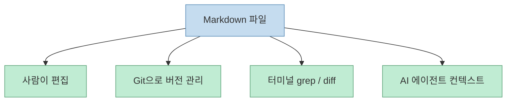
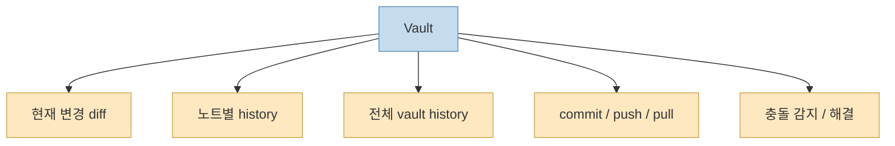
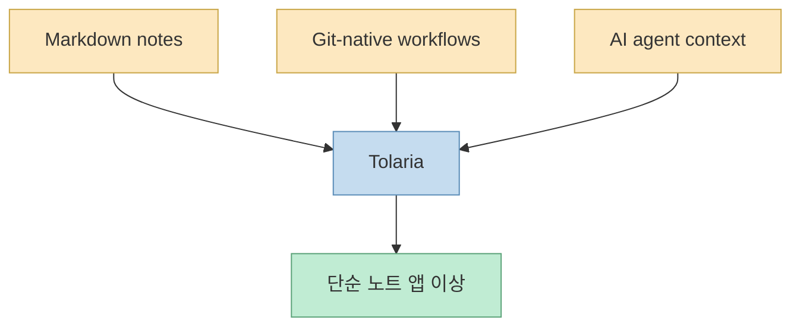
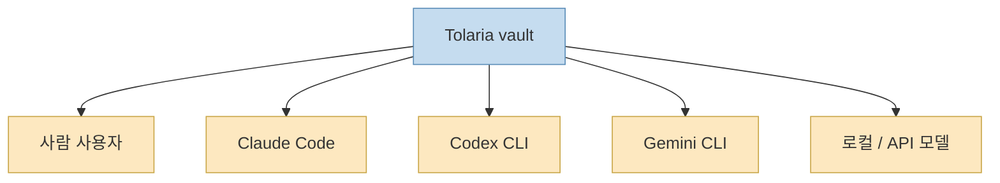
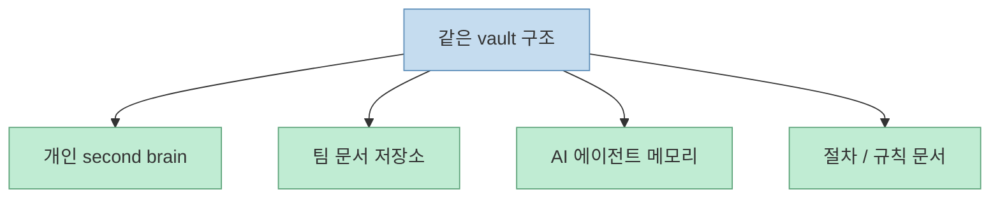

이 X 포스트는 Tolaria를 “Obsidian의 오픈소스 대체재”로 소개하면서, 핵심 아이디어를 아주 짧게 요약합니다. **파일이 곧 데이터이고, Git이 곧 동기화** 라는 설명입니다. 작성자는 일반 Markdown 파일로 지식을 저장하고, 각 지식 저장소 자체를 Git 저장소로 다루며, 버전 이력과 원격 백업을 자연스럽게 얻는 점을 강조합니다. 이 요약은 꽤 정확합니다. 실제 Tolaria 공식 문서와 Git 개념 문서를 보면, Tolaria는 Markdown 파일과 YAML frontmatter를 기본 계약으로 삼고, Git을 history와 sync의 권장 레이어로 두며, 앱 안에서 commit, push, history, diff를 직접 다루도록 설계되어 있습니다. [X oEmbed](https://publish.x.com/oembed?url=https://x.com/i/status/2063614493763268684) [Tolaria](https://tolaria.md/) [Git | Tolaria](https://tolaria.md/concepts/git)

하지만 Tolaria를 “Obsidian 비슷한 Markdown 노트 앱”으로만 보면 절반만 보는 셈입니다. 공식 홈페이지와 GitHub README를 보면, Tolaria는 단순 편집기보다 **Markdown 파일, 관계형 노트 구조, Git 버전 관리, 로컬 AI 에이전트, 직접 연결된 모델 제공자** 를 한 워크스페이스 안에 통합하려고 합니다. 즉 이 프로젝트의 포인트는 메모를 예쁘게 적는 데 있지 않고, **지식 베이스를 사람도 읽고 AI 에이전트도 바로 쓸 수 있는 로컬 운영체제처럼 다루는 것** 에 더 가깝습니다. [Tolaria](https://tolaria.md/) [GitHub](https://github.com/refactoringhq/tolaria)
<!--more-->

## Sources

- https://x.com/i/status/2063614493763268684
- https://github.com/refactoringhq/tolaria
- https://tolaria.md/
- https://tolaria.md/concepts/git

## 1. Tolaria의 핵심은 '노트 앱'보다 '파일 계약'에 있다

Tolaria 공식 홈페이지의 첫 구조 설명은 아주 분명합니다. `Every note is a Markdown file with a YAML frontmatter. No database, no proprietary format.` 즉 노트는 DB 레코드가 아니라 디스크 위의 일반 Markdown 파일이며, 구조화 정보는 YAML frontmatter에 들어갑니다. GitHub README도 같은 원칙을 반복합니다. `Files-first`, `Standards-based`를 내세우며, 파일은 portable하고 diffable하며 export step이 필요 없다고 설명합니다. [Tolaria](https://tolaria.md/) [GitHub](https://github.com/refactoringhq/tolaria)

이건 단순 철학 선언이 아닙니다. 많은 노트 앱은 사용 중에는 편하지만, 시간이 지나면 다음 문제가 생깁니다.

- 데이터가 앱 내부 DB에 잠긴다 
- 다른 에디터나 CLI에서 다루기 불편하다 
- Git diff나 grep 같은 개발자 도구와 잘 안 맞는다 
- AI 에이전트에게 바로 컨텍스트로 넘기기 어렵다

Tolaria는 이 지점을 정면으로 겨냥합니다. Markdown이 원본 계약이면, 사람은 다른 에디터로 열 수 있고, 개발자는 터미널에서 검색할 수 있으며, 에이전트는 파일 시스템을 그대로 읽으면 됩니다. 즉 Tolaria의 출발점은 UI보다 **파일 포맷 안정성** 입니다. [Tolaria](https://tolaria.md/) [GitHub](https://github.com/refactoringhq/tolaria)

그래서 Tolaria를 이해할 때 첫 질문은 “편집기가 얼마나 좋나?”보다 “지식 베이스의 원본 계약이 무엇인가?”가 되어야 합니다.

## 2. Git-first는 단순 백업이 아니라 지식 운영 방식 자체를 바꾼다

X 포스트가 “Git 즉 동기화”라고 요약한 부분도 중요한데, Tolaria 공식 Git 문서는 이걸 좀 더 넓게 설명합니다. Git은 단순 원격 백업이 아니라 **history and sync layer** 로 정의됩니다. 문서에 따르면 Tolaria는 vault 전체 커밋 이력, 현재 diff, 개별 노트 히스토리, pull/push, 충돌 감지와 해결, remote 연결을 앱 안에서 제공하려고 합니다. 즉 Git은 부가 기능이 아니라, 지식 베이스를 다루는 기본 운영 방식입니다. [Git | Tolaria](https://tolaria.md/concepts/git)

이 점이 중요한 이유는, 많은 지식 관리 앱에서 동기화와 버전 관리는 숨겨진 백엔드 기능으로 취급되기 때문입니다. 반면 Tolaria는 Git을 숨기지 않습니다. 오히려 “노트도 코드처럼 이력과 diff와 restore point를 가진다”는 개발자적 모델을 전면에 둡니다. README가 `Every vault is a git repository`라고 못 박는 것도 같은 맥락입니다. [GitHub](https://github.com/refactoringhq/tolaria) [Git | Tolaria](https://tolaria.md/concepts/git)

즉 Tolaria의 Git-first는 “GitHub에 백업해 준다” 정도가 아닙니다. **지식의 변경 과정을 코드처럼 추적 가능하게 만든다** 는 뜻입니다. 특히 팀 단위 문서나 AI 컨텍스트 자산을 다룰 때 이 차이는 매우 큽니다. 무엇이 바뀌었고, 누가 바꿨고, 어느 시점으로 되돌릴 수 있는지가 바로 보이기 때문입니다.

## 3. Tolaria가 Obsidian 대체재로 불리는 이유와, 그 표현이 충분하지 않은 이유

X 포스트는 Tolaria를 Obsidian의 오픈소스 대체재로 소개합니다. 이 표현이 완전히 틀린 것은 아닙니다. Tolaria도 Markdown 기반이고, wikilinks와 관계형 탐색, 그래프적 사고, 개인 지식 관리, second brain 용도를 전면에 내세웁니다. 공식 홈페이지도 “A second brain for the AI era”라고 말하고, GitHub README 역시 personal knowledge, company docs as context for AI, assistants memory and procedures 같은 사용 사례를 직접 적습니다. [X oEmbed](https://publish.x.com/oembed?url=https://x.com/i/status/2063614493763268684) [Tolaria](https://tolaria.md/) [GitHub](https://github.com/refactoringhq/tolaria)

하지만 이 표현만으로는 충분하지 않습니다. 왜냐하면 Tolaria는 단순히 “Obsidian 비슷한 것”이 아니라, 적어도 공식 문서 기준으로는 세 가지를 더 강하게 묶고 있기 때문입니다.

- Git이 앱의 핵심 계층으로 직접 들어와 있다 
- 로컬 에이전트와 직접 모델 제공자를 함께 다룬다 
- 문서가 AI 컨텍스트 자산이라는 관점이 매우 강하다

즉 Tolaria는 노트 앱 비교 시장에만 있는 것이 아니라, **AI 시대의 문서 운영 환경** 을 만들려는 쪽에 더 가깝습니다. 그래서 “오픈소스 Obsidian”이라는 말은 진입 설명으로는 괜찮지만, 제품 정체성을 다 설명하지는 못합니다.

즉 Tolaria의 차별점은 노트 작성 UI보다, **지식이 코드처럼 버전 관리되고 에이전트 컨텍스트처럼 소비되는 구조** 에 있습니다.

## 4. 공식 문서가 말하는 AI-first는 'AI만 있는 앱'이 아니라 '에이전트가 읽기 좋은 vault'다

GitHub README의 원칙 중 눈에 띄는 문장이 있습니다. `AI-first but not AI-only`. 설명을 보면, 파일 기반 vault는 AI 에이전트와 잘 맞지만 사용자는 어떤 AI든 자유롭게 쓸 수 있고, Claude Code, Codex CLI, Gemini CLI 같은 setup path를 지원한다고 합니다. 홈페이지도 `Local agents and direct models`를 따로 섹션으로 두고, CLI coding agents와 local/API model providers를 함께 언급합니다. [GitHub](https://github.com/refactoringhq/tolaria) [Tolaria](https://tolaria.md/)

이건 꽤 중요한 설계 선택입니다. 많은 AI 노트 앱은 자체 챗 패널이나 요약 기능 정도에서 끝나지만, Tolaria는 문서를 **에이전트가 직접 편집·탐색 가능한 작업공간** 으로 보려 합니다. 즉 AI는 노트 앱 안의 위젯이 아니라, 파일·관계·Git 이력이 있는 vault 위에서 작동하는 또 하나의 사용자입니다.

이 관점에서 보면 Tolaria의 “AI-first”는 자동 완성 기능이 많다는 뜻이 아니라, **지식 베이스 자체가 에이전트 친화적으로 설계되어 있다** 는 뜻에 가깝습니다. Markdown 원본 계약, Git 이력, YAML frontmatter, wikilink 관계가 모두 그 방향과 연결됩니다.

## 5. Tolaria는 '개인 세컨드 브레인'과 '팀 문서 컨텍스트'를 같은 구조로 다룬다

GitHub README는 사용 사례를 두 축으로 제시합니다. 하나는 second brain과 personal knowledge이고, 다른 하나는 company docs as context for AI, assistants memory and procedures입니다. 이 조합은 중요합니다. 보통 개인 지식 관리 도구와 팀 문서 시스템은 다른 제품군으로 나뉘는데, Tolaria는 둘을 같은 파일 기반 vault 모델로 묶습니다. [GitHub](https://github.com/refactoringhq/tolaria)

이게 가능한 이유는 Tolaria의 구조가 “노트 앱”보다 “문서 저장소”에 가깝기 때문입니다. 개인은 저널, 글감, 레퍼런스를 쌓을 수 있고, 팀은 절차서, 운영 문서, AI 에이전트 메모리, 규칙 파일을 넣을 수 있습니다. Git이 들어오면 리뷰와 롤백이 가능하고, Markdown 계약이 있으면 여러 도구가 같은 자산을 읽을 수 있습니다.

즉 Tolaria는 메모 앱 하나를 더 만드는 것이 아니라, **사람 문서와 AI 문서를 같은 형식으로 관리하는 지식 저장소** 를 만들려는 방향으로 읽는 편이 정확합니다.

## 6. 결국 Tolaria의 본질은 '앱'보다 '로컬 지식 운영체제'에 가깝다

공식 문서 전반을 종합하면 Tolaria의 핵심은 세 단어로 정리됩니다. `files-first`, `git-first`, `offline-first`. 여기에 `AI-first but not AI-only`가 얹힙니다. 이 조합이 의미하는 바는 명확합니다. 사용자는 자신의 지식 자산을 클라우드 SaaS 안에 넣는 대신, **디스크 위의 Markdown 저장소 + Git 히스토리 + 로컬 에이전트 연결** 로 운용할 수 있습니다. [GitHub](https://github.com/refactoringhq/tolaria) [Tolaria](https://tolaria.md/) [Git | Tolaria](https://tolaria.md/concepts/git)

그래서 Tolaria는 단순 노트 UI 비교에서만 보면 과소평가되기 쉽습니다. 진짜 포인트는:

- 문서 원본 계약을 Markdown으로 고정하고 
- 변경 이력을 Git으로 다루고 
- 사람과 에이전트가 같은 vault를 읽고 쓰게 하며 
- 모든 걸 로컬 우선으로 유지한다는 점입니다

이 구조는 앞으로 AI 시대의 문서 도구가 어디로 가는지 보여 주는 한 가지 전형이기도 합니다.

## 핵심 요약

- X 포스트의 핵심 요약인 “파일이 데이터이고 Git이 동기화”는 공식 문서와 대체로 일치합니다. 
- Tolaria의 본질은 노트 앱 UI보다 **Markdown 파일 계약** 에 있습니다. 
- Git은 단순 백업이 아니라 vault의 **history and sync layer** 로 작동합니다. 
- Tolaria는 Obsidian 대체재로 불리지만, 실제로는 **Git-native + AI-agent-friendly knowledge base** 쪽에 더 가깝습니다. 
- 공식 문서의 `AI-first but not AI-only`는, AI가 위젯이 아니라 **vault를 읽고 쓰는 주체** 라는 뜻에 가깝습니다. 
- 개인 second brain과 팀 문서 컨텍스트를 같은 구조로 다룰 수 있다는 점이 Tolaria의 큰 특징입니다.

## 결론

Tolaria를 “오픈소스 Obsidian”이라고 부르면 이해는 빠르지만, 그 표현만으로는 제품의 핵심을 놓치기 쉽습니다. 이 프로젝트의 진짜 포인트는 예쁜 노트 편집기가 아니라, **지식 베이스를 파일·Git·에이전트 중심으로 다시 설계하는 방식** 에 있습니다.

그래서 Tolaria는 메모 앱 경쟁에서만 볼 것이 아니라, AI 시대의 로컬 문서 운영체제가 어떤 모습이어야 하는지 보여 주는 사례로 읽는 편이 더 맞습니다. Markdown이 원본이고, Git이 이력이며, 에이전트가 같은 vault를 읽는 구조. 이 조합이 앞으로 더 자주 보이게 될 가능성이 큽니다.
