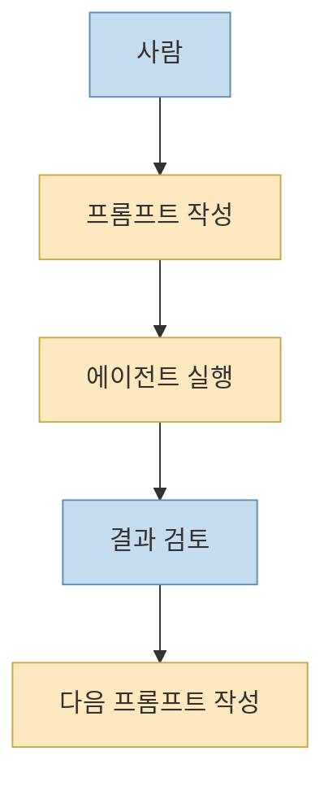
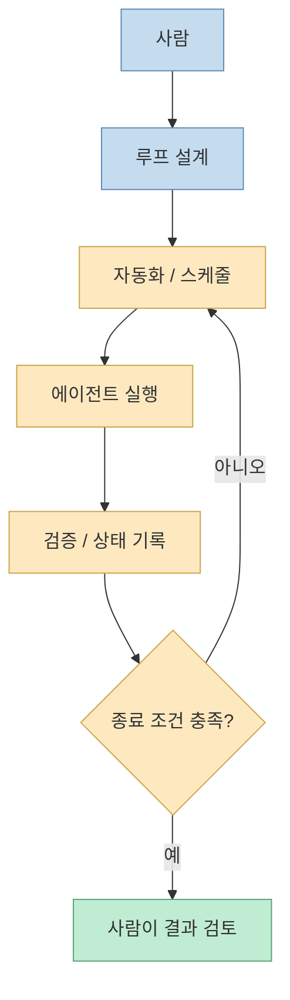
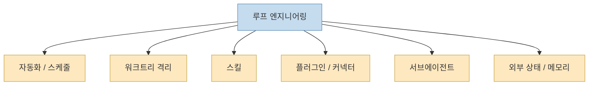
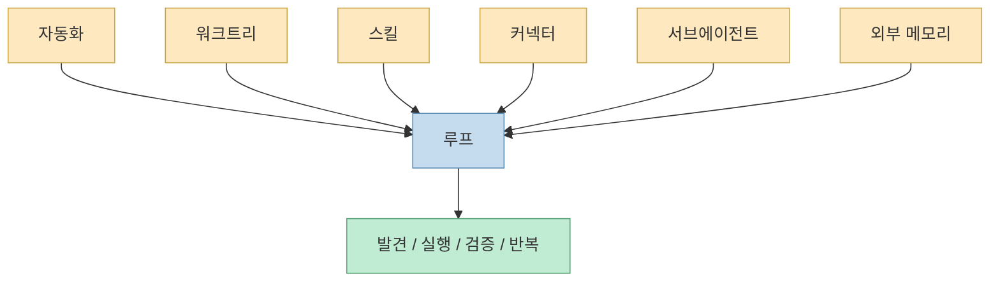
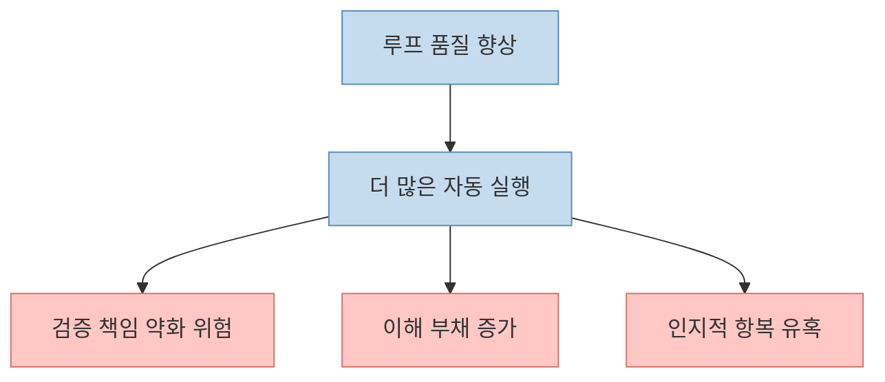

이 Threads 포스트의 첫 문장은 강합니다. “이제 코딩 에이전트한테 프롬프트 치지 마라.” 하지만 이 문장을 문자 그대로 받아들이면 오해하기 쉽습니다. 공개 메타데이터에 드러난 본문을 보면, 글쓴이가 말하는 핵심은 프롬프트를 아예 쓰지 말라는 뜻이 아니라, **사람이 매번 한 줄씩 지시하는 방식에서 벗어나 에이전트가 반복 실행할 작업 루프를 설계하라** 는 뜻입니다. 글 안에서는 이 흐름을 `루프 엔지니어링`이라는 키워드로 요약합니다. [Threads](https://www.threads.com/@ai.corder/post/DZZL9ekmY92?xmt=AQG0byzkMt_R7n7ffkDasRdE4OxCu0sitKoMFQ0bRgivZk2QoPIXNUyAgZm2945-vewRmeyy&slof=1)

이 표현은 최근 며칠 사이 갑자기 떠오른 유행어가 아닙니다. Addy Osmani는 2026년 6월 7일 글에서 `Loop engineering is replacing yourself as the person who prompts the agent. You design the system that does it instead.`라고 정리했고, 같은 글에서 Peter Steinberger의 “You shouldn’t be prompting coding agents anymore. You should be designing loops that prompt your agents.” 발언과 Boris Cherny의 “I don’t prompt Claude anymore. I have loops running...” 발언을 함께 인용합니다. 즉 이 Threads 포스트는 혼자 떠든 주장이 아니라, 지금 코딩 에이전트 실무자들 사이에서 생기는 **레버리지 이동** 을 요약한 것으로 보는 편이 정확합니다. [Addy Osmani](https://addyosmani.com/blog/loop-engineering/) [Peter Steinberger quote via Addy](https://addyosmani.com/blog/loop-engineering/)
<!--more-->

## Sources

- https://www.threads.com/@ai.corder/post/DZZL9ekmY92?xmt=AQG0byzkMt_R7n7ffkDasRdE4OxCu0sitKoMFQ0bRgivZk2QoPIXNUyAgZm2945-vewRmeyy&slof=1
- https://addyosmani.com/blog/loop-engineering/
- https://x.com/steipete/status/2063697162748260627

## 1. 루프 엔지니어링은 프롬프트를 버리는 게 아니라 '프롬프팅의 위치'를 바꾸는 일이다

Threads 원문 메타 설명은 이 점을 비교적 정확히 짚습니다. “정확히는 프롬프트를 아예 쓰지 말라는 뜻이 아니다. 매번 사람이 한 줄씩 지시하는 방식에서 벗어나, 에이전트가 반복 실행할 작업 루프를 설계하라는 뜻이다.” 즉 핵심은 프롬프트의 소멸이 아니라 **프롬프트의 외부화** 입니다. [Threads](https://www.threads.com/@ai.corder/post/DZZL9ekmY92?xmt=AQG0byzkMt_R7n7ffkDasRdE4OxCu0sitKoMFQ0bRgivZk2QoPIXNUyAgZm2945-vewRmeyy&slof=1)

Addy Osmani의 정의도 정확히 같은 방향입니다. 그는 루프를 “a recursive goal where you define a purpose and the AI iterates until complete”라고 설명합니다. 즉 과거에는 사람이 직접:

- 작업을 지시하고 
- 중간 결과를 읽고 
- 다시 지시하고 
- 끝났는지 판단하는

턴 바이 턴 루프를 손으로 돌렸습니다.

이제는 그 구조 자체를 시스템으로 밖에 빼내는 것입니다. 사람이 하던 “다음 프롬프트를 쓰는 일”을 **자동화 규칙, 상태, 검증 조건, 서브에이전트 구조** 로 옮기는 셈입니다. [Addy Osmani](https://addyosmani.com/blog/loop-engineering/)

즉 루프 엔지니어링은 “프롬프트를 그만 써라”가 아니라, **사람이 하던 프롬프트 반복 업무를 시스템으로 치환하라** 는 뜻입니다.

## 2. 왜 지금 이 말이 나오는가: 에이전트 제품이 이미 루프 부품을 내장하기 시작했기 때문이다

Addy는 이 현상이 단순 이론이 아니라 도구 레벨에서 이미 구현되고 있다고 말합니다. 예전에는 루프를 만들려면 개인이 `bash`와 스크립트로 다 짜야 했지만, 이제는 그 부품들이 제품 안에 들어오기 시작했다는 것입니다. 그는 Codex 앱과 Claude Code를 나란히 놓고, 두 제품 모두 이제 **자동화, 워크트리, 스킬, 플러그인/커넥터, 서브에이전트, 상태 저장** 을 거의 비슷한 모양으로 갖췄다고 설명합니다. [Addy Osmani](https://addyosmani.com/blog/loop-engineering/)

이 포인트가 중요합니다. 루프 엔지니어링이 갑자기 유행하는 이유는 누군가 새 용어를 만든 탓만이 아닙니다. **이제는 정말 루프를 만들 수 있는 기본 부품이 제품에 실장되었기 때문** 입니다. 스케줄 실행, `/goal`, `/loop`, worktree 격리, `SKILL.md`, MCP 커넥터, 검증 서브에이전트 같은 요소들이 그 예입니다.

즉 이 흐름은 철학의 변화이면서 동시에 제품 기능의 변화입니다. 도구가 달라지니 작업 방식도 달라진 것입니다.

## 3. 루프의 핵심 부품은 결국 다섯 가지와 하나의 외부 기억이다

Addy Osmani는 루프에 필요한 다섯 가지를 아주 명시적으로 적습니다.

1. 스케줄 기반 자동화와 discovery / triage 
2. 병렬 작업 충돌을 막는 worktrees 
3. 프로젝트 지식을 명시하는 skills 
4. 실제 도구와 연결하는 plugins / connectors 
5. 만드는 자와 검토하는 자를 분리하는 sub-agents

그리고 여기에 하나를 더 붙입니다. **memory**, 즉 단일 대화 밖에 존재하는 상태 저장소입니다. Markdown 파일이든, Linear 보드든, AGENTS 파일이든 상관없지만 대화 컨텍스트가 아니라 **디스크 위에 남는 상태** 여야 한다는 것입니다. [Addy Osmani](https://addyosmani.com/blog/loop-engineering/)

이 구성이 중요한 이유는, 루프를 “반복 실행되는 프롬프트” 수준으로 축소해서 보지 않게 해 주기 때문입니다. 루프는 그냥 다시 돌리는 명령이 아닙니다. **발견 → 작업 분배 → 검증 → 상태 기록 → 다음 행동 결정** 을 이어 주는 운영 구조입니다.

Threads에서 말하는 “작업 루프를 설계하라”는 문장은 바로 이 전체 구조를 가리키는 것으로 읽는 편이 맞습니다.

## 4. 왜 스킬과 상태가 중요하냐면, 없으면 매 세션마다 같은 설명을 다시 하게 되기 때문이다

Addy는 스킬을 “you stop re-explaining the same project context every session like a goldfish”라고 표현합니다. 꽤 직설적이지만 정확한 설명입니다. 루프가 돌아가려면 에이전트가 프로젝트 규칙, 빌드 방식, 테스트 경로, 금지 패턴, 성공 기준을 외부에서 읽을 수 있어야 합니다. 그렇지 않으면 루프는 매 사이클마다 프로젝트를 새로 추론하고, 그때마다 틀릴 가능성이 커집니다. [Addy Osmani](https://addyosmani.com/blog/loop-engineering/)

외부 상태 저장도 같은 이유로 중요합니다. Addy는 “the model forgets everything between runs so the memory has to be on disk and not in the context”라고 씁니다. 즉 루프는 장기적으로 돌수록 메모리와 로그와 상태 파일이 spine 역할을 해야 합니다. 오늘 어디까지 했는지, 어떤 시도가 실패했는지, 내일 어디서 이어야 하는지를 외부에서 들고 있어야 다음 실행이 이어집니다. [Addy Osmani](https://addyosmani.com/blog/loop-engineering/)

그래서 루프 엔지니어링의 실제 핵심은 프롬프트 문장 자체보다:

- 프로젝트 지식이 밖에 적혀 있는가 
- 실패한 시도와 남은 할 일이 기록되는가 
- 다음 실행이 이전 실행을 이어받는가

에 더 가깝습니다.

## 5. 루프가 좋아질수록 더 커지는 세 가지 위험도 함께 봐야 한다

Addy는 글 후반부에서 루프가 만능이 아니라고 분명히 경고합니다. 오히려 루프가 좋아질수록 더 날카로워지는 세 가지 문제가 있다고 말합니다.

- `Verification is still on you` 
- `Comprehension debt`는 더 빨리 커진다 
- `Cognitive surrender`가 더 쉬워진다

즉 자동 루프가 계속 돌고, PR도 열고, 테스트도 통과시키고, 티켓도 갱신해 주면 사람은 쉽게 “알아서 잘 되겠지”라는 태도로 미끄러질 수 있습니다. 하지만 그 순간 이해 부채가 쌓이고, 루프가 틀릴 때는 **사람이 모르는 상태로 틀린 결과가 축적** 됩니다. [Addy Osmani](https://addyosmani.com/blog/loop-engineering/)

그래서 Threads 포스트의 메시지를 “이제 사람은 빠져도 된다”로 읽으면 정반대로 이해한 셈입니다. 진짜 뜻은 사람의 역할이 **턴 단위 프롬프터에서 루프 설계자이자 검증자** 로 이동한다는 것입니다.

## 6. 결국 루프 엔지니어링은 레버리지의 이동이지, 책임의 제거가 아니다

Addy Osmani는 글 마지막에서 아주 명확히 말합니다. `The leverage point moved.` 즉 일은 쉬워진 게 아니라, **효율이 크게 나는 지점이 바뀐 것** 입니다. 예전에는 좋은 프롬프트와 충분한 컨텍스트가 레버리지였다면, 이제는:

- 어떤 주기로 작업을 발견할지 
- 어떤 스킬을 읽힐지 
- 어떤 서브에이전트가 검증할지 
- 어떤 종료 조건으로 멈출지 
- 어떤 상태를 디스크에 남길지

를 설계하는 능력이 더 큰 차이를 만듭니다. [Addy Osmani](https://addyosmani.com/blog/loop-engineering/)

이 점에서 Threads 포스트의 문장 “작업 루프를 설계하라”는 꽤 좋은 요약입니다. 결국 루프 엔지니어링은 코딩 에이전트 시대의 새로운 생산성 기술이라기보다, **사람이 직접 하던 orchestration을 외부 시스템으로 옮기는 설계 기술** 에 가깝습니다.

## 핵심 요약

- Threads 원문의 뜻은 “프롬프트를 버려라”가 아니라 **프롬프팅의 반복을 루프로 외부화하라** 는 것입니다. 
- Addy Osmani는 이를 `loop engineering`이라 부르며, 사람이 직접 프롬프트하는 대신 **그 일을 하는 시스템을 설계하는 것** 이라고 정의합니다. 
- 루프의 핵심 부품은 자동화, worktrees, skills, connectors, sub-agents, 그리고 외부 memory입니다. 
- 이 흐름이 최근 커진 이유는 Codex와 Claude Code 같은 도구가 이미 이런 부품을 **제품 안에 내장** 하기 시작했기 때문입니다. 
- 루프가 좋아질수록 verification 책임, comprehension debt, cognitive surrender 같은 위험도 함께 커집니다. 
- 따라서 사람의 역할은 사라지는 게 아니라 **프롬프터에서 루프 설계자와 검증자** 로 이동합니다.

## 결론

“이제 코딩 에이전트한테 프롬프트 치지 마라”는 말은 자극적으로 들리지만, 실제 뜻은 꽤 실무적입니다. 사람 손으로 반복하던 지시, 체크, 재시도, 상태 기록, 종료 판단을 **한 번 설계된 루프** 로 옮기라는 이야기입니다.

그래서 루프 엔지니어링의 핵심은 자동화 그 자체가 아니라, **어떤 루프를 믿어도 되는가** 를 설계하는 일입니다. 프롬프트를 안 쓰는 시대가 온 게 아니라, 프롬프트를 언제, 어디에, 어떤 구조로 심을지가 더 중요해진 시대가 온 것입니다.
