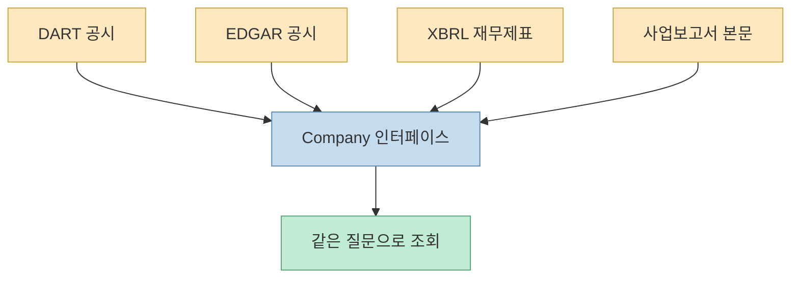
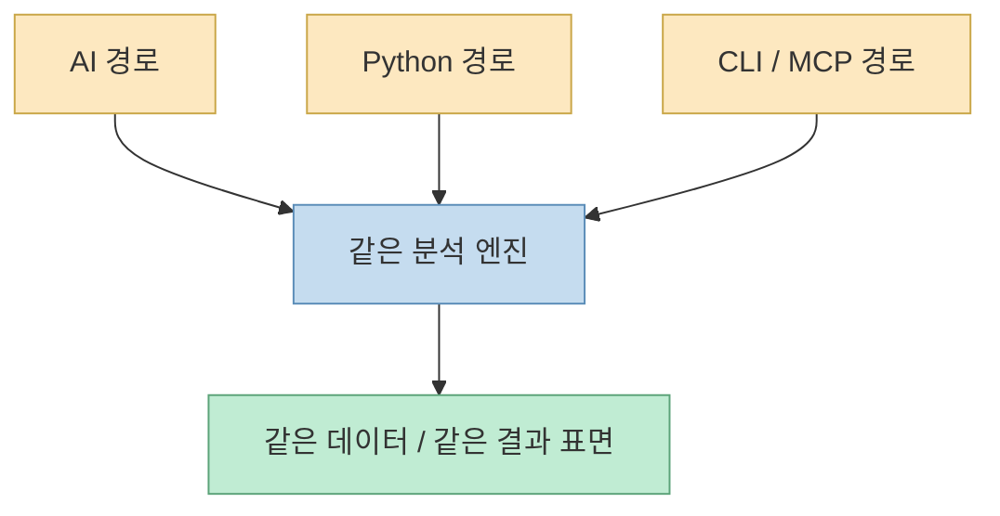
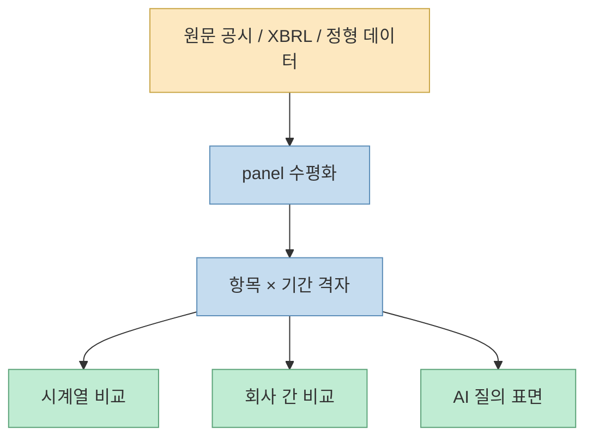
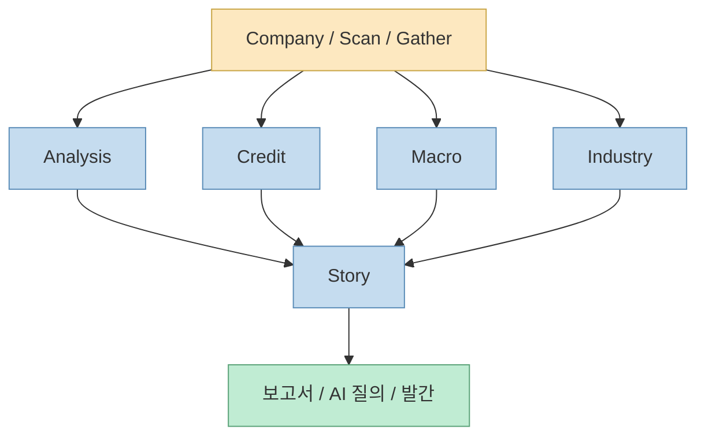
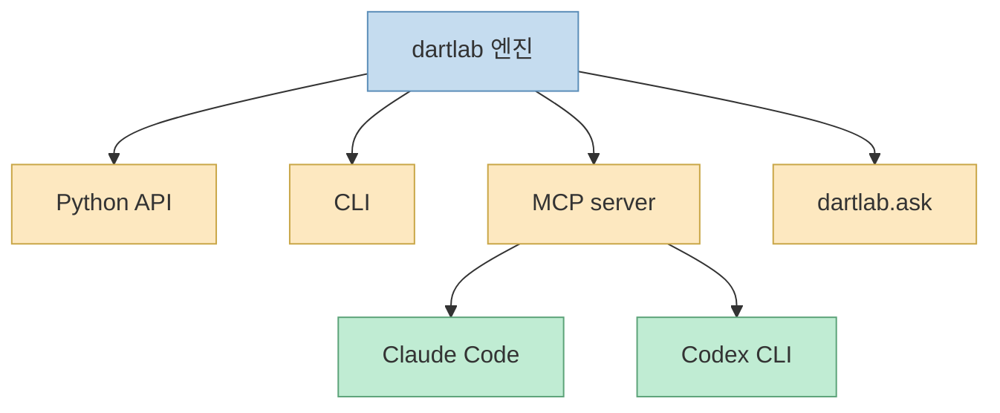

`dartlab`의 첫 인상은 꽤 선명합니다. README의 슬로건부터 `종목코드 하나. 기업의 전체 이야기.`라고 시작하고, 이어서 `Korean DART + US SEC EDGAR 공시를 한 줄의 Python으로 읽고 비교한다.`고 설명합니다. 이 문장만 보면 단순 공시 수집 라이브러리처럼 보일 수 있습니다. 하지만 README 전체를 읽어 보면 이 프로젝트의 포인트는 PDF나 XBRL을 모으는 데 있지 않습니다. 핵심은 **회사마다 다른 공시 구조와 계정명을 비교 가능한 표면으로 수평화해서, 작년과 올해, 삼성전자와 애플, 한 종목과 전체 시장을 같은 질문으로 읽게 만드는 것** 입니다. [GitHub](https://github.com/eddmpython/dartlab)

즉 `dartlab`은 “문서를 가져오는 도구”보다 **비교 가능한 기업 데이터 인터페이스를 만드는 엔진** 에 더 가깝습니다. README는 이를 아주 직접적으로 말합니다. 핵심은 단순 수집이 아니라, 회사마다 다른 계정명과 공시 목차를 `topic × period`, `account × period` 형태로 수평화해, 한 종목의 시계열 비교와 종목 간 횡단 비교를 같은 질문으로 가능하게 만드는 것이라고요. 그래서 `dartlab`의 진짜 가치는 데이터 소스 자체보다, 그 소스를 사람이든 AI든 **같은 표면으로 질의할 수 있게 바꾸는 레이어** 에 있습니다. [GitHub](https://github.com/eddmpython/dartlab)
<!--more-->

## Sources

- https://github.com/eddmpython/dartlab

## 1. dartlab의 본질은 '공시 수집기'보다 '질문 표면 통일기'에 있다

README가 가장 강조하는 차별점은 `Company` 인터페이스입니다. DART와 EDGAR, 재무제표, 사업보고서 본문, 정형 보고서, 비율, 신용위험, 산업 맵, 매크로 맥락을 같은 표면으로 호출한다고 설명합니다. 이건 단순 API 래퍼 수준을 넘어섭니다. 보통 기업 데이터를 다룰 때는:

- 원문 공시 목록을 따로 뒤지고 
- XBRL 계정명을 따로 맞추고 
- 사업보고서 본문은 또 다른 파서로 읽고 
- 한국과 미국 회사는 아예 다른 코드 경로로 다루게 됩니다

그런데 dartlab은 이 분절을 `Company("005930").panel(...)` 같은 통일된 인터페이스로 감춥니다. [GitHub](https://github.com/eddmpython/dartlab)

즉 이 프로젝트의 진짜 가치는 데이터를 더 많이 모으는 데 있지 않습니다. 더 중요한 건, **서로 다른 형식의 기업 정보를 같은 질문 표면으로 통일** 한다는 점입니다.

그래서 `dartlab`을 이해할 때 첫 질문은 “무슨 데이터를 가져오나?”보다 “**다른 구조의 데이터를 어떻게 같은 표면으로 바꾸나**?”가 되어야 합니다.

## 2. README가 말하는 핵심 구조는 '세 가지 시작점, 하나의 엔진'이다

README는 사용 경로를 세 가지로 분리합니다.

- AI로 바로 사용 
- Python 코드로 사용 
- CLI로 사용

하지만 이어서 중요한 문장을 하나 붙입니다. **출발점만 다를 뿐 결과는 같다.** 모두 같은 `Company`와 같은 분석 엔진을 호출하기 때문이라는 것입니다. [GitHub](https://github.com/eddmpython/dartlab)

이건 생각보다 중요한 설계입니다. 많은 데이터 도구는 Python API와 웹 UI와 CLI가 서로 다른 제품처럼 분리됩니다. 반면 `dartlab`은 질문 표면을 하나로 유지한 채, 진입점만 세 갈래로 나눕니다. 그래서:

- 분석가는 자연어 질문으로 접근할 수 있고 
- 개발자는 Python 객체로 직접 다룰 수 있으며 
- 자동화 사용자는 CLI와 MCP로 연결할 수 있습니다

즉 `dartlab`은 라이브러리이면서 동시에 CLI이고, MCP 서버이며, AI 워크벤치이기도 합니다. 이 세 표면이 분리되지 않는다는 점이 꽤 큰 장점입니다.

## 3. panel의 의미는 '표를 보여준다'가 아니라 '비교 가능한 격자로 수평화한다'는 데 있다

README에서 가장 반복적으로 등장하는 함수는 `c.panel()` 입니다. 여기서 중요한 건 단순 조회 함수가 아니라는 점입니다. 설명을 보면 `공시 항목 × 기간 전체 격자`, `손익계산서`, `native 손익`, `재무비율`, `사업 개요` 같은 서로 다른 정보를 모두 `panel`이라는 한 표면 위에 올립니다. 그리고 이때 핵심 단어가 `격자`, `수평화`, `period 축` 입니다. [GitHub](https://github.com/eddmpython/dartlab)

즉 `panel`은 “표 하나 보여준다”가 아니라, 원래 구조가 제각각인 정보들을 **항목 × 기간이라는 동일 격자** 로 바꾸는 역할을 합니다. 이게 중요한 이유는, 실제 비교 질문이 거의 항상 시계열 축을 요구하기 때문입니다.

- 작년 대비 매출은 어땠는가 
- 분기별 이익률은 어떻게 움직였는가 
- 같은 회사의 2024Q4와 2025Q4를 나란히 볼 수 있는가 
- 한국 회사와 미국 회사를 같은 항목으로 읽을 수 있는가

이 질문에 답하려면 원천 데이터보다 먼저 **비교 가능한 틀** 이 필요합니다. `panel`은 바로 그 틀을 제공합니다.

그래서 `dartlab`의 `panel`은 단순 출력 함수가 아니라, **기업 데이터를 질문 가능하게 만드는 핵심 변환 계층** 으로 보는 편이 맞습니다.

## 4. 같은 회사를 넘어서 전 시장을 훑는 scan과 compare가 붙으면서 '회사 분석 운영체제'가 된다

README는 `Company`만이 아니라 `Scan`, `Compare`, `Gather` 같은 상위 표면도 함께 소개합니다. `scan`은 전 종목 대상 거버넌스, 인력, 주주환원, 부채, 현금흐름, 감사, 내부자, 이익의 질, 유동성 등을 횡단 분석하는 엔진이고, `compare`는 2~6개 회사를 같은 topic·시점 격자로 정렬하는 공식 표면입니다. `gather`는 주가, 수급, 거시지표, 뉴스 같은 외부 시장 데이터를 붙입니다. [GitHub](https://github.com/eddmpython/dartlab)

이 조합이 중요한 이유는, 이렇게 되면 `dartlab`이 더 이상 “회사 한 곳을 읽는 라이브러리”에 머물지 않기 때문입니다.

- `Company`는 한 회사를 깊게 파고 
- `Compare`는 여러 회사를 같은 축으로 정렬하고 
- `Scan`은 시장 전체를 횡단해 패턴을 뽑고 
- `Gather`는 외부 가격/뉴스/매크로를 붙입니다

즉 이 프로젝트는 개별 조회 도구가 아니라, **미시(회사)와 거시(시장)를 같은 엔진 위에 얹는 분석 운영체제** 에 더 가깝습니다.

## 5. credit, macro, industry, story까지 올라가면 '데이터'가 아니라 '해석용 계층'이 된다

README 중간 이후부터는 레이어 구조가 더 분명해집니다.

- `Analysis`는 재무 인과 분석 
- `Credit`은 독립 신용평가 
- `Macro`는 경기/금리/유동성/심리 등 매크로 환경 
- `Industry`는 산업 매퍼와 공급망 엣지 
- `Story`는 이런 분석 결과를 보고서로 조합하는 계층

즉 원시 공시를 읽어 오는 데서 끝나지 않고, 그 위에 **해석용 추상화** 를 계속 얹습니다. [GitHub](https://github.com/eddmpython/dartlab)

여기서 특히 `Story`가 흥미롭습니다. README는 이를 단순 보고서 렌더러가 아니라, 5개 엔진의 결과를 6막 스토리텔링 구조로 조합해 블로그에 발간 가능한 기업 이야기를 자동 생성하는 층으로 설명합니다. 이때 포인트는 “AI가 자유롭게 서사를 꾸민다”가 아니라, **이미 계산된 분석 블록들을 구조화된 이야기 형식으로 배치한다** 는 것입니다.

이 구조 덕분에 `dartlab`은 단순 데이터 도구를 넘어서, **기업을 하나의 “질문 가능한 이야기”로 바꾸는 엔진** 에 가까워집니다.

## 6. AI 표면과 MCP가 붙으면서 dartlab은 라이브러리보다 '도구 서버'에 가까워진다

README의 AI 섹션을 보면 `dartlab.ask(...)`는 단순 답변 함수가 아닙니다. 내부에서 `Company`, `analysis`, `credit`, `scan`, `macro` 같은 도구를 직접 호출하고, 어떤 데이터와 계산을 썼는지 추적 가능한 ref를 함께 남긴다고 설명합니다. 또 Claude Code, Codex CLI 같은 외부 도구에서 같은 표면을 부를 수 있게 `dartlab mcp` 진입점도 제공합니다. [GitHub](https://github.com/eddmpython/dartlab)

이건 매우 중요합니다. 보통 데이터 분석 라이브러리는 사람이 직접 코드를 써야 하고, AI가 쓰려면 별도 래퍼를 다시 만들어야 합니다. 반면 `dartlab`은 처음부터 **사람용 라이브러리 + 셸용 CLI + 에이전트용 MCP 서버** 를 같은 엔진 위에 올립니다. 즉 인간 분석가와 코딩 에이전트가 같은 도구 서버를 공유할 수 있게 설계되어 있습니다.

즉 `dartlab`의 AI 가치는 “LLM을 붙였다”가 아니라, **도메인 지식을 도구 표면으로 정식화해 에이전트가 호출하게 만든다** 는 점에 있습니다.

## 7. 결국 dartlab은 '기업 데이터판 Skill OS'에 가까운 구조를 가진다

README 상단 링크에 `Skill OS`, `Skill Market`, `MCP`, 데스크톱 앱, 노트북, 블로그 발간, Hugging Face 데이터셋이 함께 놓여 있는 것도 의미심장합니다. 이건 `dartlab`이 더 이상 Python 패키지 하나가 아니라, **데이터셋 + 엔진 + 툴 서버 + 보고서 조합기 + AI 작업대** 를 하나의 생태계로 밀고 있다는 뜻입니다. [GitHub](https://github.com/eddmpython/dartlab)

그래서 이 저장소를 “재무 데이터 라이브러리” 정도로 보면 축소해서 보는 셈입니다. 더 정확히 말하면, `dartlab`은:

- 공시를 읽고 
- 비교 가능한 격자로 만들고 
- 시장 전체를 스캔하고 
- 신용·매크로·산업 분석을 얹고 
- 스토리로 조합하고 
- AI/CLI/MCP에서 호출하게 하는

도메인 특화 분석 운영체제에 가깝습니다.

## 핵심 요약

- `dartlab`의 본질은 단순 공시 수집보다 **질문 표면 통일** 에 있습니다. 
- DART와 EDGAR, XBRL, 사업보고서 본문, 정형 데이터를 `Company` 같은 같은 표면으로 묶습니다. 
- `panel`은 출력 함수가 아니라 **항목 × 기간 격자 수평화 계층** 입니다. 
- `Company`, `Compare`, `Scan`, `Gather`가 붙으면서 개별 회사 분석을 넘어 시장 횡단 분석까지 지원합니다. 
- `Analysis`, `Credit`, `Macro`, `Industry`, `Story` 계층이 올라가며 데이터가 해석용 시스템으로 바뀝니다. 
- Python, CLI, MCP, `dartlab.ask`가 같은 엔진을 공유한다는 점이 큰 강점입니다.

## 결론

`dartlab`이 흥미로운 이유를 한 문장으로 줄이면 이렇습니다. 이 프로젝트는 공시를 읽는 라이브러리가 아니라, **기업 데이터를 사람이든 AI든 같은 방식으로 질문할 수 있게 바꾸는 운영체제** 에 더 가깝습니다.

그래서 이 저장소의 진짜 매력은 데이터 자체보다 데이터 위에 만든 표면에 있습니다. 한국 DART와 미국 EDGAR를 같은 질문으로 읽고, 같은 패널로 비교하고, 같은 AI 도구로 분석하게 만드는 것. 그게 바로 `dartlab`이 다른 재무 데이터 도구와 구분되는 지점입니다.
