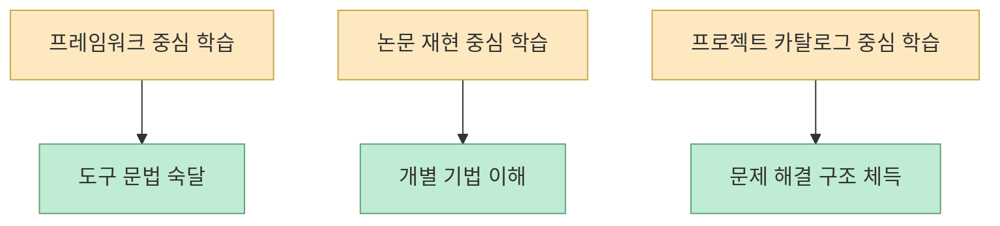
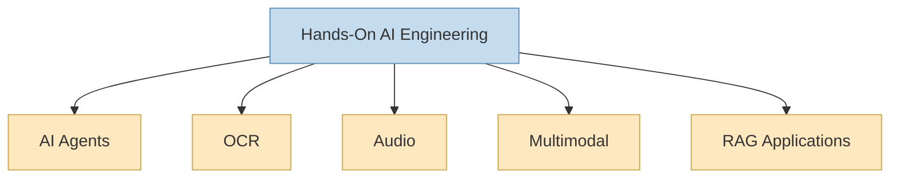
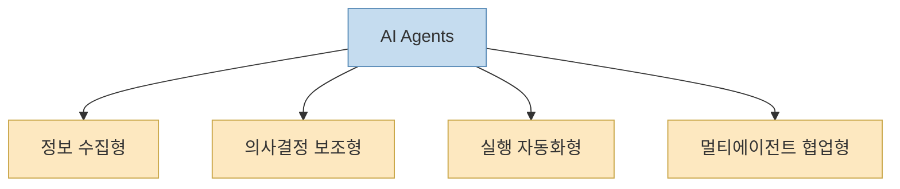
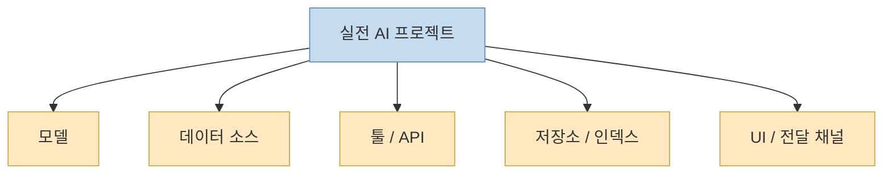

`Hands-On AI Engineering` 저장소를 처음 보면 “AI 예제 모음집”처럼 보입니다. 실제 README도 이를 `A curated collection of practical, production-ready AI projects`라고 소개합니다. 그런데 조금만 더 뜯어보면 이 저장소의 매력은 단순 예제 수집보다 **학습자가 바로 손에 익힐 수 있는 프로젝트 카탈로그** 구조에 있습니다. LLM, 멀티모달, OCR, RAG, 에이전트, 오디오 등 주제를 기술 스택이 아니라 **완성된 응용 프로젝트 단위** 로 정리하고, 각 프로젝트가 독립 폴더와 문서, 의존성 파일, 환경 변수 예시를 갖추도록 요구하기 때문입니다. [GitHub](https://github.com/Sumanth077/Hands-On-AI-Engineering)

즉 이 저장소는 “이 프레임워크를 배워라”보다 “이 문제를 이런 AI 조합으로 풀어 봐라”에 가깝습니다. 예를 들어 같은 에이전트 카테고리 안에서도 금융 분석, 여행 계획, 경쟁사 인텔리전스, 멀티에이전트 리서치, SQL 검색, 고객 지원, 브라우저 자동화, 스케줄링, 뉴스레터 생성처럼 업무 맥락이 완전히 다른 프로젝트들이 나열됩니다. 이런 구성이 중요한 이유는, 요즘 AI 학습의 병목이 라이브러리 문법 이해보다 **실제 업무 시나리오를 어떻게 시스템으로 엮는가** 에 더 가깝기 때문입니다. [GitHub](https://github.com/Sumanth077/Hands-On-AI-Engineering)
<!--more-->

## Sources

- https://github.com/Sumanth077/Hands-On-AI-Engineering

## 1. 이 저장소의 본질은 '튜토리얼'보다 '프로젝트 카탈로그'다

README가 가장 먼저 내세우는 강점은 `Learn by Doing`, `Production-Ready`, `Diverse Use Cases` 입니다. 이 세 문구를 같이 보면 의도가 분명합니다. 단순 개념 설명서가 아니라, **완성형 프로젝트를 직접 만져 보면서 배우는 구조** 로 설계되어 있습니다. [GitHub](https://github.com/Sumanth077/Hands-On-AI-Engineering)

보통 AI 학습 저장소는 두 부류로 갈립니다.

- 특정 프레임워크 사용법을 단계별로 가르치는 저장소 
- 논문/모델 하나를 재현하는 저장소

그런데 `Hands-On AI Engineering`은 그 중간 어디쯤에 있지 않습니다. 오히려 세 번째 유형, 즉 **문제 중심 포트폴리오 저장소** 에 가깝습니다. 학습자는 “LangChain을 배우자”가 아니라 “금융 분석 에이전트를 어떻게 엮는지 보자”, “멀티모달 RAG를 실제 앱으로 어떻게 묶는지 보자”는 식으로 들어가게 됩니다.

즉 이 저장소의 핵심 가치는 “무엇을 공부하느냐”보다 “무엇을 **만들어 보게** 하느냐”에 있습니다.

## 2. 카테고리 구조가 곧 현재 AI 엔지니어링의 지형도다

README를 보면 카테고리가 `AI Agents`, `OCR`, `Audio`, `Multimodal`, `RAG Applications`로 나뉘어 있습니다. 이 분류는 생각보다 중요합니다. 단순히 파일을 보기 좋게 정리한 게 아니라, 2026년 시점의 실전 AI 엔지니어링이 어디에 몰려 있는지를 보여 주기 때문입니다. [GitHub](https://github.com/Sumanth077/Hands-On-AI-Engineering)

예를 들어:

- `AI Agents`는 자동화와 실행 오케스트레이션 쪽 수요가 크다는 뜻이고 
- `OCR`은 문서·이미지에서 구조화 데이터를 뽑는 수요가 여전히 강하다는 뜻이며 
- `Audio`는 transcription, translation, media analysis 수요를 보여 주고 
- `Multimodal`은 vision + language 결합이 일상화됐음을 보여 주며 
- `RAG Applications`는 여전히 기업형/업무형 AI의 핵심 패턴이라는 뜻입니다

즉 이 분류만 봐도 “요즘 실전 AI 프로젝트가 어디에서 많이 만들어지는가”를 대략 읽을 수 있습니다.

그래서 이 저장소는 단순히 예제가 많은 것이 아니라, **실전 수요가 큰 문제 영역을 카테고리 단위로 압축해 보여 주는 지형도** 역할도 합니다.

## 3. 특히 에이전트 섹션이 긴 이유는, '실행 시스템'이 지금 AI 엔지니어링의 중심이기 때문이다

README에서 가장 길고 촘촘한 섹션은 `AI Agents`입니다. 금융 분석, 뉴스 다이제스트, 폼 필러, 여행 플래너, 경쟁 정보, 리서치 팀, SQL 검색, 포트폴리오 분석, PR 리뷰, 고객 지원, 코딩 파이프라인, GitHub 인텔리전스, 캘린더 스케줄링, 마케팅 전략, 브랜드 모니터링, 브라우저 자동화까지 매우 넓습니다. [GitHub](https://github.com/Sumanth077/Hands-On-AI-Engineering)

이 구성이 흥미로운 이유는, 에이전트를 단일 패턴으로 설명하지 않기 때문입니다. 여기 들어 있는 에이전트 프로젝트는 대략 네 가지 축으로 나눠 볼 수 있습니다.

- 정보 수집형 에이전트 
- 의사결정 보조형 에이전트 
- 실행 자동화형 에이전트 
- 멀티에이전트 협업형 에이전트

즉 “에이전트 = 챗봇”이 아니라, **외부 도구를 호출하고, 검색하고, 정리하고, 협업하고, 실행하는 운영 구조** 로 다뤄집니다. 이게 지금의 AI 엔지니어링에서 왜 에이전트가 중심이 되었는지를 잘 보여 줍니다.

즉 이 저장소의 agent 섹션은 “에이전트를 배워라”가 아니라, **에이전트라는 추상화가 실제로 어디에 쓰이는지** 를 포트폴리오 형태로 보여 줍니다.

## 4. 이 저장소가 좋은 이유는 모델보다 '조합'을 가르치기 때문이다

README의 프로젝트 설명을 자세히 보면, 거의 모든 항목이 “어떤 모델 하나”보다 **어떤 조합으로 시스템을 만들었는가** 에 초점이 있습니다. 예를 들어:

- `MiniMax M2.7 + Telegram` 
- `Gemini Flash + GitHub MCP` 
- `Agno + DeepSeek-V4-Flash + YFinance` 
- `Whisper + ChromaDB + Mistral Small 4` 
- `Gemini Embedding 2 + Gemini 3 Flash + shared ChromaDB index`

처럼, 항상 **모델 + 외부 데이터/툴 + 저장소 + 인터페이스** 의 조합으로 설명합니다. [GitHub](https://github.com/Sumanth077/Hands-On-AI-Engineering)

이게 중요한 이유는 실무 AI가 거의 항상 조합 문제이기 때문입니다. 모델 하나만 바꾼다고 앱이 되지 않습니다. 데이터 소스, 벡터 저장소, 툴 호출, UI, 배포 대상, 외부 API와의 결합이 함께 있어야 합니다. 이 저장소는 바로 그 조합 감각을 길러 주는 데 강점이 있습니다.

즉 이 저장소는 “최고의 모델이 무엇인가”보다, **어떻게 조립해서 실제 제품 형태로 만들 것인가** 를 더 잘 보여 줍니다.

## 5. RAG와 멀티모달 섹션을 보면 '지식 결합'과 '입력 다변화'가 여전히 핵심이라는 게 보인다

`RAG Applications` 섹션에는 단순 문서 검색이 아니라 agentic RAG, vision RAG, clinical RAG, YouTube transcript RAG, GraphRAG, hybrid RAG, HyDE RAG처럼 여러 변형이 들어 있습니다. `Multimodal` 섹션도 문서 파싱, 비디오 이해, 이미지 기반 Q&A, 멀티모달 날씨 앱, 멀티모달 RAG 등으로 구성됩니다. [GitHub](https://github.com/Sumanth077/Hands-On-AI-Engineering)

이 두 섹션을 같이 보면 AI 엔지니어링의 또 다른 큰 흐름이 드러납니다.

- 입력이 텍스트 하나로 끝나지 않는다 
- 검색이 단순 벡터 검색 하나로 끝나지 않는다 
- 지식 그래프, 하이브리드 검색, 가설 문서 생성, 비전 입력 결합 같은 보강 구조가 점점 많아진다

즉 프론트엔드가 “채팅창” 하나여도, 백엔드의 지식 결합 방식은 점점 다층화되고 있다는 뜻입니다.

## 6. 이 저장소는 '포트폴리오를 어떻게 쌓을까'라는 질문에도 답한다

`Hands-On AI Engineering`이 특히 유용한 이유는, 학습 자료이면서 동시에 **포트폴리오 템플릿 저장소** 로도 읽을 수 있기 때문입니다. README는 각 프로젝트가:

- 독립 폴더를 가져야 하고 
- 자체 README를 가져야 하며 
- `requirements.txt` 또는 `pyproject.toml`이 있어야 하고 
- `.env.example`을 포함해야 한다고 명시합니다

즉 이 저장소는 “프로젝트를 만들어 보자”에서 끝나지 않고, **다른 사람이 가져다 돌려볼 수 있는 단위** 로 정리하는 습관까지 강제합니다. [GitHub](https://github.com/Sumanth077/Hands-On-AI-Engineering)

이게 중요한 이유는, 많은 AI 실습 프로젝트가 노트북 하나로 끝나기 때문입니다. 반면 이 저장소는 예제를 **재현 가능하고 공유 가능한 작은 제품 단위** 로 만드는 쪽을 기본 규칙으로 둡니다. 그래서 초보자에게는 학습 구조를, 중급자에게는 포트폴리오 구조를 동시에 보여 줍니다.

## 7. 결국 이 저장소의 진짜 가치는 '무엇을 배우느냐'보다 '어떻게 배우느냐'에 있다

2026년 6월 11일 기준으로 이 저장소는 GitHub에서 약 1,969개의 stars를 가지고 있고, Python 중심 저장소로 분류됩니다. 하지만 숫자보다 더 중요한 것은, 이 저장소가 AI 학습의 기본 단위를 “모델”이 아니라 **작동하는 작은 시스템** 으로 옮겨 놓았다는 점입니다. [GitHub API metadata inferred from repo](https://github.com/Sumanth077/Hands-On-AI-Engineering)

보통 실전 감각은 문법을 많이 안다고 생기지 않습니다. 오히려:

- 어떤 문제를 하나의 프로젝트로 자를지 
- 어떤 모델과 어떤 저장소를 엮을지 
- 어떤 인터페이스로 전달할지 
- 어떤 README와 `.env.example`을 둘지

를 반복하면서 생깁니다. 이 저장소는 바로 그 감각을 훈련하는 데 잘 맞습니다.

## 핵심 요약

- `Hands-On AI Engineering`은 단순 예제 모음보다 **실전형 AI 프로젝트 카탈로그** 에 가깝습니다. 
- 카테고리 구조 자체가 현재 AI 엔지니어링의 지형도처럼 작동합니다. 
- 특히 에이전트 섹션은 정보 수집형, 의사결정 보조형, 자동화형, 멀티에이전트형으로 폭이 넓습니다. 
- 이 저장소는 모델보다 **모델 + 데이터 + 툴 + 저장소 + 인터페이스의 조합** 을 더 잘 가르칩니다. 
- RAG와 멀티모달 섹션은 입력 다변화와 지식 결합의 다층 구조를 보여 줍니다. 
- 프로젝트 구조 요구사항 덕분에 학습 자료이면서 동시에 **포트폴리오 템플릿** 으로도 읽힙니다.

## 결론

`Hands-On AI Engineering`의 진짜 장점은 “최신 AI 예제가 많다”는 데만 있지 않습니다. 더 중요한 건, AI를 배울 때의 기본 단위를 모델이나 프레임워크가 아니라 **문제를 푸는 작은 시스템** 으로 바꿔 준다는 점입니다.

그래서 이 저장소는 초보자에게는 “무엇을 만들어 보며 배울까”에 대한 답이 되고, 실무자에게는 “다음 포트폴리오 프로젝트를 어떤 구조로 잘라 만들까”에 대한 힌트가 됩니다. 실전 AI 엔지니어링이 결국 조합의 기술이라는 점을 가장 직접적으로 보여 주는 저장소 중 하나라고 볼 수 있습니다.
