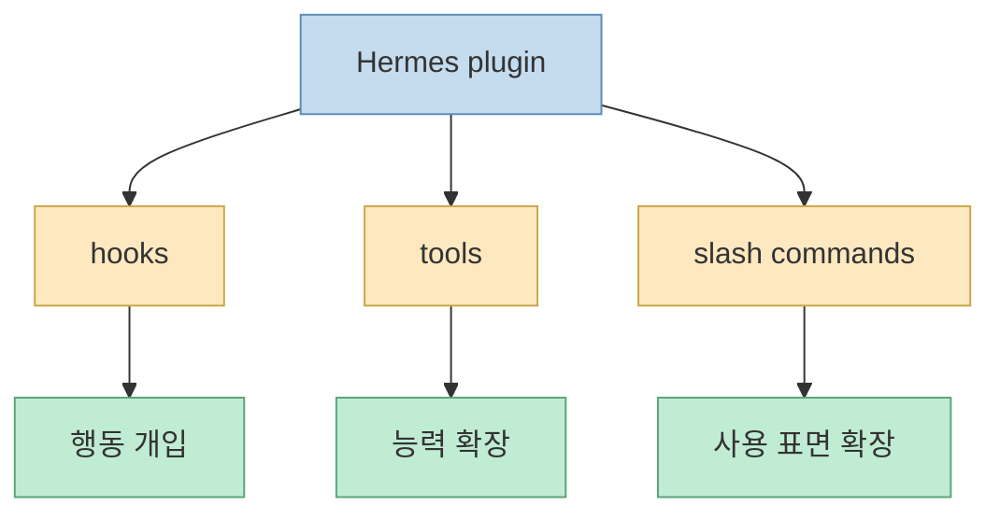
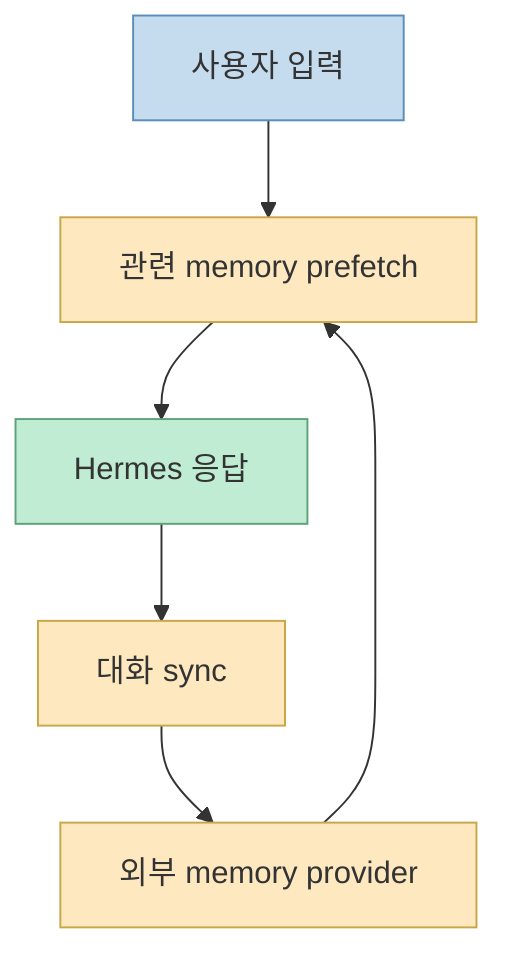
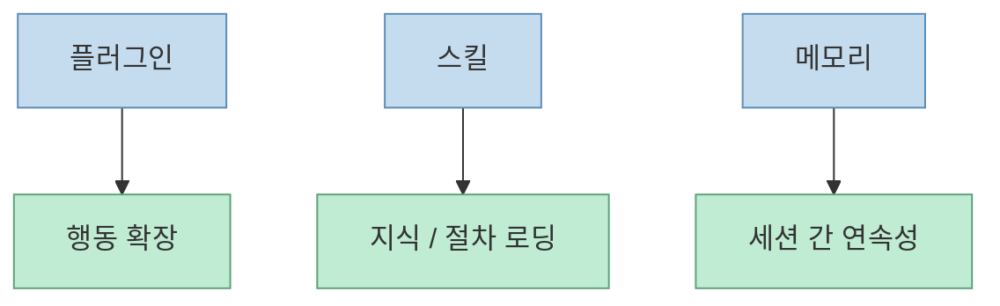
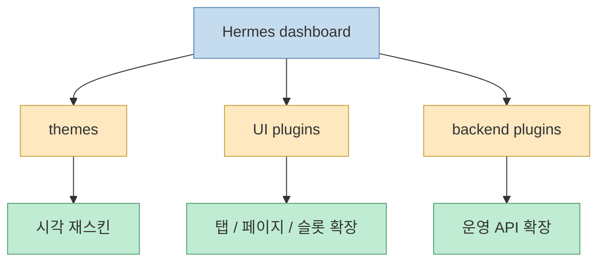
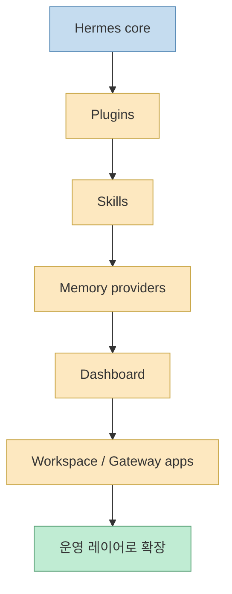

이 X 포스트의 요지는 아주 분명합니다. `Hermes`에 플러그인이 붙기 시작하자, 단순 Agent 툴이 아니라 **스킬 마켓, 지식 그래프 브레인, 메모리 워크벤치, 엔터프라이즈 저장소, 운영 대시보드** 로 커지는 느낌이라는 것입니다. 이 표현은 과장이 아닙니다. Hermes 공식 문서를 보면 실제로 플러그인 시스템, 외부 메모리 제공자, 대시보드 확장 레이어, Skills 시스템, Workspace 계열 UI가 각각 독립된 확장 지점으로 존재합니다. 즉 Hermes는 모델을 호출하는 채팅 도구 하나가 아니라, 에이전트가 **살고, 기억하고, 확장되고, 관리되는 운영층** 으로 가는 중입니다. [X oEmbed](https://publish.x.com/oembed?url=https://x.com/i/status/2065026003798315365) [Built-in Plugins](https://hermes-agent.nousresearch.com/docs/user-guide/features/built-in-plugins) [Memory Providers](https://hermes-agent.nousresearch.com/docs/user-guide/features/memory-providers) [Web Dashboard](https://hermes-agent.nousresearch.com/docs/user-guide/features/web-dashboard)

특히 중요한 점은, 이 확장이 모두 “채팅창 안 기능 추가”로만 이뤄지지 않는다는 것입니다. 공식 문서는 플러그인을 hooks, tools, slash commands를 가진 실행 단위로 설명하고, 메모리 제공자는 세션 간 지식을 공급하는 provider layer로, dashboard는 웹 운영 UI로, skills는 on-demand knowledge documents로, Workspace는 gateway API 위에 얹히는 UI로 다룹니다. 즉 Hermes의 플러그인 생태계는 앱의 기능 목록이 아니라 **운영 구조의 층위** 를 늘리는 방식입니다. [Built-in Plugins](https://hermes-agent.nousresearch.com/docs/user-guide/features/built-in-plugins) [Skills System](https://hermes-agent.nousresearch.com/docs/user-guide/features/skills) [Hermes Workspace](https://github.com/outsourc-e/hermes-workspace)
<!--more-->

## Sources

- https://x.com/i/status/2065026003798315365
- https://hermes-agent.nousresearch.com/docs/user-guide/features/built-in-plugins
- https://hermes-agent.nousresearch.com/docs/user-guide/features/memory-providers
- https://hermes-agent.nousresearch.com/docs/user-guide/features/web-dashboard
- https://hermes-agent.nousresearch.com/docs/user-guide/features/extending-the-dashboard
- https://hermes-agent.nousresearch.com/docs/user-guide/features/skills
- https://github.com/outsourc-e/hermes-workspace

## 1. Hermes 플러그인은 단순 addon이 아니라 '실행 표면'이다

Hermes 공식 문서에서 built-in plugins를 설명하는 방식은 꽤 중요합니다. 문서는 이 플러그인들이 저장소 안의 `plugins/<name>/` 아래에 있으며, user-installed plugins와 같은 표면으로 로드되고, **hooks, tools, slash commands** 를 공유한다고 말합니다. 즉 Hermes의 플러그인은 테마나 버튼이 아니라, 에이전트의 행동 경로를 바꿀 수 있는 실행 단위입니다. [Built-in Plugins](https://hermes-agent.nousresearch.com/docs/user-guide/features/built-in-plugins)

이 점이 중요한 이유는, 많은 에이전트 툴이 “플러그인”이라는 말을 쓰면서도 실제로는 명령 몇 개 추가나 외부 API 래퍼 수준에 머무르기 때문입니다. 반면 Hermes는 처음부터 plugin surface를 **행동 개입 지점** 으로 정의합니다. 훅이 있으면 에이전트의 lifecycle에 개입할 수 있고, tools가 있으면 행동 범위를 넓힐 수 있으며, slash command가 있으면 사용자 인터페이스까지 확장할 수 있습니다.

그래서 X 포스트가 “단순한 Agent 툴이 아니라 이제 다른 급”이라고 느낀 것도 자연스럽습니다. 플러그인이 표면 기능이 아니라 **운영 동작 자체를 건드릴 수 있게** 되었기 때문입니다.

## 2. 메모리 제공자 계층이 붙는 순간 Hermes는 세션형 챗봇에서 벗어난다

공식 `Memory Providers` 문서는 Hermes가 기본 `MEMORY.md / USER.md` 외에 **8개의 외부 memory provider plugin** 을 지원한다고 설명합니다. 그리고 외부 provider는 단순 저장소가 아니라:

1. provider context를 system prompt에 주입하고 
2. 매 턴 전에 relevant memory를 prefetch하고 
3. 응답 후 대화를 provider에 동기화하고 
4. 세션 종료 시 memory extraction을 수행하며 
5. built-in memory writes도 mirror하고 
6. provider-specific tools를 노출합니다

즉 이건 단순 “메모 저장”이 아니라, 에이전트의 매 턴 실행에 끼어드는 **memory runtime layer** 입니다. [Memory Providers](https://hermes-agent.nousresearch.com/docs/user-guide/features/memory-providers)

이 지점에서 Hermes는 세션형 챗봇과 확실히 갈라집니다. 대화가 끝나면 기억이 날아가는 도구가 아니라, **외부 provider를 통해 세션을 가로지르는 장기 기억 시스템** 을 붙일 수 있기 때문입니다.

즉 X 포스트가 말한 “메모리 워크벤치”는 단순 과장이 아니라, 실제로 provider layer가 하나의 독립된 운영 계층으로 올라온 결과라고 볼 수 있습니다.

## 3. Skills 시스템은 플러그인 마켓과는 다른 '지식 로딩 계층'이다

Hermes 공식 Skills 문서는 스킬을 `on-demand knowledge documents`라고 설명합니다. 또 progressive disclosure 패턴을 따른다고 말합니다. 즉 모든 지식을 항상 프롬프트에 싣는 게 아니라, 필요할 때 해당 지식 문서를 로드해 토큰을 아끼는 구조입니다. [Skills System](https://hermes-agent.nousresearch.com/docs/user-guide/features/skills)

이건 플러그인과 역할이 다릅니다.

- 플러그인은 행동과 실행 표면을 확장하고 
- 스킬은 지식과 작업 절차를 외부 문서로 제공하며 
- 메모리 provider는 세션 간 상태를 유지합니다

즉 X 포스트에서 말한 “스킬 마켓” 느낌은 실제로도 독립적인 층으로 이해해야 합니다. 플러그인이 행동을 바꾸고, 스킬은 지식을 주고, 메모리는 연속성을 줍니다. 이 셋이 합쳐져야 Hermes가 단순 채팅을 넘어서 **작업 환경** 처럼 느껴집니다.

즉 Hermes 생태계의 강점은 기능 하나가 아니라, **행동·지식·기억** 이 서로 다른 표면으로 분리돼 있다는 점입니다.

## 4. Dashboard 확장이 붙자 Hermes는 CLI가 아니라 운영 콘솔이 된다

`Web Dashboard` 문서는 Hermes dashboard를 브라우저 기반 UI로 설명합니다. YAML을 직접 편집하거나 CLI 명령을 외울 필요 없이 설정, API 키, 세션 모니터링을 관리하는 표면이라는 것입니다. 그런데 더 흥미로운 건 `Extending the Dashboard` 문서입니다. 여기서는 dashboard가 fork 없이 확장되도록 설계됐다고 설명하고, 세 가지 확장 층을 소개합니다.

1. themes 
2. UI plugins 
3. backend plugins

즉 대시보드가 단순 모니터링 화면이 아니라, **플러그인 가능한 운영 콘솔** 로 열려 있다는 뜻입니다. [Web Dashboard](https://hermes-agent.nousresearch.com/docs/user-guide/features/web-dashboard) [Extending the Dashboard](https://hermes-agent.nousresearch.com/docs/user-guide/features/extending-the-dashboard)

이건 굉장히 중요합니다. CLI 중심 에이전트는 보통 자동화엔 강하지만, 사람-in-the-loop 운영에는 약합니다. 반면 Hermes는 dashboard slot, override, backend API route까지 노출해 두어, 사람이 triage와 supervision을 할 수 있는 운영면을 넓힙니다.

즉 Hermes는 CLI 에이전트이면서도, 동시에 **운영 대시보드 플랫폼** 으로 자라고 있습니다.

## 5. Workspace 계열 UI가 붙으면서 Hermes는 '게이트웨이 위의 앱 생태계'처럼 보이기 시작한다

공식 문서 자체는 아니지만, `hermes-workspace` 저장소는 이 흐름을 잘 보여 줍니다. README는 어떤 OpenAI-compatible backend와도 연결할 수 있지만, Hermes Agent gateway API를 쓰면 sessions, memory, skills, jobs 같은 강화 기능이 열린다고 설명합니다. 즉 Hermes gateway는 단순 모델 프록시가 아니라, 그 위에 **워크스페이스형 앱** 을 얹을 수 있는 서버 표면이 되고 있습니다. [Hermes Workspace](https://github.com/outsourc-e/hermes-workspace)

이게 왜 중요하냐면, 이 시점부터 Hermes는 단지 “에이전트 한 마리”가 아니라:

- gateway 
- memory layer 
- plugin system 
- dashboard 
- workspace UI

를 가진 **작은 플랫폼** 처럼 보이기 시작하기 때문입니다.

## 6. 결국 Hermes가 '다른 급'처럼 느껴지는 이유는 기능이 늘어서가 아니라 층이 늘어서다

X 포스트는 “스킬 마켓, 지식 그래프 브레인, 메모리 워크벤치, 엔터프라이즈 저장소, 운영 대시보드”라고 표현했는데, 공식 문서로 확인 가능한 범위 안에서도 그 감각은 충분히 설명됩니다.

- 플러그인 → 행동 확장 
- 스킬 → 지식 로딩 
- 메모리 provider → 세션 간 기억 
- dashboard → 사람 운영면 
- workspace / gateway → 앱 표면

이 다섯 층이 쌓이면 Hermes는 더 이상 챗봇 앱이나 터미널 명령 묶음처럼 느껴지지 않습니다. **에이전트를 운영하기 위한 운영체제에 가까운 층 구조** 가 생기기 때문입니다.

즉 Hermes가 “날아다닌다”는 말은 모델이 더 똑똑해져서가 아니라, **운영층이 비로소 분화되기 시작해서** 라고 보는 편이 맞습니다.

## 핵심 요약

- X 포스트의 핵심은 Hermes가 플러그인 확장을 통해 단순 에이전트 툴에서 **운영 레이어** 로 커지고 있다는 점입니다. 
- 공식 문서상 플러그인은 hooks, tools, slash commands를 가진 **행동 확장 표면** 입니다. 
- Memory providers는 단순 저장소가 아니라 prefetch, sync, injection이 붙는 **세션 간 기억 계층** 입니다. 
- Skills는 on-demand knowledge documents로서 플러그인과 다른 **지식 로딩 계층** 입니다. 
- Dashboard는 themes, UI plugins, backend plugins로 확장 가능한 **운영 콘솔** 입니다. 
- Workspace / gateway가 붙으면서 Hermes는 점점 **에이전트 운영 플랫폼** 처럼 보이기 시작합니다.

## 결론

왜 Hermes가 플러그인 몇 개만 붙어도 “다른 급”처럼 느껴지는지 한 문장으로 줄이면 이렇습니다. 기능이 조금 늘어난 게 아니라, **행동·지식·기억·운영·앱 표면이 서로 다른 층으로 분리되기 시작했기 때문** 입니다.

그래서 Hermes를 앞으로 볼 때는 “또 하나의 Agent 툴”로 보기보다, 에이전트를 둘러싼 운영체제를 어떻게 모듈화할지 실험하는 플랫폼으로 보는 편이 더 정확합니다. 이 차이가 결국 사용 경험을 완전히 다르게 만듭니다.
