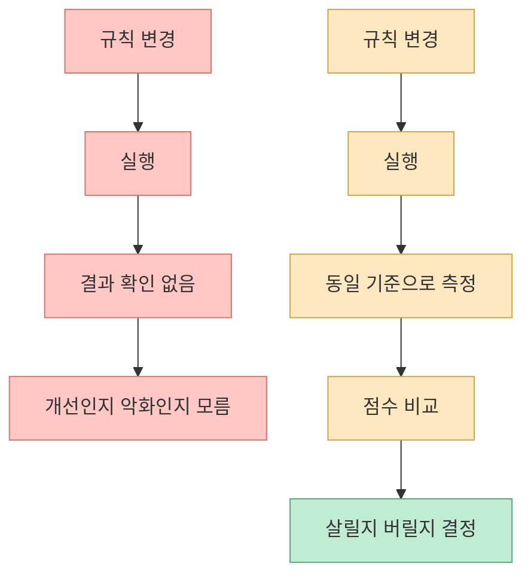
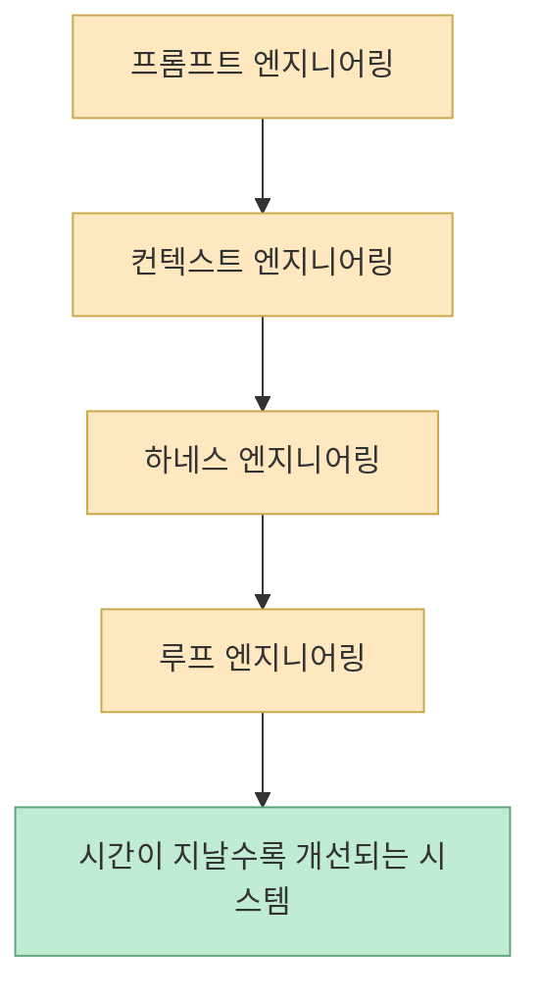
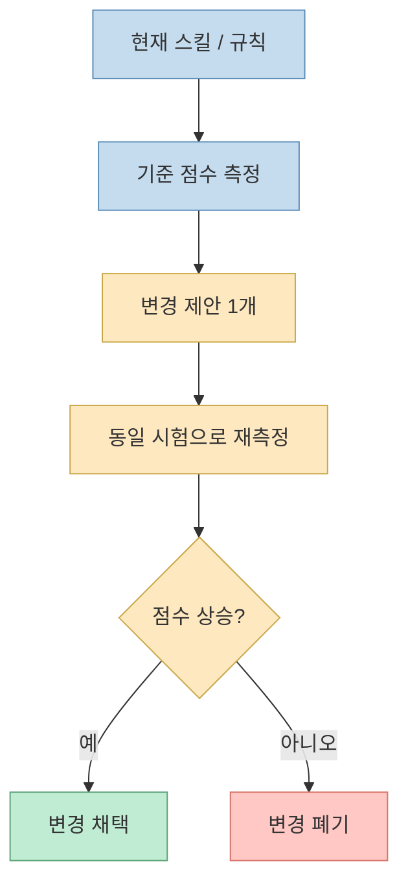
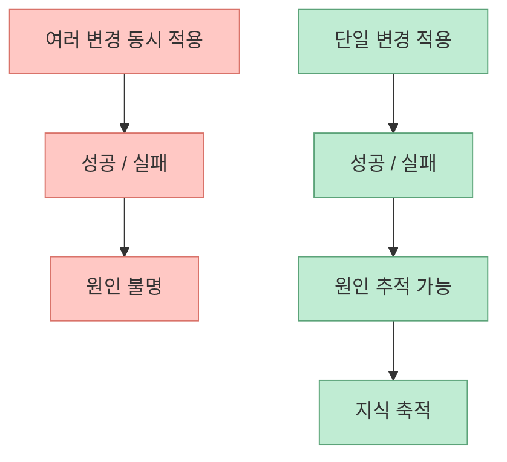
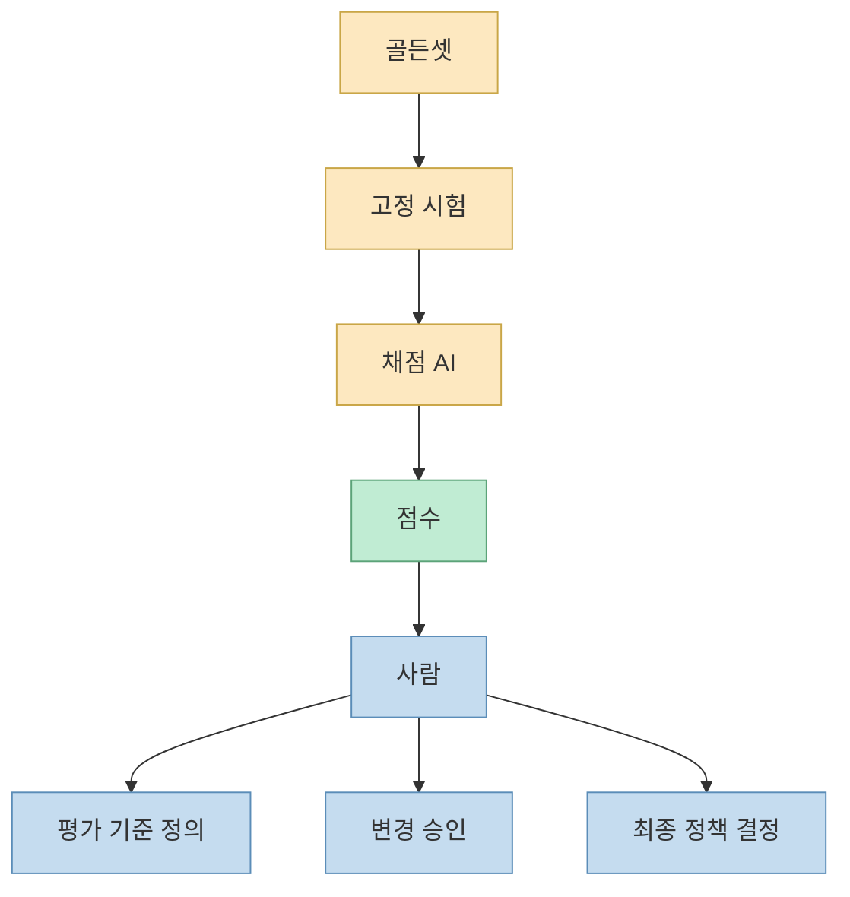
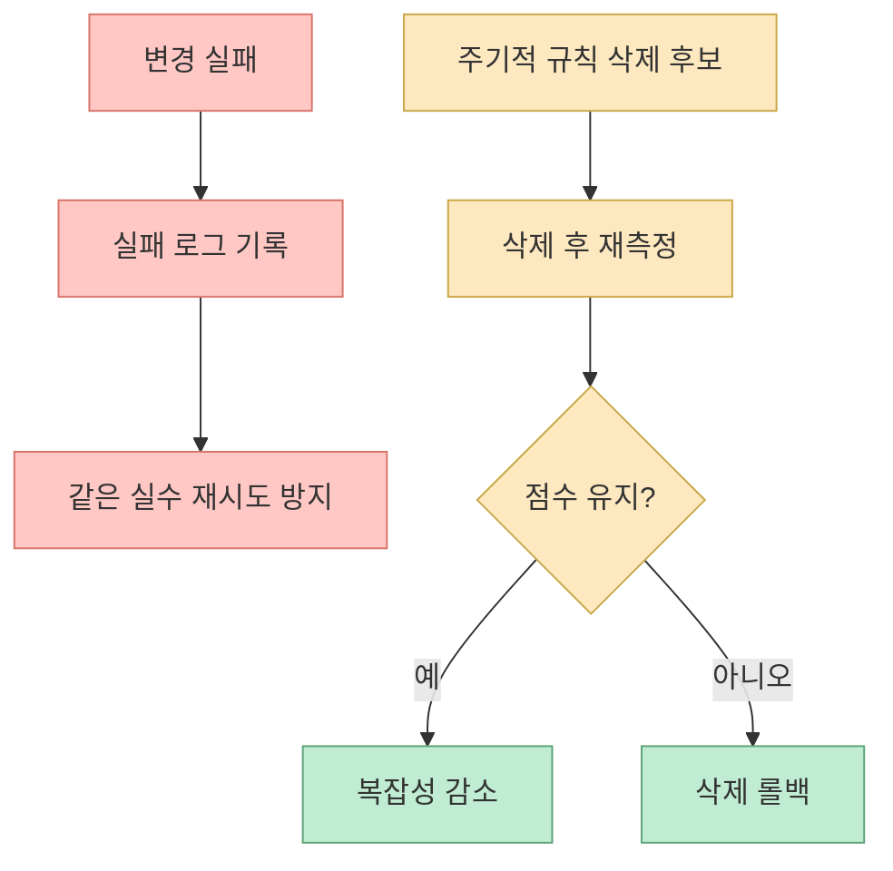

어제까지 루프 엔지니어링이 “사람이 직접 프롬프트를 치는 대신, 그 일을 하는 시스템을 설계하는 것”이라는 설명이 많이 돌았다면, 이 영상은 그 다음 단계로 들어갑니다. 즉 **그 루프를 실제로 어떻게 짜야 하는가** 를 보여 주려는 쪽입니다. 영상 초반부터 발표자는 “제가 만든 AI 스킬이 제가 자는 동안에도 혼자 더 똑똑해진다”며, 비밀은 루프 하나라고 말합니다. 하지만 곧바로 마법이 아니라고 선을 긋습니다. 측정 없이 돌리는 루프는 같은 자리에서 뱅뱅 돌기만 하고, 진짜로 좋아졌는지조차 확인할 수 없다는 것입니다. 그래서 발표자가 가장 먼저 내세우는 문장은 `"측정 없는 진화는 금지"` 입니다. [영상 1:47](https://youtu.be/GlR5I1wFWpM?t=107)

이 설명은 최근 Addy Osmani가 정리한 루프 엔지니어링 개념과 정확히 맞물립니다. Addy는 루프를 “recursive goal where you define a purpose and the AI iterates until complete”라고 설명했고, 반복 실행 자체보다 **tests, builds, evals, memory, sub-agents** 같은 피드백 메커니즘이 핵심이라고 말했습니다. 또 영상 후반부에 등장하는 `Darwin Gödel Machine` 사례도 실제로는 “자기 코드를 고치고, empirical validation으로 더 나은 버전만 남긴다”는 구조를 가진 자가개선 에이전트 연구입니다. 즉 이 영상은 루프 엔지니어링의 대중화 버전이면서도, 내용상으로는 최근의 실전 흐름과 꽤 잘 닿아 있습니다. [Addy Osmani](https://addyosmani.com/blog/loop-engineering/) [Darwin Gödel Machine](https://arxiv.org/abs/2505.22954) [Sakana AI](https://sakana.ai/dgm/)
<!--more-->

## Sources

- https://youtu.be/GlR5I1wFWpM?si=s_4JGeyZ_Agecl2-
- https://addyosmani.com/blog/loop-engineering/
- https://arxiv.org/abs/2505.22954
- https://sakana.ai/dgm/

## 1. 이 영상이 말하는 루프 엔지니어링의 핵심은 '측정 없는 진화 금지'다

영상 초반은 의외로 개념 정의보다 문제 진단에 더 많은 시간을 씁니다. 왜 사람들은 AI를 개선한다고 하면서도, 실제로는 개선 여부를 확인하지 않는가? 발표자는 이를 “체중계 없이 다이어트하는 것”에 비유합니다. 프롬프트를 고쳤고 규칙을 추가했으니 더 좋아졌겠지라고 생각하지만, 같은 작업을 같은 기준으로 다시 재보지 않으면 **한 군데 나아지고 세 군데 망가졌는지조차 알 수 없다** 는 것입니다. [영상 1:16](https://youtu.be/GlR5I1wFWpM?t=76)

이 지점이 중요한 이유는, 루프 엔지니어링을 흔히 “AI가 스스로 계속 개선하는 구조” 정도로 막연히 이해하기 쉽기 때문입니다. 하지만 영상과 Addy Osmani 글이 공통으로 말하는 건, 루프의 본질이 재귀성보다 **피드백** 에 있다는 점입니다. 돌기만 하는 건 루프가 아닙니다. **매 바퀴마다 비교 가능한 점수와 실패 기준이 있어야만** 루프가 됩니다. [영상 1:47](https://youtu.be/GlR5I1wFWpM?t=107) [Addy Osmani](https://addyosmani.com/blog/loop-engineering/)

즉 이 영상에서 루프는 “자동 반복”이 아니라 **측정 가능한 개선 사이클** 입니다.

## 2. 프롬프트 → 컨텍스트 → 하네스 다음에 오는 것이 루프라는 해석

영상 중반부에서 발표자는 AI를 다루는 기술의 진화 흐름을 꽤 깔끔하게 정리합니다.

- 프롬프트 엔지니어링 
- 컨텍스트 엔지니어링 
- 하네스 엔지니어링 
- 그리고 그 다음이 루프 엔지니어링

이 해석은 매우 흥미롭습니다. 프롬프트 엔지니어링이 “한 문장을 잘 쓰는 기술”, 컨텍스트 엔지니어링이 “재료와 도구를 잘 쥐여 주는 기술”, 하네스 엔지니어링이 “검사기·테스트·규칙을 둘러 AI를 작업장 안에 넣는 기술”이라면, 루프 엔지니어링은 그 작업장을 **시간 위에서 반복 개선되도록 돌리는 기술** 이라는 것입니다. [영상 2:48](https://youtu.be/GlR5I1wFWpM?t=168)

이 framing은 Addy Osmani의 설명과도 연결됩니다. Addy는 루프 엔지니어링이 자동화, worktree, skills, plugins, sub-agents, memory 같은 부품을 한 번에 엮는다고 정리합니다. 영상은 같은 구조를 더 쉽게 설명하지만, 결국 말하는 바는 같습니다. 루프는 프롬프트를 대체하는 단일 기법이 아니라, **프롬프트·컨텍스트·하네스를 시간축에서 연결하는 상위 구조** 입니다. [Addy Osmani](https://addyosmani.com/blog/loop-engineering/)

그래서 루프 엔지니어링은 단독 도구가 아니라, 앞선 모든 계층을 **반복 가능한 운영체계** 로 묶는 층에 가깝습니다.

## 3. 실제 루프의 최소 구조는 평가 → 제안 → 검증 → 합치기다

이 영상이 가장 실무적인 지점은 바로 여기입니다. 발표자는 자신이 만든 스킬 루프를 네 단계로 잘라 설명합니다.

1. 먼저 현재 실력을 측정한다 
2. 딱 한 부분에 대한 변경을 제안한다 
3. 바꾸기 전과 바꾼 후를 같은 시험으로 검증한다 
4. 점수가 오른 경우에만 변경을 합친다

이 구조는 놀랄 만큼 고전적인 실험 설계 원칙과 닮아 있습니다. 무엇이 달라졌는지 모르지 않으려면, **baseline을 고정하고, 변경은 하나만 넣고, 동일한 시험으로 재평가** 해야 하기 때문입니다. [영상 4:07](https://youtu.be/GlR5I1wFWpM?t=247)

흥미로운 점은 Darwin Gödel Machine도 본질적으로 같은 방향이라는 것입니다. DGM은 foundation model이 샘플 에이전트의 코드를 수정한 후보를 만들고, empirical validation으로 성능을 재서, 더 나은 agent lineage만 성장시키는 구조를 갖습니다. 영상은 이를 실무 스킬 루프로 단순화해 보여 주는 셈입니다. [Darwin Gödel Machine](https://arxiv.org/abs/2505.22954) [Sakana AI](https://sakana.ai/dgm/)

즉 루프의 기본 단위는 “계속 개선”이 아니라, **작은 가설 하나를 안전하게 검증하는 사이클** 입니다.

## 4. 한 번에 하나만 바꾸라는 규칙은 느려 보여도 실제로는 가장 빠른 길이다

영상에서 반복해서 강조하는 또 하나의 규칙은 `한 번에 딱 하나만 바꾼다` 입니다. 프롬프트를 고치고, 규칙을 추가하고, 톤을 바꾸고, 도구 선택까지 동시에 건드리면 결과가 좋아져도 **무엇이 원인인지 알 수 없고**, 나빠져도 무엇을 되돌려야 할지 모르게 됩니다. 발표자는 이를 요리 비유로 설명합니다. 소금도 넣고 설탕도 넣고 불 세기도 바꿨는데 맛이 좋아졌다면, 원인이 무엇인지 모르기 때문에 학습이 축적되지 않는다는 것입니다. [영상 4:44](https://youtu.be/GlR5I1wFWpM?t=284)

이 원칙은 사실 머신러닝 실험, 제품 A/B 테스트, 성능 튜닝에서도 동일합니다. 루프가 진짜 지식을 남기려면, 매 바퀴가 “무엇을 바꿨더니 어떤 결과가 나왔는가”를 분리해 줘야 합니다. 그렇지 않으면 루프는 단지 **복잡한 랜덤 탐색** 이 됩니다.

그래서 이 영상에서의 루프 엔지니어링은 “빨리 많이 바꿔 보기”보다, **작게 정확히 바꿔 보기** 에 더 가깝습니다.

## 5. 골든셋은 루프의 엔진이고, Human-on-the-loop는 그 위의 관리자다

영상에서 가장 실용적인 개념 하나를 꼽으라면 아마 `골든셋`일 겁니다. 발표자는 이를 “AI를 채점할 고정된 시험지”라고 설명합니다. 오늘도 같은 문제, 내일도 같은 문제를 써야만 점수 변화가 실제 실력 변화인지 알 수 있다는 것입니다. 자신의 스킬에는 고정 문제 12개가 있고, 출제와 채점을 분리하기 위해 **문제 내는 AI와 채점하는 AI를 분리** 한다고까지 설명합니다. [영상 5:42](https://youtu.be/GlR5I1wFWpM?t=342)

이 구조가 중요한 이유는 루프의 객관성을 지키기 때문입니다. 평가 문제가 매번 달라지면, 점수 비교가 무의미해집니다. 채점자와 개선자가 같으면, 스스로에게 유리한 기준으로 미끄러질 수 있습니다. 그래서 발표자는 이어서 사람의 자리는 “loop 안”이 아니라 **loop 위** 라고 말합니다. 사람은:

- 무엇이 좋은 결과인지 정의하고 
- 어떤 변경을 시도할지 승인하고 
- AI가 낸 초안을 최종 정책으로 채택할지 결정합니다

즉 사람은 매번 프롬프트를 치는 작업자라기보다, **평가 체계와 승인 체계를 관리하는 코치** 입니다. [영상 6:35](https://youtu.be/GlR5I1wFWpM?t=395)

이게 바로 이 영상이 말하는 `Human-on-the-loop`의 실질적 의미입니다. 사람은 루프 안의 수동 심사원이 아니라, **루프의 기준과 경계를 설계하는 상위 운영자** 입니다.

## 6. 좋은 루프에는 오답 노트와 삭제 루프가 함께 있어야 한다

영상 후반부에서 나오는 `실패 로그`와 `삭제 루프` 아이디어는 꽤 중요합니다. 발표자는 실패한 변경을 그냥 버리면 안 된다고 말합니다. “이거 해 봤는데 안 됐음”을 적어 두지 않으면, 한 달 뒤 AI가 똑같은 실패를 또 시도할 수 있기 때문입니다. 이건 오답 노트 비유로 설명됩니다. 잘못된 길을 적어 둬야 다시 그 함정에 덜 빠진다는 것입니다. [영상 8:51](https://youtu.be/GlR5I1wFWpM?t=531)

또 하나 흥미로운 부분은, 규칙을 더하기만 하면 안 되고 **가끔은 빼야 한다** 는 주장입니다. 발표자 자신의 스킬은 세 바퀴마다 한 번씩 “무엇을 추가할까” 대신 “무엇을 지울까”를 고민한다고 말합니다. 지웠는데 점수가 안 떨어지면, 그건 공짜로 복잡성을 줄인 셈이기 때문입니다. 이건 최근 하네스 다이어트나 context compaction 논의와도 닿아 있습니다. 루프는 성장만이 아니라 **정리와 제거** 까지도 포함해야 합니다.

즉 좋은 루프는 계속 덧붙이는 루프가 아니라, **기억하고 버리고 다시 다듬는 루프** 입니다.

## 7. 마지막 퍼즐은 여전히 QA와 E2E 테스트다

영상에서 가장 솔직한 부분은 마지막입니다. 발표자는 루프의 마지막 퍼즐이 아직 맞춰지지 않았다고 말하는데, 그것이 바로 `QA`, 특히 `E2E 테스트` 입니다. 도면 검사나 부분 기능 검사는 AI가 꽤 잘하지만, 진짜 사용자가 처음부터 끝까지 쓰는 흐름을 전부 점검하는 마지막 단계는 아직 사람이 직접 들어가 봐야 하는 부분이 남아 있다는 것입니다. `Gstack browse` 같은 도구로 일부 커버는 되지만, 100%는 아니라고 선을 긋습니다. [영상 9:44](https://youtu.be/GlR5I1wFWpM?t=584)

이 지점은 Addy Osmani가 말한 verification burden과도 정확히 겹칩니다. 루프가 좋아질수록 사람이 손을 떼고 싶어지지만, 실제로는 마지막 사용자 경로 QA는 여전히 **가장 비싼 검증 책임** 으로 남아 있습니다. 따라서 루프 엔지니어링의 완성은 아직 아니라는 것이 이 영상의 현실적인 결론입니다.

## 8. 오늘 당장 시작하는 최소 루프는 생각보다 작다

영상 마지막은 바로 실행 가능한 형태로 끝납니다. 발표자가 제안하는 최소 시작 루프는 네 단계입니다.

1. 제일 자주 시키는 작업 하나를 고른다 
2. 그 결과를 평가할 예/아니오 기준 5~7개를 만든다 
3. 현재 점수를 먼저 잰다 
4. 한 번에 딱 하나만 바꾸고 같은 기준으로 재평가한다

즉 루프 엔지니어링을 거대한 멀티 에이전트 시스템으로 시작할 필요는 없습니다. **고정 시험지, 단일 변경, 동일 채점표, 반복 측정** 만 있어도 이미 루프가 시작됩니다. [영상 11:09](https://youtu.be/GlR5I1wFWpM?t=669)

이게 중요한 이유는, 많은 사람이 루프를 너무 거대한 개념으로만 보기 때문입니다. 하지만 실제 시작점은 작습니다. AI가 매주 하는 가장 반복적인 일 하나를 골라, **평가 가능하게 만드는 것** 이 첫 번째 루프입니다.

## 핵심 요약

- 이 영상의 핵심은 루프 엔지니어링을 “자동 반복”이 아니라 **측정 가능한 개선 루프** 로 설명하는 데 있습니다. 
- 중심 원칙은 `"측정 없는 진화는 금지"` 입니다. 
- 실제 루프의 최소 구조는 **평가 → 제안 → 검증 → 합치기** 입니다. 
- 한 번에 하나만 바꾸는 원칙이 있어야 루프가 지식을 축적합니다. 
- `골든셋`은 고정 시험지이고, 사람은 `Human-on-the-loop`로서 기준 정의와 승인, 최종 결정을 맡습니다. 
- 좋은 루프에는 실패 로그와 삭제 루프도 포함되어야 합니다. 
- 마지막 남은 퍼즐은 여전히 QA와 E2E 테스트이며, 여기서는 아직 사람의 역할이 큽니다.

## 결론

이 영상이 좋은 이유는 루프 엔지니어링을 거대한 담론이 아니라, **실제로 어떻게 굴리는지** 까지 내려와 설명하기 때문입니다. 루프를 만든다는 건 AI에게 “계속 해봐”라고 시키는 것이 아니라, 어떤 기준으로 점수를 재고, 무엇을 한 번에 하나씩 바꾸고, 실패를 어떻게 기억하고, 어디까지는 사람이 승인할지까지 정하는 일입니다.

그래서 루프 엔지니어링의 본질은 자동화가 아닙니다. **좋아졌는지 알 수 있는 구조를 만드는 것** 입니다. 그 구조가 있는 순간부터 AI는 단순히 일을 해 주는 도구가 아니라, 점점 더 잘하게 만들 수 있는 시스템이 됩니다.
