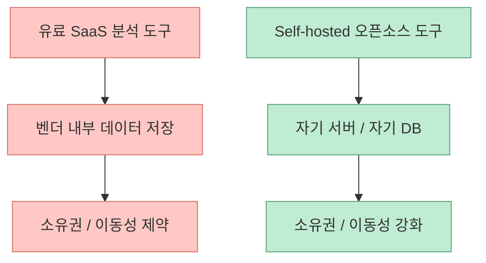
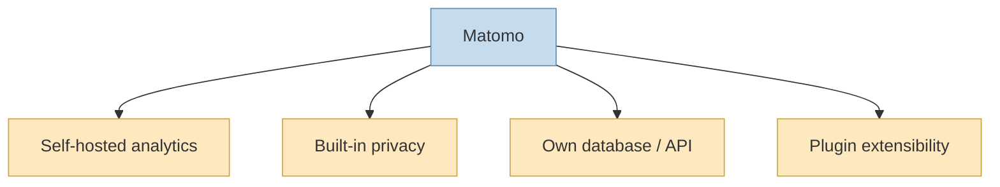
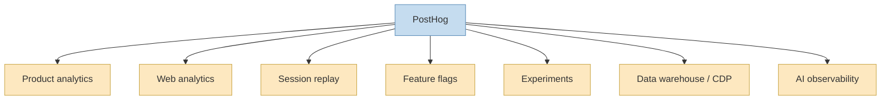
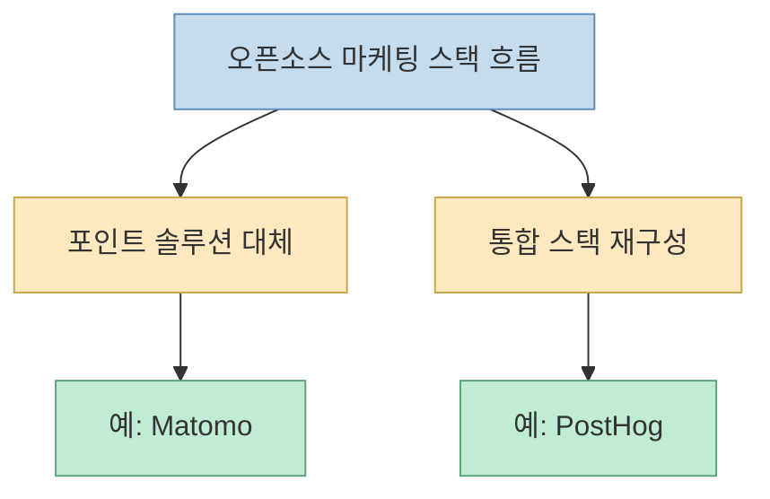

이 X 포스트는 자극적인 문장으로 시작합니다. “마케팅 팀을 위한 GitHub 저장소 10개, 유료 소프트웨어를 대체한다.” 공개 메타데이터로 직접 확인되는 첫 항목은 `Matomo`이고, 카드 이미지 OCR과 검색 스니펫을 통해 `PostHog`도 포함된다는 점까지는 확인할 수 있습니다. 원문은 10개 전부를 나열하지만, 공개 접근 가능한 메타데이터만으로는 전체 목록을 완전하게 복원하기 어렵습니다. 그래서 이 글은 **직접 검증 가능한 항목만 중심으로**, 왜 이런 스택이 마케팅 팀에게 점점 매력적으로 보이는지 해석하는 방식으로 정리합니다. [X oEmbed](https://publish.x.com/oembed?url=https://x.com/i/status/2064769930252165432)

이 두 도구만 봐도 흐름은 꽤 선명합니다. `Matomo`는 스스로 호스팅 가능한 오픈 웹 애널리틱스 플랫폼으로, Google Analytics의 대안이자 `you own your data`를 핵심 차별점으로 내세웁니다. `PostHog`는 더 넓게 갑니다. product analytics, web analytics, session replay, feature flags, experiments, surveys, data warehouse, CDP, AI observability까지 한 스택 안에 넣으려 합니다. 둘 다 말은 다르지만, 공통적으로 **데이터 소유권과 도구 통합, 그리고 유료 SaaS 종속성 완화** 를 강하게 밀고 있습니다. [Matomo](https://github.com/matomo-org/matomo) [PostHog](https://github.com/PostHog/posthog)
<!--more-->

## Sources

- https://x.com/i/status/2064769930252165432
- https://github.com/matomo-org/matomo
- https://github.com/PostHog/posthog

## 1. 이 스레드가 흥미로운 이유는 '툴 추천'보다 '소유권 회복'의 신호를 보여 주기 때문이다

X 원문 메타데이터에서 직접 확인되는 첫 항목은 `Matomo`입니다. 설명도 명확합니다. self-hosted analytics, Google Analytics 대체, 데이터 100% yours. 이 문장 하나만으로도 이 스레드의 방향이 드러납니다. 핵심은 비용 절감 자체보다 **데이터 통제권을 다시 가져오는 것** 입니다. [X oEmbed](https://publish.x.com/oembed?url=https://x.com/i/status/2064769930252165432)

Matomo README도 거의 같은 메시지를 반복합니다. `Matomo is the leading Free/Libre open analytics platform`, `you own your web analytics data`, `privacy is built-in` 같은 표현이 핵심입니다. 즉 Matomo가 매력적인 이유는 단순히 무료여서가 아니라, 분석 데이터가 타 SaaS 안에 잠기는 대신 **자기 서버, 자기 DB, 자기 API** 위에 남는다는 데 있습니다. [Matomo](https://github.com/matomo-org/matomo)

그래서 이 스레드는 단순히 “무료 대체재 10선”이 아니라, **마케팅·그로스 툴의 데이터 주권을 다시 가져오려는 흐름** 으로 읽는 편이 더 정확합니다.

## 2. Matomo가 상징하는 건 'Google Analytics 대체'보다 '프라이버시 내장형 소유 분석'이다

Matomo README는 자신을 `leading open-source alternative to Google Analytics`라고 소개합니다. 하지만 단순 대체재라는 표현보다 더 중요한 건 그 뒤에 붙는 설명입니다. own database, own API, privacy-respecting setup, self-hosting. 즉 Matomo는 단순히 “비슷한 리포트 화면을 공짜로 보여 주는 도구”가 아니라, **분석 데이터의 저장 위치와 접근 권한을 다시 사용자 쪽으로 돌리는 플랫폼** 입니다. [Matomo](https://github.com/matomo-org/matomo)

또 README를 보면 Matomo는 대시보드 UI만 제공하는 게 아니라, 플러그인 기반 확장성과 API 접근, goal tracking, campaign tracking, geo location, real-time visits 등 고전적 웹 애널리틱스의 핵심 기능을 모두 스스로 갖추려 합니다. 즉 “무료인데 기능이 빈약한 대체재”가 아니라, **기존 웹 애널리틱스 범주를 self-hosted 방식으로 거의 통째로 다시 제공** 하는 쪽입니다. [Matomo](https://github.com/matomo-org/matomo)

이 점에서 Matomo는 “무료판 Google Analytics”보다, **프라이버시와 소유권을 핵심으로 다시 설계한 웹 분석 플랫폼** 이라고 보는 편이 맞습니다.

## 3. PostHog가 상징하는 건 대체재가 아니라 '통합 스택'이다

공개 카드 OCR과 검색 스니펫으로 직접 확인 가능한 두 번째 항목은 `PostHog`입니다. 그리고 README를 읽어 보면, PostHog는 Matomo와는 다른 축에서 흥미롭습니다. 스스로를 `all-in-one, open source platform for building successful products`라고 부르며, product analytics, web analytics, session replay, feature flags, experiments, error tracking, surveys, data warehouse, data pipelines, AI observability, workflows까지 한꺼번에 제시합니다. [PostHog](https://github.com/PostHog/posthog)

즉 PostHog의 야심은 단순 대체가 아닙니다. GA 같은 분석 도구 하나의 대체재가 아니라, **제품 팀과 그로스 팀이 여러 SaaS를 따로 구독하면서 쓰던 기능 묶음을 한 플랫폼으로 압축** 하려는 쪽입니다.

이 점이 중요합니다. 마케팅 팀에게 오픈소스가 매력적으로 보이는 이유가 단지 라이선스 비용 때문만은 아니라는 뜻입니다. 오히려 더 큰 매력은, **분산된 툴 체인을 한 데이터 모델 위로 줄이는 것** 일 수 있습니다.

## 4. 결국 이 흐름은 '포인트 솔루션 대체'와 '스택 통합'이라는 두 방향으로 나뉜다

Matomo와 PostHog는 같은 “오픈소스 대체재” 범주 안에 들어가지만, 겨냥하는 방향은 다릅니다.

- `Matomo`는 특정 카테고리, 즉 web analytics를 **ownership-first** 로 다시 제공하는 쪽
- `PostHog`는 product / growth stack 전반을 **all-in-one** 으로 다시 묶는 쪽

이 차이를 보면 X 스레드가 왜 마케팅 팀에게 먹히는지도 이해됩니다. 어떤 팀은 특정 SaaS 하나를 대체하고 싶고, 어떤 팀은 아예 분석/실험/리플레이/플래그/데이터 파이프라인을 한 덩어리로 줄이고 싶기 때문입니다.

즉 이 스레드가 흥미로운 건 단순히 “공짜 도구가 많다”가 아니라, **오픈소스 진영이 이제 마케팅/그로스 운영 방식 자체를 재설계할 수 있을 만큼 넓어졌다는 신호** 를 주기 때문입니다.

## 5. 마케팅 팀이 이런 스택에 끌리는 진짜 이유는 가격보다 '관측성 통합'일 수 있다

유료 SaaS를 대체한다는 말은 보통 비용 절감으로 읽히지만, 실무에서는 다른 문제도 큽니다.

- 사용자 행동 데이터는 A 툴에 있고 
- 세션 리플레이는 B 툴에 있고 
- 실험은 C 툴에서 하고 
- feature flag는 D 툴에 있고 
- warehouse 동기화는 또 다른 툴에서 일어납니다

이렇게 되면 데이터 정합성, 이벤트 네이밍, 사용자 식별자 통합, 권한 관리가 전부 복잡해집니다. PostHog가 all-in-one을 강조하고, Matomo가 own database를 강조하는 이유도 결국 같은 곳을 찌릅니다. **데이터를 쪼개서 보관하지 말고, 관측성의 중심을 다시 한 곳으로 가져오자** 는 것입니다. [Matomo](https://github.com/matomo-org/matomo) [PostHog](https://github.com/PostHog/posthog)

그래서 이런 오픈소스 스택은 “저렴한 대체재”보다도, **관측성 통합 플랫폼** 으로 읽는 편이 더 실전적입니다.

## 6. 다만 원문 스레드의 10개 전부를 검증할 수 없다는 점은 분명히 봐야 한다

중요한 한계도 있습니다. 이번 글의 근거로 직접 확인 가능한 것은:

- X 원문 메타데이터의 첫 항목 `Matomo` 
- 카드 OCR과 검색 스니펫으로 드러난 `PostHog`

정도입니다. 원문은 10개 저장소를 주장하지만, 공개 접근 가능한 메타데이터만으로는 전체 목록을 확정할 수 없습니다. 따라서 이 글은 스레드 전체를 복원하기보다, **직접 검증 가능한 두 축만 기반으로 트렌드를 읽는 방식** 을 취했습니다. 이 점은 정확성을 위해 분명히 남겨 두는 편이 좋습니다.

그럼에도 불구하고, 확인 가능한 두 항목만으로도 충분히 보이는 흐름이 있습니다. 마케팅 팀이 찾는 오픈소스 대체재는 더 이상 “싸고 못생긴 무료판”이 아니라, **소유권과 통합성을 전면에 둔 분석/그로스 운영 스택** 이라는 점입니다.

## 핵심 요약

- X 스레드는 마케팅 팀을 위한 오픈소스 대체재 10개를 주장하지만, 공개적으로 직접 확인 가능한 항목은 `Matomo`와 `PostHog`입니다. 
- `Matomo`는 ownership-first, privacy-built-in, self-hosted web analytics의 대표 사례입니다. 
- `PostHog`는 analytics 대체재를 넘어 product/growth stack 전체를 한 플랫폼으로 묶으려는 all-in-one 전략을 보여 줍니다. 
- 이 흐름은 포인트 솔루션 대체와 통합 스택 재구성이라는 두 갈래로 나눠 볼 수 있습니다. 
- 마케팅 팀이 이런 도구에 끌리는 이유는 가격보다도 **데이터 소유권과 관측성 통합** 일 가능성이 큽니다. 
- 따라서 오픈소스 마케팅 스택의 부상은 단순 비용 절감 트렌드보다 더 큰 구조 변화로 읽을 수 있습니다.

## 결론

이 X 스레드가 흥미로운 이유는 “숨겨진 무료 도구 리스트”를 던져 줘서가 아닙니다. 더 중요한 건, 이제 마케팅과 그로스 영역에서도 **도구를 사는 것** 만큼이나 **데이터와 운영을 다시 소유하는 것** 이 중요한 화두가 되었음을 보여 주기 때문입니다.

직접 확인 가능한 Matomo와 PostHog만 놓고 봐도 흐름은 충분히 선명합니다. 하나는 소유권 회복, 다른 하나는 스택 통합. 결국 오픈소스 마케팅 스택의 진짜 매력은 무료라는 사실보다, **분산된 운영을 다시 자기 손 안으로 가져오는 것** 에 있습니다.
