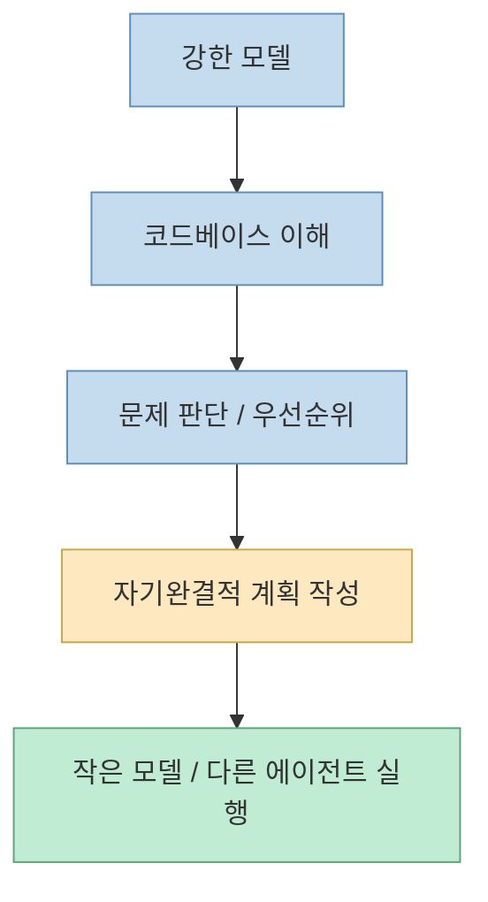
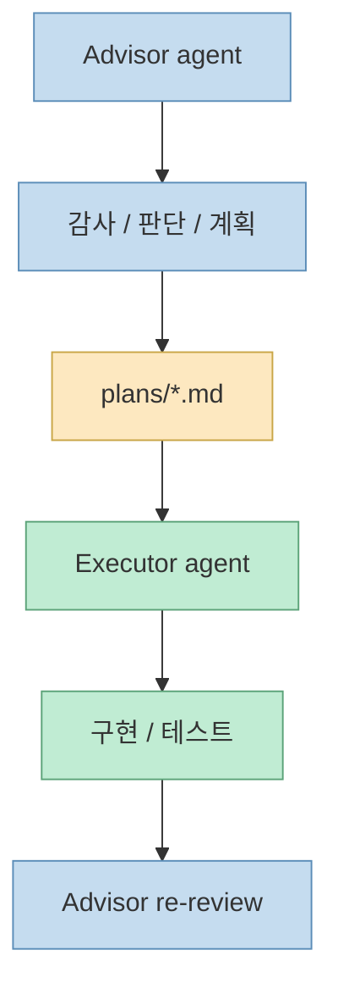
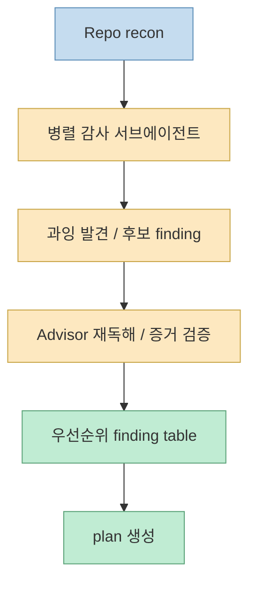
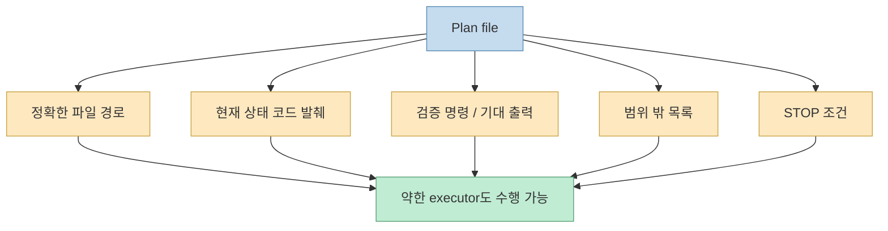

`shadcn/improve`를 처음 보면 얼핏 또 하나의 코딩 에이전트 스킬처럼 보입니다. 하지만 README 첫 문장부터 이 저장소의 정체는 꽤 분명합니다. `An agent skill that audits any codebase and writes implementation plans for other agents to execute.` 그리고 더 중요한 문장이 바로 이어집니다. **이 스킬은 절대 직접 구현하지 않는다. 계획이 곧 산출물이다.** 즉 이 프로젝트는 “코드를 대신 써 주는 도구”가 아니라, 가장 비싼 모델을 **코드베이스 이해, 우선순위 판단, 사양 작성** 에 집중시키고, 실제 수정과 테스트와 배포는 더 싼 모델이나 다른 에이전트에 넘기는 구조를 제안합니다. [GitHub](https://github.com/shadcn/improve)

이 관점이 중요한 이유는, 요즘 코딩 에이전트 실무의 병목이 코드 한 줄을 더 잘 쓰는 데 있지 않기 때문입니다. 진짜 비싼 지점은 대개 **무엇이 문제인지 정확히 읽고, 무엇을 먼저 고칠지 판단하고, 작은 모델이 실수 없이 따라갈 수 있게 작업 명세를 쓰는 일** 입니다. `improve`는 바로 그 지점에서 “가장 강한 모델은 advisor로 쓰고, executor는 싸게 돌리자”는 운영 철학을 밀어붙입니다. README의 도식도 아주 간단합니다. `you -> /improve`, `plans/ -> self-contained specs`, `other agent -> implements, tests, ships`. [GitHub](https://github.com/shadcn/improve)
<!--more-->

## Sources

- https://github.com/shadcn/improve

## 1. improve의 핵심은 '코드 생성'이 아니라 '계획을 제품으로 만든다'는 데 있다

README는 이 스킬이 never implements anything itself라고 못 박습니다. 이 문장은 매우 중요합니다. 많은 에이전트 도구가 결국 “무언가를 바로 바꿔 준다”는 편의성으로 경쟁하지만, `improve`는 정반대로 갑니다. **가장 중요한 산출물은 diff가 아니라 self-contained plan markdown** 이라고 주장하는 셈입니다. [GitHub](https://github.com/shadcn/improve)

이 발상이 흥미로운 이유는, 실제 코드 수정 자체보다 그 이전 단계가 더 어렵다는 걸 인정하기 때문입니다. 예를 들어 어떤 코드베이스에서:

- 진짜 문제는 무엇인지 
- 그 문제가 correctness인지 performance인지 tech debt인지 
- 지금 고칠 가치가 있는지 
- 다른 영역과 의존성이 있는지 
- 작은 모델이 안전하게 따라 할 수 있는지

를 판단하는 일은 보통 가장 비싸고 가장 실수가 많은 작업입니다.

즉 `improve`는 “LLM을 어디에 가장 비싸게 써야 하나?”라는 질문에 대해, **작성보다 판단에 쓰라** 고 답하는 스킬입니다.

## 2. 이 스킬이 제안하는 구조는 advisor와 executor를 의도적으로 분리한다

README의 아이디어 문장은 아주 직설적입니다. `use your most capable model for the part where intelligence compounds ... and hand execution to cheaper models.` 여기서 intelligence compounds라고 한 부분이 핵심입니다. 코드베이스를 읽고, 무엇이 가치 있는지 보고, spec를 쓰는 단계는 **한 번 잘하면 뒤 단계 전체 품질에 복리처럼 영향을 주는 구간** 이라는 뜻입니다. 반면 실행은 명세가 충분히 좋다면 더 싼 모델로도 처리 가능하다고 봅니다. [GitHub](https://github.com/shadcn/improve)

이 구조는 사실 팀 개발의 역할 분리와 매우 닮아 있습니다.

- senior / tech lead가 문제를 정의하고 
- 작업 범위와 검증 기준을 정하고 
- implementation spec를 쓰고 
- 실행은 다른 개발자나 에이전트가 맡는

식입니다. `improve execute <plan>`이 아예 cheaper executor subagent를 isolated worktree에 띄우고, 결과를 다시 review하는 구조도 이 철학의 연장선입니다. [GitHub](https://github.com/shadcn/improve)

즉 `improve`는 단일 에이전트 만능주의보다, **역할이 분리된 에이전트 팀 운영** 에 더 가깝습니다.

## 3. README가 강조하는 진짜 제품은 plans/ 폴더다

이 저장소에서 실제 산출물은 `plans/001-*.md` 같은 파일들입니다. README는 이 계획 파일들이 self-contained해야 하고, exact file paths, current-state code excerpts, repo conventions, verified commands까지 다 들어 있어야 한다고 설명합니다. `No "as discussed above."` 라는 표현도 나옵니다. 즉 executor가 advisor 세션을 전혀 모르더라도 plan 파일만 읽고 일할 수 있어야 합니다. [GitHub](https://github.com/shadcn/improve)

이 점이 굉장히 중요합니다. 보통 에이전트 워크플로가 실패하는 가장 흔한 이유 중 하나는, 작업 명세가 **세션 안에만 존재** 하기 때문입니다. 컨텍스트 창이 바뀌거나 모델이 작아지는 순간 세션 암묵지가 사라집니다. 그런데 `improve`는 그 문제를 계획 문서에 강제로 외부화합니다.

README가 말하는 실행 가능한 계획의 세 조건도 이와 맞닿아 있습니다.

- self-contained 
- verification gates 
- hard boundaries

즉 계획은 “무엇을 할까” 메모가 아니라, **약한 executor도 오해 없이 따라갈 수 있는 기계 판독형 작업 계약서** 에 가깝습니다. [GitHub](https://github.com/shadcn/improve)

## 4. 이 스킬의 감사 단계가 흥미로운 이유는 '서브에이전트 과잉 발견 → advisor 재검토' 구조를 취하기 때문이다

README의 `How it works` 섹션을 보면, improve는 먼저 repo를 맵핑하고, 그 다음 아홉 개 범주에 걸쳐 병렬 서브에이전트로 audit를 돌립니다. correctness, security, performance, test coverage, tech debt, dependencies & migrations, DX, docs, direction 같은 카테고리가 나열됩니다. 그런데 더 중요한 건 그 다음 단계인 `Vet`입니다. README는 서브에이전트가 over-report하기 때문에 advisor가 cited location을 다시 읽고 false positive를 떨군다고 설명합니다. [GitHub](https://github.com/shadcn/improve)

이 구조는 현실적입니다. 병렬 탐색 에이전트는 coverage는 넓지만 노이즈가 많아지기 쉽습니다. 반대로 하나의 강한 모델이 처음부터 끝까지 혼자 다 보면 coverage가 줄고 비용이 커집니다. `improve`는 이 둘 사이 절충을 택합니다.

즉 이 스킬은 “많이 찾는 것”과 “정확히 남기는 것”을 서로 다른 에이전트 역할로 분리합니다. 이건 단순 프롬프트가 아니라 꽤 정교한 에이전트 운영 설계입니다.

## 5. 왜 verification gates와 STOP 조건이 중요하냐면, 이 스킬은 일부러 '약한 실행자'를 상정하기 때문이다

README는 계획 파일이 “the weakest plausible executor”를 위해 쓰인다고 명시합니다. 즉 advisor보다 훨씬 작은 모델, 혹은 이전 세션을 전혀 모르는 실행자가 plan을 읽고 그대로 움직일 수 있어야 합니다. 그래서 각 단계에 verification command와 expected output이 붙고, out-of-scope list와 STOP condition이 반드시 포함됩니다. [GitHub](https://github.com/shadcn/improve)

이 철학은 실무적으로 굉장히 유용합니다. 왜냐하면 강한 모델끼리만 작업을 넘길 수 있다면 비용 절감도 어렵고, 작업 큐 확장도 어렵기 때문입니다. 반면 self-contained spec가 좋다면, 더 싼 모델이나 다른 실행 환경으로도 일을 내려보낼 수 있습니다. 즉 improve는 단순히 계획을 잘 쓰는 스킬이 아니라, **작업을 저가 executor에게 안전하게 위임하는 인터페이스** 를 만드는 스킬입니다.

즉 이 저장소는 “강한 모델이 다 해 준다”보다, **강한 모델이 약한 모델을 움직일 수 있게 만든다** 는 발상에 더 가깝습니다.

## 6. execute와 reconcile이 붙는 순간, improve는 단순 계획기가 아니라 backlog 운영기가 된다

만약 `/improve`가 audit와 plan까지만 했다면, 그저 똑똑한 spec writer 도구로 끝났을 겁니다. 그런데 README는 `execute <plan>`, `reconcile`, `--issues`까지 설명합니다. `execute`는 cheaper executor를 격리된 worktree에 띄우고, plan을 따르게 하고, advisor가 done criterion을 재실행하며 scope compliance를 리뷰합니다. `reconcile`은 완료된 계획이 여전히 유효한지, 막힌 계획은 무엇이 막았는지, independently fixed된 건 없는지까지 다시 backlog를 정리합니다. [GitHub](https://github.com/shadcn/improve)

이게 의미하는 바는 큽니다. improve의 진짜 가치는 “좋은 계획을 써 준다”에만 있지 않고, **계획이 backlog 안에서 살아 움직이게 만든다** 는 점에 있습니다. 즉 생성형 AI 스킬이 아니라, 개발팀의 기술 리드 / 프로젝트 매니저 역할 일부를 흡수한 운영 도구에 가깝습니다.

## 7. 결국 improve가 보여 주는 건 '가장 강한 모델을 어디에 써야 하는가'에 대한 하나의 답이다

2026년 6월 11일 기준 이 저장소는 GitHub에서 약 774개의 stars를 가지고 있고, 설명란은 “Use your most capable model to audit your codebase and write plans for cheaper models to execute.”라고 요약됩니다. 이 한 문장이 사실상 모든 걸 설명합니다. [GitHub](https://github.com/shadcn/improve)

많은 팀은 여전히 “강한 모델을 어디까지 직접 실행자처럼 굴릴 것인가?”를 고민합니다. `improve`는 그 질문에 대해 한 가지 아주 뚜렷한 선택지를 보여 줍니다.

- 강한 모델은 읽고 판단하고 계획하게 하라 
- 약한 모델은 plan대로 실행하게 하라 
- 둘 사이 계약은 markdown plan 파일로 남겨라 
- 마지막 승인과 merge는 인간이 하라

이건 단순 최적화 팁이 아니라, **에이전트 개발 조직의 역할 분리 패턴** 으로도 읽을 수 있습니다.

## 핵심 요약

- `shadcn/improve`는 코드 생성 스킬보다 **감사-계획-실행 분리형 운영 스킬** 에 가깝습니다. 
- 가장 강한 모델은 코드 작성보다 **코드베이스 이해와 spec 작성** 에 쓰자는 철학을 전면에 둡니다. 
- 실제 제품은 diff가 아니라 `plans/*.md` 같은 self-contained 계획 파일입니다. 
- 병렬 감사 서브에이전트와 advisor 재검토 구조를 함께 써서 coverage와 precision을 동시에 노립니다. 
- verification gates와 STOP 조건은 더 싼 executor를 안전하게 움직이게 하는 계약 장치입니다. 
- `execute`, `reconcile`, `--issues`가 붙으면서 이 스킬은 단순 spec writer가 아니라 **backlog 운영기** 에 가까워집니다.

## 결론

`shadcn/improve`가 흥미로운 이유는 코드를 더 빨리 써 주기 때문이 아닙니다. 오히려 “가장 비싼 모델을 직접 구현에 태우는 게 항상 최선은 아니다”라는 점을 아주 분명하게 보여 주기 때문입니다. 비싼 모델은 읽고 판단하고 설계하게 하고, 실행은 더 싼 모델로 내려보내며, 그 둘 사이를 self-contained plan 파일로 연결한다는 발상은 꽤 강력합니다.

그래서 이 저장소는 또 하나의 에이전트 스킬이라기보다, **에이전트를 기술 리드와 구현자로 분리해 운영하는 방법론** 에 더 가깝습니다. 앞으로 코딩 에이전트 실무가 성숙해질수록, 이런 “누가 무엇을 맡아야 하는가”를 명시하는 스킬이 더 중요해질 가능성이 큽니다.
