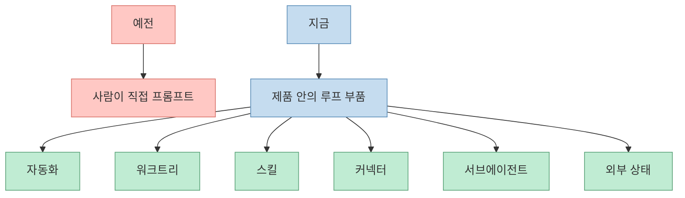
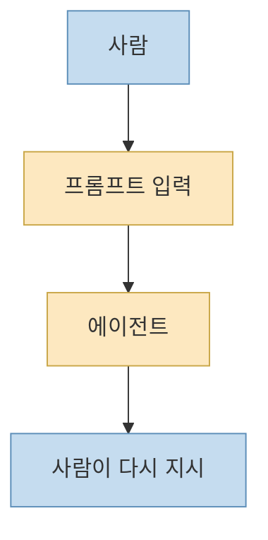
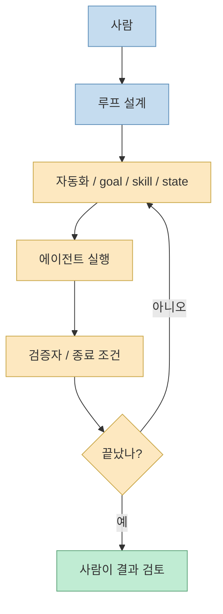
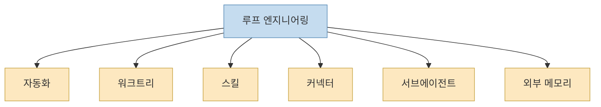
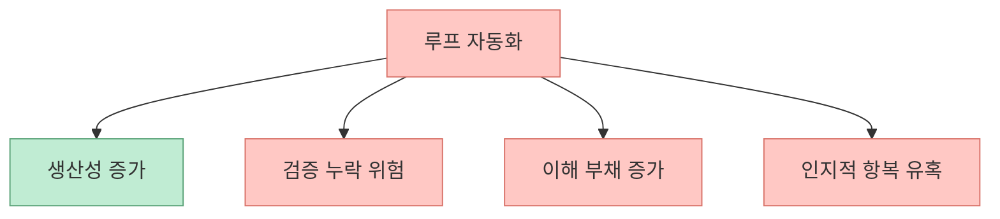

이 X 포스트는 최근 갑자기 퍼지고 있는 한 문장을 아주 잘 요약합니다. “이제 코딩 에이전트한테 프롬프트 치지 마라.” 공개 메타데이터에 드러난 본문을 보면, 글쓴이는 이 말이 무슨 도발적인 금언이 아니라, **내가 에이전트에 일일이 프롬프트를 치는 대신 대신 쳐 주는 시스템을 한 번 설계해 두는 것** 을 뜻한다고 정리합니다. 그리고 그 표현을 2026년 6월 Addy Osmani가 정리해 퍼뜨렸다고 설명합니다. [X oEmbed](https://publish.x.com/oembed?url=https://x.com/i/status/2064486922404376609)

실제로 Addy Osmani의 글은 거의 같은 문장으로 시작합니다. `Loop engineering is replacing yourself as the person who prompts the agent. You design the system that does it instead.` 그리고 Peter Steinberger의 발언, “You shouldn’t be prompting coding agents anymore. You should be designing loops that prompt your agents.”를 바로 이어서 인용합니다. 즉 지금 퍼지는 건 단순한 밈이 아니라, **코딩 에이전트 활용의 레버리지 포인트가 이동하고 있다는 공감대** 입니다. [Addy Osmani](https://addyosmani.com/blog/loop-engineering/)
<!--more-->

## Sources

- https://x.com/i/status/2064486922404376609
- https://addyosmani.com/blog/loop-engineering/
- https://x.com/steipete/status/2063697162748260627

## 1. 이 말이 갑자기 퍼진 이유는 '도구가 루프 부품을 내장하기 시작했기 때문'이다

왜 하필 지금 이런 말이 돌기 시작했을까요? Addy Osmani는 이 변화가 단순한 사상 유행이 아니라, **제품 안에 루프 부품이 들어오기 시작한 결과** 라고 설명합니다. 예전에는 루프를 만들려면 각자 `bash`와 스크립트 더미를 붙여야 했지만, 이제는 Codex와 Claude Code 같은 제품이 이미 자동화, worktree, skills, connectors, sub-agents, 외부 state 같은 구조를 기본 부품으로 실어 나르기 시작했다는 것입니다. [Addy Osmani](https://addyosmani.com/blog/loop-engineering/)

즉 과거에는 코딩 에이전트를 잘 쓰는 능력이 “좋은 프롬프트를 쓰는 능력”에 더 가까웠다면, 지금은:

- 작업을 자동으로 발견하고 
- 병렬 실행을 충돌 없이 분리하고 
- 스킬과 규칙을 외부 문서로 남기고 
- 툴과 연결하고 
- 다른 에이전트가 검증하게 만들고 
- 상태를 디스크에 저장하는

구조를 한 번 설계하는 능력이 더 큰 차이를 만들기 시작한 것입니다.

그래서 “프롬프트 치지 마라”는 말이 퍼지는 건, 프롬프트가 무의미해져서가 아니라 **프롬프트를 시스템 안으로 옮길 수 있게 되었기 때문** 입니다.

## 2. 루프 엔지니어링은 프롬프트를 버리는 게 아니라 '프롬프트하는 사람 역할을 바꾸는 것'이다

X 포스트의 요약과 Addy의 정의를 합치면, 루프 엔지니어링의 본질은 아주 간단합니다. 사람이 직접:

- 다음 일을 지시하고 
- 중간 결과를 읽고 
- 다시 지시하고 
- 끝났는지 판단하던

작업을, 시스템이 대신 하도록 만드는 것입니다. [X oEmbed](https://publish.x.com/oembed?url=https://x.com/i/status/2064486922404376609) [Addy Osmani](https://addyosmani.com/blog/loop-engineering/)

즉 프롬프트는 사라지지 않습니다. 다만 그 프롬프트가:

- 사람 손가락에서 바로 나가는 게 아니라 
- 자동화 스케줄과 `/goal` 같은 제어문으로 바뀌고 
- `SKILL.md`와 `AGENTS.md`에 외부화되고 
- verifier agent가 종료 조건을 대신 검사하고 
- state file이 다음 턴의 입력이 되는

방식으로 이동합니다.

결국 루프 엔지니어링은 “프롬프트를 없애는 기술”이 아니라, **프롬프트하는 사람의 역할을 시스템 설계자로 올리는 기술** 입니다.

## 3. 한 장으로 줄이면 루프 엔지니어링은 다섯 부품과 하나의 메모리다

Addy Osmani는 루프에 필요한 요소를 다섯 가지와 하나의 기억 장소로 요약합니다.

1. 자동으로 돌아가는 스케줄 기반 자동화 
2. 병렬 작업이 충돌하지 않게 하는 worktrees 
3. 프로젝트 지식을 적어 두는 skills 
4. 실제 툴과 연결하는 plugins / connectors 
5. 만드는 자와 검토하는 자를 나누는 sub-agents 
6. 그리고 대화 밖에 존재하는 state / memory

이 구조는 X 포스트의 “대신 쳐주는 시스템”이 사실 무엇으로 이루어지는지를 가장 잘 보여 줍니다. 루프는 재귀적인 프롬프트가 아니라, **발견 → 분배 → 실행 → 검증 → 기록** 의 체인을 이루는 운영 구조입니다. [Addy Osmani](https://addyosmani.com/blog/loop-engineering/)

그래서 루프 엔지니어링을 이해하려면 “프롬프트를 어떻게 쓸까?”가 아니라, **어떤 상태를 남기고, 누가 검증하고, 어떤 cadence로 다시 도는가** 를 봐야 합니다.

## 4. 왜 이 개념이 설득력을 얻었냐면, 사람의 병목을 정확히 찌르기 때문이다

Addy는 기존 작업 방식을 “you type a thing, you read what came back, you type the next thing”으로 설명합니다. 이건 다들 익숙한 방식입니다. 문제는 여기서 병목이 늘 사람이라는 점입니다. 사람이:

- 할 일을 찾아야 하고 
- 충돌을 조정해야 하고 
- 프로젝트 규칙을 계속 설명해야 하고 
- 결과를 검토해야 하고 
- 다음 행동을 또 지시해야 합니다

루프 엔지니어링은 이 중 반복 가능한 부분을 바깥으로 빼냅니다. 그러면 사람은 턴 단위 지시자가 아니라, **작업 공장을 설계하고 감독하는 사람** 이 됩니다. [Addy Osmani](https://addyosmani.com/blog/loop-engineering/)

이게 설득력을 가지는 이유는, 실제로 코딩 에이전트를 오래 써 본 사람일수록 “한 번 잘 시키는 것”보다 “같은 실수를 매번 안 하게 만드는 것”이 더 어렵다는 걸 알기 때문입니다. 루프는 바로 그 지점을 건드립니다.

## 5. 다만 이 유행어가 위험한 이유도 분명하다: 검증 책임은 사라지지 않는다

Addy의 글은 이 개념을 퍼뜨리면서도 동시에 강하게 경고합니다. 루프가 좋아질수록 오히려 세 가지 문제가 더 날카로워집니다.

- verification은 여전히 사람 책임이다 
- comprehension debt는 더 빨리 커진다 
- cognitive surrender가 더 쉬워진다

즉 “이제 프롬프트 치지 마라”를 곧바로 “알아서 다 하게 둬라”로 번역하면 거의 틀렸다고 봐야 합니다. 루프가 unattended로 돌면, 실수도 unattended로 쌓일 수 있기 때문입니다. 좋은 루프는 사람이 사라지는 구조가 아니라, **사람의 개입 위치가 더 전략적인 곳으로 이동한 구조** 입니다. [Addy Osmani](https://addyosmani.com/blog/loop-engineering/)

그래서 이 유행어가 진짜 의미를 가지려면, “프롬프트를 안 친다”보다 **어디서 검증을 멈추지 않을 것인가** 를 같이 말해야 합니다.

## 6. 결국 이 문장이 퍼진 건 유행어가 좋아서가 아니라 레버리지 이동을 정확히 설명했기 때문이다

Addy의 마지막 문장은 이 흐름을 가장 잘 요약합니다. `The leverage point moved.` 즉 작업이 쉬워졌다기보다, **효과가 가장 크게 나는 지점이 이동했다** 는 것입니다. 과거에는 좋은 프롬프트와 충분한 컨텍스트가 레버리지였다면, 이제는:

- 반복 업무를 드러내고 
- 그것을 자동 cadence에 올리고 
- 스킬로 프로젝트 지식을 남기고 
- 상태를 디스크에 저장하고 
- maker / checker를 분리하는

구조를 만드는 것이 더 큰 차이를 냅니다. [Addy Osmani](https://addyosmani.com/blog/loop-engineering/)

이 X 포스트가 빠르게 퍼진 것도 결국 같은 이유입니다. 한 문장으로, 지금 코딩 에이전트 실무자들이 체감하는 변화를 아주 잘 잡아냈기 때문입니다.

## 핵심 요약

- “코딩 에이전트에게 프롬프트 치지 마라”는 말은 프롬프트를 없애라는 뜻이 아니라 **프롬프팅 반복을 시스템으로 외부화하라** 는 뜻입니다. 
- 이 말이 지금 퍼진 이유는 Codex와 Claude Code 같은 도구가 이미 루프 부품을 **제품 안에 내장** 하기 시작했기 때문입니다. 
- 루프 엔지니어링은 자동화, worktree, skills, connectors, sub-agents, 외부 memory로 이루어진 운영 구조입니다. 
- 사람의 역할은 사라지는 게 아니라 **턴 단위 프롬프터에서 루프 설계자와 검증자** 로 이동합니다. 
- 동시에 verification burden, comprehension debt, cognitive surrender 같은 위험도 함께 커집니다. 
- 이 유행어가 설득력을 가진 이유는, “쉬워졌다”가 아니라 **레버리지 포인트가 이동했다** 는 현실을 정확히 짚었기 때문입니다.

## 결론

왜 갑자기 이 말이 퍼졌는지 한 문장으로 줄이면 이렇습니다. 이제는 코딩 에이전트에게 무엇을 한 번 말할지보다, **그 말을 대신 해 주는 구조를 어떻게 설계할지** 가 더 중요한 단계로 넘어왔기 때문입니다.

그래서 루프 엔지니어링은 유행어처럼 들리지만, 실제로는 프롬프트 엔지니어링 다음 세대의 실무 언어에 가깝습니다. 프롬프트를 버리는 시대가 아니라, 프롬프트를 **루프와 상태와 검증 구조 안에 심는 시대** 가 왔다고 보는 편이 맞습니다.
