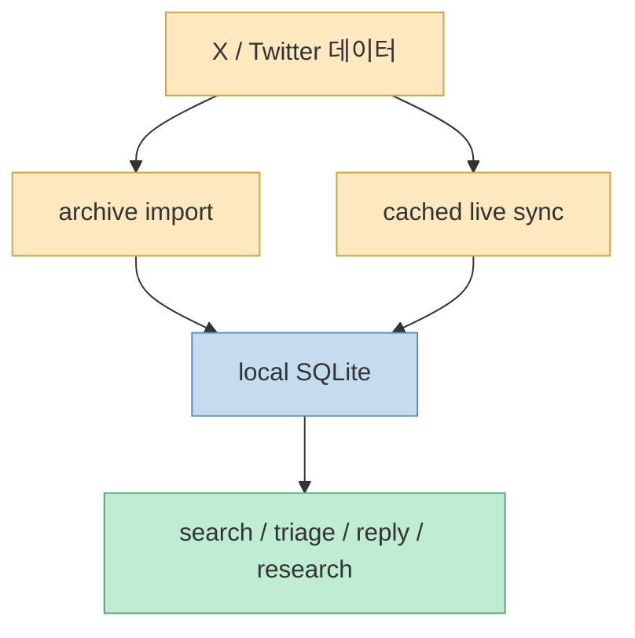
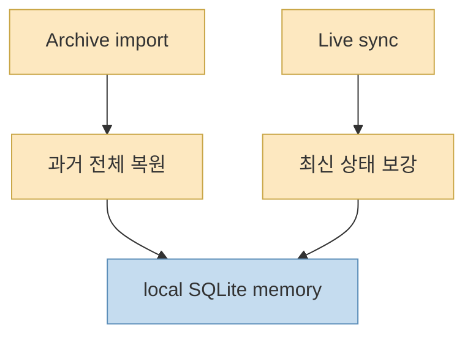
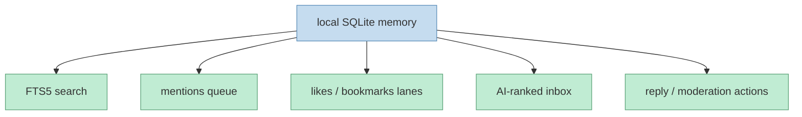
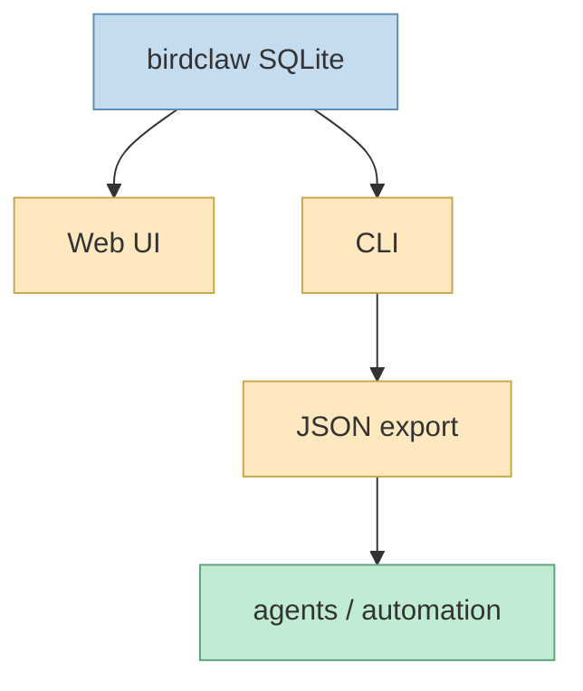

이번 X 포스트는 공개 메타데이터만으로 카드 안의 전체 텍스트를 복원할 수는 없었습니다. 다만 공개 검색과 연결된 최신 원본 저장소를 교차 확인한 결과, 현재 확인 가능한 핵심 소스는 `steipete/birdclaw`입니다. 이 저장소의 README 첫 줄은 매우 직설적입니다. `Local Twitter memory in SQLite: archives, DMs, likes, bookmarks.` 그리고 바로 이어서 `local-first Twitter workspace`라고 스스로를 규정합니다. 이 두 문장만으로도 birdclaw의 정체가 꽤 분명해집니다. 이건 예쁜 소셜 클라이언트를 만들겠다는 프로젝트가 아니라, **트위터/X 데이터를 로컬 SQLite에 쌓아 두고, 사람이든 에이전트든 반복 조회·분류·응답·연구에 쓰게 하려는 워크스페이스** 에 가깝습니다. [GitHub](https://github.com/steipete/birdclaw)

이 관점이 중요한 이유는, birdclaw를 그냥 “트위터 보관 앱” 정도로 보면 이 프로젝트의 절반만 이해하게 되기 때문입니다. README를 보면 birdclaw는 아카이브 임포트, cached live reads, likes/bookmarks, DM shards, FTS5 검색, AI-ranked inbox, scriptable JSON, reply flows, local blocklist, research briefs, profile analysis까지 한 덩어리로 묶습니다. 즉 이 저장소는 SNS 보기 도구가 아니라, **소셜 데이터를 에이전트가 claw-able 하게 만드는 로컬 메모리 인프라** 로 읽는 편이 더 정확합니다. [GitHub](https://github.com/steipete/birdclaw)
<!--more-->

## Sources

- https://x.com/i/status/2065026003798315365
- https://github.com/steipete/birdclaw

## 1. birdclaw의 핵심은 '소셜 피드 보기'보다 '로컬 메모리화'에 있다

README는 birdclaw가 keeps your Twitter data in local SQLite 한다고 못 박습니다. 여기서 포인트는 UI가 아닙니다. **저장 위치와 데이터 모델** 입니다. 트윗, 프로필, DMs, likes, bookmarks, followers/following, media cache, avatar cache가 전부 `~/.birdclaw` 아래의 로컬 저장소에 쌓입니다. [GitHub](https://github.com/steipete/birdclaw)

이게 중요한 이유는, 대개 소셜 플랫폼을 다룰 때 데이터는 플랫폼 안에 남고 사용자는 화면만 봅니다. 반면 birdclaw는 그 반대로 갑니다.

- 데이터를 로컬 SQLite에 넣고 
- 미디어와 프로필도 캐시하고 
- archive가 있으면 통째로 가져오고 
- 없어도 live sync로 일부를 채우며 
- search와 reply와 triage를 그 위에서 합니다

즉 소셜 피드를 소비하는 게 아니라, **소셜 흔적을 로컬에서 재구성 가능한 데이터셋** 으로 바꿉니다.

그래서 birdclaw의 핵심은 클라이언트보다 **데이터의 재소유화** 에 있습니다.

## 2. archive + live sync를 동시에 쓰는 구조가 중요한 이유

birdclaw README에서 특히 인상적인 부분은 `imports archives when you have them`과 `still works when you do not`를 함께 적어 둔 부분입니다. 이 프로젝트는 아카이브가 있으면 과거 전체를 bulk import하고, 아카이브가 없어도 `xurl`이나 `bird`를 통해 mentions, likes, bookmarks, home timeline, DMs 같은 live sync를 수행합니다. [GitHub](https://github.com/steipete/birdclaw)

이 설계는 현실적입니다. 소셜 데이터는 한 번에 완전하게 얻기 어렵고, 플랫폼 정책도 계속 바뀝니다. 그래서 birdclaw는 두 경로를 함께 둡니다.

- archive는 과거 전체를 한 번에 회수하는 경로 
- live sync는 최신 상태를 부분적으로 따라가는 경로

즉 하나의 정답 수집기가 아니라, **불완전한 여러 경로를 합쳐 로컬 기억을 유지하는 구조** 입니다.

이건 단순 구현 세부가 아니라, birdclaw가 “앱”보다 **기억 인프라** 에 가깝다는 걸 보여 줍니다.

## 3. 검색과 triage 기능이 붙는 순간 이 프로젝트는 단순 아카이브를 넘어선다

README를 보면 birdclaw는 FTS5 search over tweets and DMs, mentions queue, likes/bookmarks review lanes, inbox, blocks, replied/unreplied filters, AI-ranked inbox, low-signal filtering까지 제공합니다. [GitHub](https://github.com/steipete/birdclaw)

이 조합은 굉장히 의미심장합니다. 단순 아카이브 도구라면 “저장”과 “검색”에서 멈춥니다. 그런데 birdclaw는 그 다음 단계로 갑니다.

- 무엇이 중요한 mention인지 골라내고 
- 어떤 DM이 가치가 높은지 정렬하고 
- 어떤 링크가 많이 돌고 있는지 모으고 
- 무엇에 답장했고 무엇에 안 했는지 추적합니다

즉 소셜 기록을 **행동 가능한 작업 큐** 로 바꾸는 것입니다. 이게 바로 에이전트 친화적이라는 뜻입니다.

즉 birdclaw는 “내 트윗을 보관해 둔다”보다, **소셜 데이터를 작업 가능한 inbox로 만든다** 는 데 더 가깝습니다.

## 4. scriptable JSON과 CLI가 있다는 건 사람이 아니라 에이전트를 염두에 뒀다는 뜻이다

README는 birdclaw가 `exposes scriptable JSON for agents and automation`라고 직접 말합니다. 이 문장은 이 저장소의 정체성을 거의 다 설명합니다. 단순 로컬 웹앱이었다면 JSON export를 agent-first 언어로 설명하지 않았을 것입니다. [GitHub](https://github.com/steipete/birdclaw)

또 CLI 예시도 이를 뒷받침합니다.

- `search tweets` 
- `sync mentions` 
- `graph summary` 
- `mentions export` 
- `research` 
- `discuss` 
- `profile-analyze`

즉 birdclaw의 CLI는 단순 관리 명령이 아니라, **에이전트가 사용할 수 있는 분석 표면** 입니다.

그래서 README 부제인 “Stores all your tweets nicely claw-able for agents”는 농담이 아니라 설계 요약입니다.

## 5. follow graph, link intelligence, DM workspace가 붙으면서 '소셜 메모리'가 된다

birdclaw가 단순 timeline viewer와 다른 이유는, 데이터가 단순 chronological feed로만 남지 않기 때문입니다. README에는:

- follow graph queries 
- top followers / unfollows / mutuals / non-mutual following 
- links for top URLs across windows 
- DMs workspace with influence context 
- profile hydration, affiliation badge edges, bio entity extraction

같은 기능이 적혀 있습니다. [GitHub](https://github.com/steipete/birdclaw)

이건 저장소가 소셜 데이터를 세 가지 층으로 다룬다는 뜻입니다.

- timeline memory 
- relationship graph 
- research / triage workspace

즉 birdclaw는 “트윗 목록”보다 **사람, 관계, 링크, 대화, 반응을 모두 엮은 개인 소셜 지식 그래프의 초입** 에 가깝습니다.

## 6. local-first와 safety 규칙을 보면 이건 제품보다 개인 운영체제에 가깝다

README는 safety 섹션에서 `local-first by default`, `tests disable live writes`, `CI disables live writes`, `app has no auth layer because it is a local-only tool`라고 설명합니다. [GitHub](https://github.com/steipete/birdclaw)

이건 매우 중요한 태도입니다. birdclaw는 많은 SaaS형 소셜 툴과 달리:

- 서버 멀티테넌시를 전제로 하지 않고 
- 데이터가 내 디스크에 머무르며 
- 실수로 live write가 일어나지 않도록 가드하고 
- auth 계층 대신 로컬 신뢰 경계를 사용합니다

즉 이 프로젝트는 “서비스”보다 **개인이 소셜 데이터를 자기 작업 환경 안에서 운영하는 운영체제 조각** 에 더 가깝습니다.

## 7. birdclaw가 진짜 흥미로운 이유는 '트위터 클라이언트'가 아니라 '에이전트용 외부 기억장치'이기 때문이다

이 저장소를 한 문장으로 다시 요약하면 이렇습니다. birdclaw는 트윗을 보기 위한 앱이 아니라, **에이전트가 나의 소셜 기록과 관계망과 DM과 북마크를 로컬에서 읽고 정리하고 분류하고 응답하게 만들기 위한 외부 기억장치** 입니다. [GitHub](https://github.com/steipete/birdclaw)

그렇기 때문에 이 프로젝트의 가치도 UI 미감이나 피드 경험보다:

- 로컬 SQLite 정규화 
- archive + live sync 병행 
- FTS5 검색 
- JSON export 
- triage / research / discuss 표면

에 있습니다.

## 핵심 요약

- birdclaw는 단순 트위터 클라이언트보다 **로컬 소셜 메모리 워크스페이스** 에 가깝습니다. 
- archive import와 live sync를 함께 써서 과거 전체와 최신 상태를 동시에 다룹니다. 
- FTS5 검색, inbox triage, reply 흐름이 붙어 단순 보관이 아니라 **작업 큐화** 가 가능합니다. 
- CLI와 scriptable JSON은 birdclaw가 사람보다 **에이전트와 자동화** 를 강하게 염두에 둔 설계임을 보여 줍니다. 
- follow graph, links, DMs, profile hydration이 붙으며 단순 timeline이 아니라 **관계형 소셜 기억** 으로 확장됩니다. 
- local-first와 write-guard 규칙 때문에 이 프로젝트는 SaaS보다 **개인 운영체제** 에 더 가깝습니다.

## 결론

birdclaw가 흥미로운 이유를 한 문장으로 줄이면 이렇습니다. 이건 트위터를 “보는” 앱이 아니라, **트위터를 에이전트가 만질 수 있는 로컬 메모리로 바꾸는 도구** 입니다.

그래서 이 저장소는 소셜 미디어 툴이라기보다, 에이전트 시대의 외부 기억장치가 어떤 모습이어야 하는지 보여 주는 사례로 읽는 편이 더 맞습니다. 내 트윗과 DM과 북마크가 플랫폼 안에만 갇혀 있지 않고, 로컬 SQLite에서 검색·연구·응답 흐름으로 재구성되는 것. 그게 birdclaw가 다른 급으로 보이는 이유입니다.
