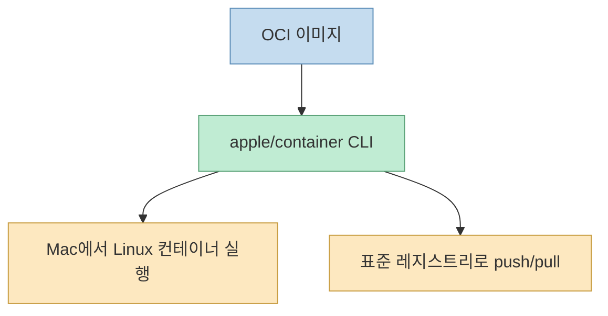
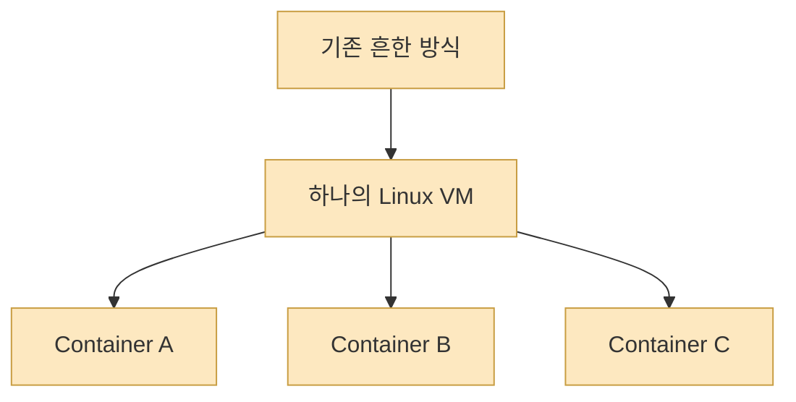
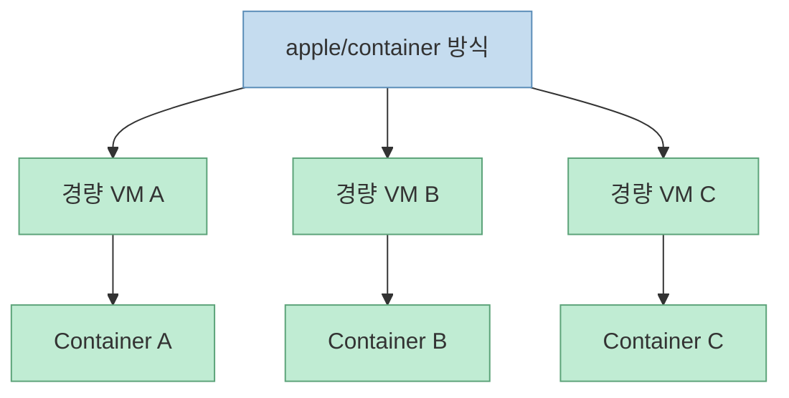
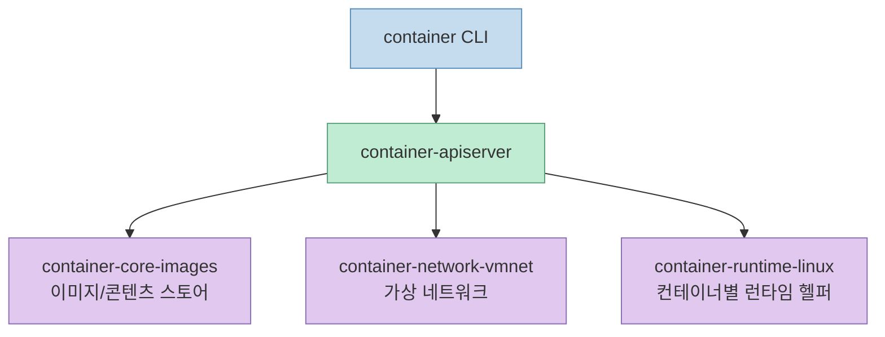
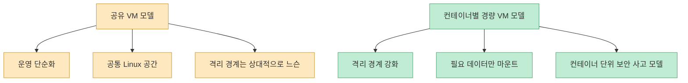
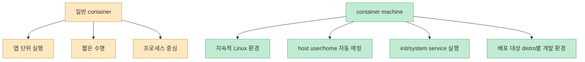

애플의 [`container`](https://github.com/apple/container) 저장소가 갑자기 크게 주목받은 이유는 단순히 **“애플도 Docker 같은 걸 만들었다”** 라는 수준이 아닙니다. 이 프로젝트는 macOS에서 Linux 컨테이너를 돌리는 오래된 문제를, **하나의 큰 Linux VM 위에 여러 컨테이너를 얹는 방식** 이 아니라 **컨테이너마다 아주 가벼운 VM을 붙이는 방식** 으로 다시 풀고 있습니다. [README](https://raw.githubusercontent.com/apple/container/main/README.md) [Technical Overview](https://raw.githubusercontent.com/apple/container/main/docs/technical-overview.md)

겉으로는 OCI 이미지를 pull 받고 run 하는 익숙한 CLI처럼 보이지만, 내부 철학은 꽤 다릅니다. 이 글은 `container`를 Docker Desktop의 단순 대체재로 보기보다, **Apple Silicon + Virtualization.framework + OCI 표준** 을 묶어 만든 macOS 네이티브 컨테이너 런타임으로 정리합니다.

<!--more-->

## Sources

- [GitHub - apple/container](https://github.com/apple/container)
- [README.md](https://raw.githubusercontent.com/apple/container/main/README.md)
- [Technical Overview](https://raw.githubusercontent.com/apple/container/main/docs/technical-overview.md)
- [How-to](https://raw.githubusercontent.com/apple/container/main/docs/how-to.md)
- [Container machine](https://raw.githubusercontent.com/apple/container/main/docs/container-machine.md)
- [Releases](https://github.com/apple/container/releases)

## 1. `container`는 무엇인가

README의 첫 문장은 이 도구를 아주 명확하게 정의합니다. `container`는 Mac에서 Linux 컨테이너를 만들고 실행하는 도구이며, Swift로 작성되었고 Apple Silicon에 최적화되어 있습니다. 또한 OCI 호환 이미지를 소비하고 생성하므로, 표준 컨테이너 레지스트리와 이미지를 그대로 주고받을 수 있습니다. [README](https://raw.githubusercontent.com/apple/container/main/README.md)

즉 핵심은 두 가지입니다.

- **사용 경험은 표준 OCI 생태계에 맞춘다**
- **실행 방식은 macOS와 Apple Silicon에 맞게 다시 설계한다**

이 점 때문에 `container`는 폐쇄적인 애플 전용 포맷이 아니라, **OCI 표준을 유지한 채 런타임만 애플식으로 바꾼 프로젝트** 로 이해하는 편이 맞습니다.

## 2. 가장 큰 차이는 “공유 VM 하나”가 아니라 “컨테이너마다 VM 하나”라는 점이다

기술 개요 문서가 가장 강조하는 차이는 바로 여기입니다. macOS에서 Linux 컨테이너를 돌릴 때 흔한 방식은 **하나의 Linux VM을 띄우고 그 안에 여러 컨테이너를 함께 넣는 구조** 입니다. 그런데 `container`는 이와 다르게, `Containerization` 패키지를 이용해 **각 컨테이너마다 경량 VM을 하나씩 실행** 합니다. [Technical Overview](https://raw.githubusercontent.com/apple/container/main/docs/technical-overview.md)

애플이 문서에서 직접 내세우는 장점은 세 가지입니다.

- 보안: 각 컨테이너가 풀 VM 수준의 격리를 가진다
- 프라이버시: 필요한 데이터만 각 VM에 마운트하면 된다
- 성능: 풀 VM보다는 가볍고, 부팅 속도는 공유 VM 기반 컨테이너와 비슷한 수준을 노린다

이 구조는 Docker나 Lima 같은 도구에 익숙한 사람에게는 꽤 낯설 수 있습니다. 하지만 macOS라는 환경에서는 오히려 자연스럽습니다. 리눅스 커널 네이티브 컨테이너를 직접 제공할 수 없는 호스트이기 때문에, **가상화는 어차피 피할 수 없고**, 그렇다면 그 가상화를 “컨테이너 전체의 기반”이 아니라 **컨테이너 단위 격리 장치** 로 더 세밀하게 쪼개겠다는 접근입니다.

## 3. 내부 구조는 CLI 하나가 아니라 여러 서비스의 조합이다

기술 개요 문서를 보면 `container`는 단일 바이너리 하나로 모든 일을 끝내는 도구가 아닙니다. CLI는 클라이언트 역할을 하고, 실제 관리 기능은 `container-apiserver`와 여러 헬퍼 프로세스가 맡습니다. [Technical Overview](https://raw.githubusercontent.com/apple/container/main/docs/technical-overview.md)

핵심 구성은 이렇습니다.

- `container` CLI
- `container-apiserver`
- `container-core-images`
- `container-network-vmnet`
- 컨테이너별 `container-runtime-linux`

문서에 따르면 이 구조는 macOS의 여러 핵심 프레임워크와 직접 연결됩니다.

- Virtualization.framework
- vmnet
- XPC
- launchd
- Keychain Services
- unified logging

[Technical Overview](https://raw.githubusercontent.com/apple/container/main/docs/technical-overview.md)

이 점이 중요합니다. `container`는 단순히 오픈소스 컨테이너 엔진을 Mac 위에 포장한 도구가 아니라, **macOS의 시스템 서비스 레이어에 깊숙이 붙는 네이티브 런타임** 에 가깝습니다.

## 4. 왜 이 구조가 Docker Desktop과 다른 감각을 줄 수 있는가

여기서 핵심은 “어느 쪽이 더 낫다”가 아니라 **운영 모델이 다르다** 는 것입니다.

공유 VM 모델은:

- 여러 컨테이너가 같은 Linux 환경을 공유하고
- 공통 커널/네트워크/파일 시스템 기반 위에서 움직이며
- 하나의 개발용 Linux 공간을 크게 띄워 두는 감각에 가깝습니다

반면 `container` 모델은:

- 컨테이너마다 VM 경계를 가지고
- 필요한 데이터만 각 VM에 마운트하며
- 보안 격리와 최소 노출을 더 강하게 가져가려는 쪽입니다

이 때문에 `container`는 단순히 “Docker 명령어 호환 앱”으로 기대하면 어긋날 수 있고, 오히려 **Mac에서 Linux 워크로드를 더 작은 VM 단위로 분리하는 도구** 로 보는 편이 이해가 쉽습니다.

## 5. 실제 사용 감각은 여전히 친숙한 OCI CLI를 지향한다

그렇다고 내부 구조가 복잡하다고 사용법까지 낯선 것은 아닙니다. How-to 문서를 보면 꽤 익숙한 흐름이 많습니다. [How-to](https://raw.githubusercontent.com/apple/container/main/docs/how-to.md)

- `container run`
- `container build`
- `container image push`
- `container inspect`
- `container ls`
- `--volume`, `--mount`, `--publish`

또한 빌더도 별도로 존재합니다. `container build`를 처음 실행하면 builder 유틸리티 컨테이너가 올라가고, 큰 빌드가 필요하면 builder VM의 CPU와 메모리를 늘릴 수 있습니다. [How-to](https://raw.githubusercontent.com/apple/container/main/docs/how-to.md)

이 흐름은 중요한 메시지를 줍니다. 내부는 VM 중심이지만, 외부 인터페이스는 최대한 **OCI/컨테이너 개발자의 기존 습관을 유지** 하려 한다는 것입니다.

## 6. 조건은 꽤 빡빡하다: Apple Silicon, 그리고 최신 macOS 중심

README는 요구 사항을 분명히 적습니다.

- 실행에는 **Apple Silicon Mac** 이 필요
- 최신 문서 기준으로 **macOS 26 지원**
- 오래된 macOS는 공식 지원 밖

[README](https://raw.githubusercontent.com/apple/container/main/README.md)

기술 개요 문서는 macOS 15에서도 제한적으로 실행 가능하다고 말하지만, 네트워크 분리와 다중 네트워크 같은 기능 제한이 크고, 유지보수 우선순위도 macOS 26 쪽에 있습니다. [Technical Overview](https://raw.githubusercontent.com/apple/container/main/docs/technical-overview.md)

즉 이 프로젝트는 “최대한 많은 Mac에서 돌아가는 범용 툴”보다, **최신 Apple 플랫폼 기능을 적극적으로 쓰는 네이티브 툴** 에 가깝습니다.

## 7. 현재 한계도 꽤 솔직하게 드러낸다

기술 개요 문서는 아직 구현되지 않은 기능이 많다고 직접 말합니다. 특히 눈에 띄는 부분은 메모리 회수입니다. [Technical Overview](https://raw.githubusercontent.com/apple/container/main/docs/technical-overview.md)

문서 설명대로, 컨테이너 VM 안에서 프로세스가 메모리를 해제해도 그 메모리가 바로 macOS 호스트로 반환되지 않을 수 있습니다. 그래서 메모리를 많이 쓰는 컨테이너를 여러 개 돌리면, 메모리 사용량을 줄이기 위해 가끔 재시작이 필요할 수 있습니다. [Technical Overview](https://raw.githubusercontent.com/apple/container/main/docs/technical-overview.md)

이건 `container`가 “컨테이너처럼 보이지만 VM도 맞다”는 현실을 잘 보여 주는 사례입니다. 격리와 네이티브 통합을 얻는 대신, 가상화 계층의 제약도 함께 안고 가는 셈입니다.

## 8. 1.0.0에서 진짜 흥미로운 건 `container machine`이다

릴리스 페이지를 보면 2026년 6월 9일 기준 최신 릴리스는 **1.0.0** 이고, 여기서 가장 큰 하이라이트 중 하나가 `container machine`입니다. [Releases](https://github.com/apple/container/releases)

릴리스 노트는 `container machine`을 **long-lived Linux environments with tight host integration** 이라고 설명합니다. [Releases](https://github.com/apple/container/releases)

별도 문서를 보면 이 기능은 일반적인 앱 컨테이너보다 **지속적인 Linux 개발 환경** 에 가깝습니다. 핵심은 이렇습니다.

- 지속성 있음
- 표준 OCI 이미지 기반
- 호스트 사용자명과 홈 디렉터리 자동 매핑
- `/sbin/init` 기반 장기 서비스 실행 가능
- 하나의 배포 대상 distro별 개발 환경 구성 가능

[Container machine](https://raw.githubusercontent.com/apple/container/main/docs/container-machine.md)

이 기능이 의미 있는 이유는, 애플이 `container`를 단순히 “Mac에서 컨테이너 한 번 실행하는 툴”로 두지 않고, **Linux 개발 환경 자체를 OCI 이미지 기반으로 재구성하는 방향** 까지 밀고 있다는 신호이기 때문입니다.

## 9. 그래서 이 프로젝트는 누구에게 특히 매력적인가

현재 문서와 릴리스를 종합하면, `container`는 특히 이런 사용자에게 매력적일 가능성이 큽니다.

- Apple Silicon Mac을 메인 개발 머신으로 쓰는 사람
- Docker 이미지와 OCI 생태계를 그대로 유지하고 싶은 사람
- Mac 위에서 Linux 워크로드를 더 강한 격리로 돌리고 싶은 사람
- 장기적으로는 distro별 지속 개발 환경까지 OCI 이미지 기반으로 관리하고 싶은 사람

반대로:

- 구형 Intel Mac 사용자
- 넓은 호환성과 오랜 생태계 축적이 더 중요한 사용자
- 기존 Docker Desktop 생태계 의존성이 큰 팀

에게는 아직 보수적으로 봐야 할 부분도 있습니다.

## 핵심 요약

- `apple/container`는 Mac에서 Linux 컨테이너를 실행하는 Swift 기반 도구이며, Apple Silicon과 macOS 네이티브 프레임워크에 강하게 최적화되어 있습니다. 
- 가장 큰 차이는 **하나의 공유 Linux VM** 이 아니라 **컨테이너마다 경량 VM** 을 붙인다는 점입니다. 
- 내부적으로는 `container-apiserver`, 이미지/네트워크 헬퍼, 컨테이너별 런타임 헬퍼가 나뉘는 서비스 구조를 가집니다. 
- 외부 인터페이스는 여전히 OCI 이미지와 친숙한 CLI 흐름을 유지하려고 합니다. 
- 2026년 6월 9일 릴리스된 1.0.0의 `container machine`은 이 프로젝트가 앱 실행기를 넘어 **지속적인 Linux 개발 환경 플랫폼** 으로 가고 있음을 보여 줍니다.

## 결론

`container`를 그냥 “애플판 Docker”라고 부르면 중요한 부분을 놓치게 됩니다. 이 프로젝트의 진짜 흥미로움은, macOS에서 Linux 컨테이너를 억지로 흉내 내는 대신 **가상화와 컨테이너 표준을 다시 조합해서 애플 하드웨어에 맞는 런타임 모델을 새로 만든다** 는 데 있습니다.

특히 `container machine`까지 보면 방향은 더 분명합니다. 애플은 단순한 컨테이너 실행 도구가 아니라, **Mac 위에서 Linux 앱과 Linux 개발 환경을 OCI 이미지 기반으로 다루는 새로운 기본기** 를 만들려는 쪽에 가깝습니다.
