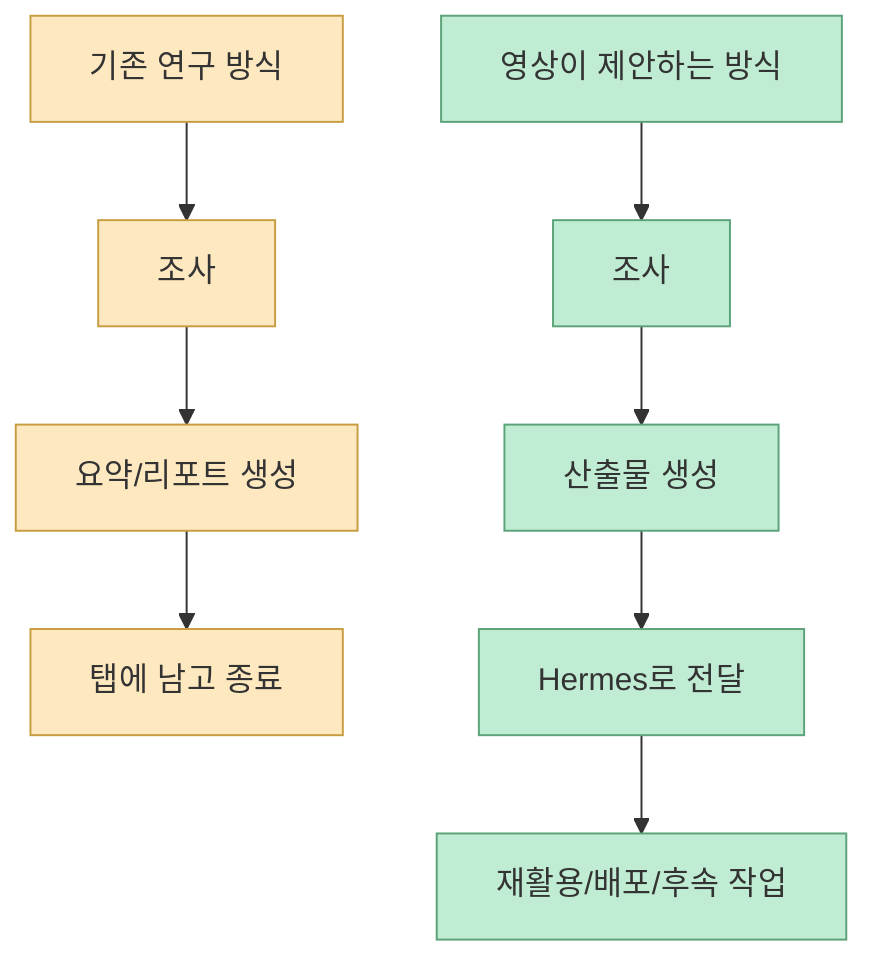
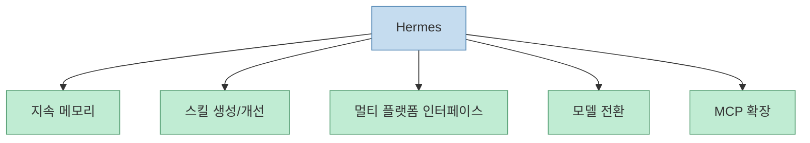
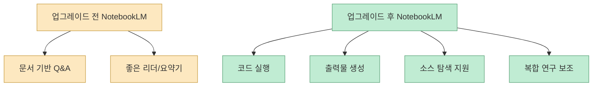
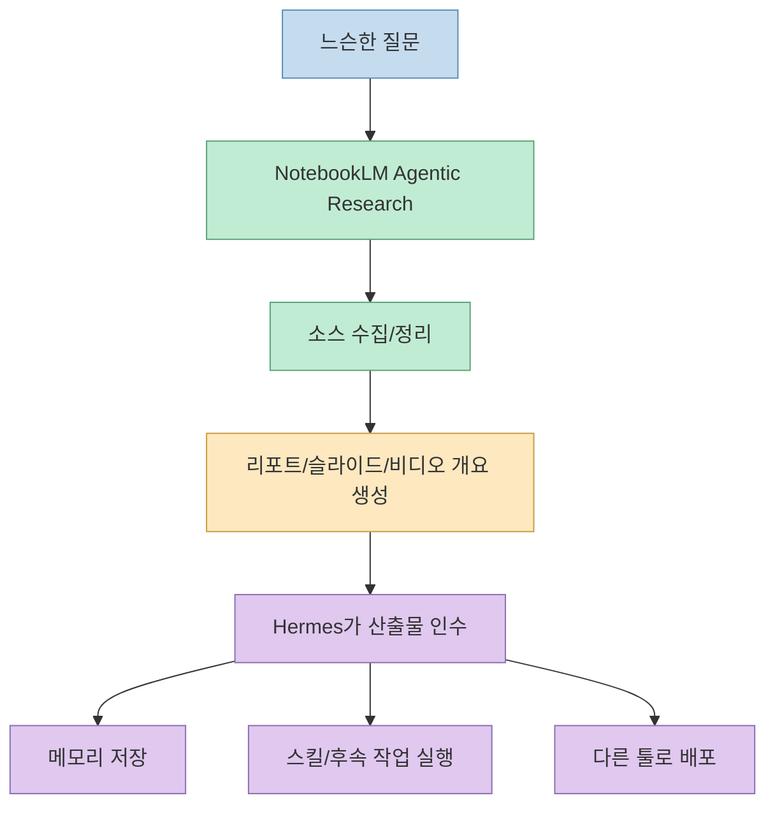
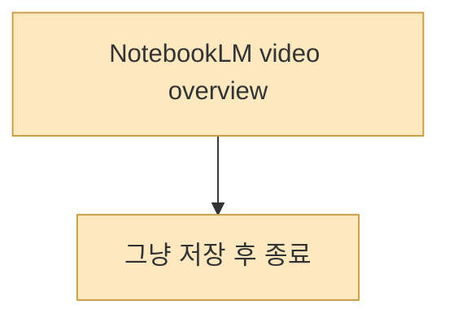
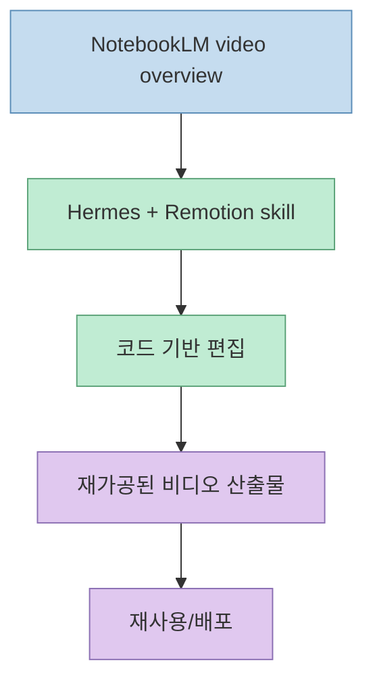
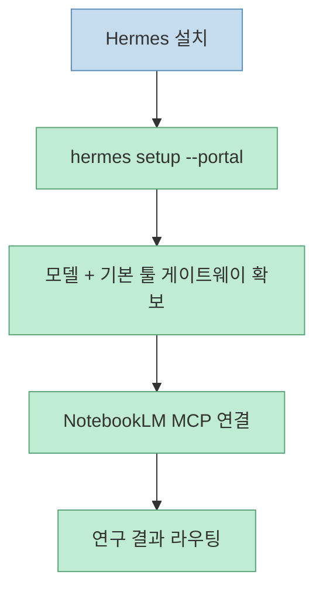

이 영상의 핵심은 **NotebookLM을 잘 쓰는 법** 이 아닙니다. 더 정확히 말하면, NotebookLM을 그냥 “좋은 리서치 툴”로 두지 말고, **Hermes 같은 장기 기억형 에이전트에 연결해 연구 결과가 다음 작업으로 계속 흘러가게 만들라** 는 이야기입니다. 발표자는 이걸 “one research machine”이라고 부르는데, 실제로 영상이 보여 주는 구조도 딱 그 표현에 가깝습니다. [영상 0:33](https://youtu.be/J5RBrUhIlko?t=33) [영상 3:13](https://youtu.be/J5RBrUhIlko?t=193)

즉 질문은 더 이상 “NotebookLM으로 자료를 잘 요약할 수 있나?”가 아니라, **NotebookLM이 만든 연구 결과를 Hermes가 기억하고, 변형하고, 다른 산출물로 이어서 실제 자산처럼 쌓을 수 있나?** 로 바뀝니다.

<!--more-->

## Sources

- [YouTube - How to Use Hermes + NotebookLM for FREE!](https://youtu.be/J5RBrUhIlko?si=aI5jHuqlTWBVWoqq)
- [Google Blog - Do your best research with NotebookLM](https://blog.google/innovation-and-ai/products/notebooklm/better-research-notebooklm/)
- [Hermes Agent Documentation](https://hermes-agent.nousresearch.com/docs/)
- [Hermes Agent Homepage](https://hermes-agent.nousresearch.com/)
- [Hermes Persistent Memory Docs](https://hermes-agent.nousresearch.com/docs/user-guide/features/memory)
- [NousResearch/hermes-agent GitHub](https://github.com/nousresearch/hermes-agent)

## 1. 이 영상이 푸는 문제는 “좋은 조사 결과가 탭 안에서 죽어버린다”는 것이다

영상 설명란은 문제를 아주 직접적으로 적습니다. 지금의 연구 워크플로는 조사 결과가 “forgotten tab”에서 죽어 버린다는 것입니다. 발표자는 NotebookLM의 업그레이드와 Hermes를 연결하면, 한 덩어리 연구가 비디오, 보고서, 콘텐츠 등 실제 활용물로 바뀐다고 설명합니다. [영상 설명란](https://youtu.be/J5RBrUhIlko?si=aI5jHuqlTWBVWoqq)

영상 본문도 같은 이야기를 반복합니다. 대부분 사람은 NotebookLM에서 무언가를 생성하고 거기서 끝내지만, 진짜 중요한 것은 그 결과를 다른 툴과 연결해 **actionable** 하게 만드는 것이라고 말합니다. [영상 4:00](https://youtu.be/J5RBrUhIlko?t=240) [영상 4:24](https://youtu.be/J5RBrUhIlko?t=264)

이 관점은 꽤 중요합니다. 조사 도구의 품질만 높여서는 실제 생산성이 크게 늘지 않는 이유가, **연구가 다음 작업으로 이어지는 파이프라인이 없기 때문** 이라는 지적이기 때문입니다.

## 2. Hermes는 “질문에 답하는 챗봇”이 아니라 장기 기억과 스킬을 가진 실행 레이어다

영상이 설명하는 Hermes의 정의는 꽤 분명합니다. Hermes는 Nous Research가 만든 self-improving agent이고, 작업 중에 작은 스킬을 만들고, 그것을 개선하고, 세션을 넘어 사용자를 기억한다고 말합니다. [영상 0:49](https://youtu.be/J5RBrUhIlko?t=49)

이 설명은 공식 문서와 거의 그대로 맞습니다. Hermes 문서는 이 도구를 “built-in learning loop”를 가진 self-improving AI agent라고 정의합니다. 경험에서 스킬을 만들고, 사용 중 스킬을 개선하고, 기억을 유지하며, 세션을 넘나들며 사용자의 작업 방식을 축적한다고 설명합니다. [Hermes Docs](https://hermes-agent.nousresearch.com/docs/) [GitHub README](https://github.com/nousresearch/hermes-agent)

공식 문서 기준으로 Hermes의 핵심은 다음처럼 정리할 수 있습니다.

- 지속 메모리
- 스킬 자동 생성 및 재사용
- 다양한 모델/엔드포인트 선택
- 메시징 플랫폼과 터미널 양쪽 지원
- MCP와 툴 게이트웨이 확장

특히 공식 메모리 문서는 Hermes가 `MEMORY.md`와 `USER.md` 두 파일을 세션 시작 시 시스템 프롬프트에 주입한다고 설명합니다. 이 메모리는 무한정 늘어나지 않고 크기 제한이 있으며, 에이전트가 스스로 다듬어 유지합니다. [Persistent Memory](https://hermes-agent.nousresearch.com/docs/user-guide/features/memory)

즉 Hermes는 “이번 턴의 답변기”보다, **장기적으로 사용자 방식에 적응하는 작업 엔진** 쪽에 더 가깝습니다.

## 3. NotebookLM은 이제 “읽는 도구”가 아니라 계산하고 산출하는 연구 엔진으로 바뀌고 있다

영상의 두 번째 축은 업그레이드된 NotebookLM입니다. 발표자는 Google 팀의 설명을 인용하며 NotebookLM이 더 강한 reasoning, agentic chat, 새로운 output formats를 갖추게 됐다고 설명합니다. [영상 1:45](https://youtu.be/J5RBrUhIlko?t=105)

Google 공식 블로그도 같은 내용을 분명하게 적습니다.

- 각 notebook에 secure cloud computer 제공
- code를 쓰고 실행 가능
- 더 깊은 연구와 복잡한 분석 지원
- PDF, DOCX, XLSX, PPTX, CSV, charts 등 다양한 출력 형식
- loose idea에서 시작해 Google Search로 source repository 구축 지원

[Google Blog](https://blog.google/innovation-and-ai/products/notebooklm/better-research-notebooklm/)

Google은 각 notebook에 secure cloud computer가 붙어 코드 실행까지 가능하다고 설명합니다. 또한 source discovery 성능이 이전 시스템 대비 78.2% win rate를 기록했다고 밝힙니다. [Google Blog](https://blog.google/innovation-and-ai/products/notebooklm/better-research-notebooklm/)

영상도 이 포인트를 그대로 집습니다. 이전 NotebookLM은 “smart reader”였다면, 이제는 compute, browse, build deliverables가 가능한 research partner라고 해석합니다. [영상 2:15](https://youtu.be/J5RBrUhIlko?t=135)

## 4. 둘을 함께 붙이면 “기억하는 실행자 + 소스를 찾는 연구 두뇌” 조합이 된다

영상 3분대는 이 통합의 핵심을 아주 간단하게 정리합니다. Hermes는 **기억하고 일을 하는 agent**, NotebookLM은 **소스를 찾고 자산을 만드는 research brain** 이라는 것입니다. [영상 3:13](https://youtu.be/J5RBrUhIlko?t=193)

이 둘을 연결하면 구조는 이렇게 됩니다.

영상에서는 NotebookLM이 Agent OS 안에서 library, research, chat, studio, assets 섹션으로 배치된 모습을 보여 주며, 특히 assets 섹션이 중요하다고 말합니다. 이유는 생성된 보고서, 비디오, 슬라이드가 한곳에 남아서 다시 돌아올 수 있기 때문입니다. [영상 3:24](https://youtu.be/J5RBrUhIlko?t=204) [영상 3:39](https://youtu.be/J5RBrUhIlko?t=219)

여기서 중요한 건 단순 저장이 아닙니다. **어디에 남아 있고, 누가 다시 집어다 쓰는가** 가 핵심인데, 이 역할을 Hermes가 맡는다는 것이 영상의 핵심 주장입니다.

## 5. Remotion 예시는 “연구 결과가 콘텐츠 파이프라인으로 바로 이어진다”는 증명이다

영상은 Hermes 에이전트에 `Remotion` 스킬을 붙인 사례를 보여 줍니다. NotebookLM이 생성한 video overview를 그냥 끝내지 않고, Hermes가 코드로 비디오를 편집하게 만드는 흐름입니다. [영상 3:50](https://youtu.be/J5RBrUhIlko?t=230) [영상 4:06](https://youtu.be/J5RBrUhIlko?t=246)

발표자가 강조하는 포인트는 이겁니다.

- NotebookLM 단독으로도 생성은 가능하다
- 하지만 대부분 사람은 거기서 멈춘다
- Hermes를 붙이면 그 결과가 실제 편집/재가공 단계로 이어진다

이 예시는 매우 상징적입니다. NotebookLM이 “좋은 연구 보조자”인 것과, 그 결과가 실제 배포 가능한 콘텐츠로 이어지는 것은 다른 문제인데, Hermes는 바로 그 사이를 메우는 레이어로 작동합니다.

## 6. SEO 예시는 ‘한 번 조사한 것을 여러 파이프라인이 소비하는 구조’를 보여 준다

영상 4분 44초 이후에는 SEO 툴과 연결된 예시가 나옵니다. NotebookLM에서 만든 연구를 SEO 툴로 그대로 넘겨 더 나은 콘텐츠를 만든다는 것입니다. 발표자는 이것을 “connected ecosystem”이라고 부르며, 서로 말을 안 하는 열두 개 탭 대신 하나의 Agent OS에 다 연결된 구조를 강조합니다. [영상 4:44](https://youtu.be/J5RBrUhIlko?t=284) [영상 4:55](https://youtu.be/J5RBrUhIlko?t=295)

이건 NotebookLM이나 Hermes 각각의 기능 설명보다 더 큰 메시지입니다. 즉 조사는 1회성이 아니라, **여러 downstream workflow가 먹는 upstream asset** 으로 다뤄야 한다는 뜻입니다.

## 7. 설치와 연결의 핵심은 “Hermes 설치 → 모델 설정 → MCP로 NotebookLM 연결”의 세 단계다

영상 후반은 실제 연결 순서를 짧게 설명합니다.

1. Hermes 설치  
2. 모델 설정  
3. NotebookLM을 MCP로 연결

[영상 5:57](https://youtu.be/J5RBrUhIlko?t=357) [영상 6:30](https://youtu.be/J5RBrUhIlko?t=390)

Hermes 공식 문서도 거의 같은 흐름입니다.

- macOS / Linux / WSL2 / Android(Termux): `curl -fsSL https://hermes-agent.nousresearch.com/install.sh | bash`
- Windows native: `iex (irm https://hermes-agent.nousresearch.com/install.ps1)`
- 빠른 시작: `hermes setup --portal`

[Hermes Docs](https://hermes-agent.nousresearch.com/docs/)

영상은 설치 자체보다, **연구가 에이전트 실행 흐름 안으로 들어오는 통로가 MCP** 라는 점을 보여 주는 쪽에 더 가깝습니다. 여기서 중요한 것은 NotebookLM을 하나의 독립 앱으로 두는 게 아니라, 에이전트가 호출할 수 있는 연구 브레인으로 재배치하는 것입니다.

## 8. 발표자가 말하는 “가장 많이 놓치는 한 수”는 결과를 반드시 어디론가 보내라는 점이다

영상 마지막 팁은 의외로 기술보다 운영 습관에 가깝습니다.

- 작게 시작하라
- 처음부터 5개 에이전트와 10개 툴을 붙이지 마라
- 느슨한 질문은 NotebookLM의 agentic research에 맡겨라
- 만든 연구는 반드시 어딘가로 보내라
- Hermes 메모리를 활용하라

[영상 6:48](https://youtu.be/J5RBrUhIlko?t=408)

발표자는 특히 “great report and let it die in a tab” 문제를 다시 강조합니다. 리포트를 만들었으면 자산, 비디오, 슬라이드 등으로 밀어 넣어 움직이게 하라는 것입니다. [영상 7:02](https://youtu.be/J5RBrUhIlko?t=422)

이 말은 단순한 생산성 팁이 아닙니다. 실제로 에이전트 시스템이 강해질수록 병목은 더 이상 “조사를 잘 하느냐”보다 **산출물이 다음 파이프라인으로 넘어가느냐** 쪽에서 생기기 때문입니다.

## 핵심 요약

- 이 영상은 NotebookLM 자체보다, **NotebookLM 결과를 Hermes에 연결해 자산화하는 루프** 를 더 중요하게 봅니다. 
- Hermes는 장기 메모리와 스킬 생성, MCP 확장을 가진 실행 레이어이고, NotebookLM은 업그레이드 이후 소스 탐색과 코드 실행, 다양한 산출물 생성을 담당하는 연구 레이어로 설명됩니다. 
- 둘을 연결하면 느슨한 질문에서 시작해 소스 수집, 보고서/슬라이드/비디오 생성, 편집, 재활용까지 이어지는 파이프라인이 만들어집니다. 
- Remotion과 SEO 예시는 “조사 결과를 탭에 남기지 않고 다른 시스템이 소비하게 만드는 것”이 핵심이라는 점을 보여 줍니다. 
- 가장 중요한 운영 팁은 기술보다도 **작게 시작하고, 만든 연구를 반드시 어디론가 보내며, Hermes 메모리를 점점 쌓아 가는 것** 입니다.

## 결론

이 영상이 말하는 본질은 “Hermes와 NotebookLM을 같이 쓰면 편하다”가 아닙니다. 더 정확히는, **리서치가 요약으로 끝나지 않고 다음 실행으로 넘어가는 루프를 만들라** 는 이야기입니다.

NotebookLM이 점점 더 강한 research engine이 될수록, 그 다음 병목은 기억과 실행과 재활용입니다. 그리고 Hermes는 바로 그 부분을 메우는 에이전트 레이어로 제안됩니다. 결국 중요한 것은 좋은 조사 결과 하나가 아니라, **그 결과가 다음 비디오, 다음 보고서, 다음 자동화 작업으로 계속 이어지는 구조** 입니다.
