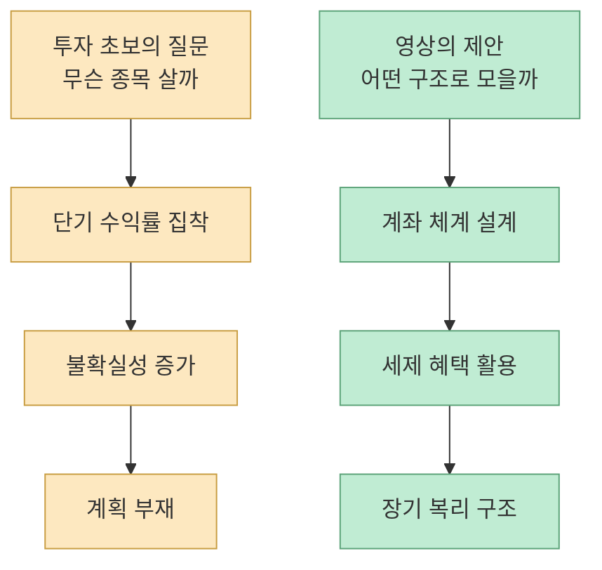
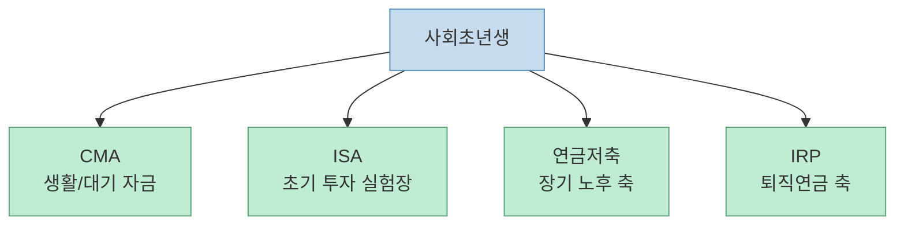
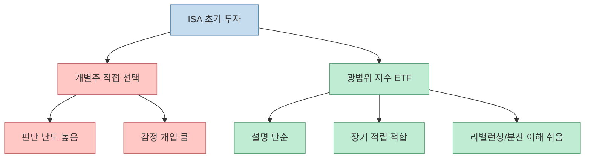
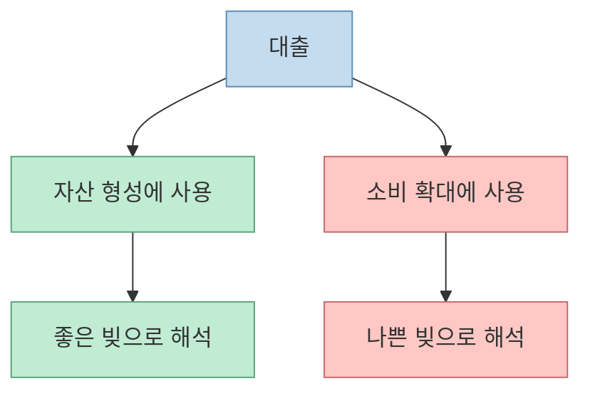
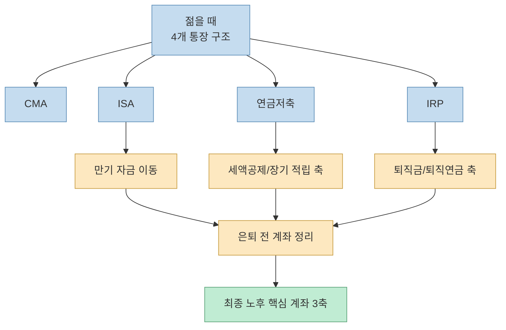

이 영상의 제목만 보면 마치 **\"월 50만 원만 넣으면 노후가 자동 해결된다\"** 는 단순 공식처럼 들립니다. 하지만 실제 내용은 훨씬 더 구조적입니다. 박곰희 작가가 반복해서 강조하는 것은 특정 종목 추천이 아니라, **생애주기별로 어떤 계좌를 어떻게 쓰고, 언제 어떤 돈을 어디로 넘길지를 미리 설계하는 것** 입니다. [영상 0:41](https://youtu.be/L_g1h2oVZv0?t=41) [영상 35:15](https://youtu.be/L_g1h2oVZv0?t=2115)

즉 이 영상의 핵심은 \"무슨 주식을 사라\"가 아니라, **노후 준비를 투자 상품의 문제가 아니라 자금 흐름 설계 문제로 바꿔서 보라** 는 데 있습니다.

<!--more-->

## Sources

- [YouTube - "\"노후는 완벽하게 해결됩니다\" 월급에서 딱 50만 원만 '이 계좌'에 넣으세요 (박곰희 작가 2부)"](https://youtu.be/L_g1h2oVZv0?si=0gyyaZkc3wb0ndQz)
- [금융위원회 - ISA 주요정책문답](https://www.fsc.go.kr/po020201/27339?curPage=&srchBeginDt=&srchCtgry=&srchEndDt=&srchKey=&srchText=)
- [고용노동부 - 퇴직연금이란?](https://www.moel.go.kr/retirementpay.do)
- [금융위원회 - 연금저축 관련 Q&A](https://www.fsc.go.kr/po020201/27301?curPage=7&srchBeginDt=&srchCtgry=&srchEndDt=&srchKey=&srchText=)

## 1. 왜 \"무슨 종목 살까\"만 묻는 사람은 오래 못 버는가

영상 초반에서 가장 먼저 나오는 메시지는 의외로 단순합니다. 대부분의 개인 투자자는 \"안에서 뭘 사야 할까\"에만 몰두하지만, 장기 투자로 갈수록 자산에 더 큰 영향을 주는 것은 **무엇을 사느냐** 보다 **어떻게 모으고, 어떤 틀 안에서 굴리느냐** 라는 것입니다. [영상 1:35](https://youtu.be/L_g1h2oVZv0?t=95) [영상 1:54](https://youtu.be/L_g1h2oVZv0?t=114)

박곰희 작가는 수익률만 비정상적으로 높일 수 있다면 세액공제나 ISA 같은 장치는 다 필요 없겠지만, 현실에서는 그렇게 높은 수익률을 꾸준히 얻는 것이 훨씬 어렵다고 설명합니다. 그래서 장기 투자에서는 \"왓\"보다 \"하우\"가 중요해진다고 말합니다. [영상 2:01](https://youtu.be/L_g1h2oVZv0?t=121)

이 말은 종목 분석이 쓸모없다는 뜻이 아닙니다. 오히려 초반에는 종목보다 먼저 **자산을 쌓는 구조와 행동 습관을 고정** 해야 한다는 뜻에 가깝습니다.

## 2. 사회초년생에게 시드보다 먼저 필요한 것은 \"4개 통장\" 프레임이다

영상에서 가장 실무적인 대목은 사회초년생에게 **시드를 모은 뒤 투자하라** 고 하지 않는다는 점입니다. 오히려 시드라는 개념 자체를 지우라고 말합니다. 부동산은 입장료가 있지만, 금융 투자는 입장료보다 **작게라도 바로 시작하는 경험** 이 더 중요하다는 논리입니다. [영상 3:13](https://youtu.be/L_g1h2oVZv0?t=193) [영상 3:35](https://youtu.be/L_g1h2oVZv0?t=215)

그 뒤에 제안하는 틀이 바로 네 개의 통장입니다.

- CMA
- ISA
- 연금저축
- IRP

[영상 3:48](https://youtu.be/L_g1h2oVZv0?t=228) [영상 4:17](https://youtu.be/L_g1h2oVZv0?t=257)

공식 자료를 보면 ISA는 여러 금융상품을 한 계좌 안에서 선택해 포트폴리오를 구성하고, 계좌 안 손익을 통산한 뒤 세제 혜택을 주는 구조입니다. [금융위원회](https://www.fsc.go.kr/po020201/27339?curPage=&srchBeginDt=&srchCtgry=&srchEndDt=&srchKey=&srchText=)  
연금저축은 세제적격 개인연금으로, 납입 단계의 세제 혜택과 노후 수령 구조가 핵심입니다. [금융위원회](https://www.fsc.go.kr/po020201/27301?curPage=7&srchBeginDt=&srchCtgry=&srchEndDt=&srchKey=&srchText=)  
IRP는 고용노동부 설명대로 퇴직급여를 한 계좌로 모아 노후 재원으로 활용할 수 있게 만든 개인형퇴직연금 계좌입니다. [고용노동부](https://www.moel.go.kr/retirementpay.do)

영상 안에서는 이 네 개를 처음부터 다 똑같이 채우라는 뜻이 아닙니다. 오히려 초반 3년 정도는 투자 여건과 세액공제 상황을 보면서 **열어 두고, 역할을 나눠 두고, 본격 납입 타이밍을 조절하라** 는 프레임에 가깝습니다. [영상 4:02](https://youtu.be/L_g1h2oVZv0?t=242) [영상 4:22](https://youtu.be/L_g1h2oVZv0?t=262)

즉 네 개의 통장은 상품 추천이 아니라 **역할 분리된 자금 통로** 로 보는 편이 맞습니다.

## 3. 왜 ISA에서는 S&P500부터 시작하라고 할까

영상 6분대에서 박곰희 작가는 ISA 안에서 가장 쉬운 첫 투자로 S&P500 같은 지수 ETF를 듭니다. 이유는 간단합니다. 초반에는 엄청난 초과수익보다, **장기적으로 손실 확률을 낮추면서도 시장 평균을 따라가는 구조** 가 더 중요하다고 보기 때문입니다. [영상 6:51](https://youtu.be/L_g1h2oVZv0?t=411) [영상 7:34](https://youtu.be/L_g1h2oVZv0?t=454)

여기서 핵심은 미국 지수 자체를 절대화하는 것이 아니라, 초년생이 처음 투자할 때는:

- 예측 난도가 낮고
- 설명이 단순하며
- 자동 적립과 궁합이 좋고
- 장기 보유 논리를 세우기 쉬운

자산부터 시작하는 것이 유리하다는 논리입니다.

영상은 여기서 한 발 더 나가, 시장에 대한 믿음과 성향이 다르다면 코스피를 섞거나 다른 지역 지수를 추가하는 식으로 확장할 수 있다고 말합니다. 즉 핵심은 종목 예언이 아니라 **지수 중심의 규칙 기반 투자 습관** 입니다. [영상 8:00](https://youtu.be/L_g1h2oVZv0?t=480)

## 4. 초년생에게는 수익률보다 원금과 월급이 더 중요하다는 주장

영상 12분대는 이 인터뷰의 가장 현실적인 대목입니다. 초년생 시기에는 수익률 차이보다 **원금의 크기** 가 훨씬 더 크게 작용한다고 말합니다. 정립식으로 모아 본 경험 자체가 중요하고, 3년 정도 지나 어느 정도 목돈이 생긴 뒤부터 수익률이 중요해지는 시즌이 온다는 설명입니다. [영상 12:04](https://youtu.be/L_g1h2oVZv0?t=724) [영상 13:28](https://youtu.be/L_g1h2oVZv0?t=808)

이 논리는 결국 이렇게 정리할 수 있습니다.

- 초반에는 투자 감각보다 적립 습관이 더 중요하다
- 초반 3년은 자산과 시장에 대한 자기 반응을 배우는 기간이다
- 수익률 레이스는 목돈이 생긴 뒤에야 비로소 의미가 커진다

그래서 영상 제목의 \"월 50만 원\"도 사실은 마법의 숫자가 아니라, **커리어가 진행되며 늘어나는 월급을 장기 자산 형성으로 자동 연결하라** 는 상징에 더 가깝습니다.

## 5. \"빚부터 갚지 마세요\"의 정확한 뜻은 좋은 빚과 나쁜 빚을 나누라는 것이다

자극적으로 들리는 제목과 달리, 영상 23분대 설명은 꽤 보수적입니다. 박곰희 작가는 빚을 통째로 선악으로 나누지 않고, **자산을 만드는 데 쓰인 빚인지 소비를 앞당기는 빚인지** 로 구분합니다. [영상 23:15](https://youtu.be/L_g1h2oVZv0?t=1395)

예시도 명확합니다.

- 주택담보대출처럼 자산 형성과 연결되는 빚은 좋은 빚
- 소비재를 할부로 사기 위한 빚은 안 좋은 빚
- 신용대출도 어디에 쓰였는지에 따라 달라진다

[영상 23:43](https://youtu.be/L_g1h2oVZv0?t=1423) [영상 24:19](https://youtu.be/L_g1h2oVZv0?t=1459)

물론 이 부분은 어디까지나 영상 속 자산관리 철학 정리이지, 모든 사람에게 그대로 적용되는 개인 맞춤형 금융 조언은 아닙니다. 특히 실제 대출 유지 여부는 금리, 현금흐름, 비상자금, 직업 안정성 같은 변수까지 함께 봐야 합니다. 이 글도 투자 권유가 아니라 영상 핵심 논리의 구조를 설명하는 수준으로 읽는 것이 안전합니다.

## 6. 30~40대에는 ISA 만기 자금이 \"점프 자금\"이 된다

영상 26분대부터는 초년생보다 훨씬 흥미로운 얘기가 나옵니다. 시간이 지나 차장급, 중간 관리자급이 되면 교육비가 커지고, 반대로 어느 정도 시간 통제력도 생깁니다. 이때 핵심은 **3년마다 돌아오는 ISA 만기 자금 같은 목돈을 어디로 넘길지** 입니다. [영상 26:09](https://youtu.be/L_g1h2oVZv0?t=1569) [영상 27:17](https://youtu.be/L_g1h2oVZv0?t=1637)

영상은 초년생 시기의 ISA 만기 자금은 결혼이나 전세보증금처럼 큰 지출에 쓸 수 있지만, 시간이 더 지나면 그 돈을 **연금 계좌 쪽으로 통째로 넘기는 선택** 이 강력해진다고 설명합니다. [영상 27:32](https://youtu.be/L_g1h2oVZv0?t=1652)

즉 ISA는 단순히 세금 혜택을 받는 투자 통장이 아니라, 인생 단계별로:

- 초반에는 실험장
- 중반에는 점프 자금
- 후반에는 연금 축으로 흘러 들어가는 연결 통로

처럼 기능한다는 해석입니다.

## 7. 은퇴 5년 전에는 \"계좌를 더 늘리는 것\"보다 정리하는 것이 중요해진다

영상 30분대에서 나오는 마지막 메시지는 계좌 추가가 아니라 **계좌 정리** 입니다. 오랫동안 모아 온 돈이 여기저기 흩어져 있어도, 은퇴가 가까워지면 세금 성격과 용도를 기준으로 계좌를 정리해야 한다는 설명입니다. [영상 30:25](https://youtu.be/L_g1h2oVZv0?t=1825)

특히 55세 전후를 하나의 정리 시점으로 설명하면서:

- ISA 만기 자금은 비세액공제 성격의 연금 축으로 넘기고
- IRP와 연금저축의 역할을 다시 정리하고
- 퇴직금 수령용 IRP는 기존 저축성 IRP와 분리해 생각하고
- 최종적으로 노후를 책임질 핵심 계좌만 남기는 흐름

을 보여 줍니다. [영상 32:22](https://youtu.be/L_g1h2oVZv0?t=1942) [영상 33:50](https://youtu.be/L_g1h2oVZv0?t=2030)

영상 후반의 정리 문장은 꽤 강합니다. 이 세 축 계좌를 합쳤을 때 장기적으로 최소 3억 이상, 나아가 평균적으로 월 50만 원 수준을 커리어 전체에 걸쳐 패시브하게 넣어 두면 6억 원 이상도 가능하다고 말합니다. 여기서 제시하는 기대 수익률은 7% 수준입니다. [영상 34:30](https://youtu.be/L_g1h2oVZv0?t=2070) [영상 35:24](https://youtu.be/L_g1h2oVZv0?t=2124)

여기서 중요한 건 숫자 자체보다 전제입니다.

- 아주 긴 기간
- 꾸준한 적립
- 계좌 구조 유지
- 중간에 깨먹지 않기
- 세제 혜택 계좌 활용

이 전제 없이 \"월 50만 원\"만 떼어 내면 영상의 논리를 오해하게 됩니다.

## 핵심 요약

- 이 영상의 핵심은 특정 종목 추천이 아니라 **계좌 구조 설계** 입니다. 
- 박곰희 작가는 초년생에게 시드를 먼저 만들기보다 CMA·ISA·연금저축·IRP 같은 통로를 먼저 열고 역할을 나누라고 말합니다. 
- ISA 안에서 S&P500 같은 지수 ETF부터 시작하라는 조언은 예측보다 **규칙 기반 장기 적립** 을 중시하기 때문입니다. 
- \"빚부터 갚지 마세요\"는 모든 빚을 유지하라는 뜻이 아니라, **자산을 만드는 빚과 소비를 앞당기는 빚을 구분하라** 는 뜻입니다. 
- 월 50만 원으로 6억 원 이상을 만든다는 주장은 단일 숫자 마법이 아니라, **30년 내외의 장기 적립과 세제 계좌 운용 구조** 를 전제로 합니다.

## 결론

이 영상이 던지는 가장 큰 메시지는, 노후 준비를 투자 천재의 영역으로 보지 말라는 데 있습니다. **좋은 종목을 맞히는 능력보다, 월급이 들어올 때 어떤 계좌로 흘러가고, 만기 자금이 어디로 이동하고, 은퇴 전 어떤 계좌만 남길지를 미리 설계하는 능력** 이 더 중요하다는 것입니다.

그래서 제목의 \"월 50만 원\"은 숫자 그 자체보다 **구조를 유지하는 자동화된 습관** 을 뜻합니다. 결국 이 영상은 투자 비법 영상이라기보다, 생애주기 전체를 관통하는 **계좌 아키텍처 설계도** 에 더 가깝습니다.
