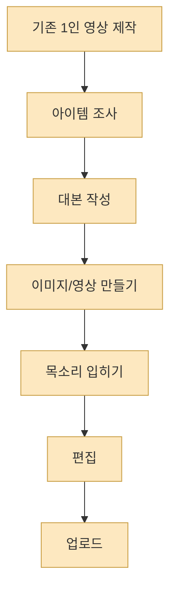
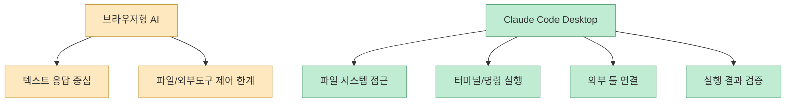
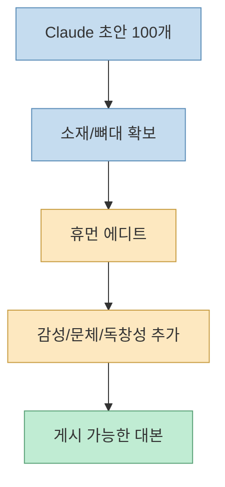
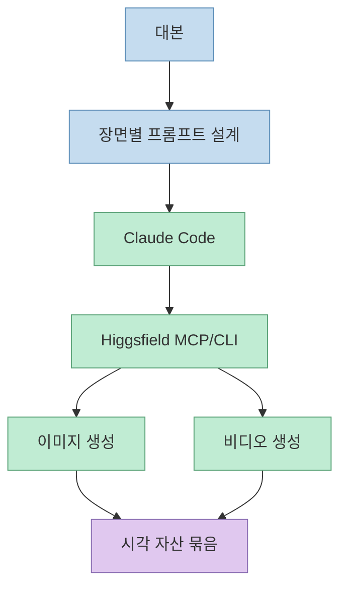
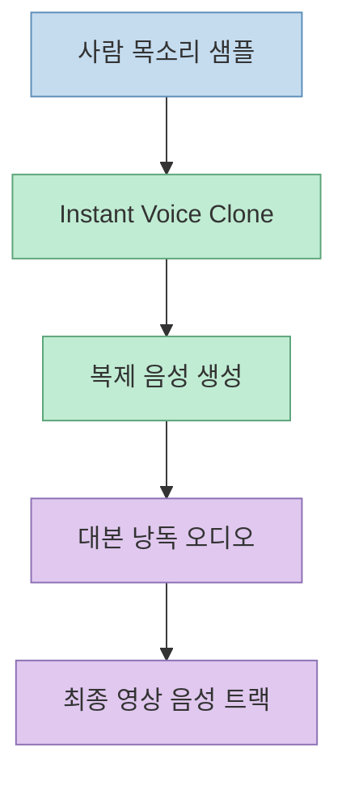
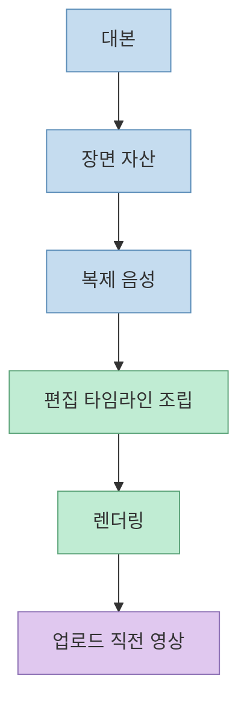

이 Shorts의 핵심은 “AI 영상 툴이 좋다”가 아닙니다. 더 정확히는, **Claude Code를 파일·도구 실행 허브로 쓰고, Higgsfield를 시각 생성 엔진으로 붙이고, 음성 복제와 편집 자동화를 이어 붙이면 한 사람이 작은 콘텐츠 팀처럼 일할 수 있다** 는 주장입니다. 영상은 이를 페이스북 수익 사례와 함께 소개하지만, 실제로 더 중요한 부분은 수익 숫자보다 **생산 파이프라인의 구조** 입니다. [영상 0:00](https://youtu.be/B0Ivhdp_8lU?t=0) [영상 설명란](https://youtu.be/B0Ivhdp_8lU?si=ASvCtnKJ55QX-mtU)

즉 이 영상은 “짧은 영상을 어떻게 많이 만들까?”가 아니라, **리서치 → 스크립트 → 비주얼 → 보이스 → 편집 → 배포 직전 산출물** 까지를 어떤 식으로 자동화 가능한 조각으로 나눌 수 있는지 보여 주는 사례에 가깝습니다.

<!--more-->

## Sources

- [YouTube Shorts - 딸깍 AI 영상 자동화](https://youtube.com/shorts/B0Ivhdp_8lU?si=ASvCtnKJ55QX-mtU)
- [Claude Code Desktop Docs](https://code.claude.com/docs/en/desktop)
- [Higgsfield 공식 사이트](https://higgsfield.ai/)
- [ElevenLabs Instant Voice Cloning Docs](https://elevenlabs.io/docs/eleven-creative/voices/voice-cloning/instant-voice-cloning)

## 1. 이 영상이 푸는 문제는 “외주 없이 짧은 영상 생산 공정을 계속 굴리는 법”이다

자막의 첫 문장은 자극적입니다. “이 남자는 콘텐츠 자동화의 천재입니다”로 시작해서, 비싼 외주 없이 Claude Code와 AI 영상 툴만으로 페이스북 수익 시스템을 만들었다고 설명합니다. [영상 0:00](https://youtu.be/B0Ivhdp_8lU?t=0)

하지만 이 영상을 그냥 “AI로 돈 벌기” 콘텐츠로만 보면 중요한 부분을 놓치게 됩니다. 실제로 영상이 설명하는 건 세 가지 자동화 공식입니다.

- 대량 스크립트 생성
- 시각 자료 자동 생성
- 보이스와 편집 자동화

[영상 0:12](https://youtu.be/B0Ivhdp_8lU?t=12) [영상 0:28](https://youtu.be/B0Ivhdp_8lU?t=28) [영상 0:45](https://youtu.be/B0Ivhdp_8lU?t=45)

영상이 흥미로운 이유는 이 선형 작업을 그대로 사람이 다 하는 대신, 각 단계를 **AI가 맡기 쉬운 조각** 으로 분리해 다시 조립하려 한다는 데 있습니다.

## 2. 1단계의 본질은 “브라우저형 AI”가 아니라 “파일과 도구를 건드릴 수 있는 실행 허브”를 갖추는 것이다

설명란은 첫 단계에서 가장 먼저 “웹 브라우저용 Claude로는 불가능하다”고 선을 긋습니다. 이유는 단순합니다. AI가 직접 파일을 만들고 외부 도구와 통신할 권한이 필요하기 때문이라는 것입니다. [영상 설명란](https://youtu.be/B0Ivhdp_8lU?si=ASvCtnKJ55QX-mtU)

이 대목은 Claude Code Desktop 공식 문서와 잘 맞습니다. 문서에 따르면 Desktop의 Code 탭은 단순 채팅이 아니라:

- 프로젝트 폴더 선택
- 파일 읽기/쓰기
- 명령 실행
- 외부 툴 연결
- 프리뷰 및 검증

이 가능한 작업 환경입니다. [Claude Code Desktop](https://code.claude.com/docs/en/desktop)

문서는 또한 Desktop이 integrated terminal, file editor, connectors, preview, diff review를 제공한다고 설명합니다. 즉 이 환경은 단순 답변창이 아니라, **에이전트가 실제 작업을 수행하는 로컬 실행면** 에 가깝습니다. [Claude Code Desktop](https://code.claude.com/docs/en/desktop)

그래서 이 영상에서 “필수 설치 3종” 중 핵심은 단순히 앱을 늘리는 게 아니라, **스크립트를 받아 실제 산출물 생성 단계로 넘길 수 있는 제어권** 을 확보하는 데 있습니다.

## 3. 2단계에서 중요한 것은 많이 뽑는 속도보다 “AI 초안 + 인간 수정”의 경계다

자막은 첫 번째 자동화 공식으로 Claude를 써서 100개의 스크립트를 5분 만에 뽑아낸다고 말합니다. 여기서 AI는 종교적 사실이나 흥미로운 이론 같은 소재를 바탕으로 짧은 대본 뼈대를 대량 생산합니다. [영상 0:12](https://youtu.be/B0Ivhdp_8lU?t=12) [영상 0:17](https://youtu.be/B0Ivhdp_8lU?t=17)

하지만 설명란은 이 지점에서 아주 중요한 단서를 붙입니다. **AI가 생성한 글을 그대로 쓰면 위험하고, 반드시 사람 손을 거쳐야 한다** 는 것입니다. 설명란은 이를 Reference 수준으로만 보고, 다음 작업을 직접 하라고 적습니다.

- 본인 스타일로 문장 다듬기
- 인간적 감성 추가
- 독창성 부여

[영상 설명란](https://youtu.be/B0Ivhdp_8lU?si=ASvCtnKJ55QX-mtU)

이 포인트는 단순 품질 문제가 아닙니다. 설명란은 이것이 콘텐츠 품질뿐 아니라 플랫폼 제재로부터 계정을 보호하는 장치라고 말합니다. 즉 자동화의 목적은 “사람을 완전히 빼는 것”이 아니라, **사람이 가장 비싼 마지막 편집 판단만 하게 만드는 것** 입니다.

이 구조를 보면, 영상이 말하는 자동화는 단순 생성량 경쟁이 아니라 **인간이 개입해야 할 정확한 위치를 뒤로 미루는 설계** 에 가깝습니다.

## 4. 3단계의 핵심은 Higgsfield를 그냥 웹앱으로 쓰는 게 아니라 Claude Code 안에서 호출 가능한 시각 생성 엔진으로 붙이는 것이다

자막의 두 번째 자동화 공식은 Claude Code와 Higgsfield 스킬을 연동해 영상을 자동 생성하라는 것입니다. 발표자는 이렇게 하면 일일이 프롬프트를 입력하지 않고도 Claude 내부에서 이미지와 영상 생성을 직접 실행할 수 있다고 말합니다. [영상 0:28](https://youtu.be/B0Ivhdp_8lU?t=28) [영상 0:34](https://youtu.be/B0Ivhdp_8lU?t=34)

Higgsfield 공식 사이트를 보면 이 설명은 현재 제품 방향과도 맞아 있습니다. 사이트는 MCP & CLI, Marketing Studio, Seedance 2.0, Canvas, AI video/image generation 같은 항목을 전면에 배치하고 있고, “Turn Claude into a creative engine” 같은 표현도 함께 사용합니다. [Higgsfield](https://higgsfield.ai/)

특히 공식 사이트는 다음 계층을 보여 줍니다.

- 이미지 생성
- 비디오 생성
- 편집 계층
- MCP/CLI 연결

[Higgsfield](https://higgsfield.ai/)

즉 영상이 말하는 “Higgsfield 스킬 이식”은 예쁜 영상을 만드는 비법이라기보다, **시각 생성기를 대본 파이프라인과 직접 연결된 함수처럼 쓰려는 시도** 로 읽는 편이 더 정확합니다.

## 5. 품질이 떨어지는 지점을 피하려면 “대본 → 장면 설계 → 이미지/영상” 순서가 필요하다

설명란은 중요한 운영 팁을 하나 넣습니다. 스크립트를 던지고 바로 이미지를 뽑으면 품질이 떨어진다고 말합니다. 대신 장면별 프롬프트를 먼저 설계하는 정밀 작업이 필요하다고 설명합니다. [영상 설명란](https://youtu.be/B0Ivhdp_8lU?si=ASvCtnKJ55QX-mtU)

이건 실제로 많은 생성형 워크플로우에서 공통적으로 드러나는 문제입니다. 긴 대본 전체를 한 번에 시각화하려 하면:

- 장면 일관성이 깨지고
- 중요한 순간이 빠지고
- 캐릭터/톤이 흔들리고
- 후반 편집이 더 어려워집니다

그래서 이 영상의 구조는 “한 번에 자동 생성”이라기보다, **장면 단위의 계획을 먼저 세운 뒤 생성 엔진에 분배하는 방식** 에 가깝습니다.

## 6. 세 번째 자동화 공식은 ‘AI 목소리’가 아니라 ‘내 목소리를 복제한 음성 레이어’다

자막의 세 번째 공식은 나만의 목소리를 복제해 편집까지 자동화하라는 것입니다. 발표자는 ElevenLabs를 활용해 자신의 목소리를 만들고, AI 성우 특유의 거부감을 줄이며 시청자 몰입도를 높여야 한다고 설명합니다. [영상 0:45](https://youtu.be/B0Ivhdp_8lU?t=45) [영상 0:49](https://youtu.be/B0Ivhdp_8lU?t=49)

ElevenLabs 공식 문서 기준으로 Instant Voice Cloning은 대시보드에서:

1. Instant Voice Clone 선택  
2. 오디오 업로드 또는 녹음  
3. 음성 세부정보 확인 및 저장  
4. 복제 음성 사용

흐름으로 진행됩니다. 또한 최소 1분 이상의 오디오를 권장하고, 3분을 넘겨도 개선 폭이 크지 않을 수 있다고 안내합니다. [ElevenLabs Docs](https://elevenlabs.io/docs/eleven-creative/voices/voice-cloning/instant-voice-cloning)

문서는 또, 저장 전에 해당 음성을 복제할 권리와 동의가 있음을 확인하라고 명시합니다. [ElevenLabs Docs](https://elevenlabs.io/docs/eleven-creative/voices/voice-cloning/instant-voice-cloning)

따라서 이 레이어의 목적은 “더 그럴듯한 TTS”가 아니라, **채널의 정체성과 일관된 화자 톤을 자동화 속에서도 유지하는 것** 입니다.

## 7. 마지막 단계는 편집기를 없애는 게 아니라 편집기를 ‘명령 실행 대상’으로 바꾸는 것이다

자막은 마지막에 DaVinci Resolve와 Claude를 연결해, 렌더링 버튼 하나로 최종 영상이 나오게 만들면 1인 미디어 공장이 완성된다고 말합니다. [영상 0:55](https://youtu.be/B0Ivhdp_8lU?t=55)

여기서 중요한 건 “편집이 필요 없어졌다”가 아닙니다. 오히려 편집기 자체를 사람이 수동으로 조작하는 도구에서, **에이전트가 명령을 내려 반복 작업을 줄이는 대상** 으로 바꾸겠다는 발상입니다.

즉 구조는 이렇게 읽을 수 있습니다.

이 단계까지 오면 영상이 말하는 “1인 미디어 공장”의 의미가 분명해집니다. 사람 한 명이 전부 손으로 만드는 것이 아니라, **기획 승인과 최종 판단만 사람이 맡고 나머지는 연결된 도구 체인이 밀어 주는 구조** 라는 뜻입니다.

## 8. 이 영상의 숨은 메시지는 플랫폼보다 ‘제작 체인’이 더 중요하다는 점이다

설명란은 페이스북 페이지의 수익 인증과 AI 콘텐츠에 상대적으로 관대한 분위기를 언급합니다. 하지만 여기서 더 중요한 건 특정 플랫폼의 정책 변화 자체보다, **플랫폼이 바뀌어도 재사용할 수 있는 제작 체인** 을 만드는 것입니다. [영상 설명란](https://youtu.be/B0Ivhdp_8lU?si=ASvCtnKJ55QX-mtU)

자막 기준으로도 구조는 충분히 일반화 가능합니다.

- Claude로 대량 스크립트 생성
- Higgsfield로 장면 생성
- 음성 복제로 채널 톤 통일
- 편집 자동화로 최종 산출

이 체인은 페이스북뿐 아니라 Shorts, Reels, 기타 숏폼 플랫폼에도 재활용될 수 있습니다. 그래서 영상의 핵심 가치는 “페이스북에서 돈 번다”보다, **콘텐츠를 반복 생산하는 내부 공정이 도구 체인으로 묶였다는 점** 에 있습니다.

## 핵심 요약

- 이 Shorts는 수익 자랑보다도 **짧은 영상 생산 파이프라인을 AI 도구 체인으로 재조립하는 방법** 을 보여 줍니다. 
- 첫 단계의 핵심은 브라우저형 AI가 아니라 파일과 외부 도구를 직접 다룰 수 있는 **Claude Code Desktop** 같은 실행 허브를 갖추는 것입니다. 
- 스크립트 생성에서는 AI 초안을 대량 생산하되, 사람 손으로 문체와 감성을 보정하는 경계를 분명히 둡니다. 
- Higgsfield는 단순 생성 앱이 아니라 MCP/CLI로 연결된 **시각 생성 엔진** 역할을 맡습니다. 
- ElevenLabs 음성 복제와 편집 자동화까지 붙이면, 사람은 최종 판단만 하고 나머지는 연결된 공정이 밀어 주는 구조가 됩니다.

## 결론

이 영상이 말하는 “딸깍 AI 영상 자동화”는 실제로는 버튼 하나의 마법이 아닙니다. 오히려 여러 단계를 **분해하고, 각 단계를 AI가 맡기 쉬운 작업으로 바꾸고, 다시 하나의 체인으로 엮는 설계 작업** 에 가깝습니다.

그래서 진짜 포인트는 어느 플랫폼에서 얼마를 벌었느냐보다, **내 컴퓨터 안에 작은 콘텐츠 팀을 어떻게 구성할 것인가** 입니다. Claude Code는 그 팀의 운영체제, Higgsfield는 시각팀, 음성 복제는 내레이터, 편집 자동화는 후반 작업팀처럼 작동합니다. 결국 자동화의 본질은 한 번의 생성이 아니라, **반복 가능한 제작 체인** 을 갖는 데 있습니다.
