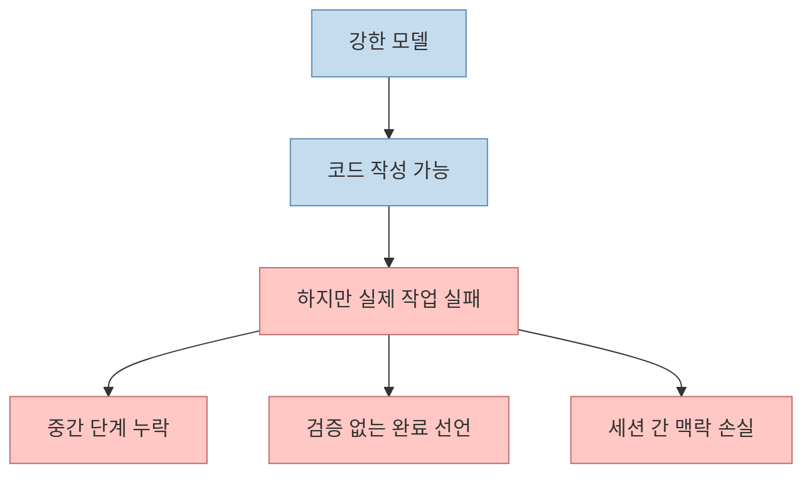
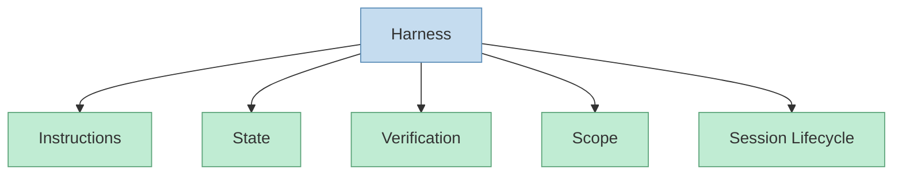
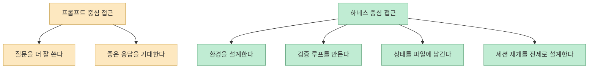
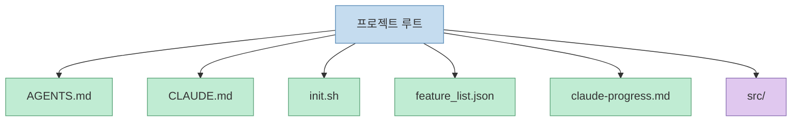
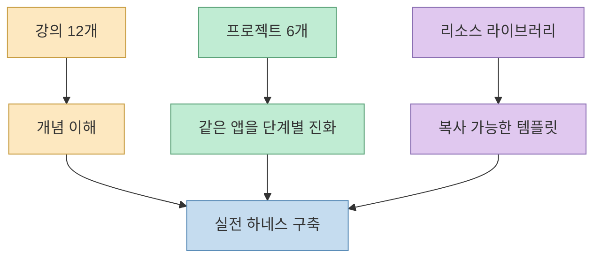

`walkinglabs/learn-harness-engineering` 저장소를 처음 보면 “하네스 엔지니어링 입문 코스” 정도로 보일 수 있습니다. 하지만 README를 자세히 읽어 보면 이 저장소의 포인트는 단순한 개념 설명이나 프롬프트 팁이 아닙니다. 핵심은 **AI 코딩 에이전트를 둘러싼 작업환경 전체를 설계하는 법** 을 강의·프로젝트·템플릿 세 층으로 가르친다는 데 있습니다. [README](https://raw.githubusercontent.com/walkinglabs/learn-harness-engineering/main/README.md)

즉 이 저장소는 “좋은 모델을 쓰면 된다”가 아니라, **같은 모델도 어떤 환경 안에 넣느냐에 따라 실패하는 에이전트가 되고, 끝까지 완수하는 에이전트가 되기도 한다** 는 관점을 교육 코스로 바꾼 사례에 가깝습니다.

<!--more-->

## Sources

- [GitHub - walkinglabs/learn-harness-engineering](https://github.com/walkinglabs/learn-harness-engineering)
- [README.md](https://raw.githubusercontent.com/walkinglabs/learn-harness-engineering/main/README.md)
- [ROADMAP.md](https://raw.githubusercontent.com/walkinglabs/learn-harness-engineering/main/ROADMAP.md)
- [CLAUDE.md](https://raw.githubusercontent.com/walkinglabs/learn-harness-engineering/main/CLAUDE.md)

## 1. 이 저장소는 “모델이 똑똑해도 하네스 없으면 실패한다”는 문제의식에서 출발한다

README는 아주 강한 문장으로 시작합니다. 세상에서 가장 강한 모델도 적절한 환경 없이 실제 엔지니어링 작업에 들어가면 실패한다는 것입니다. 저장소는 이 문제를 **model problem** 이 아니라 **harness problem** 으로 봅니다. [README](https://raw.githubusercontent.com/walkinglabs/learn-harness-engineering/main/README.md)

문서가 말하는 실패 패턴은 익숙합니다.

- 파일을 읽고 쓰다가 중간 단계를 건너뜸
- 테스트를 깨뜨림
- 실제로는 안 되는데 “done”이라고 선언
- 다음 세션에서 이전 상태를 잊음

즉 저장소가 다루는 문제는 “코드를 못 쓴다”가 아닙니다. **여러 단계와 여러 세션을 거치는 실제 작업을 안정적으로 끝내지 못한다** 는 쪽입니다.

그래서 이 코스는 모델 사용법보다, **모델이 들어가는 실행 환경의 품질** 을 먼저 가르치려 합니다.

## 2. 저장소가 정의하는 하네스는 프롬프트가 아니라 5개 서브시스템이다

README는 하네스를 하나의 긴 지시문으로 보지 않습니다. 대신 다섯 개의 하위 시스템으로 분리합니다.

- Instructions
- State
- Verification
- Scope
- Session Lifecycle

[README](https://raw.githubusercontent.com/walkinglabs/learn-harness-engineering/main/README.md)

문서는 각 항목의 역할도 분명히 나눕니다.

- **Instructions**: 무엇을 어떤 순서로 읽고 시작할지
- **State**: 무엇을 했고, 무엇이 진행 중이며, 다음이 무엇인지
- **Verification**: 테스트, 린트, 타입체크, 스모크런 같은 실행 증거
- **Scope**: 한 번에 한 기능만 다루도록 제한
- **Session Lifecycle**: 시작 시 초기화, 종료 시 정리, 다음 세션 재시작 경로 보장

이 정의가 중요한 이유는, 많은 저장소가 하네스를 사실상 `AGENTS.md` 한 장으로 이해하는 반면, 이 코스는 처음부터 **문서·상태·검증·운영 순서** 를 분리해서 보게 만들기 때문입니다.

## 3. 그래서 이 코스의 관심사는 “프롬프트 엔지니어링”보다 “시스템 엔지니어링”에 가깝다

README는 하네스 엔지니어링이 더 좋은 프롬프트를 쓰는 것이 아니라, **모델이 작동하는 시스템을 설계하는 일** 이라고 못 박습니다. [README](https://raw.githubusercontent.com/walkinglabs/learn-harness-engineering/main/README.md)

이 차이는 실무에서 꽤 큽니다.

이 저장소는 에이전트의 신뢰성을 “더 똑똑한 답변”이 아니라 **더 나은 운영 구조** 로 끌어올리려 합니다. 그래서 저장소 전체가 하나의 규칙 파일보다 **작업장 설계서** 에 더 가깝게 느껴집니다.

## 4. 빠른 시작조차 “파일 세트”를 프로젝트에 넣는 방식이다

이 코스가 흥미로운 이유는 빠른 시작 가이드에서도 드러납니다. README는 모든 강의를 보기 전에 바로 가치를 얻을 수 있다며, 프로젝트 루트에 다음 파일들을 두라고 합니다.

- `AGENTS.md`
- `CLAUDE.md`
- `init.sh`
- `feature_list.json`
- `claude-progress.md`

[README](https://raw.githubusercontent.com/walkinglabs/learn-harness-engineering/main/README.md)

즉 빠른 시작의 본질은 “이 프롬프트를 써라”가 아닙니다. 오히려 **에이전트가 읽을 작업환경 파일 세트를 레포에 심어라** 에 가깝습니다.

이 구조는 “프롬프트를 매번 새로 짠다”보다, **저장소가 세션 간 공용 운영체제가 된다** 는 쪽에 가깝습니다.

## 5. 커리큘럼 설계도 프로젝트형이다: 12강 + 6프로젝트 + 리소스 라이브러리

README에 따르면 이 코스는 세 부분으로 구성됩니다.

- 12개 강의
- 6개 실습 프로젝트
- 템플릿 중심 리소스 라이브러리

[README](https://raw.githubusercontent.com/walkinglabs/learn-harness-engineering/main/README.md)

특히 흥미로운 점은, 여섯 개 프로젝트가 모두 같은 제품을 점진적으로 진화시키는 구조라는 것입니다. 문서는 Electron 기반 personal knowledge base desktop app을 공통 캡스톤으로 사용하며, 각 프로젝트의 starter/solution이 다음 단계의 출발점이 된다고 설명합니다. [README](https://raw.githubusercontent.com/walkinglabs/learn-harness-engineering/main/README.md)

즉 이 저장소는 이론만 읽게 하지 않고, **같은 제품이 여러 하네스 레벨을 거치며 어떻게 더 안정적인 에이전트 작업장이 되는지** 체험하게 설계되어 있습니다.

## 6. 학습 경로가 곧 하네스 성숙도 모델처럼 보인다

README의 Learning Path도 단순 목차가 아닙니다. 강의 순서가 사실상 **하네스 성숙도 단계** 처럼 짜여 있습니다.

- Phase 1: 문제 보기
- Phase 2: 레포 구조화
- Phase 3: 세션 연결
- Phase 4: 피드백과 스코프
- Phase 5: 검증
- Phase 6: 전체 통합

[README](https://raw.githubusercontent.com/walkinglabs/learn-harness-engineering/main/README.md)

이 순서는 꽤 설득력이 있습니다. 실제 현업에서도 에이전트 도입이 실패하는 순서는 비슷하기 때문입니다.

1. 처음엔 잘되는 것처럼 보인다  
2. 저장소 구조가 뒤엉킨다  
3. 다음 세션에서 맥락을 잃는다  
4. 범위를 넘는다  
5. 검증 없이 끝났다고 한다  
6. 마지막엔 사람이 구조를 다시 만들게 된다

이 코스는 그 반대로 가르칩니다. 즉 “툴을 쓰는 법”보다 **실패 순서를 역으로 뒤집는 법** 을 가르친다고 볼 수 있습니다.

## 7. `skills/harness-creator`가 중요한 이유는 이 코스가 교재를 넘어 배포 가능한 실무 자산으로 이어지기 때문이다

README는 빠른 시작용으로 `skills/harness-creator/`를 직접 지목합니다. 이 스킬은 AGENTS.md, feature lists, init.sh, verification workflows 같은 production-grade harness를 몇 분 안에 scaffold할 수 있다고 소개됩니다. [README](https://raw.githubusercontent.com/walkinglabs/learn-harness-engineering/main/README.md)

이 점이 흥미로운 이유는, 코스가 단순 학습 문서에서 끝나지 않고 **실제 레포에 바로 주입할 수 있는 실행 자산** 으로 이어지기 때문입니다.

즉 이 저장소의 결과물은 지식만이 아닙니다.

- 읽을 강의
- 따라 할 프로젝트
- 복사할 템플릿
- 직접 생성할 스킬

까지 연결되어 있습니다.

## 8. 최신 규모를 보면 “입문 튜토리얼” 이상의 레퍼런스 저장소로 자리 잡는 중이다

GitHub 메타데이터 기준으로, 2026년 6월 15일 확인 시점에 이 저장소는:

- 스타 8,522개
- 포크 894개
- 기본 브랜치 `main`
- 설명: `Harness engineering beginner tutorial, from 0 to 1`

상태였습니다.

또한 저장소는 2026년 3월 29일 생성되었고, 2026년 6월 13일에도 푸시가 이어졌습니다. 즉 아주 짧은 기간 안에 빠르게 커진 셈입니다.

이 성장 속도는 하네스 엔지니어링이 단순한 유행어가 아니라, **에이전트 실무에서 반복적으로 부딪히는 운영 문제를 설명하는 공통 언어** 로 자리 잡고 있다는 신호로도 읽을 수 있습니다.

## 핵심 요약

- `learn-harness-engineering`는 프롬프트 팁 모음이 아니라 **에이전트 작업환경 설계 코스** 에 가깝습니다. 
- 이 저장소가 말하는 하네스는 `Instructions`, `State`, `Verification`, `Scope`, `Session Lifecycle` 다섯 서브시스템으로 나뉩니다. 
- 빠른 시작조차 프롬프트가 아니라 `AGENTS.md`, `CLAUDE.md`, `init.sh`, `feature_list.json`, `claude-progress.md` 같은 파일 세트를 프로젝트에 심는 구조입니다. 
- 12개 강의, 6개 프로젝트, 리소스 라이브러리를 같은 캡스톤 앱 위에 쌓아 가며 하네스 성숙도를 체험하게 만듭니다. 
- 2026년 6월 15일 기준 스타 8,522개 규모로, 입문 튜토리얼을 넘어 실무 레퍼런스 저장소처럼 성장하는 중입니다.

## 결론

이 저장소가 흥미로운 이유는 “하네스를 잘 짜라”는 추상적 구호를 실제 교육 구조로 바꿨기 때문입니다. 강의는 왜 필요한지 설명하고, 프로젝트는 어디서 실패하는지 체감하게 만들고, 템플릿과 스킬은 그 실패를 실제 레포에서 줄이게 해 줍니다.

결국 `learn-harness-engineering`가 가르치는 것은 모델을 더 똑똑하게 만드는 법이 아니라, **모델이 들어가도 무너지지 않는 작업장을 만드는 법** 입니다. 그래서 이 저장소는 프롬프트 강의보다도, 에이전트 시대의 **소프트웨어 작업환경 교과서** 에 더 가깝게 느껴집니다.
