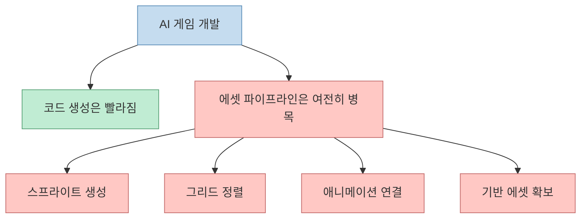
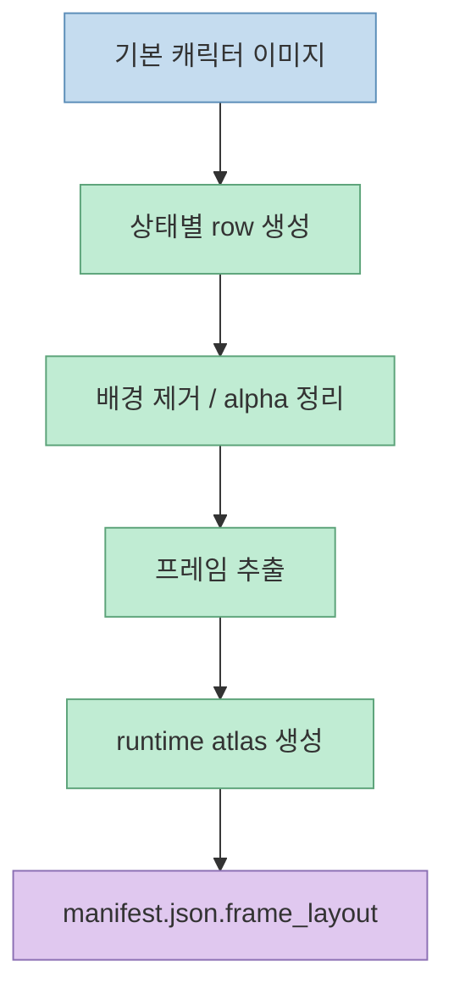
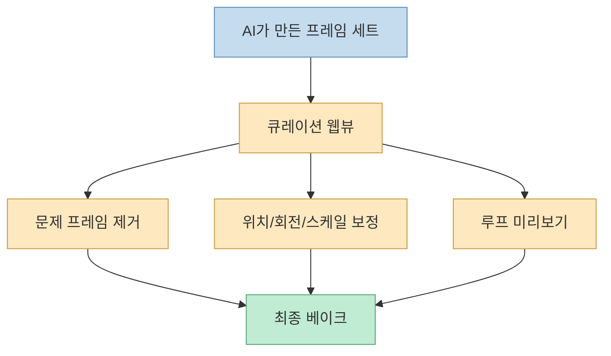
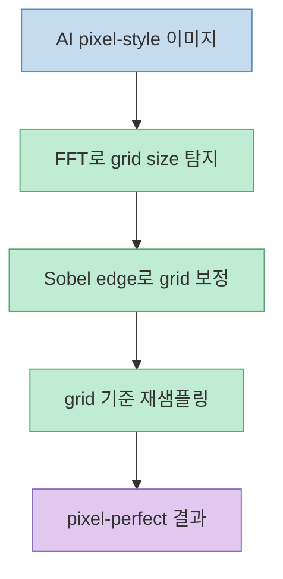
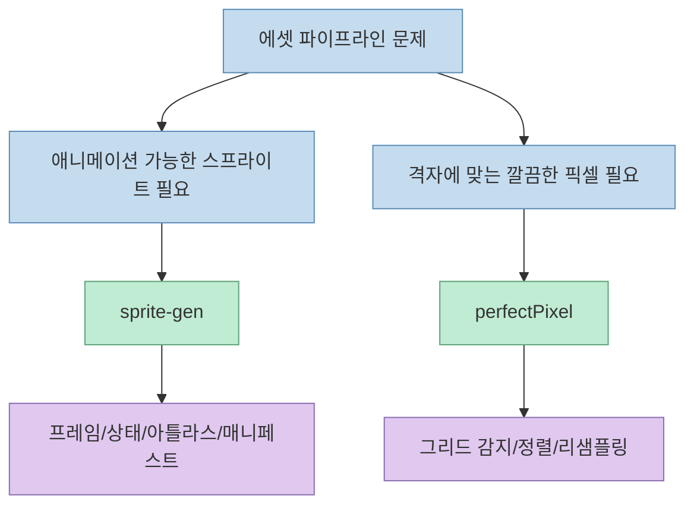
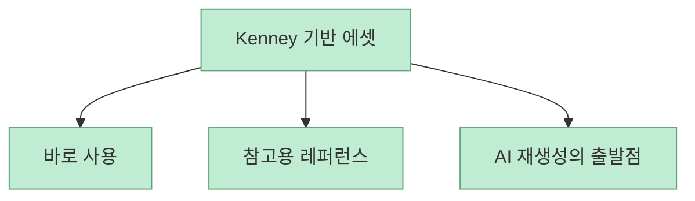
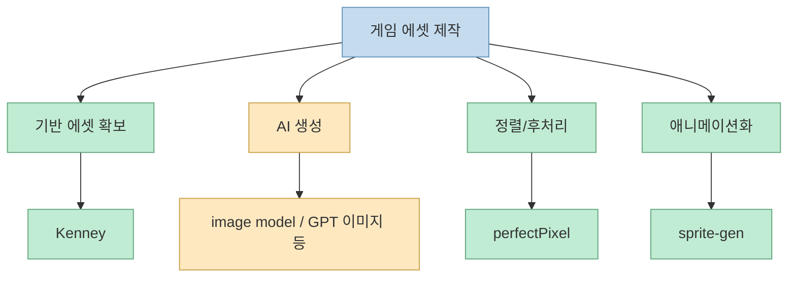

이 Shorts가 재밌는 이유는 “요즘 AI로 게임 쉽게 만든다”는 말을 그대로 반복하지 않는다는 데 있습니다. 오히려 반대로, **코드는 빨라졌는데 에셋은 여전히 어렵다** 는 현실을 짚습니다. 자막 초반부터 최근 Fable 5 같은 모델 덕분에 프롬프트 한 번으로 돌아가는 게임을 구현하는 모습도 보이지만, 실제 게임 제작에서 늘 막히는 건 에셋이라고 말합니다. [영상 0:00](https://www.youtube.com/watch?v=MOcUPkbjzDI&t=0) [영상 0:09](https://www.youtube.com/watch?v=MOcUPkbjzDI&t=9)

이 영상이 소개하는 `sprite-gen`, `perfectPixel`, `Kenney`는 각각 다른 층의 문제를 푸는 도구입니다. 하나는 **생성**, 하나는 **정렬과 후처리**, 하나는 **처음부터 쓸 수 있는 기반 에셋** 에 가깝습니다. 세 개를 함께 보면 “AI 게임 개발”의 병목이 단순히 모델 성능이 아니라 **에셋 파이프라인의 품질** 이라는 점이 더 잘 보입니다.

<!--more-->

## Sources

- [YouTube Shorts - 게임 제작할 때 이런 것들 한번 써보세요! sprite-gen, perfectPixel, kenney](https://www.youtube.com/shorts/MOcUPkbjzDI)
- [GitHub - aldegad/sprite-gen](https://github.com/aldegad/sprite-gen)
- [GitHub - theamusing/perfectPixel](https://github.com/theamusing/perfectPixel)
- [Kenney Assets](https://kenney.nl/assets)
- [Kenney Support - licensing](https://kenney.nl/support)

## 1. AI 게임 개발의 진짜 병목은 코드가 아니라 “움직이는 에셋”이다

자막은 최근 Fable 5가 나와 프롬프트 한 방에 돌아가는 게임을 구현하는 모습도 봤지만, 게임을 만들 때 가장 고민되는 건 에셋이라고 말합니다. 특히 2D 게임에서는 움직이는 캐릭터, 도트 느낌 이미지, 스프라이트가 중요하다고 짚습니다. [영상 0:03](https://www.youtube.com/watch?v=MOcUPkbjzDI&t=3) [영상 0:15](https://www.youtube.com/watch?v=MOcUPkbjzDI&t=15)

이건 꽤 정확한 지적입니다. AI 코드 생성은:

- 게임 루프
- 상태 관리
- 입력 처리
- UI 연결

같은 부분을 많이 가속하지만, 플레이어가 실제로 보는 결과는 결국 **일관된 시각 자산과 애니메이션** 위에서 결정됩니다. 특히 2D 게임에서는 캐릭터가 한 프레임씩 자연스럽게 이어지고, 투명 배경이 깨끗하며, 그리드가 맞고, 아이소메트릭이면 바닥 축도 맞아야 합니다.

즉 이 Shorts는 “AI로 게임 만든다”를 보여 주는 영상이 아니라, **AI가 코드는 해결해도 에셋 공정은 별도 전략이 필요하다** 는 걸 알려 주는 짧은 안내문에 가깝습니다.

## 2. `sprite-gen`은 “AI에게 스프라이트 시트를 시키면 왜 망가지는가”를 정면으로 푸는 도구다

자막은 첫 번째 도구로 `sprite-gen`을 소개하면서, 그냥 AI에게 스프라이트를 만들어 보라고 하면 실제 애니메이션으로 만들었을 때 잘 안 되는 경우가 많다고 설명합니다. 움직임이 매끄럽게 이어져야 하는데 AI가 만든 프레임은 이상한 경우가 많기 때문입니다. [영상 0:25](https://www.youtube.com/watch?v=MOcUPkbjzDI&t=25) [영상 0:32](https://www.youtube.com/watch?v=MOcUPkbjzDI&t=32)

`sprite-gen` README는 이 문제를 더 노골적으로 설명합니다. 이미지 모델에게 “sprite sheet”를 요청하면 프레임마다 얼굴이 바뀌고, 배경이 남고, 포즈가 겹치고, 엔진이 바로 쓸 수 없는 PNG가 나온다고 말합니다. 그리고 이 저장소는 그 간극을 메우기 위해:

- row 단위 생성
- 캐릭터 정체성 고정
- chroma background 제거
- pose별 clean transparent frame 추출
- runtime atlas + machine-readable manifest 생성

을 제공한다고 설명합니다. [sprite-gen README](https://github.com/aldegad/sprite-gen)

즉 `sprite-gen`은 “스프라이트를 더 예쁘게 만들어 주는 AI”가 아니라, **생성 모델의 불안정한 출력을 게임 엔진이 쓸 수 있는 스프라이트 자산으로 바꾸는 파이프라인** 에 가깝습니다.

## 3. 이 도구의 진짜 포인트는 생성보다도 “큐레이션 웹뷰”에 있다

ZeroCho가 영상에서 말하는 핵심 중 하나는 이런 라이브러리들이 후처리까지 진행해서 훨씬 더 자연스럽게 나온다는 점입니다. [영상 1:07](https://www.youtube.com/watch?v=MOcUPkbjzDI&t=67)

`sprite-gen` README도 비슷한 메시지를 더 상세히 적습니다. 생성이 90%를 만들어 주더라도 마지막 10%는 사람의 큐레이션이 필요하고, 이를 위해 웹뷰에서:

- 프레임 비교
- 개별 프레임 선택/거절
- 비파괴적 이동/회전/스케일/시어 조정
- 라이브 루프 미리보기

를 제공한다고 설명합니다. [sprite-gen README](https://github.com/aldegad/sprite-gen)

이 구조는 중요한 함의를 갖습니다. 결국 게임 에셋 생성에서 문제는 “AI가 만들어 주느냐”보다, **AI가 만든 것을 인간이 빠르게 고를 수 있느냐** 입니다. `sprite-gen`은 생성기를 넘어, 그 고르는 시간을 줄이는 품질 관리 레이어까지 포함하고 있습니다.

## 4. `perfectPixel`은 생성이 아니라 “정렬” 문제를 푼다

영상의 두 번째 도구 `perfectPixel`은 도트 애니메이션을 어색함 없이 만들어 준다고 설명됩니다. 직접 만들어 보면 왜 이런 라이브러리가 존재하는지 알 수 있다고 말하면서, 특히 후처리 덕분에 더 자연스럽게 나온다고 강조합니다. [영상 0:51](https://www.youtube.com/watch?v=MOcUPkbjzDI&t=51) [영상 1:09](https://www.youtube.com/watch?v=MOcUPkbjzDI&t=69)

공식 README는 이 도구의 초점을 더 분명히 말합니다. AI가 만든 픽셀 스타일 이미지는 셀 크기가 들쭉날쭉하고, 그리드가 비정사각형이거나 흔들려서 일반 스케일링으로는 샘플링이 잘 안 된다고 설명합니다. `perfectPixel`은:

- 자동 grid size 감지
- 그리드 정렬
- aligned pixel-perfect 결과 생성

을 제공한다고 말합니다. [perfectPixel README](https://github.com/theamusing/perfectPixel)

또한 알고리즘 설명도 공개되어 있습니다.

1. FFT magnitude로 grid size 탐지  
2. Sobel edge로 그리드를 edge에 맞게 refinement  
3. 그리드 기준으로 원본 샘플링

[perfectPixel README](https://github.com/theamusing/perfectPixel)

즉 `perfectPixel`은 생성 모델을 대체하지 않습니다. 대신 **생성 모델이 뿌린 픽셀을 실제 격자 위로 다시 앉히는 정렬기** 라고 보는 편이 맞습니다.

## 5. `sprite-gen`과 `perfectPixel`은 비슷해 보여도 푸는 문제가 다르다

짧은 영상만 보면 둘 다 “게임용 픽셀아트 보정 도구”처럼 보이지만, 실제 역할은 다릅니다.

- `sprite-gen`은 **캐릭터를 움직이는 프레임 자산** 으로 만드는 문제를 푼다
- `perfectPixel`은 **이미 픽셀 스타일인 이미지를 격자에 맞게 정돈하는 문제** 를 푼다

그래서 이 둘은 경쟁 관계라기보다, 경우에 따라 **연결해서 쓰는 연속 공정** 으로 보는 편이 더 자연스럽습니다.

## 6. `Kenney`는 “AI가 만들기 전에 쓸 수 있는 기반 에셋”이라는 세 번째 해법이다

영상 마지막에서는 그냥 기반 에셋 하나로 `Kenney`를 소개합니다. 미니맵, 3D/2D, 타워 디펜스, 자동차, 텍스처 팩 등 무료 팩이 많고, 이런 기반 팩이 있으면 GPT 이미지 등에 “이걸 기반으로 45도 돌려 줘” 같은 식으로 재창조할 수 있다고 설명합니다. [영상 1:17](https://www.youtube.com/watch?v=MOcUPkbjzDI&t=77) [영상 1:26](https://www.youtube.com/watch?v=MOcUPkbjzDI&t=86)

공식 Kenney 자산 페이지를 보면 실제로:

- 2D
- 3D
- UI
- Audio
- Pixel
- Textures

카테고리로 나뉜 대규모 무료 에셋 라이브러리가 있고, `Factory Kit`, `Input Prompts`, `Car Kit`, `Platformer Kit`, `Retro Textures Fantasy` 같은 팩이 공개돼 있습니다. [Kenney Assets](https://kenney.nl/assets)

또한 지원 페이지는 asset pages의 게임 에셋이 **CC0(public domain)** 라이선스라고 설명합니다. [Kenney Support](https://kenney.nl/support)

이게 중요한 이유는, 모든 것을 AI로 처음부터 생성하려 하지 않아도 되기 때문입니다. 특히 게임 에셋에서는 **기반 팩 → 수정 → 조합 → 일부 AI 보강** 이 오히려 더 빠르고 안정적인 경우가 많습니다.

## 7. 그래서 이 세 도구는 “생성-정렬-기반 에셋”의 세 층을 이룬다

이 Shorts가 은근히 좋은 이유는 세 도구가 서로 다른 층을 채운다는 점입니다.

이 구조를 보면 왜 ZeroCho가 “이런 라이브러리들이 왜 존재하는지 직접 해 보면 안다”고 말했는지가 분명해집니다. [영상 1:01](https://www.youtube.com/watch?v=MOcUPkbjzDI&t=61)

AI 모델은 멋진 한 장 이미지를 잘 만들 수 있습니다. 하지만 게임 개발자는 한 장 그림이 아니라:

- 프레임 간 일관성
- 투명 배경
- 엔진이 읽을 수 있는 atlas
- 그리드 정렬
- 재사용 가능한 기본 팩

이 필요합니다. 즉 게임 에셋 문제는 “이미지 생성”보다 훨씬 더 생산공학적인 문제입니다.

## 핵심 요약

- 이 Shorts는 AI 게임 개발의 진짜 병목이 **코드가 아니라 에셋 파이프라인** 임을 짚습니다. 
- `sprite-gen`은 불안정한 생성 이미지를 게임 엔진이 쓸 수 있는 스프라이트 아틀라스와 매니페스트로 바꾸는 도구입니다. 
- `perfectPixel`은 AI 픽셀 이미지의 흔들린 그리드를 자동 탐지·보정해 픽셀 퍼펙트 결과를 만드는 정렬 도구입니다. 
- `Kenney`는 공짜로 쓸 수 있는 기반 에셋 라이브러리이자, AI 재생성의 레퍼런스 출발점 역할을 합니다. 
- 세 도구를 함께 보면, AI 게임 개발은 모델 성능 문제가 아니라 **생성·정렬·기반 에셋 확보를 잇는 공정 설계 문제** 로 보입니다.

## 결론

Fable 5 같은 모델이 게임 코드를 빠르게 짜 주는 시대에도, 완성도 있는 게임을 만드는 데서 가장 고통스러운 부분은 여전히 에셋일 수 있습니다. 그리고 이 영상이 좋은 이유는 그 문제를 막연한 불평이 아니라, **세 가지 다른 층의 도구** 로 나눠 보여 주기 때문입니다.

결국 게임 제작에서 중요한 건 “AI가 얼마나 멋진 그림을 만들 수 있나”보다, **그 그림을 실제 플레이 가능한 자산으로 어떻게 바꿀 것인가** 입니다. `sprite-gen`, `perfectPixel`, `Kenney`는 바로 그 간극을 메우는 서로 다른 해법들입니다.
