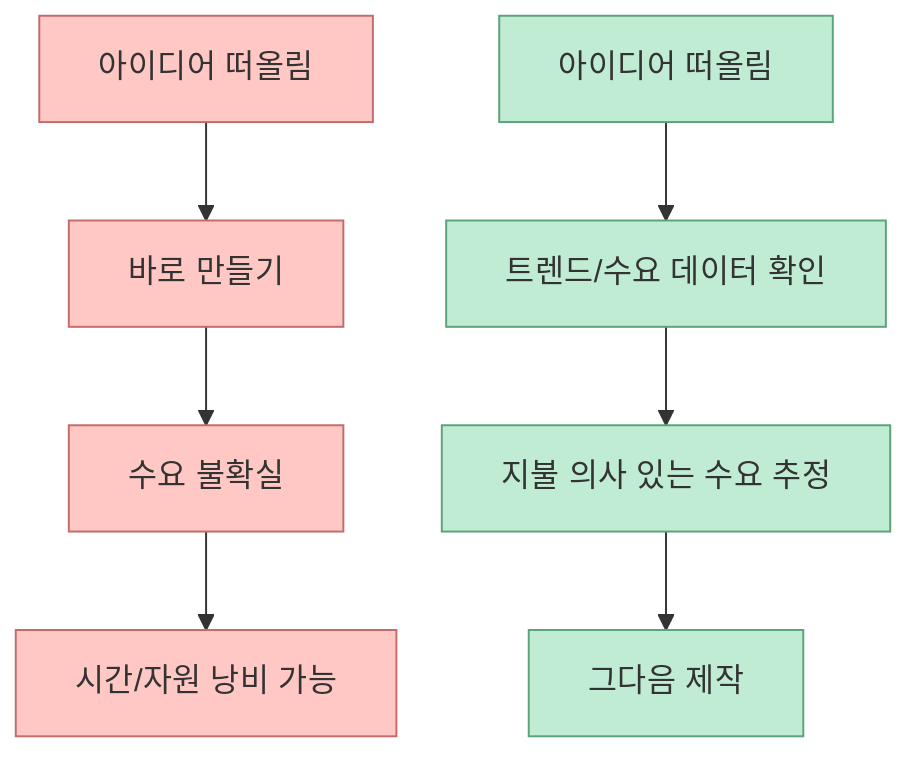
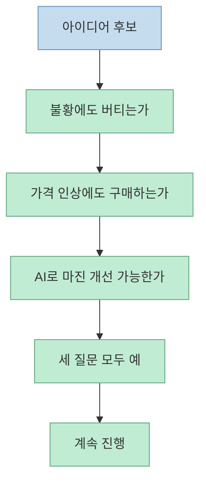
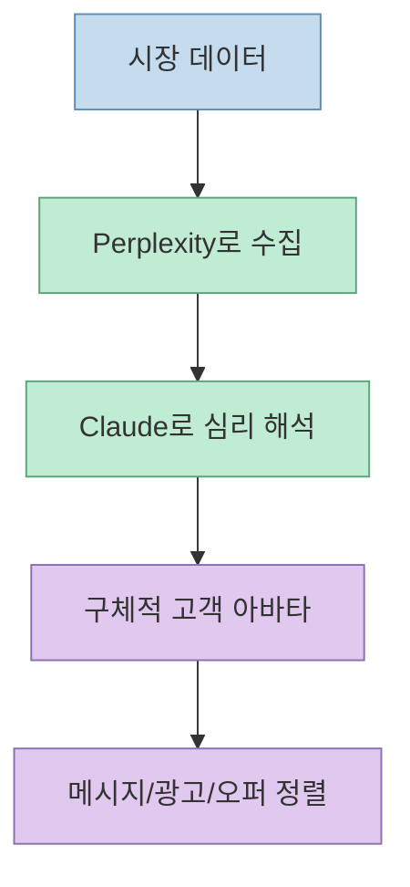
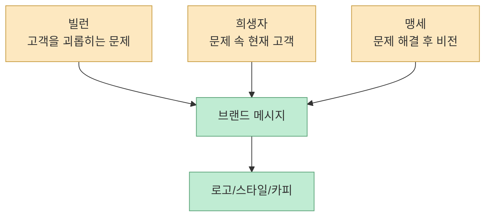
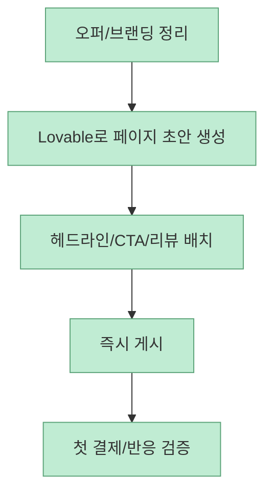
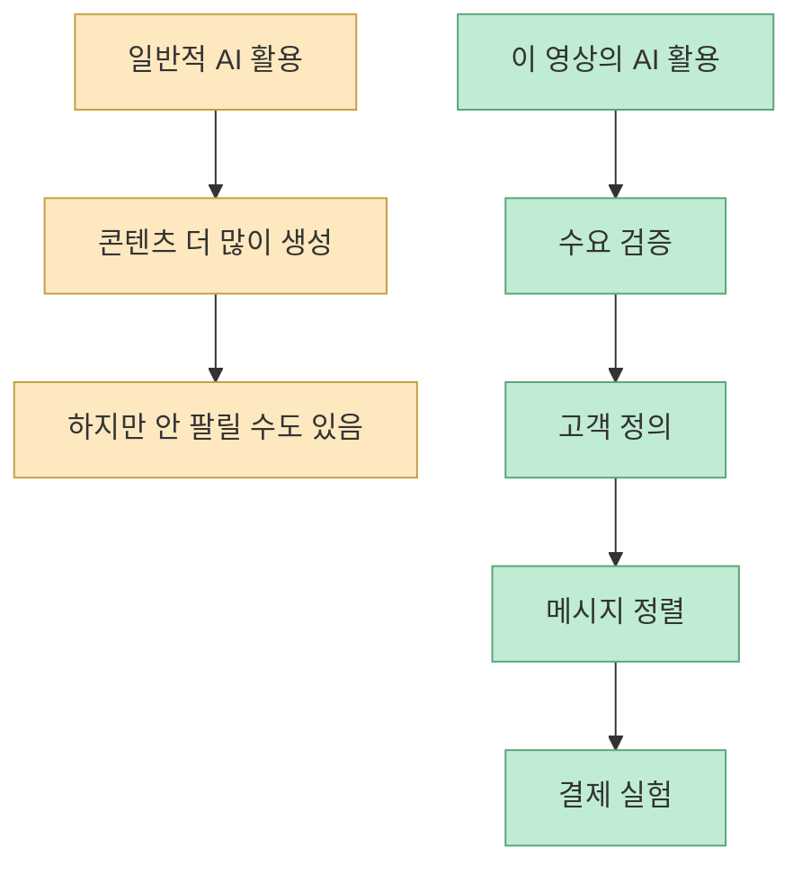

이 Shorts는 “AI로 돈 버는 법”을 말하는 것처럼 보이지만, 실제로는 **아이디어를 사업으로 바꾸는 검증 순서** 에 더 가깝습니다. 자막은 Cody Sanchez가 500개 이상의 AI 도구를 분석한 끝에, 평범한 아이디어를 돈이 되는 비즈니스로 바꾸는 공식을 정리했다고 소개합니다. [영상 0:00](https://www.youtube.com/watch?v=hJZFgjr3z0I&t=0)

중요한 점은 이 영상이 AI를 단순 글쓰기 도구로 다루지 않는다는 것입니다. 공개 설명란도 AI를 시장 데이터 분석, 고객 심리 추론, 브랜딩까지 맡기는 전략 파트너처럼 써야 한다고 강조합니다. 즉 핵심은 “무엇을 만들까”보다 **무엇을 만들면 누가 돈을 낼지를 먼저 증명하는 과정** 입니다. [영상 설명란](https://youtube.com/shorts/hJZFgjr3z0I?si=BaL4rPKmzBpRna04)

<!--more-->

## Sources

- [YouTube Shorts - 6단계 돈버는 AI 활용법](https://youtube.com/shorts/hJZFgjr3z0I?si=BaL4rPKmzBpRna04)
- [Exploding Topics](https://explodingtopics.com/)
- [Perplexity AI](https://www.perplexity.ai/)
- [Lovable - Small Business Website Builder](https://lovable.dev/solutions/use-case/small-business-website)

## 1. 이 Shorts의 요지는 “무작정 만들지 말고 수요부터 증명하라”는 것이다

자막의 첫 번째 조언은 아주 분명합니다. 숨겨진 수요를 먼저 데이터로 찾아야 한다는 것입니다. 감이 아니라 `Exploding Topics` 같은 트렌드 분석기를 써서, 사람들이 지금 당장 돈을 쓰고 싶어 하는 제품을 데이터로 증명해야 한다고 말합니다. [영상 0:11](https://www.youtube.com/watch?v=hJZFgjr3z0I&t=11)

공식 `Exploding Topics` 사이트도 이 툴을 “Discover trends 12+ months before everyone else”라고 소개합니다. 또한 자사의 알고리즘이 수백만 개의 비정형 데이터 포인트를 모니터링해 초기 트렌드를 잡는다고 설명합니다. [Exploding Topics](https://explodingtopics.com/)

즉 이 단계의 핵심은 AI가 아이디어를 “발명”하는 것이 아니라, **이미 움직이고 있는 수요를 빨리 포착하는 것** 입니다.

이 영상은 AI의 첫 역할을 생성기가 아니라 **시장 레이더** 로 놓습니다. 이 관점이 꽤 중요합니다.

## 2. 두 번째 단계의 핵심은 RRT처럼 “버틸 수 있는 사업”만 추리는 것이다

자막은 두 번째 공식으로 `RRT 테스트`를 제시합니다. 불황에도 버티는지, 가격을 올려도 사는지, AI 기술로 마진을 높일 수 있는지를 물어보라는 것입니다. 이 세 질문에 모두 “예”라고 답할 수 있는 사업만이 시간과 에이전트를 투입할 가치가 있다고 말합니다. [영상 0:24](https://www.youtube.com/watch?v=hJZFgjr3z0I&t=24)

여기서 중요한 건 AI가 사업 아이디어를 많이 내는 것이 아니라, **어떤 아이디어를 버릴지를 먼저 정하는 프레임** 이 있다는 점입니다.

이 단계는 영상 전체에서 가장 “사업적인” 포인트입니다. 생성형 AI가 콘텐츠를 빨리 만들어 줘도, 가격 탄력성과 수익 구조가 약하면 결국 사업이 아니라 바쁜 취미가 되기 쉽습니다.

## 3. 고객 아바타 단계는 AI를 시장 조사원과 심리 분석가로 쓰는 방식이다

세 번째 단계에서 자막은 “단 한 사람을 위한 구체적인 아바타를 만들라”고 합니다. `Perplexity`로 시장 데이터를 뽑고, `Claude`로 심리 분석을 진행해, 고객이 상품을 보자마자 “이건 나를 위한 것”이라고 느낄 수 있는 구체적 타겟을 설정해야 한다고 설명합니다. [영상 0:38](https://www.youtube.com/watch?v=hJZFgjr3z0I&t=38)

Perplexity 공식 사이트는 자사를 “free AI-powered answer engine”으로 소개합니다. 정확하고 실시간 답변을 제공한다고 설명합니다. [Perplexity](https://www.perplexity.ai/)

이걸 영상의 맥락에 대입하면 역할 분담이 명확해집니다.

- Perplexity: 시장·검색·경쟁 정보 수집
- Claude: 수집된 정보를 심리/메시지 레벨로 재구성

즉 여기서 AI는 단순 카피라이터가 아니라, **데이터를 고객 언어로 번역하는 전략 레이어** 로 쓰입니다.

## 4. 브랜딩 단계는 “예쁜 로고 만들기”가 아니라 적을 선명하게 만드는 작업이다

네 번째 공식은 `빌런, 희생자, 맹세` 프레임워크입니다. 자막은 고객이 겪는 고통을 빌런으로, 해결 전의 고객을 희생자로, 해결 후 비전을 맹세로 설정해 브랜드의 색깔과 로고를 만들어야 한다고 설명합니다. [영상 0:52](https://www.youtube.com/watch?v=hJZFgjr3z0I&t=52)

이 프레임은 브랜딩을 디자인 취향 문제가 아니라 **갈등 구조를 명확히 하는 서사 설계** 로 바꿉니다.

이 단계의 포인트는 AI가 브랜드를 “예쁘게” 만드는 것이 아니라, **누구를 위해, 무엇에 맞서, 어떤 약속을 하는가** 를 뾰족하게 잡게 해 준다는 데 있습니다.

## 5. 마지막으로 랜딩페이지는 “개발 프로젝트”가 아니라 결제 실험 장치가 된다

다섯 번째 단계에서 자막은 AI 웹사이트 빌더로 4분 만에 랜딩페이지를 만들라고 합니다. 수백만 원의 개발비와 몇 주의 시간을 낭비하는 대신 `Lovable` 같은 도구로 즉시 판매를 시작해야 한다고 말합니다. 또한 헤드라인에 고객 문제를 해결할 구체적 약속을 담고, 실제 리뷰를 전면에 배치하면 즉시 결제가 일어나는 시스템이 완성된다고 설명합니다. [영상 1:08](https://www.youtube.com/watch?v=hJZFgjr3z0I&t=68)

Lovable 공식 사이트도 소상공인용 웹사이트를 몇 분 안에 만들 수 있다고 설명합니다. 단계도 아주 간단하게 제시합니다.

1. 비즈니스 목표 정의  
2. Lovable이 웹사이트 초안 생성  
3. 브랜딩/서비스/CTA 조정  
4. 게시

[Lovable](https://lovable.dev/solutions/use-case/small-business-website)

이 단계에서 랜딩페이지는 완벽한 제품 사이트가 아닙니다. 오히려 **수요를 결제로 확인하는 가장 빠른 실험면** 에 가깝습니다.

## 6. 이 Shorts의 본질은 “AI로 더 많이 만들기”가 아니라 “더 늦기 전에 버릴 것부터 버리기”다

공개 설명란 제목은 6단계라고 적혀 있지만, 공개 자막에서 구체적으로 확인되는 핵심 단계는 다섯 개입니다.

- 수요 데이터 확인
- RRT 검증
- 고객 아바타
- 브랜딩 프레임
- 랜딩페이지 제작

즉 실제로는 콘텐츠 생성보다 앞단에서 **무엇을 만들지, 왜 팔릴지, 누구에게 팔지** 를 먼저 좁히는 흐름이 더 강하게 드러납니다.

이건 AI 활용에서 매우 중요한 포인트입니다. 많은 경우 AI는 “생산량 증폭기”로만 쓰이는데, 이 영상은 오히려 AI를:

- 후보 제거기
- 고객 해석기
- 메시지 압축기
- 검증 속도 증가기

로 쓰자고 제안합니다.

그래서 이 Shorts는 “AI로 돈 버는 법”을 직접 알려 준다기보다, **돈이 될 가능성이 있는 아이디어만 남기는 전처리 시스템** 을 짧게 요약한 것에 더 가깝습니다.

## 핵심 요약

- 이 Shorts는 AI를 단순 생성기가 아니라 **시장 검증과 메시지 설계 도구** 로 다룹니다. 
- 첫 단계는 `Exploding Topics` 같은 트렌드 도구로 수요를 먼저 데이터로 확인하는 것입니다. 
- 두 번째 단계는 불황 저항성, 가격 탄력성, AI 마진 개선 가능성을 묻는 `RRT`형 검증입니다. 
- 세 번째 단계는 `Perplexity`로 시장 데이터를 모으고 `Claude`로 고객 심리를 해석해 고객 아바타를 만드는 흐름입니다. 
- 마지막 단계는 `Lovable` 같은 AI 웹사이트 빌더로 랜딩페이지를 빠르게 만들고 실제 결제로 반응을 확인하는 것입니다.

## 결론

이 영상이 던지는 중요한 메시지는, AI의 가치는 글을 더 빨리 쓰는 데만 있지 않다는 점입니다. 더 큰 가치는 **무엇을 만들지 결정하는 속도** 와 **그 결정이 틀렸을 때 빨리 버리는 능력** 에 있습니다.

그래서 진짜 자동화는 생성량이 아니라 검증 순서에서 나옵니다. 수요를 확인하고, 버틸 만한 사업인지 걸러내고, 고객을 구체화하고, 브랜드 서사를 세우고, 가장 싼 형태의 판매 페이지로 실험하는 것. 이 순서를 지키면 AI는 단순 작성기가 아니라 **아이디어를 결제 가능한 사업으로 압축하는 필터** 가 됩니다.
