“이제는 Claude에게 프롬프트를 치는 사람이 아니라, Claude가 프롬프트를 스스로 반복하도록 루프를 짜는 사람이 된다”는 말은 자극적으로 들리지만 꽤 정확합니다. Gao Dalie의 글은 이 변화를 `loop engineering`이라는 이름으로 설명하면서, 인간이 매번 프롬프트를 넣고 결과를 읽고 다음 프롬프트를 넣는 역할에서 빠져나와야 한다고 주장합니다. [원문](https://gaodalie.substack.com/p/how-to-build-a-claude-loop-engineering)

하지만 이 글의 가치가 단순한 선언에 있는 건 아닙니다. 진짜 중요한 부분은 **루프도 종류가 다르고, 실패 지점도 다르며, 따라서 설계 방식도 달라야 한다** 는 점을 구조적으로 풀어낸다는 데 있습니다. 특히 `open-loop`와 `closed-loop`, 그리고 `inner loop`와 `outer loop`를 구분해 설명한 부분은, 막연한 자동화를 실무 설계 언어로 바꾸는 데 꽤 도움이 됩니다.

<!--more-->

## Sources

- [How To Build a Claude Loop Engineering Better Than 99% of People](https://gaodalie.substack.com/p/how-to-build-a-claude-loop-engineering)
- [Claude Code /goal Docs](https://code.claude.com/docs/en/goal)
- [Claude Code Dynamic Workflows Docs](https://code.claude.com/docs/en/workflows)
- [Claude Code Commands Docs](https://code.claude.com/docs/en/commands)
- [Claude Code Overview](https://docs.anthropic.com/en/docs/claude-code/overview)

## 1. 루프 엔지니어링은 “프롬프트를 더 잘 쓰는 법”이 아니라 프롬프팅 자체를 시스템 밖으로 빼내는 일이다

원문은 loop engineering을 이렇게 설명합니다. 인간이 매번 프롬프트를 넣고 결과를 읽고 다시 지시하는 반복을 직접 수행하던 구조에서, **그 반복 자체를 시스템으로 설계한다** 는 것입니다. [원문](https://gaodalie.substack.com/p/how-to-build-a-claude-loop-engineering)

즉 AI가 worker였다면 인간은 director, supervisor, inspector를 동시에 맡고 있었는데, loop engineering은 이 역할 일부를 시스템 설계로 이동시킵니다.

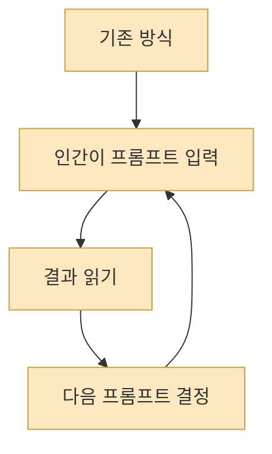

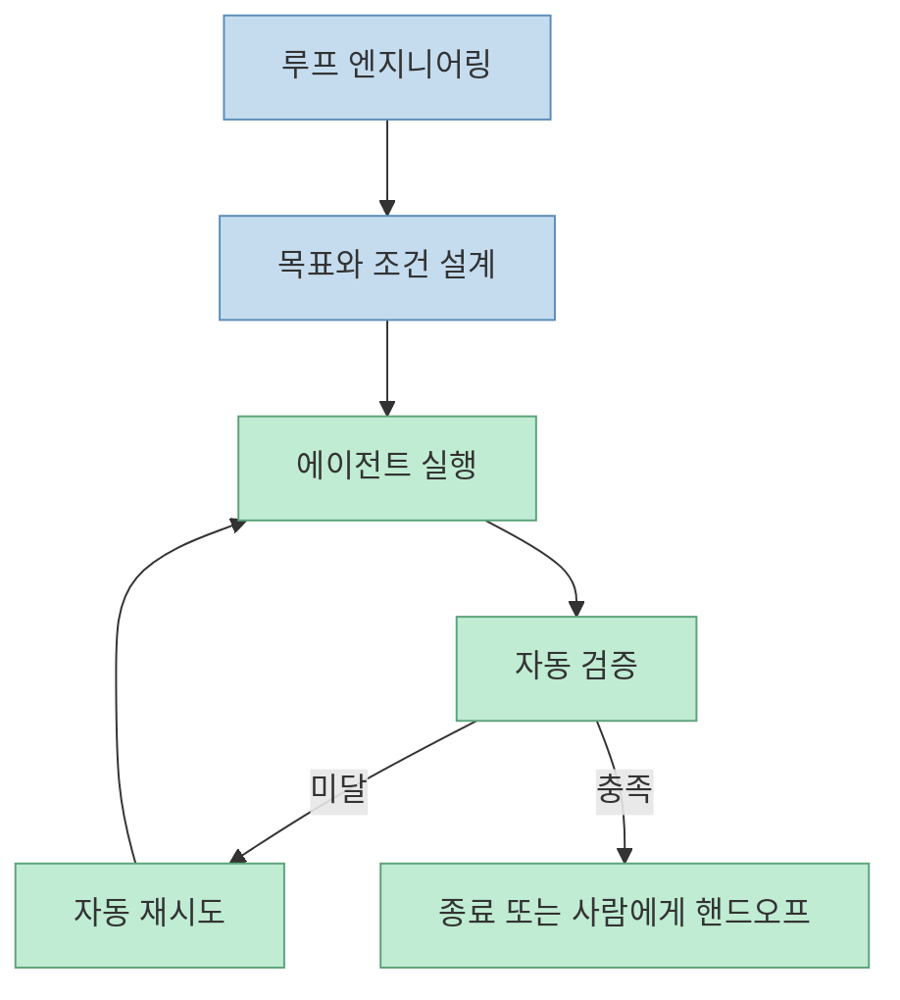

이 차이는 엄청 큽니다. 전자는 사람이 루프를 몸으로 돌리는 구조이고, 후자는 사람이 **루프의 규칙을 설계하는 구조** 입니다.

## 2. Single agent loop와 fleet loop는 규모 차이가 아니라 책임 분산 방식이 다르다

원문은 가장 단순한 루프를 single agent loop로 설명합니다. 하나의 에이전트가 조사하고, 초안을 만들고, 목표와 비교하고, 약한 부분을 고치고, 기준을 넘을 때까지 반복하는 구조입니다. [원문](https://gaodalie.substack.com/p/how-to-build-a-claude-loop-engineering)

반면 fleet loop는 여러 에이전트가 나무처럼 분기되는 구조입니다. 오케스트레이터가 목표를 쪼개고, specialist가 영역별 작업을 맡고, sub-agent가 세부 작업을 수행하며 discovery → planning → execution → verification을 반복합니다. [원문](https://gaodalie.substack.com/p/how-to-build-a-claude-loop-engineering)

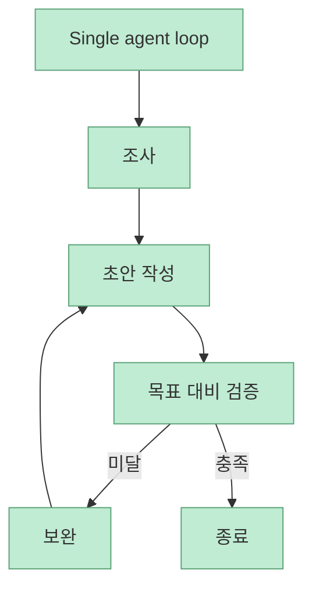

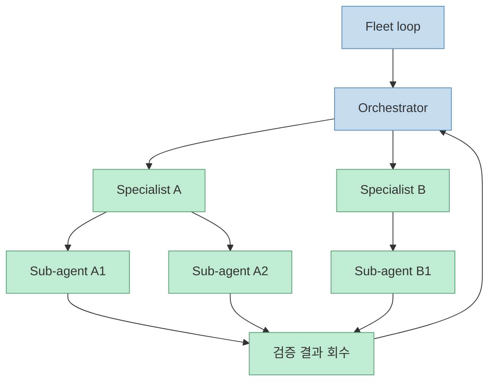

이 차이는 단순히 “에이전트가 많다”가 아닙니다. single agent loop는 한 사람이 원고를 혼자 반복해서 고쳐 쓰는 구조라면, fleet loop는 **조직 전체가 역할을 나눠 하나의 프로젝트를 밀어붙이는 구조** 입니다.

## 3. 실무에서는 open-loop보다 closed-loop가 먼저다

원문이 특히 좋은 점은 루프를 `open-loop`와 `closed-loop`로 나눈다는 것입니다.

`open-loop`는 넓은 탐색 공간을 줍니다. 에이전트가 여러 경로를 시도하고, 애초에 명세되지 않은 결과도 만들어 낼 수 있습니다. 대신 비용이 큽니다. 원문은 진짜 open-loop는 토큰을 많이 잡아먹고, 느슨한 기준의 프로젝트에 쓰면 `slop machine`이 되기 쉽다고 경고합니다. [원문](https://gaodalie.substack.com/p/how-to-build-a-claude-loop-engineering)

반면 `closed-loop`는 사람이 end-to-end pass를 미리 설계해 둔 구조입니다.

- 명확한 목표
- 정의된 단계
- 각 단계별 평가
- 정지 조건 또는 인간 핸드오프

[원문](https://gaodalie.substack.com/p/how-to-build-a-claude-loop-engineering)

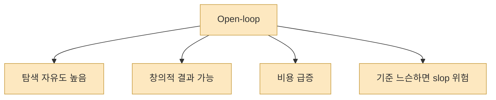

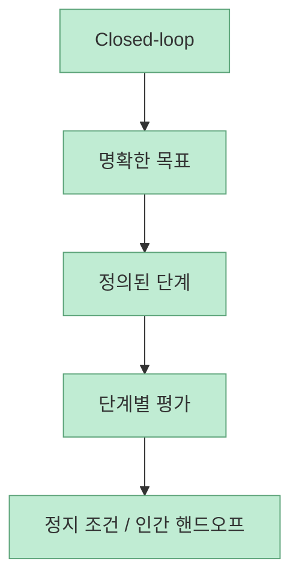

원문은 “오늘날 실제 성과를 내는 대부분은 closed-loop”라고 봅니다. 이건 꽤 현실적인 주장입니다. 현재 많은 팀은 예산이 무한하지 않고, 실패 비용도 크기 때문에, 탐색보다 **제약된 실행 루프** 를 먼저 구축하는 편이 훨씬 실용적입니다.

## 4. Claude Code의 `/goal`과 dynamic workflows는 루프를 제품 안으로 끌어들인 사례다

원문은 loop 개념이 이제 코딩 에이전트 도구 안으로 공식 기능으로 들어왔다고 설명하며, Claude Code 예시로 `/loop`, `/goal`, Dynamic Workflows를 듭니다. [원문](https://gaodalie.substack.com/p/how-to-build-a-claude-loop-engineering)

이 중 `/goal`은 공식 문서로도 확인됩니다. `/goal`은 완료 조건을 설정하고, 각 턴 뒤에 작은 빠른 모델이 조건 충족 여부를 검사합니다. 조건이 아직 충족되지 않으면 Claude는 사용자에게 제어를 넘기지 않고 다음 턴을 시작합니다. [Claude Code /goal](https://code.claude.com/docs/en/goal)

Dynamic Workflows 문서는 `ultracode` 설정이 Claude로 하여금 substantive task마다 워크플로를 계획하고, 많은 subagent에 걸쳐 오케스트레이션하게 만든다고 설명합니다. [Dynamic Workflows](https://code.claude.com/docs/en/workflows) [Model config](https://code.claude.com/docs/en/model-config)

즉 “루프를 설계한다”는 말이 이제는 추상적 개념이 아니라, 실제 제품 기능과 맞물려 돌아가기 시작한 것입니다.

## 5. ReAct와 Reflexion은 루프 엔지니어링의 안쪽 엔진이다

원문은 loop engineering이 허공에서 떨어진 개념이 아니라 `ReAct`와 `Reflexion` 패턴 위에 서 있다고 설명합니다. [원문](https://gaodalie.substack.com/p/how-to-build-a-claude-loop-engineering)

ReAct는 생각 → 행동 → 관찰 → 다시 생각의 구조입니다. 코딩에서는:

1. 목표 이해  
2. 코드 작성  
3. 실행/에러 관찰  
4. 실패 원인 추론  
5. 수정 및 재실행  
6. 테스트 통과까지 반복

이 됩니다. [원문](https://gaodalie.substack.com/p/how-to-build-a-claude-loop-engineering)

Reflexion은 여기에 “왜 실패했는지 자연어로 반성하고, 그 반성을 메모리에 저장해 다음 시도에 반영한다”는 층을 추가합니다. [원문](https://gaodalie.substack.com/p/how-to-build-a-claude-loop-engineering)

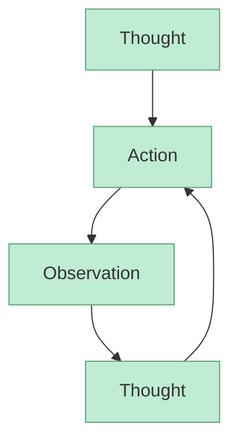

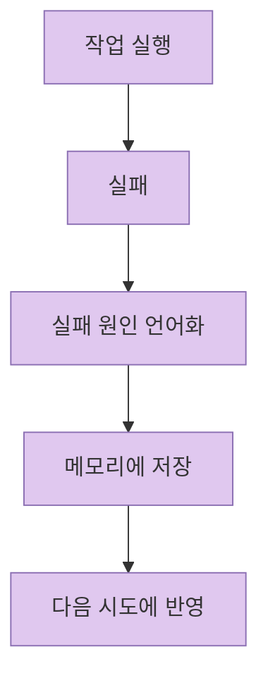

즉 loop engineering은 단지 자동 반복이 아니라, **행동 루프 + 반성 루프** 를 함께 설계하는 일입니다.

## 6. 진짜 핵심은 inner loop와 outer loop를 구분하는 것이다

원문이 가장 유용한 대목은 inner loop와 outer loop를 나누는 부분입니다.

`inner loop`는 단일 작업 안에서의 검증 루프입니다. 예를 들어 auth.ts의 failing test를 고치는 경우, 약한 에이전트는 파일만 수정하고 “done”이라고 하지만, 강한 에이전트는 테스트를 만들고, 실행하고, 실패를 보고, edge case를 고치고, 다시 실행해 통과한 뒤에야 완료를 선언합니다. [원문](https://gaodalie.substack.com/p/how-to-build-a-claude-loop-engineering)

`outer loop`는 세션 간 학습 루프입니다. 예를 들어 1회차 세션에서 pagination 처리에 실패하면, 그 교훈을 `SKILL.md` 같은 곳에 저장하고, 다음 세션에서 비슷한 과제가 나오면 처음부터 그 지식을 불러와 더 잘 처리하게 만드는 구조입니다. [원문](https://gaodalie.substack.com/p/how-to-build-a-claude-loop-engineering)

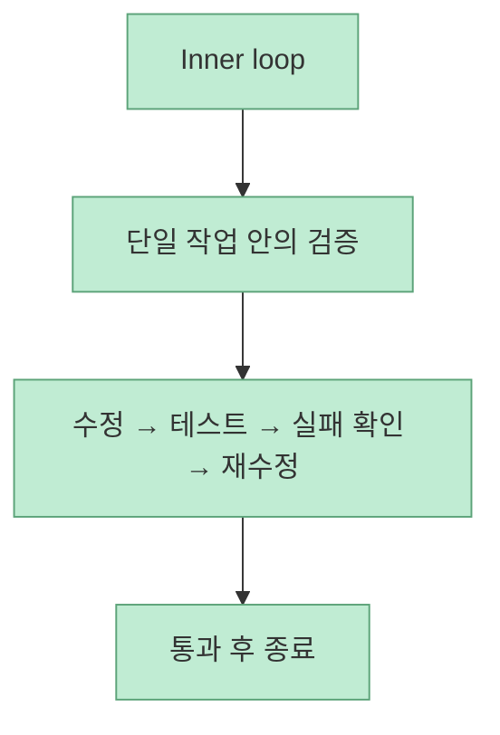

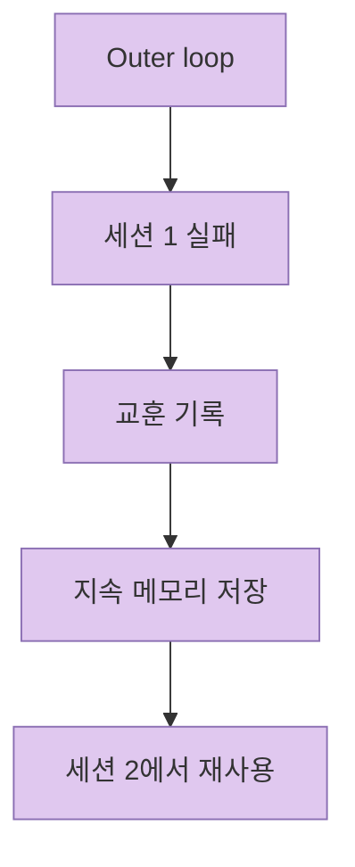

이 구분이 중요한 이유는, 많은 팀이 inner loop만 갖고도 “우리는 루프 있다”고 생각하기 쉽기 때문입니다. 하지만 진짜 생산성 차이는 시간이 갈수록 `outer loop`에서 더 크게 벌어집니다.

## 7. Addy Osmani의 “5+1”은 루프를 시스템 부품으로 보게 만든다

원문은 Addy Osmani를 인용해, 동작하는 루프는 다섯 가지 구성 요소와 메모리 하나로 이루어진다고 정리합니다. [원문](https://gaodalie.substack.com/p/how-to-build-a-claude-loop-engineering)

- Automations
- Worktrees
- Skills
- Plugins / Connectors
- Sub-agents
- Memory

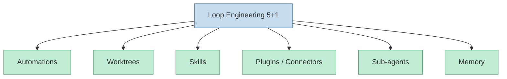

이 구분이 좋은 이유는 loop engineering을 “대단한 프롬프트”가 아니라 **운영 부품 조합** 으로 보게 해 주기 때문입니다.

- Automations: 일정하게 작업을 발견하고 실행
- Worktrees: 병렬 에이전트 충돌 방지
- Skills: 프로젝트 지식의 압축 저장
- Connectors: GitHub, Slack, DB 같은 외부 시스템 연동
- Sub-agents: 생성자와 검증자 분리
- Memory: 컨텍스트 윈도우를 넘어서는 지속 상태

이 구조는 실제 팀 설계에 바로 옮기기 쉽습니다.

## 8. 결국 좋은 루프는 “자유를 주는 것”이 아니라 “좋은 제약을 설계하는 것”이다

원문 마지막은 loop engineering이 AI 개발만의 이야기가 아니라고 말합니다. 본질적으로는 **유능한 개인에게 자유를 주는 것보다, 결과가 나오게 만드는 환경을 설계하는 것** 에 더 가깝다는 것입니다. [원문](https://gaodalie.substack.com/p/how-to-build-a-claude-loop-engineering)

이건 인간 팀 운영과도 비슷합니다. 사람을 잘 뽑는 것만으로는 부족하고, 맥락, 규칙, 피드백, 평가 기준, 진행 관리가 필요합니다. AI 시대의 관리도 세부 지시를 늘리는 쪽이 아니라, **좋은 제약을 설계하는 쪽** 으로 이동하고 있다는 것이 이 글의 결론입니다.

## 핵심 요약

- loop engineering은 프롬프트를 더 잘 쓰는 법이 아니라 **프롬프팅 자체를 시스템으로 외부화하는 일** 입니다. 
- 실무에서는 탐색형 `open-loop`보다 제약형 `closed-loop`가 먼저 성과를 냅니다. 
- ReAct는 행동-관찰 루프, Reflexion은 실패 반영 루프를 설명하며, 둘이 합쳐져 loop engineering의 안쪽 엔진이 됩니다. 
- `inner loop`는 단일 작업 안의 검증이고, `outer loop`는 세션 간 학습입니다. 
- 실제로 동작하는 루프는 `Automations`, `Worktrees`, `Skills`, `Plugins/Connectors`, `Sub-agents`, `Memory`의 5+1 구성 요소로 보는 편이 실용적입니다.

## 결론

이 글이 좋은 이유는 loop engineering을 과장된 유행어가 아니라, **어떤 루프를 닫아야 하고 어떤 루프를 나중에 열어야 하는지** 로 나눠 설명하기 때문입니다. 지금 대부분의 팀에게 필요한 건 무한 탐색을 허용하는 open-loop가 아니라, 종료 조건과 검증 기준이 분명한 closed-loop입니다.

그리고 그 위에 inner loop로 작업 신뢰성을 올리고, outer loop로 세션 간 학습을 누적하면, 비로소 “AI가 한 번 잘한 것”이 아니라 **시간이 갈수록 더 잘하는 시스템** 에 가까워집니다. 결국 핵심은 프롬프트가 아니라 구조입니다. 설계할 것은 문장이 아니라 루프입니다.
