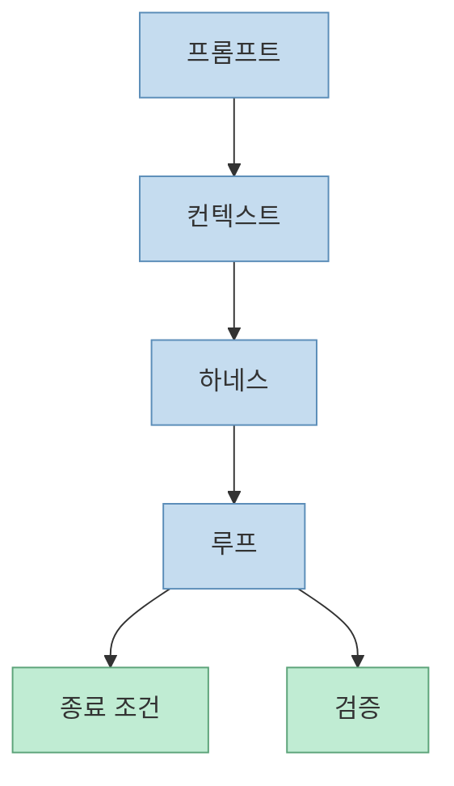
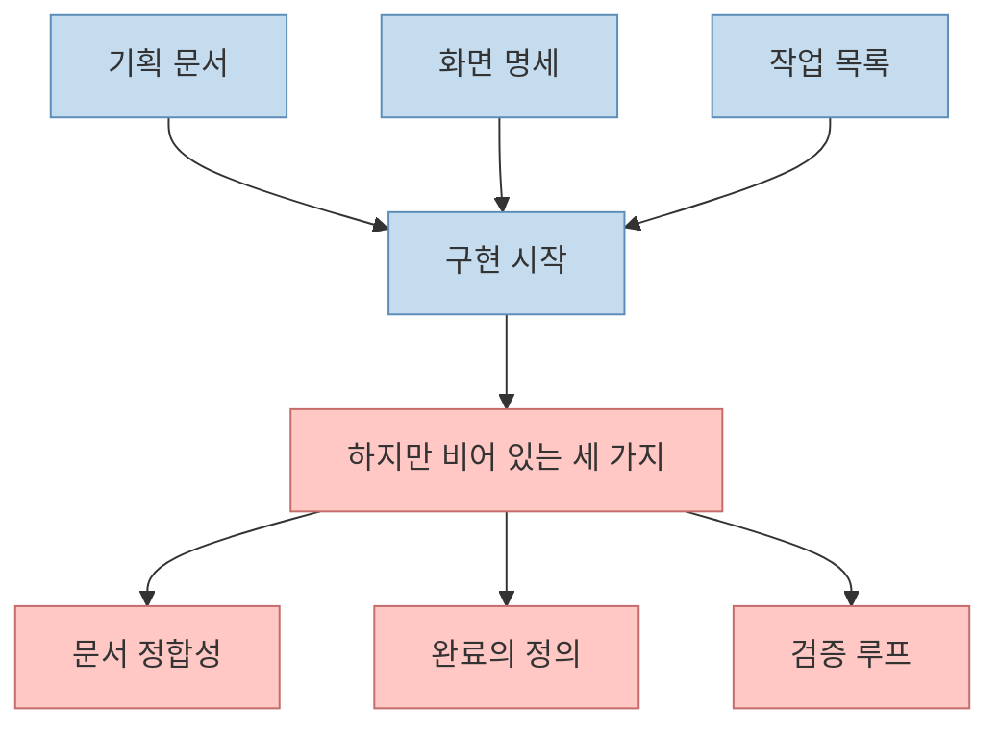
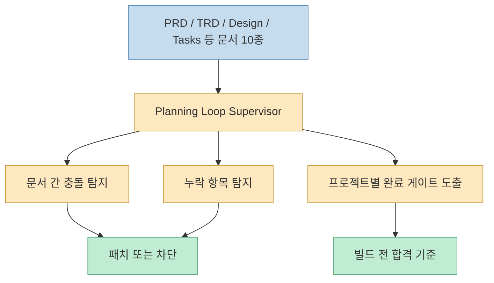
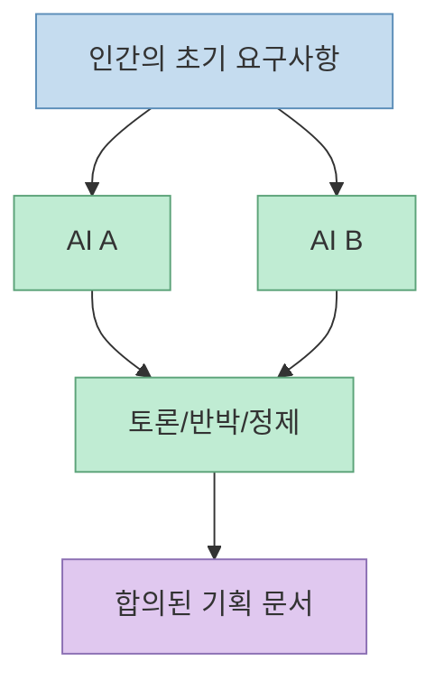
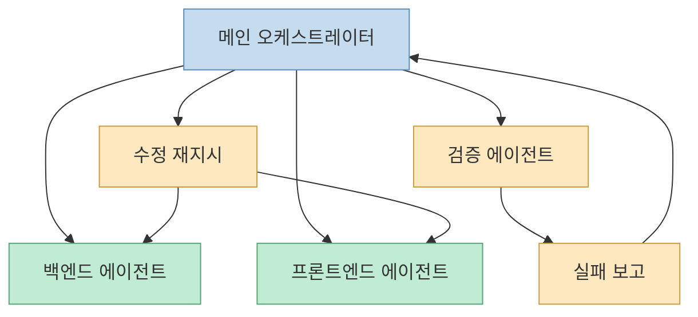
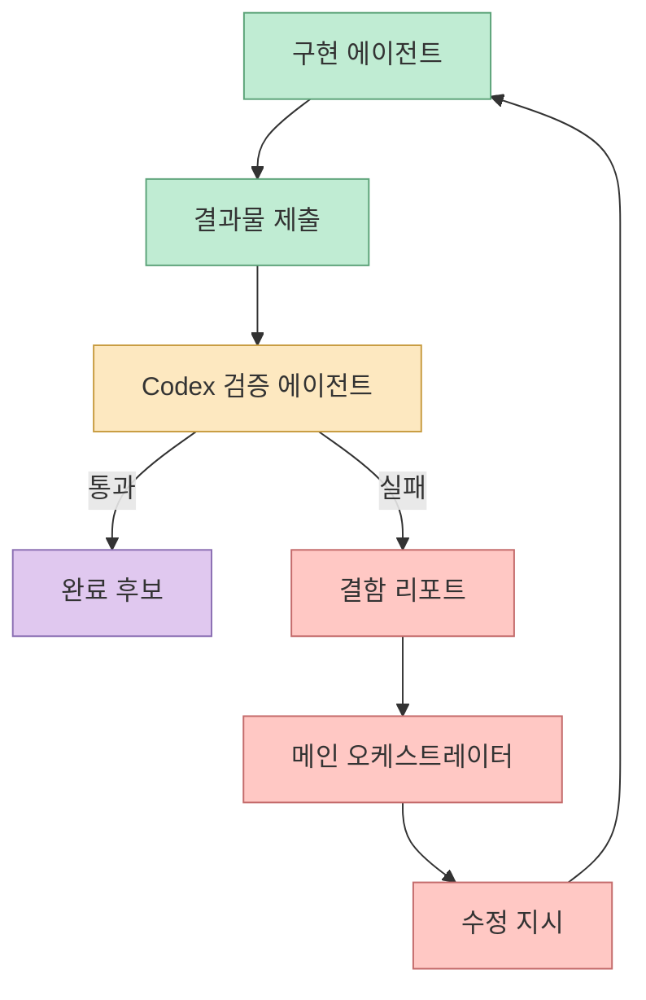
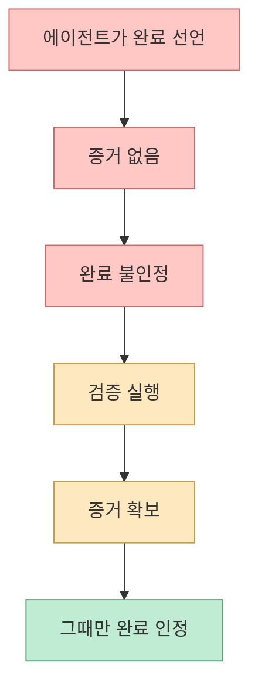

Claude Code에게 일을 시키고 자고 일어났더니 절반쯤 만들다 멈춰 있던 경험은 이제 꽤 흔합니다. 이 영상은 그 원인을 단순히 모델 성능 부족이 아니라 **루프의 부재** 에서 찾습니다. 즉, 기획하고 구현은 시키지만 **검증하고, 실패하면 되돌리고, 끝나는 조건을 강제하는 바깥 루프** 가 없기 때문에 중간에서 멈추거나, 더 나쁘게는 “완료했습니다”라고 말해도 실제로는 끝나지 않은 상태가 된다는 것입니다. [영상 0:00](https://www.youtube.com/watch?v=xFUgrOIgtNE&t=0)

이 글은 영상이 보여 주는 전체 앱 데모보다, 그 뒤에 깔린 구조적 포인트인 **Planning Loop Supervisor**, **멀티페인 분산 빌드**, **다른 에이전트가 검증하는 증거 기반 완료 게이트** 를 중심으로 정리합니다.

<!--more-->

## Sources

- [YouTube - 자고 일어나면 앱이 완성된다? 클로드 코드 루프 파이프라인 실전](https://youtu.be/xFUgrOIgtNE?si=aGSyJcRygUAf-WQm)
- [Anthropic - Claude Fable 5 발표](https://www.anthropic.com/news/claude-fable-5-mythos-5)
- [Claude Code Desktop Docs](https://code.claude.com/docs/en/desktop)

## 1. 이 영상은 AI 코딩을 프롬프트·컨텍스트·하네스·루프의 네 겹으로 본다

영상 1분대에서 발표자는 AI 코딩을 네 겹 구조로 설명합니다.

- 프롬프트
- 컨텍스트
- 하네스
- 루프

[영상 0:57](https://www.youtube.com/watch?v=xFUgrOIgtNE&t=57)

여기서 루프는 “AI에게 매번 내가 직접 프롬프트를 넣는 게 아니라, 그걸 대신하는 시스템을 설계하는 것”으로 정의됩니다. 하지만 무인으로 돌리면 실수가 생기기 때문에, **종료 조건과 검증** 이 핵심이라고 못 박습니다. [영상 1:16](https://www.youtube.com/watch?v=xFUgrOIgtNE&t=76)

이 구조를 뒤집어 보면, 많은 AI 코딩 실패는 앞의 세 겹은 있어도 마지막 겹이 비어 있기 때문에 생깁니다. 즉 좋은 지시와 충분한 문서가 있어도, **언제 실패로 볼지** 와 **무엇을 증거로 완료를 인정할지** 가 없으면 멈추거나 헛도는 겁니다.

## 2. 영상이 지적하는 빈칸은 “검증 루프, 완료의 정의, 문서 간 정합성”이다

설명란은 이 프로젝트의 핵심 포인트를 세 가지로 요약합니다.

- 검증 루프
- 완료의 정의
- 문서 간 정합성

[영상 설명란](https://youtu.be/xFUgrOIgtNE?si=aGSyJcRygUAf-WQm)

이건 매우 현실적인 문제 정의입니다. 실제로 많은 팀이:

- 기획 문서
- 화면 명세
- 작업 목록

까지는 만듭니다. 하지만 그다음:

- 서로 충돌하는 문서는 없는지
- 빠진 요구사항은 없는지
- 어떤 상태가 “완료”인지
- 검증 실패 시 누구에게 무엇을 되돌릴지

가 비어 있습니다.

영상은 바로 이 빈칸을 메우는 장치로 `Planning Loop Supervisor`를 꺼냅니다.

## 3. Planning Loop Supervisor는 문서를 만드는 스킬이 아니라 문서를 다시 읽고 검증하는 감독관이다

설명란은 감독관 스킬의 역할을 아주 명확하게 적습니다. 이 스킬은 문서를 만드는 것이 아니라 **이미 만들어진 문서를 다시 읽고 검증하는 역할** 입니다. [영상 설명란](https://youtu.be/xFUgrOIgtNE?si=aGSyJcRygUAf-WQm)

영상 본문도 같은 점을 반복합니다. Planning Loop Supervisor는 설계 문서의 일관성과 품질을 검증하고, 프로젝트별 게이트와 누락/충돌을 빌드 전에 차단하는 작업을 한다고 설명합니다. [영상 9:27](https://www.youtube.com/watch?v=xFUgrOIgtNE&t=567)

이 점이 중요한 이유는, 많은 에이전트 파이프라인이 “더 많은 문서 생성”에 집착하는 반면, 이 영상은 **문서 생산 이후의 검증 계층** 을 별도 에이전트로 분리하기 때문입니다.

## 4. Fable 5는 여기서 직접 코딩보다 오케스트레이션에 더 가깝게 쓰인다

영상은 2분 48초부터 Claude Code의 모델을 Opus 대신 Fable 5로 바꾸고, Socrates 스킬을 통해 기획을 시작합니다. [영상 2:48](https://www.youtube.com/watch?v=xFUgrOIgtNE&t=168)

Anthropic의 Fable 5 관련 발표도 이 모델이 단순 단답형보다 **긴 작업, 멀티스텝 계획, 장기 실행** 에 강하다는 쪽으로 설명합니다. [Anthropic](https://www.anthropic.com/news/claude-fable-5-mythos-5)

영상에서는 특히 Fable 5를:

- 기획 토론 오케스트레이터
- 문서 파이프라인 조정자
- 멀티페인 작업 위임자

처럼 사용합니다. [영상 3:49](https://www.youtube.com/watch?v=xFUgrOIgtNE&t=229) [영상 9:54](https://www.youtube.com/watch?v=xFUgrOIgtNE&t=594)

즉 여기서 Fable 5의 핵심은 “코드를 더 잘 친다”보다, **여러 에이전트를 조정하며 끝까지 흐름을 유지한다** 는 쪽에 가깝습니다.

## 5. AI 둘이 열 번 이상 토론하게 하는 기획 모드는 인간 개입을 앞에서 줄인다

영상은 기획 단계에서 세 가지 모드를 소개합니다.

- 인터뷰 모드
- AI들끼리 토론하는 모드
- 질문 최소화 즉시 산출 모드

[영상 3:49](https://www.youtube.com/watch?v=xFUgrOIgtNE&t=229)

이번 데모에서는 두 AI가 열 번 이상 대화하며 기획을 좁혀 가는 토론 모드를 선택합니다. 인간은 처음 입력을 던져 주고, 나머지 기획은 AI들끼리 진행합니다. [영상 4:15](https://www.youtube.com/watch?v=xFUgrOIgtNE&t=255)

이 구조의 장점은 기획 초반의 모순을 인간이 다 찾아내지 않아도 된다는 점입니다. 하지만 단점도 분명합니다. 그래서 바로 뒤에 Planning Loop Supervisor 같은 감독관 레이어가 붙는 겁니다.

## 6. 진짜 핵심은 메인 오케스트레이터가 직접 수정하지 않는다는 규율이다

설명란은 메인 오케스트레이터는 절대 직접 수정하지 않고 제어와 조정만 수행한다고 적습니다. [영상 설명란](https://youtu.be/xFUgrOIgtNE?si=aGSyJcRygUAf-WQm)

이 규칙은 굉장히 중요합니다. 오케스트레이터까지 직접 수정에 들어가면:

- 누가 무엇을 바꿨는지 경계가 흐려지고
- 실패 원인을 분리하기 어려워지고
- 검증 결과를 다시 독립적으로 읽기 힘들어집니다

반대로 메인은:

- 위임
- 상태 관찰
- 실패 보고 수집
- 재지시

만 담당하면, 각 역할의 경계가 선명해집니다.

이건 AI 팀 운영에서 매우 강한 규율입니다. 메인은 “손”이 아니라 **감독관** 이어야 한다는 뜻입니다.

## 7. 멀티페인 분산 빌드는 역할을 분리해 실패를 읽기 쉽게 만든다

영상 9분 54초부터는 시웍스 멀티페인에서 여섯 개 페인을 띄워 분산 빌드를 진행합니다. [영상 9:54](https://www.youtube.com/watch?v=xFUgrOIgtNE&t=594)

설명대로 역할은 대략 이렇게 나뉩니다.

- Kimi: 백엔드
- Opus 4.8: 프론트엔드
- Codex: E2E 검증
- 추가 리뷰/브라우저 페인

[영상 10:10](https://www.youtube.com/watch?v=xFUgrOIgtNE&t=610)

이 방식의 장점은 단순 병렬성이 아닙니다. **어느 단계에서 실패했는지 바로 읽을 수 있다** 는 점이 더 중요합니다.

## 8. 가장 중요한 검증 규칙은 “만든 에이전트가 아니라 다른 에이전트가 확인한다”는 것이다

설명란에서 가장 중요한 문장 중 하나는, 만든 에이전트가 아닌 다른 페인인 Codex가 체크리스트를 들고 직접 실행하며 검증한다는 부분입니다. [영상 설명란](https://youtu.be/xFUgrOIgtNE?si=aGSyJcRygUAf-WQm)

영상 본문도 이를 강조합니다. Codex가 전체 시스템 결과를 검증하고, 테스트가 실패하면 메인에게 보고하고, 메인이 다시 프런트엔드에 수정 지시를 내립니다. [영상 11:52](https://www.youtube.com/watch?v=xFUgrOIgtNE&t=712)

이 구조가 중요한 이유는, **자기 자신이 만든 결과를 자기 자신이 통과시켜 버리는 문제** 를 막기 때문입니다. 특히 E2E 시나리오처럼 실제 클릭과 이동, 상태 변화를 보는 검증은 구현자와 분리될수록 훨씬 신뢰도가 올라갑니다.

## 9. “증거 없는 완료를 인정하지 않는다”는 규칙이 이 영상의 진짜 메시지다

영상 마지막에서 발표자는 매우 직설적으로 말합니다. 자신은 AI가 말하는 “모두 완료했습니다”를 거의 믿지 않으며, 증거가 존재하지 않는 완료를 절대 인정하지 않는다고 합니다. [영상 15:28](https://www.youtube.com/watch?v=xFUgrOIgtNE&t=928)

이 문장은 사실 이 영상 전체의 결론입니다.

- 완료는 선언이 아니다
- 완료는 검증 산출물이다
- 검증 실패 시 다시 루프를 돌려야 한다

즉 AI 코딩의 핵심 역량은 “잘 만든다”보다 **잘 검증하는 구조를 갖고 있느냐** 입니다.

이 규칙 하나만 잘 세워도, AI 코딩의 체감 신뢰도는 크게 달라집니다.

## 핵심 요약

- 이 영상은 AI 코딩 실패의 원인을 모델 자체보다 **루프의 부재** 에서 찾습니다. 
- 프롬프트, 컨텍스트, 하네스 위에 가장 바깥층인 루프가 필요하며, 그 핵심은 종료 조건과 검증입니다. 
- `Planning Loop Supervisor`는 문서를 새로 쓰는 스킬이 아니라, 이미 작성된 문서를 다시 읽어 정합성과 완료 게이트를 검증하는 감독관 역할을 합니다. 
- 메인 오케스트레이터는 직접 수정하지 않고 위임과 조정만 담당하며, Kimi·Opus·Codex가 역할을 나눠 분산 빌드를 수행합니다. 
- 가장 중요한 규칙은 **만든 에이전트가 아니라 다른 에이전트가 체크리스트를 들고 검증해야 한다** 는 점이며, 증거 없는 완료 선언은 인정하지 않습니다.

## 결론

이 영상이 보여 주는 건 “자고 일어나면 앱이 완성된다”는 마법이 아닙니다. 오히려 그 반대입니다. **앱이 중간에 멈추지 않게 하려면, 끝났다고 말하기 전에 반드시 통과해야 하는 루프와 게이트가 필요하다** 는 현실적인 설계 원칙입니다.

결국 AI 코딩에서 진짜 실력은 더 화려한 프롬프트가 아니라, **누가 검증하고, 어떤 증거가 있어야 완료이며, 실패하면 무엇을 누구에게 되돌릴지** 를 구조로 설계하는 데 있습니다. 이 영상은 그 원칙을 Planning Loop Supervisor와 외부 검증 에이전트라는 형태로 꽤 선명하게 보여 줍니다.
