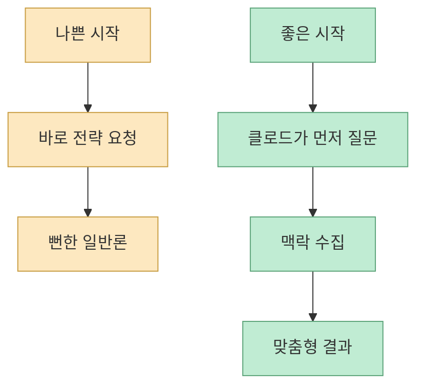
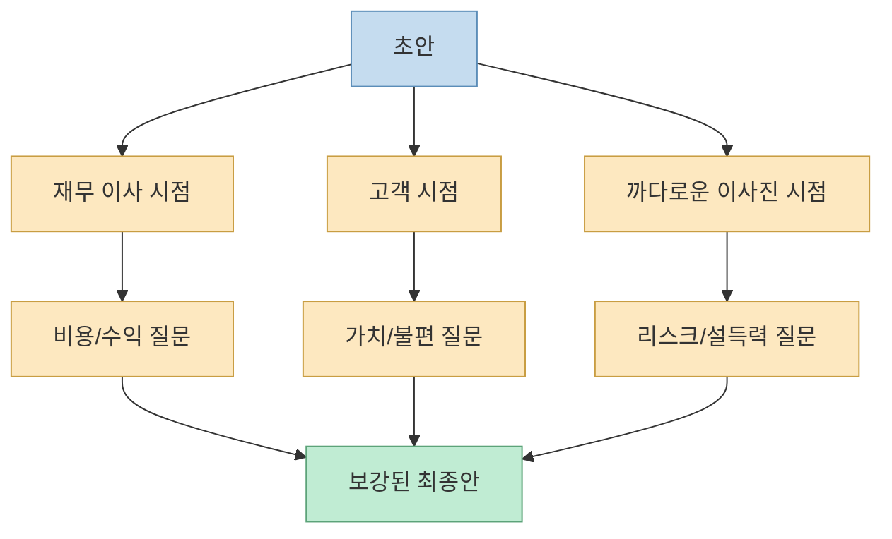
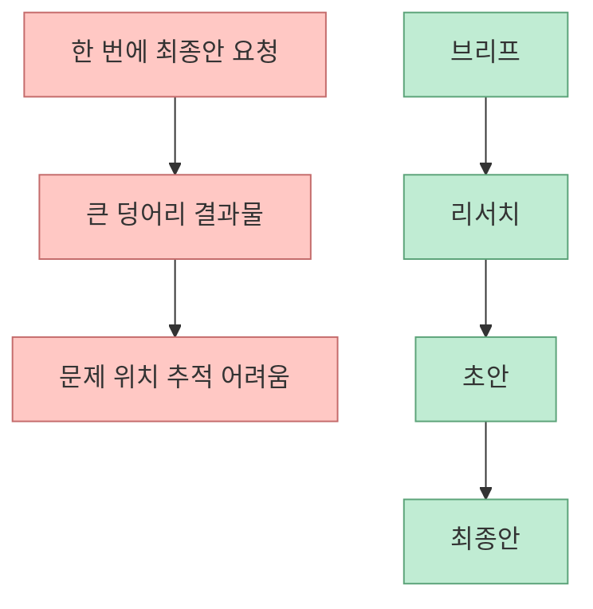
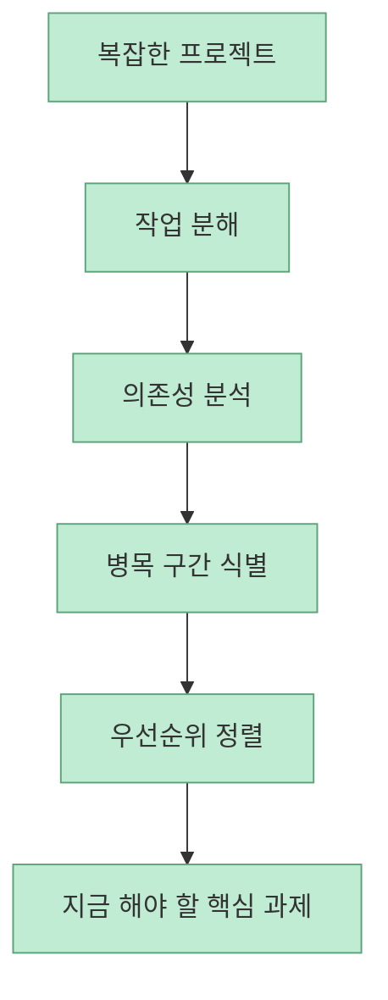
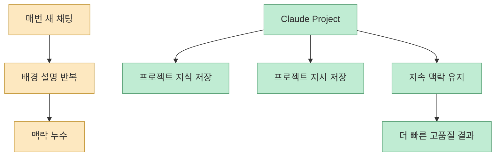

이 Shorts는 “클로드를 천재로 만드는 다섯 가지 방법”이라고 말하지만, 실제로는 모델을 바꾸는 비법이 아니라 **클로드를 다루는 운영 습관** 을 정리한 영상에 가깝습니다. 자막은 클로드를 1년간 깊게 쓴 제임스 블루가 평범한 답변을 전문가급 결과물로 바꾸는 다섯 가지 공식을 공개했다고 소개합니다. [영상 0:00](https://youtube.com/watch?v=K_VRY1MkkFI&t=0)

흥미로운 점은 이 다섯 가지가 모두 “더 멋진 프롬프트 한 줄”이 아니라는 것입니다. 오히려 질문 순서, 검토 관점, 문서 작성 단계, 범위 분해, 고정 맥락 저장처럼 **작업 구조를 바꾸는 방법** 입니다. 즉 이 영상은 클로드의 품질 문제가 모델 자체보다 **입력 구조와 운영 방식의 문제** 에 가까울 수 있다는 것을 보여 줍니다.

<!--more-->

## Sources

- [YouTube Shorts - 클로드를 천재로 만드는 5가지 방법](https://youtube.com/shorts/K_VRY1MkkFI?si=k3hONGN0acQBjUIJ)
- [Claude Help Center - What are projects?](https://support.anthropic.com/en/articles/9517075-what-are-projects)
- [Claude Help Center - How can I create and manage projects?](https://support.anthropic.com/en/articles/9519177-how-can-i-create-and-manage-projects)
- [Claude Help Center - Understanding Claude's personalization features](https://support.anthropic.com/en/articles/10185728-understanding-claude-s-personalization-features)
- [Claude API Docs - Prompting best practices](https://docs.anthropic.com/en/docs/build-with-claude/prompt-engineering/multishot-prompting)

## 1. 첫 번째 방법은 “답부터 달라”가 아니라 “나를 먼저 인터뷰해라”다

자막의 첫 번째 공식은 아주 분명합니다. 클로드에게 무작정 마케팅 전략을 짜 달라고 하지 말고, **모든 정보를 파악할 때까지 질문을 던지라고 먼저 시키라** 는 것입니다. [영상 0:13](https://youtube.com/watch?v=K_VRY1MkkFI&t=13)

영상은 이렇게 하면 15개의 정교한 질문을 통해 비즈니스 맥락을 이해한 뒤 맞춤형 전략을 내놓는다고 설명합니다. [영상 0:22](https://youtube.com/watch?v=K_VRY1MkkFI&t=22)

이 방식이 유효한 이유는, 많은 실패가 사실 “클로드가 멍청해서”가 아니라 **맥락이 충분히 공급되지 않아서** 생기기 때문입니다. Anthropic의 공식 prompting best practices 문서도 정확성과 일관성을 높이기 위해 명확한 구조와 예시를 주는 것이 중요하다고 설명합니다. [Prompting best practices](https://docs.anthropic.com/en/docs/build-with-claude/prompt-engineering/multishot-prompting)

즉 첫 번째 원칙은 “좋은 답변은 좋은 입력보다 좋은 인터뷰에서 시작한다”는 것입니다.

## 2. 두 번째 방법은 하나의 답을 세 가지 시점에서 다시 공격하게 만드는 것이다

자막의 두 번째 공식은 결과물을 세 가지 시점으로 검토하라는 것입니다. 재무 이사, 고객, 까다로운 이사진의 눈으로 각각 논리·비용·리스크를 지적하게 만들면, 어떤 공격에도 무너지지 않는 기획서가 된다고 말합니다. [영상 0:32](https://youtube.com/watch?v=K_VRY1MkkFI&t=32)

이건 매우 실용적인 기법입니다. 좋은 초안은 종종 “작성자 시점”에서는 완벽해 보이지만, 실제 비즈니스에서는:

- 재무 관점
- 사용자 관점
- 의사결정권자 관점

이 서로 충돌합니다. 그러므로 좋은 기획서는 단일 답변이 아니라 **다중 관점 압박 테스트를 통과한 결과물** 이어야 합니다.

이 방법은 AI가 “잘 쓴 답변기”를 넘어서, **가상의 내부 리뷰 보드** 처럼 작동하게 만든다는 점에서 강력합니다.

## 3. 세 번째 방법은 한 번에 쓰게 하지 말고 단계로 나눠 빌드하는 것이다

자막은 문서를 한 번에 뽑지 말고 네 단계로 나눠 빌드하라고 합니다. 초안을 바로 쓰게 하지 말고 **브리프 → 리서치 → 최종안** 같은 단계를 분리하고, 각 단계마다 검증하라고 설명합니다. [영상 0:49](https://youtube.com/watch?v=K_VRY1MkkFI&t=49)

이건 단순한 작성 습관이 아니라 실패 방지 구조입니다. 한 번에 쓰게 하면:

- 리서치 없는 일반론
- 중간 가정 누락
- 검토 불가능한 큰 덩어리 초안

이 생기기 쉽습니다.

즉 세 번째 원칙은, AI를 잘 쓰려면 “한 번에 잘 쓰는 사람”보다 **중간 산출물을 설계하는 사람** 이 되어야 한다는 뜻입니다.

## 4. 네 번째 방법은 프로젝트를 “할 일 목록”이 아니라 의존성 그래프로 분해하게 만드는 것이다

자막은 복잡한 프로젝트의 뼈대를 AI로 분해하라고 말합니다. 범위를 던져 주고, 업무 간 의존성을 분석하게 해서 병목 구간과 지금 당장 실행해야 할 핵심 과제를 우선순위로 정리하라는 것입니다. [영상 1:04](https://youtube.com/watch?v=K_VRY1MkkFI&t=64)

이 포인트는 특히 중요합니다. 많은 사람이 AI에게 “이 프로젝트 해줘”라고 던지지만, 실제로 AI가 잘하는 건 **명확한 작은 단위의 과제 처리** 입니다. 따라서 먼저 해야 할 일은 프로젝트를 작업 목록으로 나누는 게 아니라, **의존성 구조로 나누는 것** 입니다.

이건 AI를 단순 노동력으로 쓰는 게 아니라, **작업 관리자와 우선순위 분석가** 로 쓰는 방식입니다.

## 5. 다섯 번째 방법은 매번 설명하지 않도록 프로젝트 맥락을 저장하는 것이다

자막의 다섯 번째 공식은 `Claude Projects` 기능을 활용해 정보를 저장하라는 것입니다. 매번 역할과 회사 배경을 설명하느라 시간을 버리는 것은 아마추어고, 고정된 맥락을 설정해 두면 클로드가 이미 6개월간 함께 일한 팀원처럼 결과물을 만든다고 설명합니다. [영상 1:22](https://youtube.com/watch?v=K_VRY1MkkFI&t=82)

이 부분은 Claude Help Center 공식 문서와 맞닿습니다. Projects는 자체 chat history와 knowledge base를 가진 self-contained workspace이며, 프로젝트마다 문서와 context를 넣고 focused chat을 이어 갈 수 있습니다. [What are projects?](https://support.anthropic.com/en/articles/9517075-what-are-projects)

또한 관리 문서는 프로젝트에:

- knowledge base 업로드
- project instructions 설정
- 공유/가시성 관리

를 할 수 있다고 설명합니다. [How can I create and manage projects?](https://support.anthropic.com/en/articles/9519177-how-can-i-create-and-manage-projects)

Anthropic의 personalization 문서도 profile instructions, project instructions, styles를 서로 다른 personalization layer로 설명합니다. [Understanding Claude's personalization features](https://support.anthropic.com/en/articles/10185728-understanding-claude-s-personalization-features)

즉 이 다섯 번째 원칙은 단지 편의 기능이 아니라, **클로드가 매번 새 사람처럼 굴지 않게 만드는 기억 설계** 에 가깝습니다.

## 6. 이 다섯 가지는 사실 “좋은 프롬프트”보다 “좋은 작업환경”에 관한 이야기다

이 Shorts를 한 줄로 줄이면, 다섯 가지 모두가 프롬프트 문장 자체보다 **작업환경과 운영 구조** 를 바꾸는 조언입니다.

- 질문부터 시작하게 만들기
- 다중 시점으로 다시 공격하게 만들기
- 한 번에 쓰지 않고 단계로 나누기
- 프로젝트를 의존성 그래프로 분해하기
- 고정 맥락을 프로젝트로 저장하기

이 다섯 가지를 보면, 클로드를 “천재로 만드는 방법”이란 결국 모델을 바꾸는 게 아니라 **모델이 일하는 방식을 바꾸는 것** 입니다.

## 핵심 요약

- 첫 번째 방법은 답변을 바로 요구하지 말고 **클로드가 먼저 인터뷰하게 만드는 것** 입니다. 
- 두 번째 방법은 결과물을 재무 이사, 고객, 이사진 관점으로 다시 비판하게 하는 **다중 시점 리뷰** 입니다. 
- 세 번째 방법은 브리프, 리서치, 초안, 최종안처럼 **단계적 빌드 구조** 를 만드는 것입니다. 
- 네 번째 방법은 복잡한 프로젝트를 할 일 목록이 아니라 **의존성과 병목 기준으로 분해** 하게 하는 것입니다. 
- 다섯 번째 방법은 Claude Projects와 project instructions를 활용해 **고정 맥락을 저장** 하는 것입니다.

## 결론

이 Shorts는 “클로드에게 더 멋진 한 줄 프롬프트를 쓰는 법”을 알려 주는 영상이 아닙니다. 오히려 그 반대입니다. 클로드가 엉성한 결과를 내는 이유를 모델 탓으로 돌리기보다, **우리가 작업을 너무 한 번에 시키고, 너무 적은 맥락을 주고, 너무 빨리 최종안을 요구하기 때문** 이라고 말하는 영상에 가깝습니다.

결국 클로드를 더 똑똑하게 만드는 건 모델 교체보다 **운영 습관의 교체** 입니다. 질문하게 만들고, 여러 시점으로 검토하게 만들고, 단계로 빌드하고, 프로젝트를 분해하고, 맥락을 저장하는 것. 이 다섯 가지는 곧 “AI를 잘 쓰는 사람”이 아니라 **AI와 함께 일하는 작업환경을 설계하는 사람** 의 특징에 가깝습니다.
