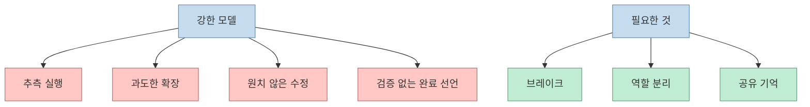
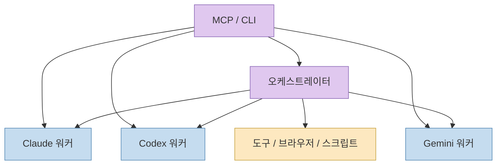
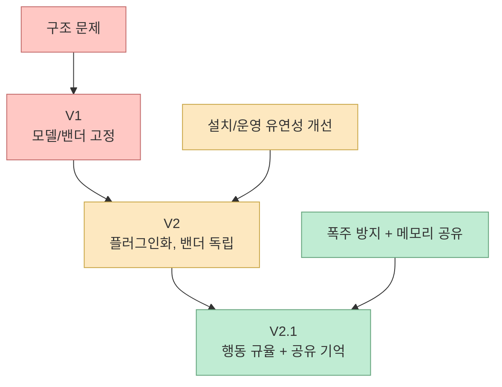
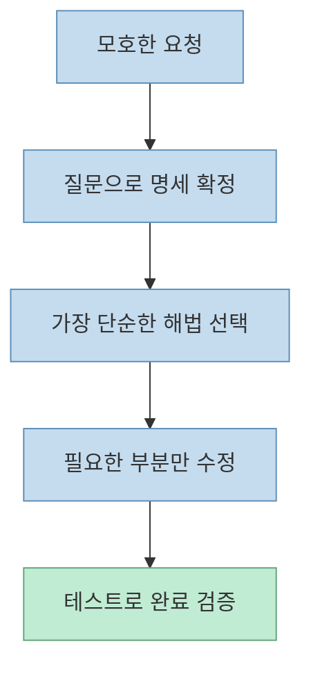
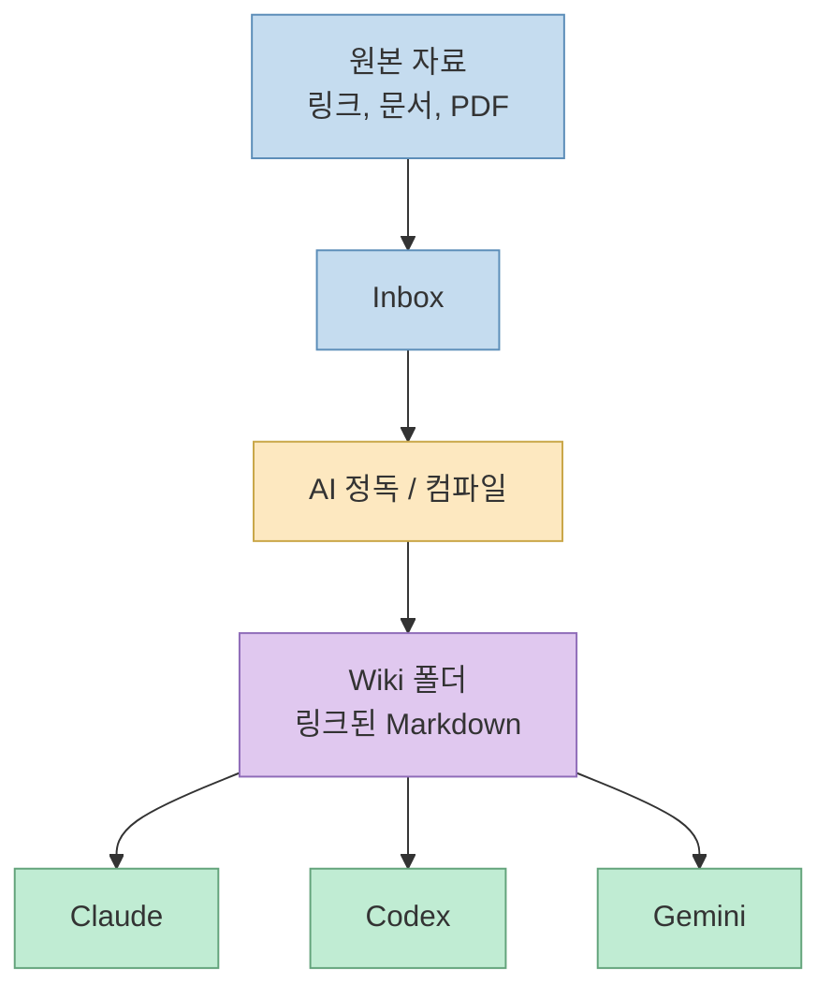
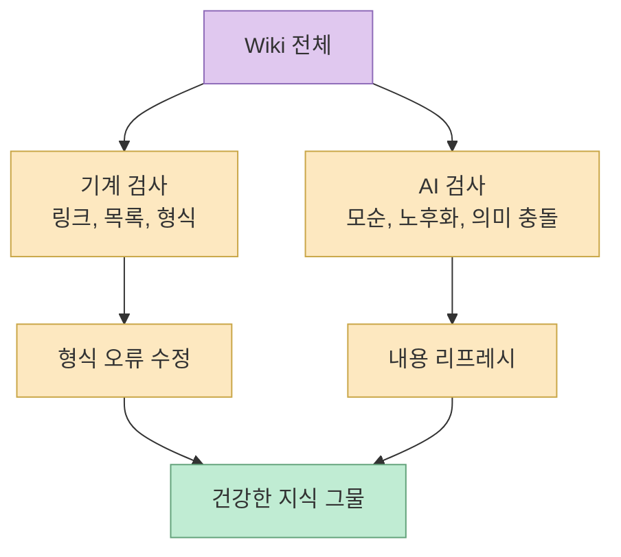
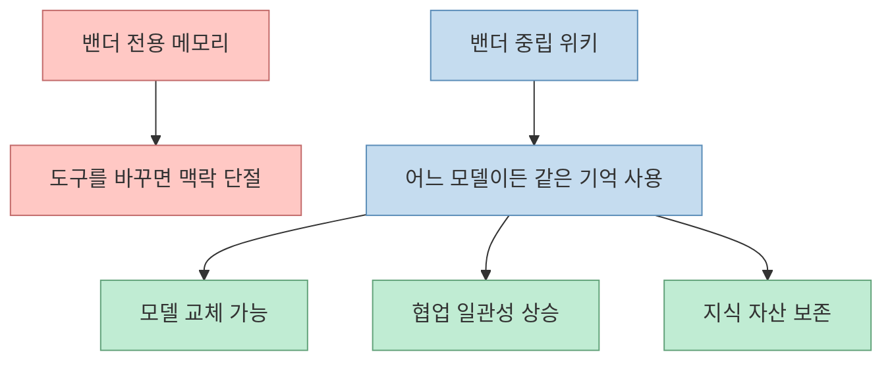
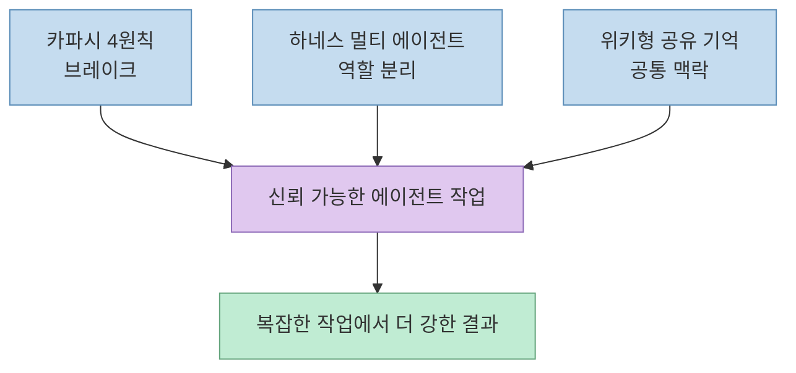

> 소스: <https://youtu.be/mcNaoV8M-tg?si=4LpXbr7tR7UHKWPg> 
> 교차 참고: <https://docs.anthropic.com/en/docs/claude-code/overview>, <https://docs.anthropic.com/en/docs/claude-code/skills>, <https://docs.anthropic.com/en/docs/claude-code/memory>, <https://openai.com/index/introducing-codex/>, <https://gist.github.com/karpathy/442a6bf555914893e9891c11519de94f>

이 영상의 요지는 단순합니다. 
**AI가 멍청해서 문제가 아니라, 너무 강한데 브레이크와 공용 기억이 없어서 문제** 라는 것입니다.

영상은 이 문제를 세 층으로 나눠 해결합니다.

- **카파시의 4원칙** 으로 폭주를 멈추고
- **하네스 멀티 에이전트** 로 역할을 분리하고
- **위키형 공유 기억** 으로 Claude, Codex, Gemini가 같은 맥락을 읽게 만든다

<!--more-->

## 왜 "AI는 똑똑한데 브레이크가 없다"는 말이 나오는가

영상 초반 문제 정의는 매우 선명합니다.

- 묻지 않고 혼자 추측한다
- 간단한 걸 과하게 부풀린다
- 시키지 않은 곳을 건드린다
- 다 했다고 하지만 버그가 남아 있다

이건 모델 지능의 부족보다 **실행 제어 문제** 에 가깝습니다. 
Anthropic은 Claude Code를 코드베이스를 읽고, 파일을 수정하고, 명령을 실행하고, 도구와 통합하는 **agentic coding tool** 로 설명합니다.citeturn0search1 OpenAI도 Codex를 병렬로 여러 작업을 수행하는 **software engineering agent** 로 소개합니다.citeturn0search2

즉, 이런 도구는 "더 똑똑한 채팅창"이 아니라 이미 **행동하는 시스템** 입니다. 
행동하는 시스템에는 당연히 브레이크와 규율이 필요합니다.

## 하네스는 "말에 채우는 고삐"라는 비유가 정확하다

영상은 하네스를 원래 뜻 그대로 설명합니다. 
강한 말에게 고삐와 안장을 채우듯, 강한 AI에게도 제어 장치를 붙여야 한다는 것입니다.

여기서 핵심 구성은 아래와 같습니다.

- **오케스트레이터**: 누가 무슨 일을 할지 나누고 합친다
- **워커**: 실제 실행 담당 AI
- **MCP / CLI**: 다른 AI나 도구를 불러오는 통로

이 구조는 단일 모델 의존에서 벗어나게 해 줍니다. 
어떤 세션에서는 Claude가 지휘자가 되고, 다른 환경에서는 Codex나 다른 에이전트가 메인 역할을 맡을 수도 있습니다.

## V1에서 V2.1로 가며 바뀐 문제는 "구조"에서 "행동"으로 이동했다

영상은 시스템이 세 번 진화했다고 설명합니다.

### V1의 문제

- 오케스트레이터가 특정 모델로 고정
- 비용 구조가 불리함
- 특정 밴더 종속
- 설치와 유지 방식이 유연하지 않음

### V2의 개선

- 플러그인으로 어디서든 설치 가능
- 오케스트레이터와 모델 교체 자유도 상승
- 밴더 독립성 강화

그런데 V2까지 와도 남은 문제가 있었습니다. 
바로 **AI의 행동 습관** 입니다.

즉, 구조는 좋아졌는데도:

- 추측
- 코드 부풀리기
- 멋대로 수정
- 검증 없는 완료

는 여전히 남아 있었던 것입니다.

그래서 V2.1에서 카파시 원칙과 위키형 기억을 추가합니다.

## 카파시의 4원칙은 결국 "AI 브레이크 세트"다

영상은 안드레 카파시의 흐름에서 가져온 4원칙을 핵심 브레이크로 둡니다.

### 1. 코딩하기 전에 먼저 생각하라

명령이 모호하면 추측하지 말고 질문한다.

예:

- 이메일 가입인지
- 휴대폰 가입인지
- 비밀번호 정책은 무엇인지

를 혼자 정하지 않는다.

### 2. 단순함을 최우선으로

간단한 요구를 거대한 추상화와 확장성으로 부풀리지 않는다.

### 3. 수술하듯 꼭 필요한 곳만

버그 하나 고치는데 무관한 함수, 주석, 서식을 건드리지 않는다.

### 4. 목표 지향으로 실행하라

“고쳤다”가 아니라 **이 버그를 검증하는 테스트를 먼저 만들고 통과할 때까지 반복** 한다.

이 4원칙은 최근 널리 퍼진 카파시의 `CLAUDE.md` / 위키 계열 흐름과도 연결됩니다. Karpathy의 `llm-wiki` gist 역시 **스키마 문서와 규율을 통해 LLM을 느슨한 챗봇이 아니라 disciplined wiki maintainer로 만든다** 고 설명합니다.citeturn0search3

## 위키형 기억은 RAG보다 "공용 작업 기억"에 가깝다

영상의 두 번째 축은 **위키** 입니다.

여기서 말하는 위키는 문서를 올릴 때마다 조각 검색하는 일반적인 RAG와 다릅니다.

영상의 설명대로면 흐름은 이렇습니다.

1. 원본 자료를 인박스에 넣는다
2. AI가 그 자료를 한 번 정독한다
3. 이를 마크다운 위키로 컴파일한다
4. 기존 문서들과 링크로 연결한다
5. 이후 Claude, Codex, Gemini가 같은 위키를 읽는다

즉, 질문할 때마다 원문을 다시 뒤지는 것이 아니라 **사전에 구조화된 공용 기억층** 을 만든다는 뜻입니다.

Anthropic도 Claude Code 메모리를 **대화 시작 시 로드되는 문맥 시스템** 으로 설명하며, 강제 규칙이 아니라 컨텍스트로 작동한다고 말합니다.citeturn0search18 그리고 Skills 문서는 스킬이 표준을 따르면서도 동적 컨텍스트 주입과 실행 제어를 확장한다고 설명합니다.citeturn0search12

영상에서 말하는 위키는 이 두 개념을 더 바깥으로 확장한 것입니다. 
즉, 내장 메모리 바깥에 **밴더 중립형 기억층** 을 두는 구조입니다.

## 위키가 썩지 않게 만드는 두 겹 검사

영상이 좋은 점은 위키를 만능으로 포장하지 않는다는 것입니다. 
마크다운 위키는 커질수록 두 가지 문제가 생깁니다.

- 링크가 끊기고 목록이 어긋나는 **형식 문제**
- 내용이 오래되거나 서로 충돌하는 **의미 문제**

그래서 영상은 이를 두 겹으로 관리합니다.

### 1. 기계 검사

- 링크 존재 여부
- 누락된 목록
- 파일 구조 오류

### 2. AI 검사

- 문서 간 모순
- 오래된 정보
- 요약 왜곡

이렇게 하면 "마크다운 위키 = 방치된 노트 더미"가 아니라 **살아 있는 공유 기억** 이 됩니다.

## 이 구조의 진짜 장점은 밴더 독립성이다

영상 후반의 가장 중요한 주장은 이것입니다.

> Claude에서 묻든 Codex에서 묻든 Gemini에서 묻든, 같은 지식 그물을 읽게 만들면 셋이 같은 답에 수렴한다

이 말은 단순 편의성이 아닙니다. 
다음과 같은 장점이 생깁니다.

- 특정 모델 품질 하락에 덜 흔들린다
- 특정 기업 정책 변화에 덜 종속된다
- 어떤 도구가 메인이 되든 기억 자산은 남는다
- 멀티에이전트 협업이 실제로 팀처럼 움직인다

## 오픈소스 에이전트와 다른 점은 "새 블랙박스"를 덜 믿는다는 데 있다

영상은 오픈클로우, 헤르메스 같은 강한 도구도 언급하지만, 자신이 원하는 방향은 다르다고 설명합니다.

그 차이는 대략 이렇습니다.

- 거대한 새 런타임 전체를 신뢰할 것인가
- 아니면 이미 쓰고 있는 도구 위에 얇은 레이어를 덧씌울 것인가

후자를 택하면:

- 비용 예측이 쉽고
- 구조를 직접 열어 보기 쉬우며
- 필요 기능만 조립할 수 있고
- 밴더 종속을 줄이기 쉽습니다

이건 일종의 **agent platform** 이 아니라 **agent harness layer** 에 가깝습니다.

## 이 영상이 결국 말하는 것

이 영상은 "멀티 에이전트가 멋지다"는 이야기를 하려는 게 아닙니다. 
정확히는 아래 세 가지를 한 묶음으로 봐야 한다는 주장에 가깝습니다.

1. **행동 규율** 없이는 강한 모델도 폭주한다
2. **역할 분리** 없이는 복잡한 작업에서 흐름이 무너진다
3. **공유 기억** 없이는 에이전트가 팀처럼 움직이지 못한다

그래서 카파시 원칙, 멀티 에이전트 하네스, 위키형 기억은 각각 따로 좋은 아이디어가 아니라, 함께 붙을 때 비로소 효과가 납니다.

## 마무리

정리하면, 이 영상은 "어느 모델이 최고냐"보다 한 단계 위 이야기를 합니다. 
모델 위에 어떤 **규율**, **오케스트레이션**, **공유 기억층** 을 올리느냐가 더 중요하다는 것입니다.

그래서 이 조합을 한 문장으로 요약하면 이렇습니다.

**카파시 원칙은 AI의 브레이크이고, 하네스 멀티 에이전트는 AI의 조직도이며, 위키형 기억은 AI 팀의 공용 두뇌다.**
