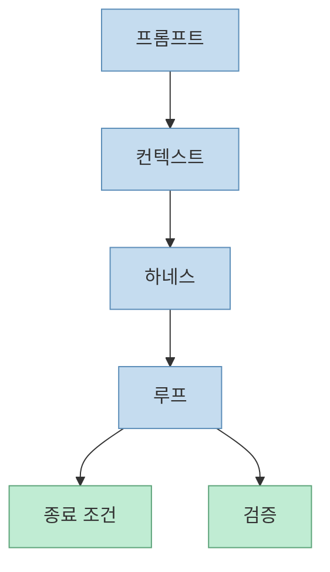
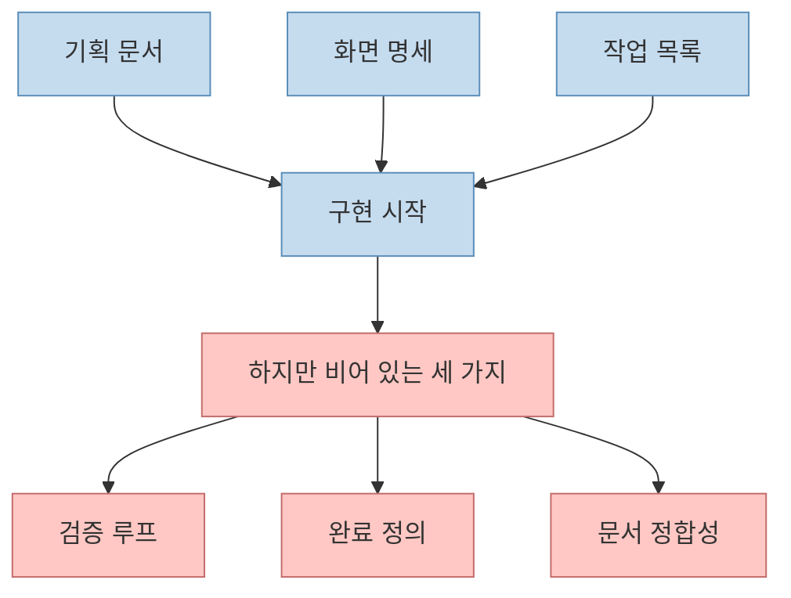
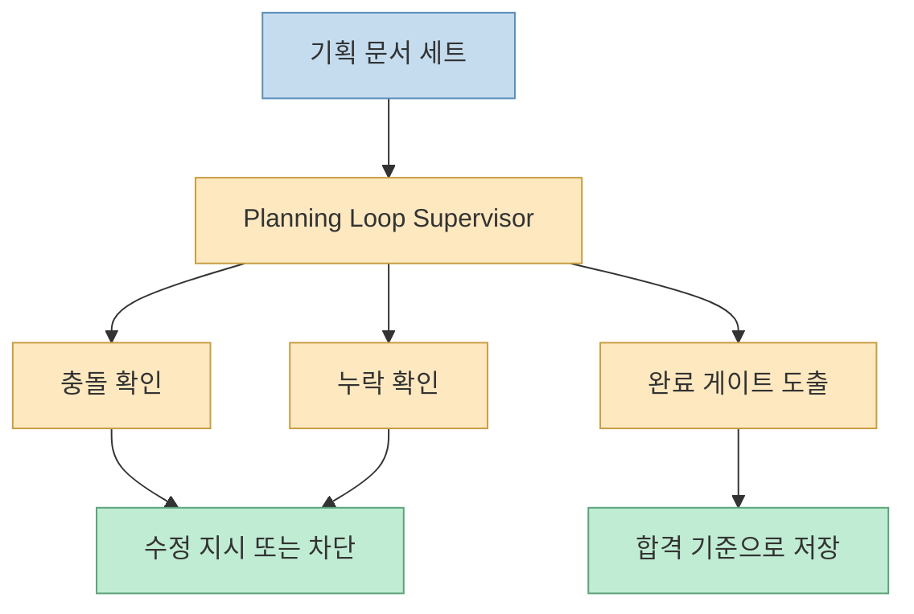
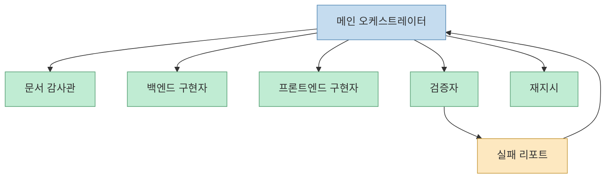
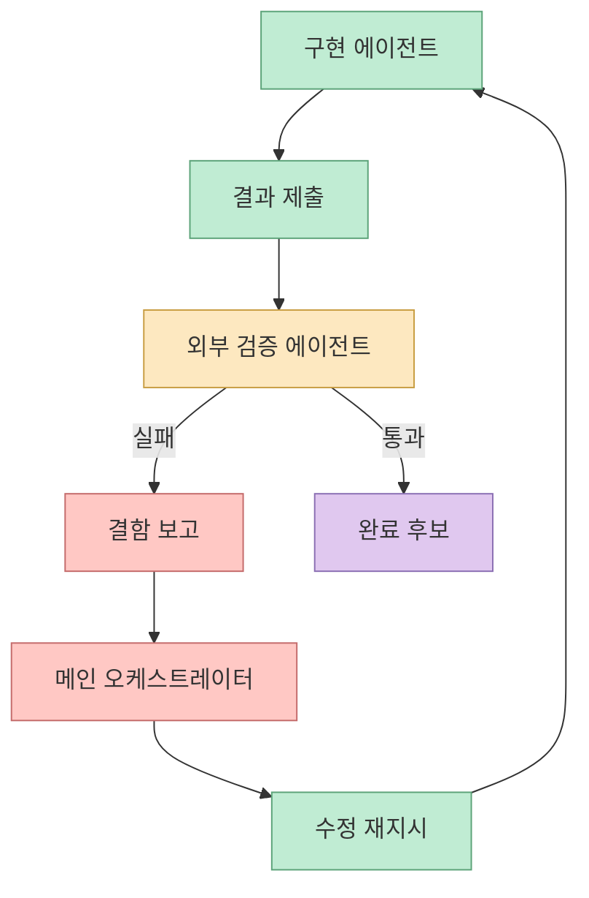
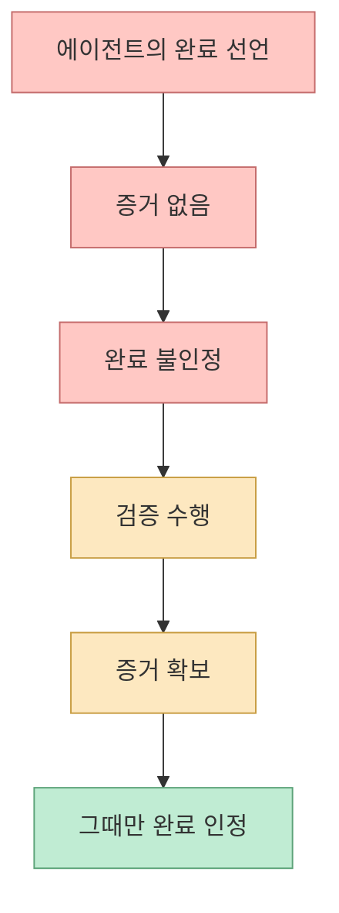

이 영상은 처음부터 문제를 아주 현실적으로 잡습니다. Claude Code에게 일을 시켜 놓고 자고 일어났더니, 다 만들기는커녕 절반쯤 하다가 멈춰 있는 경험이 왜 생기느냐는 것입니다. 발표자는 그 원인을 모델 지능 하나가 아니라 **루프의 부재** 에서 찾습니다. 즉 문서를 던지고 구현을 맡기는 것만으로는 충분하지 않고, **검증하고, 안 되면 되돌리고, 무엇을 충족해야 끝인지 정하는 바깥 루프** 가 필요하다는 이야기입니다. [영상 0:00](https://youtu.be/xFUgrOIgtNE?t=0)

이번 글은 그중에서도 특히 흥미로운 부분인 `Planning Loop Supervisor`에 집중합니다. 이 스킬은 문서를 더 잘 만들어 주는 도구가 아니라, **이미 만들어진 문서를 다시 읽고 검증하는 감독관** 으로 소개됩니다. 이 차이가 생각보다 큽니다.

<!--more-->

## Sources

- [YouTube - 자고 일어나면 앱이 완성된다? 클로드 코드 루프 파이프라인 실전](https://youtu.be/xFUgrOIgtNE?si=aGSyJcRygUAf-WQm)
- [Claude Code Overview](https://docs.anthropic.com/en/docs/claude-code/overview)
- [Claude Code Commands Docs](https://code.claude.com/docs/en/commands)
- [Claude Code /goal Docs](https://code.claude.com/docs/en/goal)

## 1. 프롬프트, 컨텍스트, 하네스만으로는 끝나지 않고, 가장 바깥층에 루프가 있어야 한다

영상은 AI 코딩을 네 겹으로 설명합니다.

- 프롬프트
- 컨텍스트
- 하네스
- 루프

[영상 0:57](https://youtu.be/xFUgrOIgtNE?t=57)

발표자가 말하는 루프의 한 줄 정의는 “AI 에이전트한테 매번 내가 프롬프트를 넣는 게 아니라 그걸 대신해 주는 시스템을 설계하는 것”입니다. 하지만 무인으로 돌리면 실수하므로, **종료 조건과 검증** 이 핵심이라고 강조합니다. [영상 1:16](https://youtu.be/xFUgrOIgtNE?t=76)

여기서 중요한 건, 루프를 “더 많이 시키는 자동화”로 이해하면 안 된다는 점입니다. 이 영상의 루프는 단지 반복이 아니라 **검증과 정지 조건을 포함한 반복 구조** 입니다.

## 2. 많은 팀이 만드는 것은 문서지만, 실제로 비어 있는 건 세 가지다

영상은 기획하고 화면 명세를 만들고 작업 목록을 뽑는 것까지는 다들 한다고 말합니다. 그런데 정작 비어 있는 세 가지가 있다고 지적합니다.

- 만든 게 맞는지 검증하는 루프
- 무엇을 충족하면 끝인지에 대한 완료의 정의
- PRD, 화면, 작업 목록 사이의 정합성

[영상 1:41](https://youtu.be/xFUgrOIgtNE?t=101) [영상 2:02](https://youtu.be/xFUgrOIgtNE?t=122)

이 지적이 중요한 이유는, 지금 많은 AI 코딩 흐름이 “문서를 만드는 속도”에는 집중하지만, **문서끼리 서로 맞는지 확인하는 층** 은 거의 갖고 있지 않기 때문입니다.

## 3. Planning Loop Supervisor는 문서를 생성하는 스킬이 아니라 문서를 감사하는 스킬이다

영상은 `Planning Loop Supervisor`를 오늘의 주인공으로 소개합니다. 이 스킬의 역할은 만들어진 문서들이 서로 맞지 않거나 빠진 곳이 없는지 검증하고, 무엇을 충족해야 완성인지 게이트를 뽑아내는 것입니다. [영상 1:41](https://youtu.be/xFUgrOIgtNE?t=101) [영상 2:35](https://youtu.be/xFUgrOIgtNE?t=155)

발표자는 이 스킬이 문서를 만드는 스킬이 아니라고 분명히 말합니다. **이미 만들어진 문서를 다시 읽고 검증하는 감독관 역할** 이라고 합니다. [영상 2:22](https://youtu.be/xFUgrOIgtNE?t=142)

이건 꽤 큰 차이입니다. 보통은 “문서를 더 많이 만들면 더 안전해진다”고 생각하기 쉬운데, 이 영상은 오히려 **문서를 다시 읽는 에이전트가 있어야 비로소 문서가 의미를 갖는다** 는 쪽에 가깝습니다.

## 4. 메인 오케스트레이터는 직접 수정하지 않고, 제어와 조정만 맡는다

설명란의 핵심 포인트 중 하나는 메인 오케스트레이터가 절대 직접 수정하지 않고 **제어·조정만 수행** 한다는 점입니다. [영상 설명란](https://youtu.be/xFUgrOIgtNE?si=aGSyJcRygUAf-WQm)

이 원칙은 왜 중요할까요? 메인이 직접 손대기 시작하면:

- 누가 어떤 판단으로 무엇을 바꿨는지 흐려지고
- 실패 원인을 특정하기 어려워지고
- 검증자를 분리하기 힘들어집니다

반대로 메인이 해야 할 일은:

- 작업 위임
- 상태 관찰
- 실패 리포트 해석
- 수정 재지시

쪽입니다.

이 구조는 사람이 팀을 운영할 때와도 비슷합니다. 좋은 PM이나 리드가 직접 모든 코드를 치지 않듯, 메인 오케스트레이터도 **조립보다 감독** 에 집중해야 합니다.

## 5. 토론 모드는 문서 생성 이전에 요구사항의 모순을 먼저 끌어내는 장치다

영상은 기획 단계에서 세 가지 모드를 보여 줍니다.

- 인터뷰 모드
- AI 둘이 토론하는 모드
- 질문 최소화 후 바로 산출물 작성

[영상 3:48](https://youtu.be/xFUgrOIgtNE?t=228)

이번 데모에서는 토론 모드를 선택합니다. 두 AI가 열 턴 이상 대화를 주고받으며 기획을 좁히고, 그 결과를 바탕으로 실제 코딩으로 넘어갑니다. [영상 4:15](https://youtu.be/xFUgrOIgtNE?t=255) [영상 5:49](https://youtu.be/xFUgrOIgtNE?t=349)

여기서 중요한 것은 “AI가 알아서 기획한다”는 신기함보다, **모순을 드러내는 비용을 앞당긴다** 는 점입니다. 실제로 발표자는 첫 결과에서 기능 수와 차별점이 약하다고 보고, DB도 로컬 스토리지가 아니라 SQLite로 바꾸도록 다시 피드백을 넣습니다. [영상 7:09](https://youtu.be/xFUgrOIgtNE?t=429)

즉 토론 모드는 정답 생성기가 아니라, **사람이 나중에 발견했을 문제를 앞단에서 싸우게 만드는 장치** 입니다.

## 6. 문서 10종을 자동으로 만드는 것보다 중요한 건 그 문서들을 다시 검토받는 단계다

영상 8분대에서 더큐먼트 스페셜리스트가 PRD, TRD 등 총 열 가지 설계 문서를 작성합니다. [영상 8:13](https://youtu.be/xFUgrOIgtNE?t=493)

하지만 발표자는 여기서 멈추지 않습니다. 세 명의 전문가에게 기획 문서를 검토받는 단계를 추가로 진행하고, 더 강화하고 싶다면 리뷰 받기를 선택하면 된다고 말합니다. [영상 8:39](https://youtu.be/xFUgrOIgtNE?t=519)

이 단계가 중요한 이유는, 문서 수가 많아질수록 오히려 위험도 늘어나기 때문입니다.

- 충돌 가능성 증가
- 오래된 가정 잔존
- 서로 다른 용어 사용
- 같은 기능에 대한 다른 정의

그래서 문서 작성이 많아질수록, 그만큼 **문서 검토 레이어** 가 더 중요해집니다.

## 7. 멀티페인 분산 빌드는 속도보다 “책임 분리”가 더 중요하다

영상 9분 54초 이후에는 시웍스에서 여러 페인을 띄워 분산 빌드를 진행합니다. 여기서:

- Kimi는 백엔드
- Opus 4.8은 프론트엔드
- Codex는 검증

역할을 맡습니다. [영상 9:54](https://youtu.be/xFUgrOIgtNE?t=594) [영상 10:28](https://youtu.be/xFUgrOIgtNE?t=628)

많은 사람이 이런 구조를 보면 “병렬이라서 빠르다”는 점만 보는데, 이 영상의 더 큰 가치는 **책임의 경계를 분리했다** 는 데 있습니다.

구현자와 검증자가 분리되면:

- 구현자는 만들어야 할 것에 집중하고
- 검증자는 체크리스트를 들고 실제 동작을 확인하고
- 메인은 둘 사이를 조정합니다

이렇게 되면 “누가 만든 결과를 누가 확인했는가”가 선명해집니다.

## 8. 진짜 핵심은 구현자가 아니라 다른 페인이 검증을 한다는 점이다

설명란도 이 점을 강조합니다. 만든 에이전트가 아닌 다른 페인인 Codex가 체크리스트를 들고 직접 실행하며 검증한다고 적습니다. [영상 설명란](https://youtu.be/xFUgrOIgtNE?si=aGSyJcRygUAf-WQm)

영상 본문에서도 Codex가 전체 시스템 결과를 검증하고, 실패하면 결함을 메인에게 보고하고, 메인이 다시 프론트엔드에 수정 사항을 전달하는 흐름이 나옵니다. [영상 11:52](https://youtu.be/xFUgrOIgtNE?t=712)

이건 “검증도 자동화한다”보다 훨씬 중요한 규칙입니다. **자기 결과를 자기가 통과시키지 못하게 막는 것** 이 루프 파이프라인의 신뢰성을 크게 올립니다.

## 9. 이 영상의 결론은 결국 “증거 없는 완료를 인정하지 않는 구조”다

영상 마지막에서 발표자는 아주 직접적으로 말합니다. 자신은 AI가 말하는 “모두 완료했습니다”를 거의 믿지 않으며, **증거가 존재하지 않는 완료를 절대 인정하지 않는다** 고 합니다. [영상 15:28](https://youtu.be/xFUgrOIgtNE?t=928)

이 문장이야말로 Planning Loop Supervisor와 전체 루프 파이프라인의 존재 이유입니다.

완료는:

- 선언이 아니라
- 통과한 게이트의 결과이며
- 외부 검증의 산출물이어야 한다

는 것입니다.

이 원칙 하나만으로도 AI 코딩 파이프라인의 신뢰도는 크게 달라집니다.

## 핵심 요약

- 이 영상은 AI가 중간에 멈추는 이유를 모델 자체보다 **루프의 부재** 에서 찾습니다. 
- 핵심 빈칸은 검증 루프, 완료의 정의, 문서 간 정합성입니다. 
- `Planning Loop Supervisor`는 문서를 만드는 스킬이 아니라 이미 만들어진 문서를 다시 읽고 검증하는 **문서 감사관** 입니다. 
- 메인 오케스트레이터는 직접 수정하지 않고 제어와 조정만 수행하며, 구현자와 검증자를 분리합니다. 
- 가장 중요한 원칙은 증거 없는 완료 선언을 인정하지 않고, 외부 검증 에이전트가 체크리스트 기반으로 실제 실행을 통해 통과를 확인하는 것입니다.

## 결론

이 영상이 보여 주는 건 “자고 일어나면 앱이 완성되는 마법”이 아니라, **완성을 말하기 전에 반드시 통과해야 하는 감사·검증·종료 조건의 구조** 입니다. 그리고 그 구조에서 가장 흥미로운 역할은 새로운 문서를 더 만드는 에이전트가 아니라, 이미 만든 문서를 다시 읽고 서로 맞는지 확인하는 감독관입니다.

결국 AI 코딩에서 더 중요한 것은 생성량이 아니라 **감사 가능성** 입니다. 잘 만드는 에이전트보다, 잘 검증하는 시스템이 더 믿을 만합니다. Planning Loop Supervisor는 바로 그 전환을 보여 주는 사례입니다.
