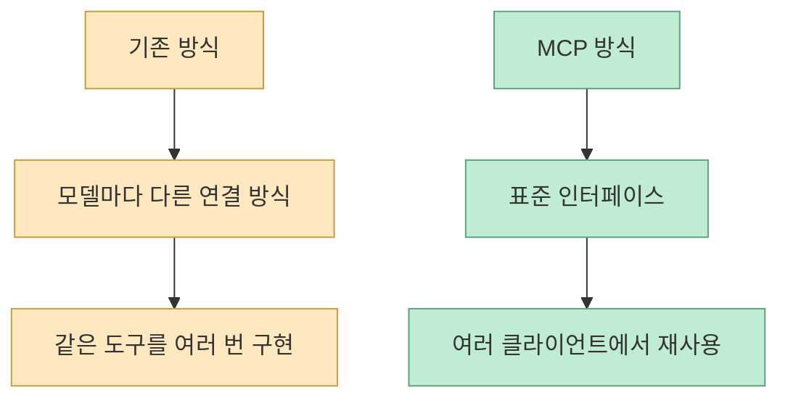
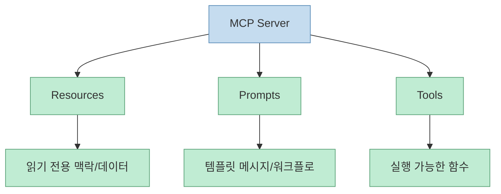
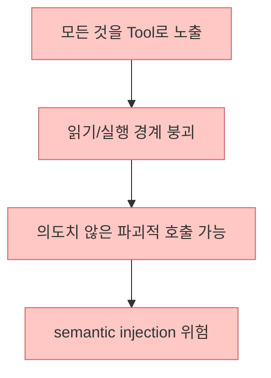
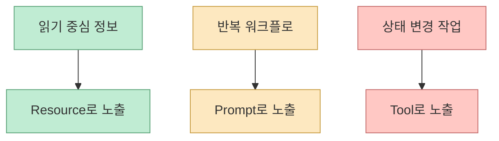
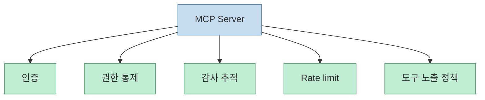

이 Shorts의 핵심은 “MCP 서버를 하나 만들었더니 보안팀에 불려갔다”는 자극적인 제목에 있지 않습니다. 진짜 중요한 메시지는, **MCP를 그냥 LLM용 함수 호출 래퍼로 보면 설계와 보안 모두에서 큰 사고가 난다** 는 점입니다. 자막은 MCP가 단순한 함수 호출 방식이 아니라 표준이며, 그래서 위협 모델도 가치도 새로워진다고 설명합니다. [영상 0:00](https://www.youtube.com/watch?v=gEcoswh9sCs&t=0)

짧은 영상이지만 문제의식은 꽤 선명합니다. MCP는 “도구를 하나 더 붙이는 방식”이 아니라, **도구·데이터·워크플로를 AI 클라이언트에 표준 방식으로 노출하는 프로토콜 계층** 입니다. 그리고 바로 그 표준성 때문에, 한 번 잘못 열어 두면 사고 범위도 같이 커집니다.

<!--more-->

## Sources

- [YouTube Shorts - 사내 DB를 AI에게 직접 열어줬더니, 보안팀에 호출됐습니다 (MCP 서버 구축)](https://youtube.com/shorts/gEcoswh9sCs?si=80Pjf3KZZY9ujFua)
- [Anthropic Docs - What is the Model Context Protocol (MCP)?](https://docs.anthropic.com/en/docs/agents-and-tools/mcp)
- [MCP Specification](https://modelcontextprotocol.io/specification/2025-06-18)
- [MCP Server Concepts](https://modelcontextprotocol.io/docs/learn/server-concepts)
- [MCP Resources Spec](https://modelcontextprotocol.io/specification/2025-06-18/server/resources)
- [MCP Tools Spec](https://modelcontextprotocol.io/specification/2025-06-18/server/tools)
- [MCP Prompts Spec](https://modelcontextprotocol.io/specification/2025-06-18/server/prompts)
- [Anthropic - Introducing the Model Context Protocol](https://www.anthropic.com/news/model-context-protocol)

## 1. MCP의 첫 번째 가치는 “새 기능”이 아니라 “표준”이다

자막은 기존에는 LLM마다 도구 연결 방식이 달라서, 같은 사내 DB 도구를 OpenAI용, 다른 클라이언트용으로 두 번 만들어야 했다고 말합니다. MCP는 이것을 통일했고, Claude Desktop, Cursor, OpenAI 등 MCP를 지원하는 모든 클라이언트에서 그대로 동작한다고 설명합니다. [영상 0:12](https://www.youtube.com/watch?v=gEcoswh9sCs&t=12) [영상 0:22](https://www.youtube.com/watch?v=gEcoswh9sCs&t=22)

Anthropic 공식 문서도 MCP를 AI 애플리케이션과 외부 시스템을 연결하는 **open-source standard** 라고 설명합니다. 또한 “USB-C for AI applications”라는 비유를 사용합니다. [Anthropic MCP](https://docs.anthropic.com/en/docs/agents-and-tools/mcp)

즉 MCP의 진짜 가치는 “도구를 더 쉽게 연결한다”가 아니라, **한 번 만든 연결을 여러 AI 클라이언트에 공통 자산처럼 노출할 수 있게 만든다** 는 데 있습니다.

## 2. 그래서 위험도 달라진다: 표준이 되면 사고도 범용화된다

영상은 “그래서 위협도 가치도 새로워요”라고 말합니다. [영상 0:09](https://www.youtube.com/watch?v=gEcoswh9sCs&t=9) 이 표현은 꽤 정확합니다. 표준이 되면 좋은 점은 분명하지만, 동시에 한 번 잘못 만든 서버는 **모든 MCP 호환 클라이언트에서 재사용되는 위험한 관문** 이 될 수 있기 때문입니다.

Anthropic의 MCP 소개 글도 MCP를 secure, two-way connections를 만드는 표준으로 설명하지만, 보안이 자동으로 생긴다고 말하지는 않습니다. [Anthropic News](https://www.anthropic.com/news/model-context-protocol)

즉 표준은 보안을 대신해 주지 않습니다. 오히려 표준이 되면:

- 연결면이 넓어지고
- 재사용성이 커지고
- 잘못된 서버 하나의 영향 범위가 커집니다

이 점을 먼저 이해해야 합니다.

## 3. 영상의 핵심 통찰은 MCP의 세 primitive 분리에 있다

설명란은 MCP가 `tool`, `resource`, `prompt`의 세 primitive 분리로 권한 통제를 가능하게 한다고 적습니다. [영상 설명란](https://youtube.com/shorts/gEcoswh9sCs?si=80Pjf3KZZY9ujFua)

자막도 같은 점을 강조합니다. MCP가 도구를 세 가지로 분리한 설계는 권한 통제의 단위를 다르게 가져가기 위한 분리라고 설명합니다. AI가 자유롭게 읽는 것은 허용하되, 실행은 제한적으로 두는 정책이 자연스러워진다고 말합니다. [영상 0:31](https://www.youtube.com/watch?v=gEcoswh9sCs&t=31)

공식 specification도 서버 기능을 다음처럼 나눕니다.

- `Resources`: 모델이나 사용자가 읽을 맥락/데이터
- `Prompts`: 사용자용 템플릿 메시지와 워크플로
- `Tools`: 모델이 실행할 함수

[MCP Specification](https://modelcontextprotocol.io/specification/2025-06-18) [Resources](https://modelcontextprotocol.io/specification/2025-06-18/server/resources) [Prompts](https://modelcontextprotocol.io/specification/2025-06-18/server/prompts) [Tools](https://modelcontextprotocol.io/specification/2025-06-18/server/tools)

이 분리는 단순 분류가 아닙니다. **읽을 수 있는 것과 실행할 수 있는 것을 같은 채널에 섞지 않기 위한 설계** 입니다.

## 4. 모든 것을 tool로 노출하면 “읽기”와 “실행”의 경계가 사라진다

자막은 이 분리를 무시하고 모든 작업을 tool로 노출하면 사고가 일어난다고 경고합니다. 특히 read-only 작업만이라는 원칙이 깨지면, AI가 select 용도로 만든 도구로 drop table 같은 호출을 하게 된다고 설명합니다. [영상 0:44](https://www.youtube.com/watch?v=gEcoswh9sCs&t=44) [영상 0:51](https://www.youtube.com/watch?v=gEcoswh9sCs&t=51)

여기서 영상은 이를 SQL injection과는 다른 종류의 **의미적 인젝션** 이라고 부릅니다. [영상 0:58](https://www.youtube.com/watch?v=gEcoswh9sCs&t=58)

이 표현은 실무적으로 꽤 유용합니다. SQL injection은 문자열이 의도치 않게 쿼리 구조를 바꾸는 문제고, 여기서 말하는 semantic injection은 **모델이 읽기 도구와 실행 도구의 의미적 경계를 잘못 넘는 문제** 에 더 가깝습니다.

즉 read-only 데이터를 굳이 tool로 만들 필요가 있는지, resource로 노출하면 되는지부터 다시 생각해야 합니다.

## 5. “AI가 자유롭게 읽는 건 오케이, 실행은 제한적으로”라는 정책이 왜 자연스러운가

영상이 짚는 설계 감각은 단순하지만 중요합니다. 읽기와 실행을 분리하면, “AI가 자유롭게 읽는 건 오케이, 실행은 제한적으로”라는 정책이 자연스럽게 만들어진다는 것입니다. [영상 0:38](https://www.youtube.com/watch?v=gEcoswh9sCs&t=38)

이건 보안팀 시각에서도 설득력이 있습니다.

- DB schema, 제품 카탈로그, 매뉴얼 같은 것은 resource
- 반복적인 안전 워크플로는 prompt
- 실제 쓰기·삭제·결제·변경은 tool

처럼 나눠야 권한 정책이 깔끔해집니다.

이렇게 나누면 “읽기 권한은 넓게, 실행 권한은 좁게”라는 원칙이 기술 구조와 바로 맞물립니다.

## 6. 방어는 모델이 아니라 tool 단계에서 시작해야 한다

자막은 “방어는 툴 단계에서 시작해요”라고 말합니다. [영상 1:01](https://www.youtube.com/watch?v=gEcoswh9sCs&t=61) 이건 상당히 중요한 원칙입니다.

모델에게 “조심해라”, “파괴적 명령은 하지 마라”라고 프롬프트를 넣는 것은 필요할 수 있지만, 그건 마지막 보조선에 가깝습니다. 실제 방어선은:

- 애초에 어떤 capability를 노출할지
- 읽기와 쓰기를 어떻게 분리할지
- destructive tool을 만들지 말지
- tool parameter를 어떻게 제한할지

에서 결정됩니다.

즉 보안은 prompt layer보다 **tool design layer** 에서 먼저 시작해야 합니다.

## 7. MCP 서버는 사실상 “새로운 API 게이트웨이”처럼 다뤄야 한다

영상 후반의 가장 중요한 문장은 이것입니다. 핵심은 MCP 서버를 새로운 API 게이트웨이로 인식하는 것이라고 말합니다. 그리고 인증, rate limit, 감사 추적, 권한 통제, REST API에서 했던 모든 보안 고민을 처음부터 다시 해야 한다고 설명합니다. [영상 1:03](https://www.youtube.com/watch?v=gEcoswh9sCs&t=63) [영상 1:11](https://www.youtube.com/watch?v=gEcoswh9sCs&t=71)

이 비유는 실무적으로 매우 정확합니다. MCP 서버는 단순 라이브러리가 아니라:

- 인증 경계
- 권한 경계
- 감사 경계
- 호출 경계

를 새로 만드는 진입점입니다.

즉 REST API를 설계할 때 하던 사고방식을 버리면 안 됩니다. 오히려 더 세밀하게 다시 가져와야 합니다.

## 8. 그럼에도 결국 MCP의 진짜 가치는 “한 번 만들어 여러 LLM에 노출하는 표준성”이다

영상 마지막은 다시 표준성으로 돌아옵니다. 진짜 가치는 한 번 만든 MCP 서버를 모든 MCP 호환 클라이언트에서 재사용 가능하다는 데 있다고 말합니다. 사내 도구를 한 곳에서 만들고 모든 LLM에 노출시킬 수 있다는 것입니다. [영상 1:19](https://www.youtube.com/watch?v=gEcoswh9sCs&t=79) [영상 1:28](https://www.youtube.com/watch?v=gEcoswh9sCs&t=88)

이 장점은 매우 큽니다.

- 도구 구현 중복 감소
- 클라이언트 교체 비용 감소
- 사내 표준 인터페이스 형성
- LLM 벤더 락인 완화

즉 보안 사고만 잘 다루면, MCP는 단순한 편의성 도구가 아니라 **조직 내부 AI 인터페이스 표준** 이 될 수 있습니다.

## 핵심 요약

- 이 Shorts는 MCP를 단순 함수 호출 래퍼가 아니라 **도구 표준 프로토콜** 로 봐야 한다고 말합니다. 
- MCP의 핵심 primitive는 `resources`, `prompts`, `tools`이며, 이 분리는 곧 권한 분리 구조입니다. 
- 모든 것을 tool로 노출하면 읽기와 실행의 경계가 무너져 semantic injection 같은 위험이 커집니다. 
- read-only 정보는 resource, 반복 워크플로는 prompt, 상태 변경 작업은 tool로 나누는 사고가 자연스럽습니다. 
- MCP 서버는 사실상 새로운 API 게이트웨이이므로 인증, 권한, 감사, rate limit 등 기존 API 보안 사고를 그대로 다시 적용해야 합니다. 
- 그럼에도 진짜 가치는 한 번 만든 서버를 여러 MCP 호환 LLM 클라이언트에 재사용할 수 있는 표준성에 있습니다.

## 결론

MCP를 “AI에게 함수 몇 개 더 붙이는 방식”으로 이해하면 설계가 단순해 보이지만, 실제로는 가장 위험한 오해일 수 있습니다. MCP는 도구, 데이터, 워크플로를 AI 클라이언트에 연결하는 표준 계층이고, 그래서 잘 설계하면 조직 전체의 공통 인터페이스가 되지만, 잘못 설계하면 조직 전체의 공통 취약점이 됩니다.

결국 중요한 질문은 영상 마지막 문장 그대로입니다. **당신의 MCP 서버를 AI에게 어디까지 열어 줄 것인가? 그리고 그 권한은 누가 정의할 것인가?** 이 질문에 구조적으로 답할 수 있을 때만 MCP는 편리한 연결 방식이 아니라, 안전한 표준이 됩니다.
