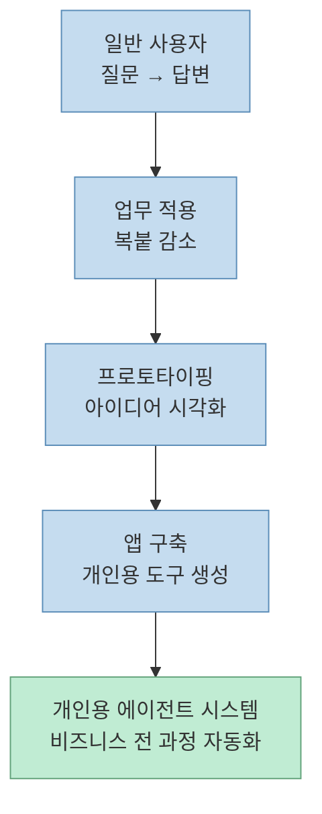
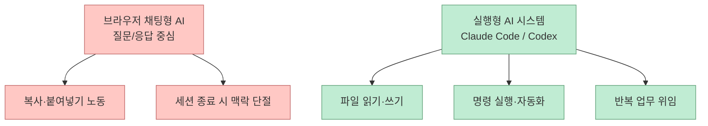
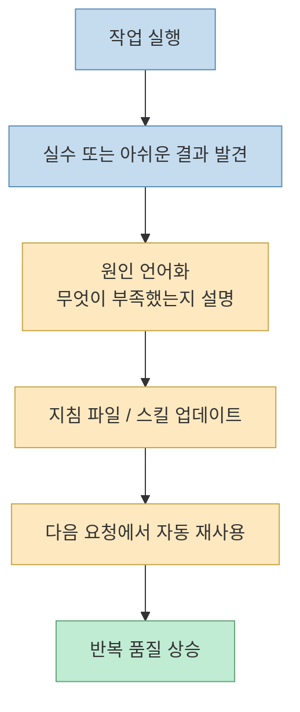
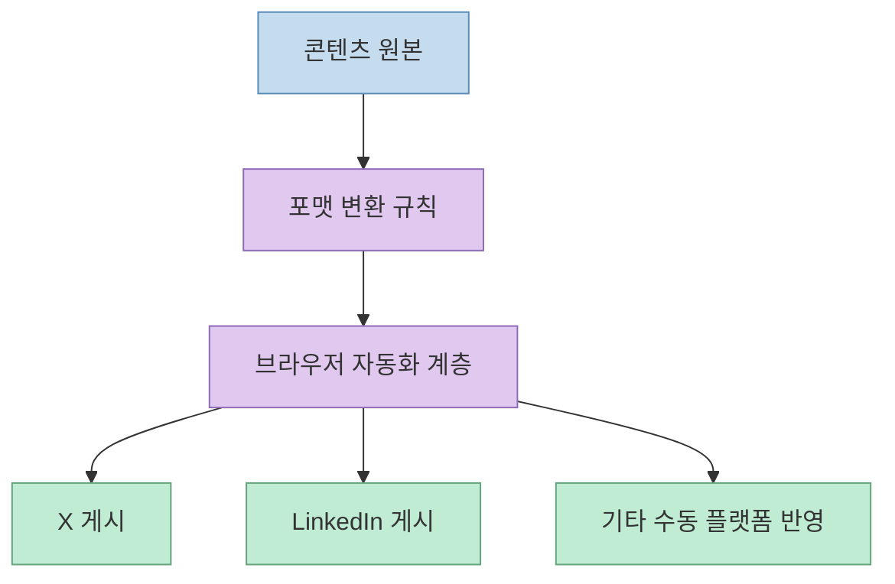
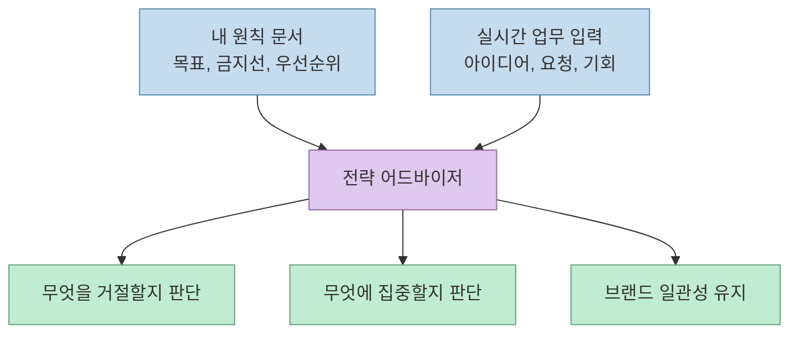
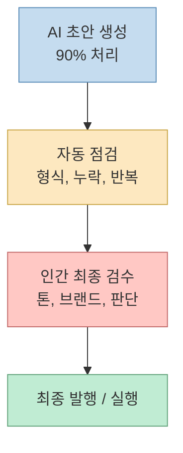
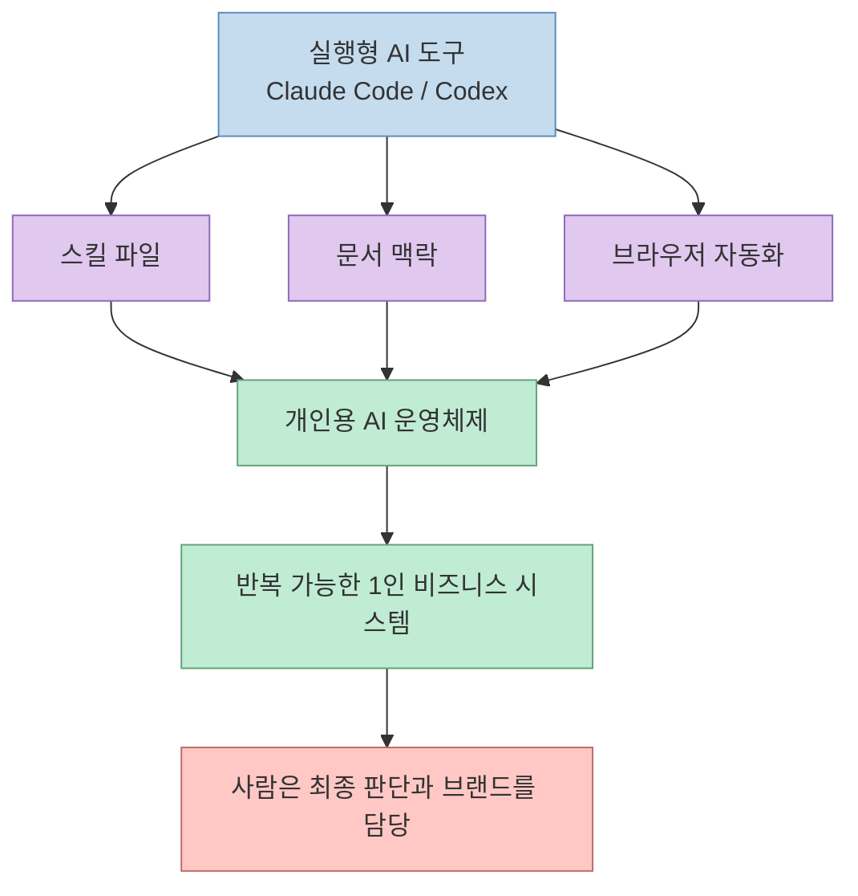

> 소스: <https://youtube.com/shorts/uYz6nqnQSMc?si=vJXGIusIeU9r8CPo> 
> 교차 참고: <https://code.claude.com/docs/en/overview>, <https://support.claude.com/en/articles/10185728-understanding-claude-s-personalization-features>, <https://openai.com/index/introducing-codex/>

짧은 영상의 메시지는 단순합니다. 
**AI를 잘 쓰는 사람** 과 **AI로 시스템을 만든 사람** 은 완전히 다르다는 것입니다. 

영상은 메타 출신 제품 리더 **피터 양(Peter Yang)** 의 사례를 가져와, 왜 많은 사람이 아직도 AI를 "질문-답변용 채팅창" 수준에서만 쓰는지 설명합니다. 그리고 거기서 한 단계가 아니라 다섯 단계 위로 올라가려면, 결국 **개인용 AI 운영체제** 를 만들어야 한다고 주장합니다.

<!--more-->

## 한 줄 요약

이 영상이 말하는 핵심은 이것입니다. 
**챗봇을 잘 다루는 것이 아니라, 내 업무 철학·지침·문서·브라우저 작업·최종 검수 루프까지 묶은 실행 시스템을 만들어야 한다** 는 것입니다.

## 왜 "채팅창을 끄라"는 말이 나오나

영상에서 가장 먼저 강조하는 건 **단순 채팅창에서 벗어나라** 는 점입니다. 
여기서 말하는 채팅창은 질문 몇 번 던지고 답을 복사해서 가져오는 사용 방식입니다.

하지만 피터 양식 활용은 다릅니다.

- Claude Code나 Codex 같은 **실행형 도구** 를 쓴다
- 문서를 읽고, 파일을 수정하고, 앱 사이를 오간다
- 내가 자는 동안에도 반복 작업을 맡길 수 있다

Anthropic은 Claude Code를 단순 Q&A 도구가 아니라, **코드베이스를 읽고 파일을 수정하고 명령을 실행하며 개발 도구와 통합하는 에이전트형 코딩 툴** 로 설명합니다.citeturn0view0 OpenAI도 Codex를 **잘게 나뉜 반복 업무를 비동기적으로 위임하는 방향** 으로 소개합니다.citeturn1view1

즉, 영상의 메시지는 과장이 아니라 이미 제품 방향과도 맞아 있습니다. 
중요한 것은 모델 이름이 아니라 **실행 표면** 입니다.

## 1. 스스로 똑똑해지는 스킬 엔진

영상의 두 번째 핵심은 **실수할 때마다 AI를 꾸짖지 말고, 그 실수를 지침으로 바꿔라** 는 부분입니다.

이건 사실상 스킬 기반 운영입니다.

- 어떤 작업을 잘했는지 기록한다
- 어떤 실수를 반복했는지 기록한다
- 다음 실행 때 그 지침을 다시 불러온다

Anthropic 도움말도 Claude의 개인화 수단을 **계정 전체 지침, 프로젝트 지침, 스킬** 로 나눕니다. 특히 스킬은 **특정 행동, 전문성, 반복 가능한 패턴** 을 대화에 추가하는 장치라고 설명합니다.citeturn1view0

영상에서 말하는 "자가 진화형 스킬"은 결국 이런 흐름입니다.

여기서 포인트는 "좋은 프롬프트"가 아닙니다. 
**좋은 실패의 축적** 입니다.

## 2. API가 없어도 브라우저를 다루게 만들기

세 번째 포인트는 꽤 실무적입니다. 
영상은 API가 없는 플랫폼도 AI가 브라우저를 통해 통제하게 만들어야 한다고 말합니다.

이 말은 곧:

- 공식 API가 없는 곳도
- 사람이 하던 클릭 기반 업무를
- 브라우저 자동화 계층으로 넘길 수 있다는 뜻입니다

예를 들어:

- X에 글 발행
- 링크드인용 포맷 변환
- 문서 복사/배치
- 여러 사이트를 오가는 수작업

물론 이건 그냥 "마구 클릭하게 한다"는 뜻은 아닙니다. 
브라우저 자동화는 정책 변화, 로그인, 차단, 권한, 실패 복구까지 고려해야 합니다. 그래서 이 단계부터는 단순 프롬프트보다 **하네스와 운영 규칙** 이 훨씬 중요해집니다.

## 3. 내 철학이 담긴 문서를 전략 어드바이저에 연결하기

이 대목이 가장 중요합니다. 
영상은 **비즈니스 목표와 원칙이 담긴 구글 문서** 를 전략 어드바이저에게 연결하라고 말합니다.

이건 곧 AI를 단순 생성기가 아니라 **판단 시스템** 으로 바꾸는 일입니다.

Anthropic 문서에서도 프로젝트 지침은 다음 용도로 쓰라고 설명합니다.

- 프로젝트별 맥락 제공
- 특정 워크플로 가이드 설정
- 역할이나 관점 정의
- 여러 대화에 걸쳐 일관된 기준 유지citeturn1view0

즉, AI가 더 똑똑해지는 게 아니라 **판단 기준이 더 일관돼지는 것** 입니다.

## 4. 마지막 10%는 여전히 사람이 한다

이 영상이 좋은 이유는, AI 만능론으로 가지 않기 때문입니다. 
마지막 다섯 번째 원칙은 분명합니다.

> 업무의 90%는 AI가 처리해도, 마지막 검수는 사람의 감성과 취향이 들어가야 한다

이건 콘텐츠뿐 아니라 제품, 세일즈, 브랜딩, 운영 문서 모두에 해당합니다.

OpenAI도 Codex 소개 글에서 사용자가 반드시 **출력 결과를 검토하고 검증해야 한다** 고 강조합니다.citeturn1view1

그래서 현실적인 구조는 아래에 가깝습니다.

## 이 영상을 실무에 옮기면 5단계 로드맵은 이렇게 바뀐다

영상 설명란에 적힌 5단계 로드맵을 더 실무적으로 번역하면 아래와 같습니다.

1. **질문형 사용** 
   그냥 물어본다
2. **업무 적용** 
   복붙과 반복 요약을 줄인다
3. **프로토타이핑** 
   아이디어를 문서나 화면으로 빠르게 만든다
4. **개인 앱 구축** 
   자주 하는 일을 아예 도구로 만든다
5. **개인용 에이전트 운영체제** 
   문서, 규칙, 자동화, 브라우저 작업, 검수 루프를 연결한다

여기서 4단계와 5단계 사이가 특히 큽니다. 
많은 사람이 "AI로 앱 하나 만들기"까지는 가도, **그 앱과 문서와 자동화와 판단 기준을 하나의 운영체계로 묶는 단계** 에서 멈춥니다.

## 결국 중요한 것은 모델이 아니라 운영체제다

이 영상은 Claude Code를 말하지만, 동시에 Codex 같은 다른 실행형 도구와도 통합니다. 
핵심은 특정 회사의 모델이 아니라, 아래 5개를 내가 갖췄느냐입니다.

- 실행형 표면
- 누적되는 스킬
- 브라우저/도구 자동화
- 내 철학이 담긴 기준 문서
- 인간 최종 검수

## 마무리

이 영상이 말하는 "다섯 가지 무적 공식"을 요약하면 멋진 프롬프트 5개가 아닙니다. 
오히려 정반대입니다.

**채팅을 잘하는 법을 넘어서, AI가 내 방식대로 일하게 만드는 운영 구조를 만들라** 는 이야기입니다.

그래서 이 메시지는 단기 생산성 팁이라기보다, 다음 질문으로 이어집니다.

- 내가 반복하는 업무는 무엇인가
- 그 업무의 품질 기준은 어디에 적혀 있는가
- 실패했을 때 지침으로 되돌리는 루프가 있는가
- 마지막 판단은 어디까지 사람 손을 남길 것인가

이 네 가지에 답하지 못하면 AI는 여전히 똑똑한 비서일 뿐입니다. 
답할 수 있다면, 그때부터는 **개인용 AI 운영체제** 가 됩니다.
