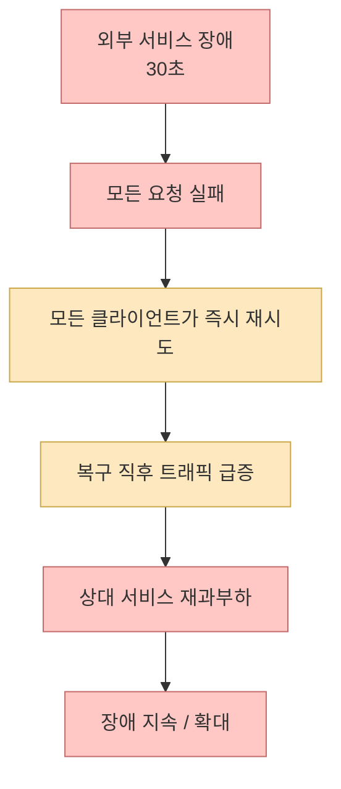
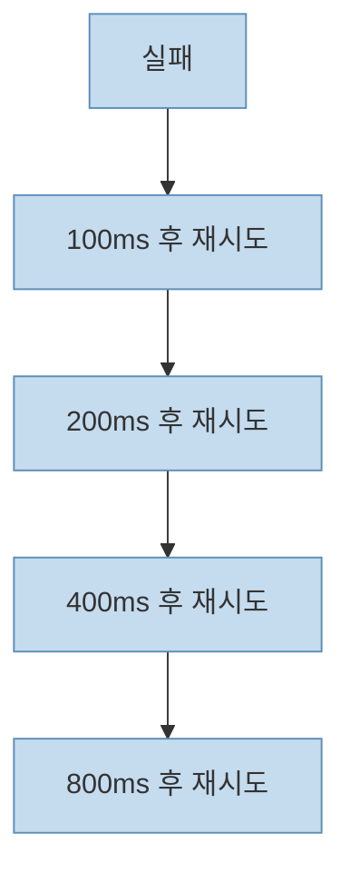
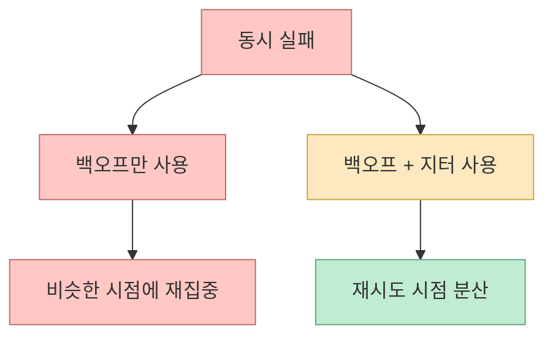
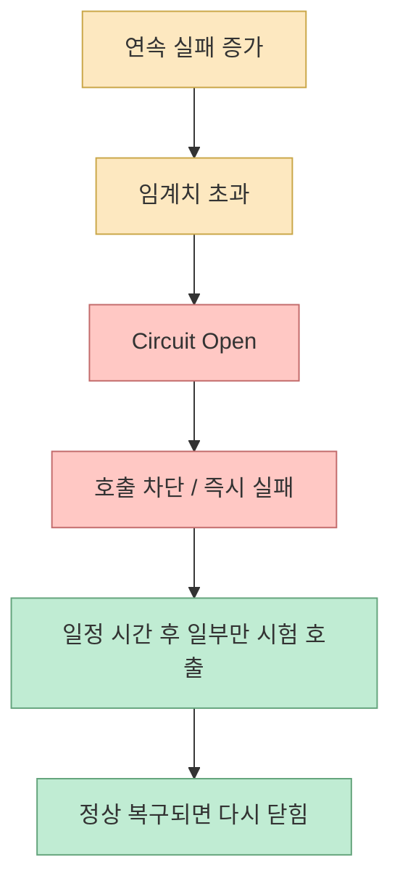
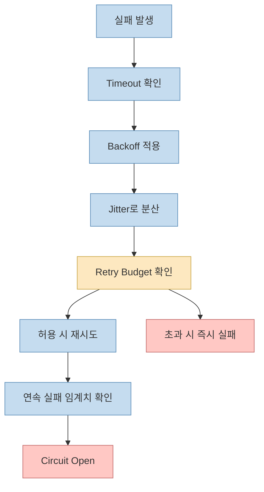

> 소스: <https://youtube.com/shorts/yVBvCO0RT0M?si=yMn12x9guE_DBZD5> 
> 참고: <https://aws.amazon.com/blogs/architecture/exponential-backoff-and-jitter/>, <https://aws.amazon.com/builders-library/timeouts-retries-and-backoff-with-jitter/>, <https://sre.google/sre-book/addressing-cascading-failures/>, <https://sre.google/sre-book/handling-overload/>, <https://martinfowler.com/bliki/CircuitBreaker.html>

외부 결제사가 30초 만에 살아났는데, 우리 서버는 10분을 더 죽어 있었다면 문제는 외부가 아니라 **우리 재시도 설계** 일 가능성이 큽니다. 
이번 Shorts의 핵심은 이것입니다.

> 재시도는 장애를 복구하는 도구이지만, 잘못 쓰면 장애를 증폭시키는 도구가 된다

<!--more-->

## 문제는 실패가 아니라 "동시 재시도"다

평소에는 재시도가 좋은 패턴처럼 보입니다.

- 한두 건 실패한다
- 몇 번 다시 시도한다
- 조용히 복구된다

하지만 외부 의존성이 통째로 잠깐 죽는 순간에는 상황이 바뀝니다.

- 모든 요청이 동시에 실패한다
- 모든 요청이 동시에 재시도한다
- 살아나던 상대 시스템에 다시 부하가 몰린다
- 복구 직후 다시 무너진다

이게 바로 **retry storm** 입니다.

## 왜 단순 재시도는 위험한가

가장 흔한 문제는 **모든 클라이언트가 같은 타이밍으로 움직인다** 는 점입니다.

예를 들어 요청 1만 개가 동시에 실패하고, 모두가:

- 1초 뒤 재시도
- 다시 실패하면 1초 뒤 재시도
- 총 3회 반복

을 하면 장애는 1번이지만 부하는 3배, 4배로 튈 수 있습니다. 
Google SRE는 이런 패턴이 **cascading failure** 로 이어질 수 있으므로, 재시도를 무한히 허용하지 말고 **retry budget** 같은 상한을 두라고 설명합니다. <https://sre.google/sre-book/addressing-cascading-failures/>

## 지수 백오프는 왜 필요한가

영상에서 말한 첫 번째 보완책은 **지수 백오프(exponential backoff)** 입니다.

이건 재시도 간격을 점점 늘리는 방식입니다.

- 1차 실패 후 100ms
- 2차 실패 후 200ms
- 3차 실패 후 400ms
- 4차 실패 후 800ms

AWS도 재시도에서 가장 흔한 패턴으로 지수 백오프를 설명합니다. <https://aws.amazon.com/builders-library/timeouts-retries-and-backoff-with-jitter/>

문제는 이것만으로는 부족하다는 점입니다. 
모든 클라이언트가 똑같이 100ms, 200ms, 400ms로 움직이면 **여전히 같은 순간에 몰립니다**.

## 지터는 왜 붙여야 하나

그래서 필요한 게 **지터(jitter)** 입니다. 
지터는 재시도 시간에 무작위 흔들림을 섞는 방식입니다.

예를 들면:

- 어떤 클라이언트는 180ms
- 어떤 클라이언트는 240ms
- 어떤 클라이언트는 320ms

처럼 서로 다른 시점에 다시 때리게 됩니다.

AWS Architecture Blog는 백오프만 쓰는 것보다 **jitter를 함께 써야 충돌과 낭비를 줄일 수 있다** 고 설명합니다. <https://aws.amazon.com/blogs/architecture/exponential-backoff-and-jitter/>

즉, 백오프는 **간격을 늘리는 장치** 고, 지터는 **타이밍을 흩는 장치** 입니다.

## 그래도 총량은 못 줄인다

여기서 중요한 포인트가 하나 더 있습니다. 
영상도 정확히 짚었듯이 **백오프와 지터는 재시도 타이밍을 분산할 뿐, 총 재시도 수 자체는 줄이지 못합니다.**

즉:

- 1만 요청이 3번씩 재시도하면
- 총량은 여전히 3만 번입니다

그래서 진짜 중요한 질문은:

> 언제 다시 시도할 것인가  
> 가 아니라  
> 언제 재시도를 멈출 것인가

입니다.

## 서킷 브레이커는 "일단 멈추는 장치"다

영상의 다음 해법은 **circuit breaker** 입니다.

Martin Fowler의 설명대로, 서킷 브레이커는 실패를 감시하다가 임계치를 넘으면 회로를 열고, 이후 호출을 실제 대상에게 보내지 않고 즉시 실패시킵니다. <https://martinfowler.com/bliki/CircuitBreaker.html>

즉:

- 상대가 계속 죽어 있으면
- 더 때리지 말고
- 일정 시간 동안 호출을 막는다

는 뜻입니다.

서킷 브레이커의 핵심은 **상대가 회복할 시간을 벌어 주는 것** 입니다. 
재시도를 잘하는 시스템보다, **잘 멈추는 시스템** 이 더 안정적일 수 있습니다.

## 재시도 예산은 "비율 상한"을 두는 발상이다

영상에서 나온 또 하나의 좋은 표현이 **retry budget** 입니다.

Google SRE는 과부하 상황에서 **클라이언트별 재시도 비율에 상한을 두는 방식** 을 설명합니다. 예시로 재시도 비율이 10%를 넘지 않게 제한하는 개념이 나옵니다. <https://sre.google/sre-book/handling-overload/>

이게 중요한 이유는:

- 평소에는 소량 재시도를 허용하되
- 장애 중에는 재시도가 시스템 전체를 압도하지 못하게
- 비율 차원에서 막을 수 있기 때문입니다

즉, retry budget은 "최대 3번 재시도" 같은 고정 규칙보다 더 운영 친화적입니다.

## 실무에서는 네 가지를 같이 봐야 한다

이번 영상은 짧지만 설계 포인트를 꽤 정확하게 짚습니다. 
실무적으로는 아래 네 개를 같이 가져가는 편이 안전합니다.

1. **timeout** 
   너무 오래 기다리지 않는다
2. **backoff** 
   재시도 간격을 늘린다
3. **jitter** 
   재시도 시점을 흩는다
4. **circuit breaker / retry budget** 
   총량을 통제하고 멈출 줄 안다

## 이 영상의 핵심 문장을 다시 쓰면

영상은 "안정성은 재시도 횟수가 아니라 재시도를 멈출 줄 아는 설계에서 나온다"고 말합니다. 
이걸 조금 더 실무적으로 바꾸면 이렇게 말할 수 있습니다.

> 재시도는 복구 전략이 아니라 부하 증폭기일 수도 있다  
> 그래서 좋은 복원력은 많이 다시 시도하는 데서가 아니라  
> 언제, 얼마나, 누구에게, 어떤 속도로 다시 시도할지 제한하는 데서 나온다

## 마무리

외부 장애가 30초였는데 우리 장애가 10분이었던 이유는 종종 간단합니다. 
우리가 **살아나는 시스템을 도와준 게 아니라, 재시도로 다시 눌러버렸기 때문** 입니다.

그래서 재시도 설계에서 꼭 기억할 건 네 가지입니다.

- 백오프 없이 재시도하지 말 것
- 지터 없이 백오프하지 말 것
- 예산 없이 재시도 총량을 풀어두지 말 것
- 서킷 브레이커 없이 상대를 무한정 두드리지 말 것

짧은 장애를 긴 장애로 바꾸는 건 외부 장애가 아니라, 대개 우리 쪽의 **무제한 친절함** 입니다.
