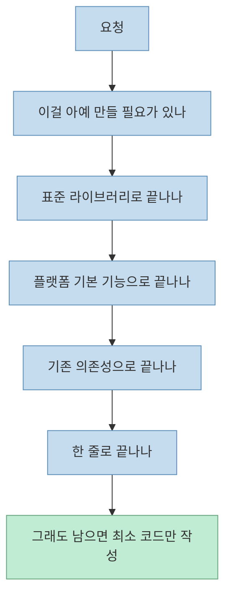
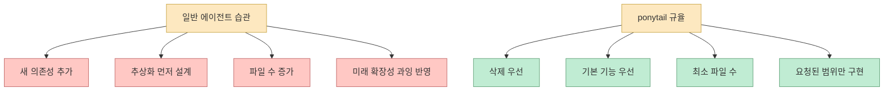
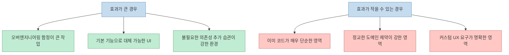
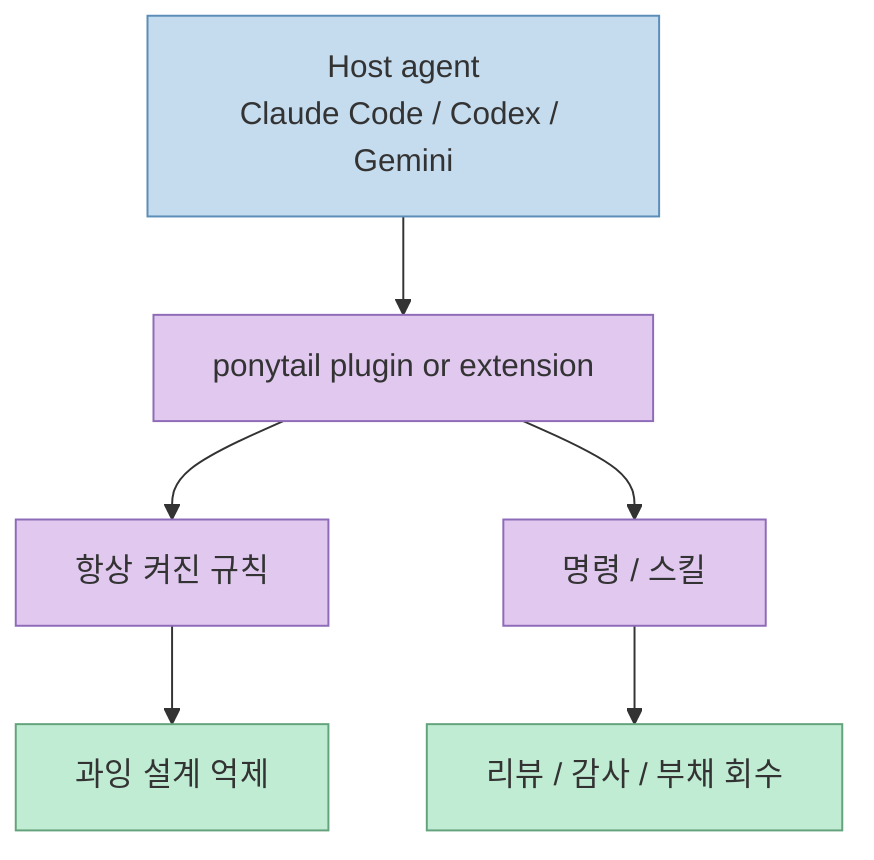

`ponytail`이 흥미로운 이유는 새 모델이나 새 에이전트를 내세우지 않기 때문입니다. 
오히려 정반대입니다. 
이미 있는 Claude Code, Codex, Gemini 같은 에이전트 위에 얇은 규율층을 하나 더 얹어서, **과하게 만드는 습관 자체를 줄이려는 도구** 입니다.

프로젝트의 한 줄 슬로건은 아주 직설적입니다. 
**"The best code is the code you never wrote."**

<!--more-->

## Sources

- <https://github.com/DietrichGebert/ponytail>

## ponytail은 무엇인가

README가 설명하는 ponytail의 핵심 캐릭터는 “아무 말 없이 50줄을 1줄로 줄이는 오래된 시니어 개발자”입니다. 저장소는 이를 **AI agent 안에 그 시니어 개발자를 집어넣는 것** 으로 묘사합니다. GitHub README는 실제로 “date picker를 요청하면 flatpickr를 깔고 wrapper를 만들고 timezone 토론을 시작하는 대신, 브라우저에 이미 있는 `<input type="date">`를 쓰게 만든다”고 예를 듭니다. <https://github.com/DietrichGebert/ponytail>

즉 ponytail은 다음을 목표로 하지 않습니다.

- 더 화려한 코드 생성
- 더 큰 아키텍처
- 더 많은 추상화

대신 다음을 강제합니다.

- 정말 새로 만들어야 하는지 먼저 확인
- 이미 있는 표준 기능이 있는지 확인
- 네이티브 플랫폼 기능으로 끝낼 수 있는지 확인
- 이미 설치된 의존성으로 해결 가능한지 확인
- 그래도 필요할 때만 최소 코드 작성

## 이 프로젝트의 핵심은 "게으름"이 아니라 "효율 우선 규율"이다

`AGENTS.md`에 적힌 ponytail의 본체는 생각보다 짧습니다. 
거기서 lazy는 careless가 아니라 **efficient** 라고 못 박습니다. 그리고 코드를 쓰기 전에 멈춰야 할 사다리를 제시합니다.

1. 이걸 정말 만들어야 하나
2. 표준 라이브러리가 이미 하나
3. 네이티브 플랫폼 기능이 이미 하나
4. 이미 설치된 dependency가 있나
5. 한 줄로 끝낼 수 있나
6. 그래도 필요하면 최소 코드만 쓴다

여기에 추가 규칙도 붙습니다.

- 요청하지 않은 추상화 금지
- 피할 수 있으면 새 dependency 금지
- 아무도 요청하지 않은 boilerplate 금지
- 추가보다 삭제 우선
- 복잡한 요청은 되물어 보기
- 단순화했으면 `ponytail:` 주석으로 ceiling과 upgrade path를 남기기
- 사소한 원라이너가 아니면 최소 runnable check 하나는 남기기

이 지점이 중요합니다. 
ponytail은 “짧게 쓰기”가 아니라 **과잉 설계 방지 정책** 에 가깝습니다.

## "코드를 적게 쓴다"와 "위험하게 대충 쓴다"는 다르다

README가 반복해서 강조하는 문장이 하나 있습니다. 
목표는 **fewest tokens** 가 아니라 **write only what the task needs** 라는 점입니다.

즉 ponytail은 아래 항목을 잘라내지 않는다고 주장합니다.

- validation
- error handling
- security
- accessibility

이 부분이 중요합니다. 
짧은 코드는 두 종류가 있습니다.

- 필요한 것을 다 하면서 짧은 코드
- 필요한 것도 빠뜨리고 짧은 코드

ponytail은 전자를 지향한다고 말합니다. README는 단순히 “one-liner처럼 써라”는 프롬프트는 safety guard 하나를 떨궈버리지만 ponytail은 안전 가드를 유지했다고 설명합니다. 다만 이 수치는 저장소 작성자가 공개한 **self-reported benchmark** 이므로 그대로 절대값처럼 받아들이기보다는, **과잉 생성 억제 방향성** 을 보여주는 자료로 보는 편이 안전합니다. <https://github.com/DietrichGebert/ponytail>

## 벤치마크는 무엇을 주장하나

README 기준으로 ponytail은 실제 Claude Code 세션에서 같은 작업을 no-skill baseline과 비교했다고 설명합니다.

핵심 수치는 이렇습니다.

- LOC 약 54% 감소
- tokens 약 22% 감소
- cost 약 20% 감소
- time 약 27% 감소
- safety 100%

또한 예전 단발성 수치인 `80~94% less code`는 flat한 평균이 아니라, **오버빌드가 심한 작업에서의 ceiling에 가까운 값** 이라고 다시 정정해 놓았습니다.

이 대목은 꽤 신뢰를 주는 편입니다. 
숫자를 부풀리기보다 “초기 수치가 너무 납작하게 읽혔다, 공정한 agentic baseline과 비교하면 평균은 약 54%”라고 다시 설명하기 때문입니다.

하지만 이 역시 프로젝트 내부 벤치마크입니다. 
실전에서는 아래에 따라 체감 차이가 커질 수 있습니다.

- 원래 에이전트가 얼마나 과잉 설계를 자주 하는지
- 이미 코드베이스가 얼마나 미니멀한지
- 팀이 native feature를 얼마나 허용하는지
- 테스트와 접근성 요구사항이 얼마나 강한지

## 설치 방식이 흥미로운 이유

ponytail은 단일 호스트에 묶여 있지 않습니다. 
README 기준으로 다음 같은 표면을 지원합니다.

- Claude Code
- Codex
- GitHub Copilot CLI
- Gemini CLI
- Antigravity CLI
- pi agent harness
- OpenCode 계열 릴리스

즉 이 프로젝트는 “어떤 모델이 최고냐”보다 **어떤 host agent 위에 같은 규율을 주입할 수 있느냐** 를 더 중요하게 봅니다.

특히 Claude Code와 Codex 쪽에서는:

- 플러그인 마켓플레이스 추가
- 플러그인 설치
- 훅 신뢰
- 새 스레드 시작

같은 흐름을 요구합니다.

이건 그냥 프롬프트 붙여넣기와 다릅니다. 
세션 전체에 항상 켜지는 규율과, 필요 시 호출하는 skill/command가 함께 들어갑니다.

## 명령 세트는 "짧게 쓰기"보다 "과잉을 감시하기"에 가깝다

README의 명령 세트를 보면 ponytail의 정체가 더 분명해집니다.

- `/ponytail [lite|full|ultra|off]`
- `/ponytail-review`
- `/ponytail-audit`
- `/ponytail-debt`
- `/ponytail-gain`
- `/ponytail-help`

이걸 보면 ponytail은 단순 스타일 프롬프트가 아니라, **운영 가능한 규율 계층** 입니다.

특히 중요한 건:

- 현재 diff를 보고 over-engineering delete-list를 제안하는 review
- 저장소 전체를 훑는 audit
- 나중으로 미룬 단순화 포인트를 debt ledger로 쌓는 방식

입니다.

즉 ponytail의 관심사는 “지금 짧게 써”가 아니라:

- 지금 과하게 쓴 게 무엇인지 찾고
- 나중에 줄일 목록을 남기고
- 전체 저장소 차원에서 과잉을 감시하는 것

에 더 가깝습니다.

## 이 프로젝트가 실제로 잘 맞는 팀

ponytail은 모든 팀에 만능은 아닙니다. 
하지만 다음 같은 팀에는 특히 잘 맞습니다.

### 1. AI가 늘 의존성을 너무 쉽게 추가하는 팀

조금만 UI가 복잡해도 라이브러리를 하나 더 붙이는 습관이 있는 경우 ponytail이 큰 제동 장치가 됩니다.

### 2. 작은 기능도 과하게 추상화되는 팀

“언젠가 필요할 수도 있으니 미리 깔아두자” 식 코드를 많이 만드는 환경일수록 효과가 큽니다.

### 3. 에이전트가 생성한 diff가 지나치게 큰 팀

작은 수정인데도 수십 파일을 건드리는 패턴을 줄이는 데 도움됩니다.

### 4. 기본 플랫폼 기능을 적극 활용할 수 있는 제품

예를 들어 date, color, file, dialog, form validation 등에서 네이티브 기능을 충분히 활용할 수 있다면 ponytail의 철학이 잘 먹힙니다.

## 반대로 조심할 점도 있다

이 프로젝트를 그대로 만능 규칙처럼 받아들이면 안 되는 이유도 있습니다.

### 1. "덜 만든다"가 "덜 검증한다"로 오해될 수 있다

README는 분명히 trivial one-liner가 아니면 최소 runnable check를 남기라고 말합니다. 
즉 테스트를 줄이라는 도구가 아닙니다.

### 2. 네이티브 기능이 항상 정답은 아니다

`<input type="date">` 같은 예시는 설득력이 있지만, 실제 제품 요구사항이 복잡하면 커스텀 컴포넌트가 필요할 수 있습니다.

### 3. 벤치마크는 저장소 작성자의 통제된 환경이다

실제 조직 코드베이스에서는 보안, 디자인 시스템, 레거시 제약, 브라우저 지원 범위 때문에 체감 효율이 달라질 수 있습니다.

### 4. 항상 켜진 규칙은 팀 문화와 충돌할 수 있다

어떤 팀은 “삭제 우선, boring over clever”를 사랑하지만, 어떤 팀은 특정 abstraction policy가 더 중요할 수 있습니다.

## 결국 ponytail은 "스킬"이 아니라 "개입하는 심사역"에 가깝다

이 프로젝트를 가장 잘 설명하는 방식은 "코드 줄여주는 스킬"이 아닙니다. 
오히려:

- 먼저 만들지 말라고 묻고
- 꼭 필요하면 더 작은 해법을 우선 제안하고
- 이미 작성된 diff를 다시 감사하고
- 나중에 줄여야 할 기술 부채까지 기록하는

**항상 켜진 시니어 심사역** 에 가깝습니다.

그래서 ponytail이 빨리 퍼지는 이유도 이해할 수 있습니다. 
지금 많은 팀이 원하는 건 “더 많이 생성하는 AI”가 아니라, **생성 과잉을 줄여 주는 제동 장치** 이기 때문입니다.

## 핵심 요약

- ponytail의 핵심 철학은 **The best code is the code you never wrote**
- 새 모델이 아니라 기존 에이전트 위에 얹는 **규율 계층** 이다
- YAGNI, stdlib 우선, native feature 우선, dependency 재사용, one-line 우선 같은 사다리를 강제한다
- 목표는 단순한 terseness가 아니라 **과잉 설계 억제** 다
- self-reported benchmark 기준으로 LOC, tokens, cost, time을 모두 줄였다고 주장하지만, 수치는 실전 코드베이스에 따라 달라질 수 있다
- review, audit, debt 같은 명령 때문에 이 프로젝트는 프롬프트보다 **운영 도구** 에 가깝다

## 결론

ponytail이 흥미로운 이유는 AI를 더 공격적으로 만들지 않기 때문입니다. 
오히려 AI가 이미 너무 쉽게 만들어 버리는 시대에, **덜 만들고 덜 붙이고 덜 추상화하게 만드는 방향** 으로 움직입니다.

그래서 이 프로젝트는 “성능 향상 플러그인”이라기보다, **AI 코딩 시대의 YAGNI 하네스** 라고 보는 편이 더 정확합니다.
