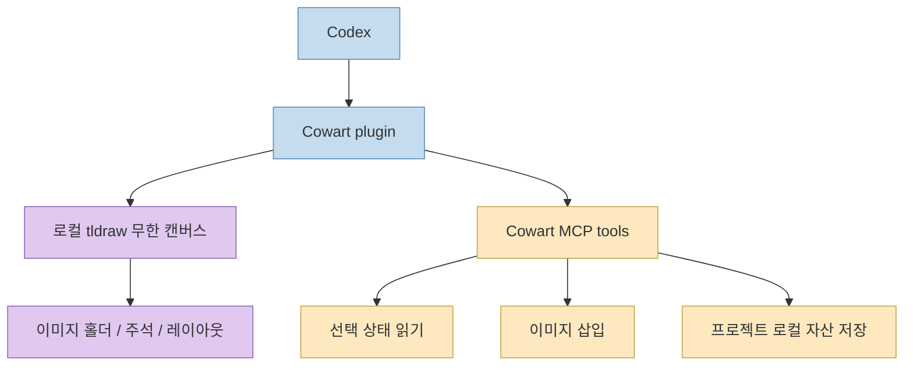
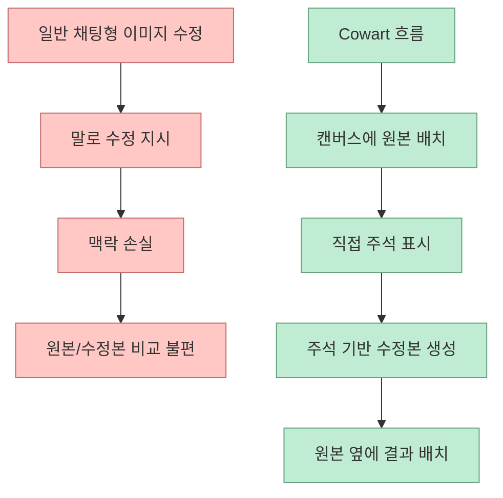
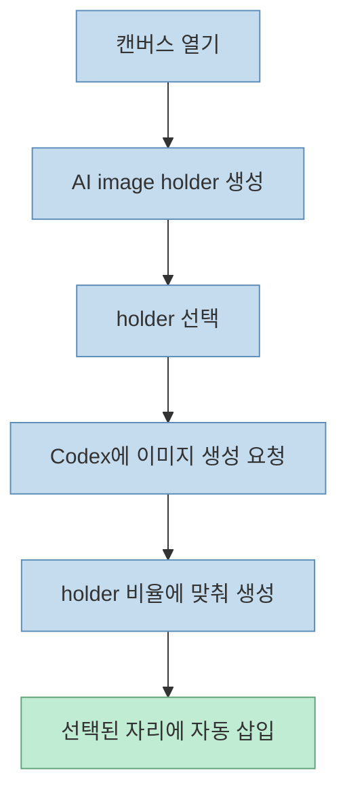
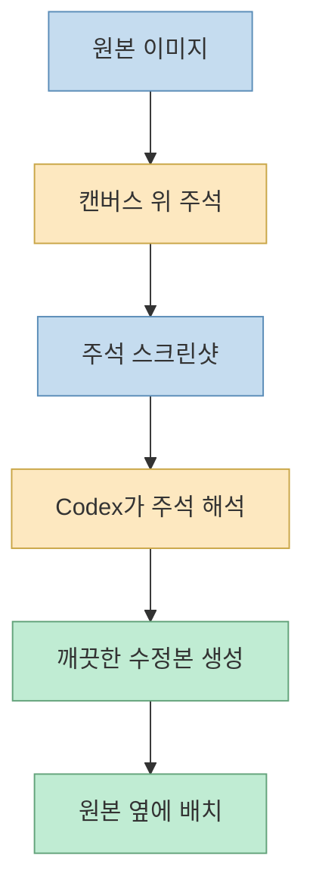

Threads에서 이 프로젝트를 추천한 문제의식은 꽤 정확합니다. 
AI 이미지 작업에서 진짜 번거로운 건 “생성” 그 자체보다 그 다음 단계입니다.

- 시안 비교
- 수정 요청
- 주석 표시
- 원본 보존
- 수정본 정리

이게 흩어지기 시작하면 곧바로 작업 흐름이 복잡해집니다. 
Cowart는 이 문제를 **Codex 안에 로컬 무한 캔버스** 를 붙이는 방식으로 풀려고 합니다.

<!--more-->

## Sources

- <https://www.threads.com/@ai.corder/post/DZ4VMcXmcSv?xmt=AQG0NtigBtEqmUOB2KFhQendH3dSf7F-cyG1-yj2nqVuxAflcUBrXUhCszIAFkCBsqeR6OBGcgY&slof=1>
- <https://github.com/zhongerxin/cowart>

## Cowart는 무엇인가

GitHub README 기준으로 Cowart는 **Codex용 로컬 infinite canvas plugin** 입니다. 
내부적으로는 `tldraw` 기반의 시각 캔버스를 제공하고, Codex가 이 캔버스를 읽고 여기에 이미지를 넣거나, 주석이 달린 이미지를 해석해 새 이미지를 생성하는 흐름을 지원합니다. 저장소 설명은 캔버스가 로컬 웹 서비스 위에서 열리고, 데이터가 플러그인 저장소가 아니라 현재 사용자 프로젝트의 `canvas/` 디렉터리에 저장된다고 명시합니다. <https://github.com/zhongerxin/cowart>

즉 Cowart는 단순히 “이미지 생성 버튼”을 추가하는 플러그인이 아닙니다. 
더 정확히는:

- 시각 작업 공간
- 프로젝트 로컬 자산 저장소
- 주석 기반 수정 인터페이스
- Codex와 캔버스를 잇는 MCP 도구층

을 한 번에 묶은 구조입니다.

## 이 프로젝트가 해결하려는 진짜 문제

Threads 원문에서 보이는 핵심 문제의식은 “생성 이후” 입니다. 
즉 많은 이미지 생성 워크플로우가 아래에서 막힙니다.

- 첫 시안은 뽑았는데 비교가 불편하다
- 수정 지시를 어디에, 어떤 방식으로 남길지 애매하다
- 원본을 덮어쓰면 이력이 사라진다
- 수정본이 늘어날수록 파일이 흩어진다

Cowart는 이걸 채팅 로그가 아니라 **캔버스 상태** 로 해결하려고 합니다.

이 점이 중요합니다. 
일반적인 AI 이미지 작업은:

1. 프롬프트 입력
2. 이미지 생성
3. 다시 설명
4. 다시 생성

으로 반복됩니다.

하지만 시각적 차이를 말로 다시 설명하는 건 비효율적입니다. 
Cowart는 그 간격을:

- holder
- annotation screenshot
- side-by-side revised image

같은 시각적 구조로 바꿉니다.

## 핵심 기능 1: 로컬 무한 캔버스

README의 첫 번째 핵심 기능은 Codex 안에서 **로컬 tldraw infinite canvas** 를 여는 것입니다. 
기본 주소는 `http://127.0.0.1:43217/` 이고, 캔버스 데이터는 현재 프로젝트 안에 저장됩니다.

저장 경로는 README 기준으로:

- `canvas/pages/<page-id>/cowart-canvas.json`
- `canvas/pages/<page-id>/assets/`

입니다. <https://github.com/zhongerxin/cowart>

이 구조가 중요한 이유는 단순합니다.

- 캔버스가 프로젝트와 함께 움직인다
- 이미지 자산도 프로젝트 안에 남는다
- 나중에 다시 열었을 때 상태가 이어진다

즉 Cowart는 “세션에서 잠깐 쓰는 화이트보드”가 아니라 **프로젝트 로컬 시각 작업 공간** 입니다.

## 핵심 기능 2: AI image holder

Cowart의 두 번째 핵심은 캔버스 안에 **AI image holder** 를 만든다는 점입니다. 
README 기준으로 사용 흐름은 이렇습니다.

1. 캔버스를 연다
2. AI image holder를 만든다
3. 그 holder를 선택한다
4. Codex에게 이미지를 생성해 그 holder에 넣으라고 요청한다

이 구조가 좋은 이유는 이미지 생성이 “대화 응답 첨부”로 끝나지 않기 때문입니다. 
어떤 크기와 위치에 넣을지가 캔버스 안에서 이미 정해져 있으므로, Codex는 선택된 holder의 비율을 읽고 그 자리에 맞는 이미지를 삽입합니다.

즉 생성 프롬프트가 곧바로 **레이아웃 제약** 과 연결됩니다.

## 핵심 기능 3: 주석 기반 이미지 수정

Cowart가 더 흥미로운 지점은 **annotation screenshot 기반 수정** 입니다. 
README는 사용자가 캔버스에서 이미지 위에 주석을 달고, 그 화면을 스크린샷으로 Codex에 넘기면, Codex가 화살표와 표기를 읽어서 **주석 흔적이 제거된 새 이미지** 를 원본 옆에 생성한다고 설명합니다.

이건 보통 디자인 툴에서 하던 커뮤니케이션 방식을 AI 이미지 워크플로우 안으로 가져온 것입니다.

중요한 점은 두 가지입니다.

1. 원본을 삭제하거나 이동하지 않는다
2. 수정본을 원본 옆에 둔다

즉 이 흐름은 “덮어쓰기”보다 “비교 가능한 revision chain”을 우선합니다.

이 구조는 특히 다음 작업에 잘 맞습니다.

- UI 목업 수정
- 장면별 아트 디렉션
- 이미지 변형 시안 비교
- 여러 버전 병렬 비교

## MCP가 왜 중요한가

Cowart README는 이 플러그인이 Cowart MCP 도구를 통해:

- 선택 상태 읽기
- 이미지 삽입
- 페이지 로컬 자산 디렉터리에 저장

을 한다고 설명합니다. <https://github.com/zhongerxin/cowart>

이 점이 중요합니다. 
단순한 이미지 생성 프롬프트만으로는 “지금 캔버스에서 어느 holder가 선택됐는지” 같은 상태를 알 수 없습니다. 이 상태를 주고받으려면, Codex 바깥의 캔버스 애플리케이션과 Codex 안쪽 에이전트가 **상태를 교환할 채널** 이 필요합니다.

Cowart에서 MCP는 바로 그 채널 역할을 합니다.

즉:

- 캔버스는 화면과 상태를 갖고 있고
- Codex는 생성과 수정 판단을 하고
- MCP는 둘 사이를 연결합니다

## 왜 로컬 저장이 중요할까

Cowart는 생성 결과를 중앙 SaaS에 쌓지 않고, 현재 프로젝트의 `canvas/` 폴더에 저장합니다. 
이 구조의 장점은 명확합니다.

### 1. 프로젝트 맥락과 같이 움직인다

이미지 자산, 캔버스 상태, 페이지 구조가 모두 같은 프로젝트 안에 있으니, 작업 결과가 따로 떠돌지 않습니다.

### 2. 버전 관리 가능성이 열린다

캔버스 JSON과 asset 파일이 프로젝트 디렉터리에 있으니, 필요하면 Git이나 다른 로컬 이력 방식과도 연결할 수 있습니다.

### 3. 원본/수정본 관계를 잃지 않는다

이미지 생성 결과가 채팅 스레드 안쪽 첨부로만 남지 않고, 명시적인 파일 자산으로 떨어집니다.

## 설치 방식이 말해 주는 것

README의 설치 과정을 보면 Cowart는 그냥 웹앱이 아니라 **Codex plugin ecosystem 안에 깊게 들어가는 도구** 입니다.

설치 흐름은 대략:

- `~/plugins/cowart` 에 clone
- `npm install`
- `npm run build`
- personal marketplace에 등록
- `codex plugin add cowart@personal`

입니다. <https://github.com/zhongerxin/cowart>

이건 중요한 신호입니다. 
Cowart는 웹 기반 캔버스 앱 하나를 따로 띄우는 것이 아니라, **Codex가 직접 불러 쓰는 로컬 플러그인** 으로 설계되어 있습니다.

즉 사용자 입장에서는:

- 채팅
- 로컬 웹 캔버스
- 프로젝트 파일 자산
- MCP 도구

가 한 시스템처럼 움직입니다.

## 이 도구가 특히 잘 맞는 작업

Cowart는 모든 이미지 생성 작업에 필요한 건 아닙니다. 
하지만 아래 영역에서는 특히 강합니다.

### 1. UI / UX 시안 반복

원본과 수정본을 병렬로 놓고 비교해야 하는 작업

### 2. 이미지 아트 디렉션

“여기 더 밝게”, “이 부분 제거”, “오른쪽에 여백 추가” 같은 지시를 말보다 주석으로 하는 편이 빠른 작업

### 3. 프로젝트 단위 시각 자료 누적

이미지 생성 결과를 채팅방이 아니라 프로젝트 자산으로 계속 모으고 싶은 경우

### 4. 에이전트-보조 디자인 워크플로우

사람이 캔버스에서 지시하고, Codex가 그 지시를 받아 결과물을 다시 삽입하는 반복

## 한계도 있다

Threads의 문제의식과 GitHub README만 기준으로 보면, Cowart의 한계도 명확합니다.

### 1. Codex 중심 구조다

현재 README는 Codex plugin과 personal marketplace 기준으로 설명합니다. 즉 Claude Code나 다른 agent host에 바로 같은 방식으로 붙는 구조라고 단정하긴 어렵습니다.

### 2. 로컬 서비스 전제가 있다

기본적으로 `127.0.0.1`에서 캔버스를 띄우므로, 브라우저형 SaaS처럼 어디서나 바로 이어지는 구조는 아닙니다.

### 3. 이미지 생성 품질은 결국 기반 모델에 의존한다

Cowart는 캔버스와 워크플로우를 제공하지만, 이미지의 미감 자체는 연결된 생성 모델의 품질 영향을 받습니다.

### 4. Threads 원문 전체는 공개적으로 완전 복원되지 않았다

이번 글은 Threads 공개 메타데이터에서 확인 가능한 본문 일부와, 연결된 GitHub README를 중심으로 작성했습니다. 즉 캐러셀의 뒷장 세부 설명까지 모두 확인한 것은 아닙니다.

## 핵심 요약

- Cowart는 Codex용 로컬 infinite canvas plugin이다
- 목표는 이미지 생성 자체보다 **생성 이후의 비교·주석·수정·정리** 문제 해결이다
- 캔버스 안의 AI image holder를 선택하면 Codex가 그 비율에 맞춰 이미지를 생성해 넣는다
- 주석 스크린샷을 기반으로 원본 옆에 수정본을 생성하는 흐름이 핵심 차별점이다
- 자산과 캔버스 상태를 현재 프로젝트의 `canvas/` 디렉터리에 저장해, 세션이 아니라 프로젝트 자산으로 남긴다
- 이 도구는 이미지 생성기라기보다 **Codex용 시각 작업 공간 + 상태 교환 레이어** 에 가깝다

## 결론

Cowart가 흥미로운 이유는 AI에게 그림을 더 잘 그리게 하려는 프로젝트가 아니기 때문입니다. 
그보다 더 중요한 문제, 즉 **생성된 이미지를 어떻게 비교하고, 어떻게 수정 지시를 남기고, 어떻게 프로젝트 맥락 안에 정리할 것인가** 를 해결하려고 합니다.

그래서 Cowart는 단순한 “image plugin”보다는, **Codex를 로컬 시각 캔버스 편집자로 확장하는 플러그인** 으로 보는 편이 더 정확합니다.
