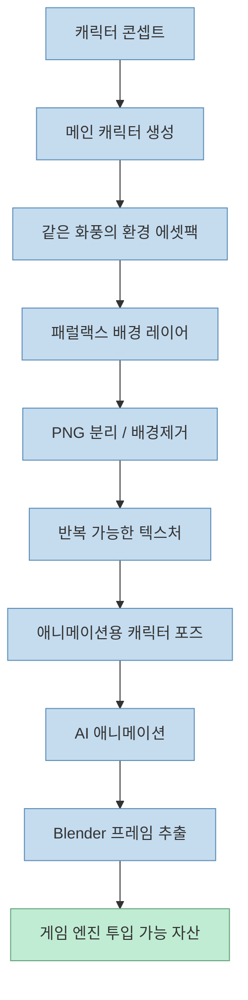
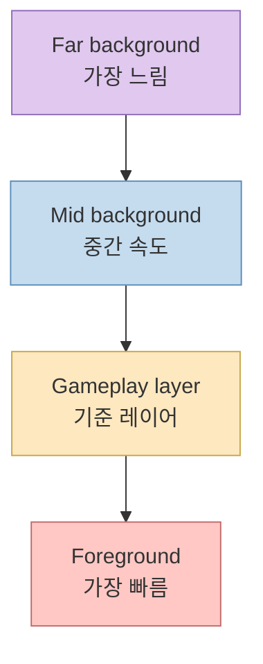
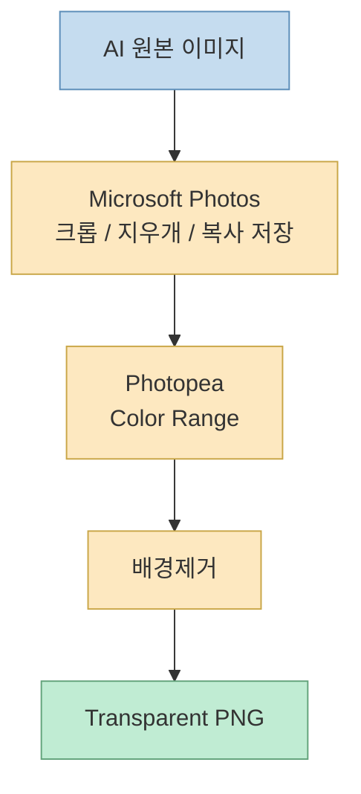
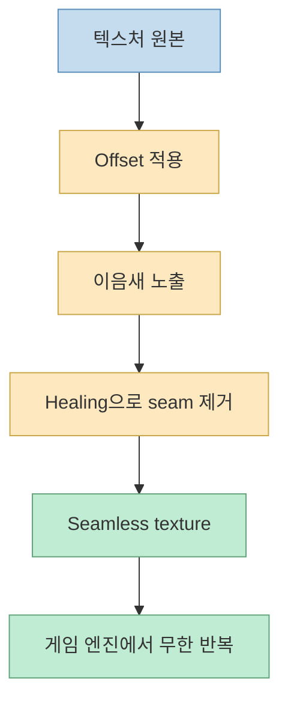
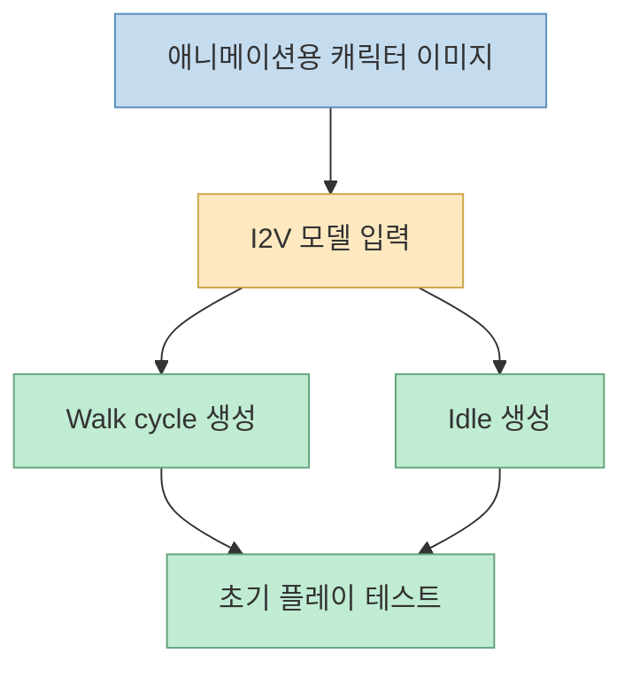
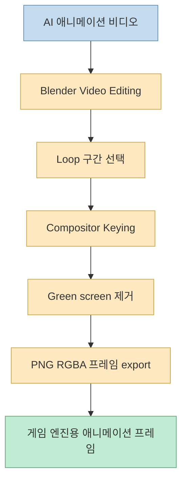
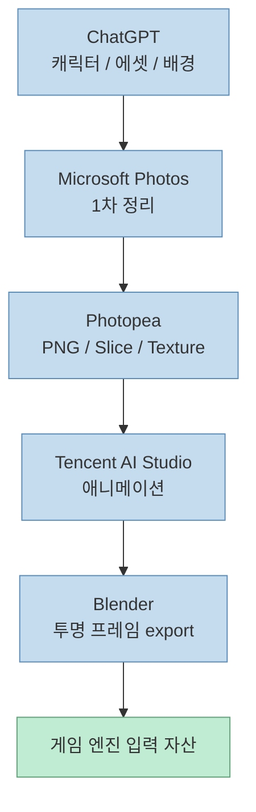

이 영상이 흥미로운 이유는 단순히 "AI로 그림을 뽑는다"에서 멈추지 않기 때문입니다.<br>
보통 게임용 에셋 튜토리얼은 캐릭터 하나 생성하거나 배경 한 장 만드는 데서 끝납니다. 그런데 이 영상은 **실제 게임 엔진에 넣을 수 있는 형태** 까지 밀어붙입니다.

즉 목표가 다릅니다.

- 예쁜 이미지 한 장
- 가 아니라
- 반복 가능한 2D 게임 아트 생산 파이프라인

입니다.

<!--more-->

## Sources

- <https://youtu.be/Gb6zy40WojA?si=foWDsXS8zHzrOI33>

## 이 영상이 만드는 것은 "이미지"가 아니라 "게임용 자산 세트"다

영상의 전체 흐름은 아래처럼 정리할 수 있습니다.

1. 메인 캐릭터 생성
2. 같은 화풍의 환경 에셋팩 생성
3. 패럴랙스용 배경 레이어 분리
4. 오브젝트를 잘라 transparent PNG로 변환
5. 타일 가능한 seamless texture 제작
6. 캐릭터를 애니메이션 친화적 포즈로 다시 생성
7. 외부 AI로 walk / idle 같은 짧은 루프 제작
8. Blender에서 투명 PNG 프레임으로 추출

즉 이건 생성형 AI 튜토리얼이라기보다, **2D 사이드스크롤 게임용 아트 공장 조립법** 에 가깝습니다.



## 1. 캐릭터는 단독 이미지가 아니라 전체 세계관의 기준점이다

영상은 가장 먼저 ChatGPT에서 캐릭터를 만듭니다.<br>
예시로는:

- messy black hair
- yellow hoodie
- small fluffy companion creature

같은 묘사를 넣습니다.

여기서 중요한 포인트는 캐릭터 예쁘게 뽑기 자체가 아닙니다.<br>
영상도 explicitly 말하듯이 **consistency** 가 핵심입니다.

이 캐릭터가 이후 모든 자산의 기준이 됩니다.

- 풀 타일
- 바위
- 나무
- 버섯
- 플랫폼
- 장식용 오브젝트
- 패럴랙스 배경

까지 전부 이 캐릭터의 화풍에 맞춰야 하기 때문입니다.

즉 캐릭터 프롬프트는 그냥 주인공 생성용 문장이 아니라, **전체 비주얼 시스템의 스타일 토큰** 입니다.

```mermaid
flowchart TD
    A["캐릭터 설명"] --> B["색감"]
    A --> C["선 느낌"]
    A --> D["비율"]
    A --> E["표정 / 분위기"]
    B --> F["환경 에셋 화풍 통일"]
    C --> F
    D --> F
    E --> F

    classDef base fill:#c5dcef,stroke:#5b8db8,color:#333,stroke-width:1px;
    classDef style fill:#fde8c0,stroke:#c9a647,color:#333,stroke-width:1px;
    classDef result fill:#c0ecd3,stroke:#63a37b,color:#333,stroke-width:1px;

    class A base
    class B,C,D,E style
    class F result
```

## 2. 환경 에셋팩 생성의 핵심은 "모듈형"이라는 점이다

두 번째 단계에서 영상은 전체 환경 에셋팩을 생성합니다.<br>
여기서 중요한 키워드는 `complete cohesive 2D side-scrolling game environment asset pack` 입니다.

즉 한 장의 배경 일러스트를 뽑는 게 아니라, **재조합 가능한 부품 묶음** 을 요구합니다.

예시로 영상이 언급하는 구성은:

- grass tiles
- rocks
- trees
- mushrooms
- fences
- platforms
- decorative props
- seamless textures

입니다.

이 단계가 중요한 이유는, 게임에서는 “그림 하나”보다 **조립 가능한 반복 단위** 가 더 중요하기 때문입니다.

예쁜 한 장 배경은 마케팅 이미지로는 좋지만, 실제 레벨 디자인에는:

- 타일 반복
- 플랫폼 재배치
- 충돌 영역 설정
- 장식 요소 재사용

이 더 중요합니다.

그래서 이 단계는 이미지 생성이라기보다, **레벨 빌딩용 키트 생산** 에 가깝습니다.

## 3. 패럴랙스 배경은 깊이 레이어를 미리 분리해서 생성해야 한다

영상의 세 번째 포인트는 패럴랙스입니다.<br>
많은 초보자가 배경을 한 장으로 만들고 끝내지만, 패럴랙스는 원리상 처음부터 **깊이별로 따로** 있어야 합니다.

영상에서 요구하는 구조는:

- far background
- mid background
- gameplay layer
- foreground elements

를 각각 별도 이미지 파일로 만드는 것입니다.

이게 중요한 이유는 레이어마다 이동 속도가 달라야 하기 때문입니다.

- 가장 먼 배경은 아주 천천히 이동
- 중간 레이어는 조금 더 빨리 이동
- 전경은 가장 빠르게 이동

그래야 사이드스크롤에서 깊이감이 생깁니다.



즉 패럴랙스는 나중에 엔진에서 억지로 해결하는 게 아니라, **생성 단계부터 레이어 구조로 설계해야 한다** 는 것이 영상의 핵심입니다.

## 4. Microsoft Photos와 Photopea가 들어가는 이유는 "후처리" 때문이다

이 영상이 현실적인 이유는 생성만 하지 않고 후처리를 따로 다룬다는 점입니다.

### Microsoft Photos 단계

영상은 먼저 Microsoft Photos에서:

- crop
- unwanted area erase
- save as copy

를 반복합니다.

이건 정교한 편집보다는 **거친 1차 정리** 에 가깝습니다.<br>
즉 AI가 만든 원본 이미지에서 불필요한 영역을 먼저 잘라내는 단계입니다.

### Photopea 단계

그 다음에는 Photopea로 넘어가서:

- `Select > Color Range`
- fuzziness 조절
- 배경 삭제
- transparent PNG export

를 진행합니다.

이 두 단계를 분리한 이유는 분명합니다.

- Photos는 빠른 정리
- Photopea는 정밀한 배경제거와 PNG 추출

입니다.



즉 이 파이프라인은 생성 AI가 모든 걸 끝내준다고 보지 않습니다.<br>
중간에 **사람이 편집 가능한 브라우저형 툴** 이 반드시 들어갑니다.

## 5. 여러 오브젝트를 자동 분할하는 단계가 왜 중요한가

영상의 slice 단계는 특히 실무적입니다.<br>
에셋팩을 한 장 이미지로 뽑으면 실제 게임에선 곧바로 쓰기 어렵습니다.

왜냐하면 게임 엔진은:

- 각각의 나무
- 각각의 돌
- 각각의 버섯
- 각각의 플랫폼

을 개별 파일이나 개별 sprite로 다뤄야 하기 때문입니다.

영상은 Photopea의 slice 기능으로:

- divide
- object 수 기준 분할
- 수동 조정
- PNG export

를 통해 zip 안에 분리된 transparent asset들을 뽑아냅니다.

이건 사실상 **미니 sprite extraction 단계** 입니다.

## 6. seamless texture 단계는 "예쁜 표면"이 아니라 "무한 반복 가능한 표면"을 만든다

게임 엔진에서는 grass, dirt, stone 같은 바닥/벽 재질이 한 장으로 끝나지 않습니다.<br>
반복되어야 합니다.

그래서 영상은 Photopea에서:

- `Filter > Other > Offset`
- seam 노출
- spot healing brush로 seam 제거

를 통해 tileable texture를 만듭니다.

핵심은 seam을 일부러 드러낸 다음, 그 연결부를 수동으로 지우는 것입니다.



이 단계가 빠지면 게임은 AI 그림을 썼더라도 결국 바닥이나 벽이 끊겨 보입니다.<br>
즉 texture 생성이 아니라 **texture 엔진 적합화** 단계라고 보는 편이 정확합니다.

## 7. 애니메이션용 캐릭터는 처음 캐릭터와 다르게 만들어야 한다

영상 후반부의 중요한 포인트는, 애니메이션용 캐릭터를 처음 만든 정면/일러스트형 캐릭터와 다르게 다시 생성한다는 점입니다.

여기서 요구사항은:

- side view
- walking pose
- centered character
- solid green chroma key background

입니다.

이건 왜 중요할까요.

애니메이션 모델은 “멋진 캐릭터 이미지”보다:

- 출발 포즈가 명확하고
- 실루엣이 잘 보이고
- 배경 제거가 쉬운

입력을 더 잘 다룹니다.

또 초록색 오브젝트를 애니메이션할 때는 blue background로 바꾸라고 한 팁도 꽤 실용적입니다.<br>
즉 영상은 AI 애니메이션 품질을 위해 **입력 이미지를 애니메이션 친화적으로 재설계** 하라고 말합니다.

## 8. Tencent AI Studio는 "완성 엔진"이 아니라 짧은 모션 생성기 역할을 한다

애니메이션 단계에서 영상은 Tencent AI Studio의 `Hunyuan Video 1.5 I2V` 계열 흐름을 사용합니다.<br>
입력은 캐릭터 이미지 하나, 출력은 짧은 walk cycle 입니다.

여기서 중요한 건 ambition을 낮추는 방식입니다.

영상은 프로토타입 단계에선 보통:

- walk
- idle

두 개만 있어도 충분하다고 말합니다.

이게 실전적입니다.<br>
처음부터 공격, 피격, 점프, 낙하, climb, death 전부 만들지 않고, **게임플레이 테스트에 필요한 최소 루프부터 확보** 하는 전략이기 때문입니다.



## 9. Blender는 비디오를 "게임용 프레임 시트 재료"로 바꾸는 단계다

애니메이션이 나왔다고 바로 게임 엔진에서 쓰기 좋은 건 아닙니다.<br>
영상은 Blender Video Editing과 compositor를 이용해:

- 영상 불러오기
- frame range 설정
- green screen keying
- RGBA PNG export

를 합니다.

이 단계의 목적은 단순 변환이 아닙니다.

1. 루프용 시작/끝 프레임을 맞춘다
2. 그린 스크린을 제거한다
3. 알파가 있는 프레임 PNG로 뽑는다

즉 비디오를 **엔진 친화적인 sprite frame 묶음** 으로 다시 가공하는 것입니다.



영상 마지막 팁인 “Blender project file을 저장하라”도 중요합니다.<br>
이걸 저장해 두면 다음 캐릭터나 다음 모션에서 같은 keying / export 셋업을 재사용할 수 있습니다. 즉 한 번 만든 파이프라인이 다음 작업의 템플릿이 됩니다.

## 이 워크플로우의 진짜 장점

이 영상의 장점은 “무료”보다 **연결성** 에 있습니다.

각 도구는 사실 각자 따로 보면 익숙한 것들입니다.

- ChatGPT: 이미지 생성
- Microsoft Photos: 빠른 편집
- Photopea: 배경제거 / 분할 / 텍스처 정리
- Tencent AI Studio: I2V 애니메이션
- Blender: 프레임 추출

하지만 중요한 건 각각이 아니라, 이걸 아래처럼 한 줄로 묶었다는 점입니다.



즉 한 도구가 다 해결하는 게 아니라, **각 단계에서 가장 싼 도구를 이어 붙이는 파이프라인 설계** 가 핵심입니다.

## 이 방식의 한계도 분명하다

물론 이 방식은 프로토타이핑과 솔로 개발에 강하지만, 한계도 분명합니다.

### 1. 스타일 일관성이 완전 자동은 아니다

처음 캐릭터 설명을 기준점으로 삼아도, 여러 번 생성하면 색/선/비율이 조금씩 흔들릴 수 있습니다.

### 2. 충돌체 / 게임플레이 데이터는 따로 필요하다

이미지와 프레임이 생겨도:

- hitbox
- pivot
- collision
- animation state machine

은 게임 엔진에서 다시 잡아야 합니다.

### 3. 장시간 애니메이션보다는 짧은 루프에 더 적합하다

영상도 walk / idle 중심입니다.<br>
복잡한 전투 모션 세트까지 한 번에 안정적으로 해결하는 방법으로 소개되진 않습니다.

### 4. 수작업 편집은 여전히 남는다

배경제거, 분할선 조정, seam 보정, loop 구간 선택은 결국 사람이 확인해야 합니다.

즉 "완전 자동 제작"이라기보다 **사람이 감독하는 무료 AI 아트 파이프라인** 이라고 보는 편이 맞습니다.

## 핵심 요약

- 이 영상은 예쁜 AI 그림 생성법이 아니라 **2D 게임 자산 생산 파이프라인** 을 보여 준다
- 캐릭터 프롬프트는 전체 게임 비주얼의 기준점 역할을 한다
- 환경 에셋팩은 단일 배경이 아니라 **모듈형 레벨 빌딩 키트** 로 생성해야 한다
- 패럴랙스는 처음부터 깊이별 레이어로 분리해야 한다
- Photos와 Photopea는 후처리, PNG 추출, slice, seamless texture 단계에서 핵심 역할을 한다
- 애니메이션용 캐릭터는 별도 포즈와 chroma background로 다시 준비해야 품질이 오른다
- Tencent AI Studio와 Blender를 연결하면 게임 엔진에 넣을 수 있는 transparent PNG 프레임까지 도달할 수 있다

## 결론

이 영상의 진짜 가치는 "무료 툴 소개"가 아닙니다.<br>
더 중요한 건, AI 이미지 생성물을 **게임 엔진이 먹을 수 있는 단위로 계속 쪼개고 정리하는 사고방식** 을 보여 준다는 점입니다.

즉 이 워크플로우는 한 장의 그림을 만드는 법이 아니라, **게임용 2D 아트를 생산 라인처럼 만드는 법** 에 가깝습니다.
