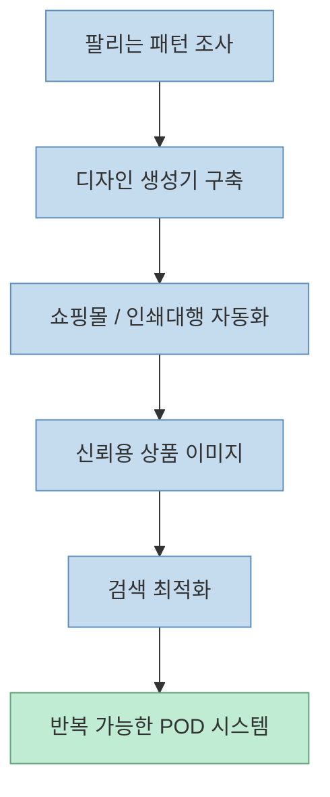
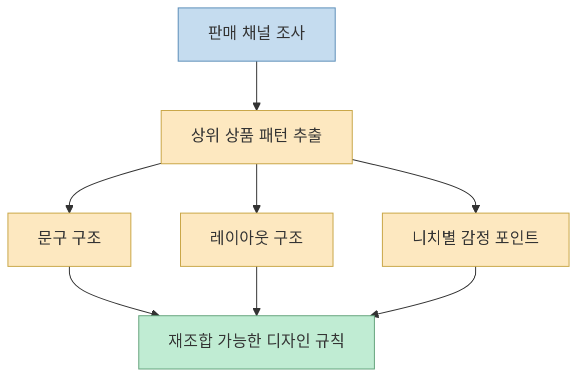
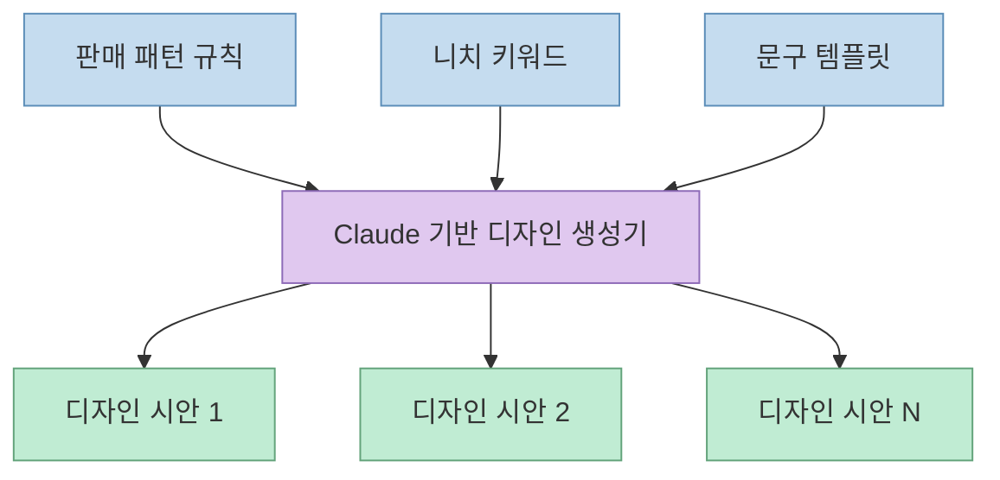
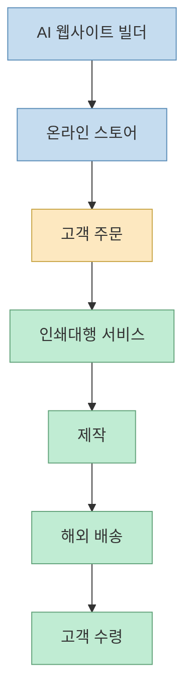
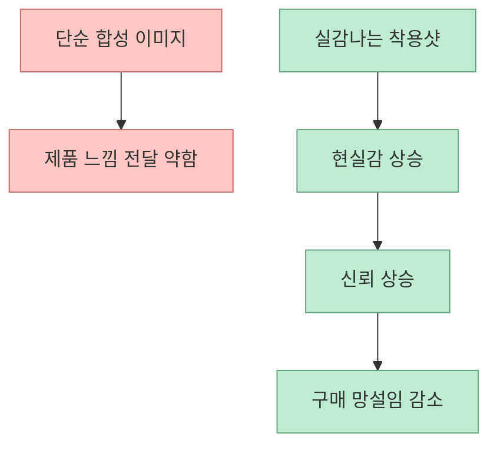
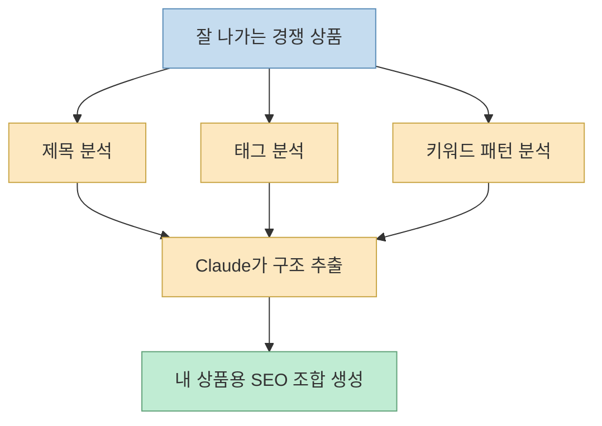
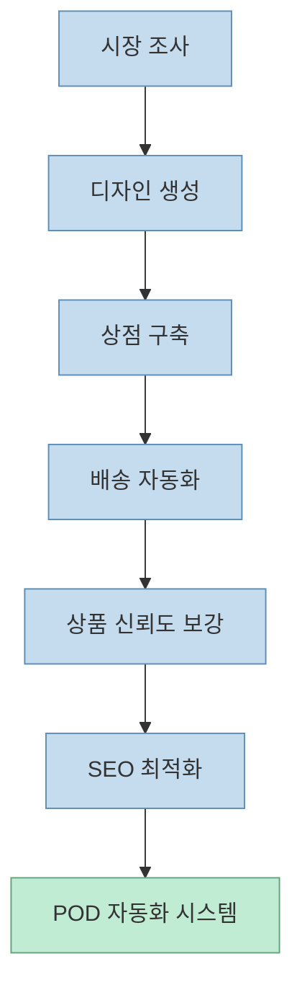

이 Shorts가 흥미로운 이유는 티셔츠 판매를 “디자인 감각”의 문제로 보지 않기 때문입니다. 
오히려 정반대입니다. 
영상은 POD(Print on Demand) 비즈니스를 **반복 가능한 자동화 시스템** 으로 봅니다.

즉 메시지는 단순합니다.

- 그림을 잘 그릴 필요는 없고
- 디자인 툴을 오래 배울 필요도 없고
- 주문을 직접 처리할 필요도 없고
- 중요한 건 전체 흐름을 AI로 시스템화하는 것

이라는 이야기입니다.

<!--more-->

## Sources

- <https://youtube.com/shorts/39SVuSG1LbM?si=jsbfl-_quzQAtCeG>

## 이 영상은 "티셔츠 디자인 팁"이 아니라 POD 운영 구조를 말한다

영상이 제시하는 다섯 단계는 사실상 하나의 운영 파이프라인입니다.

1. 이미 팔리는 패턴을 분석한다
2. Claude 안에 디자인 생성기를 만든다
3. 쇼핑몰과 배송을 자동화한다
4. 실제 사람처럼 보이는 고신뢰 상품 이미지를 만든다
5. 성공 상품의 제목·태그·검색어를 역으로 분석해 SEO를 최적화한다

중요한 건 이 다섯 단계가 각각 독립된 팁이 아니라는 점입니다. 
영상은 티셔츠 비즈니스의 병목을:

- 무엇을 만들까
- 어떻게 대량 생산할까
- 어떻게 팔릴 형태로 보여 줄까
- 어떻게 주문 처리할까
- 어떻게 검색 유입을 받을까

로 나누고, 각각을 AI로 자동화 가능한 층으로 바꿉니다.

## 1. "새로운 것"보다 "이미 검증된 패턴"을 복제하라는 뜻

영상의 첫 번째 조언은 의외로 보수적입니다. 
세상에 없던 새로운 디자인을 만들려 하지 말고, 이미 잘 팔리는 구조를 분석하라고 합니다.

여기서 중요한 것은 **copying the taste** 가 아니라 **copying the pattern** 입니다.

즉:

- 어떤 문구 구조가 잘 먹히는지
- 어떤 감정 톤이 반응을 얻는지
- 어떤 니치에서 반복 구매가 일어나는지
- 어떤 레이아웃이 클릭을 만드는지

를 추출하는 것이 핵심입니다.

영상은 Etsy와 TikTok Shop 같은 판매 채널을 암묵적으로 전제하고, 잘 팔리는 구조를 조사한 뒤 그 패턴을 여러 니치 시장에 적용하라고 말합니다.

이 발상은 AI 시대에 더 중요해졌습니다. 
왜냐하면 AI는 완전히 새로운 미적 혁신을 안정적으로 만드는 도구라기보다, **이미 검증된 패턴을 빠르게 재조합하는 도구** 로 훨씬 강하기 때문입니다.

즉 이 단계의 핵심은 “창의성”보다 **시장 적합성 데이터 추출** 입니다.

## 2. Claude 안에 "디자인 전용 소프트웨어"를 만든다는 말의 뜻

영상의 두 번째 단계는 가장 중요한 부분입니다. 
직접 디자인 하나하나를 만들지 말고, **클릭 한 번에 수십 개의 티셔츠 도안을 뽑는 생성기 자체를 Claude에게 빌드하게 하라** 고 말합니다.

이 문장을 곧이곧대로 이해하면 “클로드가 티셔츠를 그려 준다”처럼 보이지만, 실제 의미는 더 넓습니다.

핵심은:

- 템플릿을 입력하면
- 여러 문구 변형을 만들고
- 여러 레이아웃을 조합하고
- 여러 니치 버전을 한꺼번에 생성하고
- 결과를 비교 가능한 형태로 뽑는

**내부용 디자인 생성 시스템** 을 갖추라는 뜻입니다.

즉 Claude는 단순 채팅 비서가 아니라:

- 문구 generator
- niche variation generator
- layout combinator
- batch production helper

역할을 동시에 맡습니다.

이 단계가 중요한 이유는 POD가 결국 **volume game** 이기 때문입니다. 
한 장을 멋지게 만드는 사람보다, 검증된 포맷을 수십 니치에 빠르게 전개하는 사람이 더 유리할 수 있습니다.

## 3. 쇼핑몰과 배송 자동화는 "수익 구조의 고정비 절감"에 가깝다

세 번째 단계에서 영상은 AI 웹사이트 빌더와 인쇄대행 서비스를 연결해 주문부터 배송까지를 자동화하라고 말합니다.

이건 단순 편의성이 아닙니다. 
POD 비즈니스에서 사람이 매번 개입하는 지점은 보통:

- 상품 등록
- 주문 확인
- 제작 전달
- 배송 상태 확인

인데, 이 중 주문 이후 파트를 최대한 줄이면 운영 비용이 급감합니다.

영상이 말하는 구조를 추상화하면 이렇습니다.

여기서 중요한 건 “AI 웹사이트 빌더” 그 자체보다, **주문 흐름에 사람이 개입하지 않아도 되는 구조** 입니다.

즉 수익화의 핵심은 디자인만이 아니라:

- 판매 표면
- 결제 흐름
- 제작 전달
- 배송 처리

를 시스템으로 묶는 데 있습니다.

## 4. 신뢰를 만드는 건 "착용된 현실감"이다

영상의 네 번째 조언은 매우 상업적입니다. 
그냥 합성 티셔츠 이미지보다 **실제 사람이 입은 것처럼 보이는 고품질 라이프스타일 사진** 이 더 잘 팔린다는 관점입니다.

이 부분의 본질은 이미지 퀄리티 자체보다 **구매자의 망설임을 줄이는 방식** 에 있습니다.

사람은 티셔츠 상품 페이지를 볼 때 다음을 묻습니다.

- 실제로 입으면 어떤 느낌인가
- 값싸 보이지는 않는가
- 내 체형/취향에도 어울릴 것 같은가

즉 단순 mockup보다:

- 실제 인물 맥락
- 자연스러운 착용샷
- 깨끗한 라이프스타일 배경

이 더 큰 신뢰를 만듭니다.

즉 이 단계는 그래픽 품질 문제가 아니라, **conversion optimization** 문제로 보는 게 더 정확합니다.

## 5. 성공 상품의 검색 구조를 역설계하라는 뜻

영상의 마지막 조언은 검색 최적화입니다. 
여기서도 핵심은 “창의적으로 제목 짓기”가 아닙니다.

오히려:

- 이미 잘 팔리는 매장의 검색어를 분석하고
- 성공한 상품의 제목과 태그를 Claude로 분해하고
- 가장 잘 노출되는 키워드 조합을 찾아내라

는 것입니다.

즉 AI의 역할은 copywriter보다 **keyword analyst** 에 더 가깝습니다.

이 발상을 구조화하면 다음과 같습니다.

이 단계가 중요한 이유는 POD에서 디자인 품질만큼 중요한 게 **발견 가능성(discoverability)** 이기 때문입니다. 
좋은 상품도 검색 결과에 안 뜨면 팔릴 기회 자체가 없습니다.

## 이 영상이 실제로 말하는 비즈니스 모델

겉으로 보면 “클로드로 티셔츠 디자인하기”처럼 보이지만, 실제로는 아래 구조를 제안합니다.

- 시장 패턴 수집
- 내부 생성기 구축
- 상점/배송 자동화
- 신뢰용 시각 자산 보강
- 검색 유입 최적화

즉 Claude는 디자이너를 대체하는 단일 도구가 아니라:

- 조사 분석기
- 배치 생성기
- 상점 구축 보조자
- 상품 카피 분석기

를 겸하는 운영 계층입니다.

## 이 접근의 한계도 분명하다

영상의 구조는 실용적이지만, 몇 가지 주의할 점도 있습니다.

### 1. 패턴 복제는 차별화 부족으로 이어질 수 있다

검증된 구조를 빠르게 전개하는 전략은 강하지만, 너무 비슷한 상품이 많아지면 가격 경쟁으로 흘러갈 수 있습니다.

### 2. 디자인 자동화가 곧 브랜드는 아니다

대량 시안을 만들 수 있어도, 브랜드 세계관과 장기 고객 충성도는 별도의 설계가 필요합니다.

### 3. SEO 최적화는 플랫폼 정책 변화에 민감하다

검색 노출 알고리즘이 바뀌면 이전에 통하던 키워드 구조가 약해질 수 있습니다.

### 4. 배송 자동화가 고객 경험 전체를 해결하진 않는다

주문·제작·배송이 자동이어도, 환불·CS·불량 대응은 여전히 운영 역량이 필요합니다.

즉 이 구조는 **수익화의 출발선** 을 낮추는 데는 강하지만, 장기 비즈니스 완성도까지 자동으로 보장하진 않습니다.

## 핵심 요약

- 이 영상은 티셔츠 디자인 팁보다 **POD 자동화 시스템** 을 말한다
- 첫 단계는 새 아이디어 발명이 아니라 **검증된 판매 패턴 추출** 이다
- Claude의 핵심 역할은 디자인 하나를 직접 그리는 것보다 **내부용 생성기 구축** 에 있다
- 쇼핑몰과 인쇄대행 연동은 운영 고정비를 낮추는 핵심 단계다
- 합성 이미지보다 신뢰감 있는 착용샷이 conversion에 더 중요하다고 본다
- 마지막 단계는 감성 문구보다 **검색 구조 역설계** 에 가깝다

## 결론

이 Shorts의 진짜 메시지는 “클로드로 예쁜 티셔츠를 만든다”가 아닙니다. 
더 정확히는, **POD를 손작업 공방이 아니라 자동화된 운영 시스템으로 재구성하라** 는 이야기입니다.

그래서 이 영상은 디자인 툴 튜토리얼이라기보다, **AI를 이용해 소규모 POD 비즈니스의 병목을 하나씩 제거하는 운영 설계도** 에 가깝습니다.
