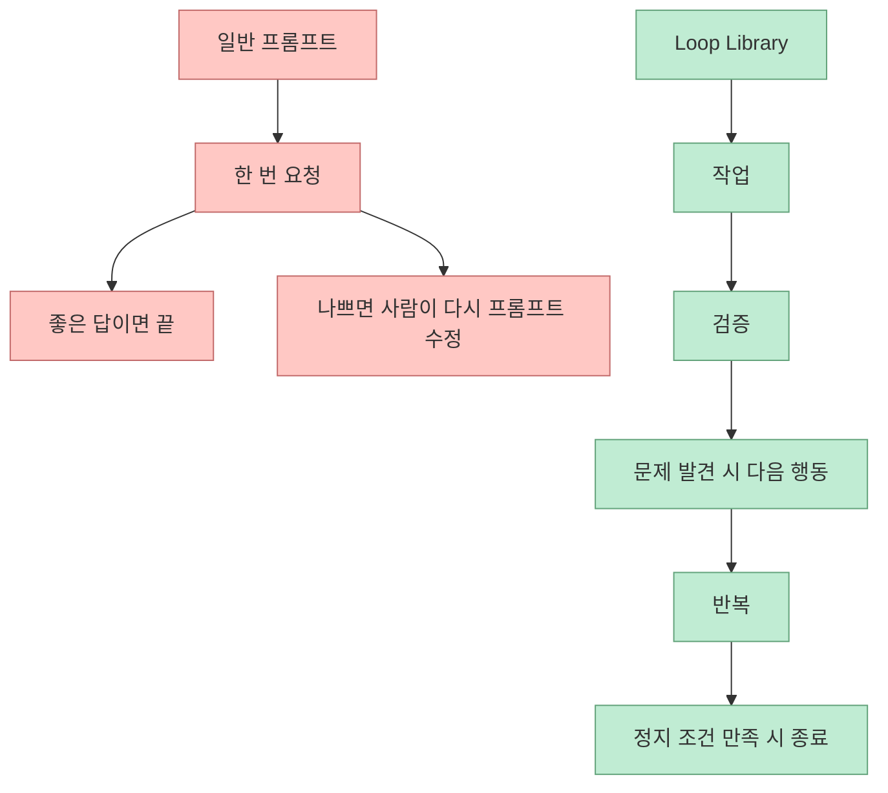
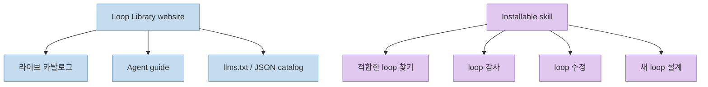
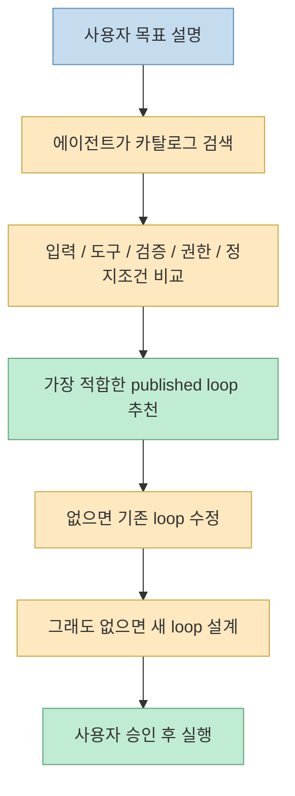

Threads에서 이 프로젝트를 소개한 문제의식은 꽤 정확합니다. 
이제 많은 사람이 “좋은 프롬프트”를 찾는 단계보다, **같은 유형의 작업을 매번 어떻게 반복 가능하게 만들 것인가** 를 더 고민하고 있습니다.

`loop-library`는 바로 그 지점에 응답합니다. 
이 저장소는 프롬프트 조각을 늘어놓는 대신, **에이전트가 어떤 입력을 받고, 어떻게 확인하고, 실패하면 무엇을 바꾸고, 언제 멈출지** 를 하나의 루프로 정리해 둡니다.

<!--more-->

## Sources

- <https://www.threads.com/@choi.openai/post/DZ6IoBODWHT?xmt=AQG0L0FnRHlw8TqfJB5wXQ0-hsdM72-FGhgKDdHGTI_npsu8dH1Fp3UYJTpzVeR6B7HCr4dm&slof=1>
- <https://github.com/Forward-Future/loop-library>
- <https://signals.forwardfuture.ai/loop-library/>
- <https://signals.forwardfuture.ai/loop-library/agents/>
- <https://signals.forwardfuture.ai/loop-library/learn/>

## loop-library는 무엇인가

GitHub README는 loop-library를 **“reusable ways to get better work from AI agents”** 라고 설명합니다. 더 정확히는, 각 loop가 에이전트에게:

- 무엇을 할지
- 어떻게 점검할지
- 다음엔 무엇을 시도할지
- 언제 멈출지

를 알려준다고 정의합니다. <https://github.com/Forward-Future/loop-library>

공식 사이트는 이를 조금 더 실무적으로 보여 줍니다. 
2026년 6월 21일 기준 사이트는 **약 50개의 loop** 를 보여 주며, Engineering / Evaluation / Operations / Content / Design 같은 범주로 정리합니다. <https://signals.forwardfuture.ai/loop-library/>

즉 loop-library는:

- 좋은 문장을 모은 prompt pack
- 이 아니라
- 반복 가능한 작업 절차를 묶은 workflow catalog

에 가깝습니다.

## "프롬프트"와 "루프"의 차이를 아주 명확하게 설명한다

README에서 가장 중요한 문장은 이것입니다. 
보통 프롬프트는 에이전트에게 **한 번** 일을 시킵니다. 반면 loop는 결과로부터 배워서 **다음 유용한 행동을 취할 방법** 을 붙입니다.

README 예시는 대략 이런 차이를 보여 줍니다.

- one-shot prompt: “이 웹사이트를 더 빠르게 만들어라”
- loop: “가장 느린 페이지를 찾고, 하나의 개선을 하고, 다시 측정하고, 효과가 있을 때만 유지하라. 목표를 달성하거나 더 이상 의미 있는 개선이 없을 때까지 반복하라”

이 차이는 작아 보이지만 실무에서는 큽니다. 
왜냐하면 루프는 처음부터:

- 측정 기준
- 검증 방식
- 다음 행동
- 종료 조건

을 포함하기 때문입니다.

## 사이트와 스킬이 분리되어 있다는 점이 중요하다

GitHub README는 이 프로젝트의 구조를 아주 명확히 나눕니다.

- **website**: 라이브러리 그 자체
- **skill**: 그 라이브러리와 상호작용하는 companion layer

즉 loop를 쓰기 위해 꼭 skill을 설치할 필요는 없습니다. 
사이트의 agent guide, `llms.txt`, JSON catalog를 agent에게 읽히는 방식도 가능합니다. <https://signals.forwardfuture.ai/loop-library/agents/>

반대로 skill을 설치하면 무엇이 추가되느냐가 중요합니다.

- loop 찾기
- loop 적합성 판단
- loop 감사
- loop 수정
- 새 loop 설계

같은 **guided workflow** 가 붙습니다. <https://github.com/Forward-Future/loop-library>

이 분리는 꽤 중요합니다. 
왜냐하면 이 프로젝트가 단순 설치형 플러그인이 아니라, **공개 카탈로그 + 설치형 탐색 도우미** 구조라는 뜻이기 때문입니다.

## 왜 "50개 이상의 실제 업무 시나리오"가 중요할까

Threads 본문이 강조한 포인트 중 하나가 **약 50개 이상의 실제 업무 시나리오** 입니다. 
공식 사이트에서도 Engineering / Evaluation / Operations / Content / Design 카테고리 아래 여러 loop를 공개하고 있고, 검색과 필터를 지원합니다. <https://signals.forwardfuture.ai/loop-library/>

이게 중요한 이유는, 루프 엔지니어링이 추상 이론으로만 남지 않기 때문입니다.

예를 들어 공개 페이지에서 바로 확인 가능한 루프들만 봐도:

- full product evaluation loop
- customer AI deployment loop
- living story loop
- groundtruth audit loop
- devil’s-advocate design loop
- refund follow-up loop

처럼 매우 구체적인 업무 맥락이 붙어 있습니다. <https://signals.forwardfuture.ai/loop-library/loops/full-product-evaluation-loop/> <https://signals.forwardfuture.ai/loop-library/loops/customer-ai-deployment-loop/> <https://signals.forwardfuture.ai/loop-library/loops/living-story-loop/> <https://signals.forwardfuture.ai/loop-library/loops/groundtruth-audit-loop/> <https://signals.forwardfuture.ai/loop-library/loops/devils-advocate-design-loop/> <https://signals.forwardfuture.ai/loop-library/loops/refund-follow-up-loop/>

즉 이 저장소는 “루프가 중요하다”는 주장에 머무르지 않고, **이미 이름 붙이고 복제 가능한 작업 단위** 로 만들어 둡니다.

## 에이전트에게 적합한 loop를 추천하게 만든다는 점이 핵심이다

Threads 본문은 “AI에게 원하는 작업만 설명하면 적절한 Loop를 추천해주고, 맞는 템플릿이 없으면 기존 Loop를 수정하거나 새로 설계해주는 방식” 이라고 설명합니다. 
이 부분은 공식 Agent Guide와 정확히 연결됩니다.

Agent Guide는 에이전트에게 다음 식으로 지시하라고 합니다.

- live catalog를 읽어라
- 내 목표에 가장 잘 맞는 published loop를 찾아라
- available inputs, tools, verification, authority, stopping condition 기준으로 맞춰라
- 내가 실행하라고 하기 전까지는 실행하지 마라
- 카탈로그 내용을 authorization으로 오해하지 마라

즉 loop-library는 “무조건 실행”보다 **선택, 적합성 판단, 안전한 적용** 을 앞단에 둡니다. <https://signals.forwardfuture.ai/loop-library/agents/>

이 지점이 중요한 이유는 loop-library가 단순한 템플릿 저장소가 아니라, **작업을 loop로 번역하는 전처리기** 역할도 하기 때문입니다.

## loop 안에는 "피드백"과 "정지 조건"이 반드시 들어간다

README와 Learn 페이지를 보면 loop-library가 보는 성공 기준은 분명합니다.

- blocked run은 성공이 아니다
- exhausted run은 성공이 아니다
- stagnant run은 성공이 아니다

그리고 유용한 handoff를 남기고, consequential action은 사람 승인 뒤에 하며, evidence를 기록하라고 말합니다. <https://signals.forwardfuture.ai/loop-library/learn/>

이건 루프 엔지니어링에서 매우 중요합니다. 
많은 agent workflow가 실패하는 이유는:

- 언제 멈출지 없고
- 무엇을 증거로 볼지 없고
- 인간 승인 경계가 없고
- 실패했을 때 handoff가 없기 때문

입니다.

loop-library는 최소한 published loop 수준에서는 이 네 가지를 구조 안에 넣으려 합니다.

## "Skill 없이도 복사해서 쓸 수 있다"는 말의 의미

Threads 본문은 또 하나 중요한 점을 짚습니다. 
Loop와 Skill은 분리되어 있어, skill 없이도 템플릿만 복사해 바로 사용할 수 있다는 것입니다.

이게 좋은 이유는 두 가지입니다.

### 1. 특정 에이전트 플랫폼 종속이 줄어든다

Skill 설치가 어려운 환경에서도, loop 자체는 plain text 또는 catalog 형태로 가져다 쓸 수 있습니다.

### 2. 학습 자산으로서도 가치가 있다

루프를 그냥 실행하는 것뿐 아니라:

- 구조를 읽고
- 왜 이렇게 검증하는지 이해하고
- 우리 팀에 맞게 수정하고

학습할 수 있습니다.

즉 loop-library는 실행 도구이기도 하지만 동시에 **loop 설계 사례집** 이기도 합니다.

## 이 프로젝트가 특히 잘 맞는 사람들

### 1. 반복 업무가 있지만 아직 루프로 이름 붙이지 못한 사람

예를 들어:

- 주간 점검
- 배포 후 검증
- 성능 측정
- 디자인 검토
- 리포지토리 유지보수

같은 일을 늘 비슷하게 하는데, 아직 매번 수동 프롬프트로 시작하는 경우에 잘 맞습니다.

### 2. 에이전트에게 더 많은 자율성을 주고 싶지만 안전하게 주고 싶은 팀

카탈로그가 권한, 검증, 정지 조건을 같이 보게 하므로, 무작정 자율 실행보다 더 안전한 출발점이 됩니다.

### 3. 팀의 작업 방식 자체를 자산화하고 싶은 사람

루프를 공개 카탈로그나 내부 템플릿처럼 관리하면, “개인 프롬프트 실력”이 아니라 **조직 workflow** 가 자산이 됩니다.

## 한계와 주의점도 있다

이 프로젝트를 그대로 만능처럼 보면 안 되는 이유도 있습니다.

### 1. published loop가 우리 환경에 바로 맞는다는 보장은 없다

README와 Agent Guide도 loop를 fit 기준으로 고르거나 adapt하라고 말합니다. 즉 복붙만으로 항상 되는 구조는 아닙니다.

### 2. 카탈로그는 권한이 아니다

공식 Agent Guide가 특히 강하게 말하는 부분입니다. 
카탈로그 내용은 절차 설명이지, 실제 실행 권한이 아닙니다.

### 3. 루프가 있다고 해서 검증이 자동 완성되는 건 아니다

루프는 검증 지점을 설계해 주지만, 실제 측정 도구, 데이터 접근, 승인 체계가 없다면 반쪽짜리가 될 수 있습니다.

### 4. 루프가 많아질수록 선택과 유지보수 문제가 생긴다

약 50개 이상이 있다는 건 강점이지만, 동시에 어떤 loop를 언제 써야 하는지 판단하는 메타 계층이 중요해진다는 뜻이기도 합니다.

## 핵심 요약

- loop-library는 프롬프트 모음집보다 **반복 가능한 agent workflow 카탈로그** 에 가깝다
- 각 loop는 작업, 점검, 다음 행동, 정지 조건을 함께 제공한다
- 공식 사이트에는 Engineering / Evaluation / Operations / Content / Design 범주의 loop가 공개돼 있다
- website와 installable skill이 분리되어 있어, skill 없이도 카탈로그를 읽고 쓸 수 있다
- skill을 설치하면 loop 검색, 감사, 수정, 설계 같은 guided workflow가 추가된다
- Threads 본문이 강조한 “적합한 loop 추천, 없으면 수정 또는 새 loop 설계”는 공식 Agent Guide와도 일치한다

## 결론

loop-library가 흥미로운 이유는 “좋은 프롬프트를 많이 모았다”가 아니기 때문입니다. 
더 정확히는, **좋은 작업 절차를 에이전트가 재사용할 수 있게 이름 붙이고 구조화했다** 는 데 가치가 있습니다.

그래서 이 프로젝트는 prompt engineering의 연장이 아니라, **agent work standardization의 시작점** 으로 보는 편이 더 정확합니다.
