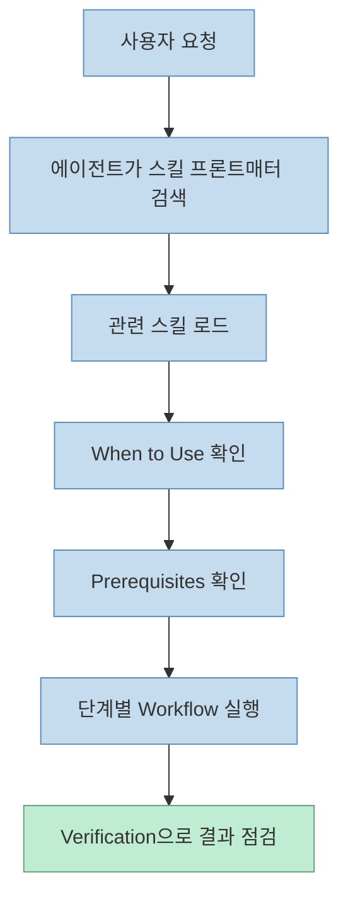
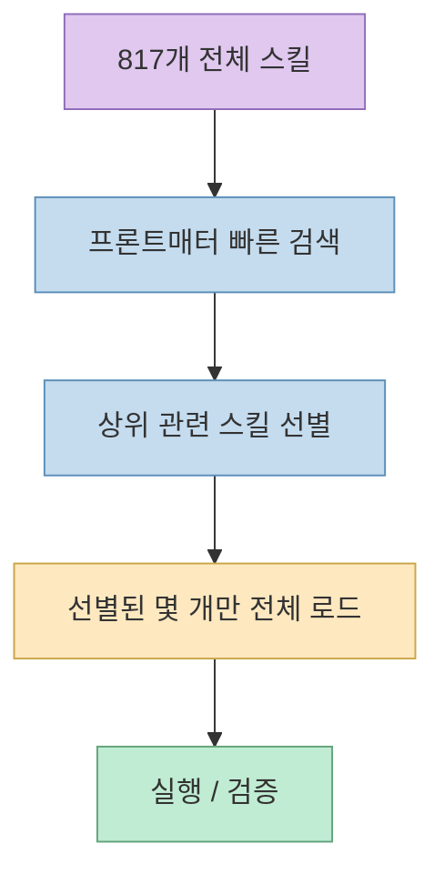
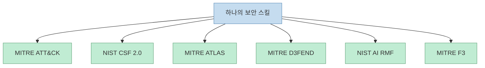
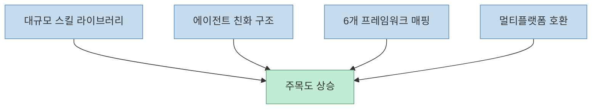

이 Shorts가 흥미로운 이유는 숫자보다 **형식** 을 정확히 짚기 때문입니다. 
겉으로 보면 “사이버보안 스킬 817개”라는 큰 숫자가 먼저 보이지만, 진짜 핵심은 그게 아닙니다.

이 저장소의 핵심은:

- 코드 실행 파일이 아니라
- AI 에이전트가 읽는 구조화된 플레이북이며
- 그것을 보안 프레임워크와 연결해
- 에이전트가 작업 중에 바로 참조할 수 있게 만들었다

는 점입니다.

<!--more-->

## Sources

- <https://youtube.com/shorts/TtwlMksw6hQ?si=6FP1W7CqmMhc1WeS>
- <https://github.com/mukul975/Anthropic-Cybersecurity-Skills>
- <https://github.com/anthropics/skills>
- <https://github.com/mukul975/Anthropic-Cybersecurity-Skills/security>
- <https://github.com/mukul975/Anthropic-Cybersecurity-Skills/releases>

## 먼저 중요한 오해부터: Anthropic 공식 프로젝트가 아니다

영상이 가장 먼저 짚은 포인트는 정확합니다. 
이 저장소 이름은 **Anthropic-Cybersecurity-Skills** 이지만, GitHub README 최상단에는 분명히 이렇게 적혀 있습니다.

- **Community Project**
- **Not affiliated with Anthropic PBC**

즉 이건 Anthropic 본사가 만든 공식 보안 지식베이스가 아니라, **커뮤니티 주도 독립 프로젝트** 입니다. <https://github.com/mukul975/Anthropic-Cybersecurity-Skills>

이 구분은 중요합니다. 
이름 때문에 “Anthropic이 만든 공식 보안 플레이북 묶음”처럼 오해하기 쉽지만, 실제로는 Anthropic의 `skills` 개념과 `agentskills.io` 표준 흐름을 가져와, 보안 분야에 맞게 대규모로 확장한 라이브러리라고 보는 편이 정확합니다. <https://github.com/anthropics/skills>

## 이 저장소는 도구 모음이 아니라 "AI가 읽는 시니어 플레이북"이다

영상도 강조했듯이, 이 스킬들은 exploit 코드나 단순 실행 파일 모음이 아닙니다. 
README는 이 저장소를:

- YAML frontmatter
- structured Markdown
- step-by-step workflows
- verification section
- deep reference context

를 갖춘 **AI-native knowledge base** 라고 설명합니다. <https://github.com/mukul975/Anthropic-Cybersecurity-Skills>

즉 이 구조는 이렇게 이해하면 됩니다.

- 사람 신입 분석가가 막막해하는 작업이 있다
- 시니어는 그 작업에 대한 플레이북을 알고 있다
- 그 플레이북을 스킬 형식으로 적어 둔다
- 에이전트는 필요할 때 그 스킬을 로드해서 절차대로 따라간다

그래서 이 프로젝트의 핵심은 “보안 명령어 백과사전”이 아니라, **시니어 보안 분석가의 작업 절차를 에이전트용 스킬 포맷으로 번역한 것** 입니다.

## 817개라는 숫자보다 중요한 건 "29개 도메인"과 "progressive disclosure"다

2026년 6월 24일 현재 GitHub README는 이 저장소를 **817 production-grade cybersecurity skills** 로 소개합니다. 같은 README는 29개 보안 도메인, 26개 이상 AI 플랫폼 호환을 함께 적고 있습니다. <https://github.com/mukul975/Anthropic-Cybersecurity-Skills>

도메인 예시는 다음처럼 매우 넓습니다.

- Cloud Security
- Threat Hunting
- Threat Intelligence
- Network Security
- Web Application Security
- Digital Forensics
- Malware Analysis
- Identity & Access Management
- SOC Operations
- OT/ICS Security
- AI Security
- Ransomware Defense
- Compliance & Governance

등입니다. <https://github.com/mukul975/Anthropic-Cybersecurity-Skills>

그런데 더 중요한 건 숫자가 아니라 **에이전트가 이걸 어떻게 읽게 했느냐** 입니다. 
README는 각 스킬이:

- frontmatter만 스캔할 때 약 30 tokens
- 전체 workflow를 로드할 때 500~2,000 tokens

수준이라고 설명합니다. 즉 에이전트는 817개 전체를 다 읽지 않고, 먼저 가볍게 찾은 뒤 필요한 몇 개만 깊게 로드합니다. README는 이를 **progressive disclosure architecture** 라고 설명합니다. <https://github.com/mukul975/Anthropic-Cybersecurity-Skills>

이 구조 덕분에 저장소는 단순히 “많다”에서 끝나지 않고, **큰 규모의 스킬 라이브러리를 실제 에이전트가 다룰 수 있게 만든다** 는 점에서 가치가 있습니다.

## 가장 큰 차별점은 6개 프레임워크 동시 매핑이다

영상에서 특히 강조한 부분도 이겁니다. 
이 저장소는 각 스킬을 보안 프레임워크 6개에 동시에 매핑했다고 주장합니다. README 기준으로 현재 매핑 대상은:

- MITRE ATT&CK
- NIST CSF 2.0
- MITRE ATLAS
- MITRE D3FEND
- NIST AI RMF
- MITRE F3 (Fight Fraud Framework)

입니다. <https://github.com/mukul975/Anthropic-Cybersecurity-Skills>

README가 직접 말하듯, 한 스킬이 여섯 프레임워크에 연결되면 “one skill, six compliance checkboxes”처럼 동작할 수 있습니다.

이게 중요한 이유는 보안 실무에서 작업이 늘 두 층으로 존재하기 때문입니다.

- 실제 탐지/분석/대응 작업
- 그 작업을 프레임워크 기준으로 설명하고 증빙해야 하는 층

보통은 이 둘이 분리됩니다. 
하지만 이 저장소는 스킬이 처음부터 프레임워크 매핑을 품고 있으므로, 에이전트가 절차를 수행하는 동시에 **규제/컴플라이언스 설명 가능성** 도 어느 정도 확보하게 됩니다.

이 프로젝트가 단순한 prompt pack보다 더 큰 이유가 바로 여기 있습니다. 
**운영 절차와 프레임워크 언어를 동시에 붙였다** 는 점입니다.

## "공격 도구 모음"이 아니라 방어·탐지·교육 편향이 강하다

영상은 “그럼 해킹 도구냐?”라는 오해를 바로 잡습니다. 
README의 도메인 분포를 봐도 이 설명은 대체로 맞습니다.

비중이 큰 쪽은:

- threat hunting
- digital forensics
- SOC operations
- incident response
- compliance & governance
- ransomware defense
- phishing defense
- zero trust

같은 방어/탐지/운영 영역입니다. <https://github.com/mukul975/Anthropic-Cybersecurity-Skills>

물론 Red Teaming, Penetration Testing 같은 범주도 존재합니다. 하지만 저장소의 `SECURITY.md` 는 위험한 명령, 오용될 수 있는 절차, 민감한 내용이 보안 신고 대상이라고 밝히며, 커뮤니티 운영도 48시간 acknowledgment 기준의 responsible disclosure 흐름을 둡니다. <https://github.com/mukul975/Anthropic-Cybersecurity-Skills/security>

즉 이 저장소는 offensive 내용이 아예 없다는 뜻이 아니라, **공격적 지식까지도 방어·교육·검증 가능한 skill 형태로 관리하려는 커뮤니티 거버넌스** 를 갖추려는 쪽에 더 가깝습니다.

## 왜 "Anthropic Skills" 개념과 잘 맞는가

Anthropic의 공식 `skills` 저장소는 스킬을 “Claude가 특화된 작업을 반복 가능하게 수행하도록 가르치는 instructions, scripts, resources의 폴더”라고 설명합니다. <https://github.com/anthropics/skills>

Anthropic-Cybersecurity-Skills는 정확히 이 개념을 보안 도메인에 확장합니다.

- 언제 쓰는지
- 선행 조건은 뭔지
- 어떤 절차를 밟는지
- 어떤 결과를 확인해야 하는지

를 분리해 넣으면, 일반적인 LLM이 “보안 관련 위키식 설명”을 하는 수준에서 벗어나, 훨씬 더 **절차적이고 검증 가능한 작업 흐름** 으로 움직일 수 있게 됩니다.

이 점은 README의 예시에서도 드러납니다. 
메모리 덤프에서 credential theft 흔적을 찾으라는 요청이 들어오면, 에이전트는 관련 frontmatter를 빠르게 스캔한 뒤 Volatility3, credential dumping hunting, Windows event log 상관분석 관련 스킬을 로드하고, Verification 섹션을 통해 결과를 확인합니다. <https://github.com/mukul975/Anthropic-Cybersecurity-Skills>

즉 이 저장소가 하는 일은 “보안 지식 추가”라기보다, **보안 작업을 에이전트가 따라 할 수 있는 단위로 proceduralize** 하는 것입니다.

## 이 프로젝트가 특히 주목받는 이유

정리하면 이 저장소가 주목받는 이유는 네 가지입니다.

### 1. 규모

817개 스킬, 29개 도메인이라는 숫자 자체가 이미 크고, 공개형 오픈소스 라이브러리로는 드문 편입니다.

### 2. 구조

그냥 문서가 아니라 agentskills 형식, frontmatter, workflow, verification을 갖춰 실제 agent consumption을 염두에 둡니다.

### 3. 프레임워크 매핑

보안 현업이 쓰는 프레임워크 여섯 개에 동시 매핑해, 절차와 거버넌스 언어를 붙였습니다.

### 4. 멀티플랫폼성

README는 Claude Code, GitHub Copilot, Codex CLI, Cursor, Gemini CLI, 그리고 20개 이상 플랫폼을 지원한다고 설명합니다. 즉 특정 벤더에만 묶이지 않습니다. <https://github.com/mukul975/Anthropic-Cybersecurity-Skills>

## 다만 그대로 만능처럼 보면 안 되는 이유

이 프로젝트를 과장해서 받아들이면 안 되는 이유도 분명합니다.

### 1. 공식 Anthropic 프로젝트가 아니다

브랜드 이름이 들어가지만, README가 직접 독립 커뮤니티 프로젝트라고 못 박고 있습니다.

### 2. 스킬이 있다고 해서 판단 책임이 사라지진 않는다

보안은 고위험 영역이기 때문에, 절차가 구조화되어 있어도 실제 분석과 승인 책임은 여전히 사람에게 있습니다.

### 3. offensive 내용은 특히 조심해서 다뤄야 한다

저장소가 defensive/educational framing을 갖추고 있어도, 일부 카테고리는 잘못 쓰면 오용 위험이 있습니다. 그래서 보안 정책과 검토 체계가 더 중요합니다.

### 4. tagged release와 main branch의 숫자가 다를 수 있다

README와 릴리스 페이지를 같이 보면, `v1.0.0` 태그 시점에는 734 skills였고, 이후 `main` 브랜치에서 817개와 6-framework mapping으로 성장했다고 설명합니다. 즉 “현재 몇 개냐”는 branch/release 시점에 따라 달라질 수 있습니다. <https://github.com/mukul975/Anthropic-Cybersecurity-Skills/releases> <https://github.com/mukul975/Anthropic-Cybersecurity-Skills>

## 핵심 요약

- Anthropic-Cybersecurity-Skills는 Anthropic 공식 프로젝트가 아니라 독립 커뮤니티 저장소다
- 핵심은 817개라는 숫자보다, 시니어 보안 플레이북을 에이전트가 읽는 스킬 형식으로 구조화했다는 점이다
- 각 스킬은 YAML frontmatter, workflow, verification을 포함한 procedural knowledge다
- 6개 보안 프레임워크 매핑 덕분에 절차와 컴플라이언스 설명층을 함께 붙일 수 있다
- offensive 스킬도 존재하지만, 저장소 전체의 무게중심은 탐지·방어·분석·운영 쪽에 더 가깝다
- 이 프로젝트는 일반 LLM을 “보안 설명기”에서 “보안 작업 절차를 따르는 에이전트” 쪽으로 밀어주는 구조다

## 결론

이 Shorts의 핵심은 “보안 스킬 817개”라는 숫자 자랑이 아닙니다. 
더 중요한 건, **보안 실무의 절차적 지식을 에이전트가 로드 가능한 스킬 형식으로 대규모 구조화했다** 는 점입니다.

그래서 이 프로젝트는 보안 도구 모음이라기보다, **AI 에이전트 시대의 보안 플레이북 운영체제 실험** 으로 보는 편이 더 정확합니다.
