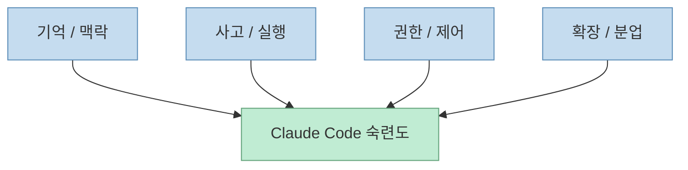
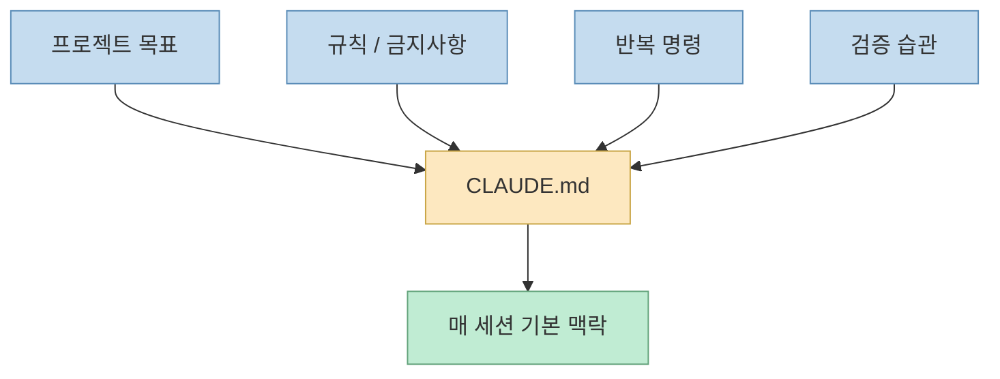
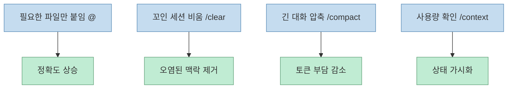
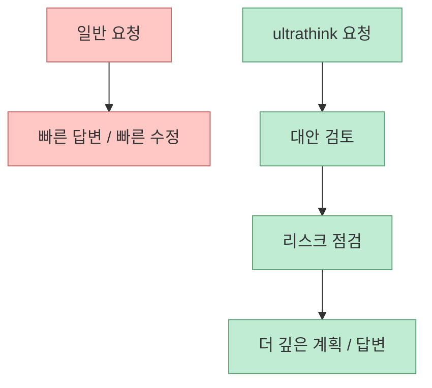
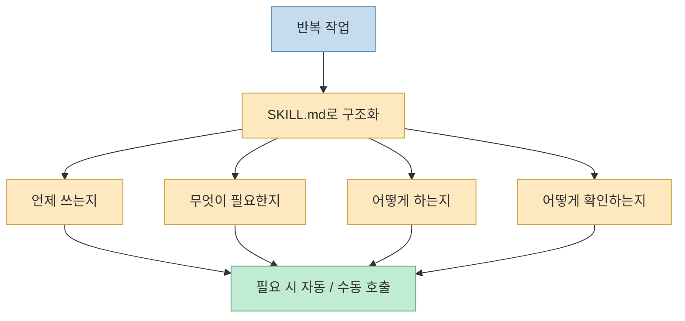
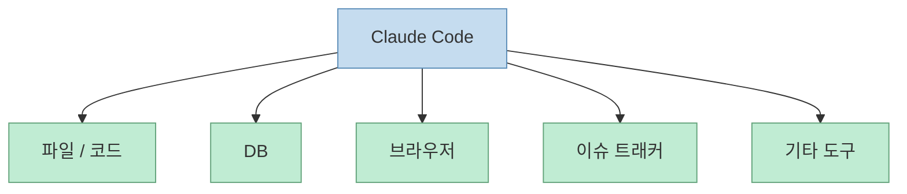
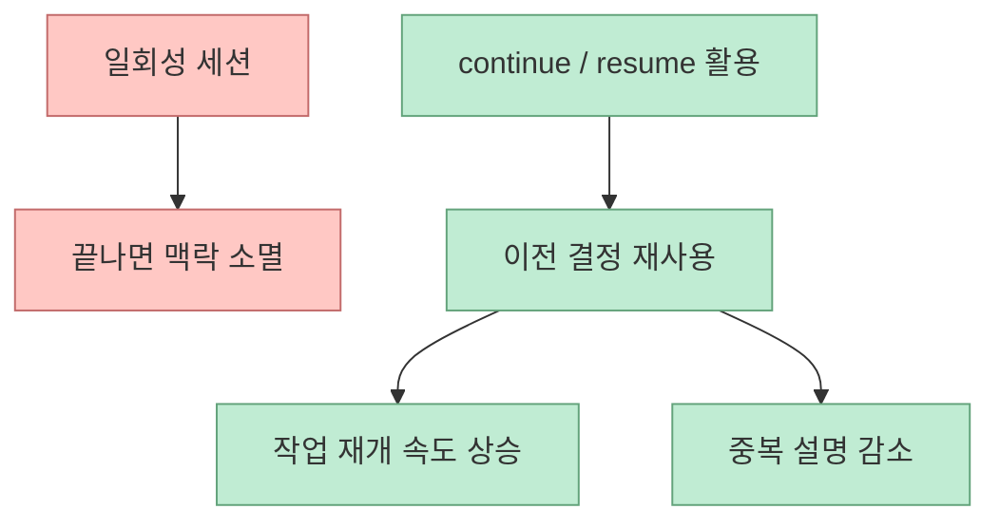

이 Shorts가 좋은 이유는 Claude Code 기능을 많이 아는 척하지 않기 때문입니다. 
오히려 반대로 말합니다.

> 다 알 필요 없다. 핵심 13개만 챙기면 된다.

이 말이 중요한 이유는, Claude Code 숙련도가 “명령어 많이 외우기”가 아니라 **어디를 조작해야 결과가 달라지는지 아는 것** 에 더 가깝기 때문입니다.

그래서 이번 글에서는 영상의 13개 항목을 단순 기능 목록이 아니라, Claude Code를 다룰 때 손이 닿는 **13개의 조작면(control surfaces)** 으로 재구성해 보겠습니다.

<!--more-->

## Sources

- <https://youtube.com/shorts/LaYYCHCuVQc?si=CneBClbDTGXbsRWb>

## 13개를 외우는 대신 4개 층으로 보면 훨씬 이해가 쉽다

영상의 13개는 사실 네 층으로 묶으면 더 명확해집니다.

1. **기억과 맥락 층**
   - `CLAUDE.md`
   - `@`
   - `/clear`
   - `/compact`
   - `/context`
   - `--continue`
   - `--resume`
2. **사고와 실행 층**
   - Plan Mode
   - `ultrathink`
   - Headless (`claude -p`)
3. **권한과 제어 층**
   - `/permissions`
   - Hooks
4. **확장과 분업 층**
   - Slash Commands
   - Skills
   - Subagents
   - MCP

즉 영상이 말하는 건 “13개의 팁”이라기보다, Claude Code를 조작하는 네 개의 층을 알아야 한다는 뜻입니다.

## 1. `CLAUDE.md`는 프롬프트가 아니라 "프로젝트 운영 헌장"이다

영상이 첫 번째로 둔 이유가 있습니다. 
`CLAUDE.md`는 자주 쓰는 명령이나 규칙을 적어 두는 파일처럼 보이지만, 실제로는 **프로젝트의 운영 헌장** 에 가깝습니다.

여기에 담아야 하는 건 단순 취향이 아니라:

- 프로젝트 목표
- 핵심 규칙
- 반복되는 작업 표준
- 피해야 할 함정
- 검증 습관

입니다.

즉 Claude Code가 세션마다 새로 설명을 듣는 대신, **항상 읽고 들어가는 베이스 규약** 을 가지게 만드는 장치입니다.

핵심은 이겁니다. 
**잘 쓰는 사람은 매번 설명하지 않는다. 프로젝트가 스스로 말하게 만든다.**

## 2. 컨텍스트 관리는 곧 비용 관리이자 품질 관리다

영상이 두 번째로 강조한 것은 `@`, `/clear`, `/compact`, `/context` 입니다. 
이건 단순 보조 기능이 아니라 Claude Code의 품질을 좌우하는 핵심 레버입니다.

### `@`

필요한 파일을 대화에 명시적으로 붙입니다. 
즉 막연한 “이 코드 좀 봐줘” 대신, **어떤 파일을 보고 판단해야 하는지 범위를 명확히 지정** 합니다.

### `/clear`

지금까지의 대화 맥락을 비웁니다. 
즉 꼬인 상태를 계속 끌고 가지 않게 하는 리셋 버튼입니다.

### `/compact`

긴 세션을 짧은 요약으로 압축합니다. 
즉 다 버리는 게 아니라, 핵심만 남기고 토큰 부담을 줄입니다.

### `/context`

현재 얼마나 컨텍스트를 쓰고 있는지 확인합니다. 
즉 “왜 점점 이상해지지?”를 감으로 느끼기 전에, 상태를 계량적으로 볼 수 있게 합니다.

즉 컨텍스트 관리는 편의 기능이 아니라, **에이전트가 무엇을 기억하고 무엇을 잊게 할지 설계하는 일** 입니다.

## 3. Plan Mode는 "코드 쓰기 전 생각"을 강제로 만든다

영상이 말한 세 번째 포인트는 Shift+Tab으로 여는 Plan Mode입니다. 
이게 중요한 이유는 Claude Code가 원래는 너무 쉽게 바로 코드를 쓰려는 쪽으로 흐르기 때문입니다.

Plan Mode를 쓰면 흐름이 바뀝니다.

- 바로 수정하지 않고
- 먼저 작업 구조를 분해하고
- 어떤 파일이 바뀔지 보고
- 어떤 위험이 있는지 본 다음
- 그 다음에 실행합니다

즉 Plan Mode는 생산성을 늦추는 기능이 아니라, **실수 비용을 앞단에서 줄이는 기능** 입니다.

## 4. `Esc Esc`는 Undo가 아니라 "실행 흐름 되감기"다

네 번째로 나온 되감기 기능도 작아 보이지만 중요합니다. 
AI 도구를 쓰다 보면 한 번 잘못 실행된 흐름을 복구하느라 더 많은 시간이 들 때가 많습니다.

`Esc Esc`는 단순 편의 기능이 아닙니다. 
이 기능은 “실수했을 때 사후 설명과 원복 요청으로 토큰을 더 쓰는 루프”를 줄여줍니다.

즉 되감기는 코드 편집 기능이라기보다, **잘못 시작된 상호작용을 짧게 끊는 장치** 입니다.

## 5. `ultrathink`는 모델을 바꾸는 게 아니라 사고 시간을 더 사는 명령이다

영상이 다섯 번째로 넣은 건 `ultrathink` 입니다. 
어려운 문제에 이 단어를 붙이면 더 깊게 생각하게 된다고 설명하죠.

이걸 정확히 이해하면, `ultrathink`는 “고성능 모드”라기보다:

- 즉답을 늦추고
- 더 많은 대안과 검토를 하게 하고
- 성급한 패치 대신 사고 단계를 늘리는

명시적 사고 요청입니다.

즉 Plan Mode가 **생각의 구조화** 라면, `ultrathink`는 **생각의 깊이 확장** 에 가깝습니다.

## 6. `/permissions`는 "귀찮은 승인 끄기"가 아니라 권한 경계를 설계하는 기능이다

영상은 여섯 번째로 권한 모드를 설명하면서 “자동 수락을 켜거나 허용할 것만 정해 두면 된다”고 말합니다. 
하지만 여기서 더 중요한 건 자동화가 아니라 **권한 경계의 명시화** 입니다.

Claude Code를 쓸수록 이 질문이 중요해집니다.

- 어디까지 자동 승인할 것인가
- 파일 수정은 괜찮지만 네트워크는 막을 것인가
- 어떤 작업은 매번 사람 확인을 받을 것인가

즉 `/permissions`는 편의 기능이 아니라, **에이전트에게 줄 자율성의 범위를 설계하는 기능** 입니다.

## 7. Slash Commands는 "자주 쓰는 작업의 입구"를 만든다

슬래시 커맨드는 자주 쓰는 동작을 명령 이름으로 묶는 장치입니다. 
여기서 중요한 건 단축 그 자체보다 **반복 절차를 표준화** 한다는 점입니다.

예를 들면:

- 특정 형식의 리뷰
- 특정 형식의 문서 생성
- 특정 검증 루프

를 매번 장문의 자연어로 다시 설명하는 대신, `/something` 같은 고정 진입점으로 부를 수 있습니다.

즉 Slash Commands는 개인 습관을 **반복 가능한 인터페이스** 로 바꾸는 층입니다.

## 8. Skills는 "잘하는 방법"을 저장하는 포맷이다

영상의 여덟 번째 포인트인 Skills는 이미 반복 업무를 구조화하는 핵심 기능입니다. 
반복하는 작업을 `SKILL.md` 형태로 만들어 두면, 필요할 때 그 절차를 다시 꺼낼 수 있습니다.

중요한 건 Skills가 단순 텍스트 저장소가 아니라:

- 언제 쓰는지
- 어떤 입력이 필요한지
- 어떤 단계로 수행하는지
- 어떤 결과를 검증하는지

를 저장하는 형식이라는 점입니다.

즉 Skills는 “팁 저장”이 아니라 **작업 방식 저장** 입니다.

## 9. Subagents는 "빠르게"보다 "분리해서"가 더 중요하다

영상은 아홉 번째부터 “고수 영역”이라고 말합니다. 
Subagents의 핵심은 병렬성도 맞지만, 더 중요한 건 **격리** 입니다.

Subagents를 쓰면:

- 무거운 조사
- 부차 작업
- 독립적인 탐색

을 메인 대화에서 분리할 수 있습니다.

즉 장점은 두 가지입니다.

1. 여러 일을 동시에 돌릴 수 있다
2. 메인 세션이 오염되지 않는다

그래서 Subagents는 단순 가속 도구라기보다, **컨텍스트 오염을 막는 분리 실행 장치** 로 이해하는 편이 좋습니다.

## 10. Hooks는 "실수하지 말라"를 시스템으로 바꾸는 기능이다

영상의 열 번째 포인트인 Hooks는 특히 중요합니다. 
AI는 같은 실수를 반복하는 경향이 있는데, Hook은 특정 순간에 자동으로 규칙을 강제합니다.

예를 들어:

- 파일 저장 직전
- 명령 실행 직전
- 응답 완료 직전

같은 타이밍에 검사를 넣을 수 있습니다.

즉 Hook은 “주의해”라는 인간의 부탁을 넘어서, **정해진 순간마다 자동으로 발동하는 가드레일** 입니다.

## 11. MCP는 Claude Code의 세계를 바깥으로 연결한다

열한 번째 MCP는 단순 확장 기능이 아닙니다. 
영상이 말한 것처럼 DB, 브라우저, 이슈 트래커 등을 연결하면 Claude Code는 파일 안쪽만 다루는 도구에서 벗어나, **외부 도구와 상태를 직접 다루는 실행자** 가 됩니다.

즉 MCP는 Claude Code의 능력을 “모델 안”이 아니라 “도구 네트워크 안”으로 확장합니다.

즉 MCP는 기능 하나가 아니라, **Claude Code의 작업 세계를 넓히는 연결 규약** 입니다.

## 12. Headless는 Claude Code를 "앱"이 아니라 "컴포넌트"로 바꾼다

영상이 말한 `claude -p` 같은 헤드리스 모드는 매우 중요합니다. 
이 기능이 있으면 Claude Code는 대화형 터미널 앱을 넘어:

- 스크립트 안
- CI 파이프라인 안
- 다른 프로그램 안

에서 호출 가능한 컴포넌트가 됩니다.

즉 Claude Code를 직접 쓰는 것에서 끝나지 않고, **내 도구 체인 안에 임베드** 할 수 있다는 뜻입니다.

## 13. `--continue`와 `--resume`은 세션을 자산으로 만든다

마지막 항목은 세션 이어가기입니다. 
많은 사람이 AI 세션을 일회성 대화처럼 쓰지만, 이 기능은 세션을 **재사용 가능한 작업 단위** 로 바꿉니다.

- `--continue`: 방금 하던 흐름을 이어간다
- `--resume`: 이전 세션 중 특정 세션을 다시 불러온다

이 기능이 중요한 이유는, 작업 기록이 단순 로그가 아니라 **이전 의사결정과 맥락을 가진 상태 자산** 이 되기 때문입니다.

## 결국 잘 쓰는 사람은 13개를 모두 외우는 사람이 아니다

이 영상이 좋은 이유는 마지막 메시지가 명확하기 때문입니다. 
중요한 건 기능을 다 안다는 게 아닙니다.

오히려 잘 쓰는 사람은:

- 규칙을 파일로 고정하고
- 맥락을 비우고 압축할 줄 알고
- 코드 전에 계획을 세우고
- 깊게 생각시켜야 할 때를 알고
- 권한 경계를 설계하고
- 반복 작업을 명령·스킬로 묶고
- 분업과 외부 도구 연결을 활용하고
- 세션을 자산처럼 이어갑니다

즉 Claude Code 숙련도는 모델 이해보다 **작업 환경 설계 능력** 에 가깝습니다.

## 핵심 요약

- 영상의 13개 기능은 단순 팁이 아니라 Claude Code의 13개 조작면이다
- `CLAUDE.md`는 프로젝트 운영 헌장 역할을 한다
- `@`, `/clear`, `/compact`, `/context`는 컨텍스트 품질과 비용을 동시에 관리한다
- Plan Mode와 `ultrathink`는 각각 생각의 구조와 깊이를 늘린다
- `/permissions`와 Hooks는 에이전트 자율성의 경계를 설계한다
- Slash Commands, Skills, Subagents, MCP는 반복 작업과 외부 연결, 분업을 구조화한다
- Headless와 session resume은 Claude Code를 앱에서 재사용 가능한 작업 컴포넌트로 확장한다

## 결론

이 Shorts의 핵심은 “기능 13개를 외워라”가 아닙니다. 
더 정확히는, **Claude Code를 잘 쓴다는 건 모델과 대화하는 법이 아니라, 기억·사고·권한·분업의 조작면을 다루는 법을 아는 것** 이라는 메시지에 가깝습니다.

그래서 이 13개는 기능 목록이 아니라, **Claude Code를 작업 시스템으로 쓰기 위한 최소 제어판** 으로 보는 편이 더 정확합니다.
