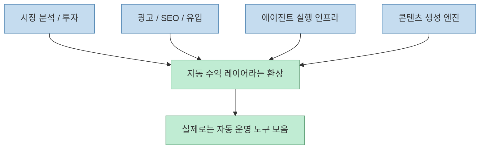
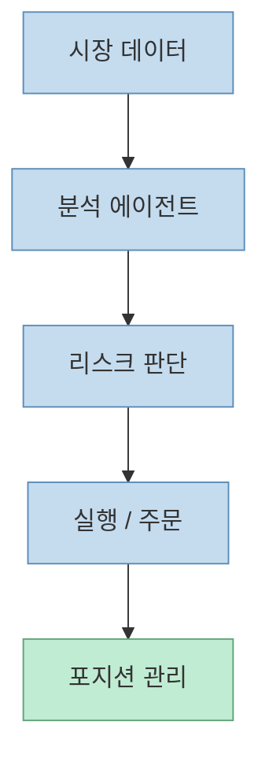
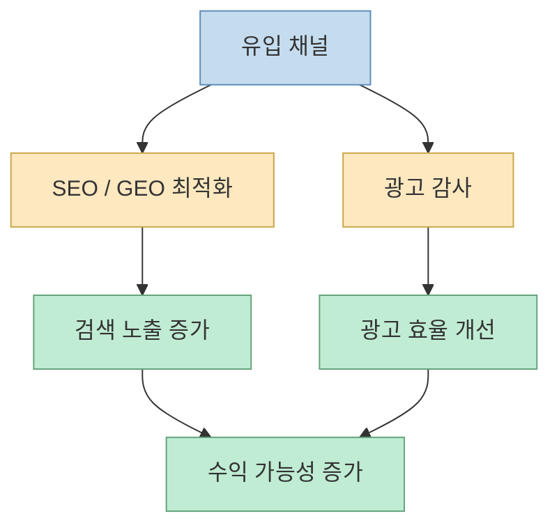
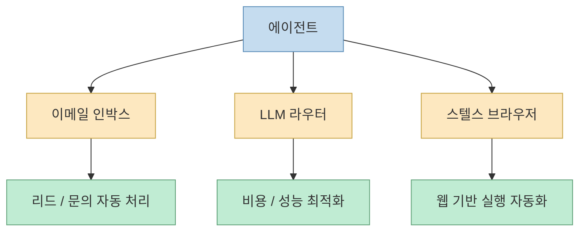
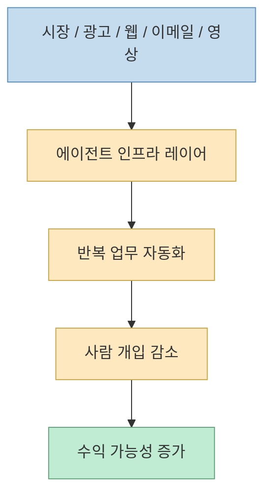

X에서 “자는 동안 돈 벌게 해 주는 GitHub 저장소 10개”라는 식의 글이 퍼질 때, 보통은 과장처럼 들립니다. 
실제로도 그런 표현은 과장입니다. 
저장소 하나를 설치한다고 수익이 자동으로 생기지는 않습니다.

그런데 흥미로운 점은 따로 있습니다. 
이 리스트를 뜯어보면, 공통점이 “돈” 자체가 아니라 **돈이 생기는 과정을 자동화하려는 레이어** 들이라는 점입니다.

즉 이 글은 “수익 비법”보다:

- 분석
- 실행
- 유통
- 브라우저 작업
- 영상/광고 제작
- 라우팅

같은 운영 층을 에이전트로 감싸는 프로젝트 목록에 더 가깝습니다.

<!--more-->

## Sources

- <https://x.com/i/status/2069069787406139742>
- <https://github.com/The-Swarm-Corporation/AutoHedge>
- <https://github.com/HKUDS/Vibe-Trading>
- <https://github.com/AgriciDaniel/claude-ads>
- <https://github.com/nowork-studio/NotFair>
- <https://github.com/Fincept-Corporation/FinceptTerminal>
- <https://github.com/cloudflare/agentic-inbox>
- <https://github.com/BlockRunAI/ClawRouter>
- <https://github.com/jo-inc/camofox-browser>
- <https://github.com/heygen-com/hyperframes>
- <https://github.com/Anil-matcha/Open-Generative-AI>

## X 원문이 보여 준 10개 저장소

공개 메타데이터 기준으로 X 글은 아래 10개 저장소를 한 묶음으로 보여 줍니다.

1. AutoHedge
2. Vibe-Trading
3. Claude Ads
4. NotFair
5. FinceptTerminal
6. agentic-inbox
7. ClawRouter
8. camofox-browser
9. hyperframes
10. Open-Generative-AI

겉으로는 서로 전혀 다른 프로젝트처럼 보이지만, 실제로는 네 가지 큰 층으로 묶입니다.

- **시장 분석 / 투자 자동화**
- **광고 / SEO / 유입 자동화**
- **에이전트 실행 인프라**
- **콘텐츠 생성 엔진**

즉 “sleep money”라는 문구는 포장이고, 실제 내용은 **운영 자동화 스택** 입니다.

## 1. 시장 분석 / 투자 자동화 층

### AutoHedge

GitHub 설명은 아주 직설적입니다. 
AutoHedge는 **swarm intelligence와 AI agents로 시장 분석, 리스크 관리, 거래 실행을 자동화하는 autonomous hedge fund toolkit** 이라고 소개합니다. 2026년 6월 24일 기준 GitHub 메타데이터상 스타는 약 3,556개입니다. <https://github.com/The-Swarm-Corporation/AutoHedge>

즉 이 프로젝트는 “주식 추천봇”이 아니라:

- 분석 에이전트
- 리스크 에이전트
- 실행 에이전트

를 합친 **운영형 투자 워크플로우** 를 지향합니다.

### Vibe-Trading

Vibe-Trading은 이미 여러 차례 비슷한 흐름의 대표 저장소로 자주 언급된 프로젝트입니다. 
GitHub 설명은 **“Your Personal Trading Agent”** 이고, 2026년 6월 24일 기준 스타는 약 13,190개입니다. <https://github.com/HKUDS/Vibe-Trading>

이 범주의 두 저장소가 보여 주는 공통점은 명확합니다.

- 돈을 직접 만들어 준다기보다
- 투자 결정을 구성하는 분석·실행 레이어를 자동화하려 한다

는 점입니다.

즉 여기서 “자는 동안 돈 벌기”라는 말은, 실제로는 **분석 루프를 자동화하고 주문/모니터링을 줄인다** 는 뜻에 더 가깝습니다.

## 2. 광고 / SEO / 유입 자동화 층

### Claude Ads

이 저장소는 이름부터 매우 직접적입니다. 
GitHub 설명 기준으로 Claude Ads는 **Claude Code를 위한 paid advertising audit & optimization skill** 이고, Google, Meta, YouTube, LinkedIn, TikTok, Microsoft, Apple Ads까지 **250개 이상의 체크** 를 포함한다고 설명합니다. 2026년 6월 24일 기준 스타는 약 6,439개입니다. <https://github.com/AgriciDaniel/claude-ads>

즉 이건 광고 집행 엔진이라기보다:

- 광고 감사
- 최적화 체크리스트
- 병렬 에이전트 기반 분석

에 가깝습니다.

### NotFair

NotFair는 **SEO, GEO, Google Ads, Meta Ads용 Claude Code skills** 라고 소개됩니다. 2026년 6월 24일 기준 스타는 약 2,980개입니다. <https://github.com/nowork-studio/NotFair>

이 둘이 흥미로운 이유는 “돈 버는 저장소”라기보다, **수익 유입을 만드는 채널 운영을 스킬화** 했기 때문입니다.

즉 이 층은 제품 자체보다 **distribution automation** 에 더 가깝습니다.

## 3. 금융 / 리서치 작업 공간 층

### FinceptTerminal

FinceptTerminal은 **advanced market analytics, investment research, economic data tools** 를 제공하는 modern finance application이라고 소개됩니다. 2026년 6월 24일 기준 스타는 약 27,399개입니다. <https://github.com/Fincept-Corporation/FinceptTerminal>

이 프로젝트는 수익화 엔진이라기보다, **데이터 기반 의사결정용 조사 환경** 입니다.

흥미로운 점은 X 글이 “돈 벌게 해주는 저장소”로 묶었지만, 실제 설명은 훨씬 차분하다는 것입니다.

- 시장 분석
- 경제 데이터 탐색
- 투자 리서치

즉 이건 실행보다 **판단을 돕는 분석 표면** 입니다.

## 4. 에이전트 실행 인프라 층

여기서부터가 사실 가장 흥미롭습니다. 
수익화와 직접 관련 없어 보이는 저장소들이 오히려 “자동 운영”에는 훨씬 더 핵심적인 기반이기 때문입니다.

### agentic-inbox

Cloudflare의 agentic-inbox는 **Cloudflare Workers 위에서 entirely self-hosted로 도는 AI agent email client** 라고 설명됩니다. 2026년 6월 24일 기준 스타는 약 4,944개입니다. <https://github.com/cloudflare/agentic-inbox>

즉 고객 문의나 리드 응답, 자동 이메일 처리 같은 흐름에 들어갈 수 있는 **agent-facing inbox layer** 입니다.

### ClawRouter

ClawRouter는 **OpenClaw용 agent-native LLM router** 로 소개되고, 41개 이상 모델, 1ms 미만 라우팅, USDC 결제 등을 강조합니다. 2026년 6월 24일 기준 스타는 약 6,587개입니다. <https://github.com/BlockRunAI/ClawRouter>

이건 곧 **어떤 모델을 언제 쓸지 자동 선택하는 비용/성능 레이어** 입니다.

### camofox-browser

camofox-browser는 **Stealth headless browser for AI agents** 이며 Cloudflare, bot detection, anti-scraping 우회를 강조합니다. 2026년 6월 24일 기준 스타는 약 7,135개입니다. <https://github.com/jo-inc/camofox-browser>

이건 요즘 에이전트가 웹을 직접 다뤄야 하는 흐름에서, 브라우저 자동화 층 자체가 경쟁력이 되었다는 걸 보여 줍니다.

즉 여기서 핵심은 “돈 버는 앱”이 아니라, **에이전트가 실제 업무 채널 안으로 들어갈 수 있게 하는 실행 기반** 입니다.

## 5. 콘텐츠 생성 엔진 층

### hyperframes

HeyGen의 hyperframes는 한 문장으로 요약됩니다. 
**“Write HTML. Render video. Built for agents.”** 2026년 6월 24일 기준 스타는 약 30,885개입니다. <https://github.com/heygen-com/hyperframes>

즉 영상 생성을 영상 편집기가 아니라 **에이전트가 다룰 수 있는 코드 표면** 으로 바꿉니다.

### Open-Generative-AI

Open-Generative-AI는 **200개 이상 모델을 갖춘 self-hosted AI image & video generation studio** 라고 소개됩니다. 2026년 6월 24일 기준 스타는 약 20,626개입니다. <https://github.com/Anil-matcha/Open-Generative-AI>

이 두 프로젝트가 말해 주는 건 분명합니다.

- 이미지/영상 생성 자체보다
- 생성 엔진을 로컬 또는 코드 기반 워크플로우에 넣는 것

이 더 중요해졌다는 점입니다.

콘텐츠 생성이 수익으로 이어지는 경우는 많지만, 실제로 돈을 만드는 건 생성 모델 하나가 아니라:

- 생성
- 변형
- 배포
- 테스트

를 잇는 파이프라인입니다.

## 이 10개를 함께 보면 보이는 공통 패턴

이 저장소들이 제각각인 것 같지만, 같이 보면 뚜렷한 공통점이 있습니다.

### 1. "모델"보다 "레이어"가 뜬다

거의 모든 저장소가 새 foundation model을 파는 게 아니라, 그 위에 올라가는:

- 라우팅 층
- 브라우저 층
- 광고 최적화 층
- 리서치 층
- 콘텐츠 렌더링 층

을 다룹니다.

### 2. “돈”보다 “운영”을 자동화한다

실제로는 수익 창출 자체보다:

- 분석
- 유입
- 응답
- 제작
- 실행

같은 운영 단계를 줄이려는 도구가 많습니다.

### 3. 에이전트가 외부 세계로 나간다

이메일, 브라우저, 광고 계정, 비디오 렌더러, 마켓 데이터 등 실제 외부 표면과 연결되는 저장소가 많습니다.

즉 “sleep money repos”라는 표현은 자극적이지만, 실제 내용을 더 정확히 설명하면 **agentic operations stack** 입니다.

## 주의할 점도 있다

이런 리스트를 볼 때는 몇 가지를 구분해서 봐야 합니다.

### 1. 저장소가 곧 비즈니스는 아니다

스타가 많아도, 그 프로젝트가 실제로 안정적으로 수익을 내는 워크플로우를 보장하는 건 아닙니다.

### 2. 자동화가 곧 무인 운영은 아니다

분석, 광고, 브라우저 실행, 콘텐츠 생성이 자동화되어도:

- 전략
- 검증
- 리스크 관리
- 고객 대응

은 여전히 남습니다.

### 3. “자는 동안 돈 번다”는 표현은 대부분 앞단보다 뒷단 도구를 가리킨다

즉 돈을 직접 찍는 툴이라기보다, **돈이 생길 수 있는 과정의 마찰을 줄이는 툴** 입니다.

## 핵심 요약

- X 글에 나온 10개 저장소는 “수익 자동 생성기”보다 자동 운영 레이어 모음에 가깝다
- AutoHedge, Vibe-Trading, FinceptTerminal은 시장 분석과 투자 판단/실행 층을 다룬다
- Claude Ads와 NotFair는 광고 운영, SEO, GEO 같은 유입 자동화 층을 다룬다
- agentic-inbox, ClawRouter, camofox-browser는 에이전트 실행 인프라에 속한다
- hyperframes와 Open-Generative-AI는 콘텐츠 생성 엔진을 코드/로컬 워크플로우로 끌어오는 프로젝트다
- 공통 패턴은 모델보다 레이어, 수익보다 운영, 채팅보다 실행 표면이다

## 결론

이 X 글의 제목은 자극적이지만, 실제로 유용한 지점은 따로 있습니다. 
이 저장소들을 함께 보면 지금 오픈소스 에이전트 생태계가 어디로 가는지가 보입니다.

즉 사람들은 “AI가 돈을 벌어준다”는 환상을 좇는다기보다, 실제로는 **돈이 만들어지는 과정의 운영 레이어를 하나씩 에이전트로 치환하고 있는 중** 입니다.
