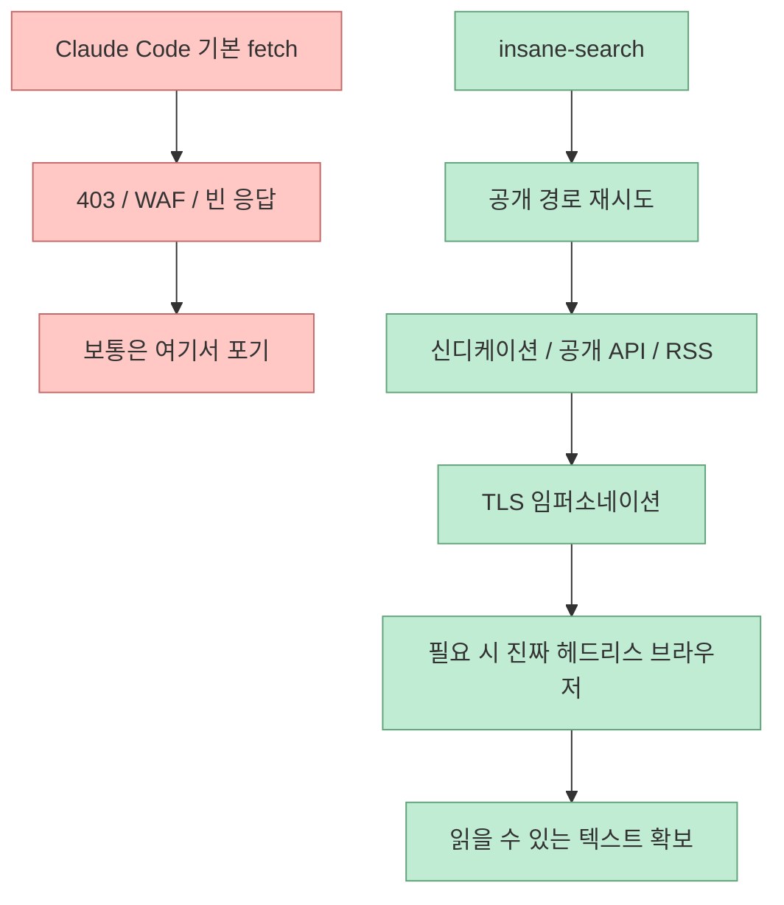
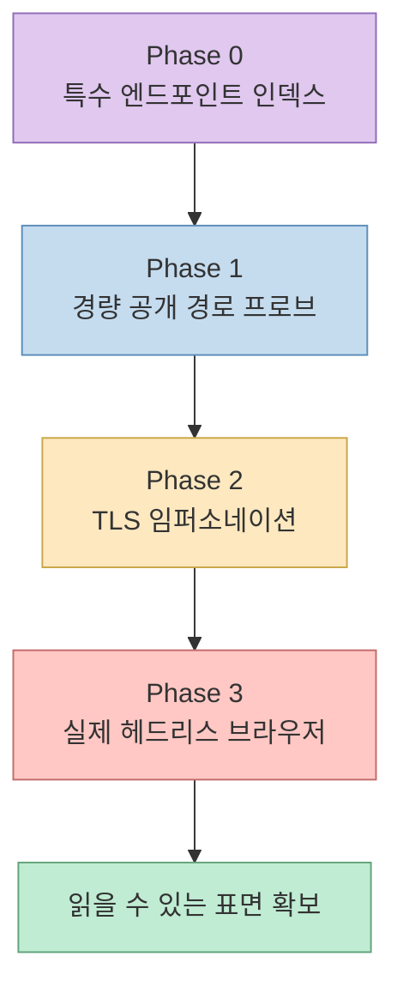
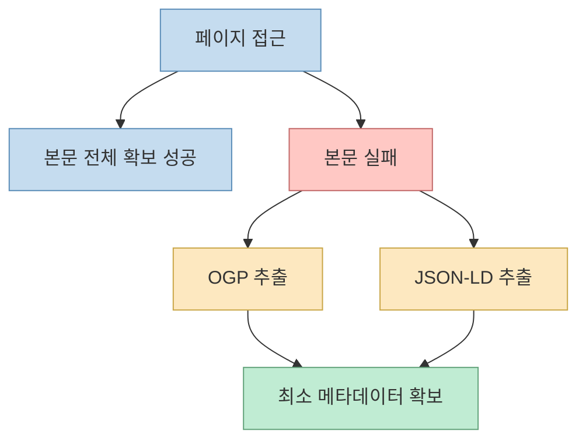

`insane-search`가 재미있는 이유는 “검색 플러그인”이라는 이름보다 실제 철학이 훨씬 더 공격적으로 설계돼 있기 때문입니다.<br>
이 저장소는 Claude Code가 웹에서 뭔가를 못 읽었을 때, 그냥 “접근 불가”로 포기하지 않게 하려는 프로젝트입니다.

즉 핵심은 검색이 아니라:

- 차단된 공개 웹에 대해
- 공개 경로를 계속 바꿔 시도하고
- 하나라도 열리는 읽기 표면을 찾을 때까지
- 적응적으로 단계 상승을 한다

는 데 있습니다.

<!--more-->

## Sources

- <https://github.com/fivetaku/insane-search>
- <https://github.com/fivetaku/insane-search/blob/main/README.ko.md>
- <https://news.hada.io/topic?id=28598>

## insane-search는 무엇인가

공식 한국어 README는 첫 문장을 아주 강하게 씁니다.

> 공개된 페이지라면, insane-search는 결국 뚫어낸다.

그리고 이 프로젝트를 **“차단에 강한 공개 페이지 리더 — Claude Code용. API 키도, 프록시 설정도 없다.”** 고 설명합니다. <https://github.com/fivetaku/insane-search/blob/main/README.ko.md>

이 정의가 중요합니다.<br>
insane-search는 웹 전반의 비공개 정보에 접근하는 도구가 아니라, **공개 페이지인데 기본 fetch가 막히는 상황에서 더 오래 시도하는 리더** 로 설계되어 있습니다.

즉 이 도구의 핵심은:

- 검색 엔진 그 자체
- 가 아니라
- 공개 경로를 단계적으로 시도하는 retrieval harness

입니다.



## 설치 후 외울 명령어가 없다는 점이 중요하다

README 기준 설치는 다음처럼 단순합니다.

```text
/plugin marketplace add https://github.com/fivetaku/gptaku_plugins.git
/plugin install insane-search@gptaku-plugins
/reload-plugins
```

그런데 더 중요한 건 다음 문장입니다.

> 외울 명령어는 없다. 평소처럼 Claude Code에게 말하면, fetch가 막히는 순간 insane-search가 알아서 끼어든다.

즉 이 프로젝트는 명시적으로 “이제부터 이 전용 명령으로만 검색해” 같은 UX를 강요하지 않습니다.<br>
사용자가 평소처럼 요청하고, **기본 fetch가 실패하는 순간 플러그인이 개입** 하는 구조를 지향합니다. <https://github.com/fivetaku/insane-search/blob/main/README.ko.md>

이 점 때문에 insane-search는 “도구 하나 추가”보다, **Claude Code의 실패 행동을 바꾸는 플러그인** 에 가깝습니다.

## 핵심 설계 원칙은 "바이어스 만들지 않기"다

GeekNews 소개글에서 작성자는 아주 명확한 문제의식을 밝힙니다.

- 기존 도구들은 특정 플랫폼 하나에 묶이거나
- API 키/OAuth를 요구하거나
- “이 사이트는 막힘” 같은 바이어스를 학습해서
- 시도조차 안 했다는 것입니다

그리고 insane-search의 핵심 원칙을 이렇게 설명합니다.

> 바이어스 만들지 않기. "이 사이트는 어렵다" 목록을 안 만들었다. 사이트도 방법도 지금은 먹힐 수 있으니까요.

즉 이 프로젝트는 성공률보다 먼저 **포기하지 않는 태도** 를 설계합니다. <https://news.hada.io/topic?id=28598>

이건 중요한 차이입니다.<br>
보통 많은 웹 툴은 “이 플랫폼은 지원 / 미지원” 식으로 끝나지만, insane-search는 공개 경로가 남아 있으면 **계속 방법을 바꿔 본다** 는 쪽입니다.

## 플랫폼 지원이 넓은 이유는 "전용 API"보다 "공개 경로"를 보기에 있다

README는 X, Reddit, YouTube, Hacker News, 네이버, 쿠팡, LinkedIn, Medium, Substack, arXiv, GitHub, Stack Overflow, Bluesky, Mastodon 등을 열거하면서, 공개 페이지·피드·RSS가 있는 모든 사이트에 적용된다고 말합니다. <https://github.com/fivetaku/insane-search/blob/main/README.ko.md>

여기서 중요한 건 이 프로젝트가 각 서비스의 정식 API를 전부 통합했다는 뜻이 아니라는 점입니다.<br>
핵심은 다음과 같습니다.

- X라면 공개 syndication이나 oEmbed류 표면
- Reddit이라면 `.json`
- Hacker News라면 Firebase 공개 API
- YouTube라면 자막/메타데이터
- 블로그 플랫폼이라면 RSS / 공개 HTML / Jina Reader

같은 **공개 읽기 경로** 를 우선 활용한다는 것입니다.

즉 지원 범위가 넓은 이유는 “통합 많이 함”보다 **웹에 이미 열려 있는 읽기 표면을 끝까지 재활용한다** 는 철학 덕분입니다.

## 진짜 흥미로운 부분은 Phase 0→3 계층 상승이다

README와 GeekNews 소개글을 합치면 insane-search의 가장 중요한 구조는 네 단계입니다.

### Phase 0 — 특수 엔드포인트 인덱스

범용 체인으로 찾기 힘든 특수 경로를 미리 안다는 층입니다.

- X syndication
- Reddit `.json`
- HN Firebase
- `yt-dlp` 1,800+ 사이트

같은 식입니다. <https://news.hada.io/topic?id=28598>

### Phase 1 — 병렬 경량 프로브

이 단계에서는:

- WebFetch
- Jina Reader
- curl with Chrome/Mobile/Googlebot UA
- `m.{domain}`
- `.json`
- `/rss`

같은 저비용 시도를 병렬로 던집니다. <https://news.hada.io/topic?id=28598>

### Phase 2 — TLS 임퍼소네이션

여기서는 `curl_cffi`를 이용해 Safari → Chrome → Firefox 순으로 TLS fingerprint를 바꿔 시도합니다. <https://github.com/fivetaku/insane-search/blob/main/README.ko.md> <https://news.hada.io/topic?id=28598>

### Phase 3 — 실제 브라우저

마지막에는 Playwright MCP를 써서 진짜 브라우저 렌더링과 숨은 API 탐색까지 갑니다. <https://news.hada.io/topic?id=28598>



이 계층 설계 덕분에 insane-search는 단일 우회 기법이 아니라, **비용이 싼 시도부터 비싼 시도까지 점진적으로 올라가는 scheduler** 로 보게 됩니다.

## "사람처럼 보인다"는 말의 뜻

README는 이 프로젝트가 단순히 User-Agent만 바꾸는 게 아니라, **완전한 브라우저 정체성** 을 구성한다고 설명합니다.

- 실제 TLS 지문
- 쿠키 워밍
- 리퍼러 체인

같은 것들입니다. <https://github.com/fivetaku/insane-search/blob/main/README.ko.md>

이 부분은 중요합니다.<br>
요즘 많은 차단은 “Chrome처럼 보이는 문자열”만으로 우회되지 않습니다. 서버는:

- TLS fingerprint
- 헤더 패턴
- 쿠키 흐름
- 리퍼러 일관성

까지 봅니다.

즉 insane-search의 설계는 “UA 위장기”보다 **읽기 가능한 브라우저 정체성 에뮬레이션** 쪽에 가깝습니다.

## 본문을 못 가져와도 OGP·JSON-LD를 먼저 챙긴다는 점이 실용적이다

GeekNews 소개글은 또 하나 중요한 구현 원칙을 설명합니다.

> 모든 HTML 응답에서 OGP 태그 + JSON-LD 구조화 데이터를 같이 뽑는다. 본문 전체를 못 가져와도 제목/가격/프로필은 확보된다.

이건 실무적으로 매우 중요합니다. <https://news.hada.io/topic?id=28598>

왜냐하면 많은 경우 완전한 본문이 아니어도:

- 제목
- 작성자
- 가격
- 설명
- 목록 정보

만 확보해도 에이전트가 다음 행동을 이어 갈 수 있기 때문입니다.

즉 insane-search는 “본문 못 읽으면 실패”가 아니라, **부분 구조 데이터라도 회수해 유용한 작업으로 이어 가는 것** 을 목표로 합니다.



## 경계도 분명하다: 로그인월 / 페이월은 멈춘다

README는 중요한 경계도 분명히 둡니다.

- 로그인월
- 페이월

에 막히면 “인증 필요”라고 말하고 멈춘다고 설명합니다. <https://github.com/fivetaku/insane-search/blob/main/README.ko.md>

즉 이 프로젝트의 주장은 “모든 걸 뚫는다”가 아닙니다.<br>
보다 정확히는:

> 공개된 페이지인데 기본 fetch가 포기하는 경우, 공개 경로를 끝까지 다시 시도한다

입니다.

이 경계 설정이 중요한 이유는, insane-search가 **공개 웹 리더** 라는 자기 정의를 유지하기 때문입니다.

## 왜 이 프로젝트가 Claude Code 플러그인으로 의미가 큰가

이 프로젝트가 특히 재미있는 이유는 독립 크롤러보다 **Claude Code의 실패 행동을 바꾸는 플러그인** 이라는 점입니다.

보통 사용자는 다음처럼 느낍니다.

- “이 글 좀 읽어줘”
- Claude Code가 403을 맞는다
- 사용자가 브라우저로 직접 들어가 복붙한다
- 결국 사람이 수동 브리지 역할을 한다

insane-search는 바로 그 수동 브리지를 줄이려 합니다.

즉 본질적으로는:

- 검색 기능 추가
- 가 아니라
- 에이전트의 웹 읽기 복원력(resilience) 강화

입니다.

## 주의할 점도 있다

이 프로젝트를 지나치게 만능처럼 보면 안 되는 이유도 분명합니다.

### 1. 공개 경로를 계속 시도하는 것이지, 비공개 접근을 약속하는 건 아니다

로그인/페이월은 여전히 경계입니다.

### 2. 플랫폼은 계속 바뀐다

README 철학이 “사이트도 방법도 지금은 먹힐 수 있으니 포기하지 말자”인 만큼, 반대로 말하면 우회 경로는 계속 깨질 수 있습니다.

### 3. 마지막 단계는 결국 브라우저 비용이 크다

Phase 3까지 가면 속도와 자원 사용이 무거워집니다. 따라서 항상 빠른 것은 아닙니다.

### 4. 법적·정책적 해석은 각 플랫폼마다 다르다

공개 페이지를 읽는 것과 이를 자동화하는 것은 서비스 약관이나 정책 측면에서 각기 다를 수 있습니다. 실제 운영에 넣을 때는 별도 검토가 필요합니다.

## 핵심 요약

- insane-search는 Claude Code용 “검색 플러그인”보다 **차단된 공개 웹 리더** 에 가깝다
- 핵심 철학은 “이 사이트는 안 된다”는 바이어스를 만들지 않는 것이다
- 공개 API / syndication / RSS / 모바일 URL / JSON 표면을 먼저 시도하고, 안 되면 TLS 임퍼소네이션과 브라우저까지 단계 상승한다
- 본문을 못 가져와도 OGP·JSON-LD 같은 메타데이터를 먼저 확보해 다음 작업으로 이어 간다
- 로그인월·페이월은 경계로 남겨 두며, 모든 비공개 자원 접근을 약속하지는 않는다
- 본질적으로는 Claude Code의 웹 읽기 **복원력** 을 올리는 플러그인이다

## 결론

insane-search가 흥미로운 이유는 “검색을 더 잘한다”가 아닙니다.<br>
더 정확히는, **기본 fetch가 포기하는 순간부터 공개 웹의 다른 읽기 경로를 끈질기게 다시 시도하게 만든다** 는 데 있습니다.

그래서 이 프로젝트는 크롤러라기보다, **Claude Code에게 ‘403을 봐도 바로 포기하지 않는 습관’을 주는 적응형 공개 웹 읽기 하네스** 로 보는 편이 더 정확합니다.
