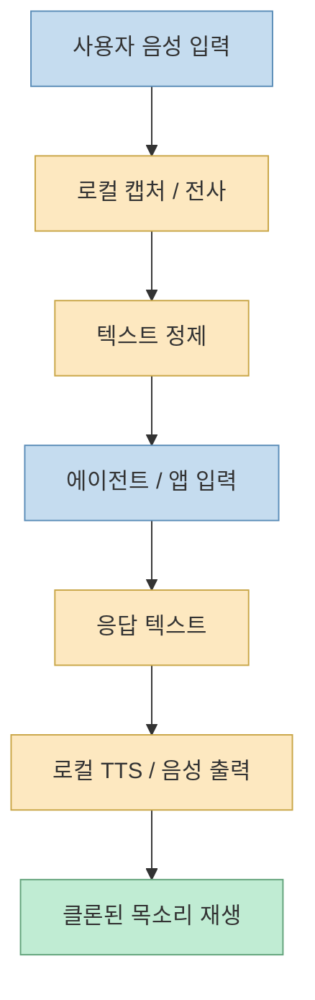
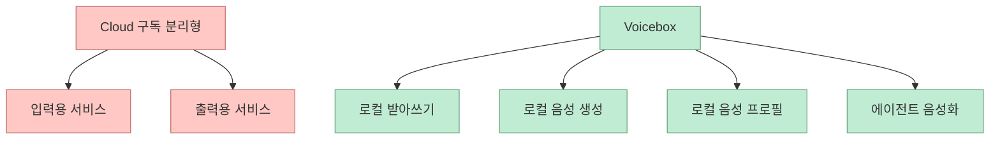
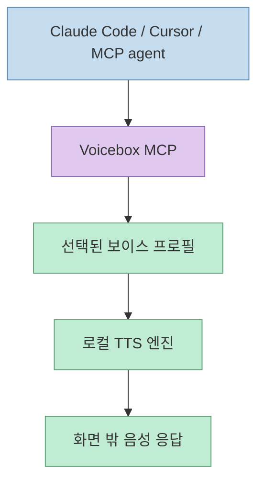
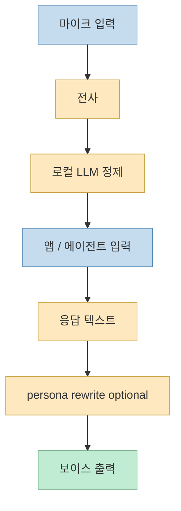

이 Shorts가 흥미로운 이유는 Voicebox를 단순한 “무료 TTS 툴”로 소개하지 않기 때문입니다. 
영상이 강조하는 포인트는 더 넓습니다.

- ElevenLabs 같은 음성 출력 구독
- WisprFlow 같은 받아쓰기 구독

이 둘을 따로 쓰는 대신, **로컬 음성 입출력 스택을 하나의 앱으로 묶는다** 는 이야기입니다.

<!--more-->

## Sources

- <https://youtube.com/shorts/GTSzkXS-fhs?si=sgsOuBwkysQHhYSJ>
- <https://github.com/jamiepine/voicebox>
- <https://github.com/jamiepine/voicebox/blob/main/docs/content/docs/index.mdx>
- <https://github.com/jamiepine/voicebox/releases>
- <https://github.com/jamiepine/voicebox/blob/main/CHANGELOG.md>

## Voicebox는 무엇인가

GitHub README는 Voicebox를 **local-first AI voice studio** 라고 설명합니다. 
핵심 정의는 아주 명확합니다.

- 음성 복제
- 음성 생성
- 받아쓰기
- MCP-aware agent 음성 출력

을 모두 로컬에서 처리하는 앱이라는 것입니다. <https://github.com/jamiepine/voicebox>

공식 문서도 같은 점을 반복합니다. 
Voicebox는 ElevenLabs의 output 쪽과 WisprFlow의 input 쪽을 따로 대체하는 것이 아니라, **voice I/O loop 전체** 를 한 앱으로 묶는다고 설명합니다. <https://github.com/jamiepine/voicebox/blob/main/docs/content/docs/index.mdx>

즉 이 프로젝트를 가장 정확하게 설명하는 방식은:

- “무료 음성 클론 앱”
- 가 아니라
- “로컬 음성 입력 + 로컬 음성 출력 + 에이전트 음성화 계층”

입니다.

## 영상이 특히 강조한 것은 "내 목소리"와 "내 기기"다

Shorts에서 가장 강하게 말하는 부분은 두 가지입니다.

1. **몇 초 만에 음성 클로닝**
2. **데이터가 외부 서버로 나가지 않음**

README도 같은 메시지를 줍니다. 
Voicebox는 reference sample로 zero-shot cloning을 지원하고, 모델/음성 데이터/캡처가 모두 로컬에 남는다고 설명합니다. <https://github.com/jamiepine/voicebox>

이 관점은 단순히 비용 절감만의 문제가 아닙니다. 
특히:

- 민감한 음성 데이터
- 사내 비공개 문서 낭독
- 에이전트 응답의 음성화
- 개인 목소리 브랜딩

같은 영역에서는 privacy 자체가 제품 기능이 됩니다.

## "ElevenLabs 대체"보다 더 중요한 것은 "WisprFlow 대체"까지 포함한다는 점

영상은 비교 대상을 두 개로 둡니다.

- ElevenLabs: 음성 출력
- WisprFlow: 음성 입력 / 받아쓰기

README와 릴리스 노트도 이 포인트를 공식적으로 뒷받침합니다. 
특히 Capture 릴리스는 Voicebox가 단순 voice cloning studio를 넘어, **hold-to-talk / transcript paste / focused field paste** 까지 포함한 full voice studio가 되었다고 설명합니다. <https://github.com/jamiepine/voicebox/releases> <https://github.com/jamiepine/voicebox/blob/main/CHANGELOG.md>

즉 Voicebox의 구조는 이렇게 보는 편이 더 정확합니다.

이게 중요한 이유는, 많은 사용자가 사실 TTS 하나만 필요한 게 아니라:

- 말로 입력하고
- 텍스트로 정제하고
- AI가 응답하고
- 다시 음성으로 듣는

전체 루프를 원하기 때문입니다.

## MCP 내장이 왜 중요한가

영상의 가장 흥미로운 주장 중 하나는 Voicebox에 MCP가 내장돼 있다는 점입니다. 
공식 문서와 릴리스 노트도 이 흐름을 뒷받침합니다.

- any MCP-aware agent can call Voicebox
- Claude Code, Cursor, Spacebot 같은 에이전트가 speak back 할 수 있음
- on-screen pill을 통해 재생됨

이라고 적혀 있습니다. <https://github.com/jamiepine/voicebox/blob/main/docs/content/docs/index.mdx> <https://github.com/jamiepine/voicebox/releases>

이 뜻은 아주 단순합니다.

- 지금까지는 사람이 화면을 읽어야 했고
- 앞으로는 에이전트가 응답을 **내가 고른 음성 프로필로 읽어 줄 수 있다**

는 것입니다.

즉 Voicebox는 음성 생성 앱이 아니라, **에이전트 출력 채널** 이 됩니다.

이 구조가 의미하는 바는 큽니다. 
코드를 보거나 문서를 정리하는 동안, 에이전트의 응답을 눈이 아니라 귀로 소비하는 흐름이 생깁니다.

## 엔진을 하나 고정하지 않고 여러 TTS 엔진을 고르는 구조

영상은 7개의 TTS 엔진과 여러 후처리 효과를 강조합니다. 
공식 README와 문서도 같은 내용을 적고 있습니다.

지원 엔진 예시는 다음과 같습니다.

- Qwen3-TTS
- Qwen CustomVoice
- LuxTTS
- Chatterbox Multilingual
- Chatterbox Turbo
- HumeAI TADA
- Kokoro

<https://github.com/jamiepine/voicebox> <https://github.com/jamiepine/voicebox/blob/main/docs/content/docs/index.mdx>

이 구조의 장점은 “최고의 단일 엔진”을 고집하지 않는다는 점입니다. 
용도에 따라:

- 속도
- 음성 유사도
- 언어 지원
- 감정 표현
- 경량성

기준이 달라지기 때문입니다.

즉 Voicebox는 한 엔진을 감싸는 앱이 아니라, **voice runtime switchboard** 에 가깝습니다.

## 받아쓰기와 정제 사이에 로컬 LLM이 들어간다는 점이 흥미롭다

릴리스 노트는 Voicebox 안에 local LLM이 들어가 transcript를 정제하고, voice profile에 personality를 붙일 수 있다고 설명합니다. <https://github.com/jamiepine/voicebox/releases> <https://github.com/jamiepine/voicebox/blob/main/CHANGELOG.md>

이건 단순 STT를 넘는 부분입니다.

즉 흐름이 이렇게 바뀝니다.

1. 사용자가 말한다
2. 음성을 텍스트로 바꾼다
3. 로컬 LLM이 문장을 정돈한다
4. 필요한 앱이나 에이전트에 넣는다
5. 다시 voice profile에 맞춰 읽는다

이렇게 되면 Voicebox는 단순 TTS/STT 툴이 아니라, **입출력 중간층에서 문장을 가공하는 voice middleware** 가 됩니다.

## 왜 Tauri 기반 네이티브 앱이라는 점이 중요한가

영상은 Voicebox가 Tauri 기반 네이티브 앱이라 가볍다고 강조합니다. 
README도 Electron 대신 Tauri/Rust 기반이라고 설명합니다. <https://github.com/jamiepine/voicebox>

이건 단순 취향 문제가 아닙니다. 
음성 I/O 툴은:

- 상시 백그라운드 대기
- 빠른 단축키 반응
- 로컬 장치 접근
- 긴 오디오 처리

가 중요하기 때문에, 무거운 웹 래퍼보다 네이티브 앱 형태가 실제 체감에 영향을 줄 수 있습니다.

## 이 프로젝트가 특히 매력적인 사용자

### 1. 음성 데이터의 프라이버시가 중요한 사람

모든 음성 클로닝과 캡처가 로컬에 남는다는 점이 큰 장점입니다.

### 2. Claude Code / Cursor 같은 에이전트를 더 자주 쓰는 사람

응답을 귀로 듣는 흐름이 추가되면, 텍스트 UI 사용 방식 자체가 달라질 수 있습니다.

### 3. 구독형 음성 툴 비용이 부담스러운 사람

영상이 강조한 것처럼 TTS와 dictation을 따로 구독하던 사용자는 통합 이득을 크게 느낄 수 있습니다.

### 4. 음성 기반 자동화나 앱 개발을 하는 사람

README는 local server / REST API / one-click local server도 언급합니다. 즉 단순 사용자 앱이 아니라 voice-powered app의 부품으로도 볼 수 있습니다. <https://github.com/jamiepine/voicebox>

## 한계와 주의점

이 프로젝트를 곧바로 “무조건 ElevenLabs 끝”으로 보면 안 되는 이유도 있습니다.

### 1. 설치형 로컬 런타임은 편의성보다 운영이 중요하다

클라우드 서비스는 켜면 바로 되지만, 로컬 스택은 모델 다운로드·성능·GPU/칩셋 조건 같은 현실적 제약이 있습니다.

### 2. 품질은 엔진마다 다르다

7개 엔진을 지원한다는 건 강점이지만, 반대로 어떤 엔진이 내 언어/목소리/하드웨어에 맞는지 선택 비용이 생깁니다.

### 3. 스타 수치와 성장 속도는 강한 신호지만 품질 보증은 아니다

영상은 GitHub 스타를 강조했는데, 그건 관심 신호이지 곧바로 production suitability를 보장하진 않습니다.

### 4. 완전한 클라우드 대체는 사용 목적에 따라 다르다

콘텐츠 제작, dictation, 에이전트 음성화에는 강할 수 있지만, 팀 협업이나 대규모 관리 기능은 다른 층의 문제가 남습니다.

## 핵심 요약

- Voicebox는 단순한 무료 TTS 앱이 아니라 **local-first AI voice studio** 다
- 핵심은 ElevenLabs 대체만이 아니라 **WisprFlow류 받아쓰기까지 포함한 voice I/O 통합** 이다
- MCP-aware agent가 Voicebox를 호출해 클론된 목소리로 응답을 읽을 수 있다는 점이 중요하다
- 7개의 TTS 엔진, 23개 언어, 음성 클로닝, 받아쓰기, post-processing을 한 앱에 묶는다
- 로컬 LLM이 전사 정제와 voice personality를 다루는 중간층 역할을 한다
- 즉 Voicebox는 음성 생성 툴보다 **에이전트용 로컬 음성 런타임** 에 가깝다

## 결론

이 Shorts의 핵심은 “무료로 목소리 복제하기”가 아닙니다. 
더 정확히는, **음성 입력과 음성 출력을 모두 로컬에서 돌리고, 그걸 에이전트와 연결해 하나의 작업 루프로 만든다** 는 데 있습니다.

그래서 Voicebox는 ElevenLabs 대체재라기보다, **로컬 에이전트 시대의 voice middleware** 로 보는 편이 더 정확합니다.
