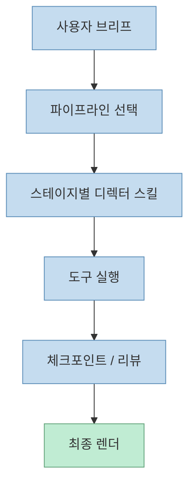
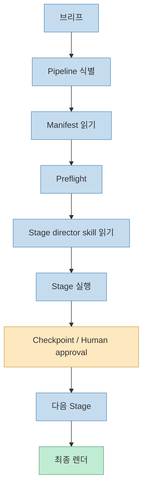
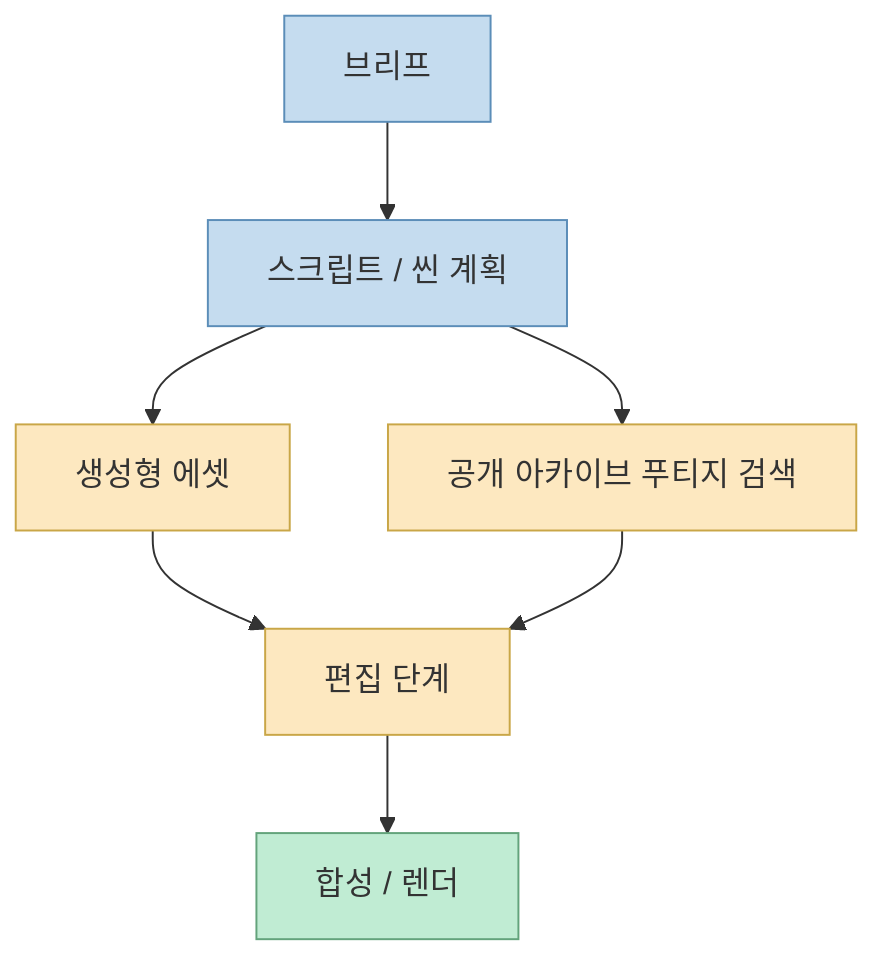

이 Shorts가 흥미로운 이유는 OpenMontage를 단순히 “영상 만드는 오픈소스”라고 부르지 않기 때문입니다. 
영상이 말하는 포인트는 더 큽니다.

- 새 SaaS 가입 없이
- 새 영상 편집 앱 학습 없이
- 이미 켜 놓은 Claude Code, Cursor, Codex 같은 코딩 어시스턴트를
- 리서치 → 대본 → 에셋 → 편집 → 렌더 전체를 지휘하는 오케스트레이터로 쓴다

즉 이 프로젝트의 핵심은 “영상 생성 앱”이 아니라, **AI 코딩 어시스턴트 위에 얹는 영상 제작 운영체제** 라는 데 있습니다.

<!--more-->

## Sources

- <https://youtube.com/shorts/PE57F-xrufk?si=q2IvkGT283WgDeG9>
- <https://github.com/calesthio/OpenMontage>
- <https://github.com/calesthio/OpenMontage/blob/main/AGENT_GUIDE.md>
- <https://github.com/calesthio/OpenMontage/blob/main/docs/PROVIDERS.md>
- <https://github.com/calesthio/OpenMontage/discussions/38>
- <https://github.com/calesthio/OpenMontage/discussions/54>

## OpenMontage는 무엇인가

GitHub README는 OpenMontage를 이렇게 정의합니다.

> World's first open-source, agentic video production system.

그리고 이어서:

- 12 pipelines
- 52 tools
- 500+ agent skills

를 가진다고 설명합니다. <https://github.com/calesthio/OpenMontage>

이 정의가 중요합니다. 
OpenMontage는 영상 생성 모델 하나를 감싼 앱이 아니라:

- 파이프라인
- 도구 레지스트리
- 스테이지별 디렉터 스킬
- 품질 게이트
- 렌더 런타임

을 묶은 **instruction-driven production system** 으로 설계되어 있습니다.

즉 OpenMontage는 “영상 생성 모델”보다 **영상 제작 프로세스 자체를 에이전트가 읽고 실행할 수 있게 만든 프레임워크** 에 가깝습니다.

## 핵심은 "코딩 어시스턴트가 곧 오케스트레이터"라는 점

영상도 이 문장을 거의 그대로 인용합니다.

> Your coding assistant is the orchestrator.

`AGENT_GUIDE.md`는 이 원칙을 더 강하게 못 박습니다.

- 모든 production은 반드시 pipeline을 거쳐야 한다
- agent는 먼저 pipeline manifest를 읽어야 한다
- 각 stage마다 해당 stage director skill을 읽어야 한다
- tool을 부르기 전에는 layer-3 skill을 먼저 읽어야 한다
- ad-hoc Python 스크립트를 바로 짜서 우회하면 안 된다

즉 OpenMontage는 모델이 즉석에서 모든 걸 발명하는 구조가 아니라, **assistant가 이미 써 둔 규칙·매니페스트·스킬을 따라가며 제작하는 구조** 입니다. <https://github.com/calesthio/OpenMontage/blob/main/AGENT_GUIDE.md>

이게 중요한 이유는 영상 제작이 원래:

- 콘셉트
- 스크립트
- 씬 분해
- 에셋 생성
- 렌더

같은 단계로 강하게 분리된 작업이기 때문입니다.

## "앱이 없다"는 말의 정확한 뜻

영상은 OpenMontage를 두고 “설치할 앱이 없다”고 말합니다. 
이 표현은 살짝 과장처럼 들릴 수 있지만, 의도는 분명합니다.

핵심은:

- 새로운 독립 GUI 비디오 에디터를 배우는 게 아니라
- 이미 쓰는 agent host
  - Claude Code
  - Cursor
  - Codex
- 위에 production pipeline을 얹는다는 것입니다.

즉 OpenMontage는 사용자 경험을 “새 앱 사용법 학습”에서 “현재 에이전트 안에서 더 긴 파이프라인 실행”으로 바꿉니다.

이건 도구 추가가 아니라 **오케스트레이션 계층 추가** 라고 보는 편이 더 정확합니다.

## Rule Zero: 모든 제작은 반드시 파이프라인을 탄다

`AGENT_GUIDE.md`에서 가장 중요한 문장은 Rule Zero입니다.

> All Production Goes Through a Pipeline

이 규칙은 아주 강합니다.

- make a video 같은 요청이 오면
- 반드시 pipeline을 식별하고
- 그 manifest를 읽고
- preflight를 돌리고
- 단계별로 director skill을 읽고
- checkpoint를 통과해야 합니다

즉 OpenMontage는 “모델이 알아서 영상 만들어 줌”을 금지합니다. 
대신:

- 파이프라인 선택
- 툴 발견
- 스테이지별 실행
- 리뷰
- 사람 승인

을 강제합니다. <https://github.com/calesthio/OpenMontage/blob/main/AGENT_GUIDE.md>

이 구조 때문에 OpenMontage는 단순 생성 서비스보다 훨씬 더 **감독 가능한 제작 시스템** 으로 읽힙니다.

## 12개의 파이프라인이 있다는 말의 의미

README가 말하는 “12 pipelines”는 단순 숫자 자랑이 아닙니다. 
영상 제작에서는 결과물이 다르면 절차도 달라져야 하기 때문입니다.

예를 들어:

- cinematic trailer
- product ad
- documentary-ish explainer
- slideshow/animatic 계열

은 쓰는 툴, 씬 분해 방식, 필요한 에셋, 품질 게이트가 다릅니다.

OpenMontage는 이 차이를 즉흥적으로 모델이 판단하게 두지 않고, **manifest-driven pipeline** 으로 나눕니다.

즉 “12개 파이프라인”은 곧:

- 작업 유형별 표준 절차가 있다
- agent가 그 절차를 고른다
- 절차에 따라 stage가 바뀐다

는 뜻입니다.

## 52개 도구와 500+ 스킬이라는 숫자가 중요한 이유

README의 `52 tools`, `500+ agent skills`는 단순 규모 자랑이 아니라 아키텍처를 설명합니다. <https://github.com/calesthio/OpenMontage>

### 도구

도구는 실행 계층입니다.

- 영상 모델 provider
- 이미지 생성기
- 오디오 / TTS
- 리서치 / 검색
- 렌더러

같은 실제 호출 표면입니다.

### 스킬

스킬은 그 도구를 **어떻게 잘 써야 하는지** 를 담습니다.

`AGENT_GUIDE.md` 는 툴에 `agent_skills`가 있으면 tool을 쓰기 전에 그 skill을 먼저 읽으라고 강하게 지시합니다.

즉 OpenMontage는:

- “도구 많음”
- 에서 끝나는 게 아니라
- “도구 사용법까지 단계별로 지식화”

한 구조입니다.

이게 중요한 이유는, 영상 생성은 같은 모델이라도:

- 프롬프트 구조
- shot language
- motion constraint
- lip-sync
- reference usage

에 따라 결과 차이가 매우 크기 때문입니다.

## OpenMontage는 "정지 이미지 슬라이드쇼"를 금지하려는 쪽이다

영상은 무료 AI 영상이 결국 정지 이미지의 zoom/pan 효과에 머무르는 경우가 많다고 지적합니다. 
`AGENT_GUIDE.md`도 이 문제를 강하게 다룹니다.

- still-image fallback 금지
- FFmpeg-only fallback으로 still-led video로 바꾸는 것도 금지

즉 사용자가 motion-led video를 원했는데, agent가 몰래 “그럴싸한 슬라이드쇼”로 낮춰치기 하면 안 된다는 뜻입니다. <https://github.com/calesthio/OpenMontage/blob/main/AGENT_GUIDE.md>

이건 매우 중요한 태도입니다. 
많은 생성형 영상 시스템은 실패했을 때 quietly quality bar를 낮추는데, OpenMontage는 오히려:

- motion requirement를 명시하고
- 그 requirement를 못 지키면 다른 경로를 찾거나
- 사람 승인 없이는 deliverable을 바꾸지 않게 합니다

즉 이 프로젝트는 “자동 생성”보다 **품질 계약 준수** 를 더 중요하게 봅니다.

## 무료 아카이브 기반 실제 푸티지 검색이 의미하는 것

영상이 OpenMontage를 특별하게 보는 이유 중 하나는, 정지 이미지가 아니라 **실제 움직이는 footage** 를 무료 아카이브에서 의미 검색해 쓴다고 말하는 부분입니다.

즉:

- archive.org
- NASA
- Wikimedia

같은 공개 자산을 의미 검색해서 골라 편집하는 흐름을 강조합니다.

이건 중요한 차이입니다. 
많은 AI 영상 툴은:

- 새 이미지를 만들고
- 그 이미지에 모션을 입히는

방식인데, OpenMontage는 경우에 따라 **이미 존재하는 공개 푸티지를 탐색·편집하는 다큐멘터리적 흐름** 도 가져갑니다.

즉 영상 생성과 영상 리서치를 같은 파이프라인 안에 넣습니다.

## 비용이 낮아 보이는 이유는 "조합형 시스템"이기 때문이다

영상은 README와 제작샷 기준으로 비용 예시를 말합니다.

- 지브리풍 12장 애니메이션 약 \$0.25
- 제품 광고용 OpenAI 계열 사용 약 \$0.69
- 60초 픽사풍 단편 약 \$1.33

라고 소개합니다. 이 수치는 영상 제작자가 README와 제작샷 기준이라고 설명한 값이므로, **self-reported benchmark / example budget** 으로 읽는 편이 안전합니다.

중요한 건 절대 숫자보다 구조입니다.

OpenMontage는:

- 무료 TTS (`piper`)
- 무료 공개 아카이브
- Remotion
- provider switching

같이, 가능한 한 **싼 경로를 조합해서 비용을 낮추는 방향** 으로 설계되어 있습니다.

즉 “한 개의 비싼 모델이 다 한다”가 아니라, **작업 단계를 쪼개고 단계마다 가장 적합한 도구를 고른다** 는 철학이 비용을 낮추는 핵심입니다.

## Provider와 Layer 3 skill의 결합이 진짜 무기다

OpenMontage discussions를 보면, 특정 모델 추가가 그냥 provider 하나 더 붙이는 수준이 아닙니다. 
예를 들어 Seedance 2.0 지원 공지에서는:

- fal.ai
- Replicate
- Runway
- Higgsfield

어느 쪽이든 설정되어 있으면 cinematic pipeline이 자동으로 그 경로를 선택하고, 별도의 Layer 3 skill이 prompt 방법을 가르친다고 설명합니다. <https://github.com/calesthio/OpenMontage/discussions/38>

또 다른 discussion에서는 OpenMontage가 5-aspect video prompt taxonomy를 도입했다고 설명합니다.

- subject
- environment
- action
- camera
- style

같은 식으로 촬영 언어에 더 가깝게 프롬프트를 구조화하려는 흐름입니다. <https://github.com/calesthio/OpenMontage/discussions/54>

이게 중요한 이유는 OpenMontage의 경쟁력이 “모델 호출”이 아니라:

- 어떤 모델을 고를지
- 어떻게 프롬프트를 써야 하는지
- 어느 파이프라인에서 써야 하는지

를 함께 가르친다는 데 있기 때문입니다.

## 왜 이 프로젝트가 빠르게 커졌는가

영상은 88일 만에 약 1.9만 스타, trending 1위, 최근까지 활발한 업데이트라고 말합니다. 
GitHub/Trendshift 검색에서도 2만대 초반 스타와 높은 트렌딩 노출이 확인됩니다. <https://github.com/calesthio/OpenMontage> <https://trendshift.io/repositories/24682>

이 프로젝트가 빠르게 커진 이유는 아마 다음 셋입니다.

### 1. 코딩 어시스턴트가 이미 널리 깔려 있다

새 앱을 배우는 게 아니라 기존 agent host를 오케스트레이터로 재사용합니다.

### 2. “영상 생성”보다 “영상 제작”을 건드린다

리서치, 스크립트, 씬, 에셋, 렌더를 한 시스템으로 묶는 프로젝트는 드뭅니다.

### 3. 품질 게이트가 있다

그럴싸한 슬라이드쇼로 몰래 낮춰치기 하지 않겠다는 품질 철학이 분명합니다.

## 이 프로젝트가 특히 잘 맞는 사람

### 1. Claude Code / Cursor / Codex를 이미 메인 작업면으로 쓰는 사람

새 GUI 앱 학습보다 기존 assistant 안에서 긴 제작 루프를 돌리고 싶은 사람에게 잘 맞습니다.

### 2. 영상 제작을 반복 가능한 파이프라인으로 만들고 싶은 팀

광고, 트레일러, 설명 영상 등에서 텍스트-중심 브리프를 제작 파이프라인으로 연결하고 싶은 경우입니다.

### 3. 생성 모델보다 제작 시스템이 더 중요하다고 느끼는 사람

OpenMontage는 모델 선택보다 workflow composition에 강점이 있습니다.

## 한계도 분명하다

### 1. 설치할 새 앱은 없을 수 있지만, 새 시스템은 배워야 한다

즉 GUI는 안 바뀌어도 파이프라인/스킬/체크포인트 철학은 학습해야 합니다.

### 2. 모델/프로바이더 품질 차이는 여전히 존재한다

OpenMontage가 그 차이를 흡수하려 하지만, 결국 결과 품질은 provider availability와 모델 성숙도에 영향을 받습니다.

### 3. “무료”는 무조건 0비용을 뜻하지 않는다

무료 경로도 많지만, cinematic quality를 높이려면 상용 provider와 API 비용이 여전히 들어갈 수 있습니다.

### 4. 영상 제작은 결국 승인과 취향의 영역이 남는다

AGENT_GUIDE도 human approval과 checkpoint를 강하게 요구합니다. 즉 완전 무인보다는 **에이전트 지휘형 제작 보조 시스템** 으로 보는 편이 맞습니다.

## 핵심 요약

- OpenMontage는 단순 영상 생성 툴이 아니라 **agentic video production system** 이다
- 핵심은 12 pipelines, 52 tools, 500+ skills를 가진 파이프라인 중심 아키텍처다
- Claude Code, Cursor, Codex 같은 기존 코딩 어시스턴트가 오케스트레이터 역할을 한다
- 모든 제작은 pipeline manifest, stage director skill, checkpoint를 거쳐야 한다
- still-image fallback을 금지하고 motion-led deliverable을 지키려는 품질 철학이 강하다
- 비용 절감의 핵심은 단일 모델이 아니라 단계별 cheapest viable path 조합이다
- 이 프로젝트의 경쟁력은 모델 호출보다 **workflow + skill + provider routing** 에 있다

## 결론

이 Shorts의 핵심은 “Claude Code가 영상 편집기가 됐다”는 문장 그 자체가 아닙니다. 
더 정확히는, **코딩 어시스턴트 위에 영상 제작을 위한 파이프라인·스킬·도구 레지스트리 계층을 얹어, 하나의 제작 시스템으로 바꿨다** 는 데 있습니다.

그래서 OpenMontage는 영상 생성 앱이라기보다, **에이전트가 지휘하는 영상 제작 운영체제 실험** 으로 보는 편이 더 정확합니다.
