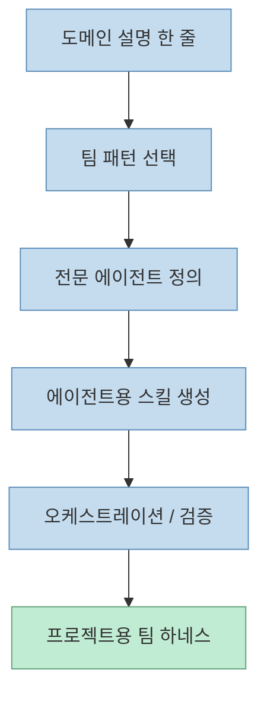
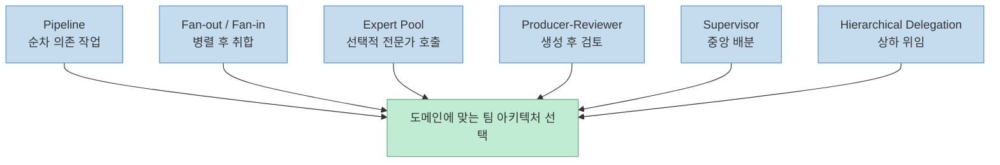
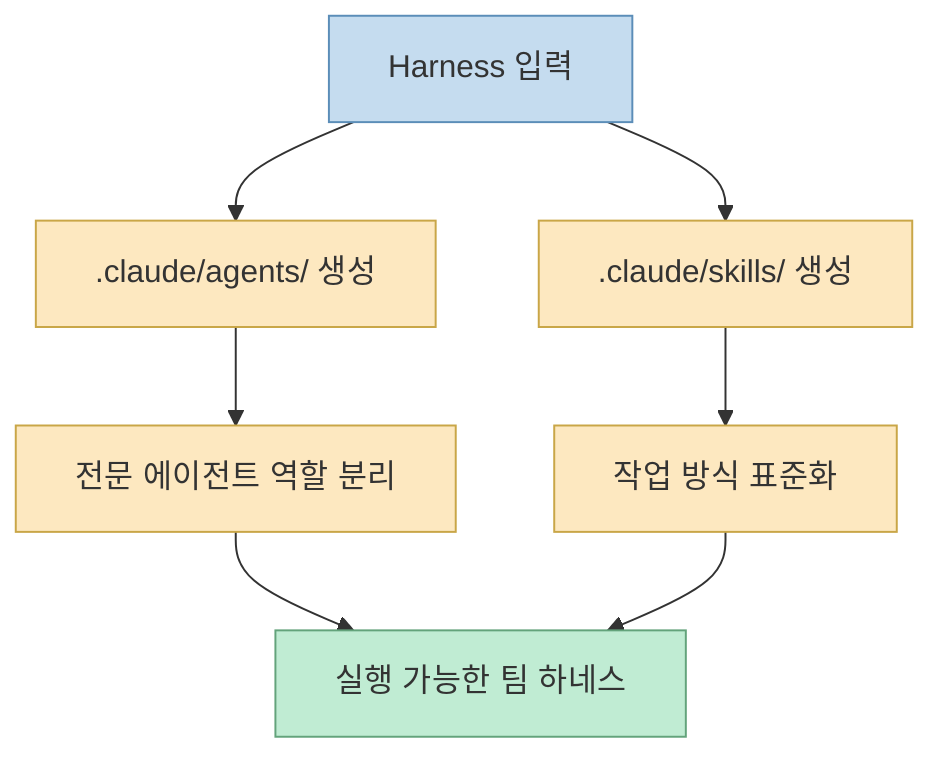

이 Shorts가 흥미로운 이유는 `harness`를 단순 “에이전트 생성 스킬”로 소개하지 않기 때문입니다. 
핵심은 그보다 한 단계 위에 있습니다.

`harness`는 한 명의 에이전트를 더 똑똑하게 만드는 도구가 아니라,

- 어떤 팀 구조가 맞는지 고르고
- 어떤 전문 에이전트들이 필요한지 정의하고
- 그 에이전트들이 쓸 스킬까지 생성하는

**팀-아키텍처 팩토리** 에 가깝습니다.

<!--more-->

## Sources

- <https://youtube.com/shorts/tKhKQbZOH5Q?si=pNtp7krtDHa-Udo6>
- <https://github.com/revfactory/harness>
- <https://revfactory.github.io/harness/>
- <https://github.com/revfactory/harness-100>
- <https://github.com/SaehwanPark/meta-harness>

## harness는 무엇인가

GitHub README는 `harness`를 아주 명확하게 설명합니다.

> Harness is a team-architecture factory for Claude Code.

즉 이 프로젝트는:

- domain sentence 하나를 입력받아
- 여섯 가지 미리 정의된 팀 패턴 중 하나를 고르고
- agent team과 skill set을 생성해 주는

메타스킬입니다. <https://github.com/revfactory/harness>

공식 사이트도 같은 메시지를 반복합니다. 
`Harness is a meta-skill that designs domain-specific agent teams, defines specialized agents, and generates the skills they use — all from a single prompt.` 라고 설명합니다. <https://revfactory.github.io/harness/>

즉 `harness`는 “무엇을 만들어 줘”보다 **“누가, 어떤 구조로, 어떤 스킬을 들고 일해야 하는지 설계해 줘”** 에 더 가깝습니다.

## 왜 "메타스킬"이라고 부를 만한가

영상이 `harness`를 “자기가 일하는 게 아니라 일할 팀을 설계해 주는 메타스킬”이라고 설명한 건 매우 정확합니다.

보통 스킬은:

- 리뷰를 잘하게 하거나
- 문서를 잘 쓰게 하거나
- 특정 도메인 작업을 잘하게 합니다.

그런데 `harness`는 다릅니다. 
이 스킬의 목적은 **새로운 작업 스킬들을 만들어 내는 팀 구조를 먼저 설계하는 것** 입니다.

즉 직접 산출물을 내는 스킬이 아니라:

- 어떤 specialist가 필요한지
- reviewer를 둘지
- fan-out을 쓸지
- supervisor가 필요한지

같은 **작업 조직도** 를 설계합니다.

이 점에서 `harness`는 일반적인 domain skill보다 상위층에 있습니다.

## 여섯 가지 팀 패턴이 핵심 자산이다

GitHub README와 공식 사이트 모두 `harness`의 핵심 자산을 **6개의 architectural pattern** 으로 설명합니다.

- Pipeline
- Fan-out / Fan-in
- Expert Pool
- Producer-Reviewer
- Supervisor
- Hierarchical Delegation

<https://github.com/revfactory/harness> <https://revfactory.github.io/harness/>

중요한 건 이 프로젝트가 “새로운 패턴을 무한 생성”하지 않는다는 점입니다. 
오히려 미리 검증된 여섯 가지 패턴에 문제를 매핑하는 쪽입니다.

이 설계는 실용적입니다.

- 자유도는 줄지만
- 재현 가능성은 올라가고
- 오케스트레이션이 더 예측 가능해집니다

즉 `harness`의 강점은 창의적 무질서보다 **구조화된 재사용성** 에 있습니다.

즉 `harness`의 지능은 모델 자체보다, **문제를 여섯 가지 팀 구조 중 무엇으로 번역할지 고르는 판단** 에 있습니다.

## 생성 결과는 단순 프롬프트가 아니라 `.claude/` 구조다

README가 특히 중요한 이유는 출력 형식을 분명히 보여 주기 때문입니다. 
`harness`가 생성하는 결과물은 대충 “에이전트 팀 설명문”이 아닙니다.

생성 산출물 예시는 다음처럼 `.claude/` 구조로 제시됩니다.

- `.claude/agents/`
  - `analyst.md`
  - `builder.md`
  - `qa.md`
- `.claude/skills/`
  - 각 역할/워크플로우용 `SKILL.md`

<https://github.com/revfactory/harness>

즉 `harness`는 팀 구조를 말로 설명하고 끝나지 않고, **Claude Code가 실제로 로드할 파일 구조** 로 내보냅니다.

이 점이 중요합니다. 
그래야 팀 설계가 아이디어에 그치지 않고, 곧바로 **실행 가능한 프로젝트 하네스** 로 이어집니다.

## 스킬까지 같이 만든다는 점이 진짜 차별점이다

영상도 “전문 에이전트 팀과 그들이 쓸 스킬까지 통째로 자동 생성해 준다”고 요약합니다. 
이 문장이 중요합니다.

많은 멀티에이전트 시스템은:

- 역할 이름은 나누지만
- 실제로 각 역할이 어떤 작업 표준을 가져야 하는지는 비워 둡니다

그러면 결국 specialist 이름만 다른 generic agent가 됩니다.

`harness`는 이걸 피하려고 합니다. 
공식 사이트는 **Skill Generation with Progressive Disclosure** 를 강조합니다. 즉 context를 무겁게 만들지 않으면서, 필요한 역할별 작업 방식을 분리해 생성합니다. <https://revfactory.github.io/harness/>

즉 이 프로젝트는:

- 역할 분리
- 스킬 분리
- 컨텍스트 절감

을 한 세트로 보려는 쪽입니다.

## 오케스트레이션과 검증이 함께 들어 있다는 점이 현실적이다

README와 공식 사이트는 단순 생성만이 아니라:

- inter-agent data passing
- error handling
- team coordination protocols
- trigger verification
- dry-run testing
- with-skill vs without-skill comparison

같은 검증 요소를 함께 설명합니다. <https://github.com/revfactory/harness> <https://revfactory.github.io/harness/>

이게 중요한 이유는, 멀티에이전트 시스템의 가장 큰 실패 원인이 “역할 이름만 있고 흐름은 없는 상태”이기 때문입니다.

즉 `harness`는 최소한 철학적으로는:

- 팀을 만들고
- 역할을 만들고
- 스킬을 만들고
- 그 팀이 제대로 돌아가는지 확인하는 단계

까지 포함하려는 설계입니다.

## 왜 별이 빠르게 붙었는가

영상은 “공개 석 달 만에 별 7,700개”라고 요약합니다. 
검색 결과 기준으로도 2026년 6월 시점에 7천 후반대 스타와 GitHub Trending 노출 이력이 확인됩니다. <https://trendshift.io/repositories/24551> <https://skillsllm.com/skill/harness>

이 프로젝트가 빠르게 퍼진 이유는 아마 세 가지입니다.

### 1. 이제는 에이전트 하나보다 팀 구성이 더 병목이기 때문

단일 에이전트로는 한계가 보이기 시작했고, 역할 분업 구조가 필요해졌습니다.

### 2. 하지만 팀을 직접 설계하는 건 번거롭기 때문

누가 필요하고, 어떤 패턴이 맞고, 어떤 스킬을 넣어야 할지 매번 손으로 설계해야 한다면 진입 장벽이 큽니다.

### 3. harness는 그 설계를 다시 자동화하기 때문

즉 에이전트를 쓰는 시대에서 **에이전트 팀 설계 자체를 자동화하는 한 단계 위 레이어** 로 올라간 것입니다.

## Harness 100이 보여 주는 확장 방향

`revfactory/harness-100`은 이 흐름을 더 잘 보여 줍니다. 
README 기준으로 100개의 ready-to-use harness를 10개 도메인에 걸쳐 제공하고, 489개 agent definition과 315개 skill 세트를 포함한다고 설명합니다. <https://github.com/revfactory/harness-100>

이 저장소는 `harness`의 결과물이 실제로 어떤 식으로 대량 재사용될 수 있는지를 보여 줍니다.

즉:

- `harness`는 공장
- `harness-100`은 그 공장에서 나온 카탈로그

처럼 볼 수 있습니다.

이건 중요한 신호입니다. 
팀 아키텍처 설계가 일회성 마법이 아니라, **복제 가능한 자산 형식** 으로 굳어지고 있다는 뜻이기 때문입니다.

## meta-harness가 보여 주는 또 다른 흐름

검색 결과에서 함께 보이는 `meta-harness`는 원본 `harness`를 portable, standards-first 쪽으로 가져온 포트입니다. README는 AGENTS.md, `.agents/skills/`, deterministic handoff를 강조합니다. <https://github.com/SaehwanPark/meta-harness>

이 비교도 중요합니다.

- 원본 `harness`는 Claude Code 팀 아키텍처 팩토리
- `meta-harness`는 그 개념을 더 runtime-neutral하게 옮긴 포트

즉 이 흐름은 특정 저장소 하나의 유행이 아니라, **“팀을 만드는 메타스킬”이라는 패턴 자체가 하나의 층으로 분화되고 있다** 는 신호로 읽을 수 있습니다.

## 이 프로젝트가 특히 잘 맞는 경우

### 1. 단일 에이전트로는 문맥이 너무 커지는 프로젝트

역할 분리가 없으면 조사, 설계, 구현, 검증이 한 세션에 몰려 맥락 오염이 심해집니다.

### 2. 도메인별 specialist가 필요한 프로젝트

예를 들어 보안, 데이터, QA, 리서치, 콘텐츠 등이 함께 얽히는 경우입니다.

### 3. 팀 구조를 매번 수작업으로 설계하기 귀찮은 경우

패턴 기반 팀 구성을 기본으로 깔아 주는 것이 큰 장점이 됩니다.

## 한계도 분명하다

### 1. 좋은 팀 구조를 자동으로 골라도, 그게 항상 최적인 건 아니다

여섯 가지 패턴은 강력하지만, 현실 도메인은 더 뒤틀린 경우가 많습니다.

### 2. 생성된 팀이 곧 잘 작동하는 팀은 아니다

역할 파일과 스킬 파일을 뽑아주는 것과, 실제 운영에서 충돌 없이 돌아가는 것은 다른 문제입니다.

### 3. 멀티에이전트는 비용과 복잡도를 함께 올린다

역할이 늘수록 속도, 토큰, 검증 비용도 같이 올라갈 수 있습니다.

### 4. “메타스킬”은 특히 유지보수 철학이 중요하다

이 프로젝트가 생성하는 산출물은 시간이 지나며 현업 팀이 손봐야 합니다. 즉 완전 자동 완결보다는 **초기 팀 설계 자동화** 로 보는 편이 맞습니다.

## 핵심 요약

- `revfactory/harness`는 단일 작업 스킬이 아니라 **팀 아키텍처 팩토리** 다
- 입력은 도메인 설명 한 줄이고, 출력은 에이전트 팀 구조 + specialist 정의 + 스킬 세트다
- 핵심 자산은 Pipeline, Fan-out/Fan-in, Expert Pool, Producer-Reviewer, Supervisor, Hierarchical Delegation의 6개 패턴이다
- 결과물은 말뿐인 설명이 아니라 `.claude/agents/`와 `.claude/skills/` 구조로 생성된다
- 이 프로젝트의 진짜 차별점은 역할 분리뿐 아니라 **스킬 생성과 검증 구조를 같이 가져간다** 는 점이다
- `harness-100`, `meta-harness` 같은 파생 흐름은 “팀을 만드는 메타스킬” 계층이 실제로 형성되고 있음을 보여 준다

## 결론

이 Shorts의 핵심은 “한 줄로 에이전트 팀을 만든다”는 자극적인 표현이 아닙니다. 
더 중요한 건, 이제는 에이전트 하나를 잘 쓰는 시대에서 넘어가 **팀 구조 자체를 생성하고 표준화하는 메타 계층** 이 등장했다는 점입니다.

그래서 `revfactory/harness`는 그냥 또 하나의 스킬이 아니라, **에이전트를 만드는 시대 다음 단계인 ‘팀을 설계하는 스킬’의 대표 사례** 로 보는 편이 더 정확합니다.
