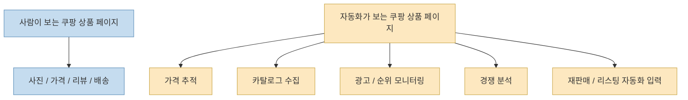
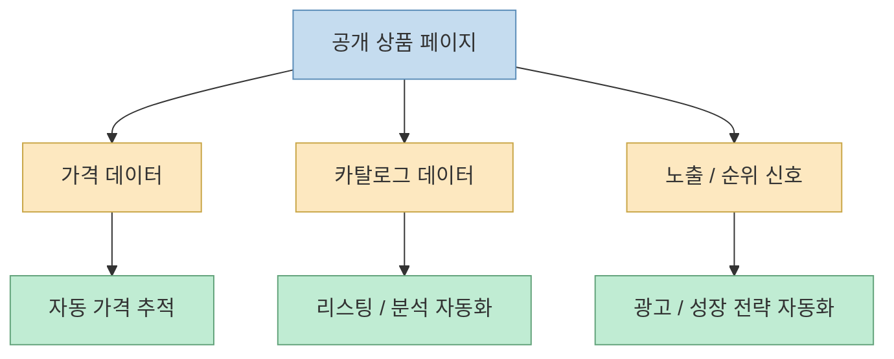
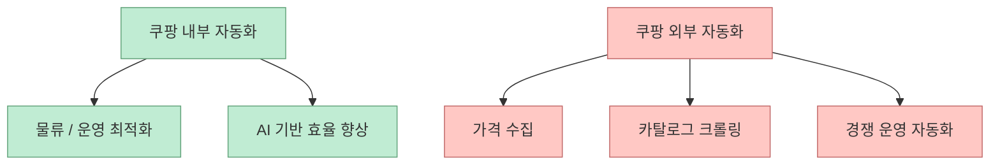

Threads 원문이 던지는 질문은 단순하지만 날카롭습니다. 

> “쿠팡은 봇 자동화를 죽기살기로 막는다. 이상하지 않아? 그냥 상품 페이지인데 왜 이렇게까지.”

이 질문은 중요합니다. 
왜냐하면 겉으로 보기에는 상품 상세 페이지가 그냥 HTML 한 장처럼 보이지만, 실제로는 그 페이지가 **가격 관찰, 상품 카탈로그 수집, 광고·순위 추적, 경쟁사 모니터링, 재판매 자동화** 가 몰리는 표면이기 때문입니다.

즉 문제는 “웹페이지를 읽는다”가 아니라, **그 웹페이지가 여러 비즈니스 자동화의 입력 채널** 이라는 데 있습니다.

<!--more-->

## Sources

- <https://www.threads.com/@why.anthropic/post/DZ_Qu6qlg58?xmt=AQG0RT_LRUByGqvI44_zzYpBZyarGaD1iVhtbRPcvS_gPT8OqhdRva_qNXZgKNlJc9rm7k61&slof=1>
- <https://github.com/fivetaku/insane-search>
- <https://github.com/fivetaku/insane-search/blob/main/README.ko.md>
- <https://news.hada.io/topic?id=28598>
- <https://news.coupang.com/archives/56782/>
- <https://news.coupang.com/archives/26868/?print=print>

## Threads 원문이 실제로 말한 것

공개 메타데이터 기준으로 이 Threads 포스트에서 직접 확인 가능한 문장은 짧습니다.

- 쿠팡은 봇 자동화를 강하게 막는다
- “그냥 상품 페이지인데 왜 이렇게까지”라는 의문이 든다
- 직접 우회해 보다가 업계의 비밀 하나를 알게 됐다고 말한다

여기서 “업계 비밀”의 구체 내용을 공개 메타데이터만으로는 복원할 수 없습니다. 
그래서 이 글에서는 그 부분을 단정하지 않고, 왜 그런 질문이 자연스럽게 나오는지 **공개적으로 확인 가능한 자료만으로** 구조적으로 설명하겠습니다.

## 상품 페이지는 더 이상 "읽기용 페이지"가 아니다

일반 사용자는 쿠팡 상품 페이지를 이렇게 봅니다.

- 상품 사진
- 가격
- 리뷰
- 배송 정보
- 옵션 선택

그런데 자동화 관점에서 보면 같은 페이지는 전혀 다르게 보입니다.

- 가격 변동 신호
- 광고/노출 순위 확인 지점
- 카탈로그 데이터 수집 표면
- 경쟁 상품 모니터링 입력
- 재고/배송 문구 변화 감시 포인트

즉 사람 눈에는 “상품 상세 페이지”지만, 봇 눈에는 **운영 데이터 피드의 공개 표면** 입니다.

그래서 “왜 그냥 페이지를 이렇게까지 막지?”라는 질문은, 실제로는 다음으로 바뀝니다.

> 왜 공개 상품 페이지가 데이터 API처럼 소비되는 것을 강하게 막지?

## insane-search가 쿠팡을 예시로 드는 이유

`insane-search` README는 지원 예시로 쿠팡을 직접 언급합니다. 
그리고 “Everything else flows through Phase 1~3 automatically — including Coupang (curl_cffi safari)”라고 설명합니다. 즉 쿠팡이 별도 public API-first 플랫폼이 아니라, **WAF / 차단 회피가 필요한 공개 페이지 계열** 로 분류된다는 뜻입니다. <https://github.com/fivetaku/insane-search> <https://github.com/fivetaku/insane-search/blob/main/README.ko.md>

GeekNews 소개글은 이 프로젝트를 만든 이유를 더 직접적으로 설명합니다.

- Claude Code가 403을 보면 너무 빨리 포기한다
- 사이트·기법 고정 바이어스를 만들지 않는다
- 공개 경로를 끝까지 시도한다

즉 쿠팡이 예시로 자주 나오는 이유는 단순 인기 사이트라서가 아니라, **“공개 페이지인데 기본 읽기 경로가 자주 막히는 대표 케이스”** 이기 때문입니다. <https://news.hada.io/topic?id=28598>

## 왜 커머스는 공개 HTML도 API처럼 방어할까

이제 핵심 질문으로 돌아오면, 이유는 대체로 세 층으로 설명할 수 있습니다.

### 1. 가격 정보는 곧 경쟁 정보다

커머스에서 가격은 단순 표시값이 아닙니다. 
다른 셀러나 자동화 시스템이 가격을 대량으로 읽을 수 있으면:

- 가격 추적
- 자동 가격 매칭
- 최저가 반응
- 프로모션 감지

가 가능해집니다.

즉 HTML 가격 표시는 사용자 편의이면서 동시에 **경쟁 정보 배포 채널** 이 됩니다.

### 2. 상품 카탈로그는 곧 데이터 자산이다

제목, 옵션, 속성, 카테고리, 배송 문구, 리뷰 수 같은 것들이 대량 추출되면:

- 타 마켓 리스팅 자동 생성
- 유사 상품 탐색
- 대량 리서치
- 광고 세팅 자동화

로 이어질 수 있습니다.

즉 상품 상세는 쇼핑 UI이면서 동시에 **상품 그래프의 공개 노드** 입니다.

### 3. 순위와 노출은 곧 광고·판매 전략의 입력이다

상품이 어떤 질의에서 어떻게 노출되는지, 어떤 문구가 붙는지, 어떤 배지가 뜨는지는 셀러 운영 자동화에 매우 중요한 입력입니다.

즉 상품 페이지는 구매용 표면이면서 동시에 **성장 운영 대시보드의 외부 관측 포인트** 가 됩니다.

그래서 쿠팡이 막는 것은 “그냥 페이지 읽기”가 아니라, 그 페이지를 통해 발생하는 **대규모 운영 자동화의 연쇄 반응** 이라고 보는 편이 더 정확합니다.

## 쿠팡은 실제로 자동화·AI 자체에는 매우 적극적이다

여기서 역설이 하나 있습니다. 
쿠팡은 봇을 막는 회사이면서 동시에 자동화와 AI를 매우 적극적으로 밀고 있는 회사이기도 합니다.

쿠팡 공식 자료는:

- AI 기반 자동화
- 로봇 기술
- 오토메이션 직군 확대
- 엔드투엔드 물류 혁신

을 반복해서 강조합니다. <https://news.coupang.com/archives/56782/> <https://news.coupang.com/archives/26868/?print=print>

즉 내부에서는 자동화를 극도로 밀어붙이고, 외부 공개 표면에서는 자동화 접근을 강하게 통제하는 구조입니다.

이게 이상해 보일 수 있지만, 사실은 일관됩니다.

왜냐하면 기업 입장에서 중요한 건 자동화 그 자체가 아니라:

- **누가**
- **어떤 데이터에**
- **어떤 규모로**
- **어떤 목적을 가지고**

자동화하느냐이기 때문입니다.

즉 내부 최적화용 자동화와 외부 무차별 수집용 자동화는 전혀 다른 문제입니다.

즉 “자동화에 적극적인 회사가 왜 봇을 막지?”가 아니라,

> 내부 자산으로서의 자동화는 밀고, 외부에서 내 표면을 API처럼 쓰는 자동화는 제한한다

가 더 정확한 설명입니다.

## 결국 상품 페이지는 "마지막 공개 API"처럼 취급된다

로그인월도 없고 공개 HTML도 보이니, 사람 입장에서는 그냥 웹페이지처럼 느껴집니다. 
하지만 에이전트와 자동화 시스템 입장에서는:

- 공개적으로 읽을 수 있고
- 구조화 데이터가 있고
- 가격/배송/리뷰 같은 중요 신호가 있고
- 대량 수집 가치가 큰

거의 **반쯤 공개 API 같은 표면** 입니다.

그래서 방어도 달라집니다.

- 일반 뉴스 페이지보다 더 공격적으로
- 기본 fetch나 단순 curl이 쉽게 막히고
- 브라우저 정체성, TLS 지문, 쿠키 워밍 같은 층까지 보게 됩니다

이 점은 insane-search 같은 도구가 쿠팡을 별도로 언급하는 이유와도 연결됩니다.

## 업계 비밀이라는 말은 아마 "페이지가 곧 운영 인터페이스"라는 뜻에 가깝다

Threads 본문은 “업계 비밀 하나를 알게 됐다”고 말하지만, 공개 메타데이터만으로 그 문장의 정확한 후속 설명은 확인할 수 없습니다. 
그래서 아래 내용은 **공개 자료를 바탕으로 한 해석** 입니다.

가장 가능성 높은 해석은 이것입니다.

> 커머스 업계에서 공개 상품 페이지는 단순 고객용 페이지가 아니라,  
> 가격·광고·카탈로그·경쟁 관찰이 몰리는 운영 인터페이스이기도 하다.

즉 페이지가 곧 돈이 흐르는 입력 채널이기 때문에, 사이트는 HTML을 보여주면서도 API만큼 강하게 방어할 유인을 갖습니다.

이건 “보여 주는 것”과 “기계가 대량으로 읽는 것”이 전혀 다른 문제이기 때문입니다.

## 핵심 요약

- Threads 원문에서 직접 확인 가능한 핵심은 “쿠팡은 왜 공개 상품 페이지에서까지 봇을 강하게 막느냐”는 질문이다
- 쿠팡 상품 페이지는 사람에게는 상세 페이지지만, 자동화 시스템에게는 가격·카탈로그·노출 신호의 입력 채널이다
- `insane-search`가 쿠팡을 차단 강한 공개 페이지 사례로 다루는 것도 같은 맥락이다
- 쿠팡은 내부적으로는 AI·자동화·로봇을 강하게 밀고 있지만, 외부 자동화 접근은 별도로 통제한다
- 즉 커머스 상품 페이지는 더 이상 단순 HTML이 아니라, 반쯤 공개 API처럼 취급되는 운영 표면이다

## 결론

왜 쿠팡은 “그냥 상품 페이지”를 이렇게까지 막을까요? 
답은 그 페이지가 더 이상 그냥 페이지가 아니기 때문입니다.

그건 고객에게는 쇼핑 화면이지만, 경쟁자와 자동화 시스템에게는 **가격, 순위, 카탈로그, 배송 신호가 흐르는 공개 운영 인터페이스** 이기도 합니다.

그래서 이 문제는 스크래핑의 문제가 아니라, 결국 **공개 웹페이지가 어디까지 데이터 인프라로 간주되는가** 의 문제라고 보는 편이 더 정확합니다.
