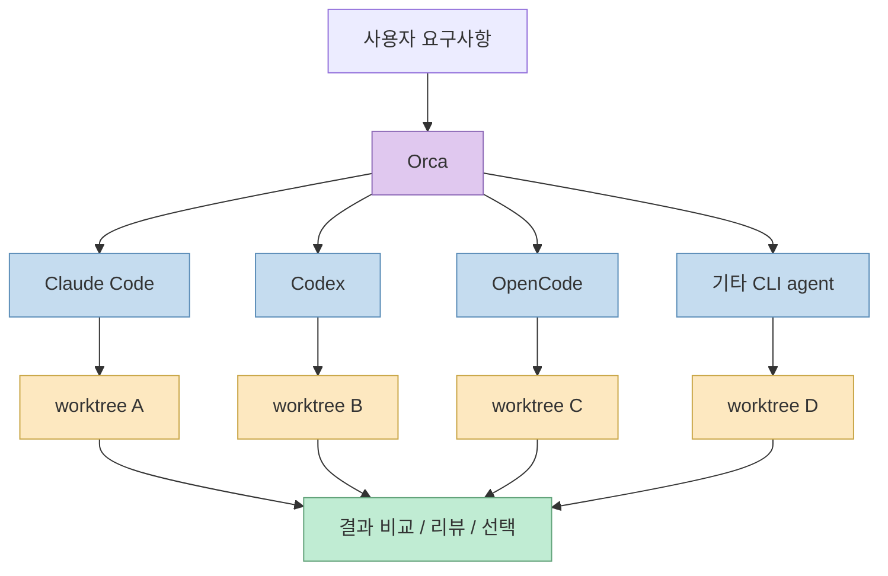
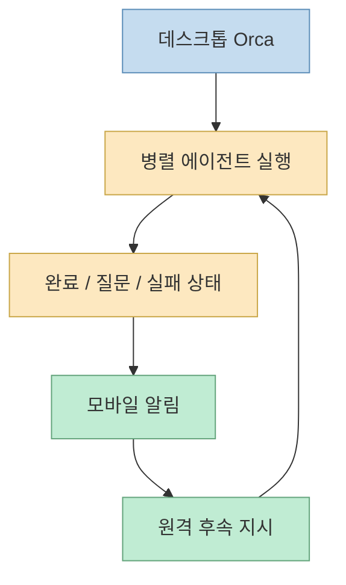
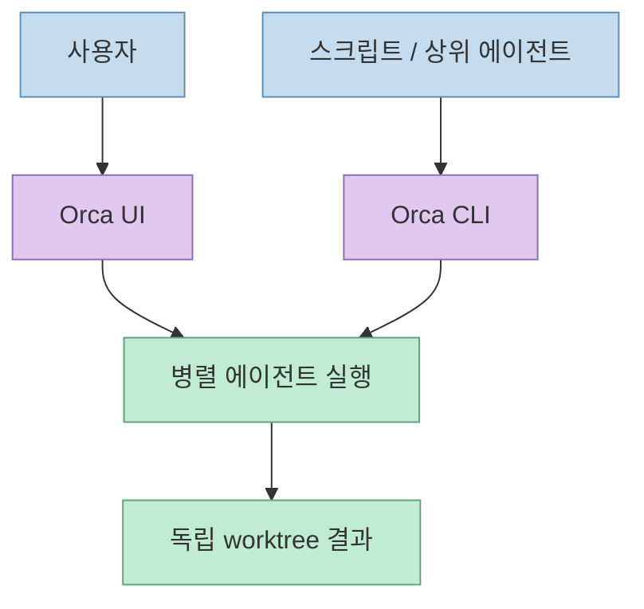

이 X 포스트가 꽂히는 이유는 문제 정의가 너무 현실적이기 때문입니다. 

- Claude Code도 쓰고
- Codex도 쓰고
- 여러 작업을 동시에 던져 놓고
- 각 터미널을 왔다 갔다 하며 결과를 확인하는 건

정말 금방 피곤해집니다.

X 원문이 소개한 `Orca`는 바로 이 문제를 겨냥합니다. 
핵심은 단순한 멀티탭 터미널이 아니라, **여러 AI 코딩 에이전트를 각자 독립된 worktree에서 병렬로 돌리고 결과를 한 화면에서 관리하는 ADE(Agent Development Environment)** 라는 점입니다.

<!--more-->

## Sources

- <https://x.com/i/status/2070016668194283617>
- <https://github.com/stablyai/orca>
- <https://onorca.dev>

## X 원문이 실제로 말한 것

공개 메타데이터 기준으로 X 원문에서 직접 확인 가능한 핵심은 이렇습니다.

- Claude Code와 Codex로 동시에 여러 작업을 열어 두면 터미널 전환 비용이 크다
- Orca는 여러 AI 코딩 에이전트를 한곳에서 관리하게 해 준다
- 병렬 worktree를 지원해서, 하나의 요구사항을 여러 AI에게 동시에 던지고
- 각각 독립된 git branch/worktree에서 작성하게 한다

즉 이 포스트는 “또 하나의 코딩 에이전트”를 소개하는 게 아닙니다. 
오히려 이미 존재하는 에이전트들을 **운영하기 위한 상위 조정면** 을 소개하고 있습니다.

## Orca는 무엇인가

GitHub README는 Orca를 아주 직접적으로 정의합니다.

> The AI Orchestrator for 100x builders.

그리고 이어서:

> Run Codex, ClaudeCode, OpenCode or Pi side-by-side — each in its own worktree, tracked in one place.

라고 설명합니다. <https://github.com/stablyai/orca>

즉 Orca는:

- 새로운 foundation model
- 새로운 코딩 에이전트
- 새로운 코드 생성 알고리즘

이 아니라, **여러 CLI agent를 병렬로 운용하기 위한 orchestration shell + UI + mobile companion** 에 가깝습니다.

README 최하단 설명도 이 점을 다시 확인합니다.

> Orca is the ADE for working with a fleet of parallel agents.

여기서 중요한 단어는 IDE가 아니라 **ADE** 입니다. 
즉 사람 한 명이 코드를 치는 환경이 아니라, **에이전트 함대를 운영하는 환경** 을 지향합니다.

## 병렬 worktree가 왜 핵심인가

README에서 가장 눈에 띄는 기능은 **Parallel Worktrees** 입니다.

> Fan one prompt across five agents, each in its own isolated git worktree — compare the results and merge the winner.

즉 하나의 요구사항을 여러 에이전트에 동시에 던지되, 각자:

- 같은 브랜치에서 충돌하며 일하는 게 아니라
- 독립된 git worktree 안에서
- 서로 간섭 없이
- 병렬로 작업합니다. <https://github.com/stablyai/orca>

이 구조가 중요한 이유는 두 가지입니다.

### 1. 비교 가능한 병렬 실험이 된다

동일한 요구를 Claude Code, Codex, 다른 agent에 동시에 던져:

- 누가 더 좋은 설계를 했는지
- 누가 더 빠르게 끝냈는지
- 어떤 스타일이 프로젝트에 맞는지

를 비교할 수 있습니다.

### 2. 컨텍스트 오염이 줄어든다

한 세션 안에서 여러 아이디어가 섞이는 대신, 각 worktree가 독립된 실험 공간이 됩니다.

즉 Orca는 단순히 “동시에 많이 돌리기”가 아니라, **에이전트 실험을 격리 가능한 브랜치 단위로 만든다** 는 점이 핵심입니다.

## 터미널 분할도 있지만 본질은 그 위의 조정층이다

README는 Ghostty-class terminals, infinite splits, restart 후에도 유지되는 scrollback 같은 **Terminal Splits** 를 강조합니다. <https://github.com/stablyai/orca>

하지만 이건 핵심의 일부일 뿐입니다. 
터미널 분할 자체는 tmux나 iTerm2, Warp 같은 도구로도 어느 정도 할 수 있습니다.

Orca의 차별점은 그 위에:

- worktree 추적
- 에이전트 상태 관리
- 작업 결과 비교
- mobile companion
- GitHub/Linear 통합

을 올린다는 데 있습니다.

즉 Orca는 “좋은 터미널 앱”이라기보다, **에이전트 운영 콘솔** 로 읽는 편이 더 맞습니다.

## Mobile Companion이 붙는 순간 "장기 실행 에이전트 운영" 쪽으로 넘어간다

README에서 상당히 눈에 띄는 기능이 **Mobile Companion** 입니다.

> Monitor and steer your agents from your phone — get notified when an agent finishes and send follow-ups from anywhere.

즉 Orca는 데스크톱 안에서만 끝나지 않습니다. 
모바일 앱을 통해:

- 에이전트 완료 알림을 받고
- 후속 지시를 보내고
- 원격으로 상황을 볼 수 있게 합니다. <https://github.com/stablyai/orca>

이건 중요한 신호입니다. 
에이전트를 “내가 눈앞에서 쓰는 보조도구”가 아니라, **한동안 돌려 놓고 중간중간 관리하는 반자율 작업자** 처럼 다루기 시작했다는 뜻이기 때문입니다.

즉 Orca는 “에이전트 여러 개 띄우는 UI”에서 더 나아가, **에이전트 운영 체제** 쪽으로 가고 있습니다.

## Design Mode가 흥미로운 이유

README가 말하는 **Design Mode** 는 다음과 같습니다.

> Click any UI element in a real Chromium window to send its HTML, CSS, and a cropped screenshot straight into your agent's prompt.

즉 브라우저에서 UI 요소를 클릭하면:

- 그 HTML
- CSS
- 잘린 screenshot

을 agent prompt로 바로 보냅니다. <https://github.com/stablyai/orca>

이 기능의 의미는 단순 스크린샷 전달이 아닙니다. 
코딩 에이전트가 웹 UI를 수정할 때 가장 어려운 건 “정확히 어느 부분을 말하는지”를 텍스트로 다시 설명하는 과정입니다.

Design Mode는 그 브리지 비용을 줄입니다.

즉 Orca는 코드 오케스트레이션뿐 아니라, **UI 변경 요구를 더 정확하게 전달하는 인터페이스** 도 같이 갖추려는 쪽입니다.

## GitHub와 Linear를 앱 안에 붙인다는 뜻

README는 GitHub와 Linear를 앱 안에서 직접 다룬다고 설명합니다.

> Browse PRs, issues, and project boards in-app — open a worktree from any task and review without a context switch.

이게 중요한 이유는 작업 단위가 이제:

- 로컬 파일
- 터미널 세션

만이 아니라,

- 이슈
- PR
- 보드 카드

까지 포함하기 때문입니다. <https://github.com/stablyai/orca>

즉 Orca는 agent를 코드 생성기라기보다, **작업 관리 시스템과 연결된 실행 단위** 로 다룹니다.

이건 에이전트가 브랜치만 만드는 게 아니라, 결국 조직의 작업 흐름 안에 들어와야 한다는 관점을 반영합니다.

## SSH Worktrees는 왜 중요한가

또 하나 중요한 기능이 **SSH Worktrees** 입니다.

README는:

> Run agents on a beefy remote box with full file editing, git, and terminals — auto-reconnect and port forwarding included.

라고 설명합니다. <https://github.com/stablyai/orca>

즉 Orca는 로컬 노트북 성능에 묶이지 않고:

- 더 강한 원격 머신
- 팀 서버
- GPU/고성능 개발 환경

위에서 에이전트를 돌리는 흐름도 염두에 둡니다.

이건 단순 원격 터미널이 아니라, **병렬 worktree를 원격 자원으로 확장** 한다는 의미가 있습니다.

즉 “에이전트 여러 개 운영”이 취미성 실험이 아니라 실제 장기 실행 워크로드로 가는 징후입니다.

## Annotate AI Diffs는 "결과 검토 루프"를 줄여 준다

README는 **Annotate AI Diffs** 기능도 강조합니다.

> Drop comments on any diff line and ship them back to the agent — review, edit, and commit without leaving Orca.

즉 사람이 diff를 보고:

- 여기 수정해
- 이 줄은 다시
- 이 방향은 취소

같은 피드백을 직접 남기면, 그것이 다시 에이전트에게 돌아갑니다. <https://github.com/stablyai/orca>

이건 중요합니다. 
많은 에이전트 툴이 “생성”은 잘하지만, **수정 피드백 루프** 는 여전히 불편합니다.

Orca는 diff review를 에이전트 운영의 핵심 루프로 포함시키려는 쪽입니다.

## Orca CLI가 있다는 건 "에이전트가 Orca도 조작한다"는 뜻이다

README는 또 하나 재미있는 문장을 씁니다.

> Agents drive Orca too — script every workflow with `orca worktree create`, `snapshot`, `click`, and `fill`.

즉 Orca는 사람이 쓰는 UI인 동시에, **다른 에이전트나 스크립트가 Orca 자체를 조작할 수 있는 표면** 도 제공합니다. <https://github.com/stablyai/orca>

이건 계층적으로 보면:

- 코드 에이전트
- 그 에이전트를 관리하는 Orca
- Orca 자체를 다루는 상위 자동화

라는 구조를 허용합니다.

즉 Orca는 단순 데스크톱 앱이 아니라, **agent orchestration substrate** 에 더 가깝습니다.

## 왜 "ADE"라는 표현이 중요한가

README는 자신을 IDE가 아니라 ADE라고 부릅니다. <https://github.com/stablyai/orca>

이건 단순 브랜딩이 아닙니다. 
IDE는 인간 개발자의 생산성을 중심에 둡니다. 반면 Orca가 말하는 ADE는:

- 병렬 에이전트
- worktree 격리
- 모바일 제어
- GitHub/Linear 연결
- 원격 실행

같은 기능을 묶어, 인간이 직접 코드 한 줄을 더 빨리 치는 게 아니라 **여러 에이전트를 감독하고 비교하고 선택하는 일** 을 중심에 둡니다.

즉 발전 방향이 다릅니다.

## 이 도구가 특히 잘 맞는 사람

### 1. Claude Code와 Codex를 둘 다 쓰는 사람

X 원문 문제의식 그대로입니다. 
여러 에이전트 사이를 왔다 갔다 하는 비용이 큰 사람에게 직접적인 이득이 있습니다.

### 2. 같은 요구를 여러 에이전트에 병렬로 시도해 보고 싶은 사람

누가 더 나은 결과를 내는지 비교하는 실험을 자주 하는 사람에게 잘 맞습니다.

### 3. 원격 머신까지 포함해 장기 실행 에이전트를 운영하는 사람

SSH worktree와 모바일 companion은 이런 사용자를 겨냥합니다.

### 4. PR / Issue / 디자인 수정까지 한 화면에서 다루고 싶은 사람

Orca는 단순 터미널보다 더 넓은 작업 표면을 제공합니다.

## 한계도 분명하다

### 1. 새로운 agent를 제공하는 건 아니다

좋은 결과의 본질은 여전히 Claude Code, Codex, OpenCode 같은 underlying agent 품질에 크게 의존합니다.

### 2. 병렬성은 곧 비용과 복잡도 증가다

여러 worktree와 여러 에이전트를 동시에 돌리면:

- 토큰 비용
- 추적 비용
- 비교 비용

도 함께 늘어납니다.

### 3. 좋은 오케스트레이션이 곧 좋은 판단은 아니다

한 화면에서 관리한다고 해서, 어떤 결과를 병합할지에 대한 인간 판단 책임이 사라지지는 않습니다.

### 4. 에이전트 함대 운영 자체가 새로운 업무가 된다

ADE는 IDE보다 상위 개념이지만, 그만큼 관리해야 할 상태도 많아집니다.

## 핵심 요약

- Orca는 또 하나의 코딩 에이전트가 아니라, 여러 CLI agent를 병렬 운영하는 **ADE** 다
- 핵심 기능은 각 agent를 독립 worktree에서 돌리고 결과를 비교하는 Parallel Worktrees다
- Mobile Companion, GitHub/Linear 통합, SSH Worktrees, Annotate AI Diffs가 함께 붙으면서 단순 터미널 앱을 넘어선다
- Design Mode는 UI 수정 지시를 더 정확하게 agent에게 전달하게 해 준다
- Orca CLI는 Orca 자체도 상위 자동화/agent가 조작할 수 있게 만든다
- 본질적으로 Orca는 “더 좋은 모델”이 아니라 **여러 모델/에이전트를 운영하는 조정면** 을 제공한다

## 결론

이 X 글의 핵심은 “Orca라는 새 AI가 있다”가 아닙니다. 
더 정확히는, **여러 코딩 에이전트를 하나의 함대처럼 병렬 운영하고 비교하는 작업이 이제 독립된 도구 계층을 요구할 만큼 커졌다** 는 사실을 보여 줍니다.

그래서 Orca는 IDE의 연장이 아니라, **에이전트 시대의 작업 운영 콘솔** 로 보는 편이 더 정확합니다.
