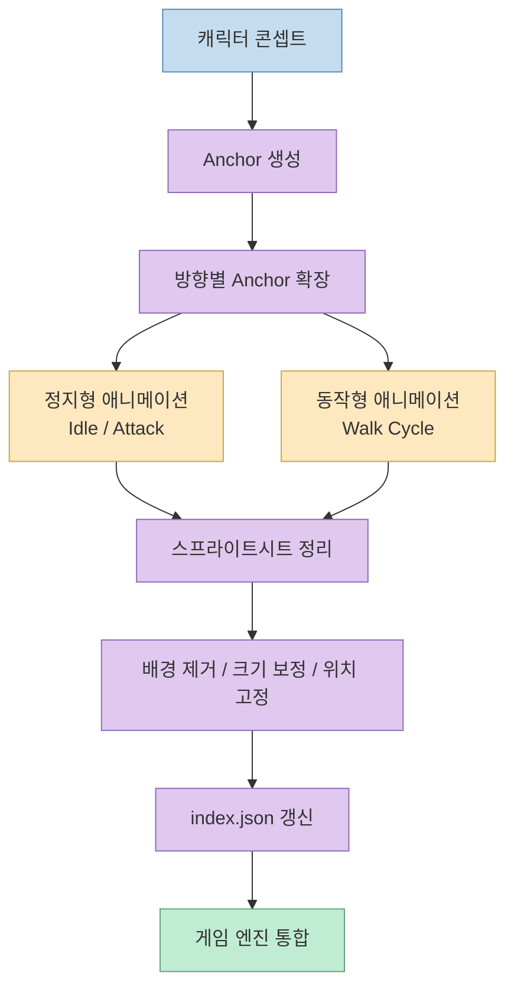
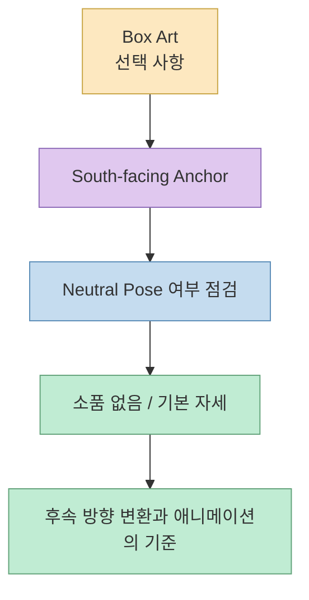
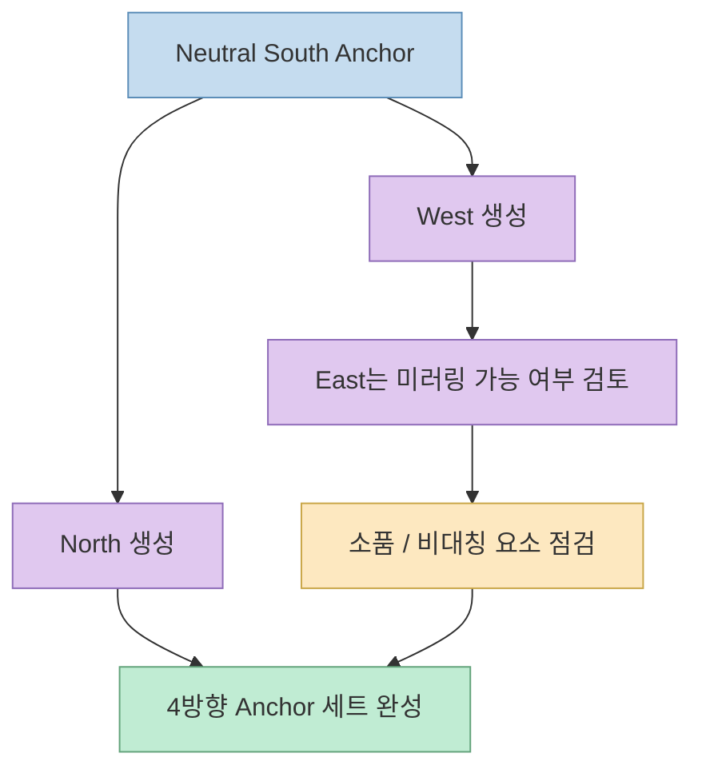
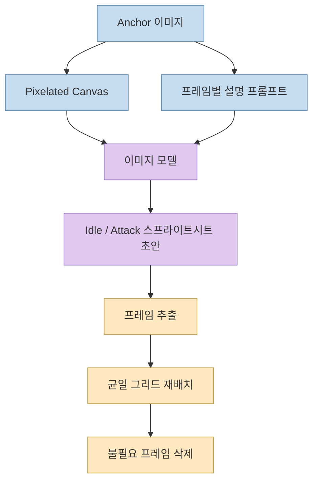
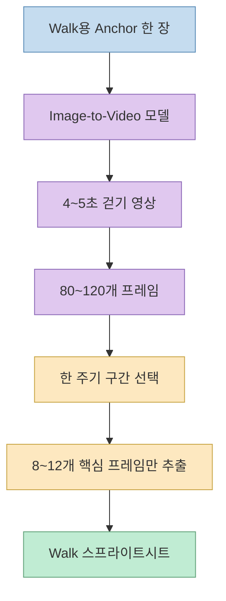
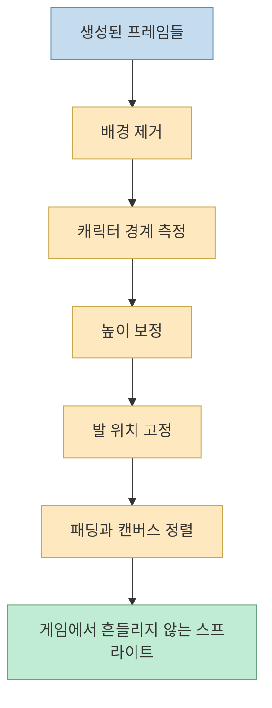
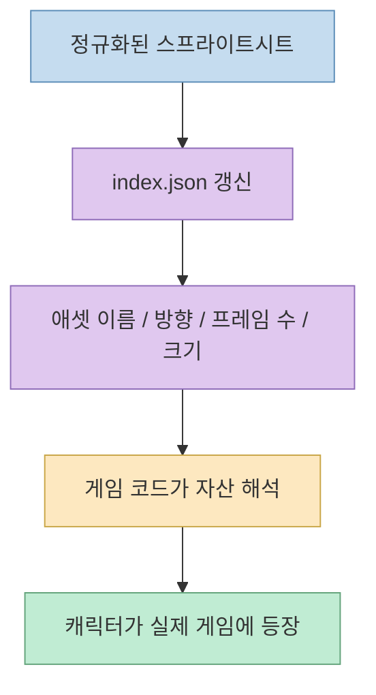

이 영상이 흥미로운 이유는 “AI로 캐릭터를 만들어 보자” 수준에서 멈추지 않기 때문입니다. 
핵심은 2D 게임 캐릭터 제작을 **한 장짜리 멋진 이미지 생성** 이 아니라, 실제 게임에 넣을 수 있는 **반복 가능한 자산 생산 파이프라인** 으로 설명한다는 데 있습니다.

발표자는 배경, 스프라이트, 사운드, 음악까지 모두 AI 생성으로 처리한 게임을 보여 준 뒤, 특히 많은 사람이 막히는 지점인 **원본 캐릭터 생성 → 방향별 변형 → 애니메이션 → 스프라이트시트 정리 → 게임 통합** 흐름을 단계별로 설명합니다. 영상 도입부에서 이 목표를 분명히 밝히며, 새 마법사 캐릭터를 처음부터 만들어 게임에 넣는 과정을 끝까지 보여 주겠다고 말합니다. [0:05](https://youtu.be/ftWQpHyWcVQ?t=5) [0:29](https://youtu.be/ftWQpHyWcVQ?t=29)

<!--more-->

## Sources

- <https://youtu.be/ftWQpHyWcVQ?si=L8uBRVu_6Xw_GlWS>

## 이 영상의 핵심 주장: "AI는 캐릭터 그림"보다 "게임 자산 파이프라인"에 가깝다

영상 초반 발표자는 “AI로 원본 게임 자산을 만들 수 있느냐”는 질문에 대해, 답은 **할 수 있다. 다만 방법을 알아야 한다** 는 식으로 정리합니다. 그리고 그 방법은 단순 프롬프트 한 줄이 아니라, 캐릭터를 여러 단계로 분해해 다루는 절차입니다. [0:22](https://youtu.be/ftWQpHyWcVQ?t=22) [0:31](https://youtu.be/ftWQpHyWcVQ?t=31)

이 관점이 중요한 이유는 이미지 모델의 강점과 약점이 분명하기 때문입니다.

- 정지 이미지는 꽤 잘 만든다
- 방향 전환도 어느 정도 된다
- 공격 같은 짧은 시퀀스도 만들 수 있다
- 하지만 walk cycle처럼 프레임 간 일관성과 리듬이 중요한 동작은 쉽게 무너진다

그래서 발표자는 “모든 애니메이션을 한 모델로 해결한다”가 아니라, **자산 종류에 따라 서로 다른 생성 방식과 후처리를 조합** 합니다.

## 1. 가장 중요한 한 장은 Anchor다

영상에서 발표자가 가장 강하게 강조하는 이미지는 `anchor` 입니다. 
그는 모든 후속 이미지와 애니메이션이 이 첫 이미지에 기반해 생성되므로, **처음 anchor를 잘 만드는 것이 가장 중요하다** 고 설명합니다. 특히 south-facing anchor를 기준으로 잡는 이유는 캐릭터의 핵심 특징을 가장 잘 담기 쉽기 때문이라고 말합니다. [4:00](https://youtu.be/ftWQpHyWcVQ?t=240) [4:13](https://youtu.be/ftWQpHyWcVQ?t=253)

여기서 흥미로운 포인트는 픽셀아트 스타일을 직접 “그려 내는” 것이 아니라, 모델이 그 스타일을 더 잘 따르도록 **검은색·흰색 그리드 이미지를 함께 참조 이미지로 넣는 방식** 을 쓴다는 점입니다. 발표자는 이 그리드가 pixel-art block discipline을 강제하는 역할을 한다고 설명합니다. [4:39](https://youtu.be/ftWQpHyWcVQ?t=279) [5:00](https://youtu.be/ftWQpHyWcVQ?t=300)

즉 anchor 단계의 목적은 단순히 예쁜 캐릭터 한 장을 얻는 것이 아니라:

- 캐릭터 실루엣을 고정하고
- 의상·소품·비율을 고정하고
- 이후 방향별 변환과 애니메이션이 참고할 원본을 만든다

는 데 있습니다.

### 왜 neutral pose가 중요한가

영상 중간에 발표자는 처음엔 손에 파이어볼을 든 anchor를 만들었다가, 그게 오히려 후속 작업을 어렵게 만들었다고 설명합니다. 
walk animation에서 캐릭터가 계속 파이어볼을 들고 있으면 안 되기 때문입니다. 그래서 **메인 reference는 항상 neutral pose south-facing anchor로 시작하라** 고 조언합니다. [8:00](https://youtu.be/ftWQpHyWcVQ?t=480) [8:34](https://youtu.be/ftWQpHyWcVQ?t=514)

이 조언은 매우 실무적입니다. 
생성 모델은 후속 이미지에서도 초깃값의 소품과 제스처를 계속 끌고 가려는 경향이 있기 때문에, 처음 기준 이미지를 너무 특수한 상태로 잡으면 모든 후처리가 꼬입니다.

## 2. "진짜 픽셀아트"보다 먼저 필요한 것은 스타일 일관성이다

영상에서 발표자는 지금 만드는 결과물이 엄밀한 의미의 true pixel art는 아니라고 분명히 말합니다. 
확대해 보면 픽셀이 다시 작은 흐릿한 픽셀 덩어리처럼 보이는, 이른바 "mixels"에 가깝다는 설명입니다. 하지만 그는 초기 게임 개발 단계에서는 이것이 치명적이지 않을 수 있으며, 우선은 게임이 돌아가고 스타일이 맞는 것이 더 중요하다고 봅니다. [6:02](https://youtu.be/ftWQpHyWcVQ?t=362) [7:07](https://youtu.be/ftWQpHyWcVQ?t=427)

이 부분은 꽤 중요한 현실 감각을 보여 줍니다. 
많은 튜토리얼이 “정통 방식이 아니면 안 된다”는 식으로 흘러가지만, 이 영상은 오히려:

- 지금 단계에서 필요한 품질이 무엇인지
- 나중에 고칠 수 있는 문제와 지금 막히는 문제를 구분해야 한다는 점

을 강조합니다.

즉 초기 프로토타이핑에서는:

- 완벽한 true pixel art
- 완벽한 수작업 프레임

보다도 **반복 생산 가능한 스타일과 빠른 통합 가능성** 이 더 중요하다는 뜻입니다.

## 3. 방향별 캐릭터는 Anchor를 확장해서 만든다

neutral south-facing anchor가 준비되면, 그 다음은 북/남/동/서 방향의 기준 이미지를 만드는 단계입니다. 
발표자는 neutral anchor와 다시 pixel grid guide를 함께 넣고, 원하는 방향만 명시해 서쪽·북쪽 이미지를 생성합니다. 그리고 비용을 아끼기 위해 좌우 방향은 한쪽을 뒤집어 재활용할 수도 있다고 설명합니다. [9:00](https://youtu.be/ftWQpHyWcVQ?t=540) [9:30](https://youtu.be/ftWQpHyWcVQ?t=570)

하지만 이 단계에도 함정이 있습니다. 
예를 들어 캐릭터가 책 같은 소품을 들고 있으면 뒤집힌 방향에서 소품 위치가 어색하게 나올 수 있습니다. 발표자는 이런 경우 모델이 등 뒤에서 책 위치를 틀리게 두는 artifact가 생길 수 있어, 잘못된 후면 소품 표현이 나오지 않도록 다시 프롬프트로 교정해야 한다고 말합니다. [9:45](https://youtu.be/ftWQpHyWcVQ?t=585) [10:08](https://youtu.be/ftWQpHyWcVQ?t=608)

즉 방향별 anchor 단계는 단순 미러링 자동화가 아니라, **미러링이 안전한 부분과 위험한 부분을 가려내는 검수 단계** 도 포함합니다.

## 4. Idle과 Attack은 이미지 생성으로도 꽤 잘 된다

발표자는 애니메이션을 만드는 첫 번째 방법으로 **이미지 생성 기반 스프라이트시트 생성** 을 설명합니다. 
여기서는 1024x1024 anchor를 기준으로, 게임에서 쓸 프레임 크기는 256x256 정도를 추천합니다. 그리고 5x2 또는 2x5 배치를 예상한 pixelated canvas를 함께 넣어 모델이 스프라이트시트 구조를 더 잘 따르도록 유도합니다. [11:31](https://youtu.be/ftWQpHyWcVQ?t=691) [12:05](https://youtu.be/ftWQpHyWcVQ?t=725) [12:27](https://youtu.be/ftWQpHyWcVQ?t=747)

이 방식으로 발표자는 idle animation과 attack animation을 만들 수 있다고 보여 줍니다. 프롬프트에서 각 프레임 시퀀스를 명시하면 결과가 더 좋아진다고 설명하는데, 이 말은 중요합니다. 모델에게 “애니메이션을 만들어 줘”라고 뭉뚱그려 말하는 것보다, **프레임별 의도와 그리드 구조를 함께 제시하는 것이 훨씬 안정적** 이라는 뜻이기 때문입니다. [13:00](https://youtu.be/ftWQpHyWcVQ?t=780) [13:27](https://youtu.be/ftWQpHyWcVQ?t=807)

다만 생성된 결과를 그대로 쓰지는 않습니다. 
발표자는 모델이 프레임을 완전히 균일한 칸에 맞춰 배치하지 않는 경우가 많다고 설명하며, 나중에 각 프레임을 추출해 **다시 균일한 그리드로 재배치하는 정리 과정** 이 필요하다고 말합니다. [13:43](https://youtu.be/ftWQpHyWcVQ?t=823) [14:03](https://youtu.be/ftWQpHyWcVQ?t=843)

### 왜 프레임 선택이 필요한가

모든 생성 프레임이 다 필요한 것도 아닙니다. 
idle에서는 실제 변화가 거의 없는 프레임이 많고, attack에서는 원하지 않는 이펙트 프레임이 섞일 수도 있다고 설명합니다. 그래서 공격 시작 동작만 남기고 일부 프레임을 버리거나, 눈 깜빡임만 의미 있는 경우 나머지를 줄이는 식으로 **프레임 선택** 이 필요합니다. [15:00](https://youtu.be/ftWQpHyWcVQ?t=900) [15:23](https://youtu.be/ftWQpHyWcVQ?t=923)

## 5. Walk Cycle은 이미지가 아니라 비디오 생성으로 푸는 것이 낫다고 본다

영상에서 가장 실전적인 포인트는 바로 이 부분입니다. 
발표자는 walk cycle만큼은 이미지 생성으로는 제대로 나오지 않는다고 단언에 가깝게 말합니다. 참조를 넣고 프롬프트를 다듬어도, 걸음 리듬이 틀어지거나 프레임이 이상해지는 문제가 계속 생긴다는 것입니다. [15:43](https://youtu.be/ftWQpHyWcVQ?t=943) [16:00](https://youtu.be/ftWQpHyWcVQ?t=960)

그래서 그가 택한 방법은 **anchor 한 장을 비디오 생성 모델에 넣고, 제자리에서 달리거나 걷는 짧은 영상을 뽑아낸 뒤, 그중 한 주기만 잘라 스프라이트시트로 바꾸는 방식** 입니다. 여기서 그는 Seedance 2.0 image-to-video를 사용하고 있다고 설명합니다. [16:12](https://youtu.be/ftWQpHyWcVQ?t=972) [17:18](https://youtu.be/ftWQpHyWcVQ?t=1038)

이 접근의 장점은 분명합니다.

- 왼발/오른발 교대가 더 자연스럽다
- 사람 눈에 거슬리는 리듬 붕괴가 적다
- 걷는 동작 전체를 하나의 연속 장면으로 먼저 얻을 수 있다

하지만 단점도 명확합니다.

- 4~5초 분량 영상이라 프레임 수가 80~120개 수준으로 많다
- 비용이 더 비싸다
- 그대로는 게임용 스프라이트시트로 쓰기 어렵다

발표자도 이 방식이 더 foolproof하지만 비싸다고 말합니다. [16:00](https://youtu.be/ftWQpHyWcVQ?t=960) [17:33](https://youtu.be/ftWQpHyWcVQ?t=1053)

### 왜 "in-frame running" 프롬프트가 중요하나

그는 비디오 생성 시 캐릭터가 프레임 안에서 제자리에서 움직이도록 유도하는 프롬프트가 매우 중요하다고 설명합니다. 
프레임 밖으로 달려 나가거나 점프 중 화면을 벗어나면 스프라이트로 재사용할 수 없기 때문입니다. 또 guide canvas를 비디오 모델에 넣으면 오히려 이상한 혼합 결과가 나오므로, 여기서는 **anchor 한 장만 넣고 프롬프트로 프레임 내 동작을 강제** 해야 한다고 조언합니다. [16:25](https://youtu.be/ftWQpHyWcVQ?t=985) [16:54](https://youtu.be/ftWQpHyWcVQ?t=1014)

## 6. 진짜 어려운 건 생성이 아니라 Normalization이다

영상 후반부의 핵심은 사실 여기입니다. 
발표자는 마지막 단계로 `sprite normalization` 과정을 설명하면서, 이 과정이 필요한 이유를 여러 가지로 나눠 설명합니다. [20:03](https://youtu.be/ftWQpHyWcVQ?t=1203) [20:21](https://youtu.be/ftWQpHyWcVQ?t=1221)

주요 작업은 다음과 같습니다.

### 1. 배경 제거

GPT Image 2.0이나 Nano Banana는 투명 배경을 직접 주지 않으므로, 밝은 보라색 크로마 배경 같은 통일된 배경색을 먼저 쓰고 나중에 제거합니다. 발표자는 예전엔 remove.bg 계열을 썼고, 지금은 다른 배경 제거 모델도 사용할 수 있다고 설명합니다. [20:17](https://youtu.be/ftWQpHyWcVQ?t=1217) [20:45](https://youtu.be/ftWQpHyWcVQ?t=1245)

### 2. Bounds 측정

각 프레임에서 캐릭터의 실제 경계를 측정해, 캐릭터가 셀 안에서 어느 정도 공간을 차지하는지 맞춰야 합니다. [21:00](https://youtu.be/ftWQpHyWcVQ?t=1260)

### 3. Height correction

마법 시전이나 점프 동작처럼 프레임마다 캐릭터가 차지하는 높이가 달라지면, 게임에서 덜컹거리는 듯 보일 수 있습니다. 그래서 높이를 보정해야 합니다. [21:15](https://youtu.be/ftWQpHyWcVQ?t=1275)

### 4. Anchor and pad

발 위치가 고정되지 않으면 캐릭터가 게임 내에서 프레임마다 흔들리거나 튀어 보입니다. 발표자는 다리가 고정되지 않으면 캐릭터가 화면 안에서 계속 움직이는 것처럼 보인다고 설명합니다. [21:26](https://youtu.be/ftWQpHyWcVQ?t=1286) [21:43](https://youtu.be/ftWQpHyWcVQ?t=1303)

결국 normalization은 단순 정렬이 아니라, **게임 엔진이 같은 캐릭터로 인식할 수 있도록 프레임 간 좌표계와 비율을 통일하는 작업** 입니다.

## 7. 마지막 통합은 index.json 같은 자산 인덱스가 맡는다

영상 맨 끝에서 발표자는 자신이 항상 `index.json` 같은 자산 인덱스를 둔다고 설명합니다. 
이 파일에는 어떤 스프라이트가 존재하는지, 프레임 크기가 얼마인지, 몇 프레임인지, 공격 애니메이션인지, 어느 방향인지 같은 정보가 들어갑니다. 새로 만든 스프라이트시트를 여기에 추가한 뒤, 게임에 통합하는 프롬프트를 주면 거의 한두 번의 프롬프트로 게임 안에 들어간다고 설명합니다. [22:59](https://youtu.be/ftWQpHyWcVQ?t=1379) [23:20](https://youtu.be/ftWQpHyWcVQ?t=1400)

이 설계는 아주 중요합니다. 
AI로 만든 자산을 게임에서 재사용하려면 결국 엔진이 읽을 수 있는 **명시적 메타데이터 계층** 이 필요하기 때문입니다.

즉 파이프라인의 마지막 단계는:

- 그림을 더 예쁘게 만드는 것

이 아니라,

- 엔진이 이 자산을 어떻게 해석해야 하는지 명시하는 것

입니다.

## 핵심 요약

- 이 영상의 본질은 AI 이미지 생성 소개가 아니라 **2D 게임 캐릭터 제작 파이프라인 설계** 다.
- 가장 중요한 시작점은 south-facing **neutral anchor** 이며, 후속 방향별 이미지와 애니메이션의 기준이 된다. [4:00](https://youtu.be/ftWQpHyWcVQ?t=240) [8:34](https://youtu.be/ftWQpHyWcVQ?t=514)
- idle과 attack 같은 정지형 애니메이션은 이미지 생성 기반 스프라이트시트 방식이 비교적 잘 맞는다. [11:31](https://youtu.be/ftWQpHyWcVQ?t=691) [13:27](https://youtu.be/ftWQpHyWcVQ?t=807)
- walk cycle은 이미지 생성보다 image-to-video 방식이 더 안정적이라고 본다. [15:43](https://youtu.be/ftWQpHyWcVQ?t=943) [17:18](https://youtu.be/ftWQpHyWcVQ?t=1038)
- 생성 결과를 실제 게임에 쓰려면 배경 제거, 경계 측정, 높이 보정, 발 위치 고정 같은 **sprite normalization** 이 필수다. [20:03](https://youtu.be/ftWQpHyWcVQ?t=1203) [21:43](https://youtu.be/ftWQpHyWcVQ?t=1303)
- 마지막에는 `index.json` 같은 자산 인덱스를 통해 엔진과 연결해야 진짜 게임 자산이 된다. [22:59](https://youtu.be/ftWQpHyWcVQ?t=1379)

## 결론

이 영상이 보여 주는 가장 큰 교훈은, AI 게임 자산 제작에서 병목은 “좋은 그림을 한 장 뽑는 것”이 아니라는 점입니다. 
진짜 병목은 **일관된 기준 이미지를 만들고, 방향별로 확장하고, 동작 종류에 따라 생성 방식을 달리하고, 마지막에 엔진 친화적인 형식으로 정규화하는 일** 입니다.

그래서 이 튜토리얼은 GPT Image 2.0이나 Seedance 2.0 자체보다, 그 모델들을 어떤 순서와 규칙으로 엮어야 실제 게임 파이프라인이 되는지를 배우는 데 더 가치가 있습니다. 
AI로 게임을 만드는 사람에게 필요한 것은 “모델 하나”가 아니라, 결국 이런 **자산 운영 워크플로우** 에 더 가깝습니다.
