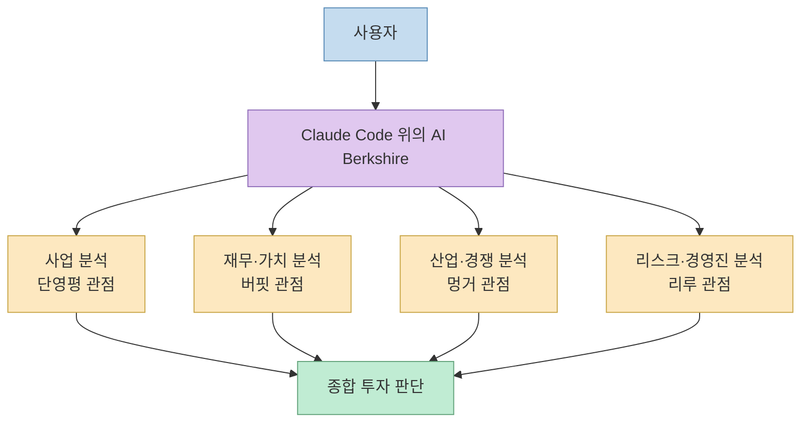
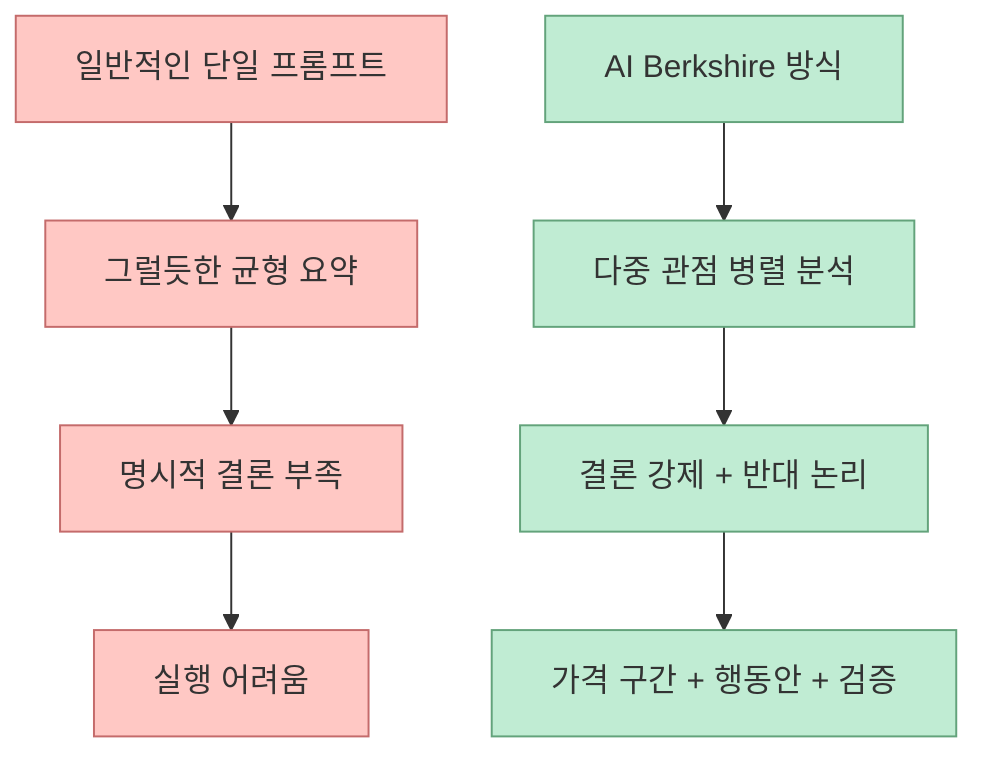
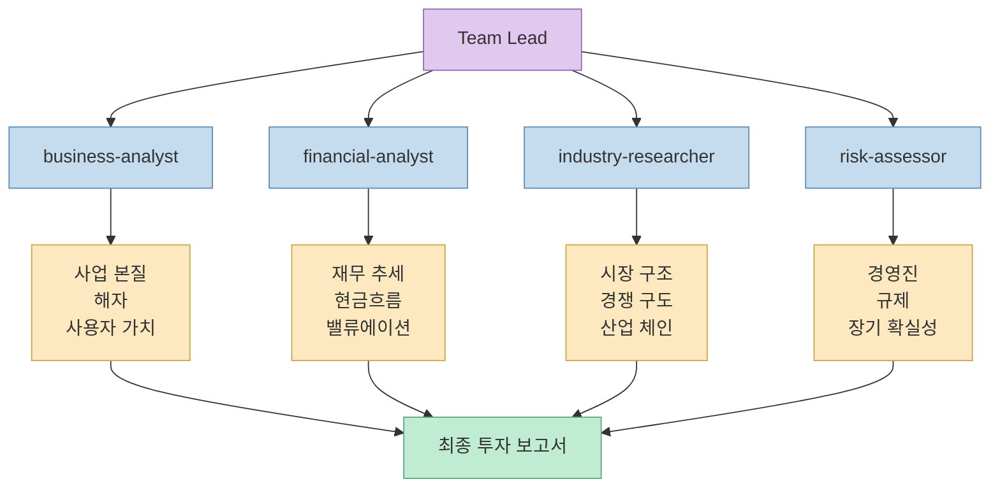
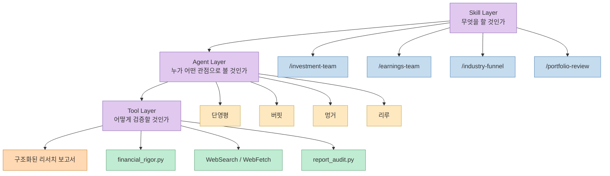
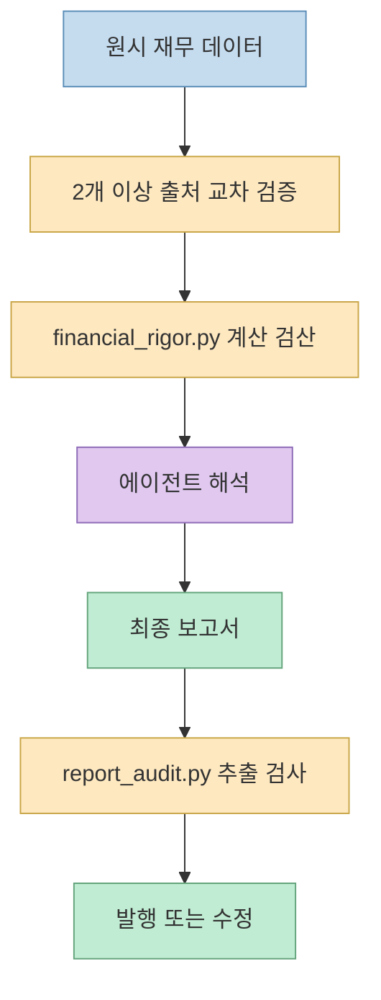
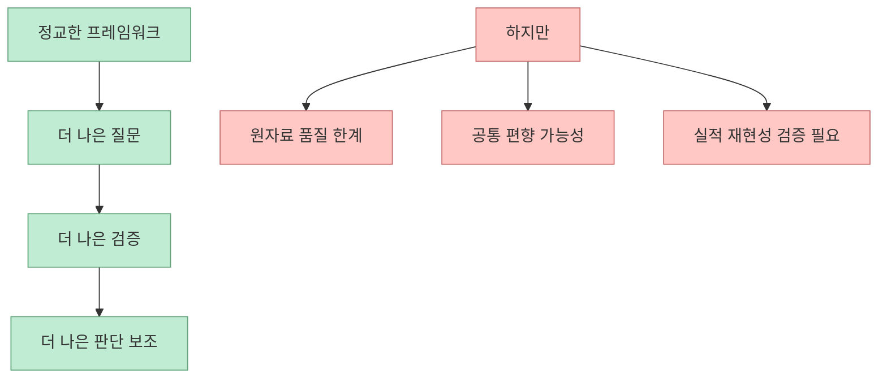

`AI Berkshire` 를 보면 가장 먼저 눈에 들어오는 것은 “AI로 주식 분석해 준다”는 문장이 아닙니다. 
진짜 포인트는 **가치투자 리서치를 프롬프트 한 번의 감상문이 아니라, 반복 가능한 운영 절차로 바꾸려 한다** 는 데 있습니다.

이 저장소는 Claude Code 위에 투자 리서치용 스킬 묶음, 네 개의 투자 관점, 병렬 에이전트 운영 방식, 그리고 숫자 검증 도구를 얹습니다. 
그래서 결과물도 단순한 “좋아 보인다 / 위험하다”가 아니라, 가능한 한 **판단 근거·반대 논리·가격 구간·검증 기록** 이 남는 형태를 지향합니다.

<!--more-->

## Sources

- <https://github.com/xbtlin/ai-berkshire>
- <https://raw.githubusercontent.com/xbtlin/ai-berkshire/main/README_EN.md>
- <https://raw.githubusercontent.com/xbtlin/ai-berkshire/main/assets/architecture.mmd>
- <https://raw.githubusercontent.com/xbtlin/ai-berkshire/main/skills/investment-team.md>

## 이 프로젝트를 한 줄로 보면 무엇인가

README_EN은 `AI Berkshire` 를 **Claude Code 기반 투자 리서치 스킬 모음** 이라고 소개합니다. 
그리고 네 명의 가치투자 대가, 즉 Buffett, Munger, Duan Yongping, Li Lu의 방법론을 구조화했다고 설명합니다.

여기서 중요한 건 “누구의 철학을 흉내 낸다”는 수준이 아니라, 서로 다른 평가 프레임을 **에이전트 역할 분리** 로 바꾸었다는 점입니다.

- 단영평 시각: 비즈니스 본질과 좋은 사업인가
- 버핏 시각: 재무 품질과 밸류에이션
- 멍거 시각: 경쟁과 반대 시나리오
- 리루 시각: 리스크와 장기 확실성

즉 이 저장소의 핵심은 모델 하나가 모든 것을 한 번에 말하는 방식이 아니라, **서로 다른 판단 기준을 병렬로 세워 일부러 긴장을 만들려는 설계** 입니다.

## 왜 "그냥 AI에게 물어보면 안 되나"라는 질문부터 시작하나

이 저장소의 README가 가장 강하게 밀고 있는 문제의식은 바로 이것입니다. 
그냥 AI에게 “이 주식 사도 되나?”라고 묻는 방식은 보통 균형 잡힌 척하는 요약으로 끝나기 쉽고, 실제 의사결정에 필요한 **명시적 결론** 이 부족하다는 것입니다.

프로젝트는 이 약점을 세 가지 수준에서 다루려 합니다.

### 1. 결론을 강제한다

README 예시는 결과를 `Pass / Fail / Gray Zone` 같은 형태로 강제하고, 가격 구간과 투자 성향별 행동안을 함께 둡니다. 
즉 “장단점이 있습니다”에서 끝내지 않고, 최소한 **어떤 조건에서 살지 말지** 를 구조화하려는 것입니다.

### 2. 일부러 충돌을 만든다

같은 기업을 보더라도:

- 어떤 관점에서는 싸 보이고
- 어떤 관점에서는 장기 확실성이 낮아 보일 수 있습니다.

프로젝트는 이 충돌 자체를 제거하지 않고 오히려 남겨 둡니다. 
이 점이 흥미로운 이유는, 투자 판단에서 위험한 것은 정보 부족만이 아니라 **하나의 정리된 서사가 너무 그럴듯하게 들리는 순간** 이기 때문입니다.

### 3. "모른다"를 허용한다

README는 정보 풍부도 등급, 반대 논리 점검, 빠른 탈락 기준, 군중 반대 질문 같은 장치를 넣어 **과도한 확신** 을 억제하려고 합니다. 
즉 이 시스템은 “답을 늘리는 AI”가 아니라, 적어도 의도상으로는 **틀릴 수 있는 이유를 먼저 드러내는 AI** 를 만들려는 쪽에 가깝습니다.

## 핵심은 "멀티 에이전트" 자체보다, 판단 기준을 역할로 쪼갠다는 점이다

README_EN은 `/investment-team` 을 설명하면서 네 개의 AI Agent가 동시에 조사하고, 각자 독립적으로 결론을 낸 뒤 Team Lead가 종합한다고 설명합니다. 
raw `investment-team.md` 도 이 구조를 더 구체적으로 보여 줍니다.

거기서 Team Lead는 직접 모든 분석을 하지 않고,

- business-analyst
- financial-analyst
- industry-researcher
- risk-assessor

라는 역할을 만들어 병렬 조사하게 합니다.

이 설계가 중요한 이유는 “에이전트를 많이 띄운다”보다 **어떤 질문을 누구에게 맡길지 명확히 고정했다** 는 데 있습니다.

- 사업 분석 담당은 사업 본질과 해자를 묻고
- 재무 담당은 3~5년 수치와 현금흐름, 밸류에이션을 본다
- 산업 담당은 경쟁자와 가치사슬을 본다
- 리스크 담당은 규제, 거버넌스, 경영진의 질을 본다

즉 프로젝트는 병렬성 자체를 과시하는 게 아니라, **투자 리서치 체크리스트를 병렬 실행 가능한 조직도** 로 바꾸고 있습니다.

## 아키텍처에서 더 중요한 것은 3계층 분리다

저장소의 `architecture.mmd` 와 README_EN을 같이 보면, 이 프로젝트는 자신을 대략 세 층으로 설명합니다.

- Skill Layer
- Agent Layer
- Tool Layer

이 구분은 꽤 실용적입니다.

### 1. Skill Layer: 사용자가 무엇을 하고 싶은지

README_EN은 총 16개의 스킬을 소개합니다. 
깊은 기업 분석, 실적 읽기, 산업 스크리닝, 포트폴리오 리뷰, 뉴스 급등락 해석, 체크리스트형 빠른 판별 같은 엔트리포인트가 나뉘어 있습니다.

즉 사용자는 “한 회사 전체 분석”, “이번 분기 실적 읽기”, “산업군에서 3개 종목 고르기” 같은 **작업 단위** 로 진입합니다.

### 2. Agent Layer: 그 작업을 누가 어떤 시각으로 수행하는지

여기서 네 개의 관점 에이전트가 병렬로 움직입니다. 
이 레이어는 사용자 요청을 단순 분해하는 수준이 아니라, **각 역할마다 봐야 할 질문을 다르게 강제** 합니다.

### 3. Tool Layer: 계산과 검증을 어떻게 믿을 것인지

여기서 `financial_rigor.py`, `report_audit.py`, 웹 검색, 외부 데이터 수집기가 등장합니다. 
이 뜻은 아주 명확합니다. 프로젝트가 진짜 위험하다고 보는 것은 “AI가 말을 못하는 것”이 아니라, **AI가 숫자를 그럴듯하게 틀리는 것** 입니다.

## 금융 숫자를 "도구로 검산"하게 한 점이 특히 중요하다

README_EN과 `investment-team.md` 에서 반복해서 나오는 대목이 있습니다. 
핵심 금융 데이터는 반드시 교차 검증하고, 시가총액이나 밸류에이션 같은 계산은 **머릿속이 아니라 도구로 확인하라** 는 것입니다.

예를 들어:

- 시가총액 검산
- 밸류에이션 검산
- 핵심 필드 교차 검증
- 낙관/중립/비관 3시나리오 평가

를 `financial_rigor.py` 로 수행하게 되어 있습니다.

이 대목이 중요한 이유는, 많은 “AI로 투자 분석” 프로젝트가 사실상 **설명 생성기** 에 머무르기 쉽기 때문입니다. 
반면 AI Berkshire는 적어도 설계 의도상, 설명 생성 앞에 **숫자 검산 레이어** 를 둡니다.

즉 이 시스템의 실질적 가치는 “유명 투자자 말투로 써 준다”보다도,

- 숫자를 다시 계산하고
- 둘 이상의 출처를 맞춰 보고
- 보고서 발행 전에 샘플 검수까지 거친다

는 운영 절차 쪽에 있습니다.

## 이 프로젝트는 "투자 알파 엔진"이라기보다 "리서치 운영체제"에 가깝다

README는 실계좌 성과 수치도 전면에 내세웁니다. 
2026년 6월 27일 기준 제가 확인한 GitHub 페이지와 raw README_EN에는 2024년 수익률 `+69.29%`, 2025년 YTD `+66.38%` 같은 실적 주장이 함께 적혀 있습니다. 
다만 이런 수익률 수치는 사용자에게 강한 인상을 주지만, 블로그 관점에서 더 중요한 것은 **이 저장소가 어떤 종류의 제품이냐** 입니다.

제 판단으로 이 프로젝트를 가장 정확하게 설명하는 표현은 “주식 추천기”가 아니라 **투자 리서치 운영체제** 입니다.

그 이유는 다음과 같습니다.

### 1. 진입점이 종목 추천이 아니라 작업 흐름이다

스킬 이름들을 보면:

- 특정 기업 정밀 분석
- 실적 리뷰
- 산업 스크리닝
- 포트폴리오 관리
- 뉴스 변동 원인 파악

처럼 투자 업무의 전체 워크플로우를 커버하려고 합니다.

### 2. 결과물도 보고서 중심이다

아키텍처 다이어그램의 출력은 `reports/{회사}/*.md` 형태의 구조화 보고서입니다. 
즉 바로 매매 API를 두드리는 시스템보다, **판단 가능한 문서 생산 체계** 에 더 가깝습니다.

### 3. 사람을 대체하기보다 사람의 판단을 더 느리게, 더 명시적으로 만든다

좋은 점만 보면 바로 매수로 이어지기 쉽지만, 이 프로젝트는 오히려:

- 왜 틀릴 수 있는지
- 어떤 정보가 부족한지
- 어떤 가격에서만 의미가 있는지

를 함께 남기려 합니다. 
그래서 완전 자동매매보다는 **사람이 마지막 책임을 지는 리서치 하네스** 로 보는 편이 맞습니다.

## 동시에 한계도 분명하다

흥미로운 설계라는 것과, 실제 투자 판단에 그대로 믿고 써도 된다는 것은 전혀 다릅니다. 
이 프로젝트에는 구조적으로 몇 가지 한계가 따라붙습니다.

### 1. 프레임워크가 정교해도 원자료 품질 문제는 사라지지 않는다

공개 웹 정보, 뉴스, 2차 요약, 번역된 수치가 섞이면 아무리 체크리스트를 잘 짜도 오염될 수 있습니다. 
README도 출처 교차 검증을 강조하지만, 결국 **좋은 검증은 좋은 데이터 소싱을 전제** 합니다.

### 2. 관점 다양성이 곧 진실을 보장하지는 않는다

네 개의 에이전트가 서로 다른 역할을 맡아도, 같은 웹 생태계의 비슷한 정보에 의존하면 공통 편향을 공유할 수 있습니다. 
즉 병렬성은 블라인드 스폿을 줄일 수는 있어도 자동으로 제거하지는 못합니다.

### 3. 실적 주장은 가장 보수적으로 읽어야 한다

저장소에 제시된 수익률은 인상적이지만, 공개 README만으로는

- 정확한 표본 기간
- 포지션 크기 변동
- 현금 비중
- 거래 비용
- 재현 절차

까지 완전히 검증되지는 않습니다. 
그래서 이 부분은 “프레임워크의 가능성을 보여 주는 자기 보고형 주장”으로 읽는 편이 안전합니다.

## 결국 이 저장소가 던지는 메시지는 "좋은 프롬프트"가 아니라 "좋은 리서치 조직도"다

`AI Berkshire` 를 보고 배울 만한 지점은 특정 투자 철학 그 자체보다도, **복잡한 판단 업무를 어떻게 AI 친화적인 작업 체계로 분해할 것인가** 입니다.

이 저장소는 다음과 같은 순서를 보여 줍니다.

1. 작업 종류를 스킬로 분리한다. 
2. 판단 기준을 역할별 에이전트로 나눈다. 
3. 숫자와 결론을 도구로 검산한다. 
4. 마지막에 종합 보고서와 감사 절차를 둔다. 

이 구조는 투자 외 영역에도 그대로 번역될 수 있습니다. 
예를 들어 제품 전략, 경쟁사 분석, 보안 리뷰, 기술 due diligence 같은 분야에서도 “한 번에 묻는 프롬프트”보다 **역할 분리 + 병렬 조사 + 검산 도구 + 최종 감사** 구조가 훨씬 강력할 수 있습니다.

## 핵심 요약

- `AI Berkshire` 는 Claude Code 위에서 돌아가는 투자 리서치 스킬 프레임워크다.
- 핵심은 네 명의 가치투자 대가 관점을 에이전트 역할로 분리해 병렬 조사하게 만드는 점이다.
- 프로젝트는 단순 요약 대신 결론 강제, 반대 논리, 가격 구간, 체크리스트를 남기려 한다.
- `financial_rigor.py` 와 `report_audit.py` 같은 도구 레이어를 둬 숫자 검산과 보고서 품질 점검을 강조한다.
- 따라서 이 프로젝트의 본질은 “주식 추천 AI”보다 **투자 리서치 운영체제** 또는 **리서치 하네스** 에 가깝다.
- 다만 실적 주장과 판단 품질은 반드시 보수적으로 읽어야 하며, 원자료 품질과 재현성 검증은 별개 문제다.

## 결론

`AI Berkshire` 가 재미있는 이유는 투자 조언을 잘해서가 아니라, **AI를 써서 판단 업무를 어떻게 더 구조화할 수 있는지** 를 꽤 선명하게 보여 주기 때문입니다. 
좋은 모델 하나에 기대는 대신, 역할을 나누고, 서로 충돌하게 하고, 숫자는 도구로 다시 확인하고, 마지막에 문서와 감사를 남기는 방식입니다.

그래서 이 저장소는 투자 도메인에 관심이 없더라도 한 번 볼 가치가 있습니다. 
Claude Code 시대의 진짜 경쟁력은 “무슨 모델을 쓰느냐”보다, 이렇게 **어떤 운영 체계를 얹느냐** 에 더 가까워 보이기 때문입니다.
