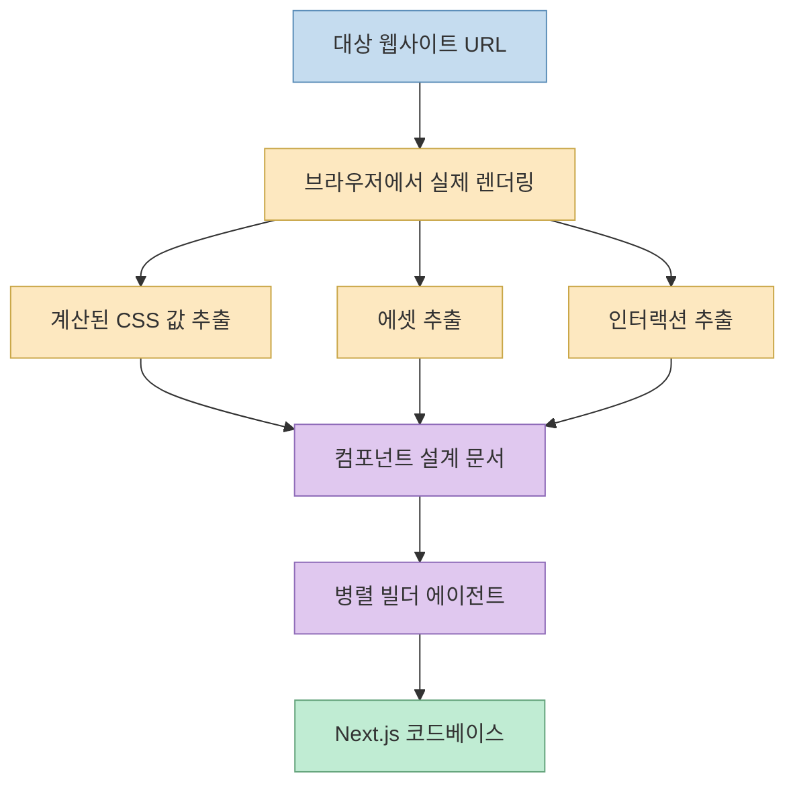
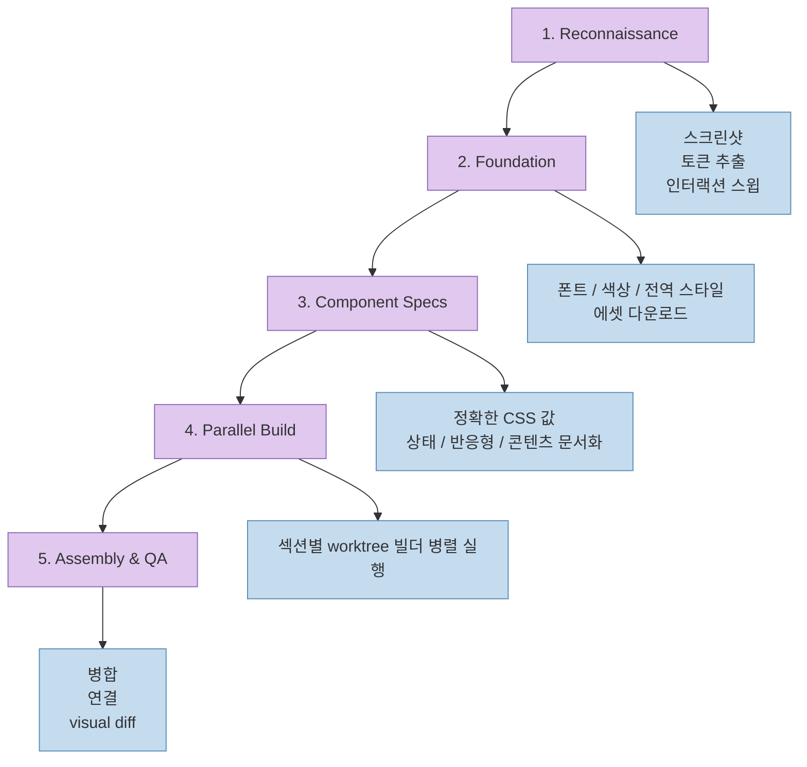
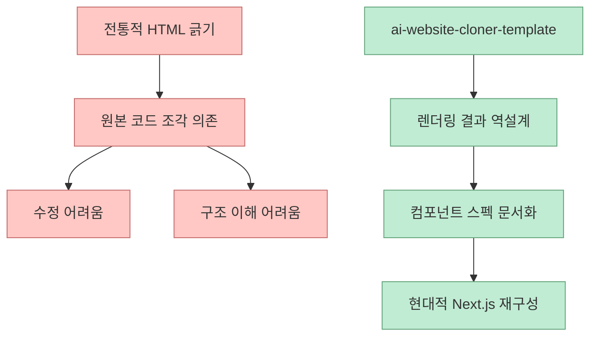
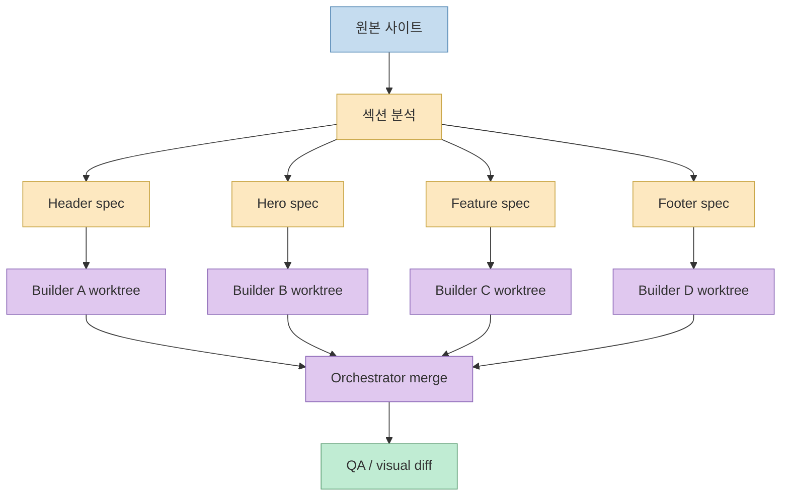

이 YouTube Shorts가 짚은 포인트는 꽤 정확합니다. 
`ai-website-cloner-template` 이 흥미로운 이유는 “사이트를 복사한다”는 자극적인 문장 때문이 아니라, **복사의 단위를 HTML 소스가 아니라 브라우저에서 실제로 계산된 결과물로 바꿨다** 는 데 있습니다.

짧은 영상은 이 도구를 “명령어 한 줄로 사이트를 통째로 복제하는 오픈소스”라고 소개하지만, GitHub 원문을 같이 읽어 보면 실제 구조는 훨씬 더 엄격합니다. 
대상 URL을 넣고 `/clone-website` 를 실행하면 AI 코딩 에이전트가 사이트를 열어 디자인 토큰, 에셋, 인터랙션, 컴포넌트 스펙을 추출하고, 이후 여러 빌더를 병렬로 보내 **깨끗한 Next.js 코드베이스로 재구성** 합니다. [Shorts 0:10](https://youtu.be/f-LOomeia2U?t=10) [Shorts 0:29](https://youtu.be/f-LOomeia2U?t=29)

<!--more-->

## Sources

- <https://youtube.com/shorts/f-LOomeia2U?si=mRQ16wOJl7-WnLyA>
- <https://github.com/JCodesMore/ai-website-cloner-template>

## Shorts가 요약한 핵심: "추측하지 않는다"

Shorts에서 가장 중요한 문장은 “핵심은 추측하지 않는다”는 부분입니다. 
설명에 따르면 보통 사이트 복제는 HTML을 그대로 긁어오거나 화면을 베껴 오는 방식으로 이해되기 쉽지만, 이 템플릿은 실제 브라우저에서:

- 글자 크기
- 색상
- 간격
- 스크롤 / 클릭 / hover 같은 인터랙션

을 **실제 계산값** 으로 뽑아낸 뒤, 그 수치로 설계도를 만들고 코드를 다시 짭니다. [Shorts 0:20](https://youtu.be/f-LOomeia2U?t=20) [Shorts 0:31](https://youtu.be/f-LOomeia2U?t=31)

GitHub README도 이 요약을 거의 그대로 뒷받침합니다. 
README는 이 템플릿을 “AI coding agents를 사용해 어떤 웹사이트든 clean, modern Next.js codebase로 reverse-engineering하는 재사용 가능한 템플릿”이라고 설명하고, `/clone-website` 를 실행하면 AI 에이전트가 사이트를 검사하고, design tokens와 assets를 추출하고, component specs를 작성하고, parallel builders를 dispatch한다고 적고 있습니다. 이 말은 결국 Shorts가 강조한 “추측 없는 복원”이 단순 홍보 문구가 아니라 저장소의 설계 원칙이라는 뜻입니다. <https://github.com/JCodesMore/ai-website-cloner-template>

## 이 템플릿은 단순 스크레이퍼가 아니라 "역설계 하네스"에 가깝다

README의 Quick Start를 보면 이 프로젝트는 사용자에게 템플릿 저장소를 직접 수정하지 말고, GitHub의 `Use this template` 로 자기 저장소를 먼저 만들라고 안내합니다. 
그 뒤 `npm install`, `claude --chrome`, 그리고 `/clone-website <target-url>` 순서로 진행합니다. 즉 이 저장소는 완성품이 아니라, **복제 작업을 수행할 작업장** 을 제공하는 형태입니다. <https://github.com/JCodesMore/ai-website-cloner-template>

이 점이 중요한 이유는 이 도구의 본질이 “특정 사이트를 한 번 긁어오는 스크립트”가 아니라, **사이트 역설계 프로젝트를 운영하는 템플릿** 이라는 뜻이기 때문입니다.

실제로 README에는 다음 요소들이 함께 들어 있습니다.

- Next.js 16 + React 19 + TypeScript strict 기반 scaffold
- shadcn/ui + Tailwind CSS v4 기반 UI 환경
- AI agent별 설정 파일
- `/clone-website` 스킬
- 에이전트 규칙의 단일 source of truth인 `AGENTS.md`

즉 이 저장소는 사이트 복제를 “명령 하나”처럼 보이게 만들지만, 내부적으로는 **브라우저 분석 + 설계 문서화 + 병렬 구현 + QA** 까지 이어지는 운영 하네스입니다.

## README가 설명하는 실제 5단계 파이프라인

Shorts는 동작을 크게 5단계라고 설명합니다. 
README의 `How It Works` 섹션도 실제로 같은 5단계를 제시합니다.

### 1. Reconnaissance

먼저 스크린샷을 찍고, 디자인 토큰을 추출하고, 스크롤·클릭·hover·반응형 동작을 훑습니다. Shorts에서 말한 “정찰” 단계와 일치합니다. [Shorts 0:43](https://youtu.be/f-LOomeia2U?t=43)

### 2. Foundation

그다음 폰트, 색상, 전역 스타일을 세팅하고 필요한 에셋을 다운로드합니다. Shorts에서 말한 “기반 다지기”와 대응합니다. [Shorts 0:50](https://youtu.be/f-LOomeia2U?t=50)

### 3. Component Specs

각 요소의 정확한 CSS 값, 상태, 동작, 콘텐츠를 바탕으로 상세 스펙 파일을 씁니다. Shorts는 이 부분을 “정확한 CSS 수치로 상세 설계 문서를 쓴다”고 요약합니다. [Shorts 0:57](https://youtu.be/f-LOomeia2U?t=57)

### 4. Parallel Build

섹션별로 여러 builder agent를 worktree에서 병렬로 돌립니다. README는 “one per section/component” 수준으로 설명하고, AGENTS.md는 각 teammate가 반드시 자신의 worktree branch에서 작업해야 한다고 못 박고 있습니다. [Shorts 1:02](https://youtu.be/f-LOomeia2U?t=62)

### 5. Assembly & QA

마지막으로 worktree 결과를 합치고 페이지를 연결한 뒤, 원본과 시각적 diff를 돌립니다. README는 이 단계를 Assembly & QA로 설명합니다.

## 왜 "HTML 긁기"보다 이 방식이 더 중요할까

Shorts는 일반적인 복제 방식이 HTML을 그대로 긁어 와서 나중에 고치기 어려운 결과물을 남긴다고 설명합니다. [Shorts 0:25](https://youtu.be/f-LOomeia2U?t=25) 
README와 AGENTS.md를 보면 이 프로젝트가 왜 그 문제를 피하려고 하는지 더 명확해집니다.

### 1. 목표 산출물이 HTML 복사본이 아니라 현대적 코드베이스다

README는 결과를 “clean, modern Next.js codebase”로 정의합니다. 
즉 기존 사이트의 내부 구현을 그대로 복제하는 것이 아니라, **보이는 결과를 기준으로 현대적인 프런트엔드 구조로 재작성** 하는 것이 목표입니다.

### 2. 정적 화면이 아니라 동작까지 추출한다

AGENTS.md는 사이트를 단순 스크린샷으로 보지 말고 “living thing”으로 보라고 강조합니다. 
즉 appearance뿐 아니라 behavior까지 추출해야 하며, scroll-driven인지 click-driven인지부터 먼저 판별하라고 합니다. 이는 보이는 HTML만 긁는 방식과 본질적으로 다릅니다.

### 3. 모든 값을 추측 없이 명시한다

스펙 파일에는 `getComputedStyle()`로 뽑은 실제 값, 반응형 브레이크포인트, 인터랙션 트리거, 상태별 콘텐츠가 들어가야 한다고 합니다. 
README도 각 builder agent가 exact computed CSS values와 asset paths를 inline으로 받는다고 설명합니다. 즉 빌더가 “대충 비슷하게” 만들지 못하도록 구조를 강제하는 것입니다.

## 병렬 빌드가 핵심인 이유: 웹페이지는 원래 "조각"으로 나뉜다

Shorts 후반에는 좋은 비유가 나옵니다. 
한 사람이 순서대로 집을 짓는 대신, 설계를 정밀하게 떠서 여러 일꾼이 동시에 같은 건물을 다시 짓고 마지막에 합치는 방식이라는 설명입니다. 그리고 웹사이트는 헤더, 히어로, 푸터처럼 조각이 잘 나뉘어 있어 이 방식과 궁합이 좋다고 말합니다. [Shorts 1:21](https://youtu.be/f-LOomeia2U?t=81) [Shorts 1:30](https://youtu.be/f-LOomeia2U?t=90)

이 비유는 README/AGENTS.md와도 정확히 맞습니다.

- 컴포넌트 단위로 스펙을 먼저 만든다
- 각 빌더는 자기 scope만 구현한다
- 각 빌더는 worktree branch에서 독립적으로 작업한다
- 마지막에 orchestrator가 머지와 QA를 맡는다

즉 이 템플릿은 단순한 프롬프트 라이브러리가 아니라, **웹페이지를 병렬 생산 가능한 단위로 쪼개는 생산 시스템** 입니다.

### 왜 worktree가 중요한가

AGENTS.md는 “teammate마다 자신의 worktree branch에서 작업하고 마지막에 merge하라”고 매우 강하게 말합니다. 
이건 단순 취향이 아니라, 같은 파일을 여러 에이전트가 동시에 건드려 충돌과 컨텍스트 오염을 만들지 않기 위한 장치입니다.

## 이 프로젝트가 지원하는 범위: Claude Code 전용이 아니라 멀티 에이전트 템플릿

Shorts는 Claude Code를 예로 설명하지만, README를 보면 이 저장소는 특정 에이전트 하나만 겨냥하지 않습니다. 
지원 플랫폼 목록에는 Claude Code, Codex CLI, OpenCode, GitHub Copilot, Cursor, Windsurf, Gemini CLI, Continue, Amazon Q, Aider 등 다양한 에이전트가 포함돼 있습니다.

또 저장소 구조를 보면:

- `.claude/skills/clone-website`
- `.codex/skills/clone-website`
- `.gemini/commands`
- `.windsurf/workflows`

처럼 플랫폼별 복제 스킬 사본이 존재합니다. 
README는 `AGENTS.md` 와 `.claude/skills/clone-website/SKILL.md` 를 source of truth로 두고, 스크립트로 다른 플랫폼용 규칙을 재생성한다고 설명합니다.

즉 이 프로젝트는 “Claude Code용 사이트 복제 스킬”을 넘어서, **에이전트 생태계 전반으로 이 워크플로우를 이식하려는 템플릿** 으로 봐야 합니다.

## README가 직접 선을 그은 사용처도 중요하다

Shorts 마지막 부분은 어디에 쓰면 좋고 어디까지가 선인지도 분명히 말합니다. 
정당한 용도로는:

- WordPress / Wix 등에 묶여 있던 내 사이트의 마이그레이션
- 소스 코드를 잃어버린 내 사이트 복구
- 잘 만든 사이트 구조를 뜯어보는 학습용

이 언급됩니다. [Shorts 1:37](https://youtu.be/f-LOomeia2U?t=97)

README도 거의 같은 범위를 적습니다.

- Platform migration
- Lost source code
- Learning

반대로 README는 이 도구가 phishing, impersonation, 타인 디자인의 무단 전가, 약관 위반용이 아니라고 명시합니다. 
Shorts 역시 남의 디자인, 로고, 콘텐츠를 무단으로 베끼거나 사칭·피싱에 쓰는 것은 금지라고 설명합니다. [Shorts 1:51](https://youtu.be/f-LOomeia2U?t=111)

이 경계선이 중요한 이유는, 이 프로젝트의 기술적 가치와 법적·윤리적 사용 범위가 분리되어 있기 때문입니다. 
도구는 강력하지만, 그래서 더더욱 **권리와 허용 범위가 있는 사이트를 대상으로만 써야 한다** 는 뜻입니다.

## 결국 이 프로젝트의 진짜 포인트는 "웹사이트 복제"보다 "정확한 프런트엔드 추출 공정"이다

이 저장소를 보면 표면적으로는 “website cloner”이지만, 실제로는 다음 질문에 대한 하나의 답변처럼 보입니다.

- AI 에이전트가 프런트엔드를 제대로 재구성하려면 무엇을 먼저 알아야 하나?
- builder가 추측하지 않게 하려면 어떤 중간 산출물이 필요하나?
- 여러 에이전트를 동시에 돌릴 때 어떤 단위로 쪼개야 하나?

README와 AGENTS.md가 내놓는 답은 비교적 분명합니다.

1. 먼저 브라우저에서 실제로 보이는 값을 추출한다. 
2. 그 값을 사람이 읽을 수 있는 스펙 문서로 정리한다. 
3. 각 스펙을 작고 독립된 작업 단위로 나눈다. 
4. worktree 기반 병렬 빌더에게 맡긴다. 
5. 마지막에 한곳에서 병합하고 QA한다. 

이 구조는 사이트 복제 외에도 꽤 넓게 적용될 수 있습니다. 
예를 들어 디자인 시스템 이관, 레거시 프런트 리빌드, 경쟁사 UI 분석, 내부 운영툴 재구축 같은 작업에서도 **추측 없는 추출 → 문서화 → 병렬 재구성** 패턴은 그대로 재사용될 수 있습니다.

## 핵심 요약

- Shorts가 말한 요지는 맞다. 이 프로젝트의 핵심은 “한 줄로 복제”가 아니라 **추측 없이 계산값으로 다시 짓는 것** 이다. [Shorts 0:20](https://youtu.be/f-LOomeia2U?t=20)
- `ai-website-cloner-template` 은 HTML을 베끼는 도구라기보다, AI 에이전트가 웹사이트를 역설계하도록 만드는 **운영 템플릿** 이다.
- README가 설명하는 실제 파이프라인은 정찰 → 기반 → 스펙 작성 → 병렬 빌드 → 조립/QA의 5단계다.
- 병렬 빌드는 worktree 기반 builder agent 구조를 전제로 하며, 웹페이지를 섹션 단위로 쪼개 생산하는 방식과 잘 맞는다.
- Claude Code만이 아니라 Codex, OpenCode, Gemini CLI 등 여러 AI 에이전트를 지원하는 멀티 플랫폼 템플릿이다.
- 정당한 용도는 내 사이트 마이그레이션·복구·학습이며, 사칭·피싱·무단 복제는 README와 Shorts 모두 금지선을 명확히 긋고 있다.

## 결론

`ai-website-cloner-template` 이 화제가 되는 이유는 “사이트를 베껴 준다”는 자극적인 기능 때문이 아닙니다. 
더 본질적인 이유는, AI 에이전트가 프런트엔드를 복원할 때 무엇을 관찰하고, 어떤 문서를 만들고, 어떤 단위로 병렬화해야 하는지까지 **하나의 공정으로 패키징** 했기 때문입니다.

그래서 이 프로젝트를 진지하게 봐야 하는 사람은 “남의 사이트를 복제하고 싶은 사람”보다도, 오히려 **레거시 UI를 현대 코드로 옮기고 싶은 팀**, **AI 에이전트로 프런트엔드 생산성을 높이고 싶은 팀**, 그리고 **에이전트 오케스트레이션 패턴을 실제 제품 작업에 적용하고 싶은 사람** 에 더 가깝습니다.
