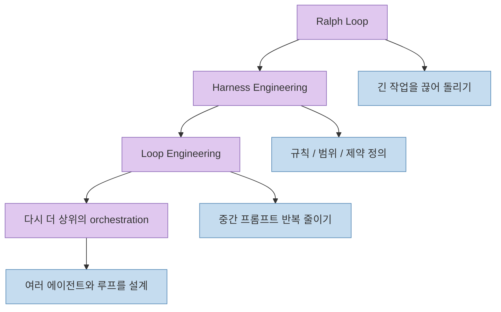
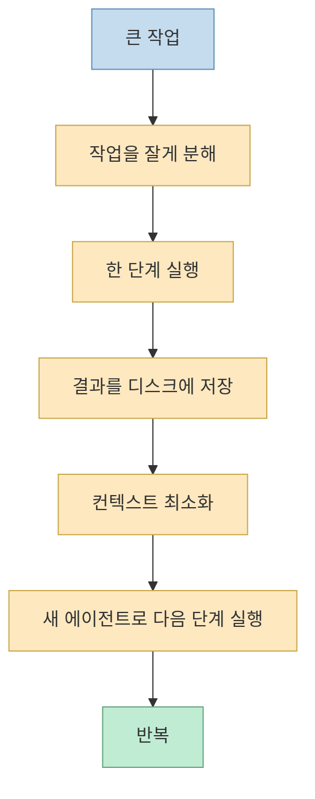
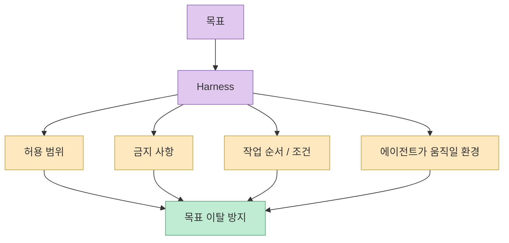
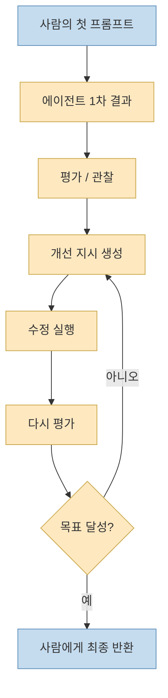
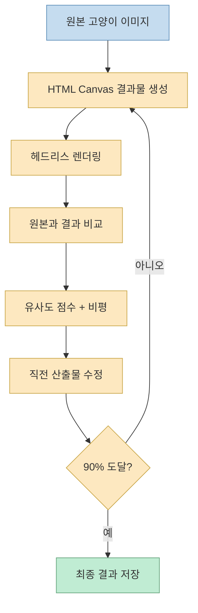

이 영상의 좋은 점은 `loop engineering` 을 신기술처럼 과장하지 않는다는 데 있습니다. 
발표자는 오히려 많은 사람이 헷갈려 하는 세 가지, 즉 **Ralph Loop**, **Harness Engineering**, **Loop Engineering** 을 한 줄 계보처럼 놓고, 이들이 서로 대립하는 개념이 아니라 **작업 규모와 목적이 다른 중첩된 기법** 이라고 설명합니다. [0:54](https://youtu.be/z-3BRkxQ5GM?t=54) [1:10](https://youtu.be/z-3BRkxQ5GM?t=70)

핵심 메시지는 단순합니다. 
요즘 다들 루프 엔지니어링을 말하니 나도 당장 모든 프로젝트를 루프로 돌려야 할 것처럼 느껴질 수 있지만, 실제로는 **작업의 크기와 반복 고통이 먼저 있어야 루프가 의미가 생긴다** 는 것입니다. 그렇지 않으면 복잡성만 늘고, 시간과 토큰만 더 쓰게 된다는 게 이 영상의 주장입니다. [9:32](https://youtu.be/z-3BRkxQ5GM?t=572) [10:17](https://youtu.be/z-3BRkxQ5GM?t=617)

<!--more-->

## Sources

- <https://youtu.be/z-3BRkxQ5GM?si=DC50DRal8qN7_RQZ>

## 세 개념의 관계는 "대립"이 아니라 "중첩"이다

영상 초반 발표자는 많은 사람이 헷갈리는 지점이 바로 이 세 가지의 차이라고 말합니다. 
그리고 이 관계를 "대립이 아니라 중첩"이라고 정리합니다. [0:50](https://youtu.be/z-3BRkxQ5GM?t=50) [1:08](https://youtu.be/z-3BRkxQ5GM?t=68)

이 말의 뜻은 다음과 같습니다.

- Ralph Loop는 긴 작업을 계속 이어서 돌리고 싶어서 나온 초기 반복 기법이다.
- Harness Engineering은 작업이 어떤 범위를 벗어나면 안 되는지, 어떤 규칙을 따라야 하는지 정의하는 방식이다.
- Loop Engineering은 그 위에서 **사람이 중간중간 다시 프롬프트를 넣어 완성도를 올리던 반복 자체를 더 자동화** 하려는 발상이다.

즉 새 개념이 이전 개념을 완전히 폐기하는 것이 아니라, **앞선 기법이 해결하지 못했던 반복 부담을 다음 단계에서 줄이는 방향** 으로 진화하고 있다는 설명입니다.

## Ralph Loop는 "문맥이 꽉 차기 전에 끊어서 계속 돌리기"에서 시작했다

발표자는 Ralph Loop를 아주 역사적인 맥락에서 설명합니다. 
이 기법이 나왔을 때는 오늘처럼 long-running agent가 자연스럽게 오래 작업할 수 있는 시대가 아니었고, 200K 컨텍스트와 `needle in a haystack` 식의 컨텍스트 열화 문제가 더 크게 체감되던 시기였다고 말합니다. [1:39](https://youtu.be/z-3BRkxQ5GM?t=99) [2:43](https://youtu.be/z-3BRkxQ5GM?t=163)

그래서 당시 핵심은 하나의 에이전트를 끝없이 오래 붙잡는 것이 아니라:

1. 작업을 잘게 쪼개고 
2. 한 번 실행한 결과만 디스크에 저장하고 
3. 최소한의 결과만 컨텍스트로 넘기고 
4. 새로운 에이전트를 다시 띄워 다음 작업을 이어 가는 것

이었습니다. [3:00](https://youtu.be/z-3BRkxQ5GM?t=180) [3:33](https://youtu.be/z-3BRkxQ5GM?t=213)

즉 Ralph Loop의 본질은 완성도를 세밀하게 끌어올리는 공정보다, **0에서 10으로 계속 전진시키는 진행성(progress)** 에 더 가깝습니다. 발표자도 이 시기의 초점이 “완성도를 높이는 것”보다는 “프로그레스를 진행시키는 것”이었다고 설명합니다. [4:04](https://youtu.be/z-3BRkxQ5GM?t=244)

## Harness Engineering은 "무엇을 하면 되고 안 되는가"를 고정하는 기술이다

영상에서 발표자는 harness engineering을 약간 다른 결의 개념이라고 설명합니다. 
자신이 목표(goal)를 실행할 때 쓰는 메타프롬프팅 안에는 이미 어떤 scope 안에서 어떻게 진행해야 하는지가 들어 있고, 이것을 파일이나 구조로 저장해 관리하면 하나의 harness가 될 수 있다고 말합니다. [4:20](https://youtu.be/z-3BRkxQ5GM?t=260) [4:48](https://youtu.be/z-3BRkxQ5GM?t=288)

여기서 중요한 포인트는 발표자가 **너무 상세한 하네스에 집착하지 말라** 고 말한다는 점입니다. 
그 이유는 두 가지입니다.

### 1. 하네스를 자세히 짤수록 시간이 오래 걸릴 수 있다

발표자는 상세한 하네스를 만들수록 시간이 더 걸리고 오히려 결과가 안 좋아질 수 있다고 지적합니다. [2:02](https://youtu.be/z-3BRkxQ5GM?t=122)

### 2. 요즘은 모델이 어느 정도 동적으로 하네스를 형성한다

그는 요즘의 강한 모델을 쓰면 어차피 다이나믹하게 하네스가 생겨나기 때문에, 사람이 해 줄 일은 그 하네스가 생겨날 **환경과 범위** 를 제공하는 수준일 수 있다고 설명합니다. [4:52](https://youtu.be/z-3BRkxQ5GM?t=292) [5:15](https://youtu.be/z-3BRkxQ5GM?t=315)

이 설명을 그대로 따르면 harness engineering의 핵심은:

- 오래 달리는 동안 목표를 잃지 않도록 하고
- 범위를 넘지 않게 하고
- 허용과 금지를 정의하고
- 여러 에이전트가 움직일 환경을 만들어 주는 것

입니다.

## Loop Engineering의 핵심은 "첫 프롬프트 제거"가 아니라 "n번째 프롬프트 감소"다

영상에서 가장 중요한 설명은 아마 이 부분입니다. 
발표자는 loop engineering을 “프롬프팅하는 나 자신조차 AI로 대체하는 것”처럼 이해하면 너무 과장되고 복잡하게 느껴진다고 말합니다. 그리고 실제로 줄여야 하는 것은 첫 프롬프트가 아니라, **결과물을 본 뒤 다시 개선시키기 위해 넣는 두 번째, 세 번째, n번째 프롬프트** 라고 설명합니다. [6:00](https://youtu.be/z-3BRkxQ5GM?t=360) [6:56](https://youtu.be/z-3BRkxQ5GM?t=416)

이 설명은 loop engineering을 훨씬 현실적으로 만듭니다.

일반적인 흐름은 이렇습니다.

1. 사람이 첫 프롬프트를 준다. 
2. 에이전트가 결과물을 만든다. 
3. 사람은 결과가 마음에 안 들어 다시 지시한다. 
4. 에이전트가 고친다. 
5. 사람이 또 보고 또 지시한다. 

loop engineering은 바로 이 3~5의 반복을 가능한 한 시스템 안으로 밀어 넣으려는 시도입니다. 발표자는 이것을 “완성도를 높이기 위해 반복해서 개입하는 구조를 줄이는 것”으로 설명합니다. [7:00](https://youtu.be/z-3BRkxQ5GM?t=420) [7:43](https://youtu.be/z-3BRkxQ5GM?t=463)

즉 loop engineering은 “AI가 알아서 다 한다”는 신화가 아니라, **사람이 직접 하던 개선 루프를 자동 평가·수정 루프로 재배치하는 것** 에 가깝습니다.

## 그래서 Loop Engineering은 "창조"보다 "완성도 상승"에 더 잘 맞는다

발표자는 loop engineering을 무에서 유를 창출하는 AGI 같은 과정으로 이해하면 오히려 헷갈린다고 말합니다. 대신 이 개념은 어떤 기능이나 결과물을 **반복적으로 평가하고 수정하면서 완성도를 올리는 과정** 으로 봐야 한다고 설명합니다. [8:00](https://youtu.be/z-3BRkxQ5GM?t=480) [8:43](https://youtu.be/z-3BRkxQ5GM?t=523)

예시로 그는 경쟁자의 A/B 테스트 방식을 복제하는 상황을 듭니다. 
한 번의 지시로 완전히 동일하게 만들 수는 없지만, similarity를 측정하고 조건을 점검하며 반복하면 점점 더 비슷하게 맞춰 갈 수 있다는 것입니다. [8:31](https://youtu.be/z-3BRkxQ5GM?t=511) [9:08](https://youtu.be/z-3BRkxQ5GM?t=548)

이 시각은 중요합니다. 
왜냐하면 loop engineering은 “뭘 만들지 모르지만 알아서 대단한 걸 만들어 줘”에 적합한 방식이 아니라:

- 목표가 비교적 분명하고
- 품질 기준이 있고
- 중간 산출물을 평가할 수 있으며
- 반복할수록 개선 여부를 판단할 수 있는

작업에 더 적합하다는 뜻이기 때문입니다.

## 작업 규모가 작으면 Loop가 오히려 독이 될 수 있다

발표자는 여기서 아주 현실적인 경고를 합니다. 
대형 프로젝트를 운영하는 사람들의 관점에서는 loop engineering이 유효할 수 있지만, 많은 시청자는 사이드 프로젝트나 PMF를 찾는 작은 제품, 또는 MVP를 막 벗어난 정도의 프로젝트에서 AI를 쓰고 있을 것이라고 말합니다. [9:28](https://youtu.be/z-3BRkxQ5GM?t=568) [10:03](https://youtu.be/z-3BRkxQ5GM?t=603)

그런 경우에는 요즘 frontier model의 성능이 충분히 좋아서:

- 울트라 코드 한 번
- 맥스 모드 한 번
- 비교적 짧은 프롬프트 몇 번

으로도 충분히 끝낼 수 있는 작업이 많습니다. 그런데 이걸 억지로 loop로 만들면:

- 루프를 설계하는 시간
- 루프를 실행하는 시간
- 추가 토큰 비용
- 결과가 마음에 안 들 때 오는 회의감

만 늘어날 수 있다고 설명합니다. [10:08](https://youtu.be/z-3BRkxQ5GM?t=608) [10:49](https://youtu.be/z-3BRkxQ5GM?t=649)

즉 loop engineering은 항상 더 고급 기법이 아니라, **프로젝트 스코프가 충분히 크고 복잡할 때만 투자 대비 효과가 커지는 기법** 이라는 것이 이 영상의 요지입니다.

## 반대로 큰 프로젝트에서는 왜 유효한가

영상 중반 이후 발표자는 큰 프로젝트에서는 상황이 달라진다고 설명합니다. 
이미 완성된 대규모 시스템에 새로운 기능을 넣을 때는, 단순히 기능 하나를 만드는 것이 아니라 그 기능이 기존 기능들과 **유기적으로 융화되고 다른 부분을 깨뜨리지 않는지** 검증하는 것이 더 중요해집니다. [11:00](https://youtu.be/z-3BRkxQ5GM?t=660) [11:32](https://youtu.be/z-3BRkxQ5GM?t=692)

이때 사람이 매번:

- 기능 생성 프롬프트
- 검증 프롬프트
- 개선 프롬프트
- 테스트 작성 프롬프트
- E2E 추가 프롬프트

를 반복해서 넣는 대신, 필요한 조건을 한 번 정리해 두고 **100% 완성도가 올라갈 때까지 자동으로 돌게 만드는 것** 이 loop engineering의 강점이라고 설명합니다. [11:36](https://youtu.be/z-3BRkxQ5GM?t=696) [12:12](https://youtu.be/z-3BRkxQ5GM?t=732)

따라서 loop engineering이 특히 빛나는 상황은:

- 기존 시스템이 크고
- 영향 반경이 넓고
- 자동 검증 조건을 명시할 수 있으며
- 완성도 기준이 분명한

경우입니다.

## 고양이 데모가 보여 주는 것은 "평가 가능한 목표"에서의 루프다

발표자는 이를 보여 주기 위해 고양이 이미지를 HTML canvas + JavaScript로 최대한 비슷하게 그리는 루프 데모를 소개합니다. [12:32](https://youtu.be/z-3BRkxQ5GM?t=752) [13:04](https://youtu.be/z-3BRkxQ5GM?t=784)

여기서 설정된 루프는 매우 전형적입니다.

- 목표: 주어진 이미지를 최대한 비슷하게 그리기
- 기준: 유사도 90%
- 행동: 직전 최고의 결과물에 비평을 반영해 수정
- 관찰: 헤드리스 렌더링으로 결과 확인
- 검증: 원본과 결과를 비교해 0~100 점수와 비평 작성
- 상태 저장: 리뷰 JSON, 상태 JSON, n번째 결과 저장

발표자는 이런 식으로 23번째 iteration까지 가면서, 처음엔 대충 그려진 고양이가 점점 더 입체적이고 비슷하게 개선되는 과정을 보여 줍니다. [13:24](https://youtu.be/z-3BRkxQ5GM?t=804) [14:08](https://youtu.be/z-3BRkxQ5GM?t=848)

이 데모가 중요한 이유는 loop engineering이 잘 맞는 작업의 조건을 드러내기 때문입니다.

- 목표가 명확하다
- 비교 대상이 있다
- 점수를 매길 수 있다
- 무엇을 바꾸면 더 좋아질지 비평할 수 있다

즉 이 방식은 **평가 함수가 있는 반복 개선 작업** 에 잘 맞습니다.

## 새로운 유행어가 나올 때는 "내 pain point와 맞는가"부터 봐야 한다

영상 후반의 가장 좋은 조언은 이것입니다. 
새 기법은 유행한다고 바로 도입할 것이 아니라, 내가 작업하면서 실제로 반복 고통을 느끼는 지점에서 자연스럽게 필요해질 때 써야 한다는 것입니다. 발표자는 Ralph Loop, harness engineering, loop engineering 모두 결국 반복적인 pain point에서 나왔다고 설명합니다. [16:12](https://youtu.be/z-3BRkxQ5GM?t=972) [16:56](https://youtu.be/z-3BRkxQ5GM?t=1016)

정리하면:

- 다음 단계라고 계속 말해 줘야 해서 생긴 것이 Ralph Loop
- 이것 하지 마, 저것 하지 마를 계속 말해야 해서 생긴 것이 harness engineering
- 기능 완성도를 올리기 위해 계속 개입해야 해서 생긴 것이 loop engineering

입니다. [16:23](https://youtu.be/z-3BRkxQ5GM?t=983) [16:52](https://youtu.be/z-3BRkxQ5GM?t=1012)

그래서 발표자는 이런 개념을 너무 신격화하지 말라고 말합니다. 
유명한 사람들이 “우리는 이제 loop engineering 한다”고 말해도, 어떤 사람은 이미 다른 이름으로 비슷한 것을 하고 있을 수도 있고, 어떤 사람은 아직 자기 작업 규모에서 그게 필요하지 않을 수도 있다는 것입니다. [17:08](https://youtu.be/z-3BRkxQ5GM?t=1028) [17:33](https://youtu.be/z-3BRkxQ5GM?t=1053)

## 결국 다음 단계는 다시 Harness 쪽으로 돌아갈 가능성이 크다

영상 마지막에서 발표자는 앞으로는 여러 에이전트 함대(fleet)를 디자인하는 이야기로 넘어갈 것이고, 그러면 결국 다시 harness engineering 쪽으로 돌아오게 된다고 말합니다. [17:52](https://youtu.be/z-3BRkxQ5GM?t=1072) [18:28](https://youtu.be/z-3BRkxQ5GM?t=1108)

이 관찰은 꽤 설득력 있습니다. 
왜냐하면 loop를 오래 돌리고 여러 에이전트가 동시에 움직이는 순간, 결국 다시 중요한 것은:

- 어떤 에이전트가 무엇을 맡는지
- 어떤 규칙 아래서 움직이는지
- 어떤 상태를 공유하는지
- 무엇을 하면 안 되는지

를 정의하는 상위 orchestration이기 때문입니다.

즉 abstraction level이 올라갈수록, loop engineering은 harness engineering을 대체하기보다 오히려 **더 정교한 harness를 필요로 하게 된다** 는 결론에 가까워집니다.

## 핵심 요약

- 이 영상은 Ralph Loop, harness engineering, loop engineering을 서로 싸우는 개념이 아니라 중첩된 진화 단계로 설명한다. [1:08](https://youtu.be/z-3BRkxQ5GM?t=68)
- Ralph Loop의 핵심은 컨텍스트 열화 시대에 작업을 잘게 끊고 새 에이전트로 이어 돌리며 진행성을 확보하는 것이었다. [3:00](https://youtu.be/z-3BRkxQ5GM?t=180)
- Harness engineering은 작업 범위, 허용/금지, 환경을 정의해 오래 달리는 에이전트가 목표를 잃지 않게 만드는 방식이다. [4:48](https://youtu.be/z-3BRkxQ5GM?t=288)
- Loop engineering의 핵심은 첫 프롬프트를 없애는 것이 아니라, 결과물을 보고 다시 개선 지시를 넣는 n번째 프롬프트 반복을 줄이는 것이다. [6:56](https://youtu.be/z-3BRkxQ5GM?t=416)
- 이 기법은 작은 프로젝트에서는 오히려 과투자일 수 있고, 큰 프로젝트에서 기능을 기존 시스템에 유기적으로 융화시켜야 할 때 더 큰 효과를 낸다. [10:17](https://youtu.be/z-3BRkxQ5GM?t=617) [11:36](https://youtu.be/z-3BRkxQ5GM?t=696)
- 결국 더 상위 단계로 가면 여러 에이전트와 루프를 제어하는 다시 넓은 의미의 harness 설계로 돌아가게 된다. [18:28](https://youtu.be/z-3BRkxQ5GM?t=1108)

## 결론

이 영상이 주는 가장 유용한 안심은, `loop engineering` 이 등장했다고 해서 당장 모든 사람이 프로젝트를 루프로 감싸야 하는 것은 아니라는 점입니다. 
중요한 것은 유행어를 따라가는 것이 아니라, **내가 지금 반복해서 겪는 고통이 무엇인지** 를 먼저 보는 것입니다.

반복적으로 다음 단계를 눌러 줘야 한다면 Ralph Loop가 필요할 수 있고, 에이전트가 자꾸 선을 넘는다면 harness engineering이 필요할 수 있고, 결과물 완성도를 높이기 위해 사람이 계속 개입하고 있다면 그때 비로소 loop engineering이 의미를 가질 수 있습니다. 
즉 세 기법의 차이는 철학의 차이라기보다, 결국 **어떤 규모의 작업을 어디까지 자동화하려는가** 의 차이로 보는 편이 가장 정확해 보입니다.
