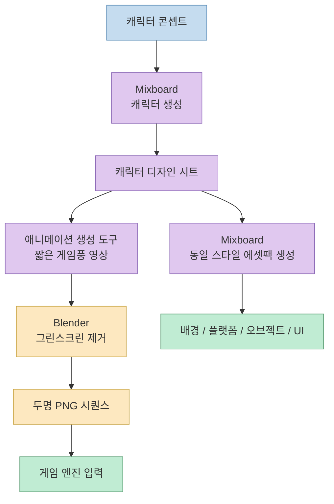
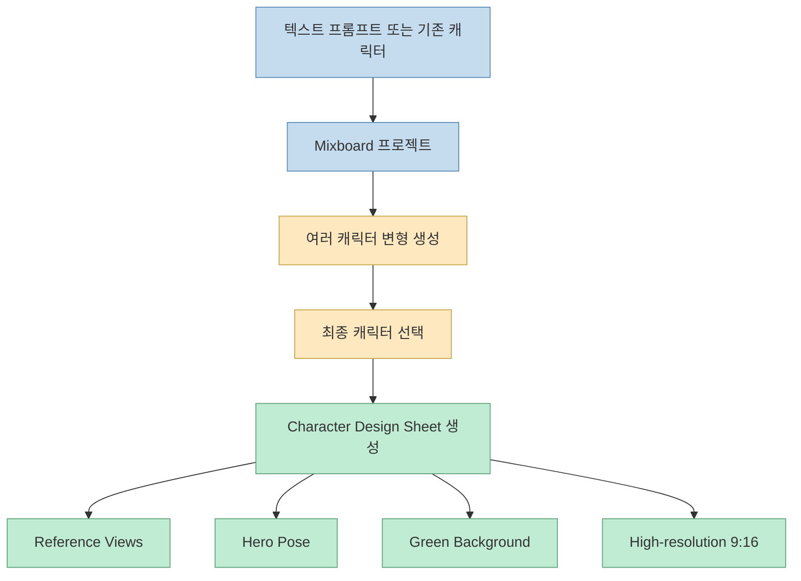
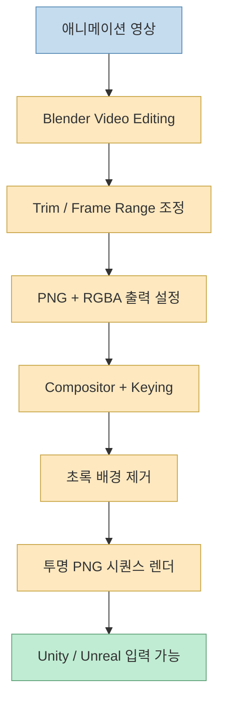
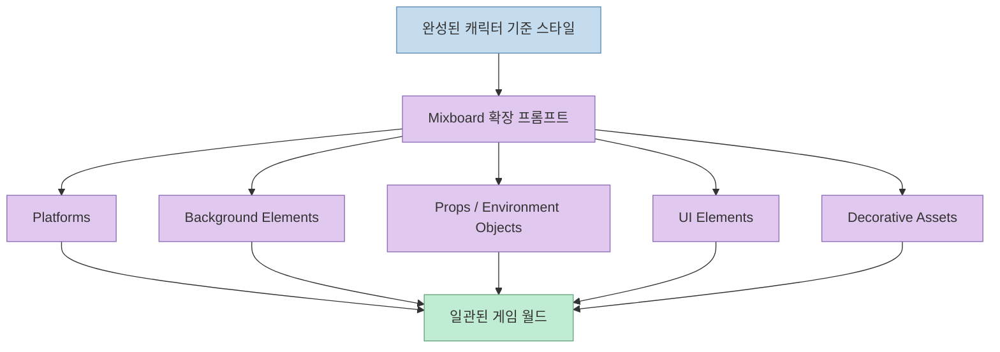

이 영상의 핵심은 “AI로 그림을 만든다”가 아니라, **2D 게임에 바로 넣을 수 있는 자산 묶음을 어떤 순서로 만들 것인가** 를 아주 짧고 선명한 파이프라인으로 정리해 준다는 데 있습니다. 
발표자는 무료 도구만으로 캐릭터, 애니메이션, 배경, 플랫폼, 장식 요소까지 포함한 **complete 2D game asset pack** 을 만들겠다고 선언하고, 수작업 드로잉 없이도 일관된 자산 세트를 확보하는 흐름을 보여 줍니다. [0:00](https://youtu.be/vOvYazUBlpQ?t=0) [0:18](https://youtu.be/vOvYazUBlpQ?t=18)

특히 이 영상이 유용한 이유는 생성 모델 하나에 모든 걸 맡기지 않는다는 점입니다. 
캐릭터 일관성을 잡는 단계, 짧은 게임풍 애니메이션을 만드는 단계, 배경을 제거해 게임 엔진용 PNG 시퀀스로 바꾸는 단계, 같은 스타일의 환경 에셋팩으로 확장하는 단계를 분리해 보여 줍니다.

<!--more-->

## Sources

- <https://youtu.be/vOvYazUBlpQ?si=nlIbMhba0rhX4Qne>

## 이 영상이 제안하는 전체 파이프라인

영상은 총 네 단계로 흐릅니다.

1. Mixboard에서 캐릭터 생성 
2. 애니메이션 생성 도구에서 짧은 2D 게임풍 영상 생성 
3. Blender에서 그린스크린 제거 후 PNG 시퀀스 렌더링 
4. 다시 Mixboard로 돌아가 동일 스타일의 에셋팩 생성 

이 구조를 보면 목적이 분명합니다. 
처음부터 스프라이트시트를 직접 뽑는 것이 아니라, 먼저 **캐릭터 정체성을 고정** 하고, 그 다음 움직임을 얻고, 마지막에 게임 엔진이 쓰기 좋은 형식으로 변환한 뒤, 같은 미감의 주변 자산으로 확장합니다. [0:28](https://youtu.be/vOvYazUBlpQ?t=28) [4:35](https://youtu.be/vOvYazUBlpQ?t=275)

## 1. 첫 단계의 핵심은 "멋진 캐릭터 한 장"이 아니라 "일관성 잠금"이다

영상 초반 발표자는 Mixboard를 무료 AI 도구로 소개하면서, 먼저 캐릭터를 생성하거나 기존 캐릭터를 업로드한 뒤 **professional character design sheet** 를 만들라고 안내합니다. [0:30](https://youtu.be/vOvYazUBlpQ?t=30) [1:08](https://youtu.be/vOvYazUBlpQ?t=68)

여기서 중요한 건 결과물이 단순 초상화가 아니라:

- 상단에 여러 reference view
- 하단에 final hero pose

를 가진 디자인 시트라는 점입니다. 발표자는 이 시트가 캐릭터 디자인을 **100% consistent** 하게 잠그고, 이후 애니메이션을 위한 준비 단계라고 설명합니다. 또 초록 배경을 사용해 나중에 제거하기 쉽게 만든다고 말합니다. [1:18](https://youtu.be/vOvYazUBlpQ?t=78) [1:36](https://youtu.be/vOvYazUBlpQ?t=96)

즉 이 단계의 목표는 “예쁜 그림”보다:

- 캐릭터 외형 기준 확보
- 여러 뷰 정리
- 그린스크린 준비
- 애니메이션 입력용 고해상도 원본 확보

에 있습니다.

이 관점은 중요합니다. 
게임 자산 제작에서 가장 흔한 문제는 프레임마다 캐릭터 얼굴, 의상, 비율이 흔들리는 것인데, 발표자는 처음부터 design sheet를 만들어 **시각적 동일성** 을 먼저 고정하려고 합니다.

## 2. 애니메이션 단계의 포인트는 "짧은 게임플레이풍 영상"을 먼저 얻는 것이다

다음 단계에서 발표자는 자막상 `Gro` 혹은 `Grok`처럼 들리는 무료 AI 도구를 사용해 애니메이션 영상을 만든다고 설명합니다. 자막만으로는 정확한 표기가 다소 불분명하지만, 역할은 분명합니다. **프롬프트와 reference image를 받아 짧은 animated video를 생성하는 도구** 입니다. [1:42](https://youtu.be/vOvYazUBlpQ?t=102) [2:02](https://youtu.be/vOvYazUBlpQ?t=122)

여기서 넣는 프롬프트는 “Create a 6-second animated video that simulates a 2D sidescroller video game scene” 입니다. 발표자는 이렇게 하면 gameplay style animation을 만들 수 있고, 앞에서 캐릭터 디자인을 잠가 두었기 때문에 애니메이션에서도 캐릭터 일관성이 유지된다고 설명합니다. [2:00](https://youtu.be/vOvYazUBlpQ?t=120) [2:20](https://youtu.be/vOvYazUBlpQ?t=140)

이 방식의 장점은 명확합니다.

- 처음부터 프레임 단위 스프라이트시트를 만들지 않아도 된다
- 먼저 “움직이는 장면”을 얻을 수 있다
- 캐릭터 외형 일관성을 reference image가 잡아 준다

즉 이 단계는 게임용 애니메이션을 직접 설계하는 것이 아니라, **게임처럼 보이는 움직임을 영상 형태로 먼저 확보하는 것** 에 가깝습니다.

다만 영상은 여기서 스프라이트시트 직접 생성보다 video-first 접근을 택하기 때문에, 후속 단계에서 게임 엔진용 형식으로 다시 바꾸는 작업이 필요해집니다.

## 3. Blender의 역할은 생성 결과를 "게임 엔진이 먹을 수 있는 포맷"으로 번역하는 것이다

영상의 세 번째 단계는 Blender입니다. 
발표자는 Blender를 무료 오픈소스 3D 제작 및 비디오 편집 소프트웨어라고 소개한 뒤, Video Editing으로 들어가 방금 만든 애니메이션 영상을 불러오라고 설명합니다. [2:28](https://youtu.be/vOvYazUBlpQ?t=148) [2:40](https://youtu.be/vOvYazUBlpQ?t=160)

이후 단계는 꽤 실무적입니다.

- 필요하면 영상 길이를 trim
- frame range를 끝 지점에 맞춤
- output 위치 지정
- media type은 image
- file format은 PNG
- color는 RGBA

즉 비디오 파일을 최종 산출물로 쓰는 것이 아니라, **알파 채널이 있는 프레임 시퀀스** 로 바꾸려는 것입니다. [2:52](https://youtu.be/vOvYazUBlpQ?t=172) [3:16](https://youtu.be/vOvYazUBlpQ?t=196)

그리고 strip modifiers에서 compositor를 추가하고, compositor workspace에서 keying 노드를 넣은 뒤 eyedropper로 초록 배경을 샘플링합니다. 이렇게 하면 캐릭터 뒤의 green screen이 제거되고 투명 배경이 생깁니다. black level로 키잉 결과를 미세 조정할 수 있다고도 설명합니다. [3:36](https://youtu.be/vOvYazUBlpQ?t=216) [4:08](https://youtu.be/vOvYazUBlpQ?t=248)

이 단계의 의미는 매우 분명합니다. 
AI가 만든 결과물이 “그럴듯한 영상”인 것과 “게임 엔진에 넣을 수 있는 자산”인 것은 다르기 때문입니다. Blender는 그 중간에서:

- 배경 제거
- 프레임 추출
- 알파 채널 확보
- 엔진 친화적 PNG 시퀀스화

를 담당합니다.

## 4. 캐릭터 하나가 끝나면, 같은 스타일의 월드 에셋으로 확장한다

마지막 단계에서 발표자는 다시 Mixboard로 돌아가, 처음 만든 캐릭터를 기반으로 **complete and consistent 2D game asset pack** 을 생성하라고 설명합니다. [4:34](https://youtu.be/vOvYazUBlpQ?t=274) [4:48](https://youtu.be/vOvYazUBlpQ?t=288)

이 프롬프트로 생성되는 항목은 다음과 같습니다.

- platforms
- background elements
- props
- environment objects
- UI elements
- decorative assets

즉 목표는 캐릭터 하나를 잘 만드는 것이 아니라, 캐릭터와 **같은 미감의 게임 월드 전체를 빠르게 묶어 내는 것** 입니다. 발표자는 이것이 “professional-look game world in minutes”를 만드는 방식이라고 설명합니다. [4:56](https://youtu.be/vOvYazUBlpQ?t=296) [5:12](https://youtu.be/vOvYazUBlpQ?t=312)

이 단계가 중요한 이유는, 실제 게임에서 어색함은 종종 캐릭터보다도 **캐릭터와 배경/플랫폼/UI의 스타일 불일치** 에서 오기 때문입니다. 
영상은 이 문제를 “동일 캐릭터를 reference로 잡은 확장 생성”으로 해결하려고 합니다.

## 이 워크플로우의 장점과 한계

영상이 보여 주는 워크플로우는 분명히 매력적입니다. 
무료 도구 위주로, 드로잉 없이, 비교적 짧은 단계만으로 게임에 넣을 수 있을 것 같은 자산 세트를 만드는 흐름을 제시하기 때문입니다.

### 장점

#### 1. 입문 장벽이 낮다

캐릭터, 애니메이션, 배경 제거, 환경 에셋 확장을 모두 각 단계별 툴로 나눠서 보여 주기 때문에, 처음 시작하는 사람도 흐름을 이해하기 쉽습니다.

#### 2. "일관성"을 가장 먼저 다룬다

reference view가 있는 character sheet와 green background를 먼저 확보하기 때문에, 후속 단계 품질이 무너질 가능성을 줄이려는 설계가 보입니다.

#### 3. 게임 엔진 친화적 산출물로 끝난다

영상이 끝나는 지점이 단순 MP4가 아니라 RGBA PNG sequence라는 점은 실용적입니다. 발표자도 이 결과물을 Unity나 Unreal Engine에 넣을 수 있다고 말합니다. [4:18](https://youtu.be/vOvYazUBlpQ?t=258)

### 한계

#### 1. 스프라이트 정규화·프레임 선택 이야기는 거의 없다

이 영상은 video-to-PNG 흐름은 보여 주지만, walk cycle에서 어떤 프레임을 버릴지, foot anchoring을 어떻게 할지, sprite sheet packing을 어떻게 할지 같은 후속 실무는 거의 다루지 않습니다.

#### 2. "완전한 게임 자산"과 "초기 프로토타입 자산"은 다르다

영상의 파이프라인은 빠른 프로토타이핑에는 매우 유용해 보이지만, 상업용 품질에서 필요한 정밀한 프레임 제어, 충돌 박스 기준, 타일셋 정합성, UI 상태별 분화 같은 문제는 별도 작업이 필요할 가능성이 큽니다. 이 부분은 영상에서 구체적으로 다루지 않으므로 과신하면 안 됩니다.

#### 3. 애니메이션 생성 도구 표기가 자막상 다소 불명확하다

자막에서는 `Gro` 혹은 `Grok`처럼 들리지만 정확한 표기는 영상 설명란을 직접 확인해야 더 확실합니다. 따라서 이 부분은 영상 자막 기반 단일 소스로 읽는 편이 안전합니다.

## 핵심 요약

- 이 영상은 무료 AI 도구와 Blender를 조합해 2D 게임 자산을 만드는 4단계 워크플로우를 제시한다. [0:00](https://youtu.be/vOvYazUBlpQ?t=0)
- 첫 단계의 핵심은 character design sheet를 만들어 캐릭터 외형과 reference view를 고정하는 것이다. [1:08](https://youtu.be/vOvYazUBlpQ?t=68)
- 두 번째 단계는 reference image 기반으로 6초짜리 sidescroller 스타일 애니메이션 영상을 생성하는 것이다. [2:00](https://youtu.be/vOvYazUBlpQ?t=120)
- 세 번째 단계에서 Blender는 green screen 제거와 PNG RGBA 시퀀스 렌더링을 맡아 게임 엔진 친화적 포맷으로 번역한다. [3:36](https://youtu.be/vOvYazUBlpQ?t=216) [4:18](https://youtu.be/vOvYazUBlpQ?t=258)
- 마지막 단계는 같은 캐릭터 스타일을 기준으로 플랫폼, 배경, 오브젝트, UI까지 포함한 일관된 에셋팩으로 확장하는 것이다. [4:48](https://youtu.be/vOvYazUBlpQ?t=288)
- 따라서 이 파이프라인의 진짜 가치는 단일 이미지 생성보다 **일관된 스타일의 게임 자산 묶음을 빠르게 확보하는 데** 있다.

## 결론

이 영상은 AI 게임 자산 제작을 거대한 창작 문제로 다루기보다, **일관성 확보 → 움직임 생성 → 배경 제거 → 월드 확장** 이라는 생산 공정으로 정리해 준다는 점에서 유용합니다. 
특히 캐릭터 하나만 잘 뽑는 데서 끝나지 않고, 같은 스타일의 환경 에셋까지 묶어 가는 흐름을 보여 준다는 점이 좋습니다.

다만 이 워크플로우는 어디까지나 빠른 프로토타이핑에 강한 구조로 보는 편이 안전합니다. 
실제 게임에 깊게 넣으려면 스프라이트 정규화, 프레임 선별, 엔진 통합 규칙 같은 추가 공정이 필요할 가능성이 큽니다. 그래도 출발점으로서는 꽤 괜찮은 “무료 AI 기반 2D 게임 자산 공장”의 뼈대를 보여 주는 영상입니다.
